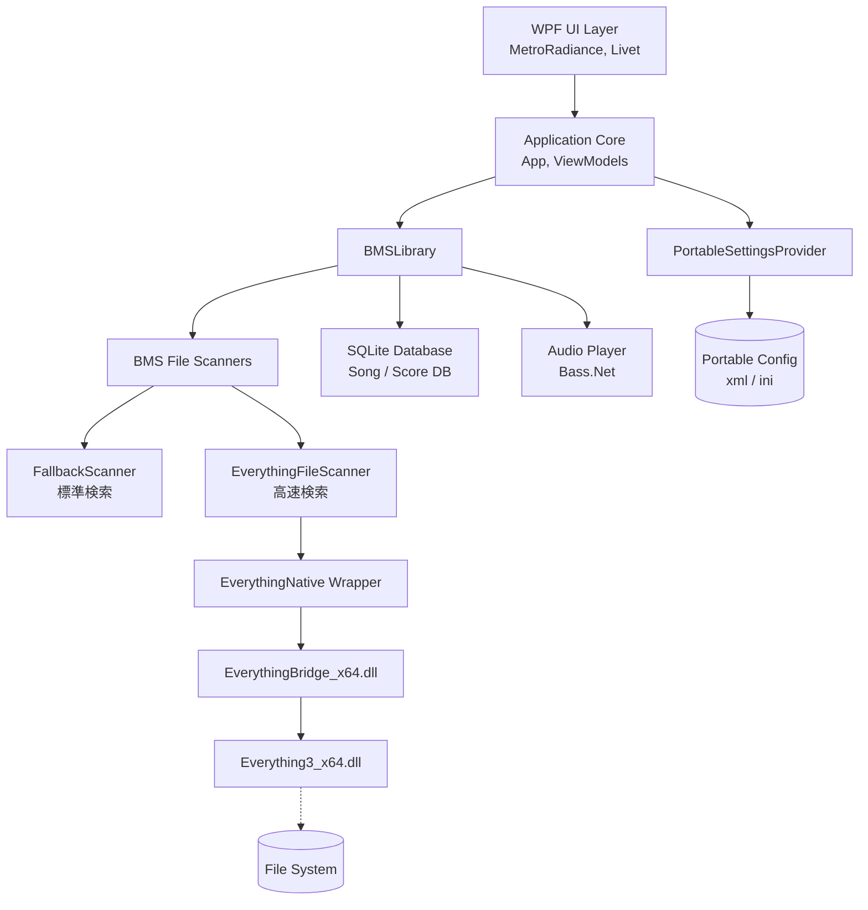
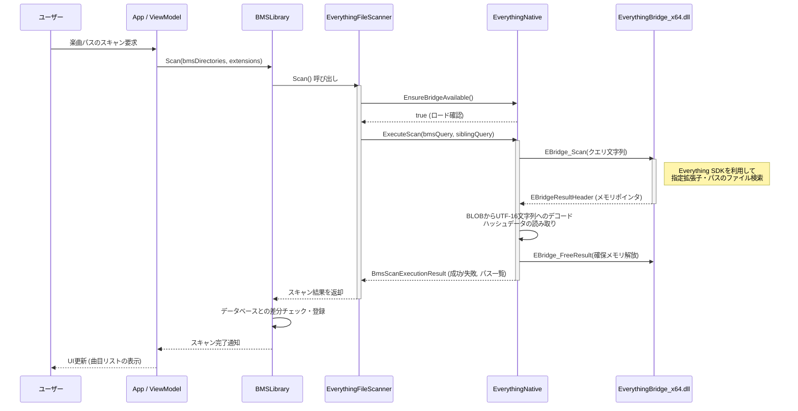

# BeMusicSeeker-decomp 技術仕様書

本ドキュメントは、デコンパイル・改修された `BeMusicSeeker` (BeMusicSeeker-decomp) のシステムアーキテクチャ、技術スタック、主要フロー、およびAPI定義について記述します。

## 1. システム構成図

全体的なシステム構成および主要なモジュール間の関係を以下に示します。



## 2. 使用技術スタック

本プロジェクトは以下の技術要素で構成されています。

| カテゴリ                   | 技術・ライブラリ                      | 概要・用途                                                                                       |
| -------------------------- | ------------------------------------- | ------------------------------------------------------------------------------------------------ |
| **言語・フレームワーク**   | C# (C# 7.0+), .NET Framework 4.7.2    | ロジック実装、Windows Desktop向けベースフレームワーク                                            |
| **UI・プレゼンテーション** | WPF (Windows Presentation Foundation) | デスクトップアプリケーションのGUI描画                                                            |
| **UIフレームワーク**       | Livet, MetroRadiance                  | MVVMアーキテクチャ基盤、およびモダンなWindows UIテーマ                                           |
| **データベース**           | sqlite.net                            | 楽曲メタデータ(SongDB)およびスコアデータ(ScoreDB)のローカル管理                                  |
| **オーディオ処理**         | BASS.NET                              | BMSのプレビュー再生・音声処理                                                                    |
| **ファイル高速検索**       | Everything SDK (C API)                | `Everything3_x64.dll` 及び `EverythingBridge_x64.dll` を介したBMSファイル/フォルダの高速スキャン |
| **ユーティリティ**         | NLog                                  | アプリケーションの動作ログ出力(通常・エラーログ)                                                 |
| **ユーティリティ**         | SevenZipExtractor                     | アーカイブ解凍、パッケージインストール                                                           |
| **ユーティリティ**         | DynamicJson                           | IR(Internet Ranking)通信等のJSONデータパース処理                                                 |

## 3. 主要コンポーネント間のシーケンス図

ここでは、アプリケーションの代表的なユースケースである **"BMSファイルの高速スキャン (Everything連携)"** のフローを示します。



## 4. API定義

本プロジェクトにおいて新設・主要なAPIとなる **Everything連携ブリッジAPI (C/C++ Native -> C#)** のインターフェース定義を示します。

### 4.1. EverythingBridge_x64.dll エクスポート関数

ネイティブDLL層で公開されている関数です。WPFアプリ (C#) の `EverythingNative` クラスから `P/Invoke` (DllImport) により呼び出されます。

#### `EBridge_Scan`

Everything検索クエリを実行し、結果を一括で取得するための関数です。

- **署名**:

    ```csharp
    [DllImport("EverythingBridge_x64.dll", CharSet = CharSet.Unicode, CallingConvention = CallingConvention.Cdecl)]
    private static extern int EBridge_Scan(string bmsQuery, string siblingQuery, out IntPtr outResult);
    ```

- **引数**:
  - `bmsQuery` (in): BMSファイルの検索クエリ文字列。
  - `siblingQuery` (in): 同一ディレクトリに存在する関連ファイル(画像/音声等)の検索クエリ文字列。
  - `outResult` (out): 検索結果を格納した `EBridgeResultHeader` 構造体へのメモリポインタ。

- **戻り値**: 実行結果のステータスコード (`0` ならば成功)。

#### `EBridge_FreeResult`

`EBridge_Scan` でポインタとして確保されたネイティブメモリを解放します。（メモリリーク防止用）

- **署名**:

    ```csharp
    [DllImport("EverythingBridge_x64.dll", CallingConvention = CallingConvention.Cdecl)]
    private static extern void EBridge_FreeResult(IntPtr result);
    ```

- **引数**:
  - `result` (in): 解放対象のメモリポインタ。

### 4.2. EBridgeResultHeader 構造体

`outResult` ポインタが示すメモリブロックのヘッダ構造です。取得したパス情報やハッシュ情報が一連のBLOB（バイナリラージオブジェクト）としてパックされています。

```csharp
[StructLayout(LayoutKind.Sequential)]
private struct EBridgeResultHeader
{
    public int status;             // 処理ステータスコード
    public int error_code;         // エラーコード
    public ulong bms_count;        // ヒットしたBMSファイルの数
    public IntPtr bms_offsets;     // BMSファイルパス(UTF-16)のオフセット配列
    public IntPtr bms_blob;        // BMSファイルパス文字列データの実体
    public ulong dir_count;        // ディレクトリの数
    public IntPtr dir_offsets;     // ディレクトリパスのオフセット配列
    public IntPtr dir_blob;        // ディレクトリパス文字列データの実体
    public IntPtr dir_hash_offsets;// ディレクトリごとのハッシュのオフセット
    public IntPtr dir_hash_lengths;// ディレクトリごとのハッシュデータ長
    public IntPtr hashes_blob;     // ハッシュデータの実体
    public ulong raw_buffer_size;  // 確保されたバッファの合計サイズ
}
```

### 4.3. C# 内部モデル

`EverythingFileScanner` が返すラップされた内部APIのデータ構造です。

```csharp
public class BmsScanExecutionResult
{
    public bool Success { get; set; }           // スキャンの成功可否
    public string ErrorReason { get; set; }     // エラーが起きた場合の理由
    public bool NativeBridgeUsed { get; set; }  // Everything Native Bridge が利用されたか
    public long NativeBridgeMs { get; set; }    // 検索にかかった時間(ms)
    
    public BmsScanResult Result { get; set; }   // 検索結果オブジェクト本体
}

public class BmsScanResult
{
    // 発見されたBMSファイルのフルパス一覧
    public HashSet<string> BmsFilePaths { get; set; }
    
    // ディレクトリと、そこに含まれるBMS関連ファイルのリスト
    public Dictionary<string, List<string>> FilesByDirectory { get; set; }
    
    // パフォーマンス比較・検証用：ディレクトリごとのファイルハッシュ
    public Dictionary<string, uint[]> FileNameHashesByDirectory { get; set; }
}
```

これらの連携機能と拡張により、元のシステムから大幅な楽曲スキャンパフォーマンス向上とポータブルでの運用が可能になっています。

## 5. BMS差分導入先推定ロジック

本アプリケーションでは、ユーザーがWAVやBGAなどのマルチメディアファイルを含まない「BMS差分パッケージ（追加譜面など）」を導入する際、対応する本体データを保持する既存の楽曲フォルダを自動で探し出し、そこへインストールする独自ロジックを備えています。

### 5.1. 処理フロー

推定ロジックの実体は `BMSLibrary` クラスの `searchEstimatedInstallationDirectory` メソッドです。

1. **代表ファイルの選出**
   インストール対象のBMSファイル群の中から、最も依存ファイル（参照するWAV/OGG/BGAや背景画像など）の定義数が多いものを「代表BMSファイル」として選出します。これにより、推定の際のスコア（充足度合）の分解能を高めます。
   
2. **事前ハッシュフィルタリングによる候補絞り込み (高速化)**
   代表BMSファイルが要求する依存ファイル名（WAV等）のハッシュ値セットを抽出し、既存の全BMSフォルダ群の事前計算ハッシュ配列（`BMSDirectoryFileNameHash`連携）と突き合わせます。
   要求するファイルが1つも存在しない無関係なフォルダをこの段階で完全に除外することで、後続の重いシミュレーション処理を大幅にスキップします。

3. **仮想配置シミュレーション**
   絞り込まれた候補フォルダに対して、選出した代表BMSファイルを仮想的に配置した場合の「依存ファイルの充足度（健康度 / Health）」を計算します。
   
4. **最適フォルダの決定**
   各候補フォルダにおける健康度を比較し、「単独の状態よりもWAVの欠損が少なくなる（閾値以上に改善する）」フォルダの候補をリスト化します。
   その後、以下の優先順位でソートを行い、最上位のものをインストール先として決定します。
   - WAVファイルの充足度（降順）
   - BGAファイルの充足度（降順）
   - ムービーファイル、画像の充足度（降順）
   - ※同率の場合は、対象フォルダ内のWAVファイル絶対数が多い方を優先

### 5.2. 設計意図・背景

BMSの差分機能は仕様上、本体のWAVファイル等と同じディレクトリ構造内にファイルを置かなければ音が鳴らない・動作しない状態になります。
従来のパッケージドラッグ＆ドロップによる自動インストールでは、追加譜面が独立した新規フォルダに保存されてしまう問題がありました。このマッチング・スコア評価を用いた仮想配置シミュレーションにより「WAVの欠損関係が最も綺麗に解消されるフォルダ」を発見・統合できるようになり、ユーザビリティ・プレイ体験の向上が図られています。
また、全BMSフォルダでの完全な総当たりシミュレーションはパフォーマンス上のボトルネックでしたが、事前ハッシュマッチング機構の導入により、精度を落とすことなく対象候補を数万規模から数個へ一瞬で絞り込む劇的な高速化が図られています。
