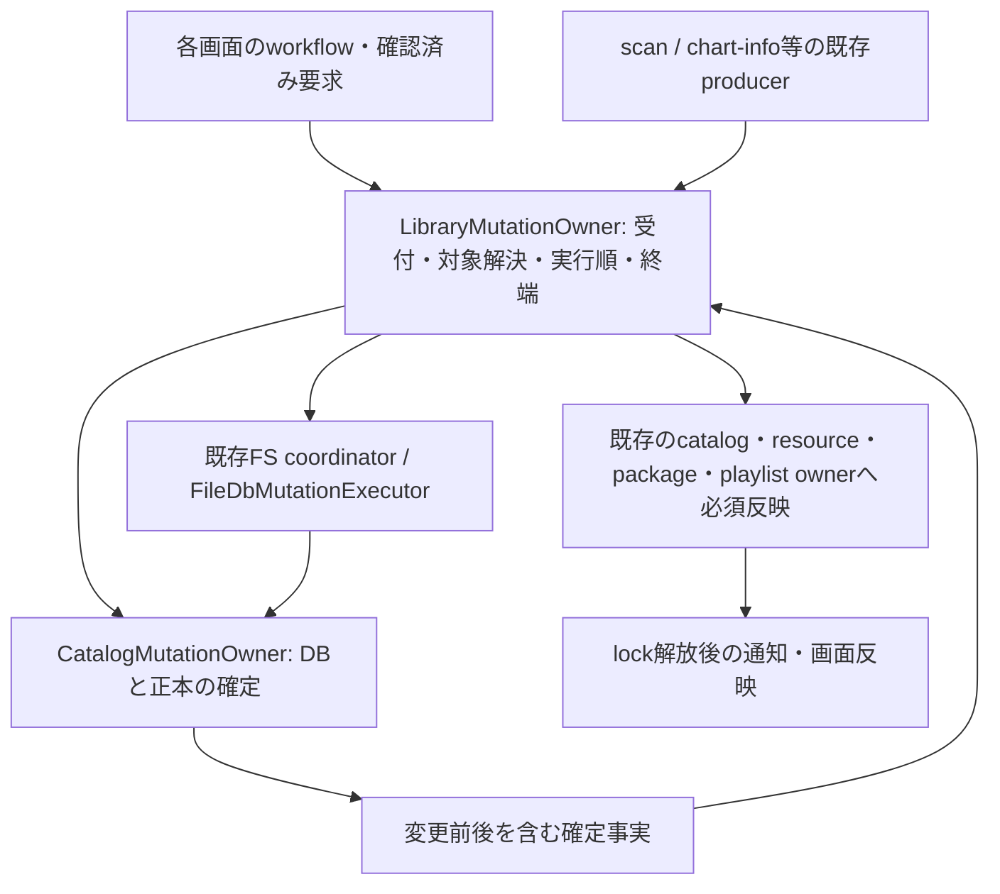

# ライブラリ変更要求の統合と操作全体の性能改善計画

状態: 利用者がU1～U5の実装・単位ごとの必要なcommitを承認。U1完了commit e6b58ffc。U2実装・検証・独立レビュー完了（修正必須指摘なし）。U3の独立テスト設計承認済み（2026-09-13）。調査基準は `6d35c789`、計画記録commitは `007b3216`。

## 1. 目的と結論

利用者の変更要求を管理する責務を明確にし、実ファイル・DB・正本・索引・必要な表示反映まで、同じ確定した変更内容を使って完了させる。個々の索引の高速化だけでなく、実際の操作入口から不要な全件処理へ到達しないことを完了条件とする。本書は次の実装の提案であり、現在この構成が実装済みであることを示さない。

現状は「変更管理が存在しない」状態ではない。受付、FS/DBの確定処理、catalogのwriterは既に共通化されている。しかし、操作別の変更内容の組立てと、`BMSLibrary` に残る索引・通知の判断が一つの契約になっていない。旧入口・テスト専用に残った入口・本番用の派生入口も混在している。利用者が指摘した局所最適の懸念は、特にこの境界に当てはまる。

[前計画のR5b](BeMusicSeeker-library-mutation-performance.md#r5b--派生索引の失効範囲を限定する)は、索引へ十分な差分が届く場合の改善を実装した一方、連続マージの本番経路に差分が届くことを完了条件として確認できていなかった。[提供ログの再評価](../acceptance/duplicate-merge-performance-2026-09-13.md)では、2回とも索引の全件構築がモデル処理時間の87～92%を占める。R5bの操作全体としての完了判定を取り下げ、本計画で残件を扱う。

### 用語と正本

| 用語 | 意味・対応するコード |
| --- | --- |
| 変更要求 | 削除・マージなど、何をしたいかと確認済みの対象範囲。索引の失効方法を含めない。 |
| 確定した変更事実 | 実際に保存・除去・移動できた対象と、その変更前後の値。既存 `CatalogMutationReceipt` 等を整理して使う。 |
| 変更管理 | 要求の受付、現在の対象への解決、実行順、確定結果の反映、終端を管理する責務。提案名 `LibraryMutationOwner`。 |
| 派生状態 | 所持hash、導入済みlookup、playlist解決、resource索引、警告・表示など、正本から得る状態。 |

[性能・規模](../spec/performance-and-scale.md)、[受付・並行性](../spec/workflow-concurrency-and-complexity.md)、[FS/DB整合](../spec/file-db-consistency.md)、[path identity](../spec/path-identity.md)、[データと索引](../spec/data-and-indexes.md)を維持する。代表規模は約21万譜面・約3万フォルダ・約800万resource逆引きキーであり、操作差分、DB行数、実ファイル数とは区別する。

## 2. 現在の操作と処理の対応

### 共通化できている部分

| 境界 | 現在の管理主体 | 共通化の範囲と制限 |
| --- | --- | --- |
| UI操作・確認・終了時の表示 | featureごとのworkflow owner、`ChartMutationActivityOwner` | activityは操作中表示の共有であり、モデル変更を受け付ける権限そのものではない。各workflowがdialog・再生停止・refresh抑制を組み立てる。 |
| モデル変更の受付 | `Lr2SynchronizationOwner`、`LibraryFileOperationSynchronization`、`CatalogFileMutationAdmissionOwner` | 既存の排他leaseとcapability、catalog path収束の受付条件を共有。raw/pending受付とcatalog依存受付には必要な違いがある。 |
| FSとDBの成功・失敗 | `FileDbMutationExecutor`、操作別coordinator / service | durable commit、限定補償、cleanup、部分成功を扱う。全操作を一つのDB transactionにする境界ではない。 |
| catalog保存・正本更新 | `CatalogMutationOwner`、`CatalogStorageRowsOwner`、`CatalogOwnedCollectionOwner` | 共通writerと行・正本更新。consumerの索引・通知はこの契約だけで完結しない。 |
| 索引・通知 | `BMSLibrary.BuildOwnedChartCollectionMutationResult`、`DispatchOwnedChartCollectionMutation`、各索引owner | dispatch自体は共通。ただし入力の組立て、旧値の捕捉、失効フラグ、chart-infoの別経路が残る。 |

### 本番経路の一覧

以下のメソッド名は調査基準時点の識別子である。UIからの通常操作に加え、起動・background・関連機能から正本へ書き込む経路も含める。

| 操作・起点 | UI / workflowの入口 | モデル内の処理経路 | 更新対象・現在の反映方法 |
| --- | --- | --- | --- |
| ドロップから自動導入 | `PackageInstallWorkflowOwner` | `InstallChartPackagesAutoWithProgress` → package install service / executor → `ApplyInstalledChartStorageTargetsForFileMutation` | FS、catalog、package記録、resource・maintenance。導入専用upsertとdeferred dispatchを経由。 |
| 保留から推定先導入・強制導入 | `PendingPackageWorkflowOwner` | `InstallPendingPackagesToEstimatedDestinationsWithReceipt` / `ForceInstallPendingPackagesWithReceipt` → 同導入経路 | packageごとの確定と公開、先行成功、以後の所有判定を維持するbatch。 |
| 導入済み譜面のresource上書き | `PendingPackageWorkflowOwner` | `OverwritePendingInstalledOnlyPackagesResources` → install service、catalog callback、maintenance | catalog行が変わらなくてもFS/resourceが変わる。譜面差分0を操作全体のno-opにはできない。 |
| 所持譜面の削除・重複チェックでの削除 | `SelectedChartMutationWorkflowOwner` / `DuplicateMaintenanceWorkflowOwner` | `RemoveLibraryCharts` → `LibraryFileOperationOwner.RemoveLibraryChartsCore` → `ApplyLibraryMutationDeltaForFileMutation` | FSの確認済み除去事実からcatalogを更新。通常はownerを含む除去情報が後段に届く。 |
| 重複フォルダのマージ | `DuplicateMaintenanceWorkflowOwner` | `MergeChartDirectory` → `LibraryFileOperationOwner` → package executor → `BuildMergeCatalogDelta` → 同generic delta apply | 移動先が既存ならsource除去が主体になる。除去を `PathCleanup` に縮退させ、hashを失う。lease解放後にresource再走査・maintenanceを行う。 |
| フォルダの別ルート移動・手動rename | `SelectedChartMutationWorkflowOwner` / `RegularChartListOwner` | `MoveLibraryRootFolderWithReceipt` / `RenameChartFolderWithReceipt` → file owner / folder move coordinator → generic delta apply | FS、exact行path、package/overlay、LR2、索引・通知。 |
| フォルダ自動rename | `FolderAutoRenameWorkflowOwner` | `AutoRenameChartFoldersWithProgress` → `AutoRenameBatchCoordinator` → `ApplyLibraryMutationDeltaForFileMutationWithoutLr2NormalFolderSync` | 同じpath変更だがLR2 normal folder同期等をbatch終端へ集約する別callbackがある。集約自体は必要。 |
| 所持譜面の無効拡張子修正 | `SelectedChartMutationWorkflowOwner` | `RenameBMSFilesExtensions(..., unregister: true)` → coordinator / `RenameLibraryFileExtensionsAfterAdmission` → generic delta apply | 通常UIはFS拡張子変更後に成功対象を登録解除する。単なるpath変更と異なりmembershipも変わる。保留側はpending/package行の変更。 |
| 導入先修正 | `PendingPackageWorkflowOwner` | `FixInstallationDirectoryCharts` → file owner → 移動、`RemoveLibraryChartsCore`、既存予約内maintenance | 複合操作。移動、重複除去、再検査を別の新規要求として再受付しない。 |
| resource再検査・警告の無視/解除・encoding指定 | 選択譜面の各workflow | `RescanResourceHealthCharts` / `RescanAllOwnedChartMaintenance` / `SetChartResourceWarningsIgnored` / `SetBMSFilesEncoding` → `CatalogMaintenanceOwner` → catalog writer | maintenance等の保存後に専用のmutation resultを組み立てる。全再検査は利用者が要求した全件処理。 |
| inline解析・background chart-info補完 | 導入処理 / `CatalogChartInfoOwner` | `ApplyChartInfoStorageWrite` → durable receipt → digest/index準備 → chart-info owner event | DB writerは共通。digestの準備・公開は一般の行変更と別の組立て。parse-failureだけの変更にはnarrow writeがある。 |
| 起動・差分再走査・全再読込 | 初期化 / reload workflow | `ReloadFileDiff`等 → scan pipeline → `ApplyFileScanStorageReplacement` → catalog replacement / residual反映 | 走査結果の完全性とpath収束が前提。全体置換の意味を持ち、少数変更と区別する。 |
| 保留の追加・除去・元ファイル削除・推定先設定 | `PackageCatalogWorkflowOwner` / `PendingPackageWorkflowOwner` | `PackageLifecycleOwner`、pending mutation、`SetPendingInstallDestination`等 | pending/package/install行とoverlay。所持catalogの削除ではない。保留の自動推定と既存導入予約を維持する。 |
| 導入済みpackageの記録削除 | package workflow | `RemoveInstalledPackageRecords` / `RemoveInstalledPackageRecordsAll` | package記録を除去する操作。所持譜面・resourceの物理削除とは別。 |
| playlist・score・IR等からの関連更新 | 各専用owner | playlist参照の再関連付け、levelの限定write、score/IRの表示反映等 | それぞれの正本ownerを維持する。catalogに影響する確定事実だけを共通反映へ接続し、全機能の操作権限を統合しない。 |

主なコード参照:

- [file operation owner](../../BeMusicSeeker/Models/BMSLibrary.LibraryFileOperationOwner.cs)、[merge](../../BeMusicSeeker/Models/BMSLibrary.LibraryFileOperationOwner.Merge.cs)、[導入](../../BeMusicSeeker/Models/BMSLibrary.PackageInstall.cs)、[BMSLibraryの組立て・反映](../../BeMusicSeeker/Models/BMSLibrary.cs)。
- [catalog writer](../../BeMusicSeeker/Models/BmsLibraryInternal/CatalogMutationOwner.cs)、[catalog正本](../../BeMusicSeeker/Models/BmsLibraryInternal/CatalogOwnedCollectionOwner.cs)、[maintenance](../../BeMusicSeeker/Models/BmsLibraryInternal/CatalogMaintenanceOwner.cs)、[chart-info](../../BeMusicSeeker/Models/BmsLibraryInternal/CatalogChartInfoOwner.cs)。
- [選択譜面workflow](../../BeMusicSeeker/ViewModels/MainWindow/SelectedChartMutationWorkflowOwner.cs)、[重複workflow](../../BeMusicSeeker/ViewModels/MainWindow/DuplicateMaintenanceWorkflowOwner.cs)、[保留workflow](../../BeMusicSeeker/ViewModels/MainWindow/PendingPackageWorkflowOwner.cs)。

### マージで共通境界が機能しきらない理由

1. `BuildMergeCatalogDelta` は準備済みsourceのstorage ownerからpathだけを取り出し、未移動分を `OwnedChartRemoveRequest.FromPathCleanup(kind, path)` とする。本番の同factory呼出しはマージの2箇所である。
2. generic applyへ入っても、`CreateRemovedChartSnapshots` はこの要求からsnapshotを作るため旧hashがない。installed lookupは全失効を選び、resource-healthにも `PathCleanup` の明示的な失効分岐がある。
3. `CatalogMutationOwner` と `CatalogMutationReceipt` の除去事実も入力request由来であり、DB確定時に不足した旧値を補う契約になっていない。後段のreceipt反映も主に件数・versionを更新し、欠けたhashを回復しない。
4. 次のマージはprimary lookupとfull installed lookupを再構築する。playlist解決も後続prewarmで再構築される。さらにfull installed snapshotの捕捉は `mergePrepared` の判定より前にあり、sourceなしの終了経路にも到達し得る。

`PathCleanup` のexact DB行整理という意味は必要である。単にowner参照削除へ置き換えると、同一FS pathの複数exact行やownerのない残留行の契約を変え得る。**DBへの除去指定と、正本・索引へ伝える変更前の事実を別の責務として保持する**必要がある。

前の説明で挙げた `InvalidateInstalledDirectoryIndex` は、現実には `InstallEstimationMetadataProfileCacheInvalidated` へ写されている。full lookup失効の直接原因は上記の旧hash不足であり、このbooleanを外すだけでは解消しない。

### 旧入口と検証範囲のずれ

- `BMSLibrary.ApplyLibraryMutationDelta` と `ApplyInstalledChartStorageTargets` は本番からの呼出しが見つからず、テストから使用されている。本番はcapability付き / deferred dispatchの別入口へ進む。同名の `PackageLifecycleOwner` / state applierのメソッドは別物であり、一括削除の対象にしない。
- 実マージの既存テストにはexact行の除去、resource再検査、LR2 finalization失敗、通知再入等のcoverageがある。一方、これとwarm索引・連続操作・後続getterの仕事量を組み合わせた受入が不足していた。内部deltaのテスト成功だけで実マージも差分になると扱っていた点を改める。
- 仕様の旧 `MainWindowViewModel.RunChartPackageMutation` は現行コードにはない。本調査に合わせて [現行の変更境界](../spec/library-mutation-boundary.md) の入口説明を訂正する。

## 3. 提案する責務とデータの流れ

### 決定事項

1. **変更管理は既存のfile operation ownerを再編する。** `LibraryMutationOwner` は現在の `LibraryFileOperationOwner` を再編・改名した一つの実体とする。別インスタンスの外側wrapperは作らない。`BMSLibrary` から対象となる所持ライブラリの業務処理・変更結果の組立て・公開順序を移し、移行済み操作では同じ処理を旧callbackにも残さない。
2. **操作には型のある要求を使う。** 削除、マージ、導入、配置変更、metadata更新、走査結果置換など、対象と確認済みdecisionを表す。巨大な任意payload、string command、汎用command bus、永続queueは導入しない。同じownerに要求することは、全操作を同じtransactionや同じ受付条件にすることではない。
3. **現在の対象と旧値を、破壊前に共通境界で捕捉する。** 受付後にstable identityを解決し、exact path・kind・MD5/SHA・候補順に必要な値を対象分だけ不変化する。hashが未計算・存在しないという正本の値と、伝達時の取得漏れを混同しない。DBのpath cleanup対象と、実在する正本の除去factsを両方保持する。ownerのないDB残留行ならDBの整理だけを記録し、架空の正本除去を作らない。
4. **既存receiptを確定事実の正本にする。** 保存できた追加・除去・置換・移動・digest/metadata変更を変更前後のfactsとして返す。FSのterminal receiptとcatalog receiptの役割は維持し、同じfactsを重複して別台帳へ保存しない。一般的な局所変更では必要なfactsの不足を受付・準備で防ぎ、全失効で成功を装う分岐に流さない。
5. **更新対象の判断を変更管理へ集める。** 呼出元は `Invalidate*` / `Clear*` / 通知booleanを選ばない。確定事実と既存の公開単位から依存するownerへ反映する。`CatalogMutationOwner` はDBのwriterを継続し、resourceやplaylistの固有アルゴリズムはそれぞれのownerに残す。
6. **索引の読取りと更新も同じ管理主体へ置く。** BMSLibraryに残るprimary/full installed・playlist解決のstate、lock、getter、更新を、所持hashを既に管理する `CatalogOwnedCollectionOwner` へ揃える。stateをrootに残して更新callbackだけ増やす構成を避ける。resource-health / reverse lookupは既存ownerを維持する。
7. **準備時の読取りも操作差分で指定する。** source/対象がないなら索引取得前に終了する。既存のwarm snapshotは構造共有で再利用する。必要なhashやdirectoryだけで判定できる読み口は、導入・マージ共通の準備処理に置く。cold全構築が必要なら一度の構築と再利用を示し、対象queryで代替する場合も所有判定を弱めず、新しい同内容のcacheを増やさない。

統合対象は所持譜面のmembership・配置・内容・resource・maintenanceと、それらを更新するscan/chart-info producerである。pendingだけの追加・削除・推定先設定、導入済みpackage記録だけの削除は、既存 `PackageLifecycleOwner` 等の要求とwriterを維持する。導入や移動でこれらも変わる場合の必須反映順だけを変更管理が接続する。U3で保留専用APIを所持catalog変更APIへ改名・吸収しない。

### 反映先の依存関係

| 確定した変更 | 必須の反映 | 避ける処理・保持する境界 |
| --- | --- | --- |
| 譜面の追加・除去・置換 | 正本membership、primary/full installed、所持hash、playlist解決、必要なresource-health・参照・警告 | 変更hash / path / directoryのbucketを更新。last ownerと代表候補の変更を保持する。 |
| exact path / directory変更 | storage・正本path、installedの配置、playlist解決先、package/overlay、LR2 normal folder、resource再検査 | hash集合が変わらなければ所持hashのcontentを作り直さない。path依存の検査は省略しない。 |
| digest / chart-info変更 | hash依存索引、chart-info session index、必要な表示・警告 | membershipが同じという理由で旧hash除去を省略しない。通知から読まれる前に必須反映を終える。 |
| resource / maintenance / ignore変更 | 対象directoryのreverse情報、health/warning、変更metadataに依存する表示・推定 | 譜面差分0でもresource変更は反映。hashが不変ならinstalled全失効を行わない。 |
| pending / 導入先overlay / package記録変更 | package正本、overlayと該当表示、必要な推定入力 | 所持catalogのmembership変更と混同しない。 |
| 明示走査・全体置換 | 完全性とpath収束を確認して置換し、依存する状態を更新・失効 | 全処理が必要な独立した契約。局所操作のfacts不足をこの種類へ読み替えない。 |

coldなoptional索引は、不要な利用がなければ構築しない。warmな索引は公開済みsnapshotを壊さず差分適用する。親フォルダのraw prefix判定、重複graph全体の再解析、一覧を利用者が明示列挙する費用は別に記録する。今回、これらの意味を変更するincremental graphや新しい永続cacheは提案しない。

### 受付・確定・通知で維持すること

- UIの確認、再生停止、選択・scroll等はfeature workflow / Viewの責務。モデルへの要求は確認済み範囲を明示する。二重実行の権限は既存モデル受付にあり、activity表示だけに依存しない。
- 既存lease/capabilityを使い、受理済み操作の内部処理で新規受付を取り直さない。merge後maintenanceのように現在明示された解放・再取得phaseは、通知と再入の契約を確認したうえでそのまま管理する。全処理を囲む追加gateは作らない。
- model lock / DB transactionは短く保持し、UI・dialog・event subscriberを同期的に待たない。durable後の必須反映失敗、部分成功、cancel、cleanup失敗を区別する。best-effort通知失敗で確定済み変更を取り消さない。
- packageごとの公開と先行成功、auto renameのbatch同期、登録root/path収束条件、追加ZIP予約、保留追加後の自動推定、設定利用、通信待ち中に許可される操作、shutdown/drainを維持する。

## 4. 実装順と旧経路の退役

各行は実装・検証を閉じる作業単位であり、未着手。共通ファイルが多いため原則直列・書込み担当1人とする。各単位の委譲前に、下記の責務範囲から実ファイル一覧とテスト設計書を確定する。3 subsystem / 約15 filesを越える場合は、同じ本番経路の受入を保って分割する。

| 単位・依存 | 目的・担当範囲 | 退役する経路 | 完了条件 |
| --- | --- | --- | --- |
| U1: 通常削除とマージの変更事実を統合 | file owner / merge、remove request、catalog receipt、BMSLibraryの対象apply、対応tests | mergeでpathだけから索引用除去snapshotを作る経路。移行した2操作のcaller指定失効・重複facts組立て | 同じ共通契約で削除・マージを実行。exact DB cleanupと旧hash/候補順を保持し、連続2操作と後続読取りでwarm索引を全失効しない。sourceなしで索引を構築しない。 |
| U2: 移動・手動/自動rename・拡張子修正・導入先修正（U1後） | 配置変更coordinator、file owner、catalog path receipt、対象workflowとtests | 配置変更用の重複delta組立て。外部callbackとしての `WithoutLr2NormalFolderSync` 等の手順選択 | 旧新pathと実際の成功対象から同じ反映処理を実行。batch単位の同期、複合操作、対象外exact行・部分失敗を維持。必要なら通常配置変更とrepair/auto batchの2単位に分割。 |
| U3: 全導入経路を統合（U1後、U2と同時編集しない） | `BMSLibrary.PackageInstall`、install service、storage upsert、準備lookup、package/overlay反映、tests | 導入専用の結果再構成・semantic/deferred dispatchの重複経路。移行済みcallerの一時的live path書換えによるfacts作成 | 自動・推定先・強制・resource-onlyで同じcatalog反映契約を使用。packageの途中成功と次packageの所有判定を維持。未変更21万行等の再取得をpackageごとに繰り返さない。通常導入とresource-onlyの受入を分ける。 |
| U4: metadataと走査producerの反映を統合（U1～U3後） | chart-info / maintenance / scan owner、BMSLibraryのdigest/replacement公開、限定write、tests | digestだけの重複index準備・dispatch、および各producerのcaller指定失効 | 共通の変更管理へ型付きfactsを渡す。inline/backgroundの既存受付、narrow DB更新、全置換、未確定結果の非公開を維持。metadataとscan置換は別worker単位に分けて順に検証する。 |
| U5: 状態所有と残存入口を整理（各対象producer移行後） | `CatalogOwnedCollectionOwner`、BMSLibrary内の対応index state/get/apply、file ownerの名称・composition、移行対象tests | BMSLibrary内の移行済み索引state、変更組立て・dispatch callback。未使用のroot内部apply入口と、その入口だけを使う代替可能なtests | read/writeが同一owner。`LibraryMutationDelta` と多数booleanの外向き契約を退役し、旧入口へ迂回する本番callerがない。移行済み責務と同じ仕事をする旧実装を残さない。索引群は独立した検証単位へ分割する。 |

順序はU1→U2→U3→U4→U5とする。U4のmetadataとscanも直列であり、別の検証単位へ分けることは並列実装の許可を意味しない。共通の `BMSLibrary`、`CatalogMutationOwner`、receipt、fixtureを複数workerで同時編集しない。

U1は旧事実の捕捉、receipt、削除/mergeから共通反映への接続に限定する。索引のstate/getter/lockはこの時点では既存位置に一つだけ残し、新ownerや二重stateを作らない。U2～U4も同じ確定事実と反映処理へ接続する。U5でそのstateとread/writeを一緒に移し、既存file ownerの再編・改名を完了する。各単位の性能受入は移動前後とも同じ本番経路を使う。

U5を口実に各単位で使わなくなった実装を温存しない。一方、未移行の本番callerを持つ経路はそのcallerの移行単位まで残し、下表を各単位の完了時に実caller一覧へ更新する。全体の受入はU1のマージ短縮だけでは完了しない。

| 現在残る本番caller群 | 移行担当 | 旧経路を除く条件 |
| --- | --- | --- |
| 削除・merge（移行済み） | U1 / e6b58ffc | exact cleanupと旧factsを共通commitへ統合。caller別失効指定を退役済み。 |
| folder move / auto rename / invalid extension / repair | U2 | 配置変更を同じfacts契約で確定し、batch同期と既存予約内処理をowner内部から呼べる。 |
| `BMSLibrary.PackageInstall` の自動・強制・推定先導入・resource上書き | U3 | packageごとの確定・反映・terminal結果を共通契約で扱える。pure pending/package操作のAPIは対象外。 |
| `CatalogChartInfoOwner` / `CatalogMaintenanceOwner` | U4 metadata | narrow write後のfactsが共通反映に入り、digest等の二重組立てがなくなる。 |
| scan pipeline / catalog replacement / residual | U4 scan | 全置換・残留行の意味を保持した要求から共通反映へ進む。 |
| 本番非使用のroot内部applyを使うtest helper | 各契約の移行単位、残りをU5 | 本番と同じ経路または実際に使用する共通ownerで同じ契約を検証でき、旧入口を必要とするcoverageが残らない。 |

### 明示的に整理するAPI

| 現在のAPI・型 | 方針 |
| --- | --- |
| `OwnedChartRemoveRequest.FromPathCleanup` | DB exact cleanupの意味を保持。callerが作ったpath-only snapshotを確定したcatalog差分として使う契約を廃止。 |
| `LibraryMutationDelta` の変更listと `Invalidate*` / `Clear*` | intent・実績・consumer方針の混在を解消。各caller移行時に不要fieldと分岐を除去する。 |
| `ApplyLibraryMutationDeltaForFileMutation*` / `ApplyInstalledChartStorageTargetsFor*` | 既存lease内commit、必須finalization、通知後送りという必要なphaseは変更管理の内部へ置く。機能ごとの同義入口を残さない。 |
| `BMSLibrary.ApplyLibraryMutationDelta` / `ApplyInstalledChartStorageTargets` | 本番非使用を再確認し、テストが担う契約を本番経路または実際の共通ownerへ移した後に削除。単純な名前検索で他ownerの同名APIを消さない。 |
| `ApplyChartInfoStorageWrite` / facts-only write / maintenance narrow write / scan replacement | 保存範囲・受付・全置換の違いを保持する型付き処理。API数を減らすために全row upsertへ統一しない。確定後の共通反映を迂回させない。 |
| `BMSFiles` / `BmsonSongs` の全体replacement | 起動・読込みの明示的全置換へ用途を限定する。局所操作とtest setupの便利な代替経路にしない。 |

## 5. 検証と受入

### 恒久テストの判断

この計画の実装は、変更事実・DB/FS整合・通知順・索引の再利用という境界を変更するため、恒久テストが必要である。現行テストの件数を合格根拠にせず、実装前に `test-contract-designer` が独立した判定基準を作り、rootが承認する。本書はテスト設計書の代用ではない。今回の文書作成だけではproduction/test codeを変更しない。

| 対象 | 調査した既存fixture・不足を補う方針 |
| --- | --- |
| 削除・マージ | `BmsLibraryDuplicateServiceTests` の実mergeと `OwnedChartCollectionLibraryMutationTests` の実 `RemoveLibraryCharts` をextend。`SelectedChartMutationWorkflowOwnerTests` / `DuplicateMaintenanceWorkflowOwnerTests` と `BmsLibraryMutationBoundaryTests` では選択→受付とBusy時無副作用を確認する。内部deltaを直呼びする `BmsLibraryFolderRenameRefreshTests` 等の除去coverageは、本番削除の一意なDB/FS fixtureへreplaceし、重複helperは利用がなくなった単位でretireする。実DB/FS結果と2回の操作、warm/cold・後続consumerを結び付ける。 |
| 配置変更・batch | `BmsLibraryFolderRenameRefreshTests`、`FolderAutoRenameWorkflowOwnerTests`、`SelectedChartMutationWorkflowOwnerTests`。内部delta直呼びでしか到達しないcoverageは本番入口へreplaceする。 |
| 導入 | `BmsLibraryPackageInstallServiceTests`、`PendingPackageWorkflowOwnerTests`、`InstalledOnlyResourceOverwriteValidationTests`、`ChartInfoInstallFailureRetryTests`。prefix成功・resource-only・同一hash別配置・確定後失敗を保つ。 |
| metadata・scan・索引 | `OwnedChartCollectionInlineDigestTests`、`BmsLibraryMaintenanceServiceTests`、`BmsLibraryInitializationFileScanTests`、`CatalogMutationOwnerTests`、`PlaylistWorkspaceDetailRefreshTests`。実producerと旧snapshot・通知中の読取りを対応付ける。 |

既存fixtureの一意な作業ディレクトリ・SQLite DB・既存scheduler harnessを使い、同期return、operation terminal、既存の完了signalで待つ。共有の実ユーザーDB、固定sleep、新しい全アプリtest harnessは使わない。具体的な配置・lane・完了signalは各テスト設計書で確定する。

### 操作全体の合格条件

1. **実際の入口を通る。** 重複workflow → `MergeChartDirectory` と同じモデル経路、選択削除、各導入入口等を対象とし、内部deltaを直接渡した成功で代用しない。workflowは到達・受付を、モデル統合fixtureは本番と同じ準備・FS/DB・反映を検証する。
2. **結果と仕事量を同時に確認する。** 成功・失敗・部分成功のFS/DB/正本/lookup結果が正しく、無関係な譜面数を増やしても、局所変更の内部で全catalog/巨大rootの列挙・copy・sortが増えない。query回数だけでなく実row・source訪問・root materializeを観測する。
3. **2回目と後続読取りまで含める。** warm状態からの同等操作2回、直後のgetterを2回、必要な通知からの読取り、既存prewarmまで確認する。cold初回構築と明示full replacementを分ける。更新後に捨てて次の利用者へ全構築を押し出す実装を不合格にする。
4. **候補の意味を守る。** MD5/SHA、BMS/BMSON、同hash複数owner、最後のowner除去、同FS pathの複数exact行、代表順・旧snapshot、DBのみ残る行を区別する。expectedは本番出力のコピーではなく、入力と既存の機能契約から定義する。
5. **失敗と受付を守る。** Busy拒否は無副作用、commit前失敗で成功factsを発行しない、commit後の必須反映失敗を成功にしない。既存補償・取消・cleanup・通知再入とpackage途中成功を維持する。
6. **現行版で誤りを識別する。** U1の実mergeで「次操作に全件構築を残す」挙動を修正前に検出する。新しい内部APIだけのtestで検出できなければ入口・観測点を見直す。必要な限定変異はテスト設計書に根拠を置く。

関連fixtureの `Quick` を反復に使い、統合snapshotの `Functional` と凍結した変更への独立静的レビューを [運用契約](../spec/codex-agent-workflow.md) に従って行う。通常のコード変更で `Full` を既定にはしない。

性能判断は [提供ログ](../acceptance/duplicate-merge-performance-2026-09-13.md) と隔離したローカルfixtureによる処理量・操作別実測を使う。本番環境での追加計測や並列度・I/Oチューニングを前提にしない。小規模fixtureの処理量確認を21万譜面での速度検証と呼ばず、実測した規模と未測定範囲を示す。

### 再計画する条件

- 対象の旧事実を既存のexact lookupで捕捉できず、局所操作ごとに全件走査が必要になる。
- 旧API除去に、新しい永続状態・retry/replay・回復機構、広いcallback hostが必要になる。
- 受付例外、DBのexact identity、package単位の確定、通知再入、必須finalizationの意味を変えないと移行できない。
- 単位が上記の分割目安を超え、同じ巨大ファイルの別methodを別担当へ渡す形になる。

これらは実装担当が独自のfallbackや新しいgateで埋めず、到達経路と影響を添えてrootへ戻す。

## 6. 今回の成果と次の開始点

- 現行の操作→管理主体→更新対象を整理し、マージで事実が欠ける位置、旧入口の残存、検証の不足を特定した。
- 独立した計画点検を実施し、U1での暫定的なstate所有、全単位の直列実施、pure pending/package操作の対象外、既存ownerの再編と改名、callerごとの退役担当を明記した。追加の利用者判断は不要。各単位の具体的なTest Contract Packetは実装開始前に作成する。
- U1の実装・関連QuickとU2の独立テスト設計を完了。U1の統合検証・レビュー後にU2へ進む。U1だけの修正で統合計画全体を完了扱いにしない。
- 完了時は現行の境界・索引仕様へ採用した契約と実装/テストの対応を統合し、本書には実施要約・残件・参照先を残す。

## 7. 実装時の決定・進捗

### U1の実装範囲

- 共通の除去要求解決で、DBのexact cleanup指定と、現在の正本に実在する対象の変更前factsを捕捉する。マージだけでowner参照削除へ置き換えない。通常削除とマージから同じ処理を使用する。
- DBだけに残る行のcleanupは維持する。存在しない正本を削除したという索引差分を作らず、package等の残留path整理に必要な情報は失わない。
- U1で連続操作の全失効・再構築を防いだ索引は、primary/full installed、所持hash、playlist解決とする。resource-healthは対象除去factsを利用するが、merge後再検査の既存defer・予約解放後の実行契約を変更しない。各索引のstate所有移動はU5。
- `BuildMergeCatalogDelta` と通常削除のcaller指定失効は、実際の共通factsに基づく反映判断へ移す。未移行の配置変更・導入のcaller用fieldは当該単位まで残し、U1の入口からは使用しない。
- 対象がないmergeではprimary/full lookupを取得しない。coldで必要な所有判定の初回構築は許容し、同世代の再利用・2回目以降を確認する。
- productionの書込み対象は `BMSLibrary.cs`、`BMSLibrary.LibraryFileOperationOwner.cs` / `.Merge.cs`、`BmsLibraryInternal/OwnedChartRemoveRequest.cs`、`OwnedChartCollectionState.cs`、`CatalogOwnedCollectionOwner.cs`、`CatalogMutationOwner.cs`、`CatalogRelocationRequest.cs` と同じ除去requestの定義・利用箇所に限定する。追加pathが必要なら到達経路と理由をrootへ返す。
- testの書込み対象と判定は [承認済みU1 Test Contract Packet](library-mutation-u1-test-contract.md) に従う。rootは計画・仕様、統合検証・レビュー・commitを担当し、workerは指定production/testと関連Quickを担当する。

### U2の実装範囲

- 独立 [U2 Test Contract Packet](library-mutation-u2-test-contract.md) を承認済み。U1完了後に直列実装する。
- 配置変更のcaller失効指定を共通facts判断へ移し、auto renameのcapability無し専用callbackを廃止する。外側のlive capabilityをcoordinatorへ伝播し既存のcommon applyへ接続する。batch終端でのLR2同期/normal refreshとFS/DBのitem確定境界は維持する。
- 通常拡張子修正は既存UIの登録解除を維持する。moveのhash集合不変条件を流用しない。pending-onlyを所持catalog変更へ変換しない。
- production所有は `BMSLibrary.cs`、`BMSLibrary.LibraryFileOperationOwner.cs`、`BMSLibrary.PackageInstall.cs`、`BmsLibraryInternal/BmsLibraryLibraryFileOperationsService.cs`、`AutoRenameBatchCoordinator.cs`、必要な既存配置coordinator。対応fixtureはpacketで限定する。U1と同時編集しない。

### U1の検証記録

- 関連4fixtureのQuick: 195件成功。実mergeの修正前比較でwarm索引の失効を検出した（比較版は計画記録commit）。
- Functional: 4,808件成功・11件skip、テスト実行257.5秒。事前format/analyzer・build成功。180秒のreporting target超過、300秒の上限内。
- 背景16/128件で固定差分の2操作、後続lookup、旧snapshot、実FS/DBを確認。21万譜面のwall-clockや実gatewayのSQL仕事量は未測定。
- 独立レビューは修正必須の指摘なし。U1をcommitし、U2～U5を直列で継続する。

### U3の実装範囲

- [U3 Test Contract Packet](library-mutation-u3-test-contract.md) を独立設計後にroot承認。U2完了後、通常導入とresource-onlyの受入を区別して直列実装する。
- auto/estimated/force/resource-onlyは既存の共通installed upsertに到達する。確定destinationを持つtargetからdetached DB projectionを作り、durable後にliveへ適用する。一時的なowner.path差替えscopeと復元処理を退役する。
- 生産書込みはBMSLibrary.PackageInstall、BMSLibraryのinstalled upsert/common semantic/dispatch、CatalogMutationOwnerのinstalled request/receipt、ChartStorageTargetSet、必要な既存package result/serviceとする。各packageのFSDB/required completion/cleanupと先行receiptは維持し、索引state所有移動はU5で行う。
- 新しい意味決定は不要。15filesまたは3subsystemを超える場合はpacketのU3a→U3b分割を適用する。

### U2の検証記録

- 配置変更の失効指定、auto renameの権限なし専用apply、手動moveの重複cache直接失効を共通facts反映へ統合した。FileScan producerの旧fieldはU4まで残る。
- 六fixture Quickは163成功・3skip。通常拡張子の登録解除caseを補完し、package install fixtureは153成功。補完前Functionalは4,808成功・11skip、268.8秒。
- 補完後Functionalは4,809成功・11skip、256.5秒。事前format/analyzer/build成功。いずれも300秒内、180秒target超過。
- Functional後にcallerゼロのcallback field/ctor/forwardingを機械的に退役し六fixture Quick（163成功・3skip）で補完した。受付・実行経路・検証前提を変更しないため、この削除だけを理由にFunctionalを再実行しない。凍結レビューで確認する。
