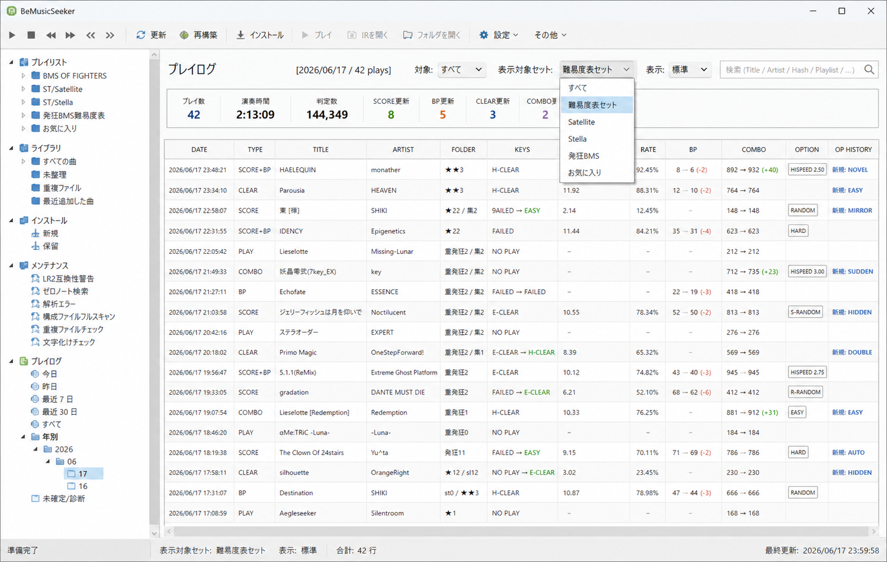
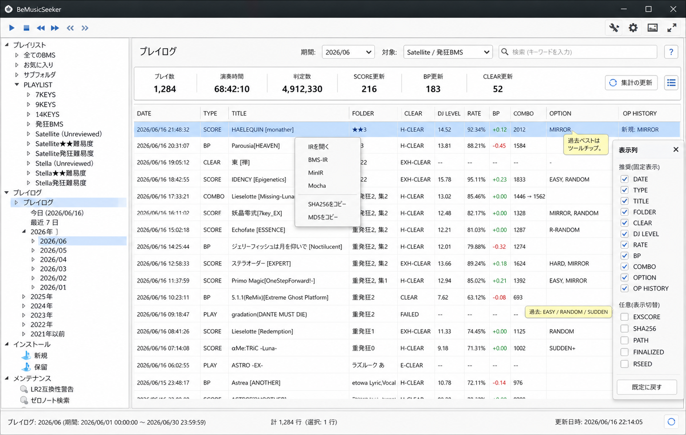

# BeMusicSeeker LR2 Play History Trigger Policy

## 目的

LR2 / OpenLR2 のバイナリを変更せず、プレイヤー別 score DB に後付けする SQLite table / trigger だけで、BeMusicSeeker が次の情報を利用できるようにする。

- LAST PLAY SORT 用の曲別最終プレイ日時。
- 曲単位のプレイ履歴。
- BP 更新、スコア更新、クリアタイプ更新、コンボ更新などの更新記録。
- 日別・期間別のプレイ時間、判定数、更新数の集計。

この資料では、LR2 の既存 `score` / `player` table を変更せず、追加 table と trigger だけで実現する実装方針を示す。

初期実装の対象は LR2 / OpenLR2 とする。LR2 用の実装が安定した後、beatoraja の既存ログ DB を読み取る adapter を追加し、同じプレイログ画面へ載せることを前提にする。BeMusicSeeker 側の表示用 model と UI は、この後続対応を見越して LR2 専用にしない。

BeMusicSeeker 側の実装フェーズ、既存コードとの接続点、進捗管理は `BeMusicSeeker_PlayHistory_Implementation_Plan.md` を参照する。この資料は LR2 score DB に追加する table / trigger と、そこから得られる値の仕様を中心に扱う。

## 前提

LR2 / OpenLR2 の通常運用では、曲 DB と score DB は分離している。

- `LR2files/Database/song.db`: `song` / `folder` など。
- `LR2files/Database/Score/<player>.db`: `score` / `player` など。

OpenLR2 は起動時に `song.db` を開き、プレイヤー別 score DB を attach して、選曲時に `song LEFT JOIN score ON song.hash = score.hash` の形で参照する。

履歴 table / trigger はプレイヤー別 score DB 側へ作る。`song.db` や BeMusicSeeker app-owned DB へ score trigger から直接書かない。

時刻は Unix epoch 秒で保存する。`strftime('%s', 'now')` は UTC epoch を返すため、`'+9 hours'` は付けない。JST 表示はアプリ側で行う。

### SQLite 3.6.7 互換性

オリジナル LR2 は SQLite 3.6.7 を使うため、trigger SQL は SQLite 3.6.7 を必須対応ラインとして書く。OpenLR2 側の同梱 SQLite が新しくても、新しい SQLite 構文には寄せない。

BeMusicSeeker が新しい SQLite library で score DB を開いて trigger を作成する場合でも、`sqlite_master` に保存された trigger 定義は後で LR2 側の SQLite 3.6.7 が parse する。SQLite 3.6.7 が読めない構文を入れると、trigger が発火する前に DB schema 読み込みで失敗する可能性がある。そのため、作成時に新しい SQLite が許すかどうかではなく、LR2 側 SQLite が読めるかを基準にする。

使わない構文:

- `INSERT ... ON CONFLICT (...) DO UPDATE`: SQLite 3.24.0 以降の UPSERT 構文。
- `RETURNING`
- `WITH` / CTE
- window function
- partial index
- expression index
- generated column

`bms_lr2_last_play` の upsert は `INSERT OR REPLACE` で行う。`bms_lr2_last_play` は参照用の派生 table とし、外部キーや連鎖 trigger を持たせない。

## 既存 DB から取れるもの

`score` は曲 hash ごとのベスト・累計行であり、プレイごとの生ログではない。

主に使える列:

- `hash`
- `clear`
- `perfect`, `great`, `good`, `bad`, `poor`
- `totalnotes`
- `maxcombo`
- `minbp`
- `playcount`, `clearcount`, `failcount`
- `clear_db`, `clear_sd`, `clear_ex`
- `op_history`, `op_best`
- `scorehash`
- `rseed`
- `complete`

`score` にあるが履歴 table では省略できる値:

- `rank`: `EX score` と `totalnotes` から再計算できる。
- `rate`: `EX score` と `totalnotes` から再計算できる。

派生できる値:

- EX score: `perfect * 2 + great`
- rate: `exscore * 100 / (totalnotes * 2)`
- rank: `exscore * 9 / (totalnotes * 2)` を基本に、LR2 と同様に `8` で上限 clamp し、`exscore > 0` で `1` 未満なら `1` とする。

`player` はプレイヤー全体の累計行であり、曲 hash を持たない。

主に使える列:

- `playcount`, `clear`, `fail`
- `perfect`, `great`, `good`, `bad`, `poor`
- `playtime`
- `combo`, `maxcombo`
- `trial`, `grade_*`

`player` trigger では全体累計の OLD/NEW 差分を取れる。曲 hash は `score` trigger で作った pending row と結びつける。

## 設計方針

用途が違うため、LAST PLAY SORT 用 table と、詳細履歴 table は分ける。

- LAST PLAY SORT: `bms_lr2_last_play(hash, last_play_at)` に、曲別最終プレイ日時を保存する。
- 更新記録: append-only で raw old/new 値を残し、表示カテゴリは BeMusicSeeker 側で派生する。

重要な前提として、初回導入時に既存 `score` row から `bms_lr2_last_play` や `bms_lr2_play_history` を backfill しない。既存 score から分かるのは「過去にプレイされたこと」や現在の best / 累計であり、「最後にいつプレイしたか」ではないためである。

したがって、この履歴は trigger 設置後に LR2 が DB 保存したプレイだけを対象にする。この性質はマニュアルや仕様説明で扱い、アプリ内の通常表示では注釈として強調しない。

`score` trigger は「曲 hash と score 変化」を記録する。`player` trigger は、その直後に来る全体 `playtime` / 判定数差分を同じ履歴 row に追記する。

LR2 の保存順は多くの経路で次の順になる。

1. `UpdateScoreDB(...)`
2. 新 record 時は `WriteGhostInDatabase(...)`
3. `UpdatePlayerStat(...)`

`WriteGhostInDatabase` は `UPDATE score SET ghost = ?` だけを行うため、履歴 trigger は `UPDATE OF playcount` など対象列を絞り、ghost 更新を拾わないようにする。

## Table 定義

初期版では schema version table を持たない。BeMusicSeeker は table / trigger が存在しない score DB に対して初期設置を行う。

### `bms_lr2_last_play`

LAST PLAY SORT 用の軽量 table。初回導入時は空で開始し、以後 `score` trigger が発火した曲だけ row が作られる。

```sql
CREATE TABLE IF NOT EXISTS bms_lr2_last_play (
  hash TEXT PRIMARY KEY,
  last_play_at INTEGER NOT NULL
);
```

`bms_lr2_last_play` に row がない譜面は、「未プレイ」とは限らない。正確には「履歴機能導入後、まだこの仕組みで play を観測していない譜面」である。既存 LR2 score に `playcount > 0` があっても、この table には初期投入しない。

### `bms_lr2_play_history`

更新記録表示・集計用の append-only table。

```sql
CREATE TABLE IF NOT EXISTS bms_lr2_play_history (
  history_id INTEGER PRIMARY KEY AUTOINCREMENT,

  hash TEXT NOT NULL,
  played_at INTEGER NOT NULL,
  finalized INTEGER NOT NULL DEFAULT 0,

  score_write_type TEXT NOT NULL, -- insert / update

  old_playcount INTEGER,
  new_playcount INTEGER NOT NULL,
  playcount_delta INTEGER NOT NULL,

  old_clearcount INTEGER,
  new_clearcount INTEGER,
  clearcount_delta INTEGER,

  old_failcount INTEGER,
  new_failcount INTEGER,
  failcount_delta INTEGER,

  old_clear INTEGER,
  new_clear INTEGER,

  old_clear_db INTEGER,
  new_clear_db INTEGER,
  old_clear_sd INTEGER,
  new_clear_sd INTEGER,
  old_clear_ex INTEGER,
  new_clear_ex INTEGER,

  old_minbp INTEGER,
  new_minbp INTEGER,

  old_exscore INTEGER,
  new_exscore INTEGER,

  old_maxcombo INTEGER,
  new_maxcombo INTEGER,

  old_totalnotes INTEGER,
  new_totalnotes INTEGER,

  old_complete INTEGER,
  new_complete INTEGER,

  old_op_best INTEGER,
  new_op_best INTEGER,
  old_op_history INTEGER,
  new_op_history INTEGER,

  old_rseed INTEGER,
  new_rseed INTEGER,

  old_scorehash TEXT,
  new_scorehash TEXT,

  old_player_playcount INTEGER,
  new_player_playcount INTEGER,
  player_playcount_delta INTEGER,

  old_playtime_total INTEGER,
  new_playtime_total INTEGER,
  playtime_delta INTEGER,

  old_judge_total INTEGER,
  new_judge_total INTEGER,
  judge_delta INTEGER,

  old_player_perfect INTEGER,
  new_player_perfect INTEGER,
  perfect_delta INTEGER,

  old_player_great INTEGER,
  new_player_great INTEGER,
  great_delta INTEGER,

  old_player_good INTEGER,
  new_player_good INTEGER,
  good_delta INTEGER,

  old_player_bad INTEGER,
  new_player_bad INTEGER,
  bad_delta INTEGER,

  old_player_poor INTEGER,
  new_player_poor INTEGER,
  poor_delta INTEGER,

  old_player_maxcombo INTEGER,
  new_player_maxcombo INTEGER
);

CREATE INDEX IF NOT EXISTS idx_bms_lr2_play_history_hash_time
  ON bms_lr2_play_history(hash, played_at DESC, history_id DESC);

CREATE INDEX IF NOT EXISTS idx_bms_lr2_play_history_time
  ON bms_lr2_play_history(played_at DESC, history_id DESC);
```

`judge_delta` は `perfect + great + good + bad + poor` の差分である。物理的なキー押下数そのものではなく、LR2 が記録した判定数として扱う。

### 保存列の意味

`score` 由来の主な列:

- `hash`: `score.hash`。通常は LR2 の `song.hash` と join する譜面 hash だが、course / nonstop / grade の結果では `expert` / `nonstop` / `grade` table にある course hash が入ることがある。
- `played_at`: `score` row が保存された時刻。UTC Unix epoch 秒。
- `score_write_type`: `score` への書き込み種別。新規 row は `insert`、既存 row は `update`。
- `old_playcount` / `new_playcount` / `playcount_delta`: 曲別の累計プレイ回数。`new_playcount > old_playcount` の時だけ履歴化する。
- `old_clearcount` / `new_clearcount`, `old_failcount` / `new_failcount`: 曲別の clear / fail 累計。
- `old_clear` / `new_clear`: 通常プレイの best clearType。概ね `0=未プレイ`, `1=failed`, `2=easy系`, `3=normal/groove系`, `4=hard系`, `5=full combo` として扱える。`P.A` などの表示 lamp は LR2 の内部 `clear` 値だけではなく、EX score / totalnotes などと組み合わせて BeMusicSeeker 側で派生する。
- `old_clear_db` / `new_clear_db`: `battle == 2`、つまり D-BATTLE 系での best clearType。
- `old_clear_sd` / `new_clear_sd`: `battle == 3`、つまり SP-to-DP 系での best clearType。
- `old_clear_ex` / `new_clear_ex`: `is_extra == 1` の extra mode 系での best clearType。
- `old_minbp` / `new_minbp`: 曲別の最小 BP。LR2 は完走していない場合、未処理ノート分も BP 相当に加算して比較する。
- `old_exscore` / `new_exscore`: `perfect * 2 + great`。履歴では `rank` / `rate` を保存せず、表示時にここから再計算する。
- `old_maxcombo` / `new_maxcombo`: 曲別の最大 combo。
- `old_totalnotes` / `new_totalnotes`: best score row に紐づく total notes。
- `old_complete` / `new_complete`: LR2 が譜面を最後まで処理したことを記録した flag。
- `old_rseed` / `new_rseed`: best score 更新時の random seed。
- `old_scorehash` / `new_scorehash`: LR2 が score row 用に計算する検証用 hash。表示には不要だが、履歴 row と score row の対応確認に使える。

`player` 由来の主な列:

- `old_player_playcount` / `new_player_playcount`: プレイヤー全体の累計プレイ回数。
- `old_playtime_total` / `new_playtime_total` / `playtime_delta`: プレイヤー全体の累計 playtime と、そのプレイで増えた量。
- `old_judge_total` / `new_judge_total` / `judge_delta`: `perfect + great + good + bad + poor` の累計差分。
- `perfect_delta` / `great_delta` / `good_delta` / `bad_delta` / `poor_delta`: そのプレイで増えた判定数。
- `old_player_maxcombo` / `new_player_maxcombo`: プレイヤー全体の最大 combo。

### `op_best` の読み方

`op_best` は「best EX score を更新したプレイ」の option snapshot である。best 更新しなかったプレイの option ではない。

LR2 側の保存式:

- SP 系: `gauge + random1 * 10`
- DP 系: `gauge + random1 * 10 + random2 * 100 + dpflip * 1000`

BeMusicSeeker 側の decode:

```text
gauge  = op_best % 10
random1 = (op_best / 10) % 10
random2 = (op_best / 100) % 10
dpflip = (op_best / 1000) % 10
```

`gauge` は `CONFIG_PLAY.gaugeOption` と同じ値で、`0=groove`, `1=survival`, `2=death`, `3=easy`, `4=pattack`, `5=gattack`。

`random` は `0=normal`, `1=mirror`, `2=random`, `3=s-random`, `4=scatter`, `5=converge`。通常 score save 条件では `random < 4` に制限されるため、best score の `op_best` では `scatter` / `converge` が入りにくい。

`dpflip` は `0=off`, `1=on`。

### `op_history` の読み方

`op_history` は個別プレイの option snapshot ではなく、「一定以上の clearType で達成済みの option bit」を OR で蓄積した値である。LR2 は `score.op_history |= ConvertOptionHistory(g)` の形で更新する。

`old_op_history` / `new_op_history` からは、次のように今回新しく立った bit を見られる。

```text
new_bits = new_op_history & ~old_op_history
```

通常系の bit:

```text
gauge bit:
  gauge 0 -> 0x00000001
  gauge 1 -> 0x00000002
  gauge 2 -> 0x00000004
  gauge 3 -> 0x00000008
  gauge 4 -> 0x00000010
  gauge 5 -> 0x00000020
  gauge 6 -> 0x00000040
  gauge 7 -> 0x00000080

random1 bit:
  random 0 -> 0x00000100
  random 1 -> 0x00000200
  random 2 -> 0x00000400
  random 3 -> 0x00000800
  random 4 -> 0x00001000
  random 5 -> 0x00002000
  random 6 -> 0x00004000
  random 7 -> 0x00008000

HIDSUD bit:
  m_HIDSUD1 0 -> 0x00010000
  m_HIDSUD1 1 -> 0x00020000
  m_HIDSUD1 2 -> 0x00040000
  m_HIDSUD1 3 -> 0x00080000
  m_HIDSUD1 4 -> 0x00100000
  m_HIDSUD1 5 -> 0x00200000
  m_HIDSUD1 6 -> 0x00400000
  m_HIDSUD1 7 -> 0x00800000
```

特殊系の bit:

```text
assist clear -> 0x01000000
extra mode clear -> 0x02000000
D-BATTLE clear -> 0x04000000
SP-to-DP clear -> 0x08000000
```

通常系では `clear > 2` の時に gauge / random1 / HIDSUD の bit が立つ。例外として `clear == 2 && gauge == 3` の場合は `0x00000008` だけが返る。assist clear は `clear > 1` で `0x01000000` が立つ。

### 保存しない列

履歴 table を太らせすぎないため、次は保存しない。

- `rank`: `new_exscore` と `new_totalnotes` から再計算する。
- `rate`: `new_exscore` と `new_totalnotes` から再計算する。
- `perfect` / `great` / `good` / `bad` / `poor` の曲別 best old/new: 初期 scope 外。更新記録表示は EX score / BP / clear / combo を主軸にする。

`scorehash` と `old_totalnotes` / `new_totalnotes` は保存する。通常 UI の主表示には使わないが、履歴 row と score row の対応確認、rate / DJ LEVEL の再計算、course / 途中保存 / DB 不整合の診断に使う。

### `bms_lr2_play_pending`

`score` trigger で作った履歴 row に、後続の `player` trigger で全体累計差分を追記するための中継 table。

```sql
CREATE TABLE IF NOT EXISTS bms_lr2_play_pending (
  id INTEGER PRIMARY KEY CHECK (id = 1),
  history_id INTEGER NOT NULL,
  hash TEXT NOT NULL,
  created_at INTEGER NOT NULL
);
```

LR2 は単一プロセス・単一プレイヤー DB に対して保存するため、pending は 1 row とする。`player` 更新が来なかった履歴 row は `bms_lr2_play_history.finalized = 0` のまま残し、診断専用にする。

OpenLR2 の通常保存では `UpdateScoreDB()` の直後に `UpdatePlayerStat()` が呼ばれる。間に入る可能性があるのは `WriteGhostInDatabase()` の ghost 更新だけであり、同じ保存処理内で完了する。そのため、pending の時間制限は通常遅延を待つためではなく、異常終了などで残った pending を次回以降の `player` 更新へ誤結合しないためのガードである。

確認した保存経路では、通常 result は `UpdateScoreDB()` -> optional `WriteGhostInDatabase()` -> `UpdatePlayerStat()`、特殊 gauge / battle 系の早期保存分岐は `UpdateScoreDB()` -> `UpdatePlayerStat()`、course result も `UpdateScoreDB()` -> `UpdatePlayerStat()` の順である。`UpdateScoreDB()` は内部で `BEGIN` / `COMMIT` し、`UpdatePlayerStat()` はその直後に単独 `UPDATE player` を実行する。

`player` trigger は `created_at` が現在時刻から 10 秒以内の pending だけを確定し、10 秒を超えた pending は削除する。

## Trigger 定義

初期版では、詳細履歴と LAST PLAY SORT を同じ `score` / `player` trigger で実装する。LAST PLAY SORT だけの別 trigger は作らない。

### `score` INSERT

新規 score row が作られた時に履歴 row を作る。

```sql
CREATE TRIGGER bms_lr2_score_history_after_insert
AFTER INSERT ON score
FOR EACH ROW
WHEN NEW.playcount > 0
BEGIN
  INSERT INTO bms_lr2_play_history (
    hash,
    played_at,
    score_write_type,
    old_playcount,
    new_playcount,
    playcount_delta,
    old_clearcount,
    new_clearcount,
    clearcount_delta,
    old_failcount,
    new_failcount,
    failcount_delta,
    old_clear,
    new_clear,
    old_clear_db,
    new_clear_db,
    old_clear_sd,
    new_clear_sd,
    old_clear_ex,
    new_clear_ex,
    old_minbp,
    new_minbp,
    old_exscore,
    new_exscore,
    old_maxcombo,
    new_maxcombo,
    old_totalnotes,
    new_totalnotes,
    old_complete,
    new_complete,
    old_op_best,
    new_op_best,
    old_op_history,
    new_op_history,
    old_rseed,
    new_rseed,
    old_scorehash,
    new_scorehash
  )
  VALUES (
    NEW.hash,
    CAST(strftime('%s', 'now') AS INTEGER),
    'insert',
    NULL,
    NEW.playcount,
    NEW.playcount,
    NULL,
    NEW.clearcount,
    NEW.clearcount,
    NULL,
    NEW.failcount,
    NEW.failcount,
    NULL,
    NEW.clear,
    NULL,
    NEW.clear_db,
    NULL,
    NEW.clear_sd,
    NULL,
    NEW.clear_ex,
    NULL,
    NEW.minbp,
    NULL,
    NEW.perfect * 2 + NEW.great,
    NULL,
    NEW.maxcombo,
    NULL,
    NEW.totalnotes,
    NULL,
    NEW.complete,
    NULL,
    NEW.op_best,
    NULL,
    NEW.op_history,
    NULL,
    NEW.rseed,
    NULL,
    NEW.scorehash
  );

  DELETE FROM bms_lr2_play_pending WHERE id = 1;

  INSERT INTO bms_lr2_play_pending(id, history_id, hash, created_at)
  VALUES (1, last_insert_rowid(), NEW.hash, CAST(strftime('%s', 'now') AS INTEGER));

  INSERT OR REPLACE INTO bms_lr2_last_play(hash, last_play_at)
  VALUES (
    NEW.hash,
    (SELECT played_at FROM bms_lr2_play_history WHERE history_id = (SELECT history_id FROM bms_lr2_play_pending WHERE id = 1))
  );
END;
```

### `score` UPDATE

既存 score row の `playcount` が増えた時だけ履歴化する。これにより ghost 更新を除外できる。

```sql
CREATE TRIGGER bms_lr2_score_history_after_update_playcount
AFTER UPDATE OF playcount ON score
FOR EACH ROW
WHEN NEW.playcount > OLD.playcount
BEGIN
  INSERT INTO bms_lr2_play_history (
    hash,
    played_at,
    score_write_type,
    old_playcount,
    new_playcount,
    playcount_delta,
    old_clearcount,
    new_clearcount,
    clearcount_delta,
    old_failcount,
    new_failcount,
    failcount_delta,
    old_clear,
    new_clear,
    old_clear_db,
    new_clear_db,
    old_clear_sd,
    new_clear_sd,
    old_clear_ex,
    new_clear_ex,
    old_minbp,
    new_minbp,
    old_exscore,
    new_exscore,
    old_maxcombo,
    new_maxcombo,
    old_totalnotes,
    new_totalnotes,
    old_complete,
    new_complete,
    old_op_best,
    new_op_best,
    old_op_history,
    new_op_history,
    old_rseed,
    new_rseed,
    old_scorehash,
    new_scorehash
  )
  VALUES (
    NEW.hash,
    CAST(strftime('%s', 'now') AS INTEGER),
    'update',
    OLD.playcount,
    NEW.playcount,
    NEW.playcount - OLD.playcount,
    OLD.clearcount,
    NEW.clearcount,
    NEW.clearcount - OLD.clearcount,
    OLD.failcount,
    NEW.failcount,
    NEW.failcount - OLD.failcount,
    OLD.clear,
    NEW.clear,
    OLD.clear_db,
    NEW.clear_db,
    OLD.clear_sd,
    NEW.clear_sd,
    OLD.clear_ex,
    NEW.clear_ex,
    OLD.minbp,
    NEW.minbp,
    OLD.perfect * 2 + OLD.great,
    NEW.perfect * 2 + NEW.great,
    OLD.maxcombo,
    NEW.maxcombo,
    OLD.totalnotes,
    NEW.totalnotes,
    OLD.complete,
    NEW.complete,
    OLD.op_best,
    NEW.op_best,
    OLD.op_history,
    NEW.op_history,
    OLD.rseed,
    NEW.rseed,
    OLD.scorehash,
    NEW.scorehash
  );

  DELETE FROM bms_lr2_play_pending WHERE id = 1;

  INSERT INTO bms_lr2_play_pending(id, history_id, hash, created_at)
  VALUES (1, last_insert_rowid(), NEW.hash, CAST(strftime('%s', 'now') AS INTEGER));

  INSERT OR REPLACE INTO bms_lr2_last_play(hash, last_play_at)
  VALUES (
    NEW.hash,
    (SELECT played_at FROM bms_lr2_play_history WHERE history_id = (SELECT history_id FROM bms_lr2_play_pending WHERE id = 1))
  );
END;
```

### `player` UPDATE

`score` trigger が作った直近履歴 row に、全体 playtime / 判定数差分を追記する。

```sql
CREATE TRIGGER bms_lr2_player_history_after_update
AFTER UPDATE OF playcount, clear, fail, perfect, great, good, bad, poor, playtime, maxcombo ON player
FOR EACH ROW
WHEN
  NEW.playcount > OLD.playcount
  AND EXISTS (
    SELECT 1
    FROM bms_lr2_play_pending
    WHERE id = 1
      AND created_at >= CAST(strftime('%s', 'now') AS INTEGER)
        - 10
  )
BEGIN
  UPDATE bms_lr2_play_history
  SET
    finalized = 1,
    old_player_playcount = OLD.playcount,
    new_player_playcount = NEW.playcount,
    player_playcount_delta = NEW.playcount - OLD.playcount,
    old_playtime_total = OLD.playtime,
    new_playtime_total = NEW.playtime,
    playtime_delta = NEW.playtime - OLD.playtime,
    old_judge_total = OLD.perfect + OLD.great + OLD.good + OLD.bad + OLD.poor,
    new_judge_total = NEW.perfect + NEW.great + NEW.good + NEW.bad + NEW.poor,
    judge_delta = (NEW.perfect + NEW.great + NEW.good + NEW.bad + NEW.poor)
                - (OLD.perfect + OLD.great + OLD.good + OLD.bad + OLD.poor),
    old_player_perfect = OLD.perfect,
    new_player_perfect = NEW.perfect,
    perfect_delta = NEW.perfect - OLD.perfect,
    old_player_great = OLD.great,
    new_player_great = NEW.great,
    great_delta = NEW.great - OLD.great,
    old_player_good = OLD.good,
    new_player_good = NEW.good,
    good_delta = NEW.good - OLD.good,
    old_player_bad = OLD.bad,
    new_player_bad = NEW.bad,
    bad_delta = NEW.bad - OLD.bad,
    old_player_poor = OLD.poor,
    new_player_poor = NEW.poor,
    poor_delta = NEW.poor - OLD.poor,
    old_player_maxcombo = OLD.maxcombo,
    new_player_maxcombo = NEW.maxcombo
  WHERE history_id = (SELECT history_id FROM bms_lr2_play_pending WHERE id = 1);

  DELETE FROM bms_lr2_play_pending WHERE id = 1;
END;
```

`SaveIRID` は `UPDATE player SET irid = ...` を行うが、この trigger は `irid` を対象列に含めないため履歴化しない。

古い pending は別 trigger で削除し、履歴 row は `finalized = 0` のまま診断対象として残す。

```sql
CREATE TRIGGER bms_lr2_player_history_cleanup_stale_pending
AFTER UPDATE OF playcount, clear, fail, perfect, great, good, bad, poor, playtime, maxcombo ON player
FOR EACH ROW
WHEN
  NEW.playcount > OLD.playcount
  AND EXISTS (
    SELECT 1
    FROM bms_lr2_play_pending
    WHERE id = 1
      AND created_at < CAST(strftime('%s', 'now') AS INTEGER)
        - 10
  )
BEGIN
  DELETE FROM bms_lr2_play_pending WHERE id = 1;
END;
```

## LAST PLAY SORT の実装方針

BeMusicSeeker の custom folder 出力で、既存の `PLAY COUNT SORT` と同じように `ORDER BY` 付き command を生成する。

導入前の LR2 score には最終プレイ日時が残っていないため、過去の `score.playcount` から last play を作らない。導入直後は全曲が履歴なし扱いになり、以後プレイした曲から順に `bms_lr2_last_play` へ入る。

`{playlist_base_condition}` は、playlist export flow が生成した LR2 から見える基底条件である。この資料では、その条件に LAST PLAY SORT の `ORDER BY` を付ける部分だけを扱う。

### custom folder SQL

初期実装の LAST PLAY SORT は最新順のみとする。

```sql
{playlist_base_condition}
ORDER BY (SELECT last_play_at FROM bms_lr2_last_play WHERE hash = song.hash) DESC
```

SQLite では `NULL` が通常の値より小さい扱いになるため、`DESC` なら `bms_lr2_last_play` に row がない譜面は自然に末尾になる。これは LR2 的な `NO PLAY` とは別で、既存 score がある譜面でも `bms_lr2_last_play` に row がなければ末尾になる。

LAST PLAY SORT 用の時刻更新は、前述の詳細履歴 `score` trigger が `bms_lr2_play_history` と同時に `bms_lr2_last_play` を更新することで実現する。LAST PLAY SORT だけの独立 trigger は作らない。

### 性能

`bms_lr2_last_play` は score DB 側にあるため、OpenLR2 の `score` と同様に unqualified table name で参照する。LR2 側の attach 名を command に埋め込まない。

custom folder の `ORDER BY (SELECT last_play_at ... WHERE hash = song.hash)` は、表示対象 row ごとに `bms_lr2_last_play.hash` の primary key index を引く形になる。playlist / 難易度表 folder 程度の件数なら十分軽いはずで、コストはおおむね「対象件数分の hash index lookup + sort」である。

巨大な全曲 folder で毎回実行する場合は sort 自体のコストが支配的になる。LR2 custom folder 用には `ORDER BY (SELECT last_play_at ...) DESC` の形に固定する。

初回導入時に既存 `score.playcount > 0` の曲へ現在時刻を入れない。現在時刻を入れると、過去にプレイ済みだった曲が「導入日に最後に遊ばれた」ように見えてしまうためである。

アプリ内の表示名は `LAST PLAY SORT` とする。BeMusicSeeker 内部の列名は `last_play_at` とする。導入前の履歴を持たない点はマニュアルや仕様説明に記載し、通常の機能名や tooltip では強調しない。

## アプリ上で見せられるもの

### 今日の記録

画像例のように、日付単位で次を表示できる。

- 叩いたノーツ数: `SUM(judge_delta)`
- プレイ時間: `SUM(playtime_delta)`
- プレイ曲数: `COUNT(*)`
- 初プレイ / 再プレイ数: `old_playcount IS NULL` または `playcount_delta > 0`
- BP 更新数
- スコア更新数
- クリアタイプ更新数
- コンボ更新数

日付区切りは `played_at` をアプリ側でローカル日付に変換して扱う。

### 更新カテゴリ

`bms_lr2_play_history` の old/new から表示カテゴリを派生する。

```text
スコア更新:
  new_exscore > old_exscore

BP更新:
  old_minbp IS NOT NULL
  AND new_minbp IS NOT NULL
  AND new_minbp < old_minbp

クリアタイプ更新:
  new_clear > old_clear

コンボ更新:
  new_maxcombo > old_maxcombo

初プレイ:
  old_playcount IS NULL
  OR old_playcount = 0

プレイカウントのみ:
  playcount_delta > 0
  AND スコア更新/BP更新/クリアタイプ更新/コンボ更新のどれでもない
```

`new_clear` は LR2 の clear type で、UI 側で `FAILED`, `ASSIST`, `EASY`, `CLEAR`, `HARD`, `FC`, `P.A` などへ変換する。

### そのプレイ結果の復元

`score` row は曲ごとの best / 累計であり、単体ではプレイ生ログではない。一方、`player` row はプレイヤー全体の累計判定数を持つため、`score` trigger の直後に来る `player` trigger と結び付いた履歴 row では、そのプレイで増えた判定数を復元できる。

OpenLR2 では、通常プレイ中の判定ごとに `playerstat.perfect` / `great` / `good` / `bad` / `poor` が加算され、曲終了時に `UpdatePlayerStat()` で `player` table へ保存される。したがって `finalized = 1` かつ判定差分が取れている履歴 row では、次を「そのプレイ結果」として扱う。

```text
play_perfect = perfect_delta
play_great   = great_delta
play_good    = good_delta
play_bad     = bad_delta
play_poor    = poor_delta
play_exscore = perfect_delta * 2 + great_delta
```

`play_rate` / `play_dj_level` は、譜面の total notes が解決できる場合に `play_exscore` から派生する。total notes は、Chart 側の total notes を優先し、Chart が解決できない場合は `new_totalnotes` を使う。

`playerstat` の判定加算は LR2 側の `ApplyJudgeNote()` の条件に従う。通常保存行では問題なく使えるが、特殊な保存経路で `judge_delta` が譜面ノート数相当にならない row は、`PLAY EXSCORE` / `JUDGES` を実プレイ結果として強調せず診断扱いにする。

この「そのプレイ結果」と、`score` 由来の best 更新値は分けて表示する。

- `play_exscore` / `perfect_delta` / `great_delta` / `good_delta` / `bad_delta` / `poor_delta`: そのプレイの実結果。
- `old_exscore -> new_exscore`: LR2 score row の best EX score 変化。
- `old_minbp -> new_minbp`: LR2 score row の最小 BP 変化。BP が更新されなかったプレイの実 BP は復元しない。
- `old_clear -> new_clear`: LR2 score row の best clear type 変化。clear type が更新されなかったプレイの実 clear type は、clear / fail の増分以上には復元しない。
- `old_maxcombo -> new_maxcombo`: LR2 score row の最大 combo 変化。最大 combo が更新されなかったプレイの実 max combo は復元しない。
- `new_op_best` / `new_rseed`: best EX score 更新時の option / random seed。best 更新しなかったプレイの実 option / random seed は復元しない。

つまり、`player` 差分によって「そのプレイのスコアと各種判定値」はかなり再現できる。ただし、clear type、BP、max combo、option、random seed は `score` row の best 更新情報であり、そのプレイの実値として常に取れるわけではない。

### COURSE / GRADE / NONSTOP の扱い

OpenLR2 の course 系保存は、単曲プレイとは hash の意味が変わる。

- `expert` / `grade`: 各 stage 終了時に `courseHash[courseStageNow]` の単曲 score が保存される。さらに course result で course 自体の hash に対する score も保存される。
- `nonstop`: stage ごとの単曲 score 保存分岐には入らず、course result で nonstop 自体の hash に対する score が保存される。
- course 自体の hash は 32 文字の header に stage 曲 hash を連結した形式で、`song.hash` ではない。OpenLR2 は `expert` / `nonstop` / `grade` table の `hash` として保持し、選曲時はそれらを `score.hash` と join する。

trigger は `score.hash` を raw に保存するだけで、course 種別を判定しない。BeMusicSeeker 側で履歴 row を読む時に、次の順で hash を解決する。

```text
1. song.hash に一致する         -> chart
2. expert.hash に一致する       -> expert course
3. nonstop.hash に一致する      -> nonstop course
4. grade.hash に一致する        -> grade course
5. どれにも一致しない           -> unknown
```

初期実装の主対象は `chart` row とする。course / grade / nonstop row は履歴 table に混ざり得るが、Chart として扱わない。Chart 用の FOLDER 解決、SHA256 解決、IR / 譜面操作 context menu は出さず、必要なら診断・詳細 preset で course title と raw hash を見せる。

期間 summary の通常集計では二重計上を避ける。

- `chart`: 集計対象。
- `nonstop course`: stage 別の chart row が保存されないため、集計対象。
- `expert course` / `grade course`: stage 別の chart row が保存されるため、course aggregate row は通常集計から除外し、診断対象にする。
- `unknown`: 通常集計から除外し、診断対象にする。

`PLAY EXSCORE` / `JUDGES` も同じ方針にする。`nonstop course` は course 全体の判定差分として扱えるが、`expert course` / `grade course` の aggregate row では stage 別 chart row 側を実プレイ結果として扱い、course aggregate row の判定差分は診断扱いにする。

LAST PLAY SORT は `song.hash` を並べる機能なので、course 自体の hash は sort に効かない。`expert` / `grade` の stage 別 chart row は各曲の last play に反映される。`nonstop` は course aggregate hash だけが保存されるため、初期実装では構成曲の last play へ分解しない。

### 更新行の表示例

1 row には次を出せる。

- 曲名 / 難易度 / playlist folder: `hash_kind = chart` の場合、BeMusicSeeker 側の `song` / `playlist_entry` / `chart_info` から join。
- 更新種別: score / BP / clear / combo / play only。
- そのプレイ結果:
  - EX score: `perfect_delta * 2 + great_delta`
  - 判定: `perfect_delta / great_delta / good_delta / bad_delta / poor_delta`
- 値の変化:
  - EX score: `old_exscore -> new_exscore`
  - BP: `old_minbp -> new_minbp`
  - clear: `old_clear -> new_clear`
  - combo: `old_maxcombo -> new_maxcombo`
- プレイ時刻: `played_at`
- プレイオプション: `new_op_best` decode。
- random seed: `new_rseed`
- 完走状態: `new_complete`

スコア更新時のプレイオプションは `new_op_best` を使う。ただし `op_best` は「ベストスコア時の option」であり、ベスト更新しなかったプレイの実 option ではない。

### 期間集計

指定区間で次を集計できる。

```sql
SELECT
  COUNT(*) AS plays,
  SUM(playtime_delta) AS playtime,
  SUM(judge_delta) AS judged_notes,
  SUM(CASE WHEN new_exscore > old_exscore THEN 1 ELSE 0 END) AS score_updates,
  SUM(CASE WHEN new_minbp < old_minbp THEN 1 ELSE 0 END) AS bp_updates,
  SUM(CASE WHEN new_clear > old_clear THEN 1 ELSE 0 END) AS clear_updates,
  SUM(CASE WHEN new_maxcombo > old_maxcombo THEN 1 ELSE 0 END) AS combo_updates
FROM bms_lr2_play_history
WHERE played_at BETWEEN ? AND ?
  AND finalized = 1;
```

`finalized = 0` の row は通常集計から除外し、診断表示専用にする。さらに BeMusicSeeker 側で解決した `hash_kind` により、`chart` と `nonstop course` を通常集計対象、`expert course` / `grade course` / `unknown` を診断対象にする。

### 長期統計

一般的なプレイ記録ツールとして、次のような表示に展開できる。

- 日別 / 週別のプレイ時間。
- 日別 / 週別の判定数。
- 更新種別別の件数推移。
- 曲別のプレイ間隔。
- playlist / 難易度 / folder 別の活動量。
- 最近更新した曲。
- 最近触っていない曲。
- BP 更新履歴。
- clear lamp 進捗。
- combo best 更新履歴。
- score best 更新履歴。
- option 別の score best 更新。

## BeMusicSeeker UI への載せ方

添付画像の BeMusicSeeker UI は、左 sidebar の tree で表示対象を選び、右側の `CustomTableView` で一覧・sort・検索・context menu 操作を行う構成である。プレイ記録も基本はこの導線に乗せる。

初期実装は次の二層構成とする。

- 大量行の閲覧、期間横断検索、sort、playlist との照合は `CustomTableView` を使う。
- 選択期間の概要は `CustomTableView` 上部の summary に表示する。

共有画像生成やカード型の期間 digest は初期 scope 外とする。

ただし、プレイ記録はプレイヤー連携機能であり、初期対象を LR2、後続対象を beatoraja とする。BeMusicSeeker の stand-alone mode では playlist 管理だけを使う利用もあり得るため、playlist tree や playlist detail に強い常設導線を置くより、`プレイログ` 側から対象を選ぶ UI に寄せる方が境界がきれいである。

### UI モック

左 tree に `プレイログ` root を追加し、対象 playlist / 難易度表セットは右上の dropdown で選ぶ。



履歴 table の列設定と、Chart へ解決できた時だけ使える IR / hash 系 context menu。



### 左 tree

左 sidebar の最下部に `プレイログ` root を追加する。tree は期間選択に寄せ、更新種別 node は持たない。更新種別は table の `TYPE` 列と keyword search で絞れるようにする。

```text
プレイログ
  今日
  昨日
  最近 7 日
  最近 30 日
  すべて
  年別
    2026
      06
        17
        16
        ...
    2025
      ...
  未確定/診断
```

`今日` / `昨日` / `最近 7 日` はよく使う入口として固定 node にする。`すべて` は履歴機能導入後の全期間、`年別` 配下の年 node / 月 node / 日 node はそれぞれの期間を表す。どの期間 node でも、右 table 上部にその期間の summary を出し、その下に同じ期間の履歴 row を出す。

右上に `対象` / `表示対象セット` / `表示` の dropdown を置く。

- `対象`: `すべて`, `単一 playlist`。履歴 row の母集団を切り替える。
- `表示対象セット`: FOLDER 列の解決に使う playlist 群を選ぶ。難易度表セット、Satellite 系、Stella 系、ユーザー定義など。
- `表示`: `標準`, `詳細`, `診断` の列 preset を切り替える。

playlist tree から「この playlist のプレイログ」を直接開く常設導線は作らない。プレイログ画面側の `対象` dropdown で単一 playlist を選ぶ。

### 表示対象セット

`FOLDER` 列のために参照する playlist 群は、通常の `PLAYLIST` 列とは目的が違う。`PLAYLIST` は「その譜面が所属する playlist」を表示する列だが、`FOLDER` は「履歴一覧で人間が見たい難易度・分類ラベル」を出す列である。

そのため、BeMusicSeeker 側の app-owned DB に、プレイログ用の表示対象セットを持つ。

```text
PlayHistoryDisplayTargetSet
  id
  name
  is_default

PlayHistoryDisplayTargetPlaylist
  set_id
  playlist_id
  priority
  label_mode  -- org_symbol_level / playlist_folder
```

`FOLDER` の表示ルール:

- `対象` で単一 playlist を選んでいる場合は、その playlist の folder / entry folder を表示する。
- それ以外の場合は、選択中の `表示対象セット` に含まれる playlist から、`org_symbol + level` のラベルを列挙する。例: `★1`, `★12 / sl12`, `st0`, `★★3`。
- 複数 playlist に該当する場合は、`priority` 順に重複を除いて短く表示する。全件は tooltip に逃がす。
- `hash_kind` が `chart` ではない row は空欄にする。course 構成曲から推測して FOLDER を作らない。
- hash が playlist entry と解決できない場合は空欄にする。推測ラベルは作らない。

### `CustomTableView` での行モデル

既存の `LibraryChartRow` / `PlaylistDetailRow` は Chart 由来の「譜面 1 件 = 1 row」である。一方、プレイ記録は「1 play history = 1 row」であり、同じ譜面 hash が何度も出る。

そのため、既存 row へ履歴を混ぜ込まず、別の row model を作る。

```text
PlayHistoryRow
  History: bms_lr2_play_history 由来の raw old/new
  HashKind: chart / expert course / nonstop course / grade course / unknown
  Chart: hash から解決した ChartFile / song / chart_info projection
  Course: hash から解決した expert / nonstop / grade projection
  FolderLabels: 表示対象セットから解決した FOLDER 表示
  PlaylistRefs: 表示切替列として出す所属 playlist 表示
  Derived: TYPE、差分表示、RATE、DJ LEVEL、OPTION、OP HISTORY 表示
```

`CustomTableView` 自体は `IList` と列定義を受け取る汎用 table なので、`PlayHistoryVirtualView` と `PlayHistoryRow` を用意すれば既存の描画・scroll・copy・sort UI を流用できる。

列設定は既存の `CustomTableColumnSettings.ViewKind` に `PLAY_HISTORY` を追加し、Chart 用設定とは別 namespace で保存する。既存の `PLAYLIST` / `STANDARD` と同じ設定 object を使い回さない。

既存操作との接続は `GridRowResolver` などの境界で行う。`PlayHistoryRow` から Chart を解決できる場合でも、履歴 row は Chart row ではないため、譜面操作を広く出さない。右 click では次の程度に留める。

- IR を開く: `BMS-IR`, `MinIR`, `Mocha`。既存 Chart row と同じ hash mapping を使える場合だけ出す。
- hash copy: `MD5`, `SHA256`。`SHA256` は BeMusicSeeker 内の mapping で解決できる場合だけ出す。
- 履歴 row 固有操作: 履歴詳細、コピー、診断情報。

### 既存 Chart 一覧との統合

統合は 2 種類に分ける。

1. 履歴一覧:
   `PlayHistoryRow` を右 table に出す。1譜面に複数 row が出る。期間・更新種別・playlist 横断の記録確認に使う。

2. Chart 一覧への集約列:
   通常の library / playlist detail では、既存 `LibraryChartRow` / `PlaylistDetailRow` に `last_play_at`、`history_play_count_since_install` のような集約値だけを足す。1譜面 1 row の意味は崩さない。

この分離が重要である。Chart 一覧に生履歴 row を混ぜると、drag & drop、playlist 編集、install 操作、context menu の前提が崩れやすい。

### 履歴一覧の初期表示カラム

初期表示で見せたい列:

| Column | 内容 | 備考 |
| --- | --- | --- |
| `DATE` | `played_at` のローカル時刻 | 表示形式は共通で `yyyy/MM/dd HH:mm:ss`。 |
| `TYPE` | 更新種別 | `SCORE`, `BP`, `CLEAR`, `COMBO`, `PLAY` など。複数更新なら `SCORE+BP` のように合成。 |
| `TITLE` | 曲名 | Chart / song から解決。 |
| `ARTIST` | artist | 既存 Chart 列に合わせる。 |
| `FOLDER` | playlist folder または難易度表ラベル | `対象` と `表示対象セット` により解決する。`LEVEL` 列は持たない。 |
| `KEYS` | keymode | Chart / song から解決。 |
| `CLEAR` | 現在 clear。更新時だけ `old_clear -> new_clear` | 初回記録は `NO PLAY -> <new clear>`。 |
| `DJ LEVEL` | `new_exscore` と `new_totalnotes` から派生 | 保存せず表示時に計算する。 |
| `RATE` | `new_exscore / (new_totalnotes * 2)` | 保存せず表示時に計算する。 |
| `BP` | `old_minbp -> new_minbp (-delta)` | BP更新時に強調。 |
| `COMBO` | `old_maxcombo -> new_maxcombo (+delta)` | combo更新時に強調。 |
| `OPTION` | `new_op_best` decode | スコア更新時のみセル表示する。 |
| `OP HISTORY` | 新規に立った `op_history` bit | 新規 bit がない場合は空欄にし、全履歴は tooltip に逃がす。 |

表示切替で出せる列:

| Column | 内容 | 備考 |
| --- | --- | --- |
| `EXSCORE` | `old_exscore -> new_exscore (+delta)` | best EX score の変化。 |
| `PLAY EXSCORE` | `perfect_delta * 2 + great_delta` | そのプレイの実 EX score。`finalized = 1` の row だけ表示。 |
| `JUDGES` | `perfect_delta / great_delta / good_delta / bad_delta / poor_delta` | そのプレイの判定内訳。詳細 preset で出す。 |
| `SHA256` | Chart mapping で解決した SHA256 | 解決できる場合だけ表示する。右 click の IR 操作にも使う。 |
| `PLAYLIST` | 所属 playlist 名 / symbol | `FOLDER` の表示対象セットとは別物。 |
| `PLAYCOUNT` | `old_playcount -> new_playcount` | 診断・詳細向け。 |
| `RSEED` | `new_rseed` | score 更新時の random seed。 |
| `PATH` | 所持 chart path | Chart へ解決できる場合だけ表示。 |
| `HASH` | LR2 の `score.hash` | chart row では MD5、course row では course hash。診断・copy 向け。 |
| `HASH KIND` | `chart`, `expert course`, `nonstop course`, `grade course`, `unknown` | BeMusicSeeker 側で解決した種別。診断 preset で出す。 |
| `FINALIZED` | `finalized` | 0 の row は診断用に強調。 |

表示しない列:

- `LEVEL`: `FOLDER` と `PLAYLIST` で十分であり、履歴 row では単独の level 表示がかえって曖昧になる。
- `PLAYTIME`: 曲の長さではなく、選択期間の総演奏時間を出すための統計値として扱う。row 列には出さず、期間 summary に出す。
- `NOTES`: 譜面属性の notes と紛らわしい。`judge_delta` は打鍵数相当の統計値として summary 側で使い、曲単位 row には出さない。

差分列は、値が改善した時だけ色を付けると見やすい。例: score / combo / clear は上昇を accent、BP は減少を accent、`finalized = 0` は warning。

カラムごとの注意:

- `CLEAR`: 既存 clear がない初回記録は、空欄からではなく `NO PLAY -> <new clear>` として表現する。
- `BP`: 初回プレイでは `0 -> new_minbp` のように悪化した表示にしない。単に `新規 BP <value>` として扱う。
- `OPTION`: スコア更新時だけセルに出す。スコア更新ではない row の `new_op_best` は過去 best option の値であり、そのプレイの option と誤読されるため、セルは空欄にして tooltip に逃がす。
- `OP HISTORY`: セルには `new_op_history & ~old_op_history` で求めた新規 bit だけ出す。既存 bit の一覧は tooltip に出す。
- `RATE` / `DJ LEVEL`: 履歴 table には保存せず、`new_exscore` と `new_totalnotes` から計算する。
- `PLAY EXSCORE` / `JUDGES`: `player` 差分から派生するそのプレイの実結果であり、best 更新値とは分けて表示する。`judge_delta` が譜面ノート数相当にならない row では診断表示に寄せる。
- `SHA256`: LR2 DB には無いため、BeMusicSeeker の hash mapping で解決できる場合だけ表示・IR 操作を許可する。
- `HASH KIND`: table には保存せず、`song` / `expert` / `nonstop` / `grade` との照合で派生する。

### 検索導線

既存の keyword search に PlayHistory 用 context を追加する。

対応 field:

```text
date:2026/06/17
date:2026/06
year:2026
month:2026/06
kind:score
kind:bp
kind:clear
kind:combo
kind:play
title:HAELEQUIN
artist:monather
playlist:Satellite
folder:★★3
clear:hard
score:>=2000
rate:>=90
bp:<10
finalized:0
```

`date:` 系は `played_at` をローカル日付へ変換して評価する。DB query では epoch range に変換してから絞る。

更新種別 node は作らず、`kind:` と `TYPE` 列の sort / filter で十分に絞れるようにする。

`playlist:` / `folder:` は、`bms_lr2_play_history.hash` を `playlist_entry.md5` と照合して評価する。sha256-only entry は LR2 score hash と直接 join できないため、BeMusicSeeker の hash mapping で md5 を解決できる場合だけ対象にする。

### 期間 summary

期間 node を選んだ時は、右 table の上部に summary を出す。対象期間は `すべて`、固定 node、年 node、月 node、日 node のどれでも同じ扱いにする。

summary に表示する項目:

- 期間ラベル
- プレイ数
- プレイ時間
- 判定数 / 打鍵数相当
- score 更新数
- BP 更新数
- clear 更新数
- combo 更新数
- 新規 clear / 新規 FC / 新規 P.A 相当

その下に同じ期間の `PlayHistoryRow` 一覧を出す。`playtime_delta` や `judge_delta` はこの summary の材料として使い、`CustomTableView` の曲単位 row には出さない方が誤読が少ない。

### 初期 scope 外の表示

共有画像生成、カード型の期間 digest、専用の別描画画面は初期 scope 外とする。初期実装では `CustomTableView` と table 上部 summary に限定する。

### 実装順序

1. `bms_lr2_last_play` を Chart / playlist detail の集約列と LAST PLAY SORT に接続する。
2. 左 tree に `プレイログ` root と `今日` / `昨日` / `最近 7 日` / `最近 30 日` / `すべて` / `年別` / `未確定/診断` node を追加する。更新種別 node は作らない。
3. `PlayHistoryRow` / `PlayHistoryVirtualView` / PlayHistory 用 column settings を追加し、右 table に履歴一覧を表示する。
4. `対象` / `表示対象セット` dropdown と、表示対象セットの保存設定を追加する。
5. PlayHistory 用 keyword search context を追加する。
6. `すべて` / 固定 node / 年 node / 月 node / 日 node で共通利用する選択期間 summary pane を追加する。
7. Chart mapping が解決できる row だけ、IR / hash copy の context menu を追加する。

`bms_lr2_last_play` と `bms_lr2_play_history` は、どちらも導入時に空から増えるデータとして扱う。既存 score の `playcount` と、履歴 table から数える play count は別物として扱う。

## 注意点と限界

### score はプレイ生ログではない

`score` は曲ごとのベスト・累計 row である。ベスト更新しなかったプレイでは、`perfect/great/minbp/clear/op_best/rseed` などが過去ベストのまま残る場合がある。

`score` 由来の old/new は「best / 累計がどう変わったか」を表す。`player` 差分が結び付いた `finalized = 1` の row では、判定内訳と実 EX score をそのプレイ結果として扱える。

### player 差分と曲 hash の結合は順序依存

`player` は曲 hash を持たない。`score` trigger が pending を作り、直後の `player` trigger が追記することで結合する。

OpenLR2 の通常保存ではこの順序だが、SQLite の同一 transaction で保証されているわけではない。`UpdateScoreDB()` は内部で `COMMIT` し、その後 `UpdatePlayerStat()` が別 SQL として走る。

そのため、`playtime_delta` / `judge_delta` / `perfect_delta` / `great_delta` / `good_delta` / `bad_delta` / `poor_delta` は実用上の曲紐づけとして扱う。通常保存順ではそのプレイ結果として十分利用できるが、LR2 バイナリが明示的に per-play row を保存しているわけではない。

### 判定差分は通常プレイ結果として扱う

`player` の判定累計差分から、通常プレイの EX score と判定内訳は復元できる。`score` 側の best 値だけでは「今回のスコア」は分からないが、`perfect_delta * 2 + great_delta` を使えば、best 更新しなかったプレイも含めてその回の EX score を表示できる。

一方、BP、clear type、max combo、option、random seed は `score` row の best / 達成履歴として保存される値である。更新が起きた row では変化を表示できるが、更新しなかったプレイの実 BP や実 option までは復元しない。

### 保存されないプレイは取れない

次のようなケースは DB 更新が来ないため、trigger では取れない。

- autoplay
- replay 再生
- nosave
- direct play かつ DB 未登録
- 遅延検出超過
- 途中で全くノートを処理せず戻ったケース

### course result の playtime 単位

通常保存では `player.playtime` は `GetTimeLapse(41) / 1000` で秒加算される。一方、`Scene13_Courseresult.cpp` には `/1000` なしで加算している箇所があり、course result 系では単位混在の疑いがある。

履歴側では `player.playtime` の差分をそのまま保存する。BeMusicSeeker 側で自動補正は行わず、異常値は診断表示に出す。

### score 削除

LR2 には `DELETE FROM score WHERE hash = ...` の経路がある。履歴 table は append-only とし、score 削除時に過去履歴を消さない。

履歴重視を採用し、`AFTER DELETE ON score` で `bms_lr2_play_history` や `bms_lr2_last_play` を消す trigger は作らない。

理由:

- score 削除は「現在の LR2 score row を消した」操作であり、「過去にプレイした事実」を消す操作とは限らない。
- LAST PLAY SORT は「履歴機能導入後に最後に触った曲」を並べる用途なので、score row が削除されても材料として残す。
- 現在 score が存在する曲だけを見せる画面では、BeMusicSeeker 側で現行 `score` と join して filter する。

score 削除イベント自体の監査は初期 scope 外とする。

## 導入手順

BeMusicSeeker は startup や設定保存の副作用として trigger を自動導入しない。startup / 設定画面表示時は LR2 score DB を read-only で確認し、導入済み / 未導入 / 不整合 / 読み取り不可の状態だけを表示する。

score DB への table / trigger 追加は、設定画面の `LR2と連携する` 配下に置く `プレイログを有効化...` / `修復...` ボタンから実行する。ボタン押下時は warning dialog を出し、ユーザーが OK した場合だけ書き込みを行う。

warning dialog で明記する内容:

- LR2 を起動している場合は終了してから実行する。
- プレイヤー別 score DB にプレイログ記録用の table / trigger を追加する。
- 既存の `score` / `player` table は変更しない。
- 実行前に score DB の backup を推奨する。
- 導入後は BeMusicSeeker を起動していない間に LR2 でプレイした記録も score DB に保存される。

OK 後の処理:

1. BeMusicSeeker が LR2 linked profile の score DB path を解決する。
2. score DB を直接 open する。
3. 追加 table を `CREATE TABLE IF NOT EXISTS` で作成する。
4. 追加 trigger を `CREATE TRIGGER IF NOT EXISTS` で作成する。
5. 初回導入時、`bms_lr2_last_play` と `bms_lr2_play_history` は空のまま開始する。

既存 `score` row から LAST PLAY SORT 用の backfill はしない。実際の過去日時は復元できず、導入日時を入れると誤った last play になるためである。

導入済み schema を削除する UI は初期 scope 外とする。削除は、必要になった時にメンテナンス操作として別途設計する。

## LR2 実装後の beatoraja 対応方針

beatoraja 対応は LR2 用実装の後続 scope とする。LR2 で作るプレイログ画面へ beatoraja のプレイログも載せるため、表示用 row model は最初から LR2 専用にしない。

方針:

- UI は provider 非依存の `PlayHistoryRow` を見る。
- LR2 / beatoraja ごとの差は import adapter / projection adapter で吸収する。
- LR2 trigger 由来 table は LR2 provider の raw source として扱い、beatoraja 由来 row は beatoraja provider の raw source として扱う。
- 値が取れない項目は `0` ではなく `null` とし、UI では空欄にする。
- LR2 で「今回プレイの実値」として確定できない値でも、beatoraja 側で実値が取れる場合は表示してよい。
- 逆に、LR2 で取れるが beatoraja 側で取れない値は空欄にする。
- raw 値は provider ごとに保持し、共通表示値は派生 projection として作る。
- clear / option は raw 値と表示 projection を分ける。provider 間で同じ数値体系ではないため、LR2 側へ寄せて保存時に潰さない。

LR2 実装時点で固定すること:

- `PlayHistoryRow` に `Provider` と `SourceProfile` を持たせる。
- table column / filter / summary は `ActualResult` と `BestDelta` の区別を前提にする。
- view や列設定の namespace は `lr2` ではなく `play_history` として扱う。
- provider 固有の raw 値は tooltip / 詳細表示で参照できる形にする。

共通 row の考え方:

```text
PlayHistoryRow
  Provider: lr2 / beatoraja
  SourceProfile: LR2 score DB path または beatoraja player path
  SourceKey: provider 内の識別子
  ChartKey: 解決できた Chart / SHA256 / MD5 mapping
  PlayedAt: Unix epoch 秒
  HashKind: chart / course / unknown
  ActualResult: 今回プレイとして確定できる値
  BestDelta: best row の old -> new
  Raw: provider 固有の raw 値
```

`ActualResult` と `BestDelta` は分ける。LR2 trigger 由来 row では、判定差分と `PLAY EXSCORE` は今回プレイとして扱えるが、BP / clear / option は best 更新情報であることが多い。beatoraja では `scoredatalog.db` の row がある単曲プレイについて、今回プレイの clear / EX score / 判定 / BP / combo / option / seed を実値として扱える。

`SourceKey` は provider 内の重複排除用識別子で、表示上の `ChartKey` とは分ける。LR2 は `bms_lr2_play_history.id`、beatoraja 単曲は `scoredatalog.scorehash` を優先する。`scorehash` が空の場合は `sha256` / `mode` / `date` / `rowid` を組み合わせて扱う。

clear は `raw_clear` と `clear_label` / `clear_order` を分ける。beatoraja は `0=NoPlay`, `1=Failed`, `2=AssistEasy`, `3=LightAssistEasy`, `4=Easy`, `5=Normal`, `6=Hard`, `7=ExHard`, `8=FullCombo`, `9=Perfect`, `10=Max` を持つ。LR2 より細かい値は、表示上はそのまま表現し、集計や比較だけ `clear_order` を使う。

option は `raw_option` と `option_label` を分ける。LR2 の `op_best` は best EX score row の option snapshot、`op_history` は達成済み option bit の蓄積である。一方、beatoraja の `scoredatalog.option` はそのプレイの random option で、SP では 1P option、DP では 1P / 2P / DP option を 1 の位 / 10 の位 / 100 の位へ持つ。共通 UI では同じ `OPTION` 列へ出せるが、tooltip では provider 固有の意味を出す。

### beatoraja DB から取れるもの

確認した beatoraja profile では、プレイヤー別 directory に次の DB がある。

- `score.db`: 現在 best / 累計。`score` table と日別 snapshot 的な `player` table を持つ。
- `scorelog.db`: best 更新ログ。`scorelog` table に `clear`, `oldclear`, `score`, `oldscore`, `combo`, `oldcombo`, `minbp`, `oldminbp`, `date` が入る。
- `scoredatalog.db`: 単曲プレイごとの詳細ログ。`scoredatalog` table に `sha256`, `mode`, `clear`, `epg/lpg/egr/lgr/egd/lgd/ebd/lbd/epr/lpr/ems/lms`, `notes`, `combo`, `minbp`, `avgjudge`, `option`, `seed`, `random`, `date`, `state`, `scorehash` などが入る。

beatoraja の単曲履歴は `scoredatalog.db` を主入力にする。`scorelog.db` は best 更新の old/new を補うために使う。`score.db` は現在値、LAST PLAY SORT 用の補助、chart / mode ごとの現在 best 確認に使う。

beatoraja の `mode` は source 固有の文脈として保持する。通常の Chart 解決と LAST PLAY SORT は `sha256` を軸にし、best 更新差分の対応付けだけ `sha256` + `mode` + `date` を使う。

beatoraja 単曲 row の主な対応:

```text
played_at        = scoredatalog.date
chart_sha256     = scoredatalog.sha256
source_mode      = scoredatalog.mode
play_exscore     = (epg + lpg) * 2 + (egr + lgr)
play_perfect     = epg + lpg
play_great       = egr + lgr
play_good        = egd + lgd
play_bad         = ebd + lbd
play_poor        = epr + lpr + ems + lms
play_clear       = scoredatalog.clear
play_bp          = scoredatalog.minbp
play_combo       = scoredatalog.combo
play_option_raw  = scoredatalog.option
play_seed        = scoredatalog.seed
```

FAST / SLOW 内訳は beatoraja 側では取れるが、LR2 と共通表示する初期列には入れない。詳細表示や tooltip へ逃がせるように raw には残す。

### beatoraja 側の注意

beatoraja は LR2 trigger 方式と違い、既にログ DB を持っているため、原則として beatoraja DB へ trigger を追加しない。BeMusicSeeker 側で read-only に取り込み、必要なら app-owned DB に正規化 cache を作る。

`scorelog.db` は更新ログであり、プレイのみの row は出ない。全プレイ一覧は `scoredatalog.db` を見る。`scorelog.db` と `scoredatalog.db` は `sha256`, `mode`, `date` で対応させるが、対応できない場合は `BestDelta` を空欄にする。

beatoraja の course score は、構成曲 SHA256 を連結した hash と mode に保存される。現在の保存処理では course result は `score.db` / `scorelog.db` へ保存されるが、単曲と同じ `scoredatalog.db` row は作られない。beatoraja 対応でも、LR2 と同様に course / grade aggregate row は通常の Chart 履歴一覧へ混ぜず、診断または後続 scope とする。

playtime は `scoredatalog.db` の row には入らない。beatoraja の `player.playtime` は日別 snapshot としては使えるが、単曲 row へ厳密に結び付けない。期間 summary では provider ごとに集計元を分け、beatoraja の曲単位 row では `PLAYTIME` を空欄にする。

LAST PLAY SORT は、beatoraja では `scoredatalog.db` の `MAX(date)`、または `score.db.score.date` を使って作れる。LR2 と異なり既存ログがある場合は過去分も扱えるが、アプリ内の表示名は同じ `LAST PLAY SORT` とし、データ取得範囲の違いは provider の仕様として扱う。

## BeMusicSeeker 側の扱い

- `playlist.last_update` とは混ぜない。これは外部表・ローカル playlist 正本の更新日時であり、プレイ日時ではない。
- LR2 provider の LAST PLAY SORT は `bms_lr2_last_play` を見る。row がない譜面は「履歴機能導入後の未観測」として扱う。
- LR2 provider の更新記録画面は `bms_lr2_play_history` を見る。導入前の過去プレイは表示対象にしない。
- beatoraja provider 追加後も UI は同じ `PlayHistoryRow` を見る。入力元だけを beatoraja adapter に差し替える。
- 値の意味は raw old/new を正とし、表示カテゴリはアプリ側で派生する。
- `finalized = 0` は診断対象として UI またはログで見えるようにする。
- LR2 score DB や beatoraja player profile が複数ある場合、履歴はプレイヤーごとに独立する。

## まとめ

LR2 では DB trigger だけでも、BeMusicSeeker の LAST PLAY SORT と、日別更新記録表示の基礎データは十分作れる。LR2 実装後は、同じ表示 model に beatoraja adapter を追加する。

特に実用性が高いもの:

- 曲別 last play。
- playcount 増加履歴。
- score best 更新。
- min BP 更新。
- clear type 更新。
- max combo 更新。
- score 更新時の option / random seed。
- 全体 playtime 差分。
- 全体判定数差分。

ただし、この方式はプレイ生ログではなく、LR2 の score/player 保存結果を観測する仕組みである。正確な全プレイ詳細を必要とする場合は LR2 側の保存処理へ明示的な履歴 INSERT を追加する必要があるが、バイナリ無変更という前提では、この方針が最も小さく現実的な落としどころである。
