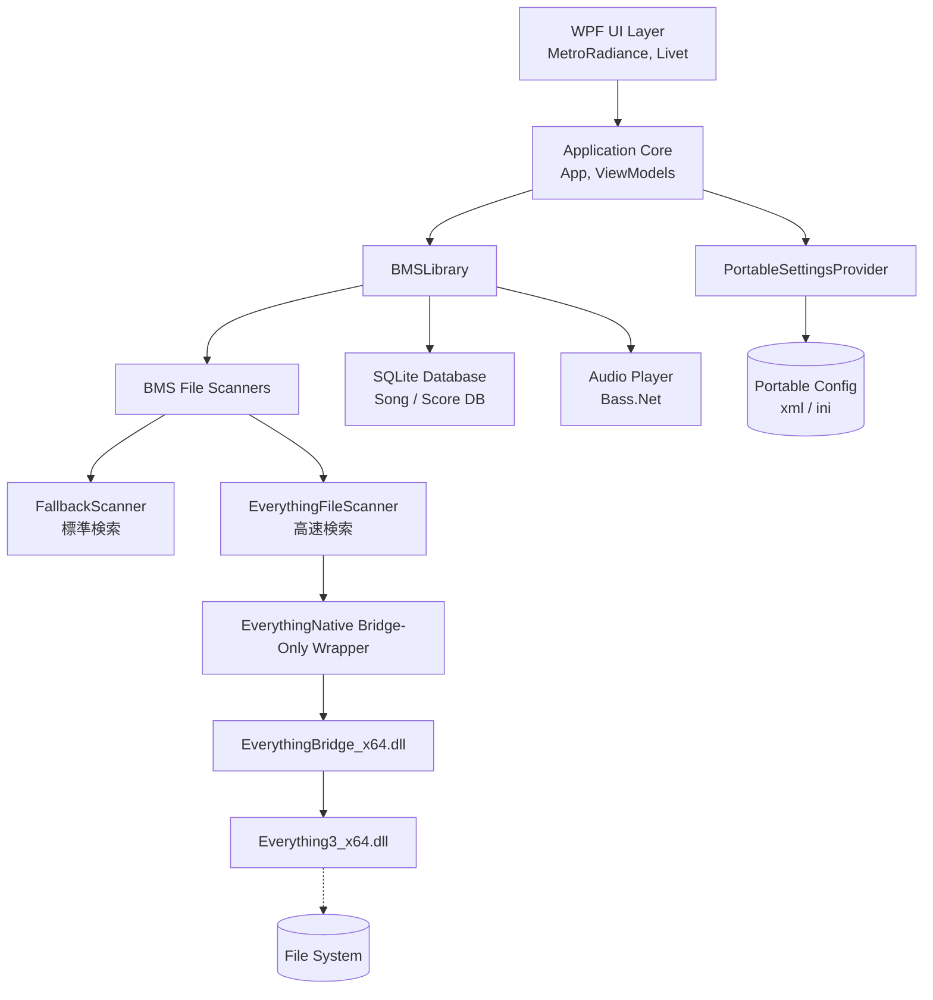
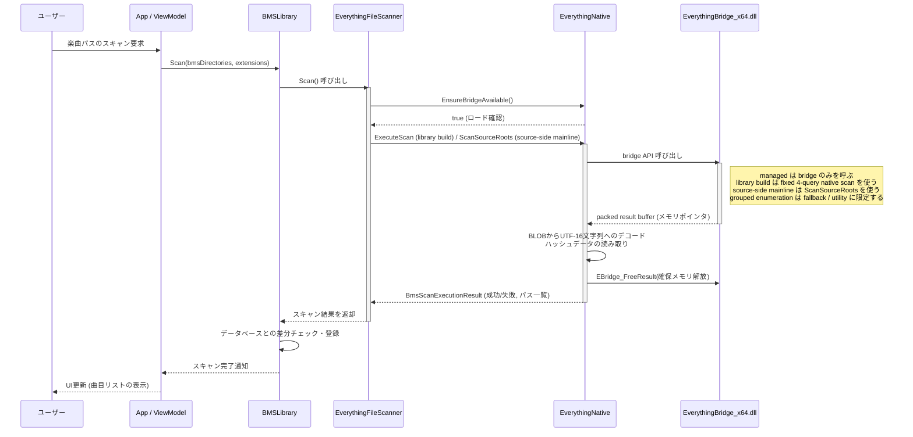

# BeMusicSeeker-decomp 技術仕様書

本ドキュメントは、デコンパイル・改修された `BeMusicSeeker` (BeMusicSeeker-decomp) のシステムアーキテクチャ、技術スタック、主要フロー、およびAPI定義について記述します。

## 1. システム構成図

全体的なシステム構成および主要なモジュール間の関係を以下に示します。



## 2. 使用技術スタック

本プロジェクトは以下の技術要素で構成されています。

| カテゴリ                   | 技術・ライブラリ                      | 概要・用途                                                                                       |
| -------------------------- | ------------------------------------- | ------------------------------------------------------------------------------------------------ |
| **言語・フレームワーク**   | C# (C# 7.0+), .NET Framework 4.7.2    | ロジック実装、Windows Desktop向けベースフレームワーク                                            |
| **UI・プレゼンテーション** | WPF (Windows Presentation Foundation) | デスクトップアプリケーションのGUI描画                                                            |
| **UIフレームワーク**       | Livet, MetroRadiance                  | MVVMアーキテクチャ基盤、およびモダンなWindows UIテーマ                                           |
| **データベース**           | sqlite.net                            | 楽曲メタデータ(SongDB)およびスコアデータ(ScoreDB)のローカル管理                                  |
| **オーディオ処理**         | BASS.NET                              | BMSのプレビュー再生・音声処理                                                                    |
| **ファイル高速検索**       | Everything SDK (C API)                | managed 側は `EverythingBridge_x64.dll` のみを呼び、bridge 内部で `Everything3_x64.dll` を使う。library build は fixed 4-query native scan、source-side mainline は `EBridge_ScanSourceRoots`、grouped enumeration は fallback / utility 用に分離する |
| **ユーティリティ**         | NLog                                  | アプリケーションの動作ログ出力(通常・エラーログ)                                                 |
| **ユーティリティ**         | SevenZipExtractor                     | アーカイブ解凍、パッケージインストール                                                           |
| **ユーティリティ**         | DynamicJson                           | IR(Internet Ranking)通信等のJSONデータパース処理                                                 |

## 3. 主要コンポーネント間のシーケンス図

ここでは、アプリケーションの代表的なユースケースである **"BMSファイルの高速スキャン (Everything連携)"** のフローを示します。



## 4. API定義

本プロジェクトにおいて新設・主要なAPIとなる **Everything連携ブリッジAPI (C/C++ Native -> C#)** のインターフェース定義を示します。

### 4.1. EverythingBridge_x64.dll エクスポート関数

ネイティブDLL層で公開されている関数です。WPFアプリ (C#) の `EverythingNative` クラスから `P/Invoke` (DllImport) により呼び出されます。

#### `EBridge_ScanChartAndResources`

Everything検索クエリを実行し、結果を一括で取得するための関数です。

- **主用途**:
  - library build の mainline
  - chart / audio / image / movie の fixed 4-query native scan

- **署名**:

    ```csharp
    [DllImport("EverythingBridge_x64.dll", CharSet = CharSet.Unicode, CallingConvention = CallingConvention.Cdecl)]
    private static extern int EBridge_ScanChartAndResources(string chartQuery, string audioQuery, string imageQuery, string movieQuery, out IntPtr outResult);
    ```

- **引数**:
  - `chartQuery` (in): `.bme/.bms/.bml/.pms/.bmson` を対象にした chart 検索クエリ文字列。
  - `audioQuery` / `imageQuery` / `movieQuery` (in): ライブラリ roots 配下の共有 resource をカテゴリ別に列挙する検索クエリ文字列。
  - `outResult` (out): 検索結果を格納した `EBridgeResultHeader` 構造体へのメモリポインタ。

- **戻り値**: 実行結果のステータスコード (`0` ならば成功)。
- **備考**:
  - library build の managed mainline はこの fixed-scan 契約だけを使う
  - app と bridge DLL は常にセット管理され、旧 contract との切り替えは想定しない

#### `EBridge_EnumerateGroupedFiles`

Everything 検索クエリを grouped enumeration としてまとめて実行し、結果を一括で取得するための関数です。

- **用途**:
  - `chart`
  - `audio`
  - `image`
  - `movie`
  - `__all__`
    のような group を 1 回の bridge 呼び出しで列挙する
- **主用途**:
  - fallback 時の source-side package surface
  - utility / diagnostics / fallback 補助
- **備考**:
  - managed 側で `Everything3_x64.dll` を直接呼ばない
  - full path は bridge 側でまとめて収集し、packed buffer として返す
  - `__all__` は utility / diagnostics 用に残るが、source-side mainline では使わない

#### `EBridge_ScanSourceRoots`

source-side package surface を 4-query native aggregation で構築するための関数です。

- **用途**:
  - 1 つ以上の source root を受ける
  - `chart / audio / image / movie` の 4 query だけを実行する
  - root ごとの chart paths と resource hash/count summary を packed buffer で返す
- **主用途**:
  - install estimation 用 source surface
  - pending estimate 前後の package source scan
- **備考**:
  - `__all__` full-path query は使わない
  - 件数は `tracked/chart/resource` summary として返す
  - `BMSPackage.BMSFiles` はこの API を直接叩かず、chart discovery cache を優先する
  - source-side で Everything を使うかどうかは設定
    - `保留パッケージの推定時に Everything を使用する`
    - で切り替え、既定値は無効

#### `EBridge_FreeResult` / `EBridge_FreeSourceRootsResult` / `EBridge_FreeGroupedFilesResult`

bridge API がポインタとして確保したネイティブメモリを解放します。（メモリリーク防止用）

- **署名**:

    ```csharp
    [DllImport("EverythingBridge_x64.dll", CallingConvention = CallingConvention.Cdecl)]
    private static extern void EBridge_FreeResult(IntPtr result);
    ```

- **引数**:
  - `result` (in): 解放対象のメモリポインタ。

### 4.1.1. bridge-only 原則

- `EverythingNative` は `EverythingBridge_x64.dll` だけを `P/Invoke` する
- `Everything3_x64.dll` の load/export 判定や query 実行は bridge 側責務とする
- library build の fixed-scan path は `EBridge_ScanChartAndResources` を前提にし、managed 側で ownership/hash を再構築しない
- 今後 file search / enumeration 基盤を拡張する場合も、まず bridge API の拡張を検討する

### 4.2. EBridgeResultHeader 構造体

`outResult` ポインタが示すメモリブロックのヘッダ構造です。取得したパス情報やハッシュ情報が一連のBLOB（バイナリラージオブジェクト）としてパックされています。

```csharp
[StructLayout(LayoutKind.Sequential)]
private struct EBridgeResultHeader
{
    public int status;             // 処理ステータスコード
    public int error_code;         // エラーコード
    public ulong chart_count;      // ヒットした chart ファイルの数
    public IntPtr chart_offsets;   // chart ファイルパス(UTF-16)のオフセット配列
    public IntPtr chart_blob;      // chart ファイルパス文字列データの実体
    public ulong dir_count;        // ディレクトリの数
    public IntPtr dir_offsets;     // ディレクトリパスのオフセット配列
    public IntPtr dir_blob;        // ディレクトリパス文字列データの実体
    // audio/image/movie の basename hash と relative path hash をカテゴリ別に保持
    // generic all-resource hash は payload として持たず、必要時だけカテゴリ union から派生する
    public ulong raw_buffer_size;  // 確保されたバッファの合計サイズ
}
```

### 4.3. C# 内部モデル

`EverythingFileScanner` / `FastDirectoryFileScanner` が返す、chart-directory keyed の共通 scan 結果です。

```csharp
public class BmsScanExecutionResult
{
    public bool Success { get; set; }           // スキャンの成功可否
    public string ErrorReason { get; set; }     // エラーが起きた場合の理由
    public bool NativeBridgeUsed { get; set; }  // Everything Native Bridge が利用されたか
    public long NativeBridgeMs { get; set; }    // 検索にかかった時間(ms)
    public string NativeBridgeReason { get; set; } // 利用した bridge backend の理由/種別
    public long ManagedDecodeMs { get; set; }   // packed result の unpack 時間
    public long ManagedMaterializeMs { get; set; } // BmsScanResult への remap 時間
    public ulong BridgeRawBufferBytes { get; set; } // native packed buffer size
    
    public BmsScanResult Result { get; set; }   // 検索結果オブジェクト本体
}

public class BmsScanResult
{
    public HashSet<string> ChartFilePaths { get; set; }
    public HashSet<string> ChartDirectories { get; set; }
    public Dictionary<string, uint[]> AudioRelativePathHashesByChartDirectory { get; set; }
    public Dictionary<string, uint[]> ImageRelativePathHashesByChartDirectory { get; set; }
    public Dictionary<string, uint[]> MovieRelativePathHashesByChartDirectory { get; set; }
    public Dictionary<string, uint[]> SelfOwnedAudioRelativePathHashesByChartDirectory { get; set; }
    public Dictionary<string, uint[]> SelfOwnedImageRelativePathHashesByChartDirectory { get; set; }
    public Dictionary<string, uint[]> SelfOwnedMovieRelativePathHashesByChartDirectory { get; set; }
}
```

補足:

- `sibling:` query は廃止した
- resource は存在ディレクトリではなく「最長一致する chart directory」へ再集約する
- managed scan result は chart-relative key のみを保持し、旧 basename surface は公開しない
- `FilesByDirectory` は source of truth ではなくなり、推定用 cache は hash-only shape に統一される

これらの連携機能と拡張により、元のシステムから大幅な楽曲スキャンパフォーマンス向上とポータブルでの運用が可能になっています。

## 5. BMS差分導入先推定ロジック

本アプリケーションでは、ユーザーがWAVやBGAなどのマルチメディアファイルを含まない「BMS差分パッケージ（追加譜面など）」を導入する際、対応する本体データを保持する既存の楽曲フォルダを自動で探し出し、そこへインストールする独自ロジックを備えています。

### 5.1. 処理フロー

推定ロジックの実体は `BMSLibrary` クラスの `searchEstimatedInstallationDirectory` メソッドです。

1. **代表ファイルの選出**
   インストール対象のBMSファイル群の中から、最も依存ファイル（参照するWAV/OGG/BGAや背景画像など）の定義数が多いものを「代表BMSファイル」として選出します。これにより、推定の際のスコア（充足度合）の分解能を高めます。
   
2. **カテゴリ別 reverse lookup による候補絞り込み (高速化)**
   代表BMSファイルが要求する依存ファイル名を audio / image / movie のカテゴリ別 resource reference として抽出し、起動時 scan で構築した `DirectoryResourceLookupCache` のカテゴリ別 reverse lookup と突き合わせます。
   譜面が要求するカテゴリの resource を持たない無関係なフォルダをこの段階で除外することで、後続の評価対象を絞り込みます。拡張子なし all-resource union は導入先推定の候補列挙や照合の正本には使いません。

3. **仮想配置シミュレーション**
   絞り込まれた候補フォルダに対して、選出した代表BMSファイルを仮想的に配置した場合の「依存ファイルの充足度（健康度 / Health）」を計算します。
   
4. **最適フォルダの決定**
   各候補フォルダにおける健康度を比較し、「単独の状態よりもWAVの欠損が少なくなる（閾値以上に改善する）」フォルダの候補をリスト化します。
   その後、以下の優先順位でソートを行い、最上位のものをインストール先として決定します。
   - WAVファイルの充足度（降順）
   - BGAファイルの充足度（降順）
   - ムービーファイル、画像の充足度（降順）
   - ※同率に近い場合は曖昧な候補として扱い、複数候補を提示できる状態にします

### 5.2. 設計意図・背景

BMSの差分機能は仕様上、本体のWAVファイル等と同じディレクトリ構造内にファイルを置かなければ音が鳴らない・動作しない状態になります。
従来のパッケージドラッグ＆ドロップによる自動インストールでは、追加譜面が独立した新規フォルダに保存されてしまう問題がありました。このマッチング・スコア評価を用いた仮想配置シミュレーションにより「WAVの欠損関係が最も綺麗に解消されるフォルダ」を発見・統合できるようになり、ユーザビリティ・プレイ体験の向上が図られています。
また、全BMSフォルダでの完全な総当たりシミュレーションはパフォーマンス上のボトルネックでしたが、カテゴリ別 reverse lookup の導入により、精度を落とすことなく対象候補を数万規模から少数へ絞り込めます。
