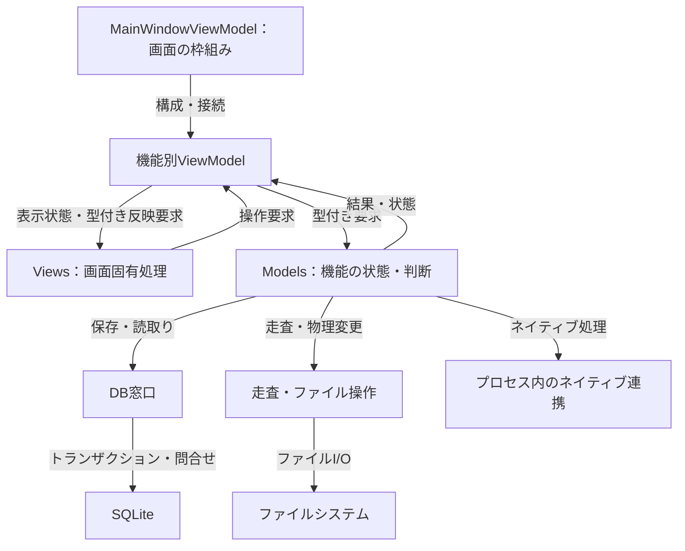

# アーキテクチャ

## 目的と適用範囲

アプリケーションの構成、責務の分担、実行・配布の境界を示します。機能ごとの詳細な手順は、各領域の仕様を正本とします。

## 用語

[共通用語集](../glossary.md)の管理主体、DB窓口、保存モデル、読取りモデル、操作の入口を使います。WPFは画面基盤、MVVMは画面・表示状態・モデルを分ける構成、ネイティブ連携はプロセス内で読み込むWindows用ライブラリとの接続を指します。

## 仕様

### 実行基盤

.NET 10 / C# 14、`net10.0-windows`、x64を使います。画面はWPFを中心に、Windows Formsのホストも含みます。MVVMにはLivetCask、保存にはSQLite、ファイル検索にはEverything SDK 3とのネイティブ連携を使います。音声はManagedBass、ログはNLog、アーカイブはSevenZipExtractor、音声読取りの一部はNVorbisが担当します。依存バージョンの宣言を正本とし、本書に依存一覧を複製しません。

### 層と責務

| 配置 | 責務 |
| --- | --- |
| `BeMusicSeeker.Views` | WPFイベント、フォーカス、選択、スクロール、ヒット判定、ドラッグ表示、ダイアログ、ウィンドウハンドル。型付き要求に基づく最終的な画面反映。 |
| `BeMusicSeeker.ViewModels` | 画面の枠組みと機能別管理主体の接続。`MainWindowViewModel` は一覧・ツリー・導入・保守・設定・再生等を構成する。 |
| `BeMusicSeeker.Models` | カタログ、プレイリスト、導入、保守、リソース健全性、スコア、LR2同期の判断と状態。 |
| `BeMusicSeeker.Models.BmsLibraryInternal` | 保存、変更、走査、パッケージ、ファイル操作、投影、ネイティブ実行の管理主体と窓口。 |
| `BeMusicSeeker.Models.Utils` | 走査、パス、ハッシュ、設定等の共通処理。 |
| `native/EverythingBridge` | Everything SDK 3のx64連携。管理側のコードと同じ配布契約で扱う。 |

機能の状態や複数サービスの処理順をルートのViewModelへ戻しません。画面固有処理を隠すだけの転送クラス、可変状態・ロックを外へ並べる巨大な窓口、実行時に依存を探し回る仕組みは追加しません。

#### 責務の接続図

矢印はラベルに示す構成・要求・結果の接続です。箱は責務の単位であり、フォルダ、名前空間、アセンブリが一対一に分離しているという意味ではありません。機能内部の全依存や呼出し順は省略しています。

ルートのViewModelを全処理の中継点にはしません。変更操作の管理主体間の順序は[変更セッション](../library/mutations.md#操作単位の変更セッション)、起動依存は[起動](../runtime/startup.md)を参照します。

### ソースの配置

メインアプリのプロジェクト境界は `BeMusicSeeker/` とし、プロジェクトファイル、依存ロック、設定、ソース、埋込み資源をこの配下に置きます。`Ribbit/`、`Parago/`、`OutlineFont/` も同じアセンブリの構成要素として収容し、名前空間は維持します。テスト、更新プログラム、補助ツールはそれぞれ独立したプロジェクトです。

テーマ辞書は `BeMusicSeeker/Themes/`、アプリの素材は `BeMusicSeeker/Assets/` の `Audio/`、`Fonts/`、`Images/`、`Icons/` に置きます。`Properties/` にはアセンブリ情報、リソース、設定、発行プロファイルを集約します。以下の層内の配置は `BeMusicSeeker/` を基準に示します。

`native/`、`vendor/`、`third_party/`、`lang/` はリポジトリ直下に置き、プロジェクトから必要なファイルを明示して参照します。ソースの配置と配布物の配置は区別し、配布物の `native/`、`libs/x64/`、`lang/`、実行ファイル直下の `test.mp3` は維持します。ビルドの中間生成物と通常出力は各プロジェクトの `obj/`、`bin/` に置きます。

物理フォルダは既存の機能・管理主体を探す単位とし、名前空間や公開範囲とは区別します。名前空間は既存の型識別と保存・XAMLの参照を維持します。同じpartial型のファイルは一箇所へ置き、機能専用の要求・結果・補助処理を管理主体と揃えます。

| 配置 | 探す対象 |
| --- | --- |
| `Models/Chart`、`Library`、`Playlist`、`Install` | 譜面・スコアのモデル、ライブラリの構成と変更主体、表と項目、パッケージと導入要求。 |
| `Models/Playback`、`Settings`、`ExternalActions`、`Ir`、`Resources` | 再生、設定の保存・編集、外部プログラム操作、IR、譜面リソースの識別。既存の `LR2`、`Update`、`Localization` は各連携・機能を担当する。 |
| `Models/BmsLibraryInternal/Catalog`、`Mutations`、`FileOperations`、`Scanning` | カタログの正本と投影、変更セッションの事実と結果、物理変更の境界、譜面の走査・確定。 |
| `Models/BmsLibraryInternal/ChartInfo`、`Resources`、`ResourceHealth` | 譜面解析と補完、譜面リソースの参照・逆引き、健全性の判定・更新。WPFリソースとは区別する。 |
| `Models/BmsLibraryInternal/Install`、`Maintenance`、`Playlist`、`Lr2`、`PlayHistory`、`Score`、`Ir`、`Startup`、`Dialogs` | 各機能の管理主体と要求・結果。DB窓口、ライブラリ全体の設定・実行条件は `BmsLibraryInternal` 直下に置く。 |
| `Models/Utils/Scanning`、`FileOperations`、`Processes` | 走査基盤、ファイルシステム操作、外部プロセス・シェル操作。用途を限定しない通知・同期等の小さな補助は `Utils` 直下に置く。 |
| `ViewModels/MainWindow` | ルートViewModelの全partial、構成、画面全体の更新判断・進捗・終了。 |
| `ViewModels/ChartList`、`ChartOperations`、`Install`、`Maintenance`、`Playlist`、`PlayHistory`、`Playback`、`Search`、`Settings`、`Lr2`、`Startup`、`Update` | 各機能の表示状態と操作の入口。メイン画面で使うことだけを理由に `MainWindow` 配下へ分散させない。 |
| `Views/CustomTable`、`Converters`、`MainWindow`、`Playback`、`Playlist`、`PlayHistory`、`Search`、`Settings`、`Dialogs` | 表部品、値変換、機能別の画面・端末処理。機能専用ダイアログはその機能へ、汎用・起動用は `Dialogs` へ置く。共通WPF部品は直下に置く。 |

層全体の接続・共通契約は各層の直下に置きます。ファイル数だけを基準に細分化したり、分類しにくい型を集めるためのフォルダを増やしたりしません。XAMLとコードビハインドを移すときは、相対リソースURIとソースパスを読む既存検証・文書も同時に追従させます。

テストの物理配置は[テスト作成](../development/test-authoring.md#既存テストの調査と配置)に従います。

### 主な構成要素

| 型 | 担当 |
| --- | --- |
| `App` | プロセス起動、設定移行、ログ、未処理例外の境界。 |
| `MainWindowViewModel` | 起動・再読込みの接続、子の管理主体の構成、型付きの完了結果と画面の接続。 |
| `StartupProgressWorkflowOwner` | 操作識別、必要な段階と完了段階、失敗、操作制限、進捗表示。 |
| `StartupBackgroundTaskSchedulerOwner` | 必須・後続処理、依存関係、実行区分、要求の集約、終了時の待機。 |
| `BMSLibrary` | 所持カタログ、リソース索引、保留・導入済みパッケージ、スコア、変更主体の構成。 |
| `BMSPlaylist` | 表と項目の保存、編集、URL・外部同期の構成。 |
| `BmsLibraryDbGateway` | 楽曲・スコアDBの読取りとトランザクション。 |
| `EverythingNative` | ネイティブ取得結果の復号とリソース索引への入力。 |

### 起動と非同期処理

起動では、導入先推定の準備、初期表示、通常操作の解禁、必須の初期読込み、起動スケジューラー内の後続処理完了を分けます。スケジューラー外のランキング・XML取得、遅延表示反映は別に追跡します。任意のフォルダ更新や低優先度表示を、アプリ全体の操作解禁条件へ加えません。具体的な依存は[起動仕様](../runtime/startup.md)に従います。

画面のコレクションは読取りモデルとして扱い、所有するUI実行窓口で反映します。DB・ファイル・通信・解析の長時間処理はUIスレッドの外で行います。ただし、ドラッグ元が短時間しか有効でない入力の確保など、入口の寿命契約を機械的な非同期化で壊しません。

モデルのロック・DBトランザクション・排他権を保持して、UI、ダイアログ、通知先、別管理主体を同期的に待ちません。単発の必須処理は管理主体が明示的に待ち、破棄可能な高頻度表示だけを既存の表示識別で集約します。終了まで追跡できない非同期処理を増やしません。詳細は[ワークフローと並行性](workflow-concurrency.md)を参照します。

### ネイティブ連携

Everythingを利用できる通常走査は `EBridge_ScanChartAndResources` を使い、譜面相対のリソースキーと逆引き用の情報も受け取ります。Everythingを利用できない場合には規定の管理側走査を使いますが、古いネイティブABIや契約不一致を互換経路で救済しません。入力の完全性と識別規則は[データと索引](data-and-indexes.md)を参照します。

### 配布の構成

アプリは `win-x64` の自己完結型配布とし、管理コードの単一ファイル化とReadyToRunを使います。

| 設定 | 値 |
| --- | --- |
| `SelfContained` | `true` |
| `PublishSingleFile` | `true` |
| `PublishReadyToRun` | `true` |
| `PublishTrimmed` | `false` |
| `IncludeNativeLibrariesForSelfExtract` | `false` |
| `IncludeAllContentForSelfExtract` | `false` |
| `EnableCompressionInSingleFile` | `false` |

BASS・7zは `libs/x64`、Everything連携は `native`、言語ファイルは `lang` に配置します。ネイティブや全内容の自動展開、単一ファイル圧縮、トリミングは使いません。配布形式の判断根拠と測定条件は[配布性能資料](../../acceptance/net10-distribution-performance.md)を参照し、その選定用の「5秒かつ15%」をアプリ全体の退行許容値にはしません。

`System.Resources.Extensions` と `System.Configuration.ConfigurationManager` はWindowsDesktopランタイムが供給します。アプリの直接依存や中央バージョンへ追加せず、偶然のロックファイル項目を構成契約として固定しません。設定と実配布物の動作を、それぞれの境界で確認します。

## 実装とテストの対応

| 仕様項目・主な条件 | 実装箇所 | テスト箇所・確認内容 |
| --- | --- | --- |
| 設定保存の型と互換性 | [Settings.cs](../../../BeMusicSeeker/Properties/Settings.cs)、[PortableSettingsProvider.cs](../../../BeMusicSeeker/Properties/PortableSettingsProvider.cs) | [PortableSettingsPersistenceTests](../../../BeMusicSeeker.Tests/Settings/PortableSettingsPersistenceTests.cs) の `SaveRoundTripsThroughFreshGeneratedSettingsAndPreservesUnknownKeys`: 新しい設定インスタンスでの再読込みと未知キーの保持。 |
| 管理依存の配置・配布物 | [BeMusicSeeker.csproj](../../../BeMusicSeeker/BeMusicSeeker.csproj)、[publish.ps1](../../../scripts/publish.ps1) の `Invoke-SelfContainedPublish` | [ManagedDependencyOutputPolicyTests](../../../BeMusicSeeker.Tests/Verification/ManagedDependencyOutputPolicyTests.cs) の `ApplicationProjectUsesHostManagedDependencyLayout` と[Full検証](../development/testing.md)の実配布物起動・更新。 |
| 機能ごとの責務・起動・変更 | 各領域の管理主体 | [起動](../runtime/startup.md)、[ライブラリ変更](../library/mutations.md)、[画面](../ui/README.md)の対応表で確認する。 |

## 関連資料

[データと索引](data-and-indexes.md)、[性能](performance-and-scale.md)、[ワークフロー](workflow-concurrency.md)、[ポータブル更新](../integration/portable-update.md)、[リリース](../development/release.md)。
