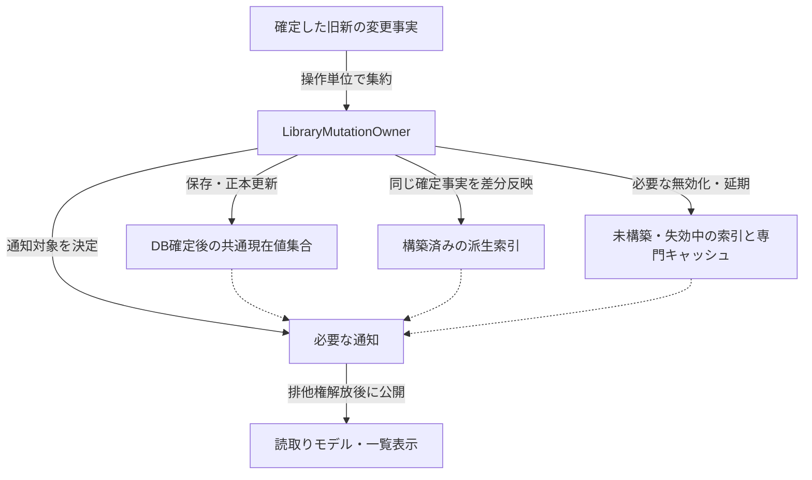
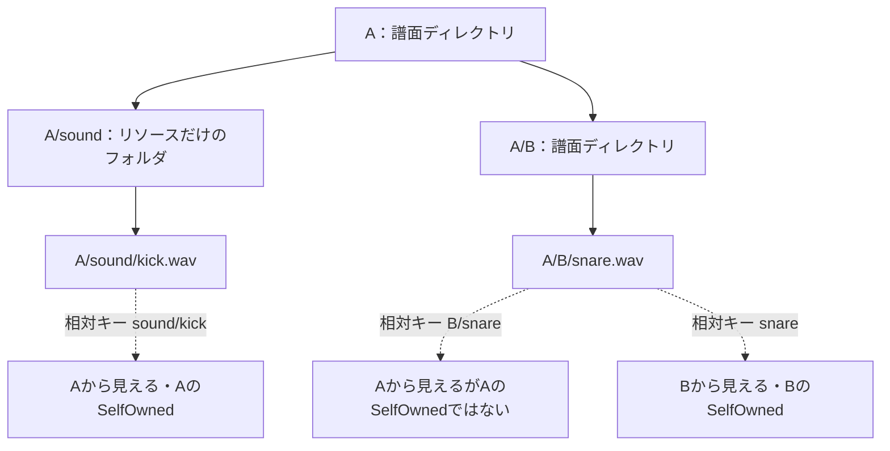

# データと索引

## 目的と適用範囲

保存データ、所持譜面集合、用途別の索引について、所有権・識別条件・更新・公開の境界を定めます。少数の変更に対する仕事量と全件処理の受入条件は、[性能とデータ規模](performance-and-scale.md)を正本とします。

## 用語

[共通用語集](../glossary.md)を参照します。コードの識別子は原表記を使います。

| 用語 | 意味 |
| --- | --- |
| 完全一致パス | 各保存・索引境界が持つ正規化済みのキー。大小文字の比較規則を別の曖昧な同一性へ広げません。詳細は[パスの識別規則](path-identity.md)を参照します。 |
| 所属数 | 同じハッシュやディレクトリに対応する所持項目の数。候補の有無だけとは区別します。 |
| 構造共有 | 変更のない部分を旧スナップショットと共有し、変更箇所への経路だけを置き換えること。 |

## 仕様

### 保存データの責務

| データ | 用途と制約 |
| --- | --- |
| `song` / `folder` | LR2互換のBMSカタログ。保存行型はDB境界に限定し、アプリの現在値は `ChartFile` です。 |
| `bmson_song` | アプリ独自のBMSONカタログ。LR2の `song` に互換行を作りません。 |
| `chart_digest_map` | BMSのMD5とSHA-256・譜面情報を結ぶ部分的なキャッシュ。初回走査前に完全である必要はありません。実ファイルを読む処理で必要な範囲を補います。 |
| `chart_info` / 解析失敗の記録 | 解析版とファイルの状態に応じた譜面情報。読込み後はセッション索引に反映します。LR2同期の状態を鮮度判定に流用しません。 |
| `maintenance` | 保存済みのリソース健全性とBMS固有の文字コード情報。未計算状態とは区別します。 |
| プレイリストのヘッダー・項目 | 操作と保存・出力の正本。所持判定には項目の選択キーを使います。 |
| `ir_score` / `ir_data` | LR2IRのプレイヤースコアと順位キャッシュ。異なる取得元・更新条件を持ちます。 |

`ChartFile` はこれらのDB行ではなく、用途別の共通読取りモデルです。所持項目と保存行の関係は[譜面の共通モデル](../library/chart-model.md)を参照します。

### 共通現在値の格納・識別・順序

`OwnedChartCollectionState` はパスとMD5のある共通値を採用し、形式をまたぐ同じDB exact pathではBMSを優先します。同MD5の別配置は残し、除外した重複を先の項目の削除後に自動昇格させません。DBの `Ordinal` と物理対象の `OrdinalIgnoreCase` を混同しません。

`CatalogOwnedCollectionOwner` が唯一の現在値集合・排他・集合版・派生索引を所有します。`CatalogStorageIndexedSequence` の変更不能なルートを共有し、tokenから既存sequence entryへ到達します。パス完全一致索引と派生参照索引から対象を直接探し、順序キーの二分探索で位置を求めます。捕捉済みビューは所属・順序・版に加えて要素の値も固定し、後の現在値適用・移転で変わりません。形式別ビューを捕捉するために全件を複製しません。

形式別範囲ビューの列挙・検索・コピーは、その範囲だけを読みます。先頭開始は通常の列挙器を使い、途中開始は上限256件の局所バッファ一つを再利用して `ImmutableList.CopyTo` で順次取得します。範囲外の前置項目と末端項目を訪問せず、全列挙では必要な各項目を一回取得します。早期終了時の範囲内先読みも `ObserveEntryVisit` に含め、indexer取得の `ObserveAccess`、開始の `ObserveEnumeration`、明示結果具体化の `ObserveMaterialization` と区別します。明示具体化0件でも、この一時バッファは存在します。

通常一覧はBMSの格納順に続けて、BMSONを現在の `Path` の `OrdinalIgnoreCase` 順で公開します。内部移転後も現在パスで整列し、捕捉済みの旧順序・値は変えません。呼出側の `includeBmsonRows` は捕捉前に渡し、BMS専用一覧ではBMSONの列挙・整列を行いません。

| 更新 | 識別と順序 |
| --- | --- |
| DB全再読込み | 境界で一回共通値へ変換し、新しいtokenを発行します。入力の相対順と従来の除外条件を維持します。 |
| BMS追加・再解析置換 | 新しいtokenを発行し、旧exact pathを除いて入力順にBMS末尾、BMSONの前へ置きます。 |
| BMSON追加・再解析置換 | 新しいtokenを発行し、捕捉したpathを大小文字を区別せず並べ、置換は同順位の末尾へ移します。 |
| 通常値の適用・詳細由来の基本値更新 | 同じtokenと位置へ新しい不変値を一回適用します。旧捕捉値は変更しません。 |
| 内部移転 | 同じtokenと格納位置を継承し、明示的な旧新pathで現在値・索引を更新します。旧キーを新pathから推測しません。 |
| 差分変更なし | 現在値とtokenを継承します。外部移転のhash再接続は利用者列だけを復元し、tokenは継承しません。 |

全置換後の最初の追加・更新ではBMSON部分だけを一度整列します。BMSの列・順序キー・索引を共有し、全BMSを複製・再採番しません。移転は捕捉済みの順序位置を保ち、画面の並べ替えには共通現在値のpathを使います。`LibraryChartRefIndexSnapshot` の局所更新でも、全譜面の順位表を作りません。

集合版は所属・基本値・path/hashの確定変更でだけ進めます。詳細表示・スコア・保守・警告だけの更新では進めず、既存の専門版と通知を使います。形式別の保存行版と共通集合の二重同期、getterでの全件照合・再構築を行いません。

### 共通変更と派生索引

`LibraryMutationOwner` は共通の変更事実から、追加・削除・移転・ハッシュ変更・導入先変更・保守対象を一度組み立て、`DispatchOwnedChartCollectionMutation(...)` から必要な索引へ渡します。各索引が保存行のsetterや任意のコールバックで別々に判断する経路は増やしません。

通常の変更では旧path/hashを不変の変更事実として捕捉し、DB確定後だけ共通現在値へ一回適用します。構築済み索引へ同じ旧新事実を渡し、排他権を解放してから通知します。未構築索引は変更のためだけに構築しません。全置換、必要な旧新対応の不足、途中失敗では従来どおり必要な無効化を行い、識別条件違反を無効化で隠しません。

共通値と集合版は同じ既存排他で捕捉・適用します。DB失敗・確定前取消しで現在値を先行変更しません。詳細書込みもDB確定、同tokenへの必要な基本値更新、ハッシュ依存索引、詳細セッション索引、解放後通知の順に行います。[譜面情報](../library/chart-info.md)を参照します。

| 索引・表示状態 | 更新方針 |
| --- | --- |
| MD5の所持数 | 追加・削除・MD5変更を集約します。同MD5の置換やSHA-256だけの変更は相殺し、不要な更新をしません。 |
| 導入済みディレクトリ | MD5・SHA-256ごとの所属数、既知ディレクトリを対象だけ更新します。 |
| 実パスの参照・子孫数 | 実際の所属・移転を反映します。予定の導入先を混ぜません。 |
| 導入先の一時状態 | 導入先変更と元の所持主体・パッケージ項目の消失を反映します。実ファイルの存在や子孫数の根拠にはしません。 |
| 親フォルダ候補 | 現行キャッシュを無効化します。捕捉済みパスを再利用し、出力先の正規化は一回の構築につき一度行います。 |
| プレイリストの所持ハッシュ・参照解決 | 構築済み索引へ対象ハッシュの差分と同tokenの基本値変更を局所反映し、捕捉済みの旧値を維持します。基本値だけの更新のために全件を再構築しません。 |
| プレイリスト参照の表示更新 | 選択キーに一致する所持参照だけをその都度取り出します。全参照一覧を複製してから絞り込みません。 |
| リソース健全性 | 対象の差分を優先し、入力不足時は無効化・延期・必要な全件処理を選びます。 |
| 重複行・グループ | 共通現在値の捕捉sequenceとハッシュ別の不変派生索引を共有します。構築済みの索引は変更したハッシュの要素だけを更新し、グループ結果を無効化します。局所現在値更新のために全件を走査・複製しません。 |
| 通常一覧 | 所持集合の変更と、警告・保守・導入先・参照表示の変更を別の依存世代として通知します。表示値だけの変更で元一覧の世代を進めません。 |

通常通知は `NormalLibraryRefreshNotificationVersion` を入口にし、変更した共通値と削除tokenを渡します。`NormalLibraryRowCache` はtokenをキーに対象だけを適用・除去します。詳細は既存の詳細版と変更MD5/SHA-256、スコアは既存の版と変更キー、保守・警告は既存通知と対象、Packageは `ProjectionVersion` とdeferralで更新します。明示的な全置換だけをReset境界とし、局所変更で全sourceのReset、全catalog走査、全件投影・リソース解析を行いません。

導入済み項目の参照索引は `PackageLifecycleOwner` が既存の所属ロック内で管理します。tokenに対応するlive entry参照と所属package参照集合だけを持ち、共通現在値・保存行・独立版・永続識別を追加しません。確定値の局所反映では対応entryだけを訪問し、全導入済み列の走査・entry複製・lazy構築をしません。DB確定、共通現在値への一回適用、既存索引反映の後で対応entryへ適用し、項目とモデルの排他を解放してから既存の通知を公開します。

#### 変更事実から索引・表示への反映

実線はラベルに示す変更情報の受渡し、破線は公開前の順序条件です。`LibraryMutationOwner` が一度組み立てた変更結果を保存正本と必要な派生状態へ渡し、保存行や所持集合の変更通知から索引差分を再推測しません。索引反映と無効化の枝は変更に応じて必要な側だけを扱い、両方が対象になる場合もあります。通知への破線の合流は、その変更で対象になった内部反映・無効化の完了を表し、全枝を毎回実行するAND条件ではありません。

未構築の索引を変更のためだけに構築しません。通常一覧の表示値だけの変更も、所持集合全体の版更新とは分けます。譜面情報の書込み順序は[譜面情報](../library/chart-info.md#保存する列と公開順序)を参照します。

### ハッシュと導入済みディレクトリ

索引の状態、ロック、初期化状態、世代、読取り・構築・反映は `CatalogOwnedCollectionOwner` が所有します。BMSLibraryの公開窓口や利用側に同じ世代・索引の正本を重複して置きません。

`PrimaryHashLookupState` はMD5の件数だけを扱います。既所持判定や安全な削除のために、全ディレクトリ索引や詳細譜面を作りません。`InstalledChartLookupIndexState` はMD5・SHA-256からディレクトリへの所属数、ディレクトリ内の異なるMD5数、既知ディレクトリを持ちます。同じハッシュを持つ最後の所持項目が消えるまで候補を保持します。

所属が変わったハッシュだけを、大文字小文字を区別しない候補順で更新します。スナップショットと除外付きの検索結果は変更不能なルートを共有し、後続変更で変わりません。作成時の全map複製や全候補の再整列をしません。`DirectoryReferenceCount` は更新済みの所属数を返します。初回構築と、呼出側が全既知ディレクトリを明示列挙する仕事は残ります。

通常削除と統合は、種類・完全一致パス・変更前MD5・SHA-256を同じ確定事実としてカタログと索引へ渡します。`PathCleanup` を理由に既知の旧ハッシュを捨てません。DBだけの整理と所持主体の除去を区別し、元に所持譜面のない統合は検索索引の取得前に終了します。

### プレイリストの所持・解決索引

所持ハッシュ索引はMD5・SHA-256それぞれの所持項目数を持ち、最後の項目が消えた場合にだけ所属を除きます。両ハッシュ集合が同じなら内容の `Version` を維持し、所持数集計を再利用します。共通集合版はハッシュ所属内容の版と別に管理します。

参照解決索引は、種類と完全一致パスで全候補を保持します。代表は現在パスの大文字小文字を区別しない最小値、同値なら所持集合で先のものです。代表の削除で次候補を選び、最後の候補がなくなると未解決にします。項目のMD5がある場合はMD5だけで解決し、未解決でもSHA-256へ切り替えません。

構築済み索引は、導入・移転・削除・ハッシュ変更の対象候補だけを更新します。旧スナップショットのパス・ハッシュ・代表は固定します。全置換、旧事実不足、全置換後の初回BMSON順序正規化では既存の全無効化を維持し、その後の通常更新は差分に戻します。

ハッシュ差分は通知前に反映します。既に現在の元データから再構築した索引へ旧差分を重ねず、正常に反映したハッシュ変更区間の終了時に再度無効化しません。元の版が違う結果や失敗した結果は公開しません。同世代の先行読込みTask共有は既存の管理主体に残し、利用機能ごとの別キャッシュを作りません。

### リソース索引と所有関係

`LibraryResourceIndexOwner` は、現在の `LibraryResourceIndex`、`DirectoryResourceLookupCache`、世代をまとめて所有します。長寿命の利用側は過去のキャッシュ実体を保持せず、現在のスナップショットまたは変更命令を使います。ファイル操作は索引のロック外で実行し、成功事実を反映します。

索引のキーは拡張子を除いた譜面相対パスです。`foo.wav` は `foo`、`sound/foo.wav` は `sound/foo` とし、単なるファイル名だけでは一致させません。音声・画像・動画を分けます。祖先から見えるリソースを含む集合と、最も近い譜面ディレクトリが所有する集合（`SelfOwned`）も分けます。

| 構造 | 共有と更新の規則 |
| --- | --- |
| ディレクトリ項目 | 変更不能な `Entry`、パスから順序番号へのmap、存在する番号だけの順序付きmapを共有します。全ディレクトリの複製・再採番をしません。 |
| 項目の位置 | 一つの未公開命令内では最後に削除した位置を再利用します。空き位置は次の命令へ持ち越さず、既存の候補順を守ります。欠番を列挙しません。 |
| 逆引き | 所有権を移した変更不能な初期mapと、キーごとの最新値だけを持つ共有可能な差分mapを使います。前世代を連鎖して探索せず、初期mapと差分の二層で解決します。 |
| 更新・公開 | 変更キーへの木の経路と必要な候補配列だけを置き換えます。複製直後の初回更新や公開時にも、全件変換・全件固定化を行いません。 |
| 入力の所有権 | 所有権移転が明示されたネイティブの構築結果を除き、入力配列を複製します。公開後に呼出側が変更せず、内部配列も外へ公開しません。 |

移動・名前変更は、対象項目のハッシュに対応する計算済み候補だけを調べ、位置を保ってパスを置換します。最終候補列が順序も含めて同じなら逆引きを書き換えません。空リソースの項目追加は項目格納だけを変更できます。

ただし、リソースの集合が同じだけでは変更なしと判定しません。`SelfOwned` だけの変更でも、既存の除去後追加の規則で `[A, B]` が `[B, A]` になる場合は更新します。未計算と計算済みの空候補、ハッシュ0、大小文字、遅延計算と全構築の意味を維持します。`updatedHashes` は除去・追加の遷移件数であり、正味の書込み回数ではありません。

一回の変更セッションで成功した導入・削除・統合をまとめ、必要な逆引き反映を一度行います。後続パッケージの判定には先行の**物理成功**を操作内の一時状態として渡し、パッケージごとの正本公開を通信手段にしません。元フォルダ除去と統合先の追加も一つの未公開変更にまとめ、同じ最終構成なら世代を維持します。

フォルダ削除は物理削除に成功した `DeletedFolderPaths` だけを集約し、命令全体で項目を一回走査して祖先集合と照合します。重複・親子の対象を二重計上せず、失敗・未実行対象は除きません。入力列挙や反映の失敗では旧索引・世代を維持しますが、先行する物理削除を取り消した保証にはしません。

初期mapの置換前データは索引の寿命内に残り、差分は同じキーの最新値だけを保持します。明示走査・全置換で初期mapを入れ替えます。自動圧縮、世代台帳、操作後への必須更新の延期は追加しません。

通常起動のネイティブ経路は `EBridge_ScanChartAndResources` の圧縮された結果から直接索引を作り、`ChartScanResult` にリソース辞書を重複して具体化しません。Everythingを利用できない場合の管理側走査とテスト用の統合では、カテゴリ別辞書を持つ経路を使います。逆引きは導入準備完了前に完成させ、保留パッケージの推定へ初回構築を持ち越しません。

#### 祖先から見える集合と自身の所有分

次は `A` と `A/B` にそれぞれ譜面がある例です。実線はディレクトリ包含、破線はリソースの見え方を表します。ファイル名やパスは説明用であり、特定の配置を必須にしません。

自身の所有者は最も近い譜面ディレクトリです。`A/sound` はリソースだけなので導入候補にはなりません。候補の抑制にこの区別を使う条件は[導入先推定](../library/install-estimation.md#祖先候補の抑制)に従います。

### リソース健全性

存在件数は取得済みの `ChartFile.Resources` だけから索引化した検索集合で計算します。同じ種別の `sound.wav` と `sound.ogg` は検索・分母では1件、元記述は2件保持します。`foo.v2.wav` の `LookupKey` は `foo.v2` のまま使い、集約や照合で再度拡張子を除去しません。任意画像は通常のBGAの分母へ入れず、stagefile・backbmp・bannerの用途別に計算します。BMSは空白でない元記述を定義ありとし、bmsonは解析で有効となった拡張子付きパスを定義ありとする既存差を維持します。

同じディレクトリと種別・用途別の検索集合で共有するのは存在件数です。定義の有無は用途別にキーと区別し、未知拡張子・空キーから親参照理由を作りません。未取得の表示用保守情報は件数未確定のまま扱い、健全性の計算やファイル取得を開始しません。LR2の長さ・文字コード・親参照は各譜面の全元記述から毎回評価し、存在件数キャッシュに依存しません。原文と解析状態の正本は[共通譜面](../library/chart-model.md#譜面情報とリソース保守)です。

有効な保守情報はDBから反映した `DbHydrated` または計算済みの `Calculated` です。未計算の仮値を健全性索引の正本にしません。通常起動では保存済み情報を読み、欠落・古い対象だけを後続保守へ回します。

構築済みの `ResourceHealthIndexSnapshot` は、種類と完全一致パスから対象・ハッシュ・警告へ直接到達します。対象の差分だけを更新し、健康状態への変更では警告だけを除いて対象数を維持し、譜面除去では所属も除きます。更新する警告は入力順に末尾へ追加し、未変更項目の順序と旧スナップショットを保ちます。全所属の複製、ハッシュ変更対象ごとの全キー探索、getterでの全件具体化はしません。

再利用できるスナップショットがない保守一覧の読取りは、初期化済み最小情報の読取りと共通現在値の読取り範囲内で対象を捕捉します。カタログ書込み途中の状態を空一覧として確定しません。再利用できる場合に新しい待機は加えません。

変更なし、無効化、延期、差分、必要な全件構築を入力条件で選びます。全件入力の取得条件、版の確認、失敗時の非公開を守り、移転・パス整理で必要な無効化を局所最適化のために省略しません。

`DeltaOnUpdates` は現在の索引へ差分を適用し、未構築・失効中や差分を適用できない場合は全件構築せず失効させます。`DeferOnUpdates` も更新中の構築を行いません。その後の表示準備が現在の索引を構築し、同じ入力に対する再表示は再利用します。構築済み索引への導入を不必要に失効させないための反映順序は[変更仕様](../library/mutations.md#操作ごとの反映範囲)に従います。

### 起動とIRデータ

導入準備までに必要な読取りは、パス・ハッシュ・時刻・フォルダ・所持関係などの最小カタログに限定します。全件の保守情報と譜面情報はこの必須経路へ戻しません。プレイリストのヘッダーとスコアを先に読み、項目は `playlist_entries_hydration` で反映します。

LR2ID確定後のプレイヤースコアXMLは、要求開始から本文受信まで一つの30秒期限を使います。終了要求は本文待機にも伝播します。同じプレイヤー・スコアDBへの先行取得は失敗結果も共有し、直後の再取得をしません。成功した空スコアと失敗を区別し、通信失敗・期限超過・取消では既存の `ir_score`、ハッシュ情報、現在のスコアを保持します。通常の結果型・ログ・背景処理の状態で伝え、新しい確認画面や再試行を加えません。

`ir_score` は未送信検出に使います。XMLのスコア実体から正規化ハッシュを作り、取得時刻で変動する `lastupdate` は除きます。`ir_data` はローカル順位XML由来のキャッシュであり、`UpdateLr2IrRankingCacheOnStartup=false` なら起動時に走査・読込み・更新をしません。

順位XMLは共通の一回走査の解析器を使い、`id`、`clear`、`notes`、`combo`、`pg`、`gr`、`minbp` が0以上の整数である行だけを集計します。ファイル時刻と末尾の `lastupdate` で再読込みを判定します。オフライン順位の計算器は必要時だけ作り、同じハッシュを起動時に読んでいれば再利用します。

初回の順位保存は、対象LR2IDの既存行がないことをトランザクション内で確認し、重複除去した行を一括挿入します。差分更新は `(hash, lr2id)` の削除・挿入を使います。互換性のため一意制約は加えず、`ir_data_idx(lr2id)` と非一意の `ir_data_idx_lr2id_hash(lr2id, hash)` を維持します。順位取得・反映は導入準備完了の待機条件にしません。

### DB読取り・スキーマ・削除

読取り用接続はスキーマを作成・修復しません。書込みを伴う整理・解析補完・ファイル差分反映は、書込み可能なトランザクションへ分けます。少数のパス・ハッシュの問合せを全表の具体化へ広げません。

`song` の `hashidx(hash)`、`parentidx(parent)`、アプリ側の `song_idx_folder(folder)` は通常のスキーマ準備でも不足を補います。`EnsureAppOwnedSchema()` はアプリ用の表・索引を現行化し、`app_schema_version(name='app_schema')` に `1` を記録します。既存のハッシュ行を保って修復する場合は `RepairAppOwnedSchema()` を使います。どちらも全譜面を読んで `chart_digest_map` を埋める処理ではありません。

初回連携で存在しないアプリ表を追加する場合は修復警告を出しません。既存の `playlist_entry` へのSHA-256列・索引追加、一意索引の作り直し、既存アプリデータの版記録・現行化は警告対象です。メタデータ配布用の `chart_info_schema_version` とDB内の `app_schema` は別の契約です。

「BeMusicSeeker関連データをLR2データベースから削除」は、`BeMusicSeekerOwnedTableNames` の表、対応する `sqlite_sequence` 行、ネイティブ表上のアプリ用索引を削除し、LR2の `song`、`folder`、`score` 等は残します。初期化・再読込み・背景更新中は受理せず、処理中は設定操作を無効化し、成功後に終了します。アプリ表・索引を増やす場合はこの一覧と回帰テストも更新します。

### パス整理とハッシュの所有関係

大量削除と局所の `PathCleanup` は、対象パス・ハッシュを一時表へ集め、`song`、`bmson_song`、`maintenance`、`chart_digest_map` を同じトランザクションで集合更新します。移転して残る保存主体の移動先は完全一致で保護し、対応する `song` がなくても対象の保守行を削除します。

BMSの削除前ハッシュは対象パスの一時表から主キーを引き、ハッシュ索引全体を走査しません。削除後に同MD5の `song` が残る場合はハッシュ情報を保持します。BMSONの整理はBMSONと保守の行に限定し、LR2行・ハッシュ対応表の保存主体を作りません。行ごとの孤児判定や全カタログの具体化に戻しません。

譜面情報の補完保存では、パスとMD5が一致する既存BMS行の `level`、`difficulty`、`maxbpm`、`minbpm`、`bga`、`exlevel`、`longnote`、`random`、`karinotes` だけを更新します。基本列・利用者管理列を再生成せず、欠落行を挿入しません。所持主体のない `chart_info` もメタデータキャッシュとして保持し、補完を理由に全削除しません。

## 実装とテストの対応

| 仕様項目・主な条件 | 実装箇所 | テスト箇所・確認内容 |
| --- | --- | --- |
| 保存行の順序、移転、一定差分の仕事量 | [`CatalogOwnedCollectionOwner`](../../../BeMusicSeeker/Models/BmsLibraryInternal/Catalog/CatalogOwnedCollectionOwner.cs)、[`CatalogStorageIndexedSequence`](../../../BeMusicSeeker/Models/BmsLibraryInternal/Catalog/CatalogStorageIndexedSequence.cs)、[`CatalogMutationOwner`](../../../BeMusicSeeker/Models/BmsLibraryInternal/Catalog/CatalogMutationOwner.cs) | [`CatalogMutationOwnerTests`](../../../BeMusicSeeker.Tests/Catalog/CatalogMutationOwnerTests.cs) |
| 範囲だけの取得と通常一覧の形式選択・現在パス順 | [`CatalogStorageIndexedSequence`](../../../BeMusicSeeker/Models/BmsLibraryInternal/Catalog/CatalogStorageIndexedSequence.cs)、[`OwnedChartCollectionState`](../../../BeMusicSeeker/Models/BmsLibraryInternal/Catalog/OwnedChartCollectionState.cs)、[`RegularChartListOwner`](../../../BeMusicSeeker/ViewModels/ChartList/RegularChartListOwner.cs) | [`CatalogMutationOwnerTests`](../../../BeMusicSeeker.Tests/Catalog/CatalogMutationOwnerTests.cs) の `FormatRangeOperations_VisitOnlyRequestedBmsonEntriesRegardlessOfBmsBackground`、`RangeEnumerationAndCapture_PreserveBoundsOrderAndCapturedValues`、`NormalSourceCaptureAndProjection_VisitEachIncludedEntryOnce`。BMSON64件・BMS背景16/128件で範囲内訪問、相対位置、明示コピー、捕捉前から本番行生成までの仕事量を確認します。[`OwnedChartCollectionProjectionTests`](../../../BeMusicSeeker.Tests/Catalog/OwnedChartCollectionProjectionTests.cs) の `CreateNormalLibrarySourceChartView_SortsBmsonRowsAndExcludesPathlessRows` が内部移転後の順序と旧捕捉値を確認します。 |
| 所持集合の順序、完全一致参照、未構築索引 | [`OwnedChartCollectionState`](../../../BeMusicSeeker/Models/BmsLibraryInternal/Catalog/OwnedChartCollectionState.cs)、[`LibraryChartRefIndexSnapshot`](../../../BeMusicSeeker/Models/BmsLibraryInternal/Catalog/LibraryChartRefIndexSnapshot.cs) | [`OwnedChartCollectionLookupMembershipTests`](../../../BeMusicSeeker.Tests/Catalog/OwnedChartCollectionLookupMembershipTests.cs)、[`OwnedChartCollectionReferenceIndexTests`](../../../BeMusicSeeker.Tests/Catalog/OwnedChartCollectionReferenceIndexTests.cs) |
| 導入済み索引、最後の所持主体、旧スナップショット | [`InstalledChartLookupIndexState`](../../../BeMusicSeeker/Models/BmsLibraryInternal/Catalog/InstalledChartLookupIndexSnapshot.cs)、[`CatalogOwnedCollectionOwner`](../../../BeMusicSeeker/Models/BmsLibraryInternal/Catalog/CatalogOwnedCollectionOwner.cs) | [`BmsLibraryInstallEstimationServiceTests`](../../../BeMusicSeeker.Tests/Install/BmsLibraryInstallEstimationServiceTests.cs)、[`OwnedChartCollectionInstalledOverlayTests`](../../../BeMusicSeeker.Tests/Catalog/OwnedChartCollectionInstalledOverlayTests.cs)、[`BmsLibraryPackageInstallServiceTests`](../../../BeMusicSeeker.Tests/Install/BmsLibraryPackageInstallServiceTests.cs) の `OverwritePendingInstalledOnlyPackagesResources_UsesWarmCatalogWithoutChartDelta`、`InstallChartPackagesAuto_UsesPreflightDestinationAndWarmDelta`、`InstallPendingPackagesToEstimatedDestinations_UsesPreflightDestinationAndWarmDelta`、`ForceInstallPendingPackages_UsesPreflightDestinationAndWarmDelta`。背景16件で全件列挙0件を確認し、譜面差分を伴う3経路ではprimary hash更新1〜8件、resource-only経路では既存snapshot維持を確認します。 |
| 所持ハッシュとプレイリスト代表の差分・通知順 | [`CatalogOwnedCollectionOwner`](../../../BeMusicSeeker/Models/BmsLibraryInternal/Catalog/CatalogOwnedCollectionOwner.cs)、[`PlaylistLibraryResolveIndexSnapshot`](../../../BeMusicSeeker/Models/BmsLibraryInternal/Playlist/PlaylistLibraryResolveIndexSnapshot.cs) | [`PlaylistSummaryOwnedHashTests`](../../../BeMusicSeeker.Tests/Playlist/PlaylistSummaryOwnedHashTests.cs)、[`PlaylistSummaryMutationAndWarmTests`](../../../BeMusicSeeker.Tests/Playlist/PlaylistSummaryMutationAndWarmTests.cs)、[`PlaylistSummaryResolveIndexTests`](../../../BeMusicSeeker.Tests/Playlist/PlaylistSummaryResolveIndexTests.cs)、[`OwnedChartCollectionInlineDigestTests`](../../../BeMusicSeeker.Tests/Catalog/OwnedChartCollectionInlineDigestTests.cs) の `BuildInlineChartInfo_DispatchesDigestMutationToOwnedAdjacentIndexes`、`BuildInlineChartInfo_WarmDigestDeltaStaysLocalAcrossTwoOperations`、`BuildInlineChartInfo_ShaOnlyChangeUpdatesShaLookupAndResourceHealthWithoutPrimaryLookupRebuild`、[`BmsLibraryDuplicateServiceTests`](../../../BeMusicSeeker.Tests/Maintenance/BmsLibraryDuplicateServiceTests.cs) の `MergeChartDirectory_TwoWarmOperationsKeepIndexesCurrentWithoutFullRebuild`。二回の局所差分、旧snapshot、通知時点のMD5/SHA-256解決とSHAだけの更新を確認する。背景16件で全件列挙0件とprimary hash更新1〜8件を確認します。 |
| 参照索引と親フォルダ候補 | [`BmsLibraryParentFolderCacheService`](../../../BeMusicSeeker/Models/BmsLibraryInternal/Catalog/BmsLibraryParentFolderCacheService.cs) | [`BmsLibraryParentFolderCacheServiceTests`](../../../BeMusicSeeker.Tests/Catalog/BmsLibraryParentFolderCacheServiceTests.cs)、[`PlaylistViewPipelineTests`](../../../BeMusicSeeker.Tests/Playlist/PlaylistViewPipelineTests.cs)、[`PlaylistWorkspaceDetailRefreshTests`](../../../BeMusicSeeker.Tests/Playlist/PlaylistWorkspaceDetailRefreshTests.cs) |
| リソースの構造共有、候補順、変更なしの書込み抑制 | [`DirectoryResourceLookupCache`](../../../BeMusicSeeker/Models/BmsLibraryInternal/Resources/DirectoryResourceLookupCache.cs)、[`ResourceReverseLookupMap`](../../../BeMusicSeeker/Models/BmsLibraryInternal/Resources/ResourceReverseLookupMap.cs)、[`DirectoryResourceEntryStore`](../../../BeMusicSeeker/Models/BmsLibraryInternal/Resources/DirectoryResourceEntryStore.cs) | [`DirectoryResourceLookupCacheTests`](../../../BeMusicSeeker.Tests/Resources/DirectoryResourceLookupCacheTests.cs)、[`ResourceReverseLookupMapTests`](../../../BeMusicSeeker.Tests/Resources/ResourceReverseLookupMapTests.cs) |
| 成功した変更だけの一括公開、失敗時の旧索引保持 | [`LibraryResourceIndexOwner`](../../../BeMusicSeeker/Models/BmsLibraryInternal/Resources/LibraryResourceIndexOwner.cs)、[`LibraryMutationOwner`](../../../BeMusicSeeker/Models/Library/BMSLibrary.LibraryMutationOwner.cs) | [`LibraryResourceIndexOwnerTests`](../../../BeMusicSeeker.Tests/Resources/LibraryResourceIndexOwnerTests.cs)、[`BmsLibraryPackageInstallServiceTests`](../../../BeMusicSeeker.Tests/Install/BmsLibraryPackageInstallServiceTests.cs)、[`OwnedChartCollectionLibraryMutationTests`](../../../BeMusicSeeker.Tests/Catalog/OwnedChartCollectionLibraryMutationTests.cs) |
| 健全性の差分、警告順、未計算情報と書込みの同期 | [`ResourceHealthIndexSnapshot`](../../../BeMusicSeeker/Models/BmsLibraryInternal/ResourceHealth/ResourceHealthWarningProjection.cs)、[`ResourceHealthIndexOwner`](../../../BeMusicSeeker/Models/BmsLibraryInternal/ResourceHealth/ResourceHealthIndexOwner.cs) | [`BmsLibraryMaintenanceServiceTests`](../../../BeMusicSeeker.Tests/Maintenance/BmsLibraryMaintenanceServiceTests.cs)、[`ResourceHealthIndexOwnerTests`](../../../BeMusicSeeker.Tests/ResourceHealth/ResourceHealthIndexOwnerTests.cs)、[`ResourceHealthFullOwnedTargetFreshnessTests`](../../../BeMusicSeeker.Tests/ResourceHealth/ResourceHealthFullOwnedTargetFreshnessTests.cs) |
| 導入差分の通知前反映と統合後の遅延構築 | [`LibraryMutationOwner`](../../../BeMusicSeeker/Models/Library/BMSLibrary.LibraryMutationOwner.Common.cs)、[`RegularChartListOwner`](../../../BeMusicSeeker/ViewModels/ChartList/RegularChartListOwner.cs) | [`BmsLibraryPackageInstallServiceTests`](../../../BeMusicSeeker.Tests/Install/BmsLibraryPackageInstallServiceTests.cs) の `UsesPreflightDestinationAndWarmDelta` を含む自動・推定先・強制導入テストで現在性・局所差分・旧snapshotを確認する。[`BmsLibraryDuplicateServiceTests`](../../../BeMusicSeeker.Tests/Maintenance/BmsLibraryDuplicateServiceTests.cs) の `MergeChartDirectory_RechecksResourcesAfterReleasingMutationReservation` でBMS/BMSONの実統合後の未構築状態、初回表示の構築、同世代の再利用を確認する。 |
| IR取得の単一期限・取消、失敗時の既存データ保持 | [`BmsLibraryIrService`](../../../BeMusicSeeker/Models/BmsLibraryInternal/Ir/BmsLibraryIrService.cs) | [`AppHttpClientTests`](../../../BeMusicSeeker.Tests/Runtime/AppHttpClientTests.cs)、[`BmsLibraryIrServiceTests`](../../../BeMusicSeeker.Tests/Ir/BmsLibraryIrServiceTests.cs)、[`BmsLibraryIrStartupTests`](../../../BeMusicSeeker.Tests/Startup/BmsLibraryIrStartupTests.cs) |
| 局所パス整理・旧ハッシュ捕捉・残存所有者の保護 | [`BmsLibraryDbGateway`](../../../BeMusicSeeker/Models/BmsLibraryInternal/BmsLibraryDbGateway.cs) | [`CatalogMutationOwnerTests`](../../../BeMusicSeeker.Tests/Catalog/CatalogMutationOwnerTests.cs) の `ApplyCatalogMutation_PathCleanupUsesBoundedExactSetAndPreservesDigestOwnership`。実接続のPROFILEで `FULLSCAN_STEP` / `VM_STEP` を観測し、補助的に問合せ計画も確認します。 |

## 関連資料

[譜面の共通モデル](../library/chart-model.md)、[変更セッション](../library/mutations.md)、[起動](../runtime/startup.md)、[性能とデータ規模](performance-and-scale.md)。
