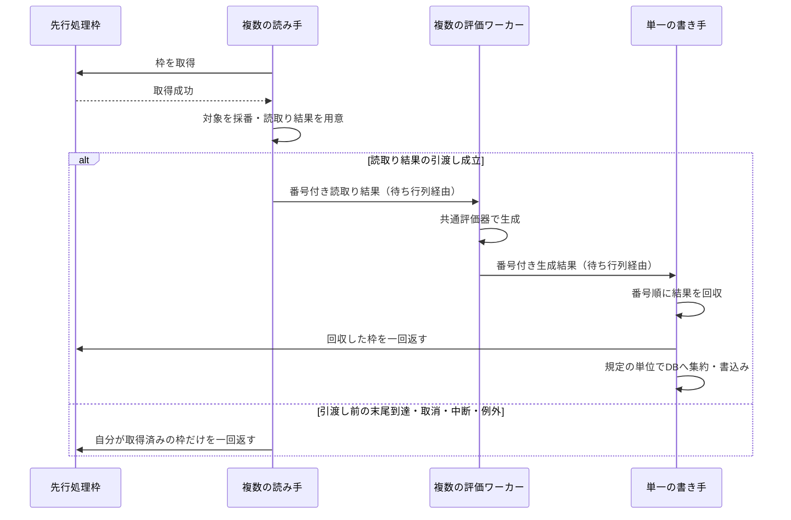

# LR2の楽曲DB生成と同期

## 目的と適用範囲

LR2連携モードで、現在のBMS譜面・検索ルート・プレイリスト出力から `song.db` の `song` と `folder` を生成する契約を定めます。LR2自身の起動時自動更新には依存しません。

## 用語

[共通用語集](../glossary.md)を参照します。コードの識別子は原表記を使います。

## 仕様

操作の受付分類・競合結果・必要継続の寿命は[競合ポリシー](../core/operation-concurrency-policy.md)を正本とします。以下は入力・処理・資源所有と結果の固有契約です。

### 管理範囲と設定

`song` と `folder` の生成列は再生成可能なデータです。ただし `song` の行の追加・削除はファイル差分検出が担当し、全体同期はその所属を変更しません。利用者が編集する `favorite`、`tag`、`adddate` は明示的な保持対象です。

BMSONはLR2へ出力せず、本アプリの `bmson_song` 等で管理します。BMSONにLR2互換性警告を出しません。スタンドアロンモードでは、LR2用のフォルダ行、`.lr2folder` 探索、`folderinfo.txt`、組込みカスタムフォルダの階層を生成しません。

LR2連携を初めて選択するとき、設定保存時、起動時の設定読込みで、`config.xml` の `<autoreload>` を `0`（手動更新のみ）にします。BMS検索ルートは本アプリの共通画面から管理します。追加操作そのものでは再帰走査せず、通常の差分更新に含めます。入力は存在するディレクトリかつShift_JISで表せるパスとし、相対パスや同一・親子関係の重複を正規化・検証します。

### 受付と実終端

全体同期の開始・競合・権限継続は[競合ポリシー](../core/operation-concurrency-policy.md#設定全体操作終了)を正本とします。Runningは進捗表示であり物理処理の成功を表しません。

受理済みの設定・導入・差分の必須部分反映は同じ権限で実終端までawaitし、自己受付を取り直しません。推定入力を実変更する受理済み背景更新は先行操作の終端後に共通受付を取得して実更新します。起動全体同期と差分後のNeeded全体同期は開始競合なら見送り、確定したchart・通常フォルダ差分を保持して参照を更新します。未実施全体をCompletedとせず、既存Needed/Incomplete等と実結果で区別します。共通受付取得後の実実処理は手動要求も直接作業Taskで開始して実終端をawaitし、内側で起動スケジューラーの枠を待ちません。受理済み起動要求の外側の登録・依存・進捗は維持します。登録だけを完了にせず、失敗・終了取消でも開始済み処理と後片付けを待機してから解放します。同期失敗は状態保存後も元の例外を返し、先行の確定を巻き戻しません。DB接続の短期ロック、SQLite busy、署名・永続状態・進捗・Incompleteは維持します。

### 同期への入力

同一の受理済みLR2操作では小さい変更不能な設定入力・custom-フォルダ設定スナップショットを共通受付取得後・非同期準備Taskの開始前に一回捕捉し、署名・生成準備・プレイリスト・実処理入力へ明示的に渡して一致させます。配置は保存・適用済みの小スナップショットを使い、未保存Values編集で署名・currentness・出力先を変えません。非配置の生成フラグは既存Values共有編集を維持し、次の明示要求で新しく捕捉します。LR2独立の最新性・世代検査は維持します。

現在のBMSパス、検索ルート、必要な祖先ディレクトリと更新時刻、`folderinfo.txt`、探索済みの管理外 `.lr2folder`、アプリ出力、LR2組込みフォルダ、設定値、解析結果・互換性警告・リソース調査結果を受け取ります。不完全な入力を、同期内の広範な再探索で補って成功扱いにしません。

LR2に見せるjukeboxルートと、本アプリが譜面・リソースを走査するルートは用途が異なります。通常出力先、追加出力先、ルート出力先の扱いは[設定](../runtime/settings.md#カスタムフォルダと検索対象)を参照します。

### songの生成

ファイル差分検出は、信頼できる走査範囲の現在パスをDBの完全一致キーで照合します。行の収束、大小文字だけ異なるパス、一対一・同一MD5での保存値引継ぎは[パスの同一性](../core/path-identity.md)に従います。全体同期は存在する行の生成列だけを更新し、不要行の削除、管理用補助行やダイジェストの整理を担当しません。

`date` は譜面ファイルの更新時刻をUnix秒で保存します。新しい行の `adddate` が未設定なら、同期時点のLR2形式時刻で初期化します。`level`、`judge`、`date`、`folder`、`parent` 等は現在の入力から生成します。日時の0や負値も有効なUnix秒として扱います。

`folder` と `parent` はLR2互換のCRC32です。対象ディレクトリまたはその親のパスに末尾の `\` とNULを付け、Shift_JISのバイト列から計算します。パスをShift_JISで表せない、またはWindowsパスとして解釈できない場合も管理対象のBMS行は削除せず、両列を `NULL` にして互換性警告を付けます。計算は `LR2CRC32` と `Lr2SongFolderParentNormalizer` を正本とします。

新規追加と `UpsertSongs` では、この正規化を保存前に行います。相対パスの補正は、絶対パス化とCRC計算の両方が成功した場合だけ `song.path` に反映します。計算できないパスだけを中途半端に更新したり、警告対象を次の走査で削除・再追加したりしません。

譜面本体を読み取れない場合は、DB境界で同じ完全一致パスとMD5の既存行を使い、未取得の生成列を保持します。現在のテキストグループと取得済み詳細の限定列だけを反映し、保存行を共通現在値や同期要求へ逆参照させません。

### folderの全体生成

`folder.path` が行のキーです。通常ディレクトリは `type=1` とし、親のCRC32を `parent` に設定します。LR2ルート直下として扱う行は `ROOT` とNULのCRC32を親にします。自身のCRC32を保存する専用列はありません。`date` はディレクトリまたは `.lr2folder` の更新時刻であり、ルート行も実際の時刻と一致させます。

期待する集合は検索ルート、BMSのあるディレクトリとルートまでの祖先、`folderinfo.txt` のある場所、テキストグループ、`.lr2folder` に必要な親階層から作ります。同一パスの優先度は、組込みカスタムフォルダ、`.lr2folder`、`folderinfo.txt` のあるディレクトリ、通常ディレクトリの順です。同順位で同内容なら順序に依存せず一つにまとめ、異なる内容なら衝突です。

正常に読み取れたBMSや `.lr2folder` でも、パスをCP932で表現できない場合は該当する通常folder行・`.lr2folder` 行・親行だけを投影から省き、他の行の同期を続けます。BMSのsong行は保持し、`folder` と `parent` を `NULL` にしてLR2互換性警告を残します。folder投影の既存事前検査で探索未完了、`.lr2folder` または `folderinfo.txt` の読込み失敗、必要なディレクトリメタデータ不足を検出した場合は、従来どおり全体同期を失敗させます。この規則はBMS譜面本体の読取り失敗へ広げません。実装は `Lr2FolderTableReconciliationService.BuildProjection`、回帰テストは [`BmsLibraryLr2SongDbSyncTests`](../../../BeMusicSeeker.Tests/Lr2/BmsLibraryLr2SongDbSyncTests.cs) の `QueueLr2SongDbSync_CompletesWhenChartDirectoryPathIsUnsupported`、`QueueLr2SongDbSync_SkipsUnsupportedLr2FolderFileNameAndContinues`、`QueueLr2SongDbSync_SkipsUnsupportedLr2FolderParentAndContinues` です。

全入力の探索・取得・解析と必要な親行の構成が成功してから、一つのトランザクションでフォルダ表全体を置き換えます。不完全な入力や同順位の衝突では表を変更せず、`Incomplete` または `Failed` を返します。通常のプレイリスト・設定・譜面変更は、明示された局所範囲だけを同期します。

### カスタムフォルダの階層

通常の `.lr2folder` は `type=2` です。特殊な種別は組込みフォルダだけに付け、`newsong.lr2folder` は3、`course1.lr2folder` から `course3.lr2folder` は6です。それ以外は本文に `#COMMAND` や `#TAG` があっても2です。

管理外ファイルは実際の探索ルート配下の階層を維持します。ルート自身だけを `ROOT` の直下とし、子ディレクトリやファイルを平坦化しません。アプリの通常出力先は出力基点をルートとして扱い、ルート出力先では各プレイリストのディレクトリをルートとして扱います。連番ファイルはそのプレイリストディレクトリを親とし、ルート出力基点の直下に置く単独ファイルだけを `ROOT` の直下にします。

保存時は `0000.lr2folder` からの連番をShift_JISで出力し、同じ生成内容からDB行を同期します。ルート出力の設定変更はLR2設定の検索ルートにも反映します。全体同期では更新時刻が一致しても本文を再解析します。全体同期の事前準備中に行うファイル作成・検証と、フォルダ表の確定を分けます。

組込みフォルダの場所はLR2実行ファイル配下の `LR2files/CustomFolder` です。`<customfolder>` のビットマスクが `RANDOM`、`favorite.lr2folder`、`TOP10.lr2folder`、`PLAYLEVEL`、`CLEAR`、`RANK`、`ignore.lr2folder`、`INSANE01`、`INSANE02` の有効化を制御します。コースは常に扱い、新曲フォルダは `titleflash` と `song.adddate` から生成対象を決めます。DBにはLR2ルートからの相対パスで保存します。

### 同期状態と起動

同期状態は `lr2_song_db_sync_status` の `name=default` 行に保持します。状態、入力署名、実行識別子、処理位置、総数、段階、エラー、更新・完了時刻を記録します。状態には `NotNeeded`、`Needed`、`Running`、`Completed`、`Failed`、`Cancelled`、`Incomplete` があります。

`Completed` は、完全な生成入力、フォルダ表の確定、楽曲の生成列更新、親L/P内で取得した入力の反映、状態の保存が成功したことを示します。同じ入力署名で完了済みなら全体同期を省略します。これは `chart_info` の存在・完全性・現行性の証明ではありません。譜面情報の補完は[譜面情報の管理](../library/chart-info.md)に従います。

通常起動ではローカル必須出力の成功後、既存状態・署名で必要な全体同期を同じ親L/Pで直接待ちます。正常・失敗・中断とcleanupの実終端後に親受付を解放します。ローカル失敗では同期へ進まず、LR2だけの通常失敗ではローカル確定を維持し独立結果・永続記録・通知へ残します。親L/P解放後の必須UIと実host接続が成功してから通常・設定共通の終端で解禁し、同期失敗をUI成功の証明にもUI失敗の取消にも読み替えません。同期の失敗を上位のローカル準備成功へ混ぜず、進捗バーの再試行ボタンは設けません。設定画面の手動同期と次回起動は新しい入力を取得します。

失敗の保存と公開は`BMSLibrary.Lr2SynchronizationOwner`の同じ責務に集め、実行開始前の境界で失敗した場合も元例外を型付き結果へ残します。既に確定した`Failed`/`Incomplete`は上書き・重複通知しません。本番の起動・再初期化はこの結果を消費して既存のLR2状態を表示へ接続します。終了取消は非致命的なLR2失敗結果へ変換せず、上位の`ShutdownRequested`へ伝播し、親受付の終端後も初回完了・操作解禁・外部同期投入には進みません。

未完了状態、失敗後の再試行、手動の強制同期は先頭から実行します。保存した処理位置から再開しません。利用者向けの同期取消操作は設けず、アプリ終了の内部取消だけを区別します。安全に記録できる場合は `Incomplete` と `shutdown_interrupted` を残します。旧DBの `Cancelled` は読込み・表示・再試行判定に対応しますが、新しい通常実行では作りません。終了以外の取消は失敗として表面化します。

同期中も読み取り操作を許可し、DB変更を伴う操作は制限します。全体同期はカスタム定義とディレクトリ情報を読み、通常・カスタムフォルダの完全な投影を検証・一括確定してから、楽曲の生成列、同じ入力による同期状態の確定へ進みます。事前のプレイリスト出力・組込みカスタムフォルダ準備も同じLR2行へ通知します。観測用の実段階・件数・不定表示は[進捗管理](../runtime/progress.md#lr2楽曲db全体同期の段階)に従い、通知先の例外でDB結果を変えません。

楽曲の有限進捗はスキーマ等の準備後に開始し、同じ対象の短いチャンク保存でも役割と件数を維持します。既知0件の件数段階は通知しません。プレイリストの表ごとの再帰整理は独立した不定段階として残し、次表の出力で全体ファイル数の有限段階へ戻します。通知だけを整理し、DB確定・保存カーソル・物理整理の順序は維持します。

### 読込みと確定結果の再利用

リソース互換性は[共通リソース結果](../library/chart-model.md#譜面情報とリソース保守)の全元記述で評価します。推定・保守・同期・移転再評価の入口によらず、検索キーが同じ別原文も個別に扱い、非空のUnknownや空キーも原文の長さを評価します。真の空・空白だけの原文は共通結果に保持してもリソース長の評価対象にはせず、最大相対長を0として記録しません。`.flac` / `.jpeg` を照合用の `.wav` / `.png` として1バイト短く数えません。元記述のトリム、区切り、独立した `.` の整理とCP932の259・260バイト境界を維持します。パスなしCP932診断は文字コード警告を付け、他の参照の長さ評価を妨げません。

楽曲行の処理開始時に、現行パーサー版の譜面情報と、再試行期限を考慮した解析失敗MD5集合を取得します。各ワーカーは既存の `ChartFileSnapshot` とこれらの値を共通評価器へ渡します。ワーカー内で追加の譜面読込みやDB照会を行いません。不足・古い譜面情報も、専用パーサーを新設せず共通の補完処理を使います。

今回のファイル差分がDBへ確定したBMSパスと走査面は、変更不能な`LibraryFileInitializationResult`として後段へ直接渡します。親L/Pが必須処理・cleanupまで生存し、競合する正本変更を受付けないため、共有証票の公開・取得・消費・破棄や因果を推測する全体版照合を行いません。再初期化・差分再読込みも同じ結果引渡しを使います。手動同期は過去の結果を使いません。確定パスのファイル読取り・DB現行性照会を省き、別パスの同一MD5を連動して省略しません。

確定パスも現行の譜面処理対象数・進捗の分母に含め、読取り・解析を省いた結果として1,000件単位（末尾は残件数）で回収します。全件が確定パスでも専用の一括スキップ経路は設けません。

複数の読み手は、順序回収までの先行数を制限する枠を取得してから対象を採番します。採番済みで未回収の項目は必ず枠を確保済みとし、先頭の不足番号が後続結果で埋まった枠を待つ循環を防ぎます。受渡し前の末尾到達・終了取消・中断・例外では読み手が取得済みの枠だけを返し、受渡し後は書き手が番号順に回収した時点で返します。枠は一度だけ返し、過剰返却の例外を無視しません。

最終入力は今回の走査面、確定した行集合、同じ操作で生成・検証した完全な準備面から作ります。後続の途中再走査で新旧入力を混ぜません。走査なしの新規要求は現在の入力を取得します。UI要求世代、読取りcache失効、永続LR2状態・互換署名は維持します。

#### 並列生成と順序回収の所有権

図は同期パイプラインが継続する通常の受渡しと、読み手が引渡し前に退出する経路だけを示します。ワーカーや書き手の例外で残りのパイプラインを打ち切り、同期を失敗として扱う経路は本文の失敗規則に従います。矢印は処理順と、先行処理枠・番号付き結果の受渡しです。枠は採番より前に取得し、読取り結果の待ち行列への引渡し成立後は書き手だけが番号順の回収時に返します。評価ワーカーは枠を返さず、枠の返却はDB確定成功の通知でもありません。

採番済みなのに枠を持たない先頭項目を作りません。ワーカーは追加の譜面読取り・DB照会を行わず、確定済みパスの省略も既存の順序回収へ通します。

### 局所変更と性能

導入・削除・移動・リネーム・統合では、確定結果から追加・削除・旧新BMSパスを捕捉します。追加だけなら現在BMSの再検索は不要です。削除・移動では変更ディレクトリ内と、登録ルートまでの祖先のBMS件数だけを既存索引から取得します。BMSONを残存BMSに数えず、削除範囲をルート全体へ広げません。

値は所持集合のロックと対応する版の下で固定し、確定結果に可変な検索関数を持たせません。自動リネームも共通の変更セッション内で局所値を取得し、LR2同期を一回終えます。取得・同期の失敗は失敗として返し、既に確定したファイル・DB処理を再実行・巻き戻ししません。

ディレクトリ比較とDBの完全一致キーを区別します。通常の局所変更で全BMSの列挙・整列・全祖先索引の再構築を行いません。全体同期では一回の完全なフォルダ生成と確定を行い、楽曲行の所属は変更しません。探索が不完全なら広範囲の不要行削除を行いません。

## 実装とテストの対応

| 仕様項目・主な条件 | 実装箇所 | テスト箇所・確認内容 |
| --- | --- | --- |
| 両受付の開始競合、準備・書込み0と部分取得解放 | `Lr2SongDbSyncRequestCoordinator` | [`QueueLr2SongDbSync_CompetingAdmissionSkipsBeforePreparationAndReleasesPartialLease`](../../../BeMusicSeeker.Tests/Lr2/BmsLibraryLr2SongDbSyncTests.cs): 実到達・実結果・Task終端を確認し、保持点はfinallyで解放して全開始Taskを待機する。 |
| 差分の実chart/通常フォルダ確定と全体同期競合skipの区別 | `FileDiffReloadWorkflowOwner` | [`DailyLibraryDiffAndIndependentPlaylistRegistration_CompleteActualChangesConcurrently`](../../../BeMusicSeeker.Tests/MainWindow/ApplicationCompositionAdmissionTests.cs): 実到達・実結果・Task終端を確認し、保持点はfinallyで解放して全開始Taskを待機する。 |
| 全原文のLR2評価、照合別名との分離、CP932境界 | [`Lr2CompatibilityEvaluator`](../../../BeMusicSeeker/Models/BmsLibraryInternal/Lr2/Lr2CompatibilityEvaluator.cs) | [`Lr2CompatibilityGoldenTests`](../../../BeMusicSeeker.Tests/Lr2/Lr2CompatibilityGoldenTests.cs) は原文の `.flac` / `.jpeg` の259・260バイト、同キーの全原文、非空の空キー・種類不明、長いdirectoryで空定義だけの最大相対長がnullとなる条件、パスなし診断と別参照の長さを確認する。同期への接続と既存健全性の保持は `QueueLr2SongDbSync_ProjectsLr2CompatibilityWarningsToLiveRows`。 |
| 共通受付の権限・寿命とBusy | [`ChartFileOperationSynchronizer`](../../../BeMusicSeeker/Models/BmsLibraryInternal/ChartFileOperationSynchronizer.cs)、[`Lr2SongDbSyncRequestCoordinator`](../../../BeMusicSeeker/Models/BmsLibraryInternal/Lr2/Lr2SongDbSyncRequestCoordinator.cs) | [`ChartFileOperationSynchronizerTests`](../../../BeMusicSeeker.Tests/ChartOperations/ChartFileOperationSynchronizerTests.cs) は別管理主体・解放済み・二重解放と借用を確認。`BmsLibraryLr2SongDbSyncTests` は準備から実処理終端のBusy、成功・失敗・終了取消を確認。既存準備境界の明示barrierをfinallyで解放し、開始済み実Taskを待機する。 |
| 実LR2と試聴・設定の標準接続 | [`ApplicationComposition`](../../../BeMusicSeeker/ViewModels/MainWindow/ApplicationComposition.cs)、[`Lr2SongDbSyncWorkflowOwner`](../../../BeMusicSeeker/ViewModels/Lr2/Lr2SongDbSyncWorkflowOwner.cs) | [`ApplicationCompositionTests`](../../../BeMusicSeeker.Tests/MainWindow/ApplicationCompositionAdmissionTests.cs) は実実行時の準備・実処理待機から、新規試聴/保存Busy・既存試聴維持・draft保持・終端後同値保存を確認。設定編集後かつSave/Apply直前の対象値・所有XML・保存/再読込み回数を比較し、Busy呼出しによる追加副作用がないことを確認する。 |
| 同じ操作の設定入力と次回の捕捉 | [`Lr2SongDbSyncRequestCoordinator`](../../../BeMusicSeeker/Models/BmsLibraryInternal/Lr2/Lr2SongDbSyncRequestCoordinator.cs)、[`BMSPlaylist`](../../../BeMusicSeeker/Models/Playlist/BMSPlaylist.cs) | [`CustomFolderOutputSettingsSnapshotTests`](../../../BeMusicSeeker.Tests/Playlist/CustomFolderOutputSettingsSnapshotTests.cs) は捕捉Aの不変と次回Bを確認。標準構成の `StandardComposition_Lr2UsesCapturedGenerationOptionAndAdoptsDraftOnNextExplicitRequest` はA捕捉後の編集でもAの実生成を確認し、非配置の生成フラグだけを変更して次の明示要求で更新する。出力配置の未保存draftと保存後公開は標準構成の実Save試験に分担する。生成optionの未送信検知だけをA=trueからB=falseへ編集する場合は、現行性対象を固定し、Aの未送信定義とフォルダ行の実保存・Completed、次要求の定義・行除去とCompletedを確認する。設定入力の一回捕捉と明示受渡しは静的確認、現行性確認の再読込みは維持する。 |
| 標準playlistの生存権限と保存結果 | [`ApplicationComposition`](../../../BeMusicSeeker/ViewModels/MainWindow/ApplicationComposition.cs) の `CreateBmsPlaylist` | [`ApplicationCompositionTests`](../../../BeMusicSeeker.Tests/MainWindow/ApplicationCompositionAdmissionTests.cs) の `StandardComposition_PlaylistBindingGeneratesFileAndPersistsFolderUnderAcceptedLr2Capability`: 実生成ファイルと実フォルダ行、内部終端後も外側lease保持を確認。 |
| 受理済み保守とLR2の非重複・実更新 | [`BMSLibrary.InstallableMaintenance`](../../../BeMusicSeeker/Models/Library/BMSLibrary.InstallableMaintenance.cs) | [`InstallableMaintenanceAdmissionTests`](../../../BeMusicSeeker.Tests/Startup/InstallableMaintenanceAdmissionTests.cs) は実初期化の依存・実schedulerのpost枠1を維持し、手動LR2準備中に必須保守が受付を待つ交差から、実フォルダ表・保守表の両更新、全Taskとschedulerの終端・次の明示操作まで確認。 |
| 準備面の合成・消費・実生成と保存の分担 | [`BMSLibrary.Lr2SynchronizationOwner`](../../../BeMusicSeeker/Models/Library/BMSLibrary.Lr2SynchronizationOwner.cs)、[`BmsLr2SongDbSyncWorkflowRuntime`](../../../BeMusicSeeker/ViewModels/Lr2/Lr2SongDbSyncWorkflowOwner.cs) | [`BmsLibraryLr2SongDbSyncTests`](../../../BeMusicSeeker.Tests/Lr2/BmsLibraryLr2SongDbSyncTests.cs) の `PreparedSurface` と入力構築caseは既存管理主体境界で合成・消費・失効を確認する。実生成から保存はQueueと標準構成で確認し、管理主体のfakeが自作する準備順は上位の判定基準にしない。 |
| 受理済みLR2継続の権限と実Task待機 | [`Lr2SongDbSyncWorkflowOwner`](../../../BeMusicSeeker/ViewModels/Lr2/Lr2SongDbSyncWorkflowOwner.cs)、[`FileDiffReloadWorkflowOwner`](../../../BeMusicSeeker/ViewModels/Startup/FileDiffReloadWorkflowOwner.cs) | [`Lr2SongDbSyncWorkflowOwnerTests`](../../../BeMusicSeeker.Tests/Lr2/Lr2SongDbSyncWorkflowOwnerTests.cs)、[`FileDiffReloadWorkflowOwnerTests`](../../../BeMusicSeeker.Tests/Startup/FileDiffReloadWorkflowOwnerTests.cs): 生存権限・reason・要求条件を明示転送し、保持Task終端前の後段停止、元失敗と継続条件を確認する。 |
| 生成入力と走査なしの候補構成 | [`Lr2SongDbSyncInputBuilder`](../../../BeMusicSeeker/Models/BmsLibraryInternal/Lr2/Lr2SongDbSyncInputBuilder.cs) | [`Lr2SongDbSyncInputBuilderTests`](../../../BeMusicSeeker.Tests/Lr2/Lr2SongDbSyncInputBuilderTests.cs) |
| 完全なフォルダ集合・衝突・一括確定 | [`Lr2FolderTableReconciliationService`](../../../BeMusicSeeker/Models/BmsLibraryInternal/Lr2/Lr2FolderTableReconciliationService.cs) | [`Lr2FolderTableReconciliationServiceTests`](../../../BeMusicSeeker.Tests/Lr2/Lr2FolderTableReconciliationServiceTests.cs)、[`Lr2FolderRowGeneratorTests`](../../../BeMusicSeeker.Tests/Lr2/Lr2FolderRowGeneratorTests.cs) |
| 同期状態と生成列の永続化 | [`Lr2SongDbSyncService`](../../../BeMusicSeeker/Models/BmsLibraryInternal/Lr2/Lr2SongDbSyncService.cs)、[`Lr2SongDbWriter`](../../../BeMusicSeeker/Models/BmsLibraryInternal/Lr2/Lr2SongDbWriter.cs) | [`BmsLibraryLr2SongDbSyncTests`](../../../BeMusicSeeker.Tests/Lr2/BmsLibraryLr2SongDbSyncTests.cs)、[`Lr2SongDbSyncServiceTests`](../../../BeMusicSeeker.Tests/Lr2/Lr2SongDbSyncServiceTests.cs)、[`Lr2SongDbWriterTests`](../../../BeMusicSeeker.Tests/Lr2/Lr2SongDbWriterTests.cs) |
| 操作内の確定結果の直接引渡し | [`LibraryFileInitializationResult`](../../../BeMusicSeeker/Models/BmsLibraryInternal/Startup/LibraryFileInitializationResult.cs) | [`Lr2SongDbSyncCommittedInputTests`](../../../BeMusicSeeker.Tests/Lr2/Lr2SongDbSyncCommittedInputTests.cs) |
| 確定パスのチャンク処理・分母・保存結果の維持 | [`Lr2SongDbSyncService`](../../../BeMusicSeeker/Models/BmsLibraryInternal/Lr2/Lr2SongDbSyncService.cs) の `UpsertSongRows` | [`Lr2SongDbSyncCommittedInputTests`](../../../BeMusicSeeker.Tests/Lr2/Lr2SongDbSyncCommittedInputTests.cs) の `CommittedInputSongRows_CompleteAcrossChunkAndOrderingWindowBoundaries`: 全件が直接確定入力の対象の0・1・1,000・1,001・10,001件で、読取りなしの完了、確定処理位置、保存行と利用者列の保持を確認する。混在入力は既存の `CommittedInputSongRowsSkipReaderAndCurrentnessRead`。 |
| 採番と順序枠の所有権 | [`Lr2SongDbSyncService`](../../../BeMusicSeeker/Models/BmsLibraryInternal/Lr2/Lr2SongDbSyncService.cs) の `UpsertSongRows` | 採番より前の枠取得、全退出経路の返却条件、番号順回収時の返却を静的に確認する。境界件数のテストでは本番のCPU別並列度を使い、特定のスレッド切替順を強制しない。 |
| 局所BMS範囲・祖先・完全一致キー | [`Lr2NormalFolderSyncScopeBuilder`](../../../BeMusicSeeker/Models/BmsLibraryInternal/Lr2/Lr2NormalFolderSyncScopeBuilder.cs)、[`Lr2NormalFolderDbSyncService`](../../../BeMusicSeeker/Models/BmsLibraryInternal/Lr2/Lr2NormalFolderDbSyncService.cs) | [`Lr2NormalFolderSyncScopeBuilderTests`](../../../BeMusicSeeker.Tests/Lr2/Lr2NormalFolderSyncScopeBuilderTests.cs)、[`Lr2NormalFolderDbSyncServiceTests`](../../../BeMusicSeeker.Tests/Lr2/Lr2NormalFolderDbSyncServiceTests.cs)、[`BmsLibraryFolderRenameRefreshTests`](../../../BeMusicSeeker.Tests/Maintenance/BmsLibraryFolderRenameRefreshTests.cs) |

## 関連資料

[一括再構成の設計判断](../../decisions/lr2-song-db-one-shot-reconciliation.md)、[索引](../core/data-and-indexes.md)、[プレイリスト出力](../playlist/storage-and-export.md)を参照します。
