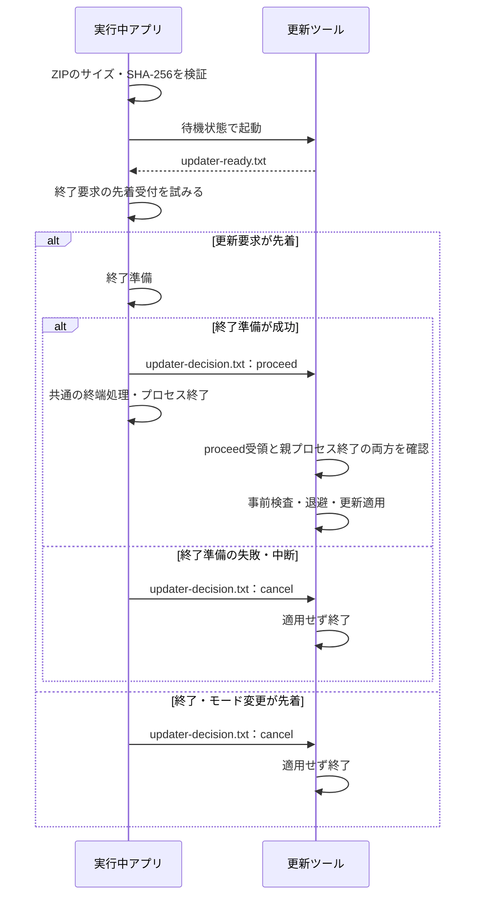
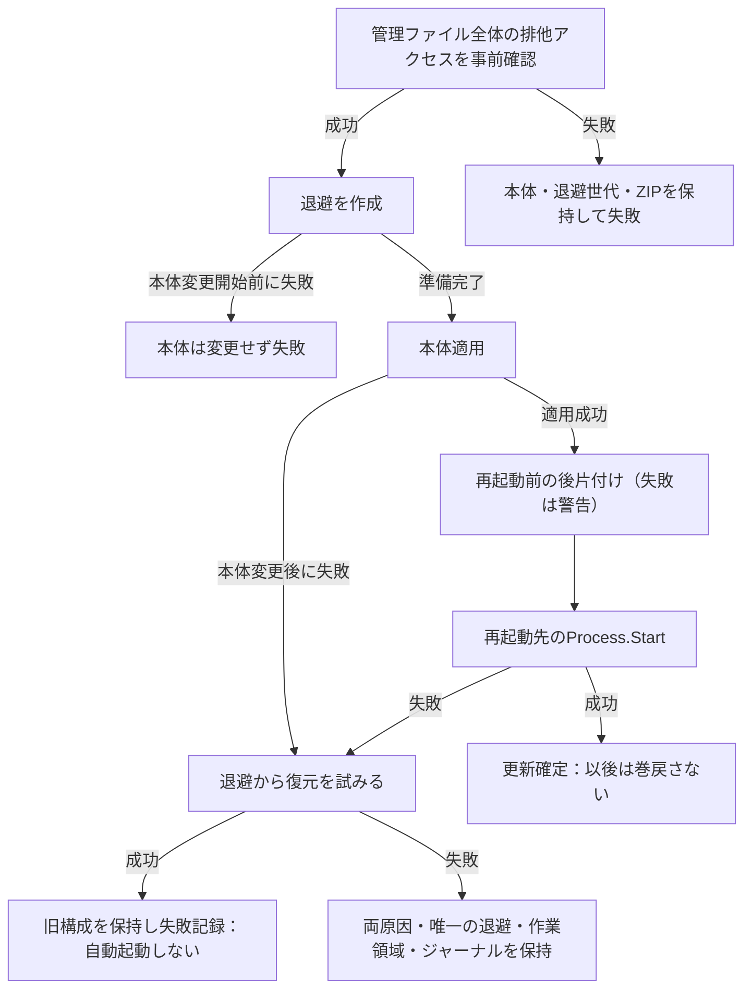

# ポータブル自動更新

## 目的と適用範囲

ZIP配布のポータブル運用を維持したまま、更新確認・検証・別プロセスによる適用・失敗回復を行う契約を定めます。配布物の作成と公開は[リリース手順](../development/release.md)を参照します。

## 用語

[共通用語集](../glossary.md)を参照します。コードの識別子は原表記を使います。

## 仕様

### 更新情報

正本は次の `update.json` です。取得失敗、時間切れ、JSON不正、版の不一致、資産の検証失敗を、別形式の更新情報へ切り替えて隠しません。

```text
https://raw.githubusercontent.com/Neeted/bemusicseeker-unofficial-fork/main/update.json
```

同じ `main` のルートにある `version.txt` は、v2.1.0.0より前のアプリが更新通知に使う互換資源として `2.1.6.0` に固定します。現行アプリは読み取らず、リリース時にも生成・更新しません。`update.json` の代替や現行版の正本には使いません。

| フィールド | 契約 |
| --- | --- |
| `schemaVersion` / `packageFormatVersion` | いずれも1に対応する。 |
| `version` / `releaseTag` | 更新先の版と `v{version}`。 |
| `releasePageUrl` | GitHub Releaseのページ。 |
| `minimumUpdaterVersion` | 更新ツールのプロトコル版。対応版は1。 |
| `assets` | 1件以上。通常版の `kind=app` を必須とし、メタデータ同梱版 `app-with-metadata` より先に並べる。 |

各資産は `fileName`、`url`、`sha256`、`sizeBytes`、`includesChartInfoMetadata` を持ちます。`label` は識別用の英語で、画面の名前と説明は `kind` に対応する多言語リソースを使います。

`--update-manifest-url=` で検証用URLを指定できます。ローカル検証は `scripts/prepare-local-update-test.ps1 -StartServer` を使い、`dist/` にある通常版・同梱版から更新情報を作ってHTTP配信します。

### 取得と適用の受付

起動時に非同期で更新を確認し、現在より新しい版があればダイアログを表示します。通常版を先頭・初期選択とします。適用ボタンは `ProgressHub.StartupProgress.IsActive=false` のときだけ有効です。適用操作ではリリースページも開きます。

選択したZIPは `update_work/downloads/` へ取得し、サイズとSHA-256の両方を検証します。実行中のアプリは自分のファイルを置き換えません。配布物に含まれる単一ファイルの `BeMusicSeeker.Updater.exe` を `update_work/current/` へコピーして起動します。

### 終了前の合意

更新ツールは要求を解析できた時点で `current/updater-ready.txt` を公開します。アプリはこれを確認してから[終了準備](../runtime/shutdown.md)を実行し、成功した場合だけ `current/updater-decision.txt` に `proceed` を公開します。失敗・中断では `cancel` を公開します。決定ファイルの公開に失敗した場合は更新ツールの停止を試みます。更新要求が終了準備を開始済みなら更新失敗として扱ってアプリの終了を継続し、終了・モード変更が先着していた場合はその終了を継続します。受付確認前にツールが終了・起動失敗した場合は、アプリを終了せず更新失敗を通知します。

更新ツールは決定を受け取ってから親プロセスの終了待ちと適用を開始します。終了準備中にアプリが生存している間は決定待ちを延長し、終了待ちの60秒を先に消費しません。再起動したアプリは、動作中の更新ツールが使う `current/` を掃除しません。これは次回のツール準備で置き換えます。

#### アプリと更新ツールの合意

図は `updater-ready.txt` の確認後に、更新要求が終了受付を獲得できるかと、その後の合意を示します。受付確認前の起動失敗と、決定ファイルの公開自体が失敗する経路は本文に従います。矢印はプロセス間の通知と処理順です。`Proceed` は適用完了ではなく、親プロセスの終了と組み合わせて上書きを許可する条件です。取消側のアプリ終了可否は、既に終了を受理したかに応じて[終了仕様](../runtime/shutdown.md)に従います。



受付確認前のツール終了・起動失敗では、アプリを終了せず更新失敗を通知します。決定待ち中に親が生存している間は待機を延長し、親終了待ちの60秒を先に消費しません。

### 引数と境界

プロトコル版は `BeMusicSeeker.Updater.exe --version` で確認できます。

| 引数 | 契約 |
| --- | --- |
| `--app-dir` | アプリのディレクトリ。 |
| `--package` | 同ディレクトリの `update_work/downloads/` 内の検証済みZIP。境界外は拒否する。 |
| `--backup-dir` | 同ディレクトリ直下の `update_backup/` と完全一致すること。 |
| `--ready-file` / `--decision-file` | `update_work/current/updater-ready.txt` / `updater-decision.txt`。境界外は拒否する。 |
| `--pid` | 最大60秒の終了待ちをする親プロセス。 |
| `--restart-exe` | 必須。アプリ内の既存ファイルで、更新ZIPにも同じ相対パスがあり、適用後も存在すること。 |

### 保持するファイル

最上位の `config/`、`data/`、`log/`、`logs/`、`update_backup/`、`update_work/` は保持します。`imported_metadata/` と最上位の `chart-info-metadata.db`、`chart-info-metadata.7z` はアプリ管理対象です。更新時に旧メタデータを整理し、同梱版だけ新しい7zを最上位へ置きます。次回起動の取込み後は `imported_metadata/` へ移します。

配布ZIPの `update-managed-files.txt` が管理ファイルの一覧です。新一覧のファイルで置き換え、新版から消えた管理ファイルを削除します。更新元に一覧がない場合は、新版と同じ相対パスの既存ファイルだけを置換対象とし、利用者の追加ファイルを消さないことを優先します。

### 適用と巻き戻し

退避先は `update_backup/previous/` の1世代です。退避の入替えや本体変更の前に、既存管理ファイル全体を排他アクセスで確認します。確認できないパスが一つでもあれば、本体・退避世代を変更せず、ZIPと利用者データを保持して失敗を記録します。事前確認後の競合や電源断を完全に吸収する保証ではありません。

再起動先の `Process.Start` 成功までは巻き戻せる段階です。適用失敗では今回のZIP・展開領域を整理し、退避内容から復元します。復元は本体を先に一括削除せず、隣接する作業領域へ退避内容をコピーしてから置換します。型が変わる項目は隣接領域へ隔離して入れ替えます。利用者の追加ファイルと保持対象は変更しません。通常の適用失敗では、復元後に旧アプリを自動起動せず、失敗内容と回復用の資料を残します。

復元にも失敗した場合は再起動・確定を行いません。適用と復元の両原因を記録し、唯一の退避内容、作業領域、ジャーナルを削除しません。障害解消後にジャーナルから、旧版または新版の完全な構成へ収束できる状態を維持します。

再起動先の起動成功が更新の確定点です。ZIP・展開領域の後片付けは再起動前に試み、失敗は警告として次回起動へ引き継ぎます。再起動後に更新ツールが同じ一時領域を並行して掃除しません。

#### 更新の確定点と復元

図は通常の更新適用で、本体変更の有無と復元が必要になる境界を示します。矢印は次の段階へ進む条件です。ライブラリ変更の補償とは別契約であり、ここでは再起動先の `Process.Start` 成功が更新確定点です。中断後のジャーナル回復は次節に従います。



再起動前の後片付けだけの失敗は警告として引き継ぎ、適用失敗とは区別します。再起動後に同じ一時領域を並行して掃除しません。

### 失敗記録と回復要求

アプリ終了後の適用・復元失敗は `update_work/update-failure.txt` に一時ファイルから不可分に公開します。移動できなければ `.tmp` を同じ失敗記録として残します。次回起動は記録を読み、更新失敗のダイアログが正常終了した後だけ削除します。終了中などで表示を抑止した場合は記録を保持します。

事前確認のジャーナルを作った時点で、次の回復コマンドを利用者単位の `RunOnce` と永続的な `Run` 監視項目へ登録します。

```text
update_work/current/BeMusicSeeker.Updater.exe --recover --app-dir <app-dir>
```

`RunOnce` 名は `!` と再試行世代を含みます。回復開始時に次の世代を登録し、排他の競合、復元失敗、回復自体の中断後も次回ログオンで要求を受け取れるようにします。取消・更新確定・回復完了時だけ、そのアプリディレクトリのハッシュに対応する登録をすべて解除します。

復元完了は `rolled-back` として保存し、旧アプリの起動成功後に退避・ジャーナルを整理します。後片付け中断で復元を繰り返しません。起動成功後に `Restarting` へ記録された正のPIDは確定の証拠として扱い、PIDがない未確定区間だけ実行ファイルの同一性で判定します。同じアプリが生存している場合は本体を変更せず、終了コード2と回復要求を残します。回復開始時に登録した次世代の要求をそのまま保持し、生存による延期だけでは重ねて登録しません。

### 配布形態と旧版互換

本体はトリミングしないマネージド単一バンドルとReadyToRun、更新ツールは自己完結型の単一EXEです。本体のネイティブ依存はEXEに隣接配置し、実行時の自己展開や `app.config` の探索先に依存しません。通常のReleaseビルドへ更新ツールを混在させず、配布時にそれぞれの公開プロファイルから組み合わせます。

v2.1.6.0からの更新受入には、[固定成果物の定義](../../acceptance/v216-first-hop/artifact.json)が指定する実ZIP内の更新プログラムを使い、現行実配布ZIPのファイル適用と利用者データの保持を確認します。別版やソース再ビルドへ置き換えません。旧アプリのGUIや更新通知は検査対象にしません。旧更新ツールのファイル適用と、現行版の受付確認・決定ファイルによる更新を区別します。この一時的な配布構成移行の検査、退役条件、現行配布物の起動・移行の受入は[検証手順](../development/testing.md)を正本とします。

## 実装とテストの対応

| 仕様項目・主な条件 | 実装箇所 | テスト箇所・確認内容 |
| --- | --- | --- |
| 更新情報・資産選択・取得検証 | [`UpdateCheckService`](../../../BeMusicSeeker/Models/Update/UpdateCheckService.cs)、[`UpdateDownloadService`](../../../BeMusicSeeker/Models/Update/UpdateDownloadService.cs) | [`UpdateCheckServiceTests`](../../../BeMusicSeeker.Tests/Update/UpdateCheckServiceTests.cs)、[`UpdateDownloadServiceTests`](../../../BeMusicSeeker.Tests/Update/UpdateDownloadServiceTests.cs)、[`UpdateAvailableDialogViewModelTests`](../../../BeMusicSeeker.Tests/Update/UpdateAvailableDialogViewModelTests.cs) |
| 受付確認・終了準備・起動失敗 | [`StartupUpdateWorkflowOwner`](../../../BeMusicSeeker/ViewModels/Startup/StartupUpdateWorkflowOwner.cs) | [`StartupUpdateWorkflowOwnerTests`](../../../BeMusicSeeker.Tests/Startup/StartupUpdateWorkflowOwnerTests.cs)、[`UpdaterProcessGatewayTests`](../../../BeMusicSeeker.Tests/Update/UpdaterProcessGatewayTests.cs) |
| 配布境界・管理ファイル・巻き戻し | [更新ツール](../../../BeMusicSeeker.Updater) | [`UpdaterDeploymentBoundaryTests`](../../../BeMusicSeeker.Tests/Update/UpdaterDeploymentBoundaryTests.cs)、[`UpdaterPackageSyncTests`](../../../BeMusicSeeker.Tests/Update/UpdaterPackageSyncTests.cs) |

## 関連資料

[配布方式の設計判断](../../decisions/updater-distribution-size.md)、[リリース手順](../development/release.md)、[検証手順](../development/testing.md)を参照します。
