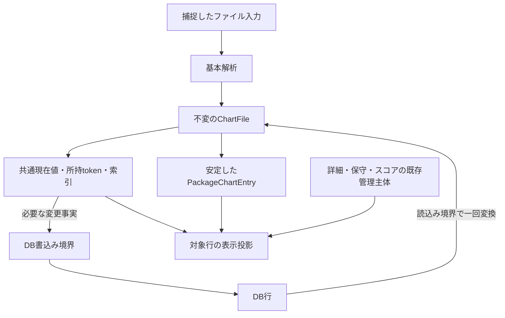

# BMS・BMSONの共通モデル

## 目的と適用範囲

BMSとBMSONを同じ画面・操作から扱うためのモデルと、形式ごとに維持する保存・解析の境界を定めます。共通化を理由に、既存のLR2データベース、プレイリストの保存形式、設定キー、利用者向けの文言は変更しません。

## 用語

[共通用語集](../glossary.md)を参照します。コードの識別子は原表記を使います。

| 用語 | 意味 |
| --- | --- |
| 所持項目 | `OwnedChartToken` で識別する、その起動中のカタログ項目。内容・順序・保存行とは分けます。 |
| 投影 | 不変の共通現在値と専門管理主体から、用途に必要な読取り値を作ること。 |
| 所属のない譜面 | 保留パッケージ項目として解決されない操作対象。コードでは `LooseEntries` などで表します。 |

## 仕様

### 保存するデータとアプリ内の譜面

| 対象 | 正本と責務 |
| --- | --- |
| BMSの保存行 | `LR2SongDB.song`。DB入出力の境界だけで生成・読取りを行い、解析・スコア購読・アプリ状態を持ちません。 |
| BMSONの保存行 | `LR2SongDBExtended.bmson_song`。LR2の `song` へ互換行を作りません。 |
| 譜面の共通現在値 | 不変の `ChartFile`。形式、実パス、ハッシュ、生メタデータと表示値、必要期間のリソース結果を持ち、保存行へ戻る参照を持ちません。 |
| 所持譜面集合 | `OwnedChartCollectionState` が共通現在値と索引を持ち、`CatalogOwnedCollectionOwner` が既存の排他・集合版・派生索引を所有します。 |
| 詳細・失敗・保守 | 不変の `ChartDetails`、`ChartParseFailure`、`ResourceHealthMaintenanceSnapshot`。専門管理主体のキャッシュ・最新性・失敗・未計算の契約を維持します。 |
| パッケージ内の譜面 | 安定した `PackageChartEntry` が現在の `ChartFile` と導入状態を所有し、項目自身を排他境界とします。 |
| 画面で一時的に重ねる値 | `ChartFileTransientState`。導入先、警告、リソース健全性、文字コードなどの投影で、永続化の正本にはしません。 |

所持カタログを基本譜面情報の正本とします。基本解析は捕捉済みのバイト列・ハッシュ・時刻から直接 `ChartFile` を返します。DB読込みでは境界で一回だけ共通値へ変換し、保存時は不変の変更事実を境界で行へ変換します。共通値から現在値や保存行を引くowner参照、双方向同期、保存行の通知中継を設けません。

共通値に含める警告と導入先候補も、不変集合へ捕捉し、呼出元の可変リストを保持しません。

生のtitle・subtitle・artist・subartistは合成表示から逆算しません。bmsonの元 `chart_name` はファイル入力だけから取得し、DBの合成subtitleから復元しません。`BmsCharts` / `BmsonCharts` は共通現在値の捕捉済み読取りビューです。取得のために全件を投影・複製しません。

再生一時状態は `PlaybackPanelViewModel` の現在譜面とbitに所有し、一覧の `status` getterへだけ重ねます。カタログ・共通値・保存行に再生overlayを持たせません。

導入済み項目への現在値反映は、`PackageLifecycleOwner` の既存所属境界に置くtokenからlive entryへの派生参照索引で行います。同じtokenの複数entryを全て更新し、同じentryの複数所属は最後の所属が離脱するまで保持します。null tokenの保留項目はパス・hashで所持項目へ接続しません。加入・離脱・所属列の置換だけで参照を差分登録し、collection付替えで残存パッケージのentryを再登録しません。旧collectionと退役packageの購読を解除します。

所属の剪定で残すentryは同じ参照を維持します。`ReplaceChartEntries` は確定した列を保持し、パッケージの移転後に旧SourcePathとの不一致でlazy探索へ戻しません。加入時は取得済み列を非I/Oで捕捉し、未取得の探索・解析を開始しません。mutableなentryのdetachedコピーは準備入口だけで作ります。共通現在値の反映は既存のentry排他と通知延期を使い、離脱したentryへの遅延通知を抑止します。

### 再生用解析との境界

一覧・保存・操作対象は `ChartFile`、内蔵再生・音声書出しの解析結果は不変の `PlaybackChart` とします。`PlaybackChart.Load(path)` がBMS解析結果の投影とbmson専用解析を選び、`chart_info` の時刻や保存主体を音声計画へ転用しません。通常ロードと先読みはこの入口を共有します。音声区間の契約は[bmson再生仕様](bmson-playback.md)、BMSの入力と時刻は[RibbitのBMS時刻計算](ribbit-timing.md)に従います。

再生・選曲・共通表示は `ChartFile` を対象とし、形式固有処理は解析・保存から共通モデルへの入口に置きます。対象・世代・状態・表示素材の契約と対応テストは[再生パネル](../ui/playback-panel.md#共通の再生対象と一覧状態)を正本とします。BMS専用操作は形式と必要な識別子を条件にし、保存主体の有無を可否条件にしません。再生解析の `Ribbit.BMS.BMSFile` は別の型として維持します。

### 所持譜面の識別条件

所持譜面は実パスとMD5を必須とし、DBのexact pathはBMS・BMSONを通じて `Ordinal` 比較で一意です。物理パスの `OrdinalIgnoreCase` 比較とは用途を分け、同じMD5の別配置を統合しません。

所持項目には内容や保存行を持たないsealedな `OwnedChartToken` を発行します。token単独から現在値・パス・保存行を取り出すAPIはありません。通常の現在値適用・内部移転・投影・並べ替え・変更のない差分走査はtokenを継承し、新規・再解析置換・DB全再読込みは新しく発行します。外部移転のハッシュ再接続では利用者列だけを復元し、tokenを継承しません。保留・未所持項目は所持tokenを持ちません。

DB読込みや外部からの全置換では、パスまたはMD5のない行を所持集合から除外します。同一パスの重複は、BMS、BMSONの順に入力を読み、先の行を採用して除外件数を記録します。内部の追加・移転・ハッシュ更新がこの条件を破った場合は、単なる再構築で隠さず異常として検出します。

プレイリストの未所持項目や表示専用の投影は、パスなしでも作成できます。ただし、その値を導入済みの判定、フォルダ操作、リソース保守、所持譜面のハッシュ更新通知へ入れません。SHA-256は補助識別子であり、MD5を欠く所持譜面を許容する代替条件ではありません。

### 表示行と現在値の取得

`LibraryChartRow` は共通現在値またはパッケージ項目を包み、`Chart` で共通の譜面を公開します。`ChartListSourceRow` は仮想一覧の絞込み・並べ替えに使う軽量な読取りモデルです。実パス・作者だけで絞り込める場合に、全件の詳細な `ChartFile` やリソース一覧を作りません。

通常の所持譜面では、不変の基本現在値と専門管理主体・ViewModelの一時状態から投影します。パッケージ行では元の `PackageChartEntry` を保持し、`ProjectionVersion` と変更通知に応じて投影を更新します。導入先の表示だけで警告一覧を構築するなど、不要な値の具体化は避けます。

BMSONを通常一覧に含める範囲は、通常のルート・フォルダ・キーワード・モード絞込みと全譜面の検査一覧です。プレイリスト、保守、導入の専用一覧は、それぞれの情報源からBMSONを扱います。BMS専用の文字化け・未登録・ゼロノート一覧も、画面へ渡す時点では共通の譜面行に投影します。

表示値の正本を保存行へ重複して持たせません。

| 表示する値 | 取得元と更新 |
| --- | --- |
| 譜面情報 | `BMSLibrary.ResolveChartInfo(...)` とセッションの `ChartInfoIndex`。保存主体に一時的な `ChartInfo` を付けて代用しません。 |
| スコア・ランク・達成率 | `ChartScoreSnapshot` を介して譜面・表示行で解決します。スコアの接続・購読・再読込み・active source・版は既存のライブラリ管理が所有し、スコアごとに一購読とします。差替え・再読込み・終了で解除し、譜面ごとの購読を作りません。通常のBMSはLR2をMD5、beatorajaをSHA-256で解決し、通常のbmsonはNoScoreです。プレイリスト専用の所持・未所持解決では、所持bmsonのSHA-256によるbeatorajaスコアも維持します。 |
| 参照するプレイリスト | `PlaylistReferenceIndex`。`RefTablesSymbols` / `RefTablesNames` は表示列名であり、BMS保存行の可変キャッシュではありません。 |
| 警告 | `ChartWarningCollection` と `ChartWarningProjectionFormatter`。行側で表示文字列・ハッシュ・ツールチップを作ります。 |
| リソース健全性・文字コード | 不変の `ResourceHealthMaintenanceSnapshot` と一時投影。`DbHydrated`、`Calculated`、未計算を区別し、既存通知へ変更対象を渡します。 |
| 導入先 | `PackageChartEntry`、`ChartFileTransientState`、モデル内の一時状態。BMS保存行へ書き戻しません。明示的に空へ変更した状態も区別します。 |

通常一覧の並べ替えは `LibraryChartRowSortEngine` と `ChartListOrder` の列定義を正本にします。公開する並べ替え列と仮想一覧の対応を揃え、未対応列を全件の通常行生成で補いません。画面側の採用・破棄・通知は[一覧表示](../ui/table-view.md)を参照します。

### 操作対象と権限

UIからは `ChartOperationTarget` に譜面、元の項目、所持・保留・未所持の状態、操作権限をまとめて渡します。`SourceScope` は `Library`、`PendingPackage`、`NewlyInstalledPackage`、`PlaylistOwned`、`PlaylistMissing` を区別します。メニュー表示と実行側の両方で権限を確認します。

| 権限 | BMS | BMSON | 条件 |
| --- | --- | --- | --- |
| `OpenFile` / `OpenFolder` | 可 | 可 | 実パスがあり、欠落していないこと。 |
| `OpenPlaylistUrls` | 可 | 可 | プレイリスト項目にURLまたは差分URLがあること。 |
| `RunResourceHealthCheck` | 可 | 可 | 実パスがあり、欠落していないこと。 |
| `UseLr2Ir` / `UseScoreViewer` / `UpdateRanking` | 可 | 不可 | BMSで、有効なMD5があること。BMS-IRリンクでLR2BMSIDを代用しません。 |
| `RunBmsEncodingCheck` / `RunBmsEncodingFix` / `RunZeroNoteCheck` | 可 | 不可 | 欠落していないBMSであること。 |
| `RenameInvalidExtension` | 可 | 不可 | 欠落していないBMSであること。 |
| `ConvertToAudio` | 可 | 可 | 実パスがあり、欠落・保留状態ではないこと。 |
| `RepairInstalledLocation` / `MoveInLibrary` / `RemoveFromLibrary` | 可 | 可 | 実パスがあり、欠落・保留状態ではないこと。 |
| `UpdateInstallDestination` | 可 | 可 | プレイリスト項目ではない保留パッケージ行であること。 |

`GridRowResolver` は通常一覧とプレイリストの行が公開する `Chart` をそのまま使います。共通の `ChartFile` を操作入力にします。内蔵再生と音声変換も共通の `ChartFile` を解決します。外部プレイヤーへの引渡しは、その既存の形式条件を別に確認します。

フォルダ名の編集は `TryGetFolderEditChartOperationTarget(...)` で権限を確認し、UIスレッドで `RenameChartFolderRequest` を確定してから実行します。`ChartFile.Level` / `Folder` は読取り専用であり、LEVELの編集はプレイリスト項目の編集として扱います。

右クリックの外部操作は、メニューを開いた正確な行から `RightClickActionResolutionInput` を作り、クリック時に同じ行と現在の設定を再解決します。選択集合を代用しません。未所持のプレイリスト・履歴行も有効なハッシュでWeb操作を行えますが、外部プログラムは解決済みの実ファイルだけを対象にします。詳細は[外部起動](../ui/external-launch.md)を参照します。

### モデルへ渡す参照と要求

ファイルの削除・移転にはtoken・kind・捕捉path/MD5/SHA-256だけを持つ `LibraryChartRef` を使います。削除の確認前はtokenを優先して現在値を取得し、要求のkindとDB exact pathが現在値と一致することを検証します。tokenあり未解決をpathへ救済せず、tokenなしの従来path解決は維持します。古い選択のhashだけで拒否しません。共通canonical lookupは指定tokenだけを使い、退役tokenをkind/pathへ救済しません。tokenなしだけkindとDBの完全一致パス（`Ordinal`）を使います。生存tokenは内部移転後の現在値も解決し、古いhashだけでは拒否しません。通常削除・拡張子変更の確認対象は不変 `ChartFile` として固定し、FS存在・属性の履歴を保持しません。本受付後は最初の変更より前に全対象のtoken・kind・固定pathの結び付きを照合し、不成立なら要求全体を失敗にします。削除はDBの `Ordinal`、拡張子変更は従来の物理パス比較を使います。hash履歴は比較せず、DB・索引への反映は照合した共通現在値を使います。確認中の別変更を前提にした個別Stale継続は行いません。項目削除はtokenを厳密に照合し、明示的な `PathCleanup` と分けます。一般的な物理対象比較ではkindと物理pathのfallbackを維持します。

UIスレッド上で選択を固定し、機能別の要求へ変換してからバックグラウンド処理へ渡します。

| 操作 | 要求・受渡し |
| --- | --- |
| リソース健全性・無視設定 | `ChartResourceHealthRequest` に `ChartFile` を保持します。 |
| フォルダの自動命名 | `ChartFolderAutoRenameRequest` に `ChartFile` を保持します。 |
| 保留導入先の検索・解除・編集 | `PendingInstallDestinationSearchRequest` / `PendingInstallDestinationClearRequest` / `PendingInstallDestinationEditRequest`。パッケージ項目の識別関係を保持します。 |
| 導入先の修復 | `RepairInstalledLocationTargetSnapshot`。検索・解除は `RepairEntries`、修復は現在の導入先状態を重ねた `RepairCharts` を使います。 |
| 保留譜面の削除 | `RemovePendingCharts(IEnumerable<ChartFile>)`。物理削除に成功したパスを `ChartPathsToRemove` として項目削除へ渡します。 |

パッケージに属する対象は、項目の識別関係から現行パッケージへ解決します。所属しない対象は要求の `LooseEntries` に固定し、後からパスだけで保留パッケージへ吸収しません。検索やメニューの可否判定のために、共有の互換オブジェクトを遅延生成して状態を書き戻すことはしません。

導入先修復はBMS・BMSONを共通の変更事実として返し、保存時だけ形式別に分けます。成功した修復後の保守対象は、確定後の共通現在値から取り直し、同じ排他権内でまとめて検査します。操作全体の結果は[変更セッション](mutations.md)に保持します。

### パッケージと保留状態

`ChartPackage.ChartEntries` をパッケージ内の譜面の正本にします。遅延探索の実行時期を保ち、代表譜面・定義リソース・推定入力・保留一覧を項目から作ります。導入はdetachedな準備値をDBへ確定してからlive entryへ反映します。

導入先、候補、低信頼の警告、`SEARCHING` は項目の投影状態です。項目の変更後に表示行が古い投影を固定しないようにします。再構成したパッケージでは、代表だけでなく全項目のリソース健全性と警告を復元します。BMS・BMSONとも導入済み、単一BMSON、入れ子譜面などの項目固有の条件を維持します。

`PackageInstallEstimationSnapshot` は項目から代表譜面、定義リソース、メタデータ、探索範囲を作ります。ディレクトリ型パッケージだけがルート単位の上限付き探索を共有します。単一ファイル型と所属のない譜面では、親ディレクトリを列挙せず、同梱・候補リソースを別々の空集合、探索件数を0として保持します。定義リソースと譜面自身の情報は保持します。探索・候補評価の詳細は[導入先推定](install-estimation.md)を参照します。

再生停止は変更範囲で決めます。フォルダ全体の移動・削除・名前変更では、譜面形式にかかわらず現在の再生対象のディレクトリとの重なりを確認します。ファイル単位の削除・修復では現在の譜面ファイルへの影響を確認し、同じフォルダの別譜面だけを変更するために再生を停止しません。

### プレイリストの識別と行

所持譜面から追加する項目は、判明しているMD5・SHA-256を両方保存します。一方、検索・参照・集計は `PlaylistEntryLookupKey` が選ぶ一つのキーを使います。MD5があればMD5だけを使い、見つからなくてもSHA-256へ切り替えません。MD5のない項目はSHA-256を使います。既存行を読んだだけで不足ハッシュを全量補完しません。

`PlaylistDetailSourceRow` / `PlaylistDetailRow` は解決済みの `ChartFile` を持ちます。未所持項目は項目メタデータから投影し、現行の形式表現は `ChartFileKind.Bms` とします。参照プレイリスト名とキーワード検索も同じ参照索引を使います。

通常フォルダへの追加では、元がプレイリスト行なら `BMSTableEntry.Duplicate()` で項目メタデータを保持します。ルートへの自動振分けでは、解決できた所持譜面から新しい項目を作り、同じ実ディレクトリにあるBMS・BMSONのMD5集合を `org_md5` とします。解決できない行は既存メタデータを複製します。参照の更新はBMSだけの一覧へ戻さず、共通の譜面と対象ハッシュを渡します。

### 譜面情報とリソース保守

`ChartFileSnapshot` はファイル内容・長さ・更新時刻・ハッシュを持つ短命な読取り結果です。アプリ内の譜面を表す `ChartFile` と混同しません。読取り済みの内容は[ファイル読取り](chart-file-reading.md)の契約で再利用します。

両形式は共通の不変保守値と、`ChartFile.Resources` の取得済み不変結果を使います。参照は種別、用途（通常・stagefile・backbmp・banner・入力診断）、元記述、拡張子付きの `NormalizedPath`、拡張子を一回除去した `LookupKey`、実際の解析状態を保持します。照合用の拡張子別名は元記述を変更しません。空キー・種類不明・親参照と、パスなしのCP932入力診断も同じ結果に保持します。

`Resources` のnullは未取得または解放、空集合は解析に成功した0件です。投影・複製・パッケージは同じ不変結果を共有し、getterで読取り、保存主体からの補完、原文の逆引き、再正規化を行いません。基本現在値を投影するコピーでも、リソースはsourceの結果を共有します。コピー側に取得省略の優先分岐を設けず、保存行から初めて軽量基本値を作る入口の取得省略と区別します。基本情報用の解析戻り値は必要期間だけ同じ結果を一時保持します。`ChartResourceSnapshot.Create(ChartFile)` は取得済み結果だけを索引化し、未取得を正常な空結果として扱いません。

保守の既存入口が不足する結果を明示取得し、時刻・ハッシュ・強制更新の既存条件で再評価します。取得・解析に失敗した結果を成功0件として保存しません。BMSの文字コード・修正済み状態をリソース計算で上書きせず、保守はファイル内容のハッシュ更新通知の生成元にしません。文字コードだけの表示変更では集合版を進めません。手動文字コード適用、選択対象・全所持対象の保守で自動判定した生メタデータや合成title・subtitle・artistが実際に変わった場合は、DB確定後に同じtokenの基本現在値を適用し、対象数によらず集合版を一回進めます。既存の基本通知と対象限定playlist差分へ接続し、通常一覧の並べ替え・絞込みも更新します。再読解件数だけでは基本変更と判定せず、同値の強制再評価や保守markerだけの変更では集合版を維持します。定義・存在件数と任意画像の形式差は[リソース健全性](../core/data-and-indexes.md#リソース健全性)、短命な保持と解放は[読取り仕様](chart-file-reading.md#リソース参照と文字コード)に従います。

リソース参照の `.` は譜面相対のキーへ正規化し、`..` は未対応の親ディレクトリ参照として区別します。通常変更は対象譜面だけの保守を行い、全件対象は明示的な全件検査・索引再構築に限定します。同じ操作で必要な全件対象を二重生成しません。

譜面情報の解析と保存は[譜面情報](chart-info.md)に従います。BMSの全件補完では同MD5を一度評価し、既存 `song` の対応する派生列だけを更新します。BMSONはSHA-256を優先してまとめ、LR2行や `chart_digest_map` を生成しません。永続化の成功後だけ共通現在値・索引へ反映し、排他解放後に通知します。

### 重複表示

重複検索は、所持集合に隣接する `DuplicateChartRow` の変更不能な集合を使います。行には種類・実パス・MD5・共通値を持たせ、重複グループに入る対象だけを詳細な譜面へ投影します。導入先の一時状態とSHA-256のみの投影を重複判定へ混ぜません。

構築済みの行集合は追加・削除・移転・MD5変更で差分更新し、取得のたびに全行を複製しません。グループの結果は `DuplicateChartGroups`、結果を無効化した通知は `DuplicateChartGroupsInvalidationVersion` と分けます。

重複グループの正本は `DuplicateGroup.ChartFiles` です。BMSの重複警告は同じ所持tokenの共通現在値へ反映します。BMSONの重複警告はグループ内の投影に保持し、通常一覧のBMSON保存行へ永続化した警告とはみなしません。詳細は[重複ファイル](duplicate-files.md)を参照します。

## 実装とテストの対応

| 仕様項目・主な条件 | 実装箇所 | テスト箇所・確認内容 |
| --- | --- | --- |
| 保守による文字コード基本値の実変更と同値再評価 | [`CatalogMaintenanceOwner`](../../../BeMusicSeeker/Models/BmsLibraryInternal/Catalog/CatalogMaintenanceOwner.cs)、[`LibraryMutationOwner`](../../../BeMusicSeeker/Models/Library/BMSLibrary.LibraryMutationOwner.Common.cs) | [`RegularChartNormalLibraryRefreshTests`](../../../BeMusicSeeker.Tests/ChartList/RegularChartNormalLibraryRefreshTests.cs) の `MaintenanceMetadataChange_ReachesAttachedViewAndWarmPlaylistDeltaOnce` は実選択保守の二対象、DB・同token現在値・集合版一回・基本通知・温めたplaylist差分の局所性・接続済み一覧の絞込みとTitle順・同値再forceを確認する。保守だけの版不変、全所持の保存と通知失敗、手動文字コード適用は [`BmsLibraryMaintenanceServiceTests`](../../../BeMusicSeeker.Tests/Maintenance/BmsLibraryMaintenanceServiceTests.cs)、要求とrefreshの順序は [`SelectedChartMutationWorkflowOwnerTests`](../../../BeMusicSeeker.Tests/ChartOperations/SelectedChartMutationWorkflowOwnerTests.cs) が分担する。 |
| 不変リソースの原文・用途・状態・両キー、未取得と成功0件 | [`ChartResourceReference`](../../../BeMusicSeeker/Models/BmsLibraryInternal/Resources/ChartResourceReference.cs)、[`ChartResourceSnapshot`](../../../BeMusicSeeker/Models/BmsLibraryInternal/Resources/ChartResourceSnapshot.cs)、[`ChartFileProjection`](../../../BeMusicSeeker/Models/Chart/ChartFileProjection.cs) | [`ChartResourceSnapshotTests`](../../../BeMusicSeeker.Tests/Resources/ChartResourceSnapshotTests.cs) は重複検索と全原文、未取得拒否、解析後ファイル削除と正式な現在値適用後の共有・投影・パッケージ・消費を確認する。両形式の抽出は [`BMSFileSnapshotTests`](../../../BeMusicSeeker.Tests/Chart/BMSFileSnapshotTests.cs)、[`BmsonSongParserTests`](../../../BeMusicSeeker.Tests/ChartInfo/BmsonSongParserTests.cs)。getter・他の複製経路の非読取りと同じ結果の受渡しは静的に確認する。 |
| 共通再生対象、BMS・bmsonの変換能力とBMS専用能力の分離 | [`GridRowResolver`](../../../BeMusicSeeker/ViewModels/ChartList/GridRowResolver.cs) の `TryGetPlaybackChart` と権限生成、[`PlaybackChart`](../../../BeMusicSeeker/Ribbit/BMS/PlaybackChart.cs)、[`MainWindow`](../../../BeMusicSeeker/Views/MainWindow/MainWindow.cs) の変換メニュー | [`PlaylistViewPipelineTests`](../../../BeMusicSeeker.Tests/Playlist/PlaylistViewPipelineTests.cs) の `ChartOperationTarget_CapabilityMatrix_SeparatesBmsOnlyAndBmsonCommonOperations` は所持BMS・bmsonの変換許可、両形式の保留拒否とBMS専用能力の維持を確認し、所持プレイリスト・新規導入済み・未所持の既存ケースも変換能力を確認する。[`MainWindowSelectedChartContextMenuWpfTests`](../../../BeMusicSeeker.Tests/MainWindow/MainWindowSelectedChartContextMenuWpfTests.cs) の `CompiledAudioConversionMenu_AllowsBmsonAndMixedOrderButRejectsPendingAndMissingFiles` は実ファイルを使い、bmsonのみの表示・有効状態、正確な譜面と混在選択順、保留・消失ファイルの非実行を確認する。要求と実行への受渡しは[音声変換](../runtime/audio-conversion.md#実装とテストの対応)を参照する。 |
| 捕捉入力と共通payloadの保存行非依存 | `BmsChartFileParser`、`BmsonChartFileParser`、`ChartFile`、共通要求・結果 | [`BMSFileSnapshotTests`](../../../BeMusicSeeker.Tests/Chart/BMSFileSnapshotTests.cs) は捕捉後のファイル置換から独立したhash・時刻・生メタデータを確認する。[`CommonChartPayloadContractTests`](../../../BeMusicSeeker.Tests/Chart/CommonChartPayloadContractTests.cs) は代表compiled型の保持状態・公開境界の引数と戻り値・parser戻り値、空のsealed tokenを確認する。 |
| 所持tokenの寿命・確認後固定対象 | `OwnedChartToken`、`LibraryChartRef`、`ChartStorageTargetSet` | [`OwnedChartTokenTests`](../../../BeMusicSeeker.Tests/Catalog/OwnedChartTokenTests.cs) は通常値適用・移転の継承、新規置換・DB再読込みの再発行、同path/hash置換による旧参照の退役と捕捉値の不変性を確認する。 |
| 共通現在値・識別条件・所持集合 | [`ChartFile`](../../../BeMusicSeeker/Models/Chart/ChartFile.cs)、[`ChartFileProjection`](../../../BeMusicSeeker/Models/Chart/ChartFileProjection.cs)、[`OwnedChartCollectionState`](../../../BeMusicSeeker/Models/BmsLibraryInternal/Catalog/OwnedChartCollectionState.cs) | [`OwnedChartCollectionProjectionTests`](../../../BeMusicSeeker.Tests/Catalog/OwnedChartCollectionProjectionTests.cs)、[`OwnedChartCollectionLookupMembershipTests`](../../../BeMusicSeeker.Tests/Catalog/OwnedChartCollectionLookupMembershipTests.cs) |
| 実パス参照・導入先状態の分離 | [`LibraryChartRef`](../../../BeMusicSeeker/Models/BmsLibraryInternal/Catalog/LibraryChartRef.cs)、[`OwnedChartCollectionState`](../../../BeMusicSeeker/Models/BmsLibraryInternal/Catalog/OwnedChartCollectionState.cs) | [`OwnedChartCollectionReferenceIndexTests`](../../../BeMusicSeeker.Tests/Catalog/OwnedChartCollectionReferenceIndexTests.cs)、[`OwnedChartCollectionInstalledOverlayTests`](../../../BeMusicSeeker.Tests/Catalog/OwnedChartCollectionInstalledOverlayTests.cs) |
| 変更・ハッシュ更新・通知 | [`LibraryMutationOwner`](../../../BeMusicSeeker/Models/Library/BMSLibrary.LibraryMutationOwner.cs) | [`OwnedChartCollectionLibraryMutationTests`](../../../BeMusicSeeker.Tests/Catalog/OwnedChartCollectionLibraryMutationTests.cs)、[`OwnedChartCollectionInlineDigestTests`](../../../BeMusicSeeker.Tests/Catalog/OwnedChartCollectionInlineDigestTests.cs)、[`OwnedChartCollectionRefreshTests`](../../../BeMusicSeeker.Tests/Catalog/OwnedChartCollectionRefreshTests.cs) |
| パッケージ投影の変更通知 | [`PackageChartEntry`](../../../BeMusicSeeker/Models/BmsLibraryInternal/Install/PackageChartEntry.cs) | [`PackageChartEntryNotificationTests`](../../../BeMusicSeeker.Tests/Install/PackageChartEntryNotificationTests.cs) |
| パッケージ導入・修復・再生との同期 | [`BmsLibraryPackageInstallService`](../../../BeMusicSeeker/Models/BmsLibraryInternal/Install/BmsLibraryPackageInstallService.cs) | [`BmsLibraryPackageInstallServiceTests`](../../../BeMusicSeeker.Tests/Install/BmsLibraryPackageInstallServiceTests.cs)、[`ChartFileOperationSynchronizerTests`](../../../BeMusicSeeker.Tests/ChartOperations/ChartFileOperationSynchronizerTests.cs) |
| 通常一覧の操作・更新・確定と破棄 | [`RegularChartListOwner`](../../../BeMusicSeeker/ViewModels/ChartList/RegularChartListOwner.cs) | [`RegularChartNavigationTests`](../../../BeMusicSeeker.Tests/ChartList/RegularChartNavigationTests.cs)、[`RegularChartNormalLibraryRefreshTests`](../../../BeMusicSeeker.Tests/ChartList/RegularChartNormalLibraryRefreshTests.cs)、[`RegularChartFolderRenameTests`](../../../BeMusicSeeker.Tests/ChartList/RegularChartFolderRenameTests.cs)、[`RegularChartCommitAndLifecycleTests`](../../../BeMusicSeeker.Tests/ChartList/RegularChartCommitAndLifecycleTests.cs) |
| 仮想一覧・表示値・並べ替え | [`LibraryChartRowSortEngine`](../../../BeMusicSeeker/ViewModels/ChartList/LibraryChartRowSortEngine.cs) | [`RegularChartViewBuildAndOrderingTests`](../../../BeMusicSeeker.Tests/ChartList/RegularChartViewBuildAndOrderingTests.cs)、[`LibraryChartRowSortEngineTests`](../../../BeMusicSeeker.Tests/ChartList/LibraryChartRowSortEngineTests.cs) |
| プレイリストの所持数・参照解決・変更 | [`CatalogOwnedCollectionOwner`](../../../BeMusicSeeker/Models/BmsLibraryInternal/Catalog/CatalogOwnedCollectionOwner.cs) | [`PlaylistSummaryCountAndPresentationTests`](../../../BeMusicSeeker.Tests/Playlist/PlaylistSummaryCountAndPresentationTests.cs)、[`PlaylistSummaryOwnedHashTests`](../../../BeMusicSeeker.Tests/Playlist/PlaylistSummaryOwnedHashTests.cs)、[`PlaylistSummaryMutationAndWarmTests`](../../../BeMusicSeeker.Tests/Playlist/PlaylistSummaryMutationAndWarmTests.cs)、[`PlaylistSummaryResolveIndexTests`](../../../BeMusicSeeker.Tests/Playlist/PlaylistSummaryResolveIndexTests.cs)、[`PlaylistViewPipelineTests`](../../../BeMusicSeeker.Tests/Playlist/PlaylistViewPipelineTests.cs) |

導入済みentryの局所反映・複数所属・未取得列の非I/O・退役通知は [`BmsLibraryPackageLifecycleTests`](../../../BeMusicSeeker.Tests/Install/BmsLibraryPackageLifecycleTests.cs)、剪定の残存参照は [`BmsLibraryStateApplierTests`](../../../BeMusicSeeker.Tests/Install/BmsLibraryStateApplierTests.cs)、準備のdetachedコピーと確定前失敗は [`BmsLibraryPackageInstallServiceTests`](../../../BeMusicSeeker.Tests/Install/BmsLibraryPackageInstallServiceTests.cs)、実digestの反映は [`OwnedChartCollectionInlineDigestTests`](../../../BeMusicSeeker.Tests/Catalog/OwnedChartCollectionInlineDigestTests.cs) に分担します。表示通知との対応は[一覧表示](../ui/table-view.md)を参照します。

## 関連資料

[データと索引](../core/data-and-indexes.md)、[変更セッション](mutations.md)、[一覧表示](../ui/table-view.md)、[ライブラリの案内](README.md)。
