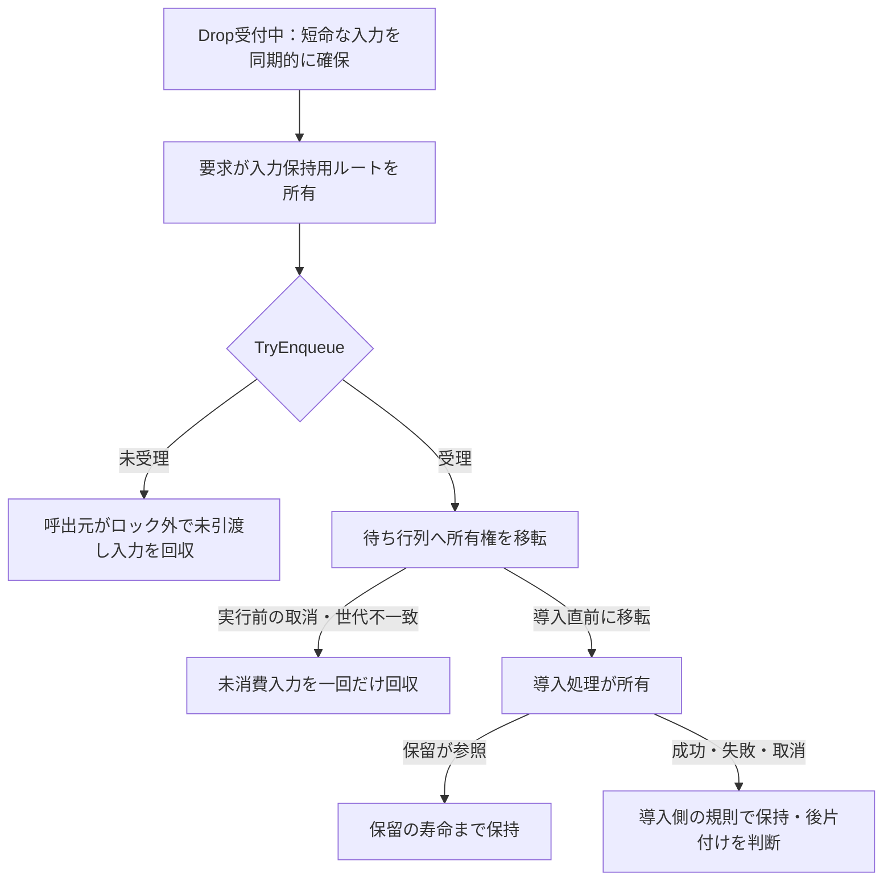

# ドロップ入力からの導入

## 目的と適用範囲

ファイルのドラッグ＆ドロップを、非同期の導入処理へ安全に引き渡す仕様です。外部アーカイバーの一時展開先は、ドロップの受付が戻った後まで存在するとは仮定しません。入力を受け入れる条件と、その入力を削除してよい条件を分けます。

## 用語

[共通用語集](../glossary.md)を参照します。コードの識別子は原表記を使います。

## 仕様

操作の受付分類・競合結果・必要継続の寿命は[競合ポリシー](../core/operation-concurrency-policy.md)を正本とします。以下は入力・処理・資源所有と結果の固有契約です。

### 入力の分類

`TempDirectoryPublisher.IsManagedPath` は現在の起動中の削除権限を判定するものであり、導入入力の許可一覧ではありません。読み取れる通常のファイル・フォルダを、一時領域にあるという理由だけで拒否しません。ライブラリへ取り込む際は別途、[登録ルートの除外](mutations.md#保留入力と登録ルート)を適用します。

| 入力 | 待ち行列へ渡すもの | 入力確保処理が削除できるもの |
| --- | --- | --- |
| 現在の起動中にアプリが管理するパス | 元のパス | なし。他の生成元の管理範囲を引き取らない |
| システム一時領域の外 | 元の借用パス | なし |
| システム一時領域内で、現在の管理対象ではないパス | 新たな管理領域へコピーしたパス | 今回作った入力保持用のルートだけ |

システム一時領域は正規化した `Path.GetTempPath()` です。利用者が `%TEMP%\BeMusicSeeker` へ手動配置したものも、現在の管理対象でなければコピーし、元のパスを削除しません。

### 受付中の入力確保

`PackageInstallWorkflowOwner` は共通の変更受付を取得してから、`DroppedInstallIngressMaterializer` でドロップの受付中に同期的に入力を確保します。競合する要求は入力確保・コピー・一時領域の作成・再生停止より前にBusyで拒否します。短命な外部入力がある場合だけ、`TempDirectoryPublisher.Get("drop-ingress")` で要求ごとのルートを作ります。入力の寿命を確保する前に、コピー自体を別タスクへ送ってはいけません。

コピー先は一時領域からの相対配置を維持し、ファイル名だけへ平坦化しません。保持用ルートの外へ出るパス、一時領域のルート自体、コピー先の祖先となる入力ディレクトリは拒否します。

正規化した一時領域ルートは、OSまたはテストが与える信頼済みの字句上の基準とします。このルート自体が再解析ポイントであることだけでは、その配下を拒否しません。全ての入力について、信頼済みルートより下の祖先から入力までを順に検査し、その後に存在と種類を確認します。ディレクトリは全子孫も検査します。検査対象にジャンクションやシンボリックリンクなどの再解析ポイントがあれば、要求全体を拒否し、再帰・コピーしません。検査後の能動的な差替えを防ぐハンドル単位の走査までは保証しません。

正規化、存在確認、安全性、コピーのいずれか一件でも失敗したら要求を作りません。今回作った保持用ルートだけを回収し、その失敗は元の失敗と分けて診断します。外部の元入力は成功・失敗・取消のいずれでも移動・削除しません。

入力確保が失敗した場合は、元の失敗分類と例外をそのまま返します。確保・回収の終端で共通受付と待機Taskを解放し、次の明示要求を受け付けられる状態へ戻します。

### 待ち行列への所有権の移転

要求は、確保済みパス、表示用の元パス、今回作った保持用ルートを持ちます。安定した借用パスや、別の生成元が作った管理パスは回収対象に含めません。

受付成功前は要求自身が保持用ルートを所有します。`PackageInstallWorkflowOwner.TryEnqueue` は現在のライブラリ、共通の変更受付、待ち行列への挿入を一つの受付操作として決めます。成功したときだけ待ち行列へ所有権を渡します。未接続、競合、終了、世代の切替、取消処理の完了待ちで拒否した場合は、呼出元がロックの外で未引渡し入力を回収します。

各導入バッチは、共通の変更受付を保持したまま現在曲と先読みの停止完了を待ちます。停止が失敗した場合は導入処理へ入力を渡さず、書込みを始めません。停止待ちを含む一要求のTaskと後片付けが終わるまで受付を保持します。

実行前の取消・世代不一致では `TryAbandonUnconsumedSources` が一回だけ回収します。導入処理の直前に `TransferSourceOwnershipToInstaller` を行い、その後は待ち行列の終了処理で無条件削除しません。

管理用ロックの内側では状態変更と通知内容の捕捉だけを行います。ファイルI/O、回収、タスク開始、取消コールバック、ダイアログ、状態通知は外へ出します。取消時は保留要求を一回捕捉して除き、実行中の処理へ取消を知らせてから別処理で回収します。`CancelAll` は再帰的な回収の完了を呼出元で待ちませんが、実行中の処理と回収の両方が終わるまで、待ち行列を休止状態として公開しません。

世代の切替・終了・取消より先に挿入が成立した要求は、受理済みとして元の待ち行列で終了まで扱います。受付停止が先ならfalseで拒否し、受理して後から捨てません。古い通知や遅れた実行開始で、取消完了後の新しい受付を取り消しません。

#### 入力保持用ルートの所有権

図の矢印は、共通受付の取得後に今回作った入力保持用ルートの所有権移転または回収の順序です。借用パスと別の生成元の管理パスは、この回収範囲に含めません。

導入への引渡し後に、待ち行列の `finally` から入力を無条件削除しません。実行中処理と未引渡し入力の回収の両方が終わるまで、取消後の新規受付を再開しません。回収失敗で主結果を置き換えない規則も維持します。

### 導入後の入力の寿命

導入処理へ渡した後は、管理用一時領域とパッケージの既存の管理規則に従います。展開失敗、展開後の取消、パッケージ未検出では管理入力の回収を試みます。保留パッケージが参照する入力は、その保留を削除するまで保持します。

部分的な変更や例外では入力を壊すおそれがあるため、待ち行列が無条件に回収しません。残った管理領域は終了時または次回起動時の回収へ委ねます。回収失敗だけで取消・世代切替・終了の主結果を失敗へ置き換えません。

### 追加受付と画面の結果

導入中の追加ファイル・フォルダ・アーカイブは副作用前にBusyで拒否し、予約・自動再実行しません。一要求内に指定する複数入力は入力順で処理します。ライブラリ未接続、取消完了待ち、世代切替、終了などの拒否条件は維持します。

WPFの対応形式は `DataFormats.FileDrop` です。ドラッグ中は `GetDataPresent(..., autoConvert: true)` がtrueの場合だけCopyを示し、ドロップ時も同じ形式確認と取得を使います。実際のドロップは常に `Handled=true` とします。

入力確保と受付の両方が成功した場合だけ `Effects=Copy` として保留ツリーを展開します。非対応形式、確保失敗、未受理はNoneとし、多言語の案内を表示します。未受理は共通の `Warn_PackageInstallUnavailable` で案内し、例外へ変換しません。実ドロップの形式一覧は診断できますが、ドラッグ中の頻繁な処理で記録しません。

`FileGroupDescriptorW` と `FileContents` だけの仮想ファイルは対象外です。実装していない形式に対してCopyを示しません。

取り込み確定後の自動推定も、同じ受理操作の継続として直接待ちます。物理変更leaseを解放しても共通論理受付を保持し、推定・再グループ化・開始済み全Task・後片付けの終端後に解放して結果を通知します。取消・評価失敗時も確定済み登録と既適用推定は保持し、未適用結果を保留へ残して実際の取消・失敗を報告します。

非同期の結果通知がawait後に失敗しても、元の操作結果は保持し、通知失敗を既存ログへ報告します。通知失敗でDispatcherを終了させず、既に解放した受付と次の明示要求を妨げません。

導入の進捗表示は、一要求の完了パス数と総パス数を示します。`Drop_install_queue_label_format` の引数はこの順序の2値です。辞書間の書式対応は[全件共通検査](../development/test-authoring.md#表示リソースの検査)で確認します。

## 実装とテストの対応

| 仕様項目・主な条件 | 実装箇所 | テスト箇所・確認内容 |
| --- | --- | --- |
| 自動導入前の再生・先読み停止 | [`PackageInstallWorkflowOwner`](../../../BeMusicSeeker/ViewModels/Install/PackageInstallWorkflowOwner.cs)、[`DropInstallQueueProcessor`](../../../BeMusicSeeker/ViewModels/Install/DropInstallQueueProcessor.cs) | [`PackageInstallWorkflowOwnerTests`](../../../BeMusicSeeker.Tests/Install/PackageInstallWorkflowOwnerTests.cs)の`AutomaticInstall_WaitsForPlaybackStopAndDoesNotWriteOnStopFailure`で停止終端前の書込み禁止と停止失敗時の未変更を確認する。 |
| 短命な入力、相対配置、全体拒否、再解析ポイント、回収範囲 | [`DroppedInstallIngressMaterializer`](../../../BeMusicSeeker/ViewModels/Install/DroppedInstallIngressMaterializer.cs)、[`DroppedInstallBatchRequest`](../../../BeMusicSeeker/ViewModels/Install/DroppedInstallBatchRequest.cs) | [`DroppedInstallIngressMaterializerTests`](../../../BeMusicSeeker.Tests/Install/DroppedInstallIngressMaterializerTests.cs) |
| 入力確保前のBusy、追加要求の非予約、一要求内の複数入力 | [`PackageInstallWorkflowOwner`](../../../BeMusicSeeker/ViewModels/Install/PackageInstallWorkflowOwner.cs) の `AcquireAndTryEnqueueDroppedPaths` | [`PackageInstallWorkflowOwnerTests`](../../../BeMusicSeeker.Tests/Install/PackageInstallWorkflowOwnerTests.cs) の `AcquireAndTryEnqueueDroppedPaths_RejectsBusyBeforeAcquisitionWithoutReservation`: 共通受付の競合と導入中の両方で入力確保を呼ばず、終端後に拒否要求を実行せず、新しい複数入力要求だけを実行する。 |
| 入力確保失敗の保持、受付と待機Taskの終端 | 同上 | 同上の `AcquireAndTryEnqueueDroppedPaths_MissingSourcePreservesFailureAndReleasesAdmissionForFreshRequest`: 実materializerへ消失入力を渡し、元の失敗分類・例外、未実行、受付解放、idle完了、次の明示要求の実行と外部入力保持を確認する。 |
| 受付と取消、世代切替、回収完了、追加要求の拒否、導入後の非削除 | [`PackageInstallWorkflowOwner`](../../../BeMusicSeeker/ViewModels/Install/PackageInstallWorkflowOwner.cs)、[`DropInstallQueueProcessor`](../../../BeMusicSeeker/ViewModels/Install/DropInstallQueueProcessor.cs) | [`PackageInstallWorkflowOwnerTests`](../../../BeMusicSeeker.Tests/Install/PackageInstallWorkflowOwnerTests.cs)、[`DropInstallQueueProcessorTests`](../../../BeMusicSeeker.Tests/Install/DropInstallQueueProcessorTests.cs) |
| 受理時だけCopyと画面展開、未受理の案内 | [`DroppedInstallDropTerminal`](../../../BeMusicSeeker/Views/MainWindow/DroppedInstallDropTerminal.cs) | [`DroppedInstallDropTerminalTests`](../../../BeMusicSeeker.Tests/Install/DroppedInstallDropTerminalTests.cs)、[`LocalizationResourceParityTests`](../../../BeMusicSeeker.Tests/Localization/LocalizationResourceParityTests.cs) |
| 非同期結果通知の失敗と操作結果・Dispatcherの維持 | [`MainWindowViewModel`](../../../BeMusicSeeker/ViewModels/MainWindow/MainWindowViewModel.cs) の導入結果receiver | [`MainWindowViewHostTests`](../../../BeMusicSeeker.Tests/MainWindow/MainWindowViewHostTests.cs) の `PackageInstallAsyncNotificationFailure_IsReportedWithoutEndingDispatcherAndNextRequestSucceeds`: 実管理主体から元の操作失敗を受け取り、通知のawait後に例外を返す境界でログ報告、受付終端、Dispatcherでの次要求成功を確認する。 |

先行操作の実終端後に受理した明示要求は、先行のidle Taskと別の寿命で追跡します。`DropInstallQueueProcessorTests.Enqueue_RejectsAdditionalRequestWithoutReservationAndAcceptsFreshRequest`が拒否要求の非実行と独立した次要求の終端を確認します。terminal callback内での再受付は保証対象にしません。

## 関連資料

[変更操作の共通受付](mutations.md)、[管理用一時領域](../core/managed-temp-files.md)、[URLからの取得](../playlist/downloads.md)を参照します。
