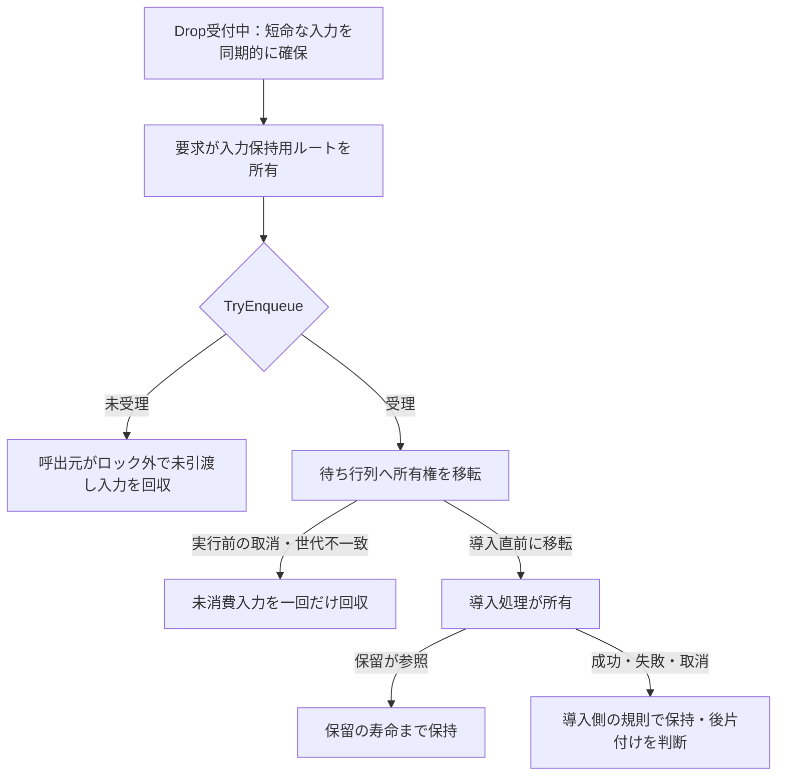

# ドロップ入力からの導入

## 目的と適用範囲

ファイルのドラッグ＆ドロップを、非同期の導入処理へ安全に引き渡す仕様です。外部アーカイバーの一時展開先は、ドロップの受付が戻った後まで存在するとは仮定しません。入力を受け入れる条件と、その入力を削除してよい条件を分けます。

## 用語

[共通用語集](../glossary.md)を参照します。コードの識別子は原表記を使います。

## 仕様

操作の受付分類・競合結果・必要継続の寿命は[競合ポリシー](../core/operation-concurrency-policy.md)を正本とします。以下は入力・処理・資源所有と結果の固有契約です。

### 入力の分類

通常導入の準備では実在ディレクトリを優先し、名前が `.zip`、`.7z`、`.rar`、`.lzh` またはその大小文字違いで終わっても、内容を展開せず同じディレクトリを後段へ渡します。ディレクトリ以外の対応書庫は既存の展開経路を使い、書庫の進捗番号・総数には同じ分類結果の書庫だけを数えます。対応拡張子、内容推測、未知・欠落入力の既存の扱いは変えません。

`TempDirectoryPublisher.IsManagedPath` は現在の起動中の削除権限を判定するものであり、導入入力の許可一覧ではありません。読み取れる通常のファイル・フォルダを、一時領域にあるという理由だけで拒否しません。ライブラリへ取り込む際は別途、[登録ルートの除外](mutations.md#保留入力と登録ルート)を適用します。

| 入力 | 待ち行列へ渡すもの | 入力確保処理が削除できるもの |
| --- | --- | --- |
| 現在の起動中にアプリが管理するパス | 元のパス | なし。他の生成元の管理範囲を引き取らない |
| システム一時領域の外 | 元の借用パス | なし |
| システム一時領域内で、現在の管理対象ではないパス | 新たな管理領域へコピーしたパス | 今回作った入力保持用のルートだけ |

システム一時領域は正規化した `Path.GetTempPath()` です。利用者が `%TEMP%\BeMusicSeeker` へ手動配置したものも、現在の管理対象でなければコピーし、元のパスを削除しません。

### 受付中の入力確保

`PackageInstallWorkflowOwner` は共通の変更受付を取得してから、`DroppedInstallIngressMaterializer` でドロップの受付中に同期的に入力を確保します。競合する要求は入力確保・コピー・一時領域の作成・再生停止より前にBusyで拒否します。短命な外部入力がある場合だけ、`TempDirectoryPublisher.Get("drop-ingress")` で要求ごとのルートを作ります。入力の寿命を確保する前に、コピー自体を別タスクへ送ってはいけません。

コピー先は一時領域からの相対配置を維持し、ファイル名だけへ平坦化しません。保持用ルートの外へ出るパス、一時領域のルート自体、コピー先の祖先となる入力ディレクトリは拒否します。

コピー元の包含縮約は、正規化したパスと取得済みの種別を操作内で対応付け、選択された一時ディレクトリの集合へ祖先を照合します。ファイル同士の包含比較や入力配列からの種別の再探索は行わず、コピーにも同じ種別を使います。末尾区切りの有無だけが異なるディレクトリも一つのコピー元へまとめます。要求の入力順序・重複・元パスと、各入力の相対配置・内容は維持します。

正規化した一時領域ルートは、OSまたはテストが与える信頼済みの字句上の基準とします。このルート自体が再解析ポイントであることだけでは、その配下を拒否しません。一時領域内の入力は信頼済みルートより下の祖先から入力までを順に検査します。一時領域外はファイルシステムのルート自身から検査し、ドライブ・共有ルートそのものの入力も、その属性を一度検査して受理します。実体の属性検査とコピー先の相対配置検査は分け、後者で `.` を一律に許可しません。ディレクトリは全子孫も検査します。検査対象にジャンクションやシンボリックリンクなどの再解析ポイントがあれば、要求全体を拒否し、再帰・コピーしません。検査後の能動的な差替えを防ぐハンドル単位の走査までは保証しません。

正規化、存在確認、安全性、コピーのいずれか一件でも失敗したら要求を作りません。今回作った保持用ルートだけを回収し、その失敗は元の失敗と分けて診断します。外部の元入力は成功・失敗・取消のいずれでも移動・削除しません。

入力確保が失敗した場合は、元の失敗分類と例外をそのまま返します。確保・回収の終端で共通受付と待機Taskを解放し、次の明示要求を受け付けられる状態へ戻します。

### 待ち行列への所有権の移転

要求は、確保済みパス、表示用の元パス、コピー前の全項目選択事実、今回作った保持用ルートを持ちます。安定した借用パスや、別の生成元が作った管理パスは回収対象に含めません。

受付成功前は要求自身が保持用ルートを所有します。`PackageInstallWorkflowOwner.TryEnqueue` は現在のライブラリ、共通の変更受付、待ち行列への挿入を一つの受付操作として決めます。成功したときだけ待ち行列へ所有権を渡します。未接続、競合、終了、世代の切替、取消処理の完了待ちで拒否した場合は、呼出元がロックの外で未引渡し入力を回収します。

各導入バッチは、共通の変更受付を保持したまま現在曲と先読みの停止完了を待ちます。停止が失敗した場合は導入処理へ入力を渡さず、書込みを始めません。停止待ちを含む一要求のTaskと後片付けが終わるまで受付を保持します。

実行前の取消・世代不一致では `TryAbandonUnconsumedSources` が一回だけ回収します。導入処理の直前に `TransferSourceOwnershipToInstaller` を行い、その後は待ち行列の終了処理で無条件削除しません。

[URL取得](../playlist/downloads.md#受付とuriの境界)も、取得物を所有入力として明示した要求で同じ移転を使います。通常の `Enqueue` に渡す借用入力を管理入力として扱いません。導入開始後に保留へ残る単体譜面は導入側が保持し、取得側の終端で削除しません。

管理用ロックの内側では状態変更と通知内容の捕捉だけを行います。ファイルI/O、回収、タスク開始、取消コールバック、ダイアログ、状態通知は外へ出します。取消時は保留要求を一回捕捉して除き、実行中の処理へ取消を知らせてから別処理で回収します。`CancelAll` は再帰的な回収の完了を呼出元で待ちませんが、実行中の処理と回収の両方が終わるまで、待ち行列を休止状態として公開しません。

世代の切替・終了・取消より先に挿入が成立した要求は、受理済みとして元の待ち行列で終了まで扱います。受付停止が先ならfalseで拒否し、受理して後から捨てません。古い通知や遅れた実行開始で、取消完了後の新しい受付を取り消しません。

#### 入力保持用ルートの所有権

図の矢印は、共通受付の取得後に今回作った入力保持用ルートの所有権移転または回収の順序です。借用パスと別の生成元の管理パスは、この回収範囲に含めません。

```mermaid
flowchart TB
    Drop["Drop受付中：短命な入力を同期的に確保"] --> Request["要求が入力保持用ルートを所有"]
    Request --> Admission{"TryEnqueue"}
    Admission -->|未受理| Caller["呼出元がロック外で未引渡し入力を回収"]
    Admission -->|受理| Queue["待ち行列へ所有権を移転"]
    Queue -->|実行前の取消・世代不一致| Abandon["未消費入力を一回だけ回収"]
    Queue -->|導入直前に移転| Installer["導入処理が所有"]
    Installer -->|保留が参照| Pending["保留の寿命まで保持"]
    Installer -->|成功・失敗・取消| Policy["導入側の規則で保持・後片付けを判断"]
```

導入への引渡し後に、待ち行列の `finally` から入力を無条件削除しません。実行中処理と未引渡し入力の回収の両方が終わるまで、取消後の新規受付を再開しません。回収失敗で主結果を置き換えない規則も維持します。

### 単体分割と子作品の発見

発見は、ディレクトリ単位の一式と譜面ファイルだけの単体を、次の規則で決めます。採用理由と採らない案は[保留パッケージの分け方](../../decisions/pending-package-grouping.md)を参照します。子ディレクトリは常に再帰して発見します。直下に対応譜面があるディレクトリDは、次の順に最初に当たった規則で決めます。

1. 同梱資源がある → D全体を一式にします（子譜面を含む）。同梱資源は、直下の譜面が参照し（未使用の定義を含む）D配下に実在する音声・BGA・動画・補助画像（STAGEFILE・BACKBMP・BANNER）・PREVIEWの参照先と、D直下の `preview`・`_preview` で始まる音声です。どの譜面も参照しないファイル（readme、未参照の画像など）は根拠にしません。親子の両方が自己資源を持つ場合は[入れ子の導入禁止](#資源を持つ入れ子の導入禁止)に従います。
2. 譜面を持つ子ディレクトリがある → 直下の譜面を各単体にし、子は別に発見します。
3. 直下の譜面が1件 → D全体を一式にします。
4. 直下の全譜面の正規化した `(タイトル, アーティスト)` のキーが一つに揃う → D全体を一式にします。キーは[導入先推定の比較用の基本情報](install-estimation.md#比較用の基本情報と導入先の代表ペア)と同じ入力（BMSは原題・元作者、bmsonは原題・現在の作者）と正規化で作り、完全一致だけを見ます。タイトルが空の譜面があれば揃わないとします。アーティストの空文字は通常の値で、空同士だけが一致します。
5. それ以外 → 直下の譜面を各単体にします。

直接指定したファイルを親フォルダごと扱う判定は、選んだ譜面について規則1と同じ根拠を使います。一部の譜面だけの選択は、この昇格がなければ各単体です。直下全項目の選択はフォルダ指定と同じに扱います。単位は発見時に確定し、推定の後に組み替えません。重複保留の登録整理と起動時の復元も同じ判定を使います。重複しない既存の保留行は分け直しません。

| 入力 | 結果 |
| --- | --- |
| 同梱資源のない別々の曲の差分を平坦に入れたフォルダ（フォルダ指定・全項目選択・書庫） | 規則5で各単体。曲ごとに推定・導入する。 |
| 同梱資源のない同じ曲の難易度違いの差分（`Title [Another]`、`Title [Hyper]`） | 規則4で一式。 |
| 譜面ごとに別のキー音を参照し、タイトル・アーティストがリミックスごとに異なり、各譜面のPREVIEW・BACKBMPやフォルダのpreviewを同梱する差分集（Stella 7475） | 規則1で一式。 |
| 直下に同梱資源のない差分、`songX/` に追加音源付き差分がある書庫 | 規則2で直下は各単体、`songX` は規則1で一式。 |
| 通常の作品フォルダ（譜面と共有音源） | 規則1で一式。 |
| 1曲の差分だけのフォルダ | 規則3で一式。部分指定なら単体。 |
| フォルダ内の一部の譜面だけの選択 | 各単体。選んだ譜面に同梱資源があれば親フォルダで規則を適用する。 |
| 親に譜面と同梱資源、子にも譜面 | 規則1で一式。子も自己資源を持てば導入を拒否する。 |
| 同梱資源のない別曲2件とreadmeだけの書庫 | 規則5で各単体。readmeは導入しない。 |
| 全項目選択の後に同じフォルダを再ドロップ | 同じ分類を再現し、導入先を引き継ぐ。 |
| 補助画像を全譜面が参照する複数曲の差分集 | 規則1で一式（割り切り）。 |

直下全項目選択の事実はコピー前に正規化した集合の一致で捕捉し、要求・窓口・ライブラリ・サービスへ変更不能な集合で渡します。捕捉済みの空集合を確保先から再判定しません。外部一時入力の部分コピーは選択分だけで、コピーされない隣接資源を昇格の根拠にしません。

全項目選択の照合は、選択された実在譜面ファイルを含む親だけを対象にします。明示ディレクトリや書庫だけのグループのために親の全直下を列挙しません。通常APIで選択事実が未捕捉の場合も同じ捕捉を使い、取得失敗を既知空の成功へ置き換えません。コピーする場合は既存の元・確保先対応で捕捉済み集合を写します。

直下に対応譜面を含む親の全項目選択は、書庫展開前にその親ディレクトリの入力へまとめます。内包書庫は展開せず、同じ操作で別途展開したパッケージを生成しません。親が一式になれば、内包書庫は相対パス・バイト列を維持する同梱物として導入されます。規則5で単体に分かれた場合は、readmeなどの未参照の付属物と同じく、内包書庫を導入も展開もしません（フォルダ指定で配下の書庫を展開しないことと同じ扱い）。書庫単独・部分選択・直下譜面なしの書庫群は、既存の展開と書庫順序を維持します。

親直下の譜面が定義する実在の音声・BGA・動画・補助画像（BACKBMP・STAGEFILE・BANNER）、実在するBMS/PMSのPREVIEW参照先、または直下のpreview・_preview始まりの音声があれば、子譜面を含む親全内容一式を優先します。補助画像とpreviewの追加は発見根拠だけで、演奏資源の健康度・完全性・共有率・親参照・入れ子の判定へ混ぜません。PREVIEWは通常ヘッダー構文・実採用本文の最初の非空値と通常相対参照を使い、拡張子を除いた名前が同じの既存音声拡張子互換で実在を確かめます。欠落・不正・親参照は根拠にせず、譜面も拒否しません。

未参照の隣接慣例は取得済み直下一覧の実ファイル名についてpreviewまたは_previewの前方一致をOrdinalIgnoreCaseで調べ、wav/ogg/mp3/flacだけを非再帰で扱います。`_preview.wav`や`_PrEvIeW_demo.FLAC`は根拠になりますが、`_preview.png`・`x_preview.wav`・`__preview.wav`や子階層だけの音源は親の根拠になりません。暗黙音源から通常要求や保存メタデータは生成せず、WAV等で同じ音源を明示した通常定義はそのまま評価します。BMSONの既存preview計数は維持します。

BMS/PMSのPREVIEWは、`PackageChartEntry.FromPath` が一度読んだスナップショットの実採用本文から分類済み参照として非保存の付帯出力として渡します。`ChartFile.PreviewMusic`、通常の `Resources`、長命な項目状態やDB保存へ加えません。分類は一般の子譜面警告や既存の手動導入可否を変更する根拠にしません。

規則2は規則3・4より先に評価するため、親の同梱資源がなく譜面を持つ子作品がある差分集は、直下が1譜面でも、キーが揃っていても、未同梱の共通参照があっても親全体へまとめません。規則3〜5は、子の走査が不完全で譜面を持つ子の有無が確定しない場合には適用しません。同じ探索の範囲・全譜面項目・完全性を分類とパッケージ作成へ共用し、生成処理で再帰読取りし直しません。不完全な一式の新規導入・登録置換を始めず、独立した正常範囲は処理できます。通常推定の同梱資源面での部分結果許容は別契約です。

例えば親直下のA/Bと、譜面Cを持つsong1・譜面Dと資源を持つsong2なら、親の実在資源がない場合はA/B各単体・song1一式・song2一式の4パッケージです。譜面を持たない子ディレクトリは規則2の子作品に数えず、ほかに譜面を持つ子がなければ、その親は規則1・3〜5で決めます。初期に一式として捕捉した範囲は、未参照の音声・画像・非譜面の子ディレクトリも相対パスとバイト列を保って導入します。

単体・子作品・後続入力の成功対象を一つの変更セッションへ集め、不足資源の譜面は保留へ残します。[重複・重なる入力の除外](mutations.md#導入と導入先修正)と[初期物理範囲の保持](install-estimation.md#検出した物理範囲の保持)に従い、成功した子の消費や親の後片付けで、親に残る保留譜面や後続入力を削除しません。管理元書庫を消費した後も保留が参照する展開先を保持し、借用書庫の元データを保持します。

既存保留の親子重複を整理する場合も、この分類・取得結果・完全性を共用します。通常追加と起動復元の旧群→新集合、実入力との接続資格、指定の継承は[物理範囲の保持](install-estimation.md#検出した物理範囲の保持)に従います。登録整理だけではファイルの移動・削除・導入を行いません。

### 資源を持つ入れ子の導入禁止

有効譜面ディレクトリ直下の譜面が定義する、自己領域に実在する音声・BGA・動画を判定の根拠にします。未使用の定義も含めます。資源は、最も近い有効譜面ディレクトリに所属します。譜面のない `A/sound/` はAに、譜面のある `A/B/` はBに所属し、Bの領域をAの根拠へ重複して数えません。資源を持つディレクトリが親子の双方にある場合だけ、元のパッケージ全体を重要警告付きで保留し、導入を拒否します。資源のない中間の譜面ディレクトリがあっても、親子の関係は成立します。

次の場合は、この禁止条件の根拠にしません。

- 親の音源を参照するだけの子譜面
- 資源だけの子ディレクトリ
- `.bms_`
- 背景補助・バナーだけ
- 未定義の同梱媒体だけ
- BMSONの `info.preview_music` に由来する定義だけ

同じパスに通常の音声定義があれば、未使用でも数えます。既存の一般の入れ子警告・不足警告・親参照の自動確定と自動導入の禁止は維持し、通常の `Resources`・健康度・共有率の意味を変えません。

完全な発見・復元では、健康度の投影で未使用定義を解放する前に、同一スナップショット由来の全定義から、元のパッケージについて条件の成否を一件確定します。BMSONは既存の定義元情報でプレビュー由来を除き、短命の判定材料は使用後に解放します。通常の `FromChart` に読取りを追加せず、元のパッケージの準備時に材料が不足する場合だけ明示的に取得します。通常の `Resources` が非nullでも、全定義を取得済みとは扱いません。読取りの失敗を、入れ子がない証明へ変換しません。保留復元で読取りが不完全な場合は、[復元全体の確定と失敗時選択](../runtime/startup.md#保留復元の失敗時選択)に従い、部分群を確定して公開しません。

判定値は保存せず、元のパッケージの寿命だけ保持します。警告の文言・色や、未所持の譜面だけに絞った作業用パッケージから可否を再構成しません。初段の自動導入、推定後の自動導入、強制新規、指定先導入、全譜面が既所持の資源上書き、清掃だけの分岐は、物理処理の前に拒否します。この確認は、宛先の予約・構成ファイルの件数判定・清掃の後処理より前に行い、導入先を指定しても解除しません。拒否したパッケージは導入成功に数えず、正常な別のパッケージの処理と受付の終端を保ちます。初段の正常な保留登録を、一律に失敗へ変換しません。手動・強制導入では、拒否を含む操作を `Succeeded=false` として返し、他の失敗がなければ例外を合成しません。正常分の成功の結果記録と既存の失敗を保持し、論理受付と物理排他の終端後に、重要警告を一操作につき一回案内します。

親行を含む全項目へ[重要警告](warnings.md#要約詳細強調)を投影します。既存のパレットによる行強調を使い、一般の入れ子警告の意味と非強調は保ちます。`UpdateInstallDestination` は削除や無効な拡張子への改名にも使うため剥奪せず、解消のための操作自体を許可します。

入力を修正した後は、同一の起動中に、既存UIの「再初期化」から元のパッケージを作り直して評価します。この経路は、管理一時入力でも、導入行と修正済み入力のパス・バイト列を保持します。同じパスの再ドロップや、削除・改名に対する新たな自動再捕捉は加えません。通常の再読込、管理入力を削除し得る保留解除、終了時の回収を伴うアプリの終了・再起動は、この非破壊の再評価経路の代用にしません。

### 導入後の入力の寿命

未準備入力は `InstallChartPackagesAutoWithProgressAsync` で一回だけ準備します。元入力の存在は展開前に確認し、適用直前には展開済み入力と必要なパッケージの存在を確認します。正常消費された管理元アーカイブの残存は、自動導入・保留登録・直接推定の条件にしません。設定、解析結果、所持索引は同じ受理操作内で再利用します。

発見後も `ChartPackage.path` がBMS・BMSONファイルそのものである単体入力は、新規導入時にフォルダ入力と同じ命名・要求内予約・既存実体との衝突回避を使います。準備した実宛先を物理処理と変更セッションへ渡し、その新規フォルダには当該ファイルだけを配置します。親フォルダ、兄弟のreadmeや別譜面は移動・削除しません。単体とフォルダの混在でも各宛先を予約し、宛先設定済み行の強制新規では設定済み宛先を使いません。明示宛先への単体差分導入では、既存の譜面ファイル名の衝突回避を維持します。隣接資源が揃っている等の既存発見規則でフォルダパッケージへ昇格する入力は、そのフォルダの範囲を維持します。

スマート上書き（SmartOverwrite）で保護するtxt/bmx/pmxの採番では、後続を含む全通常宛先・捕捉済みの実譜面先・必要な親ディレクトリ・生成済み採番先を、一物理計画の間だけ空き名から除きます。`readme.txt` と通常の `readme(1).txt` がある場合、前者の退避名で後者を奪いません。通常先が `readme(1).txt/Audio/tone.wav` なら未存在の親ディレクトリも保ちます。通常候補と実譜面先は型検査と物理計画で共有し、後段で再列挙・再採番しません。

既存の「拡張子を除いた名前+(n)+拡張子」と同内容省略を維持します。実在する同内容候補は通常予定先として予約されていても使えますが、未存在の予定先を実在同内容へ読み替えません。同じ固定保護設定の後続構成も実在先を省略又は再採番で保ち、入力元消費は永続確定後です。非保護資源の通常上書きや時刻判断を、予約だけで改名・拒否へ変更しません。新しい永続予約・再試行・追加走査は行いません。

導入処理へ渡した後は、[管理用一時領域の回収規則](../core/managed-temp-files.md#削除の時機)に従います。準備中例外、展開後の取消、宛先準備・再生停止の失敗、パッケージ未検出でも、適用へ未引渡しの管理入力を終端までに回収します。この削除に失敗した場合は、診断ログに加えて削除失敗の原因と対象パスを操作結果の終端報告へ保持します。確定済み導入と元原因・取消を置き換えず、回収失敗を併記し、自動再試行は行いません。保留パッケージが参照する管理入力は、現在の起動中はその保留を削除するまで保持し、アプリ終了時には一時領域の回収対象になります。

部分的な変更や例外では入力を壊すおそれがあるため、待ち行列が無条件に回収しません。残った管理領域は終了時または次回起動時の回収へ委ねます。回収失敗だけで取消・世代切替・終了の主結果を失敗へ置き換えません。

展開失敗と必須の更新日時復元失敗は対象を除外する非致命的警告として保持し、正常な独立入力は処理します。準備診断は適用前の例外・取消・対象なしでも操作結果の `OperationMessages` へ一度保持します。元例外と診断を終端へ渡し、結果案内は受付と回収の終端後に配送します。

破損・短いRARも対象を除外します。未採用の管理展開先で起きるI/Oや原因不明の故障は、その入力の準備不成立として扱い、失敗した展開内容を採用しません。全入力が不成立なら警告だけを終端へ渡し、導入成功の完了案内を出しません。部分成功なら成功した対象だけを一つの変更セッションへ集めます。書庫名の通常ディレクトリも、成功時の移動消費や保留元保持は通常フォルダと同じ規則に従います。利用者の借用元を保持し、失敗した私有コピー・展開先は既存の所有規則で回収します。通常の準備診断の失敗で、正常な展開対象を除外しません。

アーカイブの展開後サイズには、アプリ独自の明示的な上限を設けません。展開先外へ越境するエントリと、再解析ポイントを含む入力は拒否します。単独の `.` 成分は現在位置として解決し、`chart.bms`、`./chart.bms`、`sub/./chart.bms` の配置を保ちます。解決先が展開ルート自身になる場合はディレクトリエントリだけを受理します。種別はSevenZipExtractorと同梱7zの通常分類に従い、ディレクトリに分類される `./` は受理し、ファイルに分類される `.` は拒否します。名前と属性が矛盾するZIPについて、元属性の追加解析による再分類は行いません。親参照、絶対・ドライブ相対・UNCパス、ADS、通常名の末尾ドット・空白は拒否します。相対パスの境界で包含を確認した絶対宛先を一括展開へ渡し、同じ配置を日時復元へ引き継ぎます。

入力ストリームはネイティブ生成前に取得し、取得できたアーカイブと入力を通常の`using`で解放します。アーカイブの生成・解放に失敗しても、外側が所有する入力の解放へ進みます。固定依存の[SevenZipExtractor 1.0.19の実装](https://raw.githubusercontent.com/adoconnection/SevenZipExtractor/bb86813707ac05924117e77c4ab7235ea5dfbde9/SevenZipExtractor/ArchiveFile.cs)では、コンストラクターが返らないネイティブ資源の回収をアプリ側から待てません。この限界は受容し、依存の修正・置換を別作業へ保留します。取得不能資源の完全回収や、依存内部で吸収される故障の監視は保証しません。アプリ側で捕捉したOOMと、具体的な正本・共有状態の危険は[共通例外仕様](../core/exception-handling.md)に従い、私有入力の失敗や一般的な解放例外の発生だけを理由に終了へ広げません。

### 追加受付と画面の結果

導入中の追加ファイル・フォルダ・アーカイブは副作用前にBusyで拒否し、予約・自動再実行しません。一要求内に指定する複数入力は入力順で処理します。ライブラリ未接続、取消完了待ち、世代切替、終了などの拒否条件は維持します。

WPFの対応形式は `DataFormats.FileDrop` です。ドラッグ中は `GetDataPresent(..., autoConvert: true)` がtrueの場合だけCopyを示し、ドロップ時も同じ形式確認と取得を使います。実際のドロップは常に `Handled=true` とします。

入力確保と受付の両方が成功した場合だけ `Effects=Copy` として保留ツリーを展開します。非対応形式、確保失敗、未受理はNoneとし、多言語の案内を表示します。未受理は共通の `Warn_PackageInstallUnavailable` で案内し、例外へ変換しません。実ドロップの形式一覧は診断できますが、ドラッグ中の頻繁な処理で記録しません。

`FileGroupDescriptorW` と `FileContents` だけの仮想ファイルは対象外です。実装していない形式に対してCopyを示しません。

保留登録のDB・索引・集合が確定し、物理変更排他権を解放した時点で、既存の変更通知を導入ツリーと選択中の保留一覧へ反映します。自動推定の全件終了まで表示を抑制せず、適用済みの導入先と警告も逐次表示します。表示の公開を早めるために対象ごとの変更セッションへ分割しません。

取り込み確定後の自動推定と、設定有効時の[自動推定に続く導入](install-estimation.md#取り込み後の自動推定に続く導入)も、同じ受理操作の継続として直接待ちます。初段の物理変更排他権を解放しても共通論理受付を保持し、推定・後段導入・必要同期・必須公開・開始済み全Task・入力回収の終端後に解放して結果を通知します。後段の書込み前にも必要な再生停止を待ち、初段が保留だけでも停止を省きません。取消・評価失敗時は後段を開始せず、確定済み登録と既適用推定を保持し、未適用結果を保留へ残して実際の取消・失敗を報告します。

初段・後段の確定結果を一回の完了・失敗通知へ集約します。後段の未実行対象や後続失敗でも初段の成功を保持し、成功として公開できる導入済み対象だけを示します。後段で未開始となった対象の管理入力は保留の寿命まで保持し、借用元と通常フォルダの所有規則は変えません。

非同期の結果通知がawait後に失敗しても、元の操作結果は保持し、通知失敗を既存ログへ報告します。通知失敗でDispatcherを終了させず、既に解放した受付と次の明示要求を妨げません。

導入の進捗表示は、一要求の完了パス数と総パス数を示します。`Drop_install_queue_label_format` の引数はこの順序の2値です。辞書間の書式対応は[全件共通検査](../development/test-authoring.md#表示リソースの検査)で確認します。

新規パッケージに採用要求の名前付き親参照が一件でもあれば、全資源要求設定OFF・音声0/0でもパッケージ全体を保留します。別パッケージへは波及しません。既存の完全音源による新規探索省略は維持し、WARNINGを表示します。通常資源と発見PREVIEWは同じ採用復号・三分類で存在確認し、ルート付き PREVIEWは原文で除外します。発見・共有率へ対象外・非照合・任意画像後続を戻さず、入れ子判定では補助画像とpreviewだけを根拠にしません。同パス・SHAの保留固定指定はこの分類より前に適用します。既存`PrepareAutoInstallWorkflow`・PackageDiscovery・ResourceBearingNestedDiscovery系列が分担して確認します。

## 実装とテストの対応

| 仕様項目・主な条件 | 実装箇所 | テスト箇所・確認内容 |
| --- | --- | --- |
| 保護資源の計画内採番と通常宛先・必要ディレクトリの保全 | `BmsLibraryPackageInstallService.BuildFinalComponentMovePlan`、`BmsLibraryLibraryFileOperationsService.ResolveFileCollisionWithSuffix` | [保護資源の計画テスト](../../../tests/BeMusicSeeker.Core.Tests/Install/BmsLibraryProtectedInstallNameTests.cs)の `BuildFinalComponentMovePlan_ReservesAllNormalNamesRegardlessOfOrder` は3保護拡張子の正逆入力から全バイト列を、`BuildFinalComponentMovePlan_ReservesDirectoryAncestorsAndMultipleSuffixes` は未存在祖先と複数suffix・実サービス回収を、`BuildFinalComponentMovePlan_PreservesAlreadySuffixedStem` / `BuildFinalComponentMovePlan_PreservesOrdinaryResourceOverwrite` は既存名規則と通常上書きを確認する。`InstallPendingPackages_ProtectedNamesPreserveWholeBatchAndStoredPendingRemoval` は先行成功を含む実ファイル/SQLiteの所持追加・保留解除・一回反映を、`MovePackageFilesWithReceipt_SmartSameComponentDeletesSourceDuringFinalize` は通常予定先でもある実在suffixの同内容省略と永続確定後消費を確認する。 |
| ルート＋子譜面パッケージの共有資源推定から階層付き導入 | `PackageInstallWorkflowOwner`、`BMSLibrary`、`PackageInstallEstimationSnapshotBuilder` | `PackageInstallWorkflowOwnerTests.AutomaticContinuation_NestedUnownedPackageUsesPlacedResourceRequests` は全入力ハッシュ未所持の通常発見を共有事前集約へ通し、ルート同梱と子候補の和集合から既存先へ導入する。子配置・バイト列、song/所持集合、保留/導入解除と確定結果記録を確認し、候補条件の網羅は[推定仕様](install-estimation.md#実装とテストの対応)へ分担する。 |
| 元選択単位と補助資源の発見根拠 | `PackageInstallInputSelection`、`DroppedInstallIngressMaterializer`、`BmsLibraryPackageInstallService` | [BmsLibraryPackageDiscoveryTests.cs](../../../tests/BeMusicSeeker.Core.Tests/Install/BmsLibraryPackageDiscoveryTests.cs) の `PrepareAutoInstallWorkflow_SupplementEvidencePromotesOnlyActualAdjacentScope` は直接ファイルから宣言の実在・相対範囲・大小文字・音声互換と通常資源の非変更を確認する。`PrepareAutoInstallWorkflow_PreservesInputUnitBeforeDestinationEstimation` はフォルダ／全選択／部分選択と同じ作品か別曲かの組合せ、子作品・親資源の分類を分担する。`PackageInstallWorkflowOwnerTests.ProductionIngress_PreservesOriginalSelectionAcrossPrivateCopy` は実際の具体化処理からSQLiteまで既知空も含めて観測する。 |
| 暗黙preview・_preview音源による親一式の発見 | `BmsLibraryPackageInstallService.HasAdjacentPreviewAudio` | [BmsLibraryPackageDiscoveryTests.cs](../../../tests/BeMusicSeeker.Core.Tests/Install/BmsLibraryPackageDiscoveryTests.cs) の `ImplicitPreviewAudio_PromotesOnlyAdjacentAudioAndIncludesEachChartOnce` は実直下ファイルの名前・拡張子・大小文字と陰性境界を、ディレクトリ探索と単体選択の両入口で確認し、兄弟・子譜面の一回性と要求・メタデータの非混入を観測する。`PrepareAutoInstallWorkflow_ExplicitWavUsingImplicitPreviewAudioRemainsOneSatisfiedRequest` は通常WAV要求の一回計数・充足を確認する。`ProductionIngress_PreservesOriginalSelectionAcrossPrivateCopy` は未選択のpreview・_preview音源を部分コピー元へ補いに戻らず、二単体の保留・DB行と元音源を保持することを確認する。 |
| 譜面を含む全選択と内包書庫の通常同梱 | `PackageInstallInputSelection`、`BMSLibrary.PackageInstall` | [PackageInstallInputScopeTests.cs](../../../tests/BeMusicSeeker.Windows.Tests/Install/PackageInstallInputScopeTests.cs) の `ProductionIngress_FullChartScopeKeepsEmbeddedArchiveWithoutSeparateExpansion` は実確保から一式の保留登録・通常推定・後段導入へ通し、フォルダ／全選択の全ツリーと内包ZIPのバイト列、内部譜面由来の余分なパッケージ・配置・DB行がないことを確認する。`ProductionIngress_PartialAndChartlessArchiveSelectionsKeepSeparateExpansion` は部分譜面＋書庫と譜面なし全書庫の個別展開・順序・未選択兄弟の保全を分担する。 |
| 一式と単体の規則1〜5の順序と規則4のキー | `BmsLibraryPackageInstallService.DiscoverDirectory`、`InstallEstimationMetadataNormalizer.BuildPairKey`、`PackageInstallEstimationSnapshotBuilder.ProjectMetadataRecord` | [BmsLibraryPackageDiscoveryTests.cs](../../../tests/BeMusicSeeker.Core.Tests/Install/BmsLibraryPackageDiscoveryTests.cs) の `SearchChartPackagesRecursivelyWithMetadata_DirectChartsFollowUnitRulesInOrder` は、readmeと未参照画像を置いた入力で、規則の優先順、規則4の境界（大小文字・全角・副役割・SUBTITLE/SUBARTISTの非使用、MIX名・リミックス作者・別題・過半数一致・空TITLE・空ARTIST・bmsonの作者）、Stella型の同梱あり・なし、共通バナーの割り切り、子ディレクトリ内の規則5を、パッケージのパス・譜面集合・種別・親削除指定で確認する。[BmsLibraryPendingNormalizationTests.cs](../../../tests/BeMusicSeeker.Core.Tests/Install/BmsLibraryPendingNormalizationTests.cs) の `PrepareAutoInstallWorkflow_OverlapCleanupAppliesSameUnitRules` は重複保留の登録整理、[BmsLibraryInitializationInstallTests.cs](../../../tests/BeMusicSeeker.Core.Tests/Startup/BmsLibraryInitializationInstallTests.cs) の `LoadInstallTable_OverlappingRowsRestoreWithSameUnitRules` は起動時の復元が同じ規則を使うことを確認する。 |
| 別曲・同じ作品のフォルダの取り込みから導入まで | `PackageInstallInputSelection`、`BMSLibrary.PackageInstall`、`PackageInstallWorkflowOwner` | [PackageInstallInputScopeTests.cs](../../../tests/BeMusicSeeker.Windows.Tests/Install/PackageInstallInputScopeTests.cs) の `ProductionIngress_SeparateSongsInOneFolderEstimateAndInstallPerSong` は同梱資源のない別曲二譜面とreadme・未参照画像をフォルダ指定・全項目選択・書庫で取り込み、単体二件の保留行、各曲の所持フォルダへの推定と導入、付属物を導入しないことを確認する。`ProductionImport_FullSelectionRedropReproducesUnitsAndDestinations` は全項目選択の後の再ドロップで同じ単位・導入先・候補・保留行を再現することを確認する。 |
| 同梱資源による差分集の一式導入（Stella 7475型） | `BmsLibraryPackageInstallService`、`BMSLibrary.PackageInstall`、`PendingPackageWorkflowOwner` | [PackageInstallBundledArchiveTests.cs](../../../tests/BeMusicSeeker.Windows.Tests/Install/PackageInstallBundledArchiveTests.cs) の `ManualInstall_RemixDiffArchiveWithBundledSupplementsInstallsWholeUnitToSoleCandidate` は、TITLE・ARTISTがリミックスごとに異なりキー音を同梱しない四譜面と、各譜面のPREVIEW・BACKBMP、一譜面のSTAGEFILE、フォルダのpreview・readme・未参照画像を持つ合成ZIPを自動導入なしで取り込み、一式一件の保留、和集合推定で元曲フォルダだけが候補になり譜面一つ分のキー音を持つ囮が入らないこと、メタデータが異なり独立した音源だけを持つ所持先を明示した手動導入で、Strongや音源充足を要求せずに全ファイルのバイト列・song・所持・無関係保留を確認する。`AutomaticContinuation_RemixDiffArchiveWithBundledSupplementsInstallsWholeUnit` はStrongと音源条件を満たす合成所持入力で自動後段の一式導入を分担する。 |
| 単体分割後の子・孫発見と全体パッケージの非重複 | [`BmsLibraryPackageInstallService`](../../../BeMusicSeeker/Models/BmsLibraryInternal/Install/BmsLibraryPackageInstallService.cs) の `SearchChartPackagesRecursivelyWithMetadata`、`BMSLibrary.PackageInstall` | [`BmsLibraryPackageInstallServiceTests`（Core）](../../../tests/BeMusicSeeker.Core.Tests/Install/BmsLibraryPackageInstallServiceTests.cs) / [`BmsLibraryPackageInstallServiceTests`（Windows）](../../../tests/BeMusicSeeker.Windows.Tests/Install/BmsLibraryPackageInstallServiceTests.cs) の `SearchChartPackagesRecursivelyWithMetadata_PackagesSplitsIndependentChartsIntoSingleFilePackages` は子一つ・複数子と孫の条件で、全パス・譜面集合の一回性、単体とディレクトリのまとまりを確認する。`SearchChartPackagesRecursivelyWithMetadata_ParentResourcesControlChildPackageBoundary` は規則2による直下1譜面・共通参照だけの分割と、規則1の実在資源による親一式の優先を確認する。子・孫の単体化も前者の複数子条件で確認する。[`BmsLibraryPackageInstallServiceTests`](../../../tests/BeMusicSeeker.Windows.Tests/Install/BmsLibraryManagedArchiveInstallTests.cs) の `AutoInstall_SplitRootKeepsChildrenAndPendingInputsAcrossSources` は通常フォルダ・管理ZIP・借用ZIPで、子と後続の二作品の実ファイル・song DB・所持への一回反映、直下二譜面の保留・導入DB・元内容保持、重複入力と成功元の消費を確認する。親後片付け、取消・失敗・入力寿命は既存系列と分担する。 |
| 書庫名ディレクトリの受理と実書庫だけの進捗・通常導入 | [`BmsLibraryPackageInstallService`](../../../BeMusicSeeker/Models/BmsLibraryInternal/Install/BmsLibraryPackageInstallService.cs) の `ExpandInstallSourcesWithProgress`、`BMSLibrary.PackageInstall` | [`BmsLibraryPackageInstallServiceTests`（Core）](../../../tests/BeMusicSeeker.Core.Tests/Install/BmsLibraryPackageInstallServiceTests.cs) / [`BmsLibraryPackageInstallServiceTests`（Windows）](../../../tests/BeMusicSeeker.Windows.Tests/Install/BmsLibraryPackageInstallServiceTests.cs) の `ExpandInstallSources_PreservesArchiveNamedDirectory` は四拡張子と各大文字形で、同じ入力・内容の保持、展開通知・作成通知・警告なしを確認する。`ExpandInstallSources_ReportsArchiveOrdinalAmongArchivesOnly` は通常フォルダ・`work.ZIP` と実ZIP・7zの混在四入力で、実展開と書庫だけの番号・総数を確認する。[`BmsLibraryPackageInstallServiceTests`](../../../tests/BeMusicSeeker.Windows.Tests/Install/BmsLibraryManagedArchiveInstallTests.cs) の `AutoInstall_ManagedArchiveAndIndependentFolderShareOneCommitAndApply` は管理ZIPと `Independent.ZIP` 通常フォルダの二作品を実ファイル・DB・所持へ一回反映し、保留なしと元の消費を確認する。実書庫の全形式・必須日時・失敗時の保証は既存展開系列が分担する。 |
| 単体BMS・BMSONの新規導入と明示宛先への差分 | `BmsLibraryPackageInstallService.PrepareInstallDestination` / `MovePackageFilesCore`、`BMSLibrary.PackageInstall` | [`BmsLibraryPackageInstallServiceTests`（Core）](../../../tests/BeMusicSeeker.Core.Tests/Install/BmsLibraryPackageInstallServiceTests.cs) / [`BmsLibraryPackageInstallServiceTests`（Windows）](../../../tests/BeMusicSeeker.Windows.Tests/Install/BmsLibraryPackageInstallServiceTests.cs) の `ForceInstallPendingPackages_SingleChartsAndDirectoryUseReservedNewFolders` が実取り込み・保留保存後の単体とフォルダ混在、同名予約・既存ファイル／フォルダ衝突、宛先設定済み行の強制新規を、実配置・song DB・所持・新規／保留・導入表で確認する。`MovePackageFilesWithReceipt_SingleFilePackageFinalizesFileSource` が両形式の宛先未指定と明示宛先差分の衝突回避・兄弟保持を分担する。単体発見と隣接資源によるフォルダ昇格は既存の `PrepareAutoInstallWorkflow_DetectsSingleBmsonFileSelection` / `PrepareAutoInstallWorkflow_ExplicitBmsonFileWithAdjacentResourcesUsesDirectoryPackage` / `PrepareAutoInstallWorkflow_ClassifiesDetectedDirectoriesAsInstallable` 系列を維持する。 |
| URL取得入力の所有付き要求と保留の寿命 | `PlaylistWorkspaceViewModel.PlaylistUrlAcquisition`、`DroppedInstallBatchRequest`、`PackageInstallWorkflowOwner` | [URL取得の所有テスト](../playlist/downloads.md#実装とテストの対応)が開始前取消・世代退役の回収と実際のアイドル、実推定後の保留バイト列、後の明示手動導入を確認する。通常の借用入力と導入前回収は下記の既存系列が分担する。 |
| 自動推定後導入・必要同期・入力回収までの受付と集約結果 | `PackageInstallWorkflowOwner`、`BMSLibrary.PackageInstall`、`MainWindowViewModel` | [`PackageInstallWorkflowOwnerAutomaticContinuationTests`](../../../tests/BeMusicSeeker.Core.Tests/Install/PackageInstallWorkflowOwnerAutomaticContinuationTests.cs) と既存の管理／借用アーカイブ系列が停止・取消・未実行保留・入力保持／回収を分担する。[`MainWindowPackageMaintenanceWpfTests.DropInstallAutomaticContinuation_ReportsBothStagesThroughActualReceiver`](../../../tests/BeMusicSeeker.Windows.Tests/MainWindow/MainWindowPackageMaintenanceWpfTests.cs) は実管理主体から実受信側への受付解放後の一回報告を確認する。詳細は[推定仕様の対応表](install-estimation.md#実装とテストの対応)を参照する。同系列の正常行は保存済みCompleted後の次の実取り込みを正常結果・非エラー案内へ接続し、実P競合行は必須失敗・同期未完了案内と解放後の自動再実行0を確認する。 |
| 形式別の実展開から保留、共有経路の入れ子相対配置から実導入 | `SevenZipArchiveExtractor`、`BmsLibraryPackageInstallService`、`BMSLibrary.PackageInstall` | [`BmsLibraryPackageInstallServiceTests`](../../../tests/BeMusicSeeker.Windows.Tests/Install/BmsLibraryManagedArchiveInstallTests.cs) の `AutoInstall_NativeArchiveFormatsReachRealPendingStoreWithoutConsumingBorrowedSource` は既存7z・RAR・LZHの三譜面を実ネイティブ展開から実導入DB・保留正本へ通し、バイト列と借用元・対象外を保持する。`AutoInstall_NestedZipPreservesChartRelativeResourceStructureThroughRealInstall` はZIPの深い階層、現在位置成分とルートディレクトリを持つ入力から、固定の展開相対配置・バイト列、譜面からの音源参照、実DB・所持と借用元保持を確認する。非ZIP固有の入れ子のテストデータの実行は含まず、全形式に共通の展開後導入経路とZIP代表へ分担する。`SevenZipArchiveExtractor_RejectsEntryOutsideExtractionDirectory` は親参照・絶対/ドライブ/UNC・ADS・末尾のドット・空白・通常分類でファイルとなる `.` を拒否し、展開先外の専有の番兵ファイルとパス集合の不変を確認する。再解析ポイント拒否と検査宛先から展開・日時復元への配線は静的確認を分担する。日時復元の故障・取消回収は既存ネイティブ系列を維持する。 |
| 壊れた入力・私有準備失敗の非採用と通常所有 | [`SevenZipArchiveExtractor`](../../../BeMusicSeeker/Models/BmsLibraryInternal/Install/SevenZipArchiveExtractor.cs)、[`BmsLibraryPackageInstallService`](../../../BeMusicSeeker/Models/BmsLibraryInternal/Install/BmsLibraryPackageInstallService.cs) | [`BmsLibraryPackageInstallServiceTests`（Core）](../../../tests/BeMusicSeeker.Core.Tests/Install/BmsLibraryPackageInstallServiceTests.cs) / [`BmsLibraryPackageInstallServiceTests`（Windows）](../../../tests/BeMusicSeeker.Windows.Tests/Install/BmsLibraryPackageInstallServiceTests.cs) の `ExpandInstallSources_RejectsArchiveFailureWithoutConsumingSource` は短い・切断RARを含む非採用と借用元・展開先回収、`ExpandInstallSources_SourceReadFailurePreservesBorrowedSourceAndIndependentArchive` と `ExpandInstallSources_DiagnosticFailureDoesNotRejectIndependentNormalArchive` は実入力元読取りI/O・診断故障と正常入力の混在を確認する。実モデルの `AutoInstall_ArchiveWarningsSurviveEmptyOrMixedPreparation` は未知の必須日時復元故障による全不成立と、壊れZIP混在の部分成功を別条件で確認する。入力元先取得と内外`using`による解放、共有の展開器のメタデータ取込み側への配線は静的に確認する。[`ChartInfoMetadataSchemaExportImportTests.ChartInfoExport_CreatesArchiveWithRootMetadataDbAndStartupImporterCanImport`](../../../tests/BeMusicSeeker.Compatibility.Tests/ChartInfo/ChartInfoMetadataSchemaExportImportTests.cs) は実際の7z書出しと既定の展開器からDB取込み・アーカイブ移動を確認し、生成CLI未導入時の未実施を正常7zの保証と区別する。 |
| 自動導入前の再生・先読み停止 | [`PackageInstallWorkflowOwner`](../../../BeMusicSeeker/ViewModels/Install/PackageInstallWorkflowOwner.cs)、[`DropInstallQueueProcessor`](../../../BeMusicSeeker/ViewModels/Install/DropInstallQueueProcessor.cs) | [`PackageInstallWorkflowOwnerTests`](../../../tests/BeMusicSeeker.Windows.Tests/Install/PackageInstallWorkflowOwnerTests.cs)の`AutomaticInstall_WaitsForPlaybackStopAndDoesNotWriteOnStopFailure`で停止終端前の書込み禁止と停止失敗時の未変更を確認する。 |
| 短命な入力、相対配置、全体拒否、再解析ポイント、回収範囲 | [`DroppedInstallIngressMaterializer`](../../../BeMusicSeeker/ViewModels/Install/DroppedInstallIngressMaterializer.cs)、[`DroppedInstallBatchRequest`](../../../BeMusicSeeker/ViewModels/Install/DroppedInstallBatchRequest.cs) | [`DroppedInstallIngressMaterializerTests`（Core）](../../../tests/BeMusicSeeker.Core.Tests/Install/DroppedInstallIngressMaterializerTests.cs) は短命入力・相対配置・全体拒否・借用境界と属性注入を確認する。`Acquire_FilesystemRootReparseAttributeIsInspectedBeforeRejection` はドライブ・UNCの起点属性への到達と拒否を確認し、実共有への接続成功とは扱わない。UNC正常受理の分岐共通性は静的に確認する。[`DroppedInstallIngressMaterializerTests`（Compatibility）](../../../tests/BeMusicSeeker.Compatibility.Tests/Install/DroppedInstallIngressMaterializerTests.cs) の `Acquire_DirectoryContainingReparsePointRejectsBatchAndPreservesTarget` は実ディレクトリシンボリックリンクを含む入力の拒否と外部の番兵ファイル保持を確認する。同クラスの `Acquire_DriveRootReachesPendingRegistrationWithoutCopy` は専有ドライブルートの実受理・属性検査・元パス返却・コピーなしから、本番の管理主体/窓口とBMS保留・SQLite・受付終端までを確認する。 |
| 入力確保前のBusy、追加要求の非予約、一要求内の複数入力 | [`PackageInstallWorkflowOwner`](../../../BeMusicSeeker/ViewModels/Install/PackageInstallWorkflowOwner.cs) の `AcquireAndTryEnqueueDroppedPaths` | [`PackageInstallWorkflowOwnerTests`](../../../tests/BeMusicSeeker.Windows.Tests/Install/PackageInstallWorkflowOwnerTests.cs) の `AcquireAndTryEnqueueDroppedPaths_RejectsBusyBeforeAcquisitionWithoutReservation`: 共通受付の競合と導入中の両方で入力確保を呼ばず、終端後に拒否要求を実行せず、新しい複数入力要求だけを実行する。 |
| 入力確保失敗の保持、受付と待機Taskの終端 | 同上 | 同上の `AcquireAndTryEnqueueDroppedPaths_MissingSourcePreservesFailureAndReleasesAdmissionForFreshRequest`: 実際の具体化処理へ消失入力を渡し、元の失敗分類・例外、未実行、受付解放、アイドルへの完了、次の明示要求の実行と外部入力保持を確認する。 |
| 受付と取消、世代切替、回収完了、追加要求の拒否、導入後の非削除 | [`PackageInstallWorkflowOwner`](../../../BeMusicSeeker/ViewModels/Install/PackageInstallWorkflowOwner.cs)、[`DropInstallQueueProcessor`](../../../BeMusicSeeker/ViewModels/Install/DropInstallQueueProcessor.cs) | [`PackageInstallWorkflowOwnerTests`](../../../tests/BeMusicSeeker.Windows.Tests/Install/PackageInstallWorkflowOwnerTests.cs)、[`DropInstallQueueProcessorTests`](../../../tests/BeMusicSeeker.Core.Tests/Install/DropInstallQueueProcessorTests.cs) |
| 受理時だけCopyと画面展開、未受理の案内 | [`DroppedInstallDropTerminal`](../../../BeMusicSeeker/Views/MainWindow/DroppedInstallDropTerminal.cs) | [`DroppedInstallDropTerminalTests`](../../../tests/BeMusicSeeker.Core.Tests/Install/DroppedInstallDropTerminalTests.cs)、[`LocalizationResourceParityTests`](../../../tests/BeMusicSeeker.Core.Tests/Localization/LocalizationResourceParityTests.cs) |
| 推定中の確定済み保留表示と受付の維持 | `PackageInstallWorkflowOwner`、`MainWindowViewModel`、`InstallTreeViewModel` | [`ApplicationCompositionTests`](../../../tests/BeMusicSeeker.Windows.Tests/MainWindow/ApplicationCompositionTests.cs) の `MainWindowCompositionShowsCommittedPendingPackagesDuringEstimation`: 実構成と実DBを使い、評価ゲート中の保留ツリー・一覧、先行結果の導入先通知、後続Task終端までのBusyを確認する。取消・失敗時の開始済み兄弟Taskの回収は `PackageInstallWorkflowOwnerTests.ProductionImport_StopsDispatchAndApplyThenJoinsSuccessfulSiblingBeforeAdmissionRelease` に分担する。 |
| 非同期結果通知の失敗と操作結果・Dispatcherの維持 | [`MainWindowViewModel`](../../../BeMusicSeeker/ViewModels/MainWindow/MainWindowViewModel.cs) の導入結果受信側 | [`MainWindowViewHostTests`](../../../tests/BeMusicSeeker.Windows.Tests/MainWindow/MainWindowViewHostTests.cs) の `PackageInstallAsyncNotificationFailure_IsReportedWithoutEndingDispatcherAndNextRequestSucceeds`: 実管理主体から元の操作失敗を受け取り、通知のawait後に例外を返す境界でログ報告、受付終端、Dispatcherでの次要求成功を確認する。 |
| 管理元アーカイブの正常消費後の実導入・保留・推定 | [`BMSLibrary.PackageInstall`](../../../BeMusicSeeker/Models/Library/BMSLibrary.PackageInstall.cs) の `InstallChartPackagesAutoWithProgressAsync` | [`BmsLibraryPackageInstallServiceTests`](../../../tests/BeMusicSeeker.Windows.Tests/Install/BmsLibraryManagedArchiveInstallTests.cs) の `AutoInstall_ArchiveAndFolderInputsReachInstallOrPendingEstimation`: 同内容の管理ZIP・借用ZIP・フォルダでファイル・DB・所持への導入と、リソース不足時の保留行・入力保持・既知候補への推定を確認する。 |
| 適用前の取消・例外・対象なしと回収終端 | 同上、[`PackageInstallWorkflowOwner`](../../../BeMusicSeeker/ViewModels/Install/PackageInstallWorkflowOwner.cs) | [`PackageInstallWorkflowOwnerTests`](../../../tests/BeMusicSeeker.Windows.Tests/Install/PackageInstallWorkflowOwnerArchiveTests.cs) の `ProductionImport_PreApplyTerminalReclaimsManagedInputsBeforeAdmissionRelease`: 実変更窓口、展開先の日時復元引数、到達通知と実際のアイドルで未展開管理入力も含む回収・受付保持・元例外・未変更DBと利用者元保護を確認する。 |
| 未引渡し管理入力の削除失敗と元結果・終端報告の保持 | `BMSLibrary.PackageInstall`、`PackageInstallWorkflowOwner`、`MainWindowViewModel` | [`PackageInstallWorkflowOwnerTests.ProductionImport_RetainsRealInputCleanupFailureAlongsideOriginalTerminal`](../../../tests/BeMusicSeeker.Windows.Tests/Install/PackageInstallWorkflowOwnerArchiveTests.cs) は実際のファイルハンドルで削除を失敗させ、展開後取消／停止失敗の二行で元原因・取消と回収失敗の原因／対象パス、未変更DB、受付解放後の終端、ハンドル解放後の非再試行を確認する。[`MainWindowPackageMaintenanceWpfTests.DropInstallAutomaticContinuation_ReportsBothStagesThroughActualReceiver`](../../../tests/BeMusicSeeker.Windows.Tests/MainWindow/MainWindowPackageMaintenanceWpfTests.cs) は譜面なし管理ZIPの実回収失敗を初段成功・後段DB失敗へ重ね、確定結果と両原因・対象パスが実受信側の一回の表示へ届き、ハンドル解放後も自動再試行しないことを確認する。 |
| 準備警告の生成と解放後の一回配送 | 同上、`BmsLibraryPackageInstallService` | [`BmsLibraryPackageInstallServiceTests`](../../../tests/BeMusicSeeker.Windows.Tests/Install/BmsLibraryManagedArchiveInstallTests.cs) の `AutoInstall_ArchiveWarningsSurviveEmptyOrMixedPreparation` は全必須日時失敗／壊れZIP混在の対象・原因と正常対象の確定を、[`PackageInstallWorkflowOwnerTests`](../../../tests/BeMusicSeeker.Windows.Tests/Install/PackageInstallWorkflowOwnerArchiveTests.cs) の `ProductionImport_ArchiveWarningsAreDeliveredOnceAfterRelease` は実通知一度・解放後配送と、混在操作の実際のアイドル後に受理する次の明示要求の確定を確認する。表示失敗と元結果の分担は[変更操作](mutations.md#実装とテストの対応)を参照する。 |
| 採用親参照の新規パッケージ全体保留・探索前の固定指定 | `BmsLibraryPackageInstallService`、`PackageChartEntry` | `PrepareAutoInstallWorkflow_ParentReferenceHoldsWholePackageWithoutAffectingOtherPackages`が設定両値・兄弟全体保留と別パッケージ非波及を、分類DataRowが採用画像／動画／任意画像・音声0/0と対象外／後続陰性を確認する。発見・入れ子は既存PackageDiscovery・ResourceBearingNestedDiscovery系列が分担する。 |
| 実終端後に受理した明示要求の独立した追跡 | `DropInstallQueueProcessor` | `DropInstallQueueProcessorTests.Enqueue_RejectsAdditionalRequestWithoutReservationAndAcceptsFreshRequest` が、拒否した要求の非実行と独立した次の要求の終端を確認する。終端コールバック内での再受付は保証対象にしない。 |
| 資源を持つ入れ子の導入禁止の発見条件、全導入入口、復元、再初期化 | `BmsLibraryPackageInstallService`、`PackageInstallWorkflowOwner`、`PendingPackageWorkflowOwner` | [`BmsLibraryResourceBearingNestedDiscoveryTests`](../../../tests/BeMusicSeeker.Core.Tests/Install/BmsLibraryResourceBearingNestedDiscoveryTests.cs) が、形式・音声/BGA/動画・未使用・最寄りの所有・プレビューの定義元と陰性境界、通常の `Resources` と親行の強調を実発見に入力して確認する。全導入入口と正常な別パッケージの継続、実ファイル・SQLite・受付終端は [`PackageInstallResourceBearingNestedWorkflowTests`](../../../tests/BeMusicSeeker.Core.Tests/Install/PackageInstallResourceBearingNestedWorkflowTests.cs) と [`PendingPackageResourceBearingNestedWorkflowTests`](../../../tests/BeMusicSeeker.Windows.Tests/Install/PendingPackageResourceBearingNestedWorkflowTests.cs) が確認する。後者は、実発見後に所有メディアを退避した清掃だけの二経路と、削除・改名も含む。新しいライブラリでの復元は [`ResourceBearingNestedRestoreTests`](../../../tests/BeMusicSeeker.Core.Tests/Startup/ResourceBearingNestedRestoreTests.cs)、実ViewModelの再初期化と管理入力を含む非破壊の再評価は [`ResourceBearingNestedReinitializeTests`](../../../tests/BeMusicSeeker.Windows.Tests/MainWindow/ResourceBearingNestedReinitializeTests.cs) が分担する。一般の警告の要約・ツールチップと既存パレットによる描画は、[警告](warnings.md)・[一覧表示](../ui/table-view.md)の系列を使う。 |

## 関連資料

[変更操作の共通受付](mutations.md)、[管理用一時領域](../core/managed-temp-files.md)、[URLからの取得](../playlist/downloads.md)を参照します。
