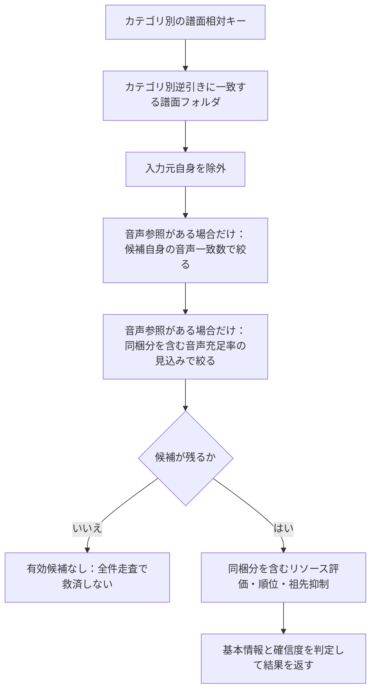

# 導入先の推定

## 目的と適用範囲

保留パッケージや選択譜面について、要求するリソースを最もよく満たす既存フォルダを推定する仕様です。入力、候補抽出、順位、確信度、画面への適用を定めます。実際の導入の受付・保存・失敗は[変更操作](mutations.md)に従います。

## 用語

[共通用語集](../glossary.md)を参照します。コードの識別子は原表記を使います。

本資料の「候補」は既存の譜面フォルダです。「充足率」は要求リソースのうち導入後に利用できる割合、「自身の所有分」は子孫から集約された分を除いたフォルダ自身のリソースを意味します。

## 仕様

操作の受付分類・競合結果・必要継続の寿命は[競合ポリシー](../core/operation-concurrency-policy.md)を正本とします。以下は入力・処理・資源所有と結果の固有契約です。

### 入力とリソースキー

対象はパッケージまたは単独の譜面です。[取得済みの共通リソース結果](chart-model.md#譜面情報とリソース保守)を `ChartResourceSnapshot` へ索引化し、複数譜面では検索キーを和集合にして音声・画像・動画・任意画像を分けます。原文・用途・解析状態は失わず保持し、未取得を保存主体やファイルから隠れて補完しません。

キーは拡張子を除いた譜面相対のパスです。`foo.wav` と `./foo.wav` は `foo`、`sound/./foo.wav` は `sound/foo`、`sound/foo.v2.wav` は `sound/foo.v2` になります。`foo` と `sound/foo` は別であり、ファイル名だけに戻して一致させません。既に正規化した参照をパッケージ集約時に再正規化しません。

パス解析で独立した `..` セグメントが見つかった場合だけ、親参照の非対応理由を登録し、索引のキーへ入れません。`sound/../foo.wav` も対象ですが、名前中の `foo..bar.wav` は親参照ではありません。実際の親参照が対象に一件でも含まれる場合は推定せず、`UnsupportedResourcePath` を表示します。

`.wav`、`.ogg`、`.png` など拡張子除去後のキーが空になる参照は索引へ追加せず、親参照の理由にも使いません。種類不明だけでもその理由を生成せず、未知拡張子の既存の解析採用範囲、空文字・不正パス・ドライブ絶対パス・先頭区切りの既存の正規化を維持します。既に解析された非対応理由は単体・パッケージ集約へ引き継ぎ、CP932のデコード非対応を親参照へ置き換えません。

### 入力元に同梱されたリソース

通常の導入推定では、候補のリソースとパッケージが持ち込む `BundledResources` の和集合を評価します。統合先と再導入先の修正では候補のリソースだけを評価します。

ディレクトリ単位のパッケージは、そのルートだけを再帰的に調べます。一ルートあたりの訪問上限は50000件です。上限を越えた時点で止め、部分結果を推定に使わず `SourceSurfaceScanLimitExceeded` を付けます。複数パッケージの合計件数ではありません。全件を先に取得する方式ではなく、訪問中に上限を確認します。

単一BMS・BMSONと単独譜面では、親をパッケージ範囲として列挙しません。`SourceDirectory` は入力元の候補除外や診断に使いますが、同梱リソースと入力元候補の集合は別の空集合です。走査時間、件数、ハッシュ生成時間、訪問件数は0、走査方式は空、上限超過はfalseとします。相対参照があることを親走査の理由にしません。

### ライブラリ側の索引

候補は `DirectoryResourceLookupCache.Keys` に含まれる譜面フォルダです。リソースだけの下位フォルダは候補にせず、入力元自身も除きます。

照合の正本は音声・画像・動画別の相対キーと逆引きです。ファイル名だけの集合や全種類を混ぜた集合を、候補抽出・最終照合・音声条件の代わりに使いません。索引がない場合は推定不能とし、全ライブラリの走査に切り替えません。起動時走査を無効にした設定では、推定できない場合があります。

### 入口ごとの候補

| 入口 | 候補と選び方 |
| --- | --- |
| 通常推定 | 未所持譜面を含むパッケージについて外部の譜面フォルダを探す。既所持だけなら通常推定しない |
| 既所持・未所持が混在 | 既所持ハッシュの実配置先を数え、単独最多ならそのフォルダを使う。同点ならその候補集合だけをリソース・基本情報で評価する |
| 統合先 | 全対象の既所持ハッシュ一致数が単独最多なら採用する。同点または一致なしなら、候補自身のリソースだけで評価する |
| 再導入先修正 | 現在の配置先を除いた既存フォルダを評価する。現在配置の状態は改善判定の基準だけに使う |

混在パッケージでは、配置先候補が解決できない場合、または候補限定の評価に必要な索引がない場合、通常推定へ切り替えず `InstalledDestinationResolveFailed` とします。候補の基本情報まで同等なら、フォルダ内の一意な主ハッシュ数を補助条件とし、単独最多なら通常の確定候補にできます。

それでも複数候補が残る場合、`AutoApplyAmbiguousInstallDestination` が有効で選択候補の題名・アーティストの根拠が `Strong` なら、自動設定と候補表示を行い `InstalledDestinationAutoAppliedAmbiguous` を残します。設定無効または根拠が弱い場合は導入先を空にし、`InstalledDestinationAmbiguous` と候補を表示します。

### 候補の絞込み

まずカテゴリ別の逆引きで参照キーに合う候補を集めます。候補が0件でも全ライブラリへ戻らず、`no_viable_destination_below_threshold` とします。

音声参照が二件以上なら候補自身で二件以上、一件なら一件以上の一致を要求します。音声参照がなければこの条件はありません。さらに、実際に使える音声の充足率が `innerWavHealthThreshold` を超える見込みがない候補を除きます。通常導入は同梱分を含め、統合・再導入は候補だけで判断します。

#### 通常推定の候補集合

未所持譜面を含む通常推定で、候補をどこまで絞るかを示します。矢印は候補集合の絞込み・評価への入力であり、候補がなくなった後に全ライブラリへ戻る経路はありません。混在・統合・再導入の候補集合は前の表で別に定めます。

最終的な有効候補・自動適用の判定は以下の各節に従います。索引利用不能と、評価した結果の候補なしも区別します。

### 評価値と順位

カテゴリごとに一致数 `Matched`、充足率 `Health`、候補側件数 `CandidateCount`、適合率 `Precision`、和集合に対する一致率 `Jaccard` を求めます。`Health` は一致数を要求数で割った値です。

有効候補の主な充足率は、音声参照があれば音声、なければ画像・動画・任意画像の最大値です。この値が `innerWavHealthThreshold` を超えることを要求します。

順位は音声、画像、動画、任意画像の順で比較し、各カテゴリ内は充足率、一致数、Jaccard、適合率の順です。最後にディレクトリのパスで順序を安定させます。比率は表示用に丸めず、元の比で比較します。

### 題名・アーティストによる同順位の解決

リソースの評価値が先頭候補と等しい有効候補だけを、基本情報で比較します。通常は最大3候補です。混在パッケージの候補限定評価で一意ハッシュ数の取得処理が渡された場合だけ、同等候補全体を対象にします。画面の候補表示はいずれも上位3件までです。

比較順は、題名とアーティストの組の完全一致、題名一致、アーティスト一致、題名の類似度、組の一致を裏付ける数、題名を裏付ける数、アーティストを裏付ける数です。混在パッケージに限り、それらが全て同等のときフォルダ内の一意な主ハッシュ数を使い、最後は元のリソース順位とパス順に戻します。譜面数で基本情報の明確な優劣を覆しません。

基本情報で一意に分かれた場合は `metadata_tiebreak_distinct`、一意ハッシュ数で分かれた場合は `directory_hash_count_tiebreak_distinct` として確信度を高くできます。

### 祖先候補の抑制

子孫のリソースが祖先の譜面フォルダからも見える場合、同等以上の評価を持つ子孫があり、祖先自身の一致数が0、子孫自身の一致数が1以上なら祖先を抑制します。親子関係のある候補だけを調べ、自身の所有分の照合も必要なときだけ行います。

### 確信度と画面への適用

| 結果 | 適用 |
| --- | --- |
| 有効候補なし | `Confidence=High`、導入先null、自動適用false。候補がないという判定の確信度であり、導入成功を意味しない |
| 一意な有効候補で基本情報も妥当 | 高い確信度で自動設定する |
| リソース同等だが基本情報または許可された一意ハッシュ数で差が付く | 高い確信度にできる |
| 解消しない複数候補、基本情報の不一致 | 低い確信度と候補を返す |
| 再導入で現在配置より改善しない | 低い確信度と候補を返す |

`INSTL DST` は、導入先があり `ShouldAutoApplyDestination=true` の場合だけ自動設定します。題名・アーティスト列、候補、警告も同じ結果から更新します。保留のリソース状態は代表譜面だけでなく全 `PackageChartEntry` に投影し、既所持・単一ファイル・入れ子の警告と両立させます。

保留の推定・手動変更・クリアと、導入済み譜面の再導入先推定・クリアは、操作結果から一覧へ反映する共通経路を使います。変更した譜面と一覧への影響を一つの操作完了通知で渡し、画面切替なしで導入先・代表情報・候補・推定警告を更新します。空の編集値は導入先と代表TITLE/ARTISTだけを消去します。候補選択と候補外の有効な手動入力は、既存のパス検証とパッケージ内の適用範囲に従って導入先・代表情報を更新します。いずれの編集でも候補と推定WARNINGは保持し、拒否された編集は状態を変更しません。「インストール先をクリア」は導入先・代表情報・候補・推定WARNINGを消去し、他カテゴリのWARNINGを保持します。空編集と明示クリアの両方で、次に表示行から作る要求へ古い導入先を残しません。再推定と実導入で状態を置換する既存の契約は維持します。

保留パッケージでは項目の状態を正本とし、後続の項目変更を古い一時状態で覆いません。通知・投影の経路が異なる通常のライブラリ行と対象集合行も同じ表示契約を満たします。表示行のキャッシュと並べ替え・絞込みの更新は[一覧表示](../ui/table-view.md#絞込みと画面更新)に従います。

### 自動推定と並列処理

新規取り込みで保留に入ったパッケージは一括処理の単位で自動推定します。起動時に復元した保留は自動推定せず、利用者の明示的な手動推定で処理します。入力元のリソースが十分なディレクトリパッケージは保留に残して自動推定を省略できますが、手動推定にはこの抑制を適用しません。

一件の手動推定では候補評価を並列化し、`asParallel=true` の並列数は `max(1, CPU数 - 1)`、falseなら1です。複数パッケージの一括推定は外側を並列化し、各候補評価は1にして二重並列を避けます。自動推定の外側並列数は `PendingInstallEstimateMaxParallelPackages`、0ならCPU数から決めます。手動の複数パッケージも同じ一括経路を使います。

全選択譜面が保留パッケージに属する場合はパッケージ単位へまとめられます。単独譜面が混じる場合と再導入先修正は外側を逐次実行し、内側の候補を並列評価します。入力元の基準判定で作った参照集合は同じ対象の評価へ再利用します。

取り込みから推定・regroupへの直接継続と受付終端は[競合ポリシー](../core/operation-concurrency-policy.md#ライブラリ保留保守)に従います。物理変更leaseの解放を推定完了と扱わず、確定済み登録・適用済み結果・未適用の保留を実結果へ区別します。

### 推定入力の確定と停止

受理後に現在対象・所持未所持の分割・評価入力を一度捕捉します。取り込みが捕捉した設定は直接推定の並列度と評価にも使います。準備した入力元のリソース参照集合と分割は同じ操作内で再利用します。譜面情報の読込み・ハッシュと譜面情報の補完・所持保守・LR2同期など、推定入力を実際に更新する受理済み背景処理も同じ論理受付を使います。背景処理は先行操作の実終端を非同期で待ち、Busyで捨てません。通信・表示キャッシュ・リソース健全性の読取り表示は、それだけを理由に全体待機へ含めません。独立キャッシュと所持集合の版、通知順、再接続の識別、物理変更権限、リソース健全性の入力保護は各責務へ残します。

取消または最初の評価例外を観測した後は、新しい評価のdispatchと結果のapplyを止めます。開始済み兄弟が後で正常終了しても未反映結果を適用しません。既に適用した推定と確定済み登録・導入は保持し、未適用対象を次の明示推定用に保留へ残します。開始済み全評価Taskと後片付けの終端までBusyを保ち、全対象のSEARCHINGを解除してから受付を解放します。結果には確定済み事実と実際の準備・評価の失敗・取消を保持し、失敗を空の成功結果へ置き換えません。

### 表示用の再グループ化

発見時に `RegroupEligibleSourceDirectories` へ記録した入力元だけを、一括推定の末尾で再グループ化できます。同じ入力元の保留が二件以上あり、既にディレクトリパッケージがなく、遅延推定の対象が混在しないことを条件にします。

既所持譜面はハッシュから実配置先、未所持譜面は設定済みの推定先を使い、全対象が一つの導入先へ揃う場合だけまとめます。分割・解決不能なら変更しません。再グループ化後の導入先と題名・アーティストは未所持の項目だけへ設定し、全て既所持なら導入先は空です。警告とリソース状態は新しいパッケージ単位で初期化します。

### 推定先への実導入

短いモデルの保護範囲で現在の保留と照合し、入力順に重複を除き、有効な項目の導入先が全て空の候補を除きます。保護範囲を出てから適格な候補だけを捕捉し、除外した入力・行・導入先・警告は変更しません。

分類と物理処理は入力順です。所持判定には開始時の主ハッシュと `SessionSuccessOwnershipOverlay` の先行成功を使います。同一パッケージ内の同じハッシュを重複処理せず、既所持を除いた新規対象の導入先が空または複数なら保留を維持します。

実導入は一つの変更セッションへ集約します。全譜面が既所持でも、リソースだけ・後片付けだけの必要な変更は残します。追加BMS・BMSONと、リソースの移動先にある既所持譜面を末尾の保守対象にします。何も移動しない後片付けだけの成功では保守しません。

物理完了時のパス・導入状態の反映と、保守から所属登録への順序を維持します。必須後処理が全て成功した後、今回導入した譜面の同じ所持tokenから現在値を取り直し、加入済みentryへ計算済みの充足値を局所反映します。既存の延期通知をリース解放後に公開し、失敗・取消時に成功した後処理を装いません。

既存のリソース状態索引が有効なら対象だけを差分更新し、索引が未構築・無効なら、この後処理だけを理由に全体再構築しません。入力元の保全、確認済み残存物の削除、終端の報告は[ファイルとDBの整合](file-db-consistency.md)に従います。

### 診断

`estimate_install start` の評価方式、候補数、絞込み後件数、照合時間、祖先抑制、確信度と理由を確認します。同順位がある場合は `metadata_frontier` と `metadata_tiebreak`、一括推定は `packageDegree` を併せて確認します。

実導入の対象別記録は物理処理の単位であり、DB確定回数ではありません。`reverse_lookup_incremental_update`、`maintenance_update`、`resource_health_index_delta`、`chart_info_inline_install` で操作末尾の集約を確認します。

### 保留パッケージを新規として導入する確認

「新規としてインストール」は設定・推定された導入先を使用せず、新規インストール先へ導入します。推定、候補生成、リソース警告、導入処理自体は変更しません。

パッケージ内に導入先設定済みの譜面があれば、設定先を使わない旨を必ず確認します。全譜面の導入先が未設定の場合は、`ShowNewPackageInstallConfirmMsg`（既定 true）に従い、保留を意図的に新規扱いし、リソース不足等の WARNING が残っていても導入する旨を確認します。この設定を false にしても設定済み導入先の確認は省略しません。

確認は共通論理受付の取得後、モデルの物理変更リース取得前に解決し、既定の応答を No にします。ボタンを選ばず閉じた場合も承認せず、拒否されたパッケージは導入先の有無によらず変更せず、入力元・DB・保留を保持します。複数選択では承認されたパッケージだけを既存の一括導入経路へ渡します。

## 実装とテストの対応

| 仕様項目・主な条件 | 実装箇所 | テスト箇所・確認内容 |
| --- | --- | --- |
| 新規としての導入確認、設定による省略、拒否対象の保全 | `PendingPackageWorkflowOwner`、`BMSLibrary.PackageInstall`、`BmsLibraryPackageInstallService` | [`PendingPackageWorkflowOwnerTests`](../../../BeMusicSeeker.Tests/Install/PendingPackageWorkflowOwnerTests.cs) の `ForceInstallPackagesAsync_ConfirmsAccordingToDestinationAndNewInstallSetting` は要求の既定値を実表示部品で正規化した `ClosedByUser` 応答が未承認になることと項目保持を確認し、既存の確認条件・混在選択も維持する。[`BmsLibraryPackageInstallServiceTests`](../../../BeMusicSeeker.Tests/Install/BmsLibraryPackageInstallServiceTests.cs) の `ForceInstallPendingPackages_PublicEntryUsesConfirmationSettingAndPreservesRejectedInput`: 公開入口で未設定ONの新規確認、未設定OFFの無確認導入、設定済みOFFの確認維持、No・未選択閉鎖時の入力元・DB・保留保持、肯定時の実新規導入を確認する。閉鎖応答は要求のボタンと既定値を `ThemedMessageBox.NormalizeDefaultResult`・`UiDialogResult.ClosedByUser` の既存変換へ通して生成する。明示的な未承認パッケージ保全の既存ケースも維持する。 |
| 新規としてのメニュー表示と既存操作経路 | [`MainWindow`](../../../BeMusicSeeker/Views/MainWindow/MainWindow.xaml) | [`MainWindowPackageMaintenanceWpfTests`](../../../BeMusicSeeker.Tests/MainWindow/MainWindowPackageMaintenanceWpfTests.cs) の `CompiledTreeMenusPreservePackageSectionsAndPendingOperations`、`CompiledSelectedChartRoutesPreservePendingTargetAndHandledBeforeCompletion`: ツリー・選択譜面の実ForceInstall項目Headerと表示リソースの対応、既存経路・対象・完了を確認する。 |
| 新規としての実導入先と設定先の非使用 | `BMSLibrary.PackageInstall`、`BmsLibraryPackageInstallService` | [`BmsLibraryPackageInstallServiceTests`](../../../BeMusicSeeker.Tests/Install/BmsLibraryPackageInstallServiceTests.cs) の `ForceInstallPendingPackages_UsesPreflightDestinationAndWarmDelta`: 実導入先が設定済みExplicitと異なること、Explicitへ入力譜面・資源を作らないことを、既存の仕事量・通知・永続結果とともに確認する。 |
| 相対キー、カテゴリ、候補抽出、順位と確信度 | [`BmsLibraryInstallEstimationService`](../../../BeMusicSeeker/Models/BmsLibraryInternal/Install/BmsLibraryInstallEstimationService.cs)、[`PackageInstallEstimationSnapshotBuilder`](../../../BeMusicSeeker/Models/BmsLibraryInternal/Install/PackageInstallEstimationSnapshot.cs) | [`BmsLibraryInstallEstimationServiceTests`](../../../BeMusicSeeker.Tests/Install/BmsLibraryInstallEstimationServiceTests.cs) |
| 入力元の走査上限、単一ファイルとディレクトリの区別 | [`PackageInstallEstimationSnapshotBuilder`](../../../BeMusicSeeker/Models/BmsLibraryInternal/Install/PackageInstallEstimationSnapshot.cs) | [`BmsLibraryInstallEstimationServiceTests`](../../../BeMusicSeeker.Tests/Install/BmsLibraryInstallEstimationServiceTests.cs)、[`BmsLibraryPackageInstallServiceTests`](../../../BeMusicSeeker.Tests/Install/BmsLibraryPackageInstallServiceTests.cs) |
| 起動復元の手動推定 | [`BMSLibrary`](../../../BeMusicSeeker/Models/Library/BMSLibrary.cs) の `Initialize` | [`BmsLibraryInitializationInstallTests`](../../../BeMusicSeeker.Tests/Startup/BmsLibraryInitializationInstallTests.cs) の `Initialize_RestoresPendingWithoutAutomaticEstimationAndAllowsManualEstimation`: 実DB復元と必須背景更新の終端まで評価を開始せず、復元対象の明示推定で導入先を設定できることを確認する。 |
| 取り込みから直接推定への受付、取消・例外後のdispatch/apply停止と全Task終端 | [`PackageInstallWorkflowOwner`](../../../BeMusicSeeker/ViewModels/Install/PackageInstallWorkflowOwner.cs)、`BMSLibrary.PackageInstall`、`BMSLibrary` | [`PackageInstallWorkflowOwnerTests`](../../../BeMusicSeeker.Tests/Install/PackageInstallWorkflowOwnerEstimationTests.cs) の `ProductionImport_StopsDispatchAndApplyThenJoinsSuccessfulSiblingBeforeAdmissionRelease`: 管理実ZIPを含む本番mutation portと実DBの保留確定、外側並列度2、A適用済み・B/C成功評価保持・D未開始から取消と例外を確認する。停止後にCを成功終端させても未適用、D開始0、全Task回収までBusy、SEARCHING全解除、確定事実・未適用管理入力と元の失敗保持、次の明示要求成功を確認する。 |
| 正常消費された管理元ZIPから保留登録・推定への継続 | `BMSLibrary.PackageInstall` | [`BmsLibraryPackageInstallServiceTests`](../../../BeMusicSeeker.Tests/Install/BmsLibraryManagedArchiveInstallTests.cs) の `AutoInstall_ArchiveAndFolderInputsReachInstallOrPendingEstimation`（リソース不足）: 管理ZIP・借用ZIP・フォルダから同じ既知候補を推定し、保留行と実入力を保持する。正常導入との分担は[ドロップ導入](drop-install.md#実装とテストの対応)を参照する。 |
| 実背景入力更新の非重複と受理済み更新保持 | `CatalogChartInfoOwner`、`ChartFileOperationSynchronizer` | [`PackageInstallWorkflowOwnerTests`](../../../BeMusicSeeker.Tests/Install/PackageInstallWorkflowOwnerEstimationTests.cs) の `ProductionHydration_BlocksNewImportUntilActualInputPublicationCompletes` は実索引公開中の新規取り込み拒否と終端後成功、`ProductionImport_StopsDispatchAndApplyThenJoinsSuccessfulSiblingBeforeAdmissionRelease` は推定中に受理した実hydrateが入力を変えず、推定終端後に実DBの新しい行を索引へ反映することを確認する。 |
| 開始済みLR2全体同期と受理済みmaintenanceの交差 | `Lr2SynchronizationOwner`、`BMSLibrary.InstallableMaintenance` | [`InstallableMaintenanceAdmissionTests`](../../../BeMusicSeeker.Tests/Startup/InstallableMaintenanceAdmissionTests.cs) は実初期化で受理したmaintenanceと実LR2 Queueを接続し、全体同期の共通受付実終端待機、LR2→maintenanceの反映順、両方のDB更新と全開始Task終端、次の明示受付を確認する。 |
| 標準構成の全試聴・保留目録・設定・入力再読込み入口 | `ApplicationComposition`、各機能の管理主体 | [`ApplicationCompositionTests`](../../../BeMusicSeeker.Tests/MainWindow/ApplicationCompositionAdmissionTests.cs) の `StandardComposition_RejectsCatalogPlaybackAndSettingsBeforeSideEffectsWhileKeepingDraftAndSelection` は共通受付の保持中に実入口を呼び、保留目録の拒否、player開始0、設定保存0、再読込みのBusy、draft・一覧・選択と取消、解放後の明示成功を確認する。試聴同士の順次実行と停止の保証は[音声](../runtime/audio.md)に従う。 |
| 現在の保留との照合、先行成功、保存と必須反映の集約 | [`BmsLibraryPackageInstallService`](../../../BeMusicSeeker/Models/BmsLibraryInternal/Install/BmsLibraryPackageInstallService.cs) | [`BmsLibraryPackageInstallServiceTests`](../../../BeMusicSeeker.Tests/Install/BmsLibraryPackageInstallServiceTests.cs)、[`BmsLibraryLr2SongDbSyncTests`](../../../BeMusicSeeker.Tests/Lr2/BmsLibraryLr2SongDbSyncTests.cs) |
| 画面の終端、異常報告と後続の失敗 | [`PendingPackageWorkflowOwner`](../../../BeMusicSeeker/ViewModels/Install/PendingPackageWorkflowOwner.cs)、[`MainWindowPendingPackageMutationViewTerminal`](../../../BeMusicSeeker/Views/MainWindow/MainWindowFeatureTerminals.cs) | [`PendingPackageWorkflowOwnerTests`](../../../BeMusicSeeker.Tests/Install/PendingPackageWorkflowOwnerTests.cs)、[`MainWindowPendingPackageMutationViewTerminalTests`](../../../BeMusicSeeker.Tests/MainWindow/MainWindowPendingPackageMutationViewTerminalTests.cs)、[`MainWindowPackageMaintenanceWpfTests`](../../../BeMusicSeeker.Tests/MainWindow/MainWindowPackageMaintenanceWpfTests.cs) |
| 保留項目の編集結果を実体化済み行と次要求へ反映、空編集後の候補・推定WARNING保持 | [`PackageChartEntry`](../../../BeMusicSeeker/Models/BmsLibraryInternal/Install/PackageChartEntry.cs)、[`MainChartRowProjectionOwner`](../../../BeMusicSeeker/ViewModels/ChartList/MainChartRowProjectionOwner.cs)、[`LibraryChartRow`](../../../BeMusicSeeker/ViewModels/ChartList/LibraryChartRow.cs) | [`ChartListVirtualViewTests`](../../../BeMusicSeeker.Tests/ChartList/ChartListVirtualViewTests.cs) の `PackageChartSourceRows_InstallDestinationEditsNotifyCurrentProjectionAndPreserveEstimation`: adapterless BMSONの入力行・表示行を先に読み、候補B→空の受理済み編集結果を通知時点の現値、保持候補・推定WARNING、次の検索要求で確認する。編集受付と受渡しは [`RegularChartNavigationTests`](../../../BeMusicSeeker.Tests/ChartList/RegularChartNavigationTests.cs) の `InstlDstCellEdit_UsesPendingOwnerWithExactChartTargetAndText` で確認する。 |
| 導入先変更の共通完了通知、即時反映と明示的クリア | [`PendingPackageWorkflowOwner`](../../../BeMusicSeeker/ViewModels/Install/PendingPackageWorkflowOwner.cs)、[`MainChartRowProjectionOwner`](../../../BeMusicSeeker/ViewModels/ChartList/MainChartRowProjectionOwner.cs) | [`PendingPackageWorkflowOwnerTests`](../../../BeMusicSeeker.Tests/Install/PendingPackageWorkflowOwnerTests.cs) の `SearchPendingAsync_LooseTargetPublishesTransientProjectionAfterGateRelease` は排他解放後の単一通知を確認する。[`MainWindowPackageMaintenanceWpfTests`](../../../BeMusicSeeker.Tests/MainWindow/MainWindowPackageMaintenanceWpfTests.cs) の `CorrectInstallDestinationSearchAndClearPreserveFullScanPresentation` は全件確認の実操作から候補・警告の更新とクリア、Rows・選択保持、次要求の現在値を確認する。 |
| 導入先編集での推定情報保持と明示クリア、パッケージ内適用と拒否時保持 | [`BMSLibrary`](../../../BeMusicSeeker/Models/Library/BMSLibrary.cs) の `SetPendingInstallDestination`、[`PackageChartEntry`](../../../BeMusicSeeker/Models/BmsLibraryInternal/Install/PackageChartEntry.cs) の `ApplyInstallDestinationMetadata` | [`BmsLibraryPendingPackageRegroupTests`](../../../BeMusicSeeker.Tests/Install/BmsLibraryPendingPackageRegroupTests.cs): `SetPendingInstallDestination_FromLowConfidenceCandidates_PreservesWarningAndSuggestions` は2譜面への反映と別パッケージ保持、`SetPendingInstallDestination_WithManualDirectory_PreservesLowConfidenceState` は空・候補外入力と拒否状態保持、`SetPendingInstallDestination_MetadataMismatchEditsPreserveContextUntilExplicitClear` は1候補の選択→空→手動編集と明示クリアでの他カテゴリWARNING保持を確認する。 |
| 同一導入sessionの先行物理成功を使うリソース専用判定 | `BmsLibraryPackageInstallService` | [`BmsLibraryPackageInstallServiceTests`](../../../BeMusicSeeker.Tests/Install/BmsLibraryPackageInstallServiceTests.cs) の `InstallPendingPackagesToEstimatedDestinations_ReevaluatesResourceOnlyAfterEarlierPhysicalSuccess`: 先行成功の所有overlayに基づく再判定を維持し、推定入力の世代再評価とは区別する。 |
| 同一操作の入力再利用、並列度、検索中状態の解除、再グループ化 | [`BMSLibrary`](../../../BeMusicSeeker/Models/Library/BMSLibrary.cs)、[`PendingEstimateSourceBatchSnapshot`](../../../BeMusicSeeker/Models/BmsLibraryInternal/Install/PendingEstimateSourceBatchSnapshot.cs) | [`BmsLibraryPendingPackageRegroupTests`](../../../BeMusicSeeker.Tests/Install/BmsLibraryPendingPackageRegroupTests.cs) |
| 導入済み対象だけのリソース上書きに必要な実配置の一致 | [`BmsLibraryPackageInstallService`](../../../BeMusicSeeker/Models/BmsLibraryInternal/Install/BmsLibraryPackageInstallService.cs) | [`InstalledOnlyResourceOverwriteValidationTests`](../../../BeMusicSeeker.Tests/Install/InstalledOnlyResourceOverwriteValidationTests.cs) |
| 評価入力の変更不能性とリソース相対キー | [`ChartResourceSnapshot`](../../../BeMusicSeeker/Models/BmsLibraryInternal/Resources/ChartResourceSnapshot.cs) | [`ChartResourceSnapshotTests`](../../../BeMusicSeeker.Tests/Resources/ChartResourceSnapshotTests.cs) |
| 空キー・種類不明から親参照理由を生成せず、正常なキー・件数・ハッシュと解析採用範囲を保持 | [`ChartResourceSnapshot`](../../../BeMusicSeeker/Models/BmsLibraryInternal/Resources/ChartResourceSnapshot.cs)、`BmsChartFileParser`、`BmsonChartFileParser` | [`ChartResourceSnapshotTests`](../../../BeMusicSeeker.Tests/Resources/ChartResourceSnapshotTests.cs) の `Create_ExtensionOnlyBmsResourcesKeepNormalKeysWithoutParentTraversal` は小さい実BMSから投影配列の有無、単体・集約を確認する。`AnalyzeReferencePathForLookup_PreservesExistingPathClassification` と `Create_UnknownResourcePreservesOnlyActualParentTraversal` は解析・種類不明の境界を確認する。[`BmsonSongParserTests`](../../../BeMusicSeeker.Tests/ChartInfo/BmsonSongParserTests.cs) の `Parse_ExtractsResourceReferences` は実bmsonから直接・投影・集約を確認する。 |
| 空キー等があっても既存候補を推定し、実親参照では警告して保留 | `BMSLibrary.PackageInstall`、[`ChartResourceSnapshot`](../../../BeMusicSeeker/Models/BmsLibraryInternal/Resources/ChartResourceSnapshot.cs) | [`BmsLibraryPendingPackageRegroupTests`](../../../BeMusicSeeker.Tests/Install/BmsLibraryPendingPackageRegroupTests.cs) の `SearchEstimatedInstallationDirectory_CurrentDirectoryResourcePath_NormalizesAndEstimates` は本番解析から候補・保留理由・警告なしを、`SearchEstimatedInstallationDirectory_UnsupportedParentResourcePath_WarnsAndSkipsEstimation` は実親参照の警告・保留を確認する。 |
| CP932デコード非対応の理由を単体・集約に保持し、親参照と区別 | [`ChartResourceSnapshot`](../../../BeMusicSeeker/Models/BmsLibraryInternal/Resources/ChartResourceSnapshot.cs)、`Lr2CompatibilityEvaluator` | [`Lr2CompatibilityGoldenTests`](../../../BeMusicSeeker.Tests/Lr2/Lr2CompatibilityGoldenTests.cs) の `EvaluatorFlagsCp932DecodeUnsupportedResourceAndContinuesLengthEvaluation` は入力バイト列から理由の保持と親参照falseを確認し、既存の符号化・長さの評価も維持する。 |

## 関連資料

[データと索引](../core/data-and-indexes.md)、[警告](warnings.md)、[変更操作](mutations.md)、[共通並行処理](../core/workflow-concurrency.md)を参照します。
