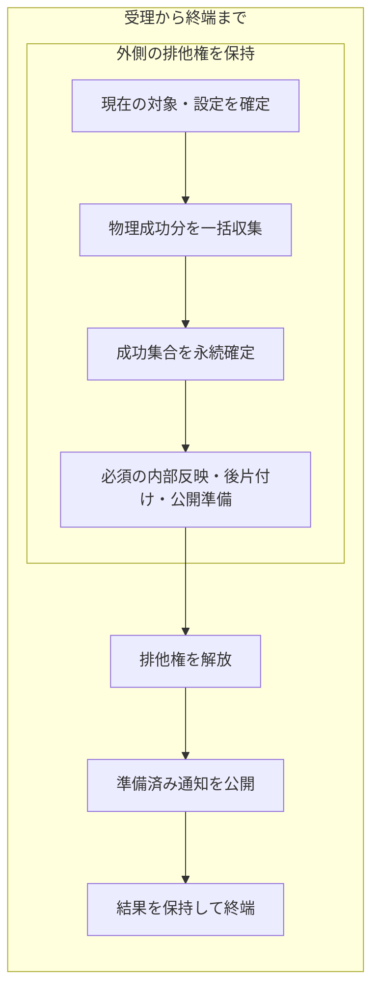
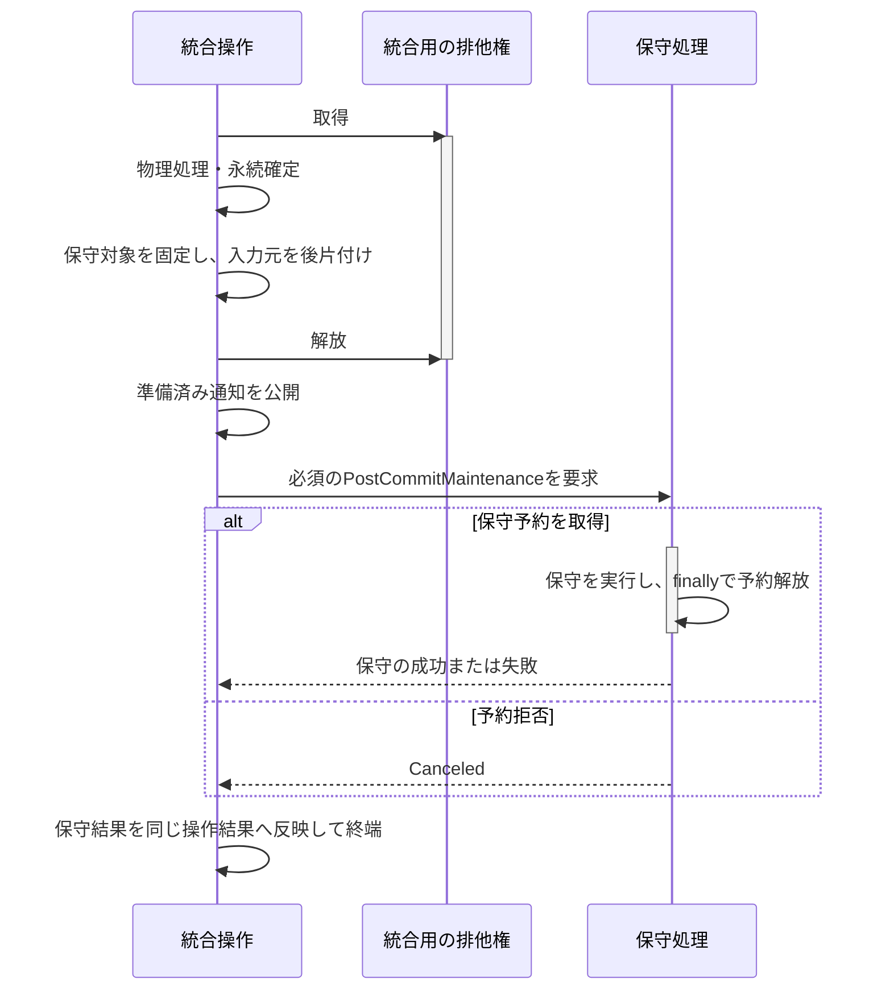

# ライブラリの変更

## 目的と適用範囲

譜面・フォルダ・パッケージを変更する操作について、確認、受付、物理処理、カタログ反映、通知の順序を定めます。ファイルとDBにまたがる失敗時の保証は[ファイルとDBの整合](file-db-consistency.md)、パスの同一性は[パスの識別と収束](../core/path-identity.md)を正本とします。

## 用語

[共通用語集](../glossary.md)を参照します。コードの識別子は原表記を使います。

| 用語 | 本資料での意味 |
| --- | --- |
| 変更セッション | 一回の操作で確認できた変更と失敗を収集し、各管理主体へまとめて反映する範囲。`LibraryMutationSession` に対応する |
| 確定した変更内容 | 物理処理や保存処理が確認した旧新の対象。`*Facts` に対応し、画面の要約件数とは区別する |
| 必須の後処理 | 正常完了に必要な索引・パッケージ状態・保守などの反映。失敗しても既に完了した永続化は取り消さない |
| 公開 | ロックを解放してから行う画面・購読者への通知。DBの確定とは区別する |

## 仕様

### 責務と操作の入口

画面操作の入口は `SelectedChartMutationWorkflowOwner`、`DuplicateMaintenanceWorkflowOwner`、`PendingPackageWorkflowOwner`、`PackageInstallWorkflowOwner` です。フォルダ名の直接編集は `RegularChartListOwner`、自動変更は `FolderAutoRenameWorkflowOwner` が管理します。`MainWindowViewModel` は画面の構成と各処理の接続を担当します。

`ChartMutationActivityOwner` の操作中表示は、モデルを変更する権限の代わりにはなりません。モデルの受付には `Lr2SynchronizationOwner` の排他権と、その排他権から発行される操作権限を使います。変更中は対象行のメニュー表示とコマンドの再入を拒否します。メニューの有効判定で、UIスレッドからファイルの存在確認を行いません。

`LibraryMutationOwner` が変更内容の集約、索引への反映、必須の後処理、公開順序を管理します。`CatalogMutationOwner` はカタログの保存と正本更新、`CatalogOwnedCollectionOwner` は所持集合と関連索引を管理します。`BMSLibrary` は公開窓口、専門キャッシュ、画面通知を接続します。共通反映の内部処理をルートへコールバックとして渡して代行させません。

### 確認と共通受付

利用者の判断が必要な場合は、画面側が物理処理の前に確認し、結果を明示的な引数としてモデルへ渡します。`BeginOperationDialogScope()` の内側に蓄積できるのは、処理結果を知らせるOKボタンだけの通知です。Yes/NoやOK/Cancelの判断をこの範囲へ持ち込まず、必要な判断が欠けた要求は失敗させます。

譜面・音源の物理変更は同じ `ChartFileOperationSynchronizer` を使います。保留一覧の削除・改名・導入、ライブラリの削除・移動・フォルダ変更、ドロップ・URL・外部APIからの自動導入を含みます。保留操作はこの共通受付に加え、背景推定と調整する既存の保留受付も取得します。

| 操作 | 受付を保持する範囲 | 競合時の扱い |
| --- | --- | --- |
| 保留パッケージの操作 | 確認・対象解決の前から終了処理まで。受理済みの自動推定との調整には保留操作の受付も使う | 確認、再生停止、保存を始めず拒否する。拒否した要求は予約・再実行しない |
| 自動導入の受付 | 入力確保前から、一要求内の全処理と未引渡し入力の回収が終わるまで | 追加要求はBusyで拒否する。一要求内の複数入力を入力順に処理し、処理間や取消後の回収中も排他権を保持する |
| URL・外部APIの通信 | 通信中は導入の受付を保持しない。取得したパスの引渡し時に導入可否を判定する | 取得成功と導入未受理を区別する。未受理を一般例外、ブラウザ起動、後日の再試行へ置き換えない |

物理変更を行うownerは、共通受付の内側で `IChartMutationPlaybackPort.StopPlaybackForMutationAsync` を待ち、現在曲と先読みの停止・デコード終了後にだけ書き込みます。変更対象のpath・フォルダと現在曲の関係は判定せず、無関係な現在曲も停止します。停止失敗・終了取消なら物理変更へ進みません。自動導入の各バッチも同じ停止境界を通ります。

変更側が既存受付をcleanupまで保持する間、再生側は新規開始を予約せず断ります。先行して受け付けた曲開始は停止側が待ちます。再生入力gateを保持した別のscopeを返したり、内側から外側のownerへ移譲したりしません。変更終了後の自動再開・先読み再登録は行いません。検索や表示順の変更だけでは再生を止めません。再生の資源寿命は[音声仕様](../runtime/audio.md#次曲一件の先行準備)を参照します。

既存のThreadStatic通知scopeは非同期停止を待った後に開き、以後の同期mutationと同期cleanupだけを同じスレッドで囲みます。通知scope内でawaitしません。

世代の切替や終了で表示を捨てる場合も受付を解放します。古い処理の終了通知で、新たな処理の排他権を解放しません。通常の変更競合は `Warn_LibraryOperationBusy`、導入の未接続・停止・取消待ちも含む受付不能は `Warn_PackageInstallUnavailable` で案内します。

### 操作単位の変更セッション

一回の利用者操作を一つの `LibraryMutationSession` とし、確認できた複数の変更を同じセッションへ追加します。単一対象も同じ経路を使います。

| 段階 | 契約 |
| --- | --- |
| 開始 | 外側の排他権を持つ操作が一回だけ開始する。対象ごとの反復中に別セッションを作らない |
| 収集 | 物理処理の成功から、変更不能なカタログ・パッケージ参照・保存対象・リソースの変更内容を作る。未処理、拒否、失敗を成功に数えない |
| 後続の判定 | 先行する物理処理で成功したハッシュと実際の導入先だけを、操作内の一時的な所有情報へ追加する。未実行予約を所持済みと見なさない |
| 確定 | 終端で変更を集約し、各管理主体の保存・索引反映・LR2同期・必須の公開準備を一回ずつ行う。別のDBまで単一の物理トランザクションにする保証ではない |
| 失敗 | 予期しない失敗では依存する後続処理を止め、確認済みの成功、失敗対象、未処理対象を同じ結果へ残す。確認済みの成功集合に対する確定は一回試みる |
| 公開 | 必須反映が成功した通知だけを準備し、排他権を解放してから公開する。補助的な先行読込みを対象数だけ起動しない |

削除と通常拡張子変更は、UIで選択とlibrary参照を固定し、既存UI共通受付を取得した後、最初の確認より前に背景処理で短命の不変要求をprepareして非同期に待ちます。フォルダ候補計算と現在値の解決をUIで同期実行しません。通常のprepared対象は不変 `ChartFile` 列で、FS存在・属性を捕捉しません。通常拡張子変更のBMS/PMS双方は一つの背景処理で順次準備し、全準備後に非同期確認へ進みます。重複hash整理の既存keeper選択と対象なし判定は共通受付前に維持します。準備例外では元原因を返して共通受付を解放し、確認・再生停止・変更処理へ進みません。選択削除と重複hash整理は `LibraryChartRemovalPreflight`、拡張子変更は固定対象と変更先拡張子を持つ `LibraryFileExtensionRenameBatch` を使います。フォルダ候補も削除対象と同じsnapshot scopeで捕捉します。確認中はモデルのguardやmutation leaseを保持せず、承認後に同じprepared値を本受付へ渡します。重複hash整理は件数確認の後、捕捉済み候補の全フォルダ確認をworkflowの非同期UI確認で済ませ、同じpreparedと明示的な承認パス列（非承認時もnullではない空列）をモデルへ渡します。件数確認の表示設定を無効にしてもフォルダ判断は行います。フォルダのNoや否定結果で閉じた場合は選択譜面だけ削除し、表示失敗・null応答・例外なら再生停止や本受付へ進まず失敗として受付を解放します。全判断の終了前にdialog scopeへ入らず、scope内の非OK判断拒否を維持します。直接モデル入口も同じprepareと実行を使い、確認後に元選択から対象を確定し直しません。

削除のprepareでは同tokenの現在値でも要求のkindとDB完全一致パスが変わっていればUnresolvedとし、物理処理・DB変更へ進めません。古い選択hashだけは許容し、現在hashを固定します。通常拡張子変更では生存tokenの現在配置への追従を維持し、削除固有の要求oldpath照合を追加しません。指定tokenが退役済みなら、共通canonical解決も移転の保存要求も別項目へ救済しません。未所持の保守計算は所持項目への再接続と区別します。

本受付後は最初のFS/DB変更より前に全固定対象のtoken・kind・固定pathの結び付きを照合します。削除はDBパスの `Ordinal`、通常拡張子変更は従来の物理パス比較を使い、renameの複数batchも全batchを先に照合します。不成立は原因と固定パスを持つ要求全体の失敗として既存failure経路へ渡します。hash・FS安全属性の履歴比較や、確認中のモデル変更を前提にした個別Stale継続は行いません。成立した対象は現在hashと現在値からDB・索引・overlay・成功factsを作り、確認した物理元パスと承認folder列を維持します。必要なFS観測は既存の実行直前処理に委ね、物理欠落・失敗の部分成功、親子削除の実観測依存、case-only配置の一回処理を維持します。通常変更の逐次前提は[ワークフローと並行性](../core/workflow-concurrency.md)、外部変更の保証範囲は[ファイルとDBの整合性](file-db-consistency.md)を参照します。項目削除と `PathCleanup` の意味は分けます。

項目削除の確定事実は所持tokenを保持し、導入済み項目の剪定でもそのtokenを厳密に照合します。同じ形式・パス・hashの別項目へ削除を広げません。内部移転の事実も同じtokenを継承するため、移転してから削除した項目を剪定できます。`PathCleanup` は所持項目の削除と区別し、従来どおりDBの完全一致パスを使って移転先保護を適用します。

`LibraryCatalogMutationFacts` と `LibraryPackageReferenceFacts` は入力列を構築時にコピーします。操作要約の件数やエラーから変更対象を再推測しません。正本への反映は非公開の `CommitCatalogSessionChanges` と `CommitInstalledSessionChanges` に限定し、呼出元は `LibraryMutationSession.Commit` だけとします。同じセッションにカタログの移転・削除と導入対象の反映を混在させた場合は失敗です。

行のパス変更通知には `LibraryStorageRowPathNotificationPolicy` を渡します。診断用の `reason` 文字列で挙動を分岐しません。操作全体の結果は `LibraryMutationSessionReceipt` を正本とします。`FileDbMutationReceipt` は、局所的な物理処理、保全、補償、確定後の後片付けに限り、その結果を集めて操作全体の確定成功と解釈しません。

#### 通常の変更ライフサイクル

受理済みの通常変更が成功する経路の順序です。物理成功分は一つの変更セッションへ収集します。外枠は論理的に追跡する操作、内枠は外側の排他権を保持する区間を表し、集合ロック・DBトランザクションの保持期間ではありません。失敗分岐は[ファイルとDBの整合](file-db-consistency.md#局所的なファイル処理と補償)、排他解放後に必須保守がある統合は[フォルダ統合](#フォルダ統合と確定後の保守)を参照します。

内部反映・後片付け・公開準備の順序は操作ごとに異なります。図の永続確定は複数の保存先を一つの原子的トランザクションにする意味ではありません。異常結果の報告は、[通知と操作結果](#通知と操作結果)に従って受付・操作中表示等も解放した後に行います。

### 排他権とロック

外側の排他権は、物理処理、カタログ反映、必須の後処理、後片付けまで保持します。対象を捕捉する短いロックは、初期化状態の読取り、保留集合の書込み、BMS集合の書込みの順で取得し、逆順に解放します。ファイルI/O、DB処理、補償、後片付け、通知に入る前に、不要な集合ロックを解放します。

入れ子の処理は、同じ生存中の排他権から明示的に渡された操作権限を検証します。別の所有者、解放済み、nullの権限は失敗です。同じスレッド、`AsyncLocal`、再入回数を権限の根拠にしません。導入からLR2同期へ続く必須処理も、別の受付を取り直す代わりにこの権限を引き継ぎます。

ロック中は `Dispatcher.Invoke`、ダイアログ、購読者、`Task.Wait`、`.Result` を待ちません。終了時の進捗、画面更新、補助タスク、報告は解放後へ渡します。中間進捗が必要な操作は、最新値だけを保持する非同期通知を使い、保留・処理中を合わせて一件に抑えます。終端前に通知を閉じ、遅れた世代の進捗を表示しません。

### 操作ごとの反映範囲

| 操作 | 確定と公開 |
| --- | --- |
| 複数譜面の削除 | 物理削除が成功した対象だけを集約する。成功したディレクトリの逆引き除去は、カタログと必須反映が成功した後に一回行う |
| フォルダの移動・名前変更、自動名前変更 | 旧新パスを操作単位で反映する。自動変更のLR2同期は確定結果と対応する所持版から変更ディレクトリ・祖先の現在BMSを捕捉して行い、呼出元で追加同期・通常更新を行わない |
| 通常譜面の拡張子修正 | `.b*` と `.p*` の処理を一つのセッションへ集める。拡張子の種類ごとに確定しない。保留のみの修正はパッケージの管理範囲に留める |
| 自動・推定先・強制・手動の導入 | 実際の導入先に対応する保存対象と導入行を一つのトランザクションで反映し、パッケージ状態、推定先の解除、保守を必須の後処理として保持する |
| リソースのみ・後片付けのみの導入 | 追加譜面が0件でも変更を保持する。必要なリソース再走査・パッケージ更新を行うが、譜面差分がなければ所持集合の版を増やさない |
| 明示的な走査 | 走査結果による全置換と、残る局所的な変更内容を区別する。局所操作を理由に全置換を省かず、逆に局所対象ごとに全保存集合を再取得しない |
| 譜面情報・文字コードなどの更新 | 保存対象と更新項目に応じて反映する。セルだけの変更で所持集合全体を再公開しない |

未利用の任意索引は構築しません。構築済みの索引は確定した旧新の変更から差分更新します。親フォルダ、重複グループ、導入推定などの専門キャッシュへの接続は残しますが、共通反映の判断は `LibraryMutationOwner` に置きます。

推定導入で実対象がなく正常にスキップした場合は、公開結果に空の変更セッション結果を含めます。内部実行票のスキップ判定は保ち、ほかの結果欠落や失敗を空の成功へ置き換えません。

内部反映と公開通知は分離します。所持集合の世代と関連索引の世代対応は内部反映で確定し、通知時に改めて世代を進めません。導入では保存対象の反映に伴うリソース健全性索引の差分を後続保守より前に適用し、保守も同じ操作の必須処理として反映してから公開します。索引反映の例外を、公開通知の例外捕捉で診断だけに変えません。

導入中の譜面解析も、譜面情報・ハッシュと派生索引の内部反映を入力変更区間内で完了させます。譜面情報索引・解析失敗警告の通知は、導入の既存通知キューへ渡して外側の排他権の解放後に公開します。

### 導入と導入先修正

導入先の採番と型衝突の検査は物理処理の前に行い、決定した実パスを保存結果とパッケージ状態に共通して使います。永続化前の準備では保存用のコピーを作り、liveな `PackageChartEntry` の現在値や所持共通現在値のパスを一時的に差し替えません。DBと所持集合の確定後に、成功対象だけの共通現在値を捕捉して安定した項目へ渡します。新しい所持tokenを共有し、同じ項目の排他境界で現在値・導入状態を反映します。通知は項目の排他を解放し、既存の操作単位の延期境界を終えてから公開します。

後続パッケージの分類に使う一時情報へ追加するのは、先行する物理処理の成功だけです。失敗、取消、未処理、推定先の解除は所持成功に加えません。開始前に欠落を確認した入力は失敗として保持し、独立した後続パッケージを処理できます。コピー開始後の入力消失は予期しない物理処理の失敗であり、依存する後続を止めます。

リソース上書きの成功件数は、物理準備だけでなくカタログと必須反映の完了で確定します。後片付けだけの失敗は確定成功を取り消しません。推定先の状態更新と `PackageChartEntry.PropertyChanged` の公開は分け、公開は排他権の解放後に行います。

導入先修正は、選択した譜面だけを対象とし、兄弟ファイル、リソース、親フォルダを便乗して処理しません。選択対象を除く既存所持情報を一回捕捉し、物理移動の成功を後続判定へ反映します。承認済みの重複削除も同じセッションへ追加します。確定後は確定後の共通現在値から保守対象を生成し、同じ外側の予約の内側で `forceUpdate: true` の保守を一回行います。

### フォルダ統合と確定後の保守

フォルダ統合は変更一件のセッションです。入力元が欠落している場合は索引取得より前に終了します。共通のパッケージ処理で全体の導入先と型衝突を確認し、物理処理の成功からカタログ・パッケージの変更を追加します。統合先の走査と逆引きの置換も集約し、リソースだけの統合を落としません。

後続の保守対象は、カタログの共通現在値を同じ所持tokenで移転した後、入力元の後片付けより前に固定します。入力元の削除は永続確定後です。統合用の排他権を解放してから、既存の保守予約を取り直し、`forceUpdate: true`、`DeferOnUpdates`、`merge_folder` の条件で保守します。

この保守は論理的には同じ操作の必須処理 `PostCommitMaintenance` です。例外や予約拒否による `Canceled` も同じ結果の `FinalizationFailure` に残します。`MergeApplied` と永続確定成功を取り消しませんが、画面は通常の完全成功として報告しません。第二の変更セッションや別の成功報告は作りません。

#### 統合用の排他権と必須保守の寿命

統合が適用された後の順序と、排他の持ち替えを示します。縦の活性区間はそれぞれの排他権・予約の保持期間で、左の操作は保守の結果まで追跡します。通知済みであることを完全成功の判定に使いません。

保守失敗時も `MergeApplied` と永続確定成功は維持し、`FinalizationFailure` を含む結果を完全成功として報告しません。

### 削除対象と部分失敗

削除の成功は、対象に対する削除APIが成功を返した事実で確認します。未実行対象の存在確認がfalseであるだけでは成功にしません。ディレクトリ削除が途中で例外になった場合、全体を成功扱いせず、追加走査でカタログ削除を推測しません。DBの失敗で、確認済みの物理削除が起きなかったことにはしません。

通常フォルダで親子を同時に削除する場合は、親の再帰削除が依存する子を事前に記録します。全ての子の削除が成功した場合だけ親を再帰削除します。子が失敗・未処理なら、親の選択譜面を個別に処理し、親の再帰削除で失敗した子を再試行しません。独立した兄弟の処理は続けられます。選択されていない子孫は巻き込みません。

保留パッケージのフォルダ全体削除には、次の全条件が必要です。

- ディレクトリ単位のパッケージである。
- 入れ子のBMSONを含む、残存する全譜面が選択されている。
- フォルダ全体を削除する設定が有効である。

対象は `ChartPackage.path` のフォルダそのものです。単一ファイルのパッケージは、この条件を満たしたように見えても親を削除しません。一部選択または設定無効では選択ファイルだけを削除します。全体削除が失敗した場合は、選択譜面を失敗として数え、ディレクトリのエラーを一件残します。個別削除へ切り替えず、パッケージの所属と導入行を保持します。OSが行った部分削除の原子性までは保証しません。

### 保留入力と登録ルート

保留へ加える入力は、LR2設定または単独動作の検索対象に登録されたルートとの包含関係を検査します。登録ルート自身とその配下は、未索引でもドロップ後の自動導入・保留追加の対象から除きます。外側の独立した兄弟は受け入れます。単純な文字列前方一致では判定しません。

導入テーブルの読込み時も、登録ルートに入った行を保留公開より前に除きます。除去するのは導入行であり、ファイルやカタログではありません。これは継続監視ではなく、登録ルート変更後の再評価には再起動または全体の再初期化が必要です。通常の差分更新やプレイリスト更新で同じ再評価を行う保証はありません。登録ルートを内包する外側のパッケージや、既存範囲を越えた再解析ポイントの追跡は対象外です。

保留中の旧形式の操作対象を解決する場合も、確認前に対象件数分だけ捕捉し、排他権の内側でパス・所属・種類・安全性を検証します。全保留集合の再取得を対象ごとに行いません。

### 譜面情報の保存

補完解析と導入時解析は `ApplyChartInfoStorageWrite(CatalogChartInfoStorageWriteRequest)` を共用します。保存用のコピーまたは限定した投影、`chart_digest_map`、`chart_info`、解析失敗の追加・削除を同じカタログトランザクションへ渡します。

全件補完では、パスとMD5が一致する既存BMS行の譜面情報由来の9列だけを更新します。基本列、`mode`、`judge`、利用者の列を更新せず、欠落行を挿入しません。BMSONからLR2の `song` 行を作りません。保存行を伴わない解析失敗の削除には、変更内容だけを扱う `ApplyChartInfoWrite` を使います。

永続化が成功してから同じ所持tokenの共通現在値、ハッシュ、索引、警告を更新します。失敗時は未反映の対象を次回の候補として残します。`PrepareOwnedChartDigestPublication` で変更内容を一回組み立て、依存索引へ適用した同じ内容の公開処理を返します。譜面情報索引の更新とハッシュ変更範囲の解放後に公開し、公開時に内容を再計算しません。

### 起動時のLR2日時修正

`NormalizeSongTable` は、既存のフォルダ走査中に、修正候補のカタログ識別条件、表示用パス、観測した日時を一回捕捉します。この走査中にダイアログ、ファイル変更、追加の全表走査を行いません。

初期の排他権を解放してから利用者へ確認し、承認した候補だけを第二の短い排他権で処理します。`Lr2FolderExistingRowLookup.QueryExactPaths` で候補の元パスに完全一致する行だけを取得し、識別条件、存在、日時の完全一致を再検証します。差替え、消失、日時変更なら変更しません。必要な処理サービスの欠落は明示的な失敗とし、無関係なパスの日時調査や全行辞書を追加しません。

### 通知と操作結果

必須反映が成功した通常通知だけを公開予定へ加えます。公開処理は排他権の解放後に一回実行し、購読者ごとの例外を診断して他の通知を続けます。通知失敗は確定済みの結果を変えず、処理を再実行しません。

自動フォルダ名変更の中間進捗購読者が例外を投げても、通知失敗として診断して変更処理を続けます。本体が成功した場合は成功終端を公開してアイドルへ戻り、進捗通知の失敗を変更失敗へ変換しません。

保留・自動導入の情報通知は、ダイアログ範囲を閉じて `FileDbMutationReport.ShowOperationMessagesAsync` へ渡します。一列の通知は順番に表示しますが、導入処理は表示完了を同期的に待ちません。失敗した表示が後続の通知を止めず、確認の代替にもなりません。

操作の異常結果は、排他権、受付、操作中表示、ダイアログ範囲を解放した後に一度だけ報告します。完全成功は原則無通知、後片付けだけの失敗は警告、未確定・必須反映失敗・未確認対象を含む結果はエラーです。削除専用の `LibraryChartRemovalReport` との二重報告を避け、導入先修正に含まれる承認済み削除を別操作として報告しません。

報告では成功した変更数を使い、ファイル数へ読み替えません。確認候補のパスは最大3件・各240文字、例外は最大3件・各400文字、本文は4096文字までとします。候補は存在確認済みの回復場所とは限りません。詳細は診断へ残しますが、表示や診断の失敗で本来の結果を上書きしません。

入力前の型衝突は専用の案内として先頭5件と残件数を表示し、全件を診断します。実行中の例外を型名だけで事前拒否へ丸めません。部分成功を表示するのは永続確定した成功がある場合だけです。

## 実装とテストの対応

| 仕様項目・主な条件 | 実装箇所 | テスト箇所・確認内容 |
| --- | --- | --- |
| 操作の排他、確認、通知解放 | [`SelectedChartMutationWorkflowOwner`](../../../BeMusicSeeker/ViewModels/ChartOperations/SelectedChartMutationWorkflowOwner.cs)、[`LibraryFileOperationSynchronization`](../../../BeMusicSeeker/Models/BmsLibraryInternal/FileOperations/LibraryFileOperationSynchronization.cs) | [`SelectedChartMutationWorkflowOwnerTests`](../../../BeMusicSeeker.Tests/ChartOperations/SelectedChartMutationWorkflowOwnerTests.cs)、[`BmsLibraryMutationBoundaryTests`](../../../BeMusicSeeker.Tests/Library/BmsLibraryMutationBoundaryTests.cs)、[`ChartMutationActivityOwnerTests`](../../../BeMusicSeeker.Tests/ChartOperations/ChartMutationActivityOwnerTests.cs) |
| 保留導入の確認前受付と、成功・失敗・取消後の解放 | [`PendingPackageWorkflowOwner`](../../../BeMusicSeeker/ViewModels/Install/PendingPackageWorkflowOwner.cs) の `TryEnterPendingOperation` / `InstallPackagesAsync` | [`PendingPackageWorkflowOwnerTests`](../../../BeMusicSeeker.Tests/Install/PendingPackageWorkflowOwnerTests.cs) の `PendingInstall_RejectsDropDuringConfirmationAndReleasesAdmission`。手動・強制の成功／実行失敗と、手動の確認取消で、確認中のドロップ拒否、拒否した要求の無副作用・再実行なし、終端後の新規受付を確認する。 |
| 自動導入の受付から一要求の全処理の終了まで、競合する保留導入を拒否 | [`PackageInstallWorkflowOwner`](../../../BeMusicSeeker/ViewModels/Install/PackageInstallWorkflowOwner.cs) の `TryEnqueue`、[`PendingPackageWorkflowOwner`](../../../BeMusicSeeker/ViewModels/Install/PendingPackageWorkflowOwner.cs) の `InstallPendingAsync` / `InstallPackagesAsync` | [`PendingPackageWorkflowOwnerTests`](../../../BeMusicSeeker.Tests/Install/PendingPackageWorkflowOwnerTests.cs) の `DropInstall_RejectsPendingInstallUntilAcceptedMultipleInputsFinish`（手動／強制 × 選択行要求／パッケージ要求）。実行開始前と処理中の拒否、追加要求の拒否、一要求内の複数入力、全処理後の通知時の受付解放を確認する。 |
| 自動導入のBusy拒否と、所有する未引渡し入力の回収 | [`PackageInstallWorkflowOwner`](../../../BeMusicSeeker/ViewModels/Install/PackageInstallWorkflowOwner.cs) の `TryEnqueue` | [`PackageInstallWorkflowOwnerTests`](../../../BeMusicSeeker.Tests/Install/PackageInstallWorkflowOwnerTests.cs) の `Enqueue_RejectsBusyBeforeQueueingThenRunsAfterRelease` は未受理要求を予約せず、解放後の新規要求だけを実行することを確認する。`GateBusy_AbandonsOwnedIngressWithoutCallingInstaller` は所有する一時入力の回収と導入未実行を確認する。 |
| 取消・終了時の受付保持と解放、世代切替後の新規実行 | [`PackageInstallWorkflowOwner`](../../../BeMusicSeeker/ViewModels/Install/PackageInstallWorkflowOwner.cs) の `CancelAll` / `RequestShutdown` / `AttachLibrary` | [`PackageInstallWorkflowOwnerTests`](../../../BeMusicSeeker.Tests/Install/PackageInstallWorkflowOwnerTests.cs) の `RequestShutdown_AfterPhysicalInsertionDrainsRequestWithoutPrivateLockCoordination` は終了要求後の未引渡し入力回収、`CancelAll_AfterPhysicalInsertionCannotCancelFreshPostDrainAdmission` は回収中の受付保持と、回収後の新規要求の実行、`GenerationReplacement_BusyRequestFailsFastThenFreshRequestRunsAfterRelease` は世代切替中の拒否と旧処理終了後の新規実行を確認する。 |
| URL・外部APIの通信成功と導入未受理を分離 | [`PlaylistWorkspaceViewModel`](../../../BeMusicSeeker/ViewModels/Playlist/PlaylistWorkspaceViewModel.PlaylistUrlAcquisition.cs) の `QueuePlaylistUrlInstallPathsAsync` → [`PackageInstallWorkflowOwner`](../../../BeMusicSeeker/ViewModels/Install/PackageInstallWorkflowOwner.cs) の `Enqueue` | [`PlaylistUrlAcquisitionOwnershipTests`](../../../BeMusicSeeker.Tests/Playlist/PlaylistUrlAcquisitionOwnershipTests.cs) の `DownloadedPackages_BusyHandoffWarnsWithoutFallbackOrReplay`（`single`: 単発URL、`url`: 本体URL、`diff`: 差分URL、`api`: 外部API）。通信中のライブラリ変更を許可し、引渡し時のBusyだけを警告する。導入、ブラウザへの切替、自動再実行、取得済み入力の削除を行わないことを確認する。 |
| 情報通知の表示順と、表示失敗後の継続 | [`FileDbMutationReport`](../../../BeMusicSeeker/ViewModels/ChartOperations/FileDbMutationReport.cs) の `ShowOperationMessagesAsync` | [`FileDbMutationReportTests`](../../../BeMusicSeeker.Tests/ChartOperations/FileDbMutationReportTests.cs) の `OperationMessages_PreserveOrderAndContinueAfterDisplayFailure` は先行表示の完了待ちと、表示失敗後も後続通知へ進む順序を確認する。`ReporterFailureDoesNotAlterFactsOrRetry` は異常結果の表示失敗でも確定内容・元の原因を変えず、再報告しないことを確認する。 |
| 情報通知の待機・失敗を導入結果や必須処理の失敗に混ぜない | [`PackageInstallWorkflowOwner`](../../../BeMusicSeeker/ViewModels/Install/PackageInstallWorkflowOwner.cs) の終了処理、[`PendingPackageWorkflowOwner`](../../../BeMusicSeeker/ViewModels/Install/PendingPackageWorkflowOwner.cs) の `SearchPackagesAsync` | [`PackageInstallWorkflowOwnerTests`](../../../BeMusicSeeker.Tests/Install/PackageInstallWorkflowOwnerTests.cs) の `OperationDialogs_AreDispatchedWithoutBlockingQueueOrChangingMutationResult` は表示前の導入終端・受付解放と表示失敗後の成功保持を確認する。[`PendingPackageWorkflowOwnerTests`](../../../BeMusicSeeker.Tests/Install/PendingPackageWorkflowOwnerTests.cs) の `SearchPackagesAsync_EndActivityFailureStillDetachesAndDispatchesDialogScope` は終了処理の失敗でも通知を引き渡すこと、`SearchPackagesAsync_PreservesRequiredFailuresButDoesNotPromoteNotificationFailure` は元の変更・終了処理の失敗だけを保持することを確認する。 |
| 自動導入の必須反映失敗も、受付解放後に型付き結果で通知 | [`PackageInstallWorkflowOwner`](../../../BeMusicSeeker/ViewModels/Install/PackageInstallWorkflowOwner.cs) の終了処理 | [`PackageInstallWorkflowOwnerTests`](../../../BeMusicSeeker.Tests/Install/PackageInstallWorkflowOwnerTests.cs) の `DurableFinalizationFailure_PublishesTypedCompletionWithoutRegisteredPackages`（更新抑制の終了処理の例外あり／なし）。登録パッケージが空でも確定済みの結果を保持し、完了通知・終了処理失敗の通知時に受付を解放していることを確認する。 |
| 複数対象の移動・削除・拡張子変更、反映回数と永続結果 | [`LibraryMutationOwner`](../../../BeMusicSeeker/Models/Library/BMSLibrary.LibraryMutationOwner.cs) | [`BmsLibraryFolderRenameRefreshTests`](../../../BeMusicSeeker.Tests/Maintenance/BmsLibraryFolderRenameRefreshTests.cs) の `RenameIngress_CapturesOnlyLocalBmsRangeFacts`（BMS局所範囲と手動・自動の両終端）、[`BmsLibraryCatalogRelocationTests`](../../../BeMusicSeeker.Tests/Catalog/BmsLibraryCatalogRelocationTests.cs)、[`OwnedChartCollectionLibraryMutationTests`](../../../BeMusicSeeker.Tests/Catalog/OwnedChartCollectionLibraryMutationTests.cs) の `RemoveLibraryCharts_ParentDeletionDependsOnObservedChildResult`、`RemoveLibraryCharts_PublishesOneResourceGenerationForConfirmedFoldersOnly`、`RemoveLibraryCharts_TwoWarmOperationsPreserveRemainingOwnersWithoutFullRebuild`、[`BmsLibraryLibraryFileOperationsServiceTests`](../../../BeMusicSeeker.Tests/FileOperations/BmsLibraryLibraryFileOperationsServiceTests.cs) |
| 導入時の先行成功、欠落と途中失敗、リソースのみの処理 | [`BmsLibraryPackageInstallService`](../../../BeMusicSeeker/Models/BmsLibraryInternal/Install/BmsLibraryPackageInstallService.cs) | [`BmsLibraryPackageInstallServiceTests`](../../../BeMusicSeeker.Tests/Install/BmsLibraryPackageInstallServiceTests.cs)、[`PendingPackageWorkflowOwnerTests`](../../../BeMusicSeeker.Tests/Install/PendingPackageWorkflowOwnerTests.cs)。`ManualInstallPackagesAsync_NoEstimatedDestinationsCompletesWithEmptyReceiptAndPreservesPendingSources` は、実入口の正常スキップ結果と保留パッケージ・元ファイルの保持を確認する。 |
| 導入・譜面解析の通知前反映と排他解放 | [`LibraryMutationOwner`](../../../BeMusicSeeker/Models/Library/BMSLibrary.LibraryMutationOwner.Common.cs)、[`BMSLibrary`](../../../BeMusicSeeker/Models/Library/BMSLibrary.PackageInstall.cs) | [`BmsLibraryPackageInstallServiceTests`](../../../BeMusicSeeker.Tests/Install/BmsLibraryPackageInstallServiceTests.cs) の `UsesPreflightDestinationAndWarmDelta` を含む自動・推定先・強制導入テスト。各通知で構築を起こさず索引の現在性を確認し、別の変更予約を取得できることを検査する。譜面解析のハッシュ更新・保存失敗は [`OwnedChartCollectionInlineDigestTests`](../../../BeMusicSeeker.Tests/Catalog/OwnedChartCollectionInlineDigestTests.cs) と [`ChartInfoBackfillStorageTests`](../../../BeMusicSeeker.Tests/ChartInfo/ChartInfoBackfillStorageTests.cs) で確認する。 |
| 統合、型衝突、確定後保守の失敗、元の欠落 | [`DuplicateMaintenanceWorkflowOwner`](../../../BeMusicSeeker/ViewModels/Maintenance/DuplicateMaintenanceWorkflowOwner.cs) | [`BmsLibraryDuplicateServiceTests`](../../../BeMusicSeeker.Tests/Maintenance/BmsLibraryDuplicateServiceTests.cs) の `MergeChartDirectory_RechecksResourcesAfterReleasingMutationReservation`（BMS/BMSONの成功、共通DB失敗、予約拒否）、[`DuplicateMaintenanceWorkflowOwnerTests`](../../../BeMusicSeeker.Tests/Maintenance/DuplicateMaintenanceWorkflowOwnerTests.cs) |
| 保留の全体削除・一部削除、入力の所属と安全性 | [`PendingPackageWorkflowOwner`](../../../BeMusicSeeker/ViewModels/Install/PendingPackageWorkflowOwner.cs) | [`BmsLibraryPendingLegacyMutationTests`](../../../BeMusicSeeker.Tests/Install/BmsLibraryPendingLegacyMutationTests.cs)、[`PendingPackageWorkflowOwnerTests`](../../../BeMusicSeeker.Tests/Install/PendingPackageWorkflowOwnerTests.cs)、[`MainWindowPendingPackageMutationViewTerminalTests`](../../../BeMusicSeeker.Tests/MainWindow/MainWindowPendingPackageMutationViewTerminalTests.cs) |
| カタログの保存と譜面情報の確定後反映 | [`CatalogMutationOwner`](../../../BeMusicSeeker/Models/BmsLibraryInternal/Catalog/CatalogMutationOwner.cs) | [`CatalogMutationOwnerTests`](../../../BeMusicSeeker.Tests/Catalog/CatalogMutationOwnerTests.cs)、[`ChartInfoInlineHydrationTests`](../../../BeMusicSeeker.Tests/ChartInfo/ChartInfoInlineHydrationTests.cs)、[`ChartInfoBackfillStorageTests`](../../../BeMusicSeeker.Tests/ChartInfo/ChartInfoBackfillStorageTests.cs) の `BackfillChartInfos_TransactionFailureDoesNotPublishCanonicalDigestSongOrIndex`、`BackfillChartInfos_LaterChunkFailureKeepsEarlierPublicationAndDoesNotPublishFailedChunk`。失敗したchunkを公開せず、先行確定分だけを保持する。 |
| 終端の分類・件数・確認候補、表示失敗と多言語通知 | [`FileDbMutationReport`](../../../BeMusicSeeker/ViewModels/ChartOperations/FileDbMutationReport.cs) | [`FileDbMutationReportTests`](../../../BeMusicSeeker.Tests/ChartOperations/FileDbMutationReportTests.cs)、[`LocalizationResourceParityTests`](../../../BeMusicSeeker.Tests/Localization/LocalizationResourceParityTests.cs) |
| 自動フォルダ名変更の承認、進捗、成功・失敗の終端 | [`FolderAutoRenameWorkflowOwner`](../../../BeMusicSeeker/ViewModels/Maintenance/FolderAutoRenameWorkflowOwner.cs) | [`FolderAutoRenameWorkflowOwnerTests`](../../../BeMusicSeeker.Tests/Maintenance/FolderAutoRenameWorkflowOwnerTests.cs)。`SelectedRequest_IntermediateProgressSubscriberFailureStillCompletesAndReturnsIdle` は、中間進捗の通知失敗後も処理・成功終端・アイドル復帰が続くことを確認する。 |
| 譜面削除の部分成功と異常報告 | [`LibraryChartRemovalReport`](../../../BeMusicSeeker/ViewModels/ChartOperations/LibraryChartRemovalReport.cs) | [`LibraryChartRemovalReportTests`](../../../BeMusicSeeker.Tests/ChartOperations/LibraryChartRemovalReportTests.cs) |

削除対象の事前照合は [`OwnedChartCollectionLibraryMutationTests`](../../../BeMusicSeeker.Tests/Catalog/OwnedChartCollectionLibraryMutationTests.cs) の `RemoveLibraryCharts_PreflightChecksCapturedKindAndExactPathButAllowsOldHash` が確認します。`PreparedRequests_RejectRetiredTargetBeforeAnyPhysicalOrCatalogMutation` は不成立な後方対象でも削除の先行対象とrenameの先行batchを全変更前に止め、原因・FS/DB/current/索引・通知の無変更と受付解放を確認します。`PreparedRename_UsesCurrentDigestAndFixedSourceWithoutHashHistoryComparison` は旧prepared MD5/SHA-256を持っても、固定元パスで処理しcurrentのhashをDB・current・索引へ維持する実接続を確認します。共通token解決は [`OwnedChartTokenTests`](../../../BeMusicSeeker.Tests/Catalog/OwnedChartTokenTests.cs) の `CanonicalRoots_RejectRetiredTokenButKeepTokenlessExactPath` と内部移転・参照退役の試験が二つのroot、退役token、tokenなしDB完全一致と一般物理比較を分担します。pendingの属性・late missingは [`BmsLibraryPendingLegacyMutationTests`](../../../BeMusicSeeker.Tests/Install/BmsLibraryPendingLegacyMutationTests.cs) の既存境界へ分担します。

`SelectedChartMutationWorkflowOwnerTests.DeleteAsync_PrepareKeepsDispatcherResponsiveAndRetainsCopiedInput` は実Dispatcherから通常削除を開始し、準備待機中のUI応答・共通受付保持・コピー済み入力と、準備例外時の元原因・未実行・解放を確認します。このstore代替試験はワークフローの順序を担い、FS/DBと対象結び付きの保証は以下の実store試験へ分担します。

最初の確認から同じprepared値を渡す本番接続は [`SelectedChartMutationWorkflowOwnerTests`](../../../BeMusicSeeker.Tests/ChartOperations/SelectedChartMutationWorkflowOwnerTests.cs) の `PreparedTargets_RealStorePreservesFirstConfirmationBoundary` が実store・小実DBで削除の古いhash許容／確認取消と、通常拡張子変更のprepare前移転追従を確認します。重複整理の共通gate・本モデル受付Busyと解放は [`DuplicateMaintenanceWorkflowOwnerTests`](../../../BeMusicSeeker.Tests/Maintenance/DuplicateMaintenanceWorkflowOwnerTests.cs) の `RunHashCleanupAsync_RealPreparedTargetsKeepGateAndModelAdmission` に分担します。`RunHashCleanupAsync_WholeFolderDecisionUsesPreparedRealStore` は実store・小実DBでYes／No／否定close、候補部分集合だけの承認、モデル再確認なし、確認中の短期モデル受付を確認します。`RunHashCleanupAsync_WholeFolderFailureDoesNotStartMutation` は複数候補の先行Yes後でも後続の表示失敗・null応答・例外で実行しないことを確認します。`BmsLibraryMutationBoundaryTests.OperationDialogScope_RejectsPreparedRemovalWithoutExplicitFolderDecision` は実候補のdirect入口で非OK拒否を維持します。既存の `RunFolderMergeAsync_AwaitsConfirmationWithoutBlockingCaller` は確認待機中の共通gate取得失敗・別要求の拒否・store未実行と解放後の再取得を確認します。既存のscope、再生停止、取消、部分成功、解放後報告はprepared境界へ追従させて維持します。

## 関連資料

[共通の並行処理](../core/workflow-concurrency.md)、[導入推定](install-estimation.md)、[ドロップ導入](drop-install.md)、[操作単位で集約する設計判断](../../decisions/library-mutation-session.md)、[反映回数の診断](../core/performance-and-scale.md)を参照します。
