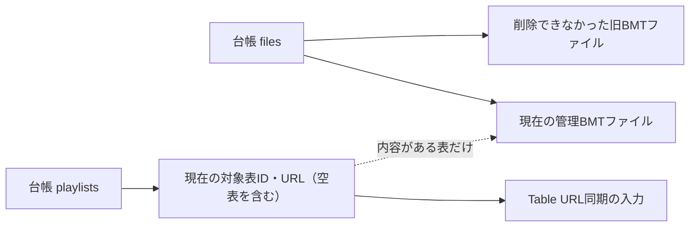
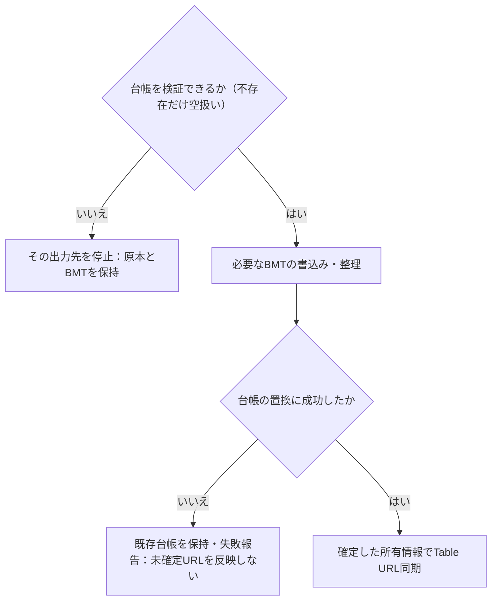

# beatoraja向けBMT出力

## 目的と適用範囲

プレイリストのBMTファイル、管理台帳、beatorajaのTable URL登録を定めます。LR2連携の有無には依存しません。

## 用語

[共通用語集](../glossary.md)を参照します。コードの識別子は原表記を使います。

## 仕様

### 有効条件と場所

`EnableBeatorajaBmtOutput` が有効で、ルートに `config_sys.json` と `beatoraja.jar` または `beatoraja.exe` がある場合に出力します。出力先は `tablepath` から求め、相対ならbeatorajaルートを基準にします。派生値の `BeatorajaBmtTablePath` は画面から直接編集しません。プレイヤーとスコアDBも同じルートの `playerpath` と選択IDから求めます。

対象は `is_bmt_output=true` の表です。全出力では対象外の管理ファイルとURLを除きます。これは、全体設定を無効にしたとき既存出力を残す `KeepBeatorajaBmtFilesWhenOutputDisabled` とは別です。

### 形式とハッシュ

BMTはgzip圧縮したUTF-8 JSONです。URLのSHA-256に `.bmt` を付けたファイル名を使います。

| 項目 | 内容 |
| --- | --- |
| `url` | 外部表はページURL、なければ絶対ヘッダーURL。ローカル表は `bemusicseeker://playlist/{playlist_id}`。 |
| `name` / `tag` | 表名と、tag・symbol・互換接頭辞の順に解決したタグ。 |
| `folder` | 有効な譜面を持つフォルダだけ。外部表の名前は解決したタグ＋互換レベル、ローカル表は既存名。 |
| `course` | 元ヘッダーのコースをbeatorajaの形へ変換する。制約を `MIRROR`、`GAUGE_LR2`、`LN` 等へ対応させ、検証条件に合わないトロフィーは除く。 |

譜面にはタイトルとMD5/SHA-256の少なくとも一方が必要です。対応範囲で `artist`、`url`、`appendurl`、`ipfs`、`appendipfs`、`org_md5` を出します。コースのハッシュは元ヘッダーの値だけを使います。

| `BeatorajaBmtHashOutputMode` | 譜面のハッシュ出力 |
| --- | --- |
| `Original`（既定） | DBに保存された値だけ。 |
| `FillMissingMd5Sha256` | 保存値を優先し、選択された照合キーで所持譜面・譜面情報を解決できる場合だけ不足する対の値を出力上で補う。 |
| `PreferSha256Only` | SHA-256を出せる場合はMD5を省く。解決できないMD5行は落とさずMD5で出す。 |

MD5とSHA-256が別譜面を指す場合はMD5を正本とし、危険な対の補完をしません。補完値を元DBへ書き戻しません。フォルダとコースが両方空ならBMT本体は出しませんが、対象表としてのURL所有権は台帳に残します。

### 順序と出力契機

表の順序は `bmt_sort` 昇順です。未正規化の同値・欠損は名前とIDで解消します。順序だけの変更はURL同期だけを行い、BMT本体を書き直しません。個別出力可否の変更はその表だけを出力・削除します。

起動・`ReloadTables`・復元では譜面読込みと遅延外部同期の完了後、現在のプロファイルとDBの全対象へ揃えます。表が0件でも不要な管理ファイルを整理します。外部更新の既知変更・ハッシュ初期化、ローカル保存、譜面行保存、BMT内容に影響するプロパティ変更では対象を出力します。

LR2出力先、ルート型、LR2出力種類だけの変更ではBMTを予約しません。BMTの有効状態・出力先変更は全出力と旧先の整理を行いますが、無効化時の保持設定が有効ならファイル・台帳・URLを残します。ハッシュ出力モードだけの変更は即時再出力せず、次の通常出力時に反映します。表削除はその表の管理ファイルとURLだけを外します。

全出力の進捗は実際に内容を生成・圧縮する表を対象にします。未変更で生成0件、整理・URL同期だけの場合に架空の0/1進捗を出しません。

### 管理台帳と未変更判定

出力先直下の `.bemusicseeker-bmt-manifest` を使い、`.json` は付けません。`files` は物理ファイルの所有、`playlists` は表IDとURLの所有を示します。表名、ヘッダー・データハッシュ、更新日時ticks、出力に関係する入力の指紋、実ファイル名・更新時刻・サイズを保持します。

スキーマ版2ではこれらが一致する場合、内容生成とgzip書込みを省略します。指紋はタグ解決結果、外部同期扱い、互換接頭辞、フォルダ順、コースJSONを含みます。所持索引によるハッシュ解決結果だけの変化は無効化条件にしません。旧 `contentHash` は使わず、旧台帳のファイル・URL所有情報を保持して通常出力で現行形式へ移します。

空表はURLだけを記録し、有効な内容が得られたら同じIDへファイルを付けます。URL変更でファイル名が変わる場合は、新しいものを管理し、他表が参照しない旧ファイルを整理します。同名ファイルは管理外でも上書きし、それ以後管理対象にします。

#### ファイルとURLの所有を分ける

台帳内の所有関係を示します。矢印は所有・登録元の参照であり、書込み順ではありません。表が空であることやファイル削除の失敗だけでは、ファイル所有とURL所有が同じ状態になるとは限りません。

### 整理と失敗

削除するのは台帳にあるBMTだけで、管理外ファイルを走査して削除しません。全出力では別プロファイル由来も含め現在集合へ揃えます。`files` は現在ファイルに加え削除できなかった旧ファイルを保持し、`playlists` は現在の対象へ更新します。全削除の部分失敗ならURL所有権を空にし、未削除ファイルを残します。出力先変更後の旧先は自動回収せず、残留を通知します。

`RemovedCount` は削除完了件数で、不存在も含みます。失敗、共有参照により残したもの、台帳自体の削除は含みません。存在確認のfalseを削除成功とみなさず、削除操作の結果で判定します。

台帳は同じディレクトリの一時ファイルから置換し、失敗時は既存内容を保持します。直接上書きへ切り替えません。台帳がない場合だけ空と扱い、読取不能、構文破損、不正構造、非対応版は原本とBMTを保持してその出力先を停止します。検証は新規BMT作成より先で、一部だけを救出しません。

| 台帳入力 | 許可条件 |
| --- | --- |
| 最上位 | オブジェクト。`files` 配列は必須、`playlists` オブジェクトは省略可能。 |
| `schemaVersion` | 省略なら0、明示する場合は整数0・1・2。 |
| ファイル名 | 非空の出力先直下BMT名。パス成分を勝手に切り捨てず、不正なら拒否する。大小文字を無視して重複をまとめる。 |
| 表の要素 | 非空キー、オブジェクト値、非空URL。`file` の省略・null・空文字はURLのみ。参照ファイルも物理台帳へ含める。 |
| その他 | 重複プロパティは拒否。未知の追加情報は許可。既知の任意項目は省略・nullを許すが値があれば宣言した型が必要。`exporterVersion` の違いは未変更判定の不一致であり、非対応スキーマではない。 |

部分削除・読取り・保存失敗は対象と原因を変更不能な結果へまとめ、出力ロックと台帳ロックを抜けてから既存のプレイリスト通知へ渡します。元の `AsyncLocal` セッションが終わっていても通知します。台帳保存前に変更したBMTを戻す複数ファイルのトランザクションや、永続的な再試行キューは持ちません。

#### 台帳確定とURL公開の順序

矢印は出力先一つの処理順です。ファイル変更、台帳置換、beatoraja設定へのURL反映は一括トランザクションではありません。

### Table URL同期

URL同期は確定した台帳の所有情報から行い、物理書込み・削除0件でも省略しません。台帳の読取り・保存に失敗した操作では、未確定のURL所有権を反映しません。

`RegisterBeatorajaBmtUrls` が有効なら、既存配列から前回の管理URLを除き、管理外URLの順序を先頭側に保って、現在の管理URLをBMT順で末尾へ追加します。空表のURLも管理対象です。現在の表一覧に見つからない台帳要素は既知の表の後ろへ名前・ID順で並べます。登録設定が無効なら前回管理URLを外します。

beatorajaの登録URL取込みでは成功・既存一致した表を元URL順でBMT順の先頭へ反映します。失敗URLは管理外として残します。詳細は[Table URL取込み](table-url-import.md)を参照します。

## 実装とテストの対応

| 仕様項目・主な条件 | 実装箇所 | テスト箇所・確認内容 |
| --- | --- | --- |
| 形式・ハッシュ・空表・未変更判定・台帳破損・削除失敗 | [`BmtTableExportService`](../../../BeMusicSeeker/Models/Playlist/BmtTableExportService.cs) | [`BmtTableExportServiceTests`](../../../BeMusicSeeker.Tests/Playlist/BmtTableExportServiceTests.cs) |
| 出力予約・URL同期・0件・通知の寿命 | [`BMSPlaylist`](../../../BeMusicSeeker/Models/Playlist/BMSPlaylist.cs) | [`BmsPlaylistCustomFolderOutputTests`](../../../BeMusicSeeker.Tests/Playlist/BmsPlaylistCustomFolderOutputTests.cs)、[`BmsPlaylistMigrationAndRegistrationTests`](../../../BeMusicSeeker.Tests/Playlist/BmsPlaylistMigrationAndRegistrationTests.cs) |
| 順序と一括編集 | [`PlaylistWorkspaceViewModel`](../../../BeMusicSeeker/ViewModels/Playlist/PlaylistWorkspaceViewModel.cs) | [`PlaylistSummaryBulkEditTests`](../../../BeMusicSeeker.Tests/Playlist/PlaylistSummaryBulkEditTests.cs)、[`PlaylistWorkspacePersistenceCommandTests`](../../../BeMusicSeeker.Tests/Playlist/PlaylistWorkspacePersistenceCommandTests.cs) |

## 関連資料

[正本の保存](storage-and-export.md)、[Table URL取込み](table-url-import.md)、[一覧操作](../ui/table-view.md)を参照します。
