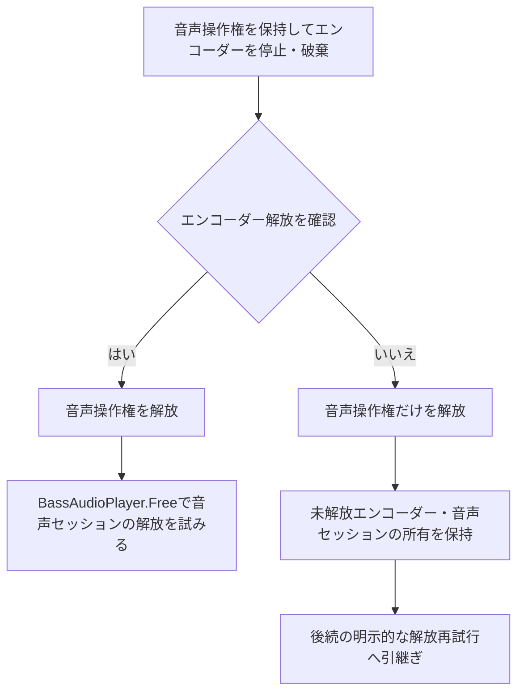

# 音声変換とエンコーダー

## 目的と適用範囲

オフライン変換、外部エンコーダーの起動、音量調整、結果と後片付けを定めます。可聴再生の初期化と所有は[音声実行基盤](audio.md)に従います。

## 用語

[共通用語集](../glossary.md)を参照します。コードの識別子は原表記を使います。

## 仕様

### 無音の変換用セッション

`NullDevice` は物理的な出力先を使わない変換専用です。内部ミキサーはFloat32・unityで動作します。変換はジョブ固有のNONE係数0.16を持ち、再生用DeviceVolumeとmuteを参照・変更しません。SRC品質は[音声実行基盤](audio.md#src品質と並列ミキシング)の共通設定を開始時に捕捉します。

曲を一回だけレンダーして完成PCMをジョブの配列に保持し、同一データを測定・正規化・エンコードします。PCM全体の再コピーや二回レンダー、レベルAPIによる別のデータ消費はしません。長尺では入力PCMと完成PCMのメモリが同時に必要です。任意サイズのストレージ退避は設けず、配列上限超過は失敗します。

イベントは絶対ticks×出力rateを最近傍偶数へ丸めたフレームに配置し、区間差だけをレンダーします。同フレームは元時刻順、同時刻は既存ForwardToのBGM→ロング1P→ロング2P→可視1P→可視2Pを保ちます。終端は既存Durationとし、尾部追加や無音切捨てはしません。

全体Peakは最大絶対値、RMSは全チャンネル全サンプルの二乗平均平方根です。二乗和はdouble補償加算で求めます。追加増幅Aは有限・非負に限り、NONEは0.16×A、PEAKは0.99/Peak×A、RMSは0.4/RMS×Aです。無音・空入力の測定は0で、無音を維持します。gainはdoubleで計算し、最終適用時にfloat32へ丸めます。

変換用sourceの音量は1に固定し、再生用DefaultVolumeを重ねて適用しません。出力フレームが0の譜面はencoder開始前に拒否します。BASSencはPCM供給がない場合にWAVヘッダーも出力しないため、ヘッダーのない空ファイルを成功結果として残しません。

Float32 WAVは有限の±1超過を保存します。整数入力を必要とする出力は、最終gain後の範囲超過をencoder開始前に拒否し、peakと必要減衰dBを例外に保持します。RMSをpeak正規化へ黙って変更しません。

### 失敗理由と再実行の案内

ファイル結果は成功・失敗だけでなく対象と主原因を完了通知へ渡します。バッチの完了ダイアログは一回とし、成功・失敗・未処理の件数を維持します。整数範囲超過は件数、代表対象、最大の最終ピークをまとめて案内し、その他の原因は対象名と理由を最大3件、残りは件数を示します。全件の詳細はログで確認できます。解放未確認による停止や取消でも、それまでの失敗理由を捨てません。

最終ピークをP、ジョブの追加増幅率をAとして、ピークは `20 log10(P)` dBを小数2桁で表示します。調整後の追加増幅率上限は `A/P`、現在値に対する割合は `floor(100/P)` %です。画面の0.1刻みで選べる安全側の値 `floor(10 A/P)/10` も示し、浮動小数の境界でも上限を超える値を勧めません。例えばP=1.349858、A=1なら、ピーク+2.61 dB、現在の増幅率の約74%以下、設定値0.7以下を案内します。別案としてPEAK正規化と追加増幅率1.0を示します。

`A/P<0.5` なら設定範囲内では追加増幅率だけで解決できないため、不可能な数値案を省いてその理由とPEAK・1.0を示します。上限がちょうど0.5なら数値案を残します。設定の自動変更、クリップ、黙った再試行は行いません。

### 出力形式と命令の生成

`BassAudioWriter` は変更不能な `AudioTagInfo`、`AudioEncoderCommandFactory`、`AudioEncoderSession` を通してManagedBass.Encを使います。WAV、LAME、Nero AAC、Opus、FLAC、OGGの六形式を扱い、品質値の制限とタグの指定を各形式へ適用します。AACの設定上の拡張子 `.aac` とNeroが作る `.m4a` は区別します。

実行ファイル、出力先、メタデータはWindowsの引数規則で引用し、シェルを介しません。WAVは出力パスを `EncodeStart` へ直接渡し、要求した標本形式の変換フラグを使います。WAVへ新たなRIFFのINFO情報を付加しません。

外部エンコーダーとNeroの実入力形式はネイティブミキサーのチャンネル情報を正本にし、命令・ヘッダー・実バイト列を一致させます。

| Float32の入力先 | 渡す形式 |
| --- | --- |
| LAME | 符号付き32ビット |
| FLAC | 符号付き24ビット |
| Opus | Float32のWAVヘッダー付きデータ |
| Ogg | `-F 3` のIEEE Float生データ |
| Nero | Float32のWAVヘッダー付きデータ |

### 選択後の出力先確認

出力フォルダの選択が受理された後、再生を停止する直前に `SelectedChartAudioConversionWorkflowOwner` が `LongPathFileSystem.DirectoryExists` で選択先を確認します。この時点でフォルダが存在しなければ、標準の `DirectoryNotFoundException` を送出し、再生停止・進捗表示・変換・完了通知へ進みません。変換executorも実行開始時に出力先を再確認し、選択先確認後にフォルダが失われた場合は変換を拒否します。

### 開始と所有

非0のエンコーダーハンドルを取得し、`EncodeSetNotify` に成功した後だけ録音状態を `Playing` にします。停止失敗ではハンドルと再生中の状態を保持し、解放済みとして扱いません。

変換処理は共通の音声操作権を保持したまま、音声書出し処理が所有するエンコーダーの停止・破棄と結果を確認します。その権利を解放した後にだけ音声セッションの `BassAudioPlayer.Free` を行います。エンコーダーの解放を確認できない場合は音声セッションを解放せず、未解放のエンコーダーと音声セッションの所有を保持して後続の明示的な解放再試行へ渡します。音声操作権はこの場合も `finally` で解放します。

### データ取得と失敗

`AudioPcmRenderer` はフレーム単位で読み、正の短いreadは処理して継続します。0バイトの予期しないstall、不整列、非有限値、native失敗は成功扱いしません。明示EOFが有限の要求フレーム数に届かない場合も失敗です。

encoderはPAUSEで作成して自動DSP供給を止め、完成PCMをencoder handle指定の同期EncodeWriteで一回だけ供給します。Pausedは正常な活動状態です。非同期queueを使わず、最終整数変換だけTPDFを適用します。float入力にはditherしません。sourceは供給とencoder終了確認まで保持します。

24bitだけ供給直前に明示的に量子化します。固定版での実測根拠、代替案、標準変換へ戻す条件は[設計判断](../../decisions/audio-library-boundaries.md#24bitだけ明示的に量子化する理由)に記載します。doubleで `q = Clamp(RoundToEven(x × 2^23 + U1 − U2), −2^23, 2^23−1)` を求め、正確に表現できる `q / 2^23` のfloat32を再利用する小さい作業配列へ格納します。U1、U2はencoder単位の乱数列から得る独立な[0,1)の一様乱数です。元PCMは変更しません。native側のDITHERは無効にし、24bitへの正確な格納変換だけを行います。元入力の範囲検査は維持し、clampはdither後の端点に限ります。その他の整数形式はBASSencのTPDFを使います。

書込み失敗・途中終了・終了失敗を保持します。終了時の強制停止通知も、後続の解放通知で上書きして成功にしません。外部encoderでは[BASSが返すprocess handle](https://www.un4seen.com/doc/bassenc/BASS_Encode_Start.html)を開始直後に非継承で複製し、同期停止後も終了コードを確認できるよう所有します。終了コード0だけを正常終了とし、通知済みの故障を0で成功へ戻しません。WAV出力はprocess handleを持ちません。

停止失敗ではnative encoderと複製handleを保持します。停止成功後はnative encoderを解放済みにし、非0の終了コードは変換失敗として報告します。終了コード259（未終了）または終了コード取得失敗では複製handleを保持し、明示的な破棄時に再確認します。確認できない間は後片付け完了にせず、既存のバッチ停止条件へ渡します。

ファイルごとの破棄後に解放を確認できた場合、変換失敗を報告して次のファイルへ進めます。確認できなければバッチを停止します。変換の失敗があればそれを主失敗とし、後片付けの失敗で置き換えません。

#### エンコーダーから音声セッションへの解放順

バッチ終了時の後片付けを示します。矢印は処理順と解放確認による分岐です。ファイル単位の続行可否は前述の条件に従い、ここでは音声操作権と音声セッションの所有を区別します。

音声セッション自体の解放未確認は[音声実行基盤](audio.md#解放と失敗の保持)に従います。

### 外部エンコーダーの検証

外部プロセスを使う確認は明示的な任意テストです。生成した短いステレオ音源を実際の音声書出し処理と無音セッションへ通し、Unicodeと空白を含むパス、既存出力との衝突時の採番、内容、開始・停止・解放を確認します。実行条件と環境変数は[テスト運用](../development/testing.md)に集約します。エンコーダー本体、ライセンス、外部音源を検証用データとして追加しません。

## 実装とテストの対応

| 仕様項目・主な条件 | 実装箇所 | テスト箇所・確認内容 |
| --- | --- | --- |
| 形式、引数、品質、タグと拡張子 | [`AudioEncoderCommandFactory`](../../../BeMusicSeeker/Ribbit/Media/Audio/AudioEncoderCommandFactory.cs)、[`AudioTagInfo`](../../../BeMusicSeeker/Ribbit/Media/Audio/AudioTagInfo.cs) | [`AudioContractsTests`](../../../BeMusicSeeker.Tests/Playback/AudioContractsTests.cs)、[`AudioEncoderCommandFactoryTests`](../../../BeMusicSeeker.Tests/Playback/AudioEncoderCommandFactoryTests.cs) |
| 開始・通知・停止・実形式、途中終了と解放の所有 | [`AudioEncoderSession`](../../../BeMusicSeeker/Ribbit/Media/Audio/AudioEncoderSession.cs)、[`BassAudioWriter`](../../../BeMusicSeeker/Ribbit/Media/BassAudioWriter.cs) | [`AudioEncoderSessionTests`](../../../BeMusicSeeker.Tests/Playback/AudioEncoderSessionTests.cs)、[`BassAudioWriterTests`](../../../BeMusicSeeker.Tests/Playback/BassAudioWriterTests.cs) |
| 選択後の出力先消失を再生停止前に拒否し、変換開始時にも再確認 | [`SelectedChartAudioConversionWorkflowOwner`](../../../BeMusicSeeker/ViewModels/ChartOperations/SelectedChartAudioConversionWorkflowOwner.cs)、`BassSelectedChartAudioConversionExecutor` | [`SelectedChartAudioConversionWorkflowOwnerTests`](../../../BeMusicSeeker.Tests/ChartOperations/SelectedChartAudioConversionWorkflowOwnerTests.cs) は選択直後の消失時に停止・進捗・通知が行われないこと、停止時に消失した場合にexecutorが拒否することを確認する。 |
| ファイルごとの結果、主失敗、解放できない場合の停止 | [`SelectedChartAudioConversionWorkflowOwner`](../../../BeMusicSeeker/ViewModels/ChartOperations/SelectedChartAudioConversionWorkflowOwner.cs) | [`SelectedChartAudioConversionWorkflowOwnerTests`](../../../BeMusicSeeker.Tests/ChartOperations/SelectedChartAudioConversionWorkflowOwnerTests.cs) |
| 別途用意した実エンコーダーとの接続 | [`BassAudioWriter`](../../../BeMusicSeeker/Ribbit/Media/BassAudioWriter.cs) | [`ExternalAudioEncoderSmokeTests`](../../../BeMusicSeeker.Tests/Playback/ExternalAudioEncoderSmokeTests.cs) |
| 一回render・全体RMS・絶対frame・空変換拒否・再生設定不変 | [`BMSAutoPlayWriter`](../../../BeMusicSeeker/Ribbit/BMS/BMSAutoPlayWriter.cs)、[`AudioPcmRenderer`](../../../BeMusicSeeker/Ribbit/Media/Audio/AudioPcmRenderer.cs) | [`BMSAutoPlayWriterTests`](../../../BeMusicSeeker.Tests/Playback/BMSAutoPlayWriterTests.cs)、[`AudioPcmRendererTests`](../../../BeMusicSeeker.Tests/Playback/AudioPcmRendererTests.cs) |
| 最終整数変換・float過大値保存・24bitの正確な格子 | [`AudioPcm24Quantizer`](../../../BeMusicSeeker/Ribbit/Media/Audio/AudioPcm24Quantizer.cs)、`AudioEncoderSession` | [`AudioOutputNativeTests`](../../../BeMusicSeeker.Tests/Playback/AudioOutputNativeTests.cs) は正負0.25LSBと無音を各2^20 sample、平均誤差≤0.02LSB、最大誤差≤2LSBで検査する。24bit無音の−1/0/+1頻度は1/8・3/4・1/8に各0.005以内。 |

## 関連資料

[音声実行基盤](audio.md)、[依存関係](audio-dependencies.md)、[テスト運用](../development/testing.md)を参照します。
