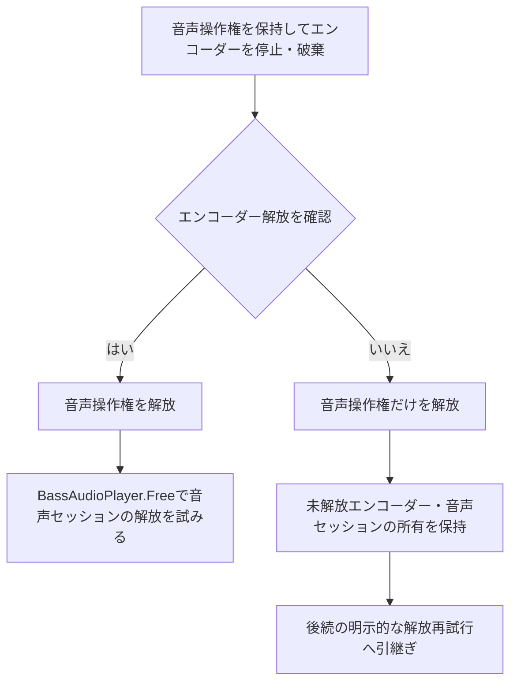

# 音声変換とエンコーダー

## 目的と適用範囲

オフライン変換、外部エンコーダーの起動、音量調整、結果と後片付けを定めます。可聴再生の初期化と所有は[音声実行基盤](audio.md)に従います。

## 用語

[共通用語集](../glossary.md)を参照します。コードの識別子は原表記を使います。

## 仕様

### 無音の変換用セッション

`NullDevice` は物理的な出力先を使わない変換専用です。通常再生やデバイステストの代替成功として使いません。`DeviceVolume` は変換のゲインであり、アプリの `IsDeviceMuted` を適用しません。初期ゲインは `0.4f`、最大振幅・RMSによる正規化と増幅値はミュートから独立して反映します。変換のためにミュート設定を書き換えません。

### 出力形式と命令の生成

`BassAudioWriter` は変更不能な `AudioTagInfo`、`AudioEncoderCommandFactory`、`AudioEncoderSession` を通してManagedBass.Encを使います。WAV、LAME、Nero AAC、Opus、FLAC、OGGの六形式を扱い、品質値の制限とタグの指定を各形式へ適用します。AACの設定上の拡張子 `.aac` とNeroが作る `.m4a` は区別します。

実行ファイル、出力先、メタデータはWindowsの引数規則で引用し、シェルを介しません。WAVは出力パスを `EncodeStart` へ直接渡し、要求した標本形式の変換フラグを使います。WAVへ新たなRIFFのINFO情報を付加しません。

外部エンコーダーとNeroの実入力形式はネイティブミキサーのチャンネル情報を正本にし、命令・ヘッダー・実バイト列を一致させます。

| Float32の入力先 | 渡す形式 |
| --- | --- |
| LAME | 符号付き32ビット |
| FLAC・Opus | 符号付き24ビット |
| Ogg | `-F 3` のIEEE Float生データ |
| Nero | Float32のWAVヘッダー付きデータ |

### 開始と所有

非0のエンコーダーハンドルを取得し、`EncodeSetNotify` に成功した後だけ録音状態を `Playing` にします。停止失敗ではハンドルと再生中の状態を保持し、解放済みとして扱いません。

変換処理は共通の音声操作権を保持したまま、音声書出し処理が所有するエンコーダーの停止・破棄と結果を確認します。その権利を解放した後にだけ音声セッションの `BassAudioPlayer.Free` を行います。エンコーダーの解放を確認できない場合は音声セッションを解放せず、未解放のエンコーダーと音声セッションの所有を保持して後続の明示的な解放再試行へ渡します。音声操作権はこの場合も `finally` で解放します。

### データ取得と失敗

要求したデータを読み出す変換は、秒数とバイト数の変換、`ChannelGetData`、音量レベルの取得を使います。要求より短い取得、0バイト、`Errors.Ended` はそのファイルの自然終了とし、再試行や0埋めをしません。他のネイティブ失敗はチャンネル、段階、失敗番号を持つ `AudioWriterRenderException` です。

レベル走査はデータを取得した後で同じ範囲の秒数へ変換し、通常値には `LevelRetrievalFlags.All`、RMSには `RMS` を使います。null・空のレベルや位置変換失敗を成功にしません。

正のデータを取得した後は、通知状態と `EncodeIsActive` を確認します。エンコーダーが停止・終了していれば `AudioEncoderException` の `EncoderDied` とし、`Faulted` の状態と残存ハンドルを解放再試行用に保持します。

ファイルごとの破棄後に解放を確認できた場合、変換失敗を報告して次のファイルへ進めます。確認できなければバッチを停止します。変換の失敗があればそれを主失敗とし、後片付けの失敗で置き換えません。

#### エンコーダーから音声セッションへの解放順

バッチ終了時の後片付けを示します。矢印は処理順と解放確認による分岐です。ファイル単位の続行可否は前述の条件に従い、ここでは音声操作権と音声セッションの所有を区別します。

音声セッション自体の解放未確認は[音声実行基盤](audio.md#解放と失敗の保持)に従います。

### 外部エンコーダーの検証

外部プロセスを使う確認は明示的な任意テストです。生成した短いステレオ音源を実際の音声書出し処理と無音セッションへ通し、Unicodeと空白を含むパス、既存出力との衝突時の採番、内容、開始・停止・解放を確認します。実行条件と環境変数は[テスト運用](../development/testing.md)に集約します。エンコーダー本体、ライセンス、外部音源を検証用データとして追加しません。

## 実装とテストの対応

| 仕様項目・主な条件 | 実装箇所 | テスト箇所・確認内容 |
| --- | --- | --- |
| 形式、引数、品質、タグと拡張子 | [`AudioEncoderCommandFactory`](../../../BeMusicSeeker/Ribbit/Media/Audio/AudioEncoderCommandFactory.cs)、[`AudioTagInfo`](../../../BeMusicSeeker/Ribbit/Media/Audio/AudioTagInfo.cs) | [`AudioContractsTests`](../../../BeMusicSeeker.Tests/Playback/AudioContractsTests.cs)、[`AudioEncoderCommandFactoryTests`](../../../BeMusicSeeker.Tests/Playback/AudioEncoderCommandFactoryTests.cs) |
| 開始・通知・停止・実形式、途中終了と解放の所有 | [`AudioEncoderSession`](../../../BeMusicSeeker/Ribbit/Media/Audio/AudioEncoderSession.cs)、[`BassAudioWriter`](../../../BeMusicSeeker/Ribbit/Media/BassAudioWriter.cs) | [`AudioEncoderSessionTests`](../../../BeMusicSeeker.Tests/Playback/AudioEncoderSessionTests.cs)、[`BassAudioWriterTests`](../../../BeMusicSeeker.Tests/Playback/BassAudioWriterTests.cs) |
| ファイルごとの結果、主失敗、解放できない場合の停止 | [`SelectedChartAudioConversionWorkflowOwner`](../../../BeMusicSeeker/ViewModels/ChartOperations/SelectedChartAudioConversionWorkflowOwner.cs) | [`SelectedChartAudioConversionWorkflowOwnerTests`](../../../BeMusicSeeker.Tests/ChartOperations/SelectedChartAudioConversionWorkflowOwnerTests.cs) |
| 別途用意した実エンコーダーとの接続 | [`BassAudioWriter`](../../../BeMusicSeeker/Ribbit/Media/BassAudioWriter.cs) | [`ExternalAudioEncoderSmokeTests`](../../../BeMusicSeeker.Tests/Playback/ExternalAudioEncoderSmokeTests.cs) |

## 関連資料

[音声実行基盤](audio.md)、[依存関係](audio-dependencies.md)、[テスト運用](../development/testing.md)を参照します。
