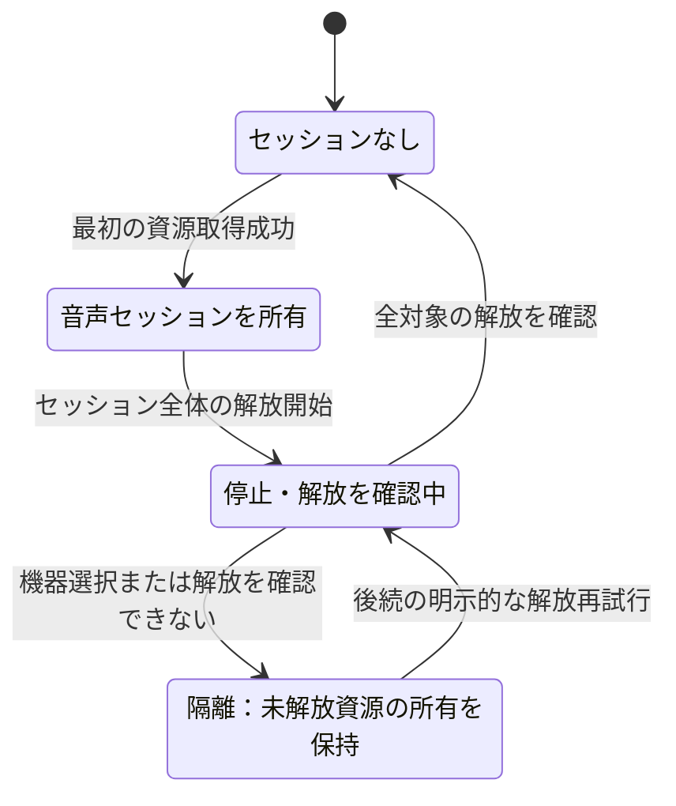

# 音声実行基盤と再生

## 目的と適用範囲

音声の初期化、機器選択、再生、デバイステスト、解放を定めます。依存する版は[依存関係](audio-dependencies.md)、変換・録音は[音声変換](audio-conversion.md)に分けます。

## 用語

[共通用語集](../glossary.md)を参照します。コードの識別子は原表記を使います。

「出力方式」はWASAPI共有・排他、ASIOを指します。「交渉」は機器が利用可能な形式等を選ぶ処理、「隔離」は解放を確認できない資源を新しい再生から分けて所有し続ける状態です。セッションは一回の機器使用の所有範囲で、ライブラリ変更のsessionとは別です。

## 仕様

### 所有と初期化

`BassAudioRuntime` は、最初の取得成功から解放確認まで音声セッションを一つの所有者として管理します。再生・テスト・変換・設定側は変更不能なトークンや結果を保持できますが、独立した解放待ち状態を重複して持ちません。初期化と解放を直列化し、使用中または隔離中の再入を拒否します。

初期化はネイティブDLLの読込み、ManagedBassへの接続、部品の版検証の順です。各段階の失敗は部品、処理段階、ネイティブの失敗元と番号、ロード状態を記録します。デバイス列挙や `BASS_Init` は選択した方式の境界でだけ行い、起動処理でBASS全体の既定デバイスを書き換えて機器を合成しません。

`BassNativeRuntime` は六つのDLLを一つの世代としてロードし、ファイル名とハンドルの表を単独で所有します。全て成功してから公開し、途中失敗では成功済みの候補だけを逆順で解放します。

`ManagedBassNativeLibraryResolver` は六つのアセンブリへ一回だけ接続を設定し、既知の名前と `.dll` 付きの名前を現在の正確なハンドルへ解決します。自分でロード・保存・解放はしません。未知の名前だけを通常の探索へ返し、停止後の既知の名前を別コピーへ解決しません。

CLRには接続済みの呼出しを解除するAPIがないため、最初の呼出し接続前に成功済みハンドルをプロセスの寿命まで保持します。論理的な停止は操作とコールバックの受付を閉じ、実行中の処理、セッション、機器の解放を待って、公開だけを解除します。再初期化では同じハンドルを再公開します。DLLの入替えはプロセス再起動で行います。

### 解放と失敗の保持

取得成功が確認できた資源だけを解放します。各層の停止・解放前には保存済みのBASS、WASAPI、ASIOの機器を選択します。選択に失敗した場合は別の機器の資源を解放せず、セッションを隔離して所有を保持します。後続の明示的な再試行で成功したものだけを一回解放します。

繰返し可能な停止・解放が返す `BASS_ERROR_INIT` は既に解放済みとして記録できますが、機器選択の失敗を無視する理由にはしません。最初の初期化・操作例外を主失敗として保持し、後片付けの失敗で置き換えません。解放確認済みのハンドルと状態だけを解除します。

#### 音声セッションの解放確認

音声セッション全体の資源所有と解放確認を示します。矢印は音声セッションの状態遷移、ラベルは遷移の契機または解放確認結果を表します。個別の音源操作の失敗を一律の解放開始条件にはしません。DLLハンドルのプロセス寿命や、各機器の交渉候補を表す図ではありません。初期化途中で得た資源も、取得成功を確認したものだけを同じ所有境界で解放します。

### 選択できる出力方式と旧設定

可聴出力はWASAPI共有、WASAPI排他、ASIOの順に表示し、新規の既定はWASAPI共有です。設定の列挙値の数値は変えず、画面の添字は明示的な選択肢一覧へ対応させます。`NullDevice=-1` はオフライン変換専用で、再生・テスト・代替の出力先にしません。

旧 `DirectSound=0` の設定だけはWASAPI共有とDefault機器へ正規化し、機器の識別子と名前を空にします。旧名の一致で別の機器へ移行しません。未知値、`INVALID`、保存済みの `NullDevice` は黙って変更せず、利用不可として表示・拒否します。画面を開くだけでは保存しません。

カタログはBASSWASAPIとBASSASIOの列挙だけを使い、各方式のDefault項目と実際の機器を公開します。BASSのDirectSound列挙を公開しません。

### 機器の代替規則

同じ方式内の候補を全て試してから別方式へ移ります。別方式ではその方式のDefaultから始め、元の方式の識別子を流用しません。

| 要求方式 | 同じ方式内の試行 | 失敗後 |
| --- | --- | --- |
| ASIO | 要求または既定機器、決定的なレート候補、Float32、必要ならInt16 | WASAPI排他、次に共有 |
| WASAPI排他 | 要求されたイベント・周期、同じ周期の非イベント、既定周期の非イベント | WASAPI共有 |
| WASAPI共有 | イベント要求なら既定バッファ・周期のイベント、次に非イベント | 失敗として終了 |

どの経路も無音機器で成功させません。WASAPI共有では空でない機器IDを正本とし、名前が変わっても維持し、消えたIDを同名の別機器へ置換しません。IDを持たない旧形式だけは名前による互換解決を許します。排他とASIOは方式のDefaultに進む前の既存の名前一致を維持します。

結果にはIDの消失、周期・方式の変更、形式・レートの正規化、ネイティブの失敗、代替先を残します。選べないDirectSound内部の形式が未観測であることを示す `UNKNOWN` を、初期化失敗や代替成功の意味へ流用しません。

### ASIOとWASAPIの形式

ASIOではコールバックと読み出すミキサーのバイト幅を一致させます。最初にFloat32、変換できない場合だけInt16を両側へ使います。Int8・Int24・Int32の要求はエンジン用にFloat32へ正規化し、要求と採用値を別々に保持します。

明示レートは要求値、ドライバーの現在値、重複しない標準値の順です。Autoは固定48000ではなく現在値から始めます。採用されたレートと形式を読み戻します。独自のP/Invokeで未提供の直接接続を補いません。

WASAPIのエンジンはFloat32です。共有では機器のミックスレートとチャンネル数、ネイティブ既定のバッファ・周期を使います。共有の `BassWasapi.Init` に排他フラグを渡さず、イベントの有無に応じたフラグとバッファ・周期0を指定します。排他は `Exclusive | AutoFormat` と必要なイベントフラグ、候補周期を使います。共有に排他の機器形式を埋め込みません。

### コールバックと音量

ASIO・WASAPIは `BassAudioSession.CallbackOutputHandle` だけを音声の取得元に使います。ASIOのチャンネル有効化・結合・開始、WASAPIの開始より前に、ミキサーと初期ゲインをセッションへ公開します。静的変数やプレイヤーから取得元を推測しません。

テンポ処理を交換するときは新しい取得元を原子的に公開してから古い資源を解放し、解放を確認できなければ古い取得元へ戻します。共有のアプリ音量は、デコードされるFloat32ミキサーへ `BASS_FX_BFX_VOLUME` で適用します。再生用の音量属性を代用しません。

Windows共有セッションの音量とミュートはWindowsが所有します。初期化で読み戻して書き直さず、アプリのゲインと独立に合成されます。排他にこの共有の保証を当てはめません。

`DeviceVolume` と `IsDeviceMuted` はアプリが保持する希望値です。初期化前や解放待ちでも設定でき、その操作からロード・列挙・初期化・代替・保存を開始しません。音声操作を受け付けられない間はネイティブへの反映だけを保留し、有効なセッションの完成後にミュート時0、それ以外は音量を適用します。変換専用の無音機器は変換仕様に従います。

### 要求・交渉・観測と設定

要求値は利用者が選んだ方式、識別子・名前、レート、形式、バッファ、イベント、音量の変更不能な組です。交渉値はネイティブが受理・報告した機器、レート、チャンネル、エンジン・機器形式、方式、遅延です。観測値は再生位置、経過時間、進行比率等の実測です。これらを「実際の値」として混ぜません。

通常再生で交渉結果を永続設定へ書き戻しません。設定画面は方式・識別子・名前の編集用の組を所有し、列挙の更新や一時的な選択変化で保存しません。保存時に組全体を反映し、失敗ならメモリ上の設定を戻しつつ編集値を再試行可能に保ちます。機器選択は変わり得る添字でなくカタログ項目に結び付けます。

カタログの更新は明示的に繰り返せます。方式ごとに失敗を扱い、失敗した方式は直近の正常一覧を保ちます。保存済み機器の欠落はDefaultとは別の利用不可項目にし、利用者がDefaultか別機器を選ぶまでIDを消しません。非同期の結果は現在の方式に対する最新要求だけを公開します。

### 曲の再生と解放

音源の所属は `BASS_Mixer_ChannelGetMixer` で確認し、活動状態から推測しません。未接続なら一時停止フラグ付きで所有セッションのミキサーへ一回追加し、読み戻して確認します。`BASS_ERROR_ALREADY` は期待する所属が確認できた場合だけ許します。

再生・一時停止はミキサーの一時停止フラグを変更し、成功後にだけマネージドの状態を更新します。音源作成前に受理済みセッションの機器を選び、他のミキサーへ勝手に移しません。所属・解放を確認した遷移でだけ `CurrentVoices` を一回増減します。再開失敗の補償も解放確認後にだけ件数を戻し、主失敗を保持します。

自然終了の通知はセッションの音源所有者からプレイヤーを解決し、コールバック外へ例外を投げません。`BASS_SYNC_ONETIME` と再生世代で古い通知を拒否します。ロックを取れなければ世代付きの未処理状態を一つ保持し、古い通知で新しい状態を上書きしません。次の操作は現在の世代の後片付けだけを再試行します。

全ての `Play` は新しい論理再生世代を開始し、古い終了通知と未処理状態を無効にします。自然終了位置は長さの位置に保ちます。破棄と再生は同じインスタンス境界で直列化し、所属解除と資源の解放確認で所有・件数・未処理状態を解消します。解放済みハンドルを再使用しません。

メモリ音源の `FileProcedures` はプレイヤーが強参照を持ち、引数順と終端位置への移動を含むネイティブ契約を守ります。`AutoFree` による非同期の自動解放へ所有を移しません。取得元の追跡に失敗しても、解放確認までハンドルと所有者を保ちます。

### テンポと効果

テンポは `BassFx.TempoCreate` と対応する属性を使い、交換・接続・公開・旧音源の解放を同じ所有境界で直列化します。効果はDX8の9種とBASS_FXの23種です。保存値をライブラリの数値へ直接変換せず、明示的な対応で `EffectType` へ変換します。

通常の引数型はManagedBassの変換処理を使い、ポインター付き引数は呼出し中だけ有効なメモリと固定配列を局所的に所有します。PitchShiftは既存ABIに合わせてFFT・過剰標本化を32ビットとし、5項目・20バイトを維持します。

音量包絡の取得は節点数とポインター、必要なバイト範囲を検証して全節点を直ちにコピーします。既存配列長で切り詰めず、負数・過大な数・非0件とnullの組を成功にしません。固定メモリの所有者は呼出し境界で一つだけとし、準備・解放の失敗で主例外を変えません。

### デバイステスト

初期化と再生の進行を独立に判定します。最初に位置が進むまでを除き、少なくとも1秒の測定区間で単調に進行し、再生位置の進みと経過時間の比が0.75～1.25であることを要求します。1.5倍・2倍速は失敗です。

判定区間を通過しても終了とせず、有限のテスト音を正確に一回、自然終了まで再生します。時間を満たすための繰返しや途中での解放はしません。停止を自然終了と見なせるのは位置が報告済みの長さへ到達した場合だけです。音源欠落、無進行、逆行、不正な比率、早期終了、自然終了に至らない時間超過、例外は失敗です。物理的に音が聞こえたとは判定しません。

編集中の値を更新できるのは、要求が最新で、初期化と進行に成功し、代替・正規化がなく、明示指定が交渉値と一致した場合だけです。DefaultやAutoの意図を一時的な具体値へ置換しません。失敗は設定を変更しません。

初期化、音源欠落、プレイヤー作成、再生開始、進行、比率異常、自然終了待ちを別の失敗種別にします。型付き例外の段階、ハンドル、機器、ネイティブの失敗を結果とログへ渡します。設定画面は完全なパスではなく翻訳済みの理由を表示します。予期しない例外も機能境界で記録・表示し、全体の未処理例外抑止に依存しません。

### 診断と実機確認

音声の診断は `NLogWrapper` に集約し、要求、試行方式・段階、ネイティブの失敗、交渉値、代替理由を記録します。高頻度のコールバックへ無制限のログを追加しません。再生失敗は `BassAudioPlaybackException` に所有情報も保持します。

実機の確認は通常の機能テストとは別に、Windows 10・11の配布物で内蔵機器と利用可能なUSBまたはASIO機器を使います。共有の他アプリとの同時再生、アプリ音量とWindows音量・ミュートの独立性、排他・ASIOの交渉値、テスト音の一回の自然終了、機器の切断・再接続と保存後の再起動を確認します。無音変換は物理機器を使わず、ミュートから独立していることを確認します。

## 実装とテストの対応

| 仕様項目・主な条件 | 実装箇所 | テスト箇所・確認内容 |
| --- | --- | --- |
| ロード、操作の受付、世代と解放の所有 | [`BassAudioRuntime`](../../../BeMusicSeeker/Ribbit/Media/Audio/BassAudioRuntime.cs)、[`BassAudioSession`](../../../BeMusicSeeker/Ribbit/Media/Audio/BassAudioSession.cs) | [`BassNativeRuntimeTests`](../../../BeMusicSeeker.Tests/Playback/BassNativeRuntimeTests.cs)、[`BassAudioSessionTests`](../../../BeMusicSeeker.Tests/Playback/BassAudioSessionTests.cs)、[`BassCollectibleLoadContextTests`](../../../BeMusicSeeker.Tests/Playback/BassCollectibleLoadContextTests.cs) |
| 機器の列挙、保存値、方式ごとの交渉と代替 | [`BassAudioRuntime`](../../../BeMusicSeeker/Ribbit/Media/Audio/BassAudioRuntime.cs) | [`AudioDeviceCatalogTests`](../../../BeMusicSeeker.Tests/Playback/AudioDeviceCatalogTests.cs)、[`BassAudioDeviceEnumerationTests`](../../../BeMusicSeeker.Tests/Playback/BassAudioDeviceEnumerationTests.cs)、[`BassAsioNegotiationTests`](../../../BeMusicSeeker.Tests/Playback/BassAsioNegotiationTests.cs)、[`BassWasapiAndDirectSoundNegotiationTests`](../../../BeMusicSeeker.Tests/Playback/BassWasapiAndDirectSoundNegotiationTests.cs) |
| ミキサー所属、再生世代、ネイティブ失敗 | [`BassAudioPlayer`](../../../BeMusicSeeker/Ribbit/Media/BassAudioPlayer.cs) | [`BassMixerSourceControllerTests`](../../../BeMusicSeeker.Tests/Playback/BassMixerSourceControllerTests.cs)、[`BassAudioSessionTests`](../../../BeMusicSeeker.Tests/Playback/BassAudioSessionTests.cs) |
| 効果の対応と引数ABI | [`BassAudioPlayer`](../../../BeMusicSeeker/Ribbit/Media/BassAudioPlayer.cs) | [`BassAudioEffectTests`](../../../BeMusicSeeker.Tests/Playback/BassAudioEffectTests.cs)、[`AudioContractsTests`](../../../BeMusicSeeker.Tests/Playback/AudioContractsTests.cs) |
| 進行と自然終了、最新要求、設定と失敗表示 | [`AudioDeviceTestWorkflowOwner`](../../../BeMusicSeeker/ViewModels/Settings/AudioDeviceTestWorkflowOwner.cs) | [`AudioDeviceTestWorkflowOwnerTests`](../../../BeMusicSeeker.Tests/Settings/AudioDeviceTestWorkflowOwnerTests.cs)、[`SettingsDialogBehaviorTests`](../../../BeMusicSeeker.Tests/Settings/SettingsDialogBehaviorTests.cs) |

## 関連資料

[依存関係](audio-dependencies.md)、[音声変換](audio-conversion.md)、[設定](settings.md)、[終了](shutdown.md)、[表示パネル](../ui/playback-panel.md)を参照します。
