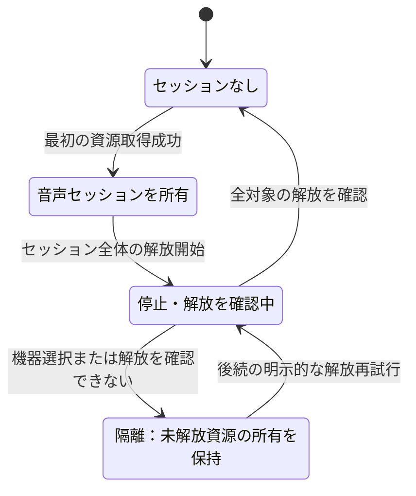

# 音声実行基盤と再生

## 目的と適用範囲

音声の初期化、機器選択、再生、デバイステスト、解放を定めます。依存する版は[依存関係](audio-dependencies.md)、変換・録音は[音声変換](audio-conversion.md)に分けます。

## 用語

[共通用語集](../glossary.md)を参照します。コードの識別子は原表記を使います。

「出力方式」はWASAPI共有・排他、ASIOを指します。「交渉」は機器が利用可能な形式等を選ぶ処理、「隔離」は解放を確認できない資源を新しい再生から分けて所有し続ける状態です。セッションは一回の機器使用の所有範囲で、ライブラリ変更のsessionとは別です。

## 仕様

### 所有と初期化

通常再生、能力照会、明示テスト、解放は既存の `BassAudioOperationGate` 内の要求受付を共有します。競合する未受理要求は待たずに返し、拒否前にはnative初期化、共有要求の変更、通常再生の停止を行いません。受理済み要求の非同期継続は同じ論理的な受付を引き継ぎます。callback・native処理を解放から保護する短い共有／排他gateは維持します。排他leaseは参照型で一回だけ解放し、session遷移の終端は所有者の解放確認から判定します。

`BassAudioRuntime` は、最初の取得成功から解放確認まで音声セッションを一つの所有者として管理します。再生・テスト・変換・設定側は変更不能なトークンや結果を保持できますが、独立した解放待ち状態を重複して持ちません。初期化と解放を直列化し、使用中または隔離中の再入を拒否します。

初期化はネイティブDLLの読込み、ManagedBassへの接続、部品の版検証の順です。各段階の失敗は部品、処理段階、ネイティブの失敗元と番号、ロード状態を記録します。デバイス列挙や `BASS_Init` は選択した方式の境界でだけ行い、起動処理でBASS全体の既定デバイスを書き換えて機器を合成しません。

`BassNativeRuntime` は七つのDLL（BASS系六つとVorbis bridge）を一つの世代としてロードし、ファイル名とハンドルの表を単独で所有します。全て成功してから公開し、途中失敗では成功済みの候補だけを逆順で解放します。

`ManagedBassNativeLibraryResolver` は六つのアセンブリへ一回だけ接続を設定し、既知の名前と `.dll` 付きの名前を現在の正確なハンドルへ解決します。自分でロード・保存・解放はしません。未知の名前だけを通常の探索へ返し、停止後の既知の名前を別コピーへ解決しません。

CLRには接続済みの呼出しを解除するAPIがないため、最初の呼出し接続前に成功済みハンドルをプロセスの寿命まで保持します。論理的な停止は操作とコールバックの受付を閉じ、実行中の処理、セッション、機器の解放を待って、公開だけを解除します。再初期化では同じハンドルを再公開します。DLLの入替えはプロセス再起動で行います。

### 解放と失敗の保持

取得成功が確認できた資源だけを解放します。各層の停止・解放前には保存済みのBASS、WASAPI、ASIOの機器を選択します。選択に失敗した場合は別の機器の資源を解放せず、セッションを隔離して所有を保持します。後続の明示的な再試行で成功したものだけを一回解放します。

繰返し可能な停止・解放が返す `BASS_ERROR_INIT` は既に解放済みとして記録できますが、機器選択の失敗を無視する理由にはしません。最初の初期化・操作例外を主失敗として保持し、後片付けの失敗で置き換えません。解放確認済みのハンドルと状態だけを解除します。

#### 音声セッションの解放確認

音声セッション全体の資源所有と解放確認を示します。矢印は音声セッションの状態遷移、ラベルは遷移の契機または解放確認結果を表します。個別の音源操作の失敗を一律の解放開始条件にはしません。DLLハンドルのプロセス寿命や、各機器の交渉候補を表す図ではありません。初期化途中で得た資源も、取得成功を確認したものだけを同じ所有境界で解放します。

```mermaid
stateDiagram-v2
    state "セッションなし" as Idle
    state "音声セッションを所有" as Owned
    state "停止・解放を確認中" as Releasing
    state "隔離：未解放資源の所有を保持" as Quarantined
    [*] --> Idle
    Idle --> Owned: 最初の資源取得成功
    Owned --> Releasing: セッション全体の解放開始
    Releasing --> Idle: 全対象の解放を確認
    Releasing --> Quarantined: 機器選択または解放を確認できない
    Quarantined --> Releasing: 後続の明示的な解放再試行
```

### 選択できる出力方式と旧設定

可聴出力はWASAPI共有、WASAPI排他、ASIOの順に表示し、新規の既定はWASAPI共有です。設定の列挙値の数値は変えず、画面の添字は明示的な選択肢一覧へ対応させます。`NullDevice=-1` はオフライン変換専用で、再生・テスト・代替の出力先にしません。

旧 `DirectSound=0` の設定だけはWASAPI共有とDefault機器へ正規化し、機器の識別子と名前を空にします。旧名の一致で別の機器へ移行しません。未知値、`INVALID`、保存済みの `NullDevice` は黙って変更せず、利用不可として表示・拒否します。画面を開くだけでは保存しません。

カタログはBASSWASAPIとBASSASIOの列挙だけを使い、各方式のDefault項目と実際の機器を公開します。BASSのDirectSound列挙を公開しません。

### 機器の代替規則

同じ方式内の候補を全て試してから別方式へ移ります。別方式ではその方式のDefaultから始め、元の方式の識別子を流用しません。

| 要求方式 | 同じ方式内の試行 | 失敗後 |
| --- | --- | --- |
| ASIO | 要求または既定機器、決定的なレート候補、Float32のみ | WASAPI排他、次に共有 |
| WASAPI排他 | 要求されたイベント・周期、同じ周期の非イベント、既定周期の非イベント | WASAPI共有 |
| WASAPI共有 | イベント要求なら既定バッファ・周期のイベント、次に非イベント | 失敗として終了 |

どの経路も無音機器で成功させません。WASAPI共有では空でない機器IDを正本とし、名前が変わっても維持し、消えたIDを同名の別機器へ置換しません。IDを持たない旧形式だけは名前による互換解決を許します。排他とASIOは方式のDefaultに進む前の既存の名前一致を維持します。

結果にはIDの消失、周期・方式の変更、形式・レートの正規化、ネイティブの失敗、代替先を残します。選べないDirectSound内部の形式が未観測であることを示す `UNKNOWN` を、初期化失敗や代替成功の意味へ流用しません。

### ASIOとWASAPIの形式

ASIOのエンジンとコールバックはFloat32固定です。形式設定や読み戻しに失敗した場合、整数エンジンを試さず、既存の方式代替へ進み理由を記録します。保存済みの整数形式の列挙値は変更しません。機器のnative形式はChannelGetInfoから取得して区別し、整数機器への最終変換だけTPDF ditherを指定します。DSDは対象外です。

ASIO callbackの形式設定はraw値を契約とします。Float32 native endpointには `0x13`、整数native endpointにはTPDF付きFloat32の `0x113` を要求し、ChannelGetFormatが同一rawを返した場合だけ受理します。`UNKNOWN=-1` は読戻しAPI失敗として直後のnative errorとともに保持します。別rawの正常読戻しは形式不一致であり、古いnative errorをこの不一致へ付けません。SetFormat失敗はSetFormat段階と直後のnative errorを記録します。各結果には要求raw・読戻しraw・その方式で先に行った試行を残し、未読の値を実値として生成しません。

機器のPCM形式は16・24・32bit整数、32bit容器に16・18・20・24bitを格納する整数形式、Float32を受理します。32bit容器の整数は機器形式の分類では整数32bitとし、交渉診断にnativeの値・容器幅・有効ビット数を残します。容器幅や有効ビット数をコールバックのバイト幅へ流用せず、コールバックは常に1サンプル4バイトです。未知の形式や情報取得失敗をPCMと推測しません。

明示レートは要求値、ドライバーの現在値、重複しない標準値の順です。Autoは固定48000ではなく現在値から始めます。採用されたレートと形式を読み戻します。独自のP/Invokeで未提供の直接接続を補いません。

WASAPIのエンジンはFloat32です。共有では機器のミックスレートとチャンネル数、ネイティブ既定のバッファ・周期を使います。共有の `BassWasapi.Init` に排他フラグを渡さず、イベントの有無に応じたフラグとバッファ・周期0を指定します。排他は `Exclusive | AutoFormat` と必要なイベントフラグ、候補周期を使います。共有に排他の機器形式を埋め込みません。

### コールバックと音量

ASIO・WASAPIは `BassAudioSession.CallbackOutputHandle` だけを音声の取得元に使います。ASIOのチャンネル有効化・結合・開始、WASAPIの開始より前に、ミキサーと初期ゲインをセッションへ公開します。静的変数やプレイヤーから取得元を推測しません。

テンポ処理を交換するときは新しい取得元を原子的に公開してから古い資源を解放し、解放を確認できなければ古い取得元へ戻します。アプリ音量はDSP・テンポ処理後のFloat32へ `AudioOutputProcessor` で一度だけ適用します。方式別BFXやASIOの音量属性は併用しません。初回は指定値を即時適用し、変更時は5msを最近傍偶数に丸めたフレーム数で線形変化します。第1フレームから差分の1/Nずつ進み、第Nフレームで目標へ到達します。途中変更は直前フレームの係数を起点にします。

Windows共有セッションの音量とミュートはWindowsが所有します。初期化で読み戻して書き直さず、アプリのゲインと独立に合成されます。排他にこの共有の保証を当てはめません。

`DeviceVolume` と `IsDeviceMuted` はアプリが保持する希望値です。初期化前や解放待ちでも設定でき、その操作からロード・列挙・初期化・代替・保存を開始しません。音声操作を受け付けられない間はネイティブへの反映だけを保留し、有効なセッションの完成後にミュート時0、それ以外は音量を適用します。変換専用の無音機器は変換仕様に従います。

### 要求・交渉・観測と設定

代替の判定と結果の要求欄には実効要求を使います。共有mixと不使用の保存レート・形式の差、ASIOの保存形式とnative形式の差だけでは代替としません。保存意図は元の変更不能な設定・テスト要求に残し、実効要求や実値で書き換えません。

デバイステストの要求表示と診断は、通常結果・初期化失敗・解放失敗を通じて同じ実効要求を使います。設定値として保存されたrate・format・buffer・event指定は要求オブジェクトに保持しますが、方式が使わない値を実効要求の表示へ混ぜません。

希望設定からnative要求を作る際は、その方式が適用する条件だけを使います。共有のレート・形式・手動バッファ、ASIOの形式・イベント指定は旧保存値が残っていても開始の制約にしません。保存したAuto／Defaultの意味は変えません。セッション再利用は用途を含む出力要求全体を比較し、実時間の音量操作は別に扱います。

WASAPI排他のAutoレートと明示形式の組は、照会済みであることを前提にしません。共通の開始処理で現在のmixレートを先頭に既存の有限・決定的なレート候補を検査し、明示形式を完全一致で受理する最初のレートを選びます。例えば44.1kHz/16bitと48kHz/24bitだけを受理する機器のAuto/24bitは、mixが44.1kHzでも48kHzで開始します。照会と開始は同じ `BASS_WASAPI_CheckFormat` 境界を使い、返された低精度形式を指定形式の対応として扱いません。対応レートがないデバイステストは失敗し、通常再生では従来の形式代替を維持します。

デバイステストはイベント指定を保持します。共有・排他ともイベント駆動の失敗を非イベント方式の成功へ置き換えず、排他では同じイベント指定内のバッファ・周期だけを調整できます。明示形式のテストでは、形式やレートを変更し得る `BASS_WASAPI_AUTOFORMAT` を渡しません。初期化後の形式読戻しも完全一致を要求します。通常再生のイベント→非イベントとバッファ・周期の候補順は維持します。APIの意味は [BASS_WASAPI_Init](https://www.un4seen.com/doc/basswasapi/BASS_WASAPI_Init.html) と [BASS_WASAPI_CheckFormat](https://www.un4seen.com/doc/basswasapi/BASS_WASAPI_CheckFormat.html) に従います。

要求値は利用者が選んだ方式、識別子・名前、レート、形式、バッファ、イベント、音量の変更不能な組です。交渉値はネイティブが受理・報告した機器、レート、チャンネル、エンジン・機器形式、方式、遅延です。観測値は再生位置、経過時間、進行比率等の実測です。これらを「実際の値」として混ぜません。

通常再生で交渉結果を永続設定へ書き戻しません。設定画面は方式・識別子・名前の編集用の組を所有し、列挙の更新や一時的な選択変化で保存しません。保存時に組全体を反映し、失敗ならメモリ上の設定を戻しつつ編集値を再試行可能に保ちます。機器選択は変わり得る添字でなくカタログ項目に結び付けます。

カタログの更新は明示的に繰り返せます。方式ごとに失敗を扱い、失敗した方式は直近の正常一覧を保ちます。保存済み機器の欠落はDefaultとは別の利用不可項目にし、利用者がDefaultか別機器を選ぶまでIDを消しません。非同期の結果は現在の方式に対する最新要求だけを公開します。

### 機器能力の自動照会

照会の保留解除は、要求が終了しnative所有も残っていない通知だけで行います。再生表示の `IsPlaying=false` や、解放失敗を含むworkflow終了通知から受付可能と推測しません。自己の照会中の通知は完了結果の判定後に処理し、Failedを再試行しません。解放未確認は通常のBusyとは区別した失敗として表示します。

オーディオ設定ページを表示したとき、および利用者が出力方式または機器を変更したときに、選択中の組だけを一回照会します。機器一覧の更新操作は独立しており、利用者に列挙と照会の順番を操作させません。未選択の機器や他方式へ代替せず、選択機器が消えていれば照会失敗とします。結果は画面を開いている間だけの変更不能な値で、方式または機器の変更、画面終了時に無効化します。照会は希望設定を保存・正規化せず、Auto、Default、保存済み希望値を保ちます。

照会中に選択が複数回変わった場合は、先行要求の完了後に現在の選択だけを照会します。古い結果は表示せず、要求を並べて実行しません。Failed・Unsupportedは自動再試行せず、ページ再表示または明示的な選択変更を次の契機とします。競合でBusyになった要求は保留し、実際の音声session解放通知後にページが表示中なら現在の選択を一回照会します。再度Busyなら保留のままにし、失敗や同じ解放通知からループしません。

WASAPI共有は選択機器のmixレート・チャンネル数を読み、共有フラグでCheckFormatを行ってmix形式を確認します。読み取ったmixレートと形式は表示専用です。WASAPI排他は2チャンネルで各レート・形式の組をCheckFormatへ渡し、返却raw形式が要求した形式と一致した組だけを対応候補にします。レートと形式の無条件な直積で対応扱いにしません。照会レートには選択機器が現在報告するmix rate、保存済みの希望値、標準候補を含め、352800Hz・384000Hzも照会します。排他のレート・形式候補は現在の照会で確認した組に絞ります。

ASIOは `AsioInitFlags.Thread` を保ち、ドライバーが現在報告するレート、保存済みレート、標準レートを重複なしでCheckRateします。ChannelGetInfoで左右出力ch 0/1のnative形式と精度を読みます。能力照会でSetRate、SetFormat、ミキサー作成、callback、Startを実行しません。共有・排他ともCheckFormatの非対応応答とAPI故障を分け、非対応は Unsupported、予期しないnative errorは Failed として診断します。

再生レート・形式欄にはAutoを残し、機器が受理した候補と保存済みの希望値を表示します。未照会や非対応の保存値は注記付きで選択を保ち、照会結果だけで値を書き換えません。ASIO形式とWASAPI共有の形式・レートは読取専用の機器情報として表示します。音声変換のレート・形式欄は機器能力から独立した固定候補を使います。

WASAPI排他の能力候補はdriver、device、rate、formatの順に絞ります。確認済みrateは現在のformat選択で除外せず、formatだけを選択rateの確認済み組に絞ります。rateがAutoなら確認済みの形式全体が候補です。

能力照会はデバイステストと同じ受付を共有し、通常再生を止めません。再生session使用中、解放保留、デバイステスト実行中、設定保存中の照会は受け付けず、競合結果は上記の保留規則に従います。照会開始後は設定の保存・取消が可能で、選択変更・ページ非表示・画面終了時は結果を無効化し、実行中の照会へ取消を渡します。native呼出しを強制中断せず、次の初期化や候補検査へ進む前に取消を確認し、取得済み資源の解放まで受付を保持します。ASIOは既存音声lifecycleの排他取得後にsessionとして初期化・読取り・解放し、解放失敗時は結果を成功にせず、既存cleanup保留へ所有を残します。設定画面は照会の最新世代と選択組を照合してから結果を表示し、選択変更や画面終了後に完了した古い照会を破棄します。結果を画面より長く保持するcacheや再試行queueは持ちません。

### デバイステストの要求・実値と診断

デバイステストは開始時に捕捉した要求方式・機器・レート・形式と、初期化済みの実方式・機器・レート・内部engine形式・機器形式・容器幅/有効精度・チャンネル数・遅延を同じ結果で表示します。形式の希望と一致するかは機器形式で比較し、内部Float32 engineとの比較で代替と判定しません。結果は要求と初期化実値を分けて示し、編集値と保存済み設定を書き換えません。

テストの終端結果は必須の要求、nullableの初期化実値、再生観測、主失敗、音源・出力sessionの解放失敗を保持します。成功には必要な進行・自然終了と解放確認をすべて必要とします。解放失敗が先行結果や取得済み遅延を上書きせず、未取得の遅延は0で代用しません。先行処理だけが成功しても解放失敗を成功にしません。

初期化後にテスト音源の作成・再生・進行・自然終了が失敗した場合は、初期化情報と再生失敗理由を両方残します。初期化に失敗した場合は、まだ確定していない実機器・レート・形式を実値欄に出しません。翻訳済みの利用者向け理由とnative stage/error・代替試行列の技術診断を分けて表示し、任意例外のMessageやパスを直接表示しません。

初期化成功時の技術診断には交渉試行と、native境界が組み立てた代替理由を残します。方式代替の要約はbackend・失敗段階・native errorから構成し、任意例外のMessageを試行履歴へ複写しません。

### 入力PCMと配置

全入口は `AudioSourceLoader` を通り、元レート、対応するチャンネル配置、実際に復号したフレーム数を持つ有限float32 PCMへ事前復号します。±1超過と微小値を保存し、非有限値、チャンネル不整合、扱えないチャンネル数、実PCM配列の上限超過は拒否します。PCM32整数とfloat64はfloat32精度へ丸めます。正常に復号された0フレーム音源も有効で、空sourceは長さ0の停止状態を保ち、ミキサー登録とvoice数の計上を行いません。

WAVのコンテナ長、byte rate、block align、pad、fmt長を独自に拒否条件にしません。BASSが返す1～8チャンネルのデコード情報を使い、利用可能で対応可能なWAVE extensibleのspeaker maskがあれば配置に採用し、それ以外はBASS標準のチャンネル配置を使います。BASSとVorbisの報告長は上限付きの初期容量hintとしてだけ扱い、実PCMをEOFまで読みます。長さhintが誤っていても、実際に読めた範囲だけをsourceへ渡します。

Oggは拡張子ではなく先頭署名で判定し、libvorbisfileのfloat APIをEOFまで使います。復号失敗を別decoderで隠しません。同一sample rate・channel layoutのchainは連結しますが、実読取りで形式変更を検出したchain全体は入力失敗として省きます。`OV_HOLE` はlibvorbisfileの再同期として継続し、それ以外のEOF前decode errorは失敗です。アプリ独自にCRC、page、EOSを全走査して拒否条件へ加えません。

PCMの共有は一回の曲ロードに限り、正規化絶対pathが同じ入力を一度だけ復号します。ロード後はsourceがPCMを保持し、バッチ全曲分を蓄積しません。sourceごとの `FloatWaveSource` は小さいヘッダーと共有PCMを仮想WAVEとして提示し、再生位置を共有しません。native解放未確認時はPCMとdelegateの所有を維持します。

譜面ロードはBGM、可視1P/2P、ロング開始1P/2Pの使用音源だけを対象とします。明示された非空WAVの入力読取り・復号失敗は、正規化絶対pathごとに一度WARNを記録して省き、残りの音源で続行します。見つからない非空参照も要求pathの読取り失敗として扱います。全ての要求pathが失敗した場合は譜面読込みを失敗させます。未定義または空のWAV定義は読取り要求にせず、無音として扱います。未使用定義の破損は拒否理由にしません。

BASSmix 2.4.13へsourceをpause状態で接続し、Float/Decode、異なるレートに必要な指定SRC品質と読み戻し、明示matrix、NORAMPINを確認してから再開します。無音区間も出力時計を維持します。WASAPI出力はBASS標準論理配置、ASIOは従来のL/Rです。同speakerを優先し、不足するFC・左右surroundは対応frontへ1/√2、BCは左右へ1/2で送ります。LFEは同名出力だけです。mono→stereoは両側1、stereo→monoは平均、multichannel→monoはstereo downmixの平均です。自動peak補正やpanの二重指定をしません。

### SRC品質と並列ミキシング

SRC品質は再生・デバイステスト・音声変換で共通です。選択値は2～6（16・32・64・128・256点補間）、新規設定とキー欠落時の既定は2です。2は従来の明示指定なしで通常使われる16点補間に相当します。保存済みの有効値は維持し、範囲外値は拒否して2へ黙って読み替えません。

設定画面のオーディオ詳細ではサンプルレート変換品質の説明の下に、再生ミキサーの並列度1（既定）・2・3・4を選ぶ欄を置きます。品質の注釈では高い設定による変換誤差の低減とCPU負荷増加、内蔵プレイヤーでは次回再生、音声ファイル変換では次回の変換開始から適用されることを説明します。並列度の注釈では2～4が速くなる場合があることと、複数スレッドで有限音源の末尾がごく短く欠ける既知問題、音声ファイル変換は1スレッド固定、保存しても現在再生を切り替えないことを説明します。取消・保存失敗・変更判定は他の音声設定と同じ契約です。

通常再生とデバイステストは、開始要求に品質と並列度を捕捉し、セッションの間は変更しません。デバイステスト結果は要求時に捕捉した値を表示し、設定へ書き戻しません。保存した値は次の開始要求から適用し、現在の再生の停止・再初期化・交換はしません。pause・resume・seekは開始要求に捕捉した値を保ちます。次回開始では品質または並列度が異なる古いsessionを再利用せず、既存の停止・解放確認に従って作り直します。並列度の変更だけでも保存対象です。

リアルタイム再生の出力ミキサーは開始要求に含む1～4の並列数をBASSmixへ設定して読み戻します。既定は1で、CPU数による補正はしません。ファイル変換のNullDeviceは、BASSmixの複数スレッド経路で有限音源の末尾が欠ける既知問題への暫定措置として、初期化時から1スレッドに固定します。再生開始後の切替や失敗時の再実行は行わず、既知問題が解消したとは扱いません。独自の並列SRCは実装しません。SRC品質と並列数の設定失敗、読戻し失敗、不一致は理由を保持して失敗とし、未設定のまま成功にしません。保存された品質・並列度が範囲外の場合も修正が必要な設定として扱います。採用理由と測定の限界は[設計判断](../../decisions/audio-library-boundaries.md#src品質と並列数を選ぶ理由)に記載します。

### 出力故障の受渡し

コールバックは実フレーム数で短いreadを継続し、故障を値でセッションに一件保持して以後を無音にします。例外・ログ・ファイル処理・復号をコールバックへ持ち込みません。通常の再生時計・位置観測と、停止時に進行中callbackをpauseと直列化した後の確認で故障を回収し、既存の例外・停止・解放経路へ渡します。停止時に見つけた故障も自然終了として扱いません。機器境界の過大レベルはセッションにつき一回、管理側の診断へ記録します。リミッターや自動減衰は追加しません。

### 譜面の音源事前読込み

`BMSAutoPlayer` は実際に使うBGM・可視音符・ロングノート開始のWAV indexだけを読み込みます。未使用、未定義、空の定義は開きません。各indexのpath探索は入力順を保つPLINQで並行し、各resourceの拡張子探索順とサブフォルダーからbasenameへの救済順は維持します。探索結果を正規化絶対pathの `OrdinalIgnoreCase` で集約した後、一意pathごとに `Partitioner.Create(..., EnumerablePartitionerOptions.NoBuffering)` を使い、PLINQが一つずつ動的に配分します。探索と音源処理の並列度はどちらも `Environment.ProcessorCount` です。

一回の曲ロード中だけ、同じ正規化pathを一度だけnative memoryへ読み、元のrate・level・layout・実PCM frame countを保つ有限float32 PCMへ復号し、path共有 `BmsAudioResource` を作ります。read→decode→resource作成を同じ仕事で行い、aliasを含む各WAV indexは同じresourceを参照します。source gainはロード時に捕捉します。発音voiceごとの `FloatWaveSource` は独立cursorを持ち、PCM本体は複製しません。全pathの処理が正常または入力失敗として終わるまで、resource一覧、省略音源一覧、実効input mixer rateで作った不変scheduleを公開しません。入力読取り・復号の失敗は正規化絶対pathごとに一度WARNを記録して省略し、成功したsourceとともに結果へ公開します。全要求pathが失敗したときは譜面読込みを失敗させます。復号に成功した0フレーム音源は失敗数に含めません。別の曲ロードでは再読込み・再復号し、曲をまたぐcache、stream再生、再試行、メモリ追出しは設けません。

各仕事は `AudioInputFile` とnative decode一時資源を確実に解放し、復号時に期待sessionを確認します。BASS device設定とdecodeは既存の短い音声operation lease内で行います。入力由来の `AudioSourceLoadException` だけをpath単位の省略へ変換し、失敗代表には最小WAV indexを使います。OOM、DLL/ABI、session・device、native所有・解放、resource生成など入力由来でない失敗は `AudioSourceFatalException` としてロード全体を失敗させます。PLINQの完了または失敗を同期的に合流してから結果を返し、fatalを入力省略にしません。`BmsAudioResource` はmanaged PCMを保持してnative ownerを持たないため、resource配列の汎用dispose処理は設けません。

ファイル入力は一つのnative連続memory ownerとread-only stream viewで扱い、署名・BASS・Vorbisが同じ入力を参照します。WAV/MP3の入力にmanaged `byte[]` のサイズ上限を新設せず、実PCM配列とVorbis入力の `Array.MaxLength` 上限は維持します。先頭signatureは一回だけ読み、`OggS`ならVorbis入力上限をnative全体bufferの確保前に確認して、先読み分を同じbufferへ含めます。BASS一時decoderが入力を参照している間は入力を音声sessionへ移し、stream解放callbackでnative解放確認後に解放します。解放未確認ならsessionが入力とhandleを保持します。Vorbis入力はnative decoderのClose後に解放します。I/O失敗は `InspectContainer` と元例外を保ち、形式・復号段階の分類も維持します。非空の明示音源pathを読めない場合は譜面ロード結果へ省略として反映します。

譜面再生とBMS音声変換は同じ `BmsAudioResourceLoader` を使います。pathを受け取る `BassAudioPlayer`、`AudioSourceLoader.Load`、`VorbisDecoder.Decode` の入口も同じ読み込み・復号経路を通し、復号済みsourceを受け取るplayer/writer constructorはファイルを再確認・再読込みしません。再生開始直前の強制GCは行いません。次曲では旧曲の停止・source解放確認後に次の出力要求をruntimeへ渡し、その後に新しい譜面解析・音源読取りを行います。曲切替時は旧player参照を外して `CurrentTime` の表示通知を送り、表示リセットを旧曲へのseekとして扱いません。公開 `CurrentTime` setterは選択中playerへの通常のseekを続けます。旧sourceの解放が未確認なら `SourceRelease` を主失敗にして既存session cleanupへ進み、出力sessionの再初期化や次player作成へ進みません。cleanup後に新曲を自動再試行しません。

再生Taskはループ終了後のscheduler voiceとtempo graphの後処理までを所有し、その後処理が終わってから完了します。StopとDisposeは同じTaskへ合流し、次曲へ進む前に旧譜面sourceとsession参照を破棄します。

### BMS音声のframe予約

`BmsAudioFrameSchedule` はBGM、可視1P/2P、ロングノート開始1P/2Pだけを解析済み譜面から列挙します。long-note end、不可視note、地雷は発音対象にしません。scheduleはWAV index、元 `AbsoluteTime` のsnapshot、実効rateへ一度だけ量子化した開始frame、同indexの次回開始frame、安定順を保持します。負時刻はframe 0へclampし、同じindex・同じframeの衝突は一発音へ正規化します。別indexのaliasは別voiceです。音声イベントの衝突正規化は、combo、density、long-note end等の表示状態更新を変更しません。曲の `Duration` は既存どおり譜面上の末尾時刻と音源長から求め、発音イベントだけで短縮しません。

`BmsScheduledAudioMixer` はWriterとRealtimeで同じ有限voice区間と配置処理を使います。有限音源の出力frame数は `ceil(sourceFrames × mixerRate / sourceRate)`、同indexの先行発音は次回開始frameで打ち切り、区間は `[StartFrame, EndFrameExclusive)` です。空区間は登録せず、BASSmixのlength=0を有限長の代用にしません。発音の配置はtempo・後段効果より前のFloat32 input mixer格子を基準とします。物理的なDAC出力時刻、先頭無音やSRC波形の最初の非零sample、任意効果の残響時刻とは同一視しません。

Realtimeでは各区間に `S`（song start frame）、`A`（output pull停止中に取得する現在のinput mixer frame）、`origin = A - S` を持ち、event `E` を `origin + E.StartFrame` へ絶対予約します。起動・Seek・Restartでは要求song frame `S` を現在のinput mixer位置 `A` へ対応させてから、`S` とlook-aheadから予約範囲を決めます。look-aheadは先行eventの予約幅として使い、song原点へ加えて人工的な先頭無音を作りません。開始後に遅れたeventを即時再生へ置き換えません。look-aheadは選択済みbackendの報告latency、pause中も含む実測callback最大pull、tempo先読み、速度、control tickとvoice準備時間から計算します。tempo先読みは `max(4096 input frames, ceil(33 ms × playbackRate × sampleRate))` です。BASS_FX 2.4.12.6の48kHz Float32 NullDevice本番graphで、初回128-frame pullと初回4096-frame pullを0.05/1/2/50倍で測った最大余分なinput消費はそれぞれ4,089/2,048/3,840/55,040 frameでした。速度50の設定余裕は79,200 frameです。試験は [`TempoOutputPullLookAhead_IsMeasuredAtSupportedRatesAndObservedBlockSizes`](../../../BeMusicSeeker.Tests/Playback/BmsRealtimeAudioSchedulerTests.cs) にあります。速度範囲0.05～50を維持し、速度変更時は新速度の範囲を先行予約してから同じBMS tempo streamの属性を変えます。BMSの速度1ではtempo streamも保持し、1へ戻すときに未排出PCMを直接input mixerへ切替えて捨てません。

Realtime予約が余裕へ含めたcallback最大frame数もsessionに公開します。初回pullやblock増大が予約上限を超えた場合、callbackはtempo streamを読む前に故障を記録して無音を返します。pause中のcallbackは次の予約計算に使う実測サイズを更新します。初回サイズをまだ観測していない物理backendでは予約を作らず、再生開始を失敗させます。予約中の上限を超えてtempoを読み、未予約eventを無音のまま通すことはしません。

復号PCMからvoiceのnative streamを作り、source gainを設定し、speaker matrix値を作成する部分はinput mixerのnative lock外で行います。登録commitではaudio operation leaseでsessionの寿命を保ち、input mixerを `BASS_ChannelLock` してbyte位置・frame整合性・全開始位置を確認し、pause・absolute・matrix・no-ramp-in付きの有限sourceを登録します。続けて必要なSRC品質の設定・読戻しとmatrix適用を行い、群の設定後にまとめて再開します。開始frameが現在生成位置と等しい場合は保護されたcommit内で受理し、過去frameは失敗です。同時開始群の途中で失敗したら追加分を再開前に巻き戻し、callback出力故障として記録します。巻戻しやnative unlockを確認できないvoiceはsessionの所有下に残し、以後のcallbackは現在のpullが返る前も含めてPCMを無音化します。callbackからログ、source作成、解放待ちを行いません。

通常のPauseはcallbackとのpull境界で無音を返し、input mixerとtempoを含むgraphの読出しを止めます。既存voice、source cursor、SRC、tempo内buffer、scheduleのoriginを保持し、Resume時にvoiceを再登録しません。Seek／Restartは同じpull境界で旧voiceと旧tempo outputを破棄し、新しい区間へrebaseします。`StartFrame < S < EndFrameExclusive` のvoiceだけを復元し、source位置は `floor((S - StartFrame) × sourceRate / mixerRate)` で元sample格子へ移します。`StartFrame == S` は未来eventとして一回だけ登録し、`EndFrameExclusive == S` は復元しません。Seek中の再生／pause状態を保ちます。

`BMSPlayer` が再生制御のlockを所有します。一回のtickは取消・再生状態の確認、共通時計から曲内経過時間を求める処理、音声側の状態確認・予約補充、`ForwardTo` による時刻・BPM・queue・combo・densityの反映、`Duration` 到達判定までを同じ境界で行います。表示時刻と自然終了は一時停止・シーク・速度変更を反映した同じ経過時間を使い、音声側から別の時刻や完了状態を返しません。`Duration` 到達・超過時は表示を `Duration` に揃えてからnative graphのcleanupへ進み、再生Taskはcleanup完了後にだけ完了します。Pause、Seek、速度変更も同じlockへ直列化し、譜面状態の更新をlock外へ残しません。Stop／Disposeは取消をlock内で要求し、cleanupを含む再生Taskへの合流はlock外で待ってから必要なresetをlock内で行います。native callbackはこのlockを取得しません。

表示時刻と自然終了は `BMSPlayer` の共通経過時間を使い、input mixer生成位置やbackendのbuffer進行では決めません。Realtime schedulerは発音予約・voice回収に必要なmixer位置と曲内frameだけを扱い、予約範囲は既存の `Duration` に制限します。input mixerは `MixerNonStop` を保ち、曲全体のEOFへ遷移させません。`Duration` 到達時にvoiceとtempo処理器をcleanupしますが、backendに残る音声の排出は待たず、残音の打切りを許容します。NullDeviceの内部pullとcallback最大blockの観測は先行予約のために使い、EOFや排出完了の判定には使いません。曲終了の通知は再生Taskのcleanup完了後に限り、取消や再生・cleanup失敗を自然終了として通知しません。

### 曲の再生と解放

音源の所属は `BASS_Mixer_ChannelGetMixer` で確認し、活動状態から推測しません。未接続なら一時停止フラグ付きで所有セッションのミキサーへ一回追加し、読み戻して確認します。`BASS_ERROR_ALREADY` は期待する所属が確認できた場合だけ許します。

再生・一時停止はミキサーの一時停止フラグを変更し、成功後にだけマネージドの状態を更新します。音源作成前に受理済みセッションの機器を選び、他のミキサーへ勝手に移しません。`CurrentVoices` は再生開始で一回増え、復号の自然終了または確認済みの明示停止・解放で一回減ります。論理的な復号終了、mixer接続、出力PCM終端は区別します。再開失敗の補償も解放確認後にだけ件数を戻し、主失敗を保持します。

自然終了の通知はセッションの音源所有者からプレイヤーを解決し、コールバック外へ例外を投げません。`BASS_SYNC_ONETIME` と再生世代で古い通知を拒否します。ロックを取れなければ、停止状態とvoice数を更新する通知を世代付きで一つ保留し、次のインスタンス操作で同じ世代の通知だけを適用します。

sourceの自然終了通知はSRCの先読み時点で発生するため、その場でmixerから外しません。接続を保ってSRC末尾を出力し、次のPlayは先頭seekして再利用し、明示Stop・Disposeで所属を解除します。pending通知の適用もnative削除を行いません。有限入力Nフレームの出力は `[0, N/入力rate)` の出力格子、すなわち `ceil(N×出力rate/入力rate)` フレームまでとし、以後はNonStop mixerの無音です。

SRC=6の信号検査は44.1↔48、48↔96kHzで1/5/10/18kHzの振幅差≤0.01dB、96→48kHzの30/36/42kHz入力のalias≤−90dBを要求します。既定SRC=2にはこの基準や新しい数値品質保証を当てはめず、明示実行の周波数特性測定を設けます。振幅0.5・1秒の正弦の中央0.5秒を測り、44.1↔48、48↔96、44.1/48→192/384kHzで1/5/10/18kHzの符号付き振幅差、96→48kHzで同じ入力に対するaliasを入力振幅比のdBで全件記録します。測定完了と有限値は検査しますが、値の大小を品質の合否にはしません。同条件の版間比較用であり、高域の平坦性や不可聴性の保証ではありません。

全ての `Play` は新しい論理再生世代を開始し、古い終了通知と未処理状態を無効にします。自然終了位置は長さの位置に保ちます。破棄と再生は同じインスタンス境界で直列化し、所属解除と資源の解放確認で所有・件数・未処理状態を解消します。解放済みハンドルを再使用しません。

メモリ音源の `FileProcedures` はプレイヤーが強参照を持ち、引数順と終端位置への移動を含むネイティブ契約を守ります。`AutoFree` による非同期の自動解放へ所有を移しません。取得元の追跡に失敗しても、解放確認までハンドルと所有者を保ちます。

### テンポと効果

テンポは `BassFx.TempoCreate` と対応する属性を使い、交換・接続・公開・旧音源の解放を同じ所有境界で直列化します。効果はDX8の9種とBASS_FXの23種です。保存値をライブラリの数値へ直接変換せず、明示的な対応で `EffectType` へ変換します。

通常の引数型はManagedBassの変換処理を使い、ポインター付き引数は呼出し中だけ有効なメモリと固定配列を局所的に所有します。PitchShiftは既存ABIに合わせてFFT・過剰標本化を32ビットとし、5項目・20バイトを維持します。

音量包絡の取得は節点数とポインター、必要なバイト範囲を検証して全節点を直ちにコピーします。既存配列長で切り詰めず、負数・過大な数・非0件とnullの組を成功にしません。固定メモリの所有者は呼出し境界で一つだけとし、準備・解放の失敗で主例外を変えません。

### デバイステスト

初期化と再生の進行を独立に判定します。最初に位置が進むまでを除き、少なくとも1秒の測定区間で単調に進行し、再生位置の進みと経過時間の比が0.75～1.25であることを要求します。1.5倍・2倍速は失敗です。

テストはUIスレッド外で実行し、受理から音源と出力sessionの解放完了まで設定画面を一つの排他操作として扱います。この間は編集、保存、取消、利用者による画面終了、重複テストを受け付けず、画面操作を無効にします。所有者の終了処理は利用者の終了操作と区別し、処理と資源解放の追跡を続けます。閉じた画面へ遅れて届く結果は表示しません。

判定区間を通過しても終了とせず、有限のテスト音を正確に一回、自然終了まで再生します。時間を満たすための繰返しや途中での解放はしません。停止を自然終了と見なせるのは位置が報告済みの長さへ到達した場合だけです。音源欠落、無進行、逆行、不正な比率、早期終了、自然終了に至らない時間超過、例外は失敗です。物理的に音が聞こえたとは判定しません。

初期化成功後は要求値と実値、成功・失敗、診断を表示しますが、いずれも編集値や保存済み値を変更しません。後片付け失敗が終端結果になった場合は失敗を表示して設定画面の操作を再開します。解放を確認できないnative資源は既存の音声session所有者が保持し、新しい音声要求は停止やnative初期化より前に解放未確認の失敗として拒否します。受理済み要求の後片付けは継続し、明示的なsession cleanupが解放を確認した後に新しい要求を受け付けます。画面側を復旧待ち状態のまま残しません。

初期化、音源欠落、プレイヤー作成、再生開始、進行、比率異常、自然終了待ちを別の失敗種別にします。型付き例外の段階、ハンドル、機器、ネイティブの失敗を結果とログへ渡します。設定画面は完全なパスではなく翻訳済みの理由を表示します。予期しない例外も機能境界で記録・表示し、全体の未処理例外抑止に依存しません。

### 診断と実機確認

音声の診断は `NLogWrapper` に集約し、要求、試行方式・段階、ネイティブの失敗、交渉値、代替理由を記録します。高頻度のコールバックへ無制限のログを追加しません。再生失敗は `BassAudioPlaybackException` に所有情報も保持します。

実機の確認は通常の機能テストとは別に、Windows 10・11の配布物で内蔵機器と利用可能なUSBまたはASIO機器を使います。共有の他アプリとの同時再生、アプリ音量とWindows音量・ミュートの独立性、排他・ASIOの交渉値、テスト音の一回の自然終了、機器の切断・再接続と保存後の再起動を確認します。無音変換は物理機器を使わず、ミュートから独立していることを確認します。

## 実装とテストの対応

| 仕様項目・主な条件 | 実装箇所 | テスト箇所・確認内容 |
| --- | --- | --- |
| 共通SRC品質2と再生ミキサー並列度1の既定・保存・取消・次回開始への反映 | [`SettingsDialogViewModel`](../../../BeMusicSeeker/ViewModels/Settings/SettingsDialogViewModel.cs)、[`PlayerSettingsGateway`](../../../BeMusicSeeker/Models/Playback/PlayerSettingsGateway.cs)、[`AudioContracts`](../../../BeMusicSeeker/Models/Playback/AudioContracts.cs) | [`AudioContractsTests`](../../../BeMusicSeeker.Tests/Playback/AudioContractsTests.cs)、[`SettingDialogOpenCommandTests`](../../../BeMusicSeeker.Tests/Settings/SettingDialogOpenCommandTests.cs)、[`SettingDialogEditCompletionTests`](../../../BeMusicSeeker.Tests/Settings/SettingDialogEditCompletionTests.cs)、[`SettingsWindowCompiledBehaviorTests`](../../../BeMusicSeeker.Tests/Settings/SettingsWindowCompiledBehaviorTests.cs)で両値の捕捉・保存失敗・テスト結果による設定不変と画面の接続を確認する。 |
| ロード、操作の受付、世代と解放の所有 | [`BassAudioRuntime`](../../../BeMusicSeeker/Ribbit/Media/Audio/BassAudioRuntime.cs)、[`BassAudioSession`](../../../BeMusicSeeker/Ribbit/Media/Audio/BassAudioSession.cs) | [`BassNativeRuntimeTests`](../../../BeMusicSeeker.Tests/Playback/BassNativeRuntimeTests.cs)、[`BassAudioSessionTests`](../../../BeMusicSeeker.Tests/Playback/BassAudioSessionTests.cs)、[`BassCollectibleLoadContextTests`](../../../BeMusicSeeker.Tests/Playback/BassCollectibleLoadContextTests.cs) |
| 機器の列挙、保存値、方式ごとの交渉と代替 | [`BassAudioRuntime`](../../../BeMusicSeeker/Ribbit/Media/Audio/BassAudioRuntime.cs) | [`AudioDeviceCatalogTests`](../../../BeMusicSeeker.Tests/Playback/AudioDeviceCatalogTests.cs)、[`BassAudioDeviceEnumerationTests`](../../../BeMusicSeeker.Tests/Playback/BassAudioDeviceEnumerationTests.cs)、[`BassAsioNegotiationTests`](../../../BeMusicSeeker.Tests/Playback/BassAsioNegotiationTests.cs)、[`BassWasapiNegotiationTests`](../../../BeMusicSeeker.Tests/Playback/BassWasapiNegotiationTests.cs) |
| ASIO raw callback形式・先行試行診断とendpoint精度の保持 | [`BassAsioNegotiator`](../../../BeMusicSeeker/Ribbit/Media/Audio/BassAsioNegotiator.cs)、[`BassAudioBackendResult`](../../../BeMusicSeeker/Ribbit/Media/Audio/BassAudioBackendNegotiation.cs)、[`AudioPlaybackInitializationResult`](../../../BeMusicSeeker/Models/Playback/AudioContracts.cs) | [`BassAsioNegotiationTests`](../../../BeMusicSeeker.Tests/Playback/BassAsioNegotiationTests.cs)で0x13/0x113のraw一致、UNKNOWN/API失敗、不一致、Set失敗を、[`AudioContractsTests`](../../../BeMusicSeeker.Tests/Playback/AudioContractsTests.cs)で要求と実値・複数試行・精度の受渡しを検査する。 |
| 受付前のBusy・解放未確認拒否、同じ所有者での反復、主失敗と解放失敗の終端 | [`BassAudioOperationGate`](../../../BeMusicSeeker/Ribbit/Media/Audio/BassAudioSession.cs)、[`BassAudioDeviceTestRuntime`](../../../BeMusicSeeker/ViewModels/Settings/AudioDeviceTestWorkflowOwner.cs) | `ProcessAudioRequestBusy_RejectsTestAndQueryBeforeStoppingOrInitializing`、`OperationGate_CleanupQuarantineRejectsNewRootsButAllowsAcceptedContinuationAndCleanup`、`DeviceTestRuntime_PartialFailureAndCleanupFailurePreserveRequestAndAllowExplicitRecovery`、`StreamObserver_CleanupFailurePreservesEarlierFailureAndProgress`で副作用、native所有、実値、解放未確認中の拒否、明示cleanup後の再受付を確認する。 |
| 選択機器に対するASIO/WASAPI能力照会と既存session所有 | [`BassAudioDeviceCapabilities`](../../../BeMusicSeeker/Ribbit/Media/Audio/BassAudioDeviceCapabilities.cs)、[`BassAsioNegotiator`](../../../BeMusicSeeker/Ribbit/Media/Audio/BassAsioNegotiator.cs)、[`BassWasapiNegotiator`](../../../BeMusicSeeker/Ribbit/Media/Audio/BassWasapiNegotiator.cs)、[`BassAudioPlayer`](../../../BeMusicSeeker/Ribbit/Media/BassAudioPlayer.cs)、[`AudioDeviceTestWorkflowOwner`](../../../BeMusicSeeker/ViewModels/Settings/AudioDeviceTestWorkflowOwner.cs) | [`BassAsioNegotiationTests`](../../../BeMusicSeeker.Tests/Playback/BassAsioNegotiationTests.cs)、[`BassWasapiNegotiationTests`](../../../BeMusicSeeker.Tests/Playback/BassWasapiNegotiationTests.cs)、[`AudioDeviceTestWorkflowOwnerTests`](../../../BeMusicSeeker.Tests/Settings/AudioDeviceTestWorkflowOwnerTests.cs)、[`BassAudioSessionTests`](../../../BeMusicSeeker.Tests/Playback/BassAudioSessionTests.cs)で候補、非対応/API故障、機器代替禁止、受付共有、session使用中拒否と解放失敗時の所有保持を検査する。 |
| ページ表示・出力選択による自動照会、最新選択、Busy保留、候補と保存値の分離 | [`SettingsDialogViewModel`](../../../BeMusicSeeker/ViewModels/Settings/SettingsDialogViewModel.cs)、[`AudioSettingsPage`](../../../BeMusicSeeker/Views/Settings/Pages/AudioSettingsPage.xaml)、[`RecordingSettingsPage`](../../../BeMusicSeeker/Views/Settings/Pages/RecordingSettingsPage.xaml) | [`SettingDialogEditCompletionTests`](../../../BeMusicSeeker.Tests/Settings/SettingDialogEditCompletionTests.cs)、[`SettingsWindowCompiledBehaviorTests`](../../../BeMusicSeeker.Tests/Settings/SettingsWindowCompiledBehaviorTests.cs)でページ表示・AからB/Cへの変更・自動照会・取消後の古い結果破棄・保存不変、rate選択を形式候補へだけ反映する実Bindingを検査し、`LocalizationResourceParityTests`の全件検査で6言語の整合を確認する。 |
| デバイステストの要求/実値表示と技術診断の分離 | [`AudioDeviceTestWorkflowOwner.Presentation`](../../../BeMusicSeeker/ViewModels/Settings/AudioDeviceTestWorkflowOwner.Presentation.cs)、[`AudioDeviceTestWorkflowOwner`](../../../BeMusicSeeker/ViewModels/Settings/AudioDeviceTestWorkflowOwner.cs)、[`AudioPlaybackInitializationResult`](../../../BeMusicSeeker/Models/Playback/AudioContracts.cs) | [`SettingDialogEditCompletionTests`](../../../BeMusicSeeker.Tests/Settings/SettingDialogEditCompletionTests.cs)で代替成功、初期化失敗、再生開始失敗の要求/実値・翻訳表示・技術診断・保存不変を検査する。 |
| ミキサー所属、再生世代、ネイティブ失敗 | [`BassAudioPlayer`](../../../BeMusicSeeker/Ribbit/Media/BassAudioPlayer.cs) | [`BassMixerSourceControllerTests`](../../../BeMusicSeeker.Tests/Playback/BassMixerSourceControllerTests.cs)、[`BassAudioSessionTests`](../../../BeMusicSeeker.Tests/Playback/BassAudioSessionTests.cs) |
| 元レート・実PCM範囲・decoder配置・0フレーム・対応chain | [`AudioSourceLoader`](../../../BeMusicSeeker/Ribbit/Media/Audio/AudioSourceLoader.cs)、[`VorbisDecoder`](../../../BeMusicSeeker/Ribbit/Media/Audio/VorbisDecoder.cs)、[`BassAudioPlayer`](../../../BeMusicSeeker/Ribbit/Media/BassAudioPlayer.cs) | [`AudioSourceLoaderTests`](../../../BeMusicSeeker.Tests/Playback/AudioSourceLoaderTests.cs)は整数PCMとfloat32/64、valid bits、非有限値、unsupported channelsを、[`VorbisDecoderTests`](../../../BeMusicSeeker.Tests/Playback/VorbisDecoderTests.cs)は直接libvorbis参照PCM、同形式chain、形式変更chainを、[`AudioMixerSignalTests`](../../../BeMusicSeeker.Tests/Playback/AudioMixerSignalTests.cs)は0-frame sourceのseek・終端・voice・disposeを実DLLで検査する。 |
| 曲内一回読取り・一回復号、独立cursor、部分失敗、省略警告、PLINQ完了後の結果公開、fatalの全体失敗、切替時のCurrentTime通知 | [`AudioInputFile`](../../../BeMusicSeeker/Ribbit/Media/Audio/AudioInputFile.cs)、[`BmsAudioResourceLoader`](../../../BeMusicSeeker/Ribbit/BMS/BmsAudioResourceLoader.cs)、[`FloatWaveSource`](../../../BeMusicSeeker/Ribbit/Media/Audio/FloatWaveSource.cs)、[`BMSAutoPlayer`](../../../BeMusicSeeker/Ribbit/BMS/BMSAutoPlayer.cs)、[`InternalBMSAutoPlayerSoundOnly`](../../../BeMusicSeeker/Models/Playback/InternalBMSAutoPlayerSoundOnly.cs) | [`AudioSourceLoaderTests`](../../../BeMusicSeeker.Tests/Playback/AudioSourceLoaderTests.cs)の`AudioInputFile_RejectsOversizedOggBeforeNativeAllocationAfterSplitSignatureRead`と`AudioInputFile_DoesNotApplyOggInputLimitToWaveSignature`、[`BMSAutoPlayerInputTests`](../../../BeMusicSeeker.Tests/Playback/BMSAutoPlayerInputTests.cs)の部分失敗・全失敗・未定義/空定義・0 frame、および`LoadResources_SharesPcmWithinSongAndReloadsChangedWaveForNextPlayer`で曲内aliasのPCM共有と同一path変更後の別player読込み、[`BmsRealtimeAudioSchedulerTests`](../../../BeMusicSeeker.Tests/Playback/BmsRealtimeAudioSchedulerTests.cs)の`RealtimeMixer_PreservesWriterFramesAcrossDifferentPullDeadlines`と`ParsedTempoStopAndMeasureChangesMatchIndependentWriterAndRealtimeFrames`、[`AudioContractsTests`](../../../BeMusicSeeker.Tests/Playback/AudioContractsTests.cs)の`InternalPlayer_ReleasesOldPlayerBeforeChangingOutputSession`でPCM/aliasの利用、公開setterからのseek、曲切替表示通知による旧playerのseek不在、旧source解放後のsession変更を検査する。 |
| BMSイベントschedule、絶対frame予約、retrigger、制御lock、Seek、Restart、Pause、速度、callback故障、Duration到達とcleanup | [`BmsAudioFrameSchedule`](../../../BeMusicSeeker/Ribbit/BMS/BmsAudioFrameSchedule.cs)、[`BmsScheduledAudioMixer`](../../../BeMusicSeeker/Ribbit/BMS/BmsScheduledAudioMixer.cs)、[`BmsRealtimeAudioScheduler`](../../../BeMusicSeeker/Ribbit/BMS/BmsRealtimeAudioScheduler.cs)、[`BMSPlayer`](../../../BeMusicSeeker/Ribbit/BMS/BMSPlayer.cs)、[`BMSAutoPlayer`](../../../BeMusicSeeker/Ribbit/BMS/BMSAutoPlayer.cs)、[`BassAudioPlayer`](../../../BeMusicSeeker/Ribbit/Media/BassAudioPlayer.cs)、[`BassAudioSession`](../../../BeMusicSeeker/Ribbit/Media/Audio/BassAudioSession.cs) | [`AudioFrameMathTests`](../../../BeMusicSeeker.Tests/Playback/AudioFrameMathTests.cs)、[`BmsAudioFrameScheduleTests`](../../../BeMusicSeeker.Tests/Playback/BmsAudioFrameScheduleTests.cs)、[`BmsRealtimeAudioSchedulerTests`](../../../BeMusicSeeker.Tests/Playback/BmsRealtimeAudioSchedulerTests.cs)、[`BMSPlayerControlTests`](../../../BeMusicSeeker.Tests/Playback/BMSPlayerControlTests.cs)、[`BassAudioSessionTests`](../../../BeMusicSeeker.Tests/Playback/BassAudioSessionTests.cs)で独立frame期待、Writer／Realtimeの先頭PCM、`SeekSegment_RestoresOnlyHalfOpenActiveVoicesAtTheirSourceGrid`のsource格子、`InternalPlayerRestart_RebasesAtCurrentMixerFrameWithoutArtificialSilence`の本番Restart入口、Pause中のpull停止、速度境界・切替、共通時計と譜面状態適用の競合、native callback独立、cleanupと停止Taskの合流、同時commit失敗と進行callbackの無音化、[`Start_UsesDurationClockForNonFrameAlignedNaturalCompletion`](../../../BeMusicSeeker.Tests/Playback/BMSPlayerControlTests.cs)のDuration未満・到達・超過、[`InternalPlayer_NotifiesExitOnceAfterNaturalPlaybackCleanupCompletes`](../../../BeMusicSeeker.Tests/Playback/BmsRealtimeAudioSchedulerTests.cs)のcleanup後通知、[`PlaybackPanel_PlayerExitAdvancesExactlyOnceToTheNextChart`](../../../BeMusicSeeker.Tests/Playback/PlaybackPanelViewModelTests.cs)の次曲移行を確認する。
| 高密度BMS look-ahead、tempo出力、共有PCM、同時voice・native handle、予約marginと処理時間 | [`BmsScheduledAudioMixer`](../../../BeMusicSeeker/Ribbit/BMS/BmsScheduledAudioMixer.cs)、[`BmsRealtimeAudioScheduler`](../../../BeMusicSeeker/Ribbit/BMS/BmsRealtimeAudioScheduler.cs) | [`AudioMixerPerformanceTests`](../../../BeMusicSeeker.Tests/Performance/AudioMixerPerformanceTests.cs) は高密度・短長音・retrigger・aliasを8ch input mixerで速度50の予約条件下に測り、同じ譜面を2chの本番tempo graphへ通して実出力を取得する。shared PCM bytes、voice数・解放、margin、prepare・commit・native lock時間分布を出力する。固定の性能合否値は設けない。 |
| SRC品質・有限終端・最初と再開の信号・float加算 | [`BassMixerSourceController`](../../../BeMusicSeeker/Ribbit/Media/Audio/BassMixerSourceController.cs) | [`AudioMixerSignalTests`](../../../BeMusicSeeker.Tests/Playback/AudioMixerSignalTests.cs) はSRC6の解析的正弦・全品質の定数の数学的終端を実DLLで検査する。 |
| 既定SRC2の周波数特性と処理負荷の測定 | 同じ本番音源・ミキサーの無音機器経路 | [`AudioMixerPerformanceTests`](../../../BeMusicSeeker.Tests/Performance/AudioMixerPerformanceTests.cs) は周波数特性の全条件を記録する。同率の短尺・128音源・120秒音源の処理に加え、44.1/48kHz各64音源・各2秒を192kHzへ256フレーム単位で取得し、読込み・発音・取得・プレイヤー解放を3反復測る。実際に読み戻した1スレッドを条件へ記録し、従来の4スレッド測定と区別する。生成・初期化・作業バッファ・セッション解放は時間測定外とし、マネージド割当量を総メモリ量と扱わない。品質や処理時間に新たな合否閾値を設けず、同一環境での比較なしに速度改善を主張しない。 |
| 5ms共通gain・callback短readと故障の引渡し | [`AudioOutputProcessor`](../../../BeMusicSeeker/Ribbit/Media/Audio/AudioOutputProcessor.cs)、[`AudioPcmRenderer`](../../../BeMusicSeeker/Ribbit/Media/Audio/AudioPcmRenderer.cs) | [`AudioOutputProcessorTests`](../../../BeMusicSeeker.Tests/Playback/AudioOutputProcessorTests.cs)、[`AudioPcmRendererTests`](../../../BeMusicSeeker.Tests/Playback/AudioPcmRendererTests.cs)、`BassAudioSessionTests` |
| 効果の対応と引数ABI | [`BassAudioPlayer`](../../../BeMusicSeeker/Ribbit/Media/BassAudioPlayer.cs) | [`BassAudioEffectTests`](../../../BeMusicSeeker.Tests/Playback/BassAudioEffectTests.cs)、[`AudioContractsTests`](../../../BeMusicSeeker.Tests/Playback/AudioContractsTests.cs) |
| 進行と自然終了、排他期間、結果表示と画面寿命 | [`AudioDeviceTestWorkflowOwner`](../../../BeMusicSeeker/ViewModels/Settings/AudioDeviceTestWorkflowOwner.cs)、[`SettingsWindow`](../../../BeMusicSeeker/Views/Settings/SettingsWindow.cs)、[`MainWindow`](../../../BeMusicSeeker/Views/MainWindow/MainWindow.cs) | [`AudioDeviceTestWorkflowOwnerTests`](../../../BeMusicSeeker.Tests/Settings/AudioDeviceTestWorkflowOwnerTests.cs)、[`SettingDialogEditCompletionTests`](../../../BeMusicSeeker.Tests/Settings/SettingDialogEditCompletionTests.cs)、[`SettingsWindowPresentationTests`](../../../BeMusicSeeker.Tests/Settings/SettingsWindowPresentationTests.cs)で成功・失敗・タイムアウト後の同一所有者再受付、実Windowの操作拒否とDispatcher進行、MainWindow所有者終了時の受理済みTask待機、閉画面への結果抑止を確認する。 |

## 関連資料

[依存関係](audio-dependencies.md)、[音声変換](audio-conversion.md)、[音声処理の設計判断](../../decisions/audio-library-boundaries.md)、[設定](settings.md)、[終了](shutdown.md)、[表示パネル](../ui/playback-panel.md)を参照します。
