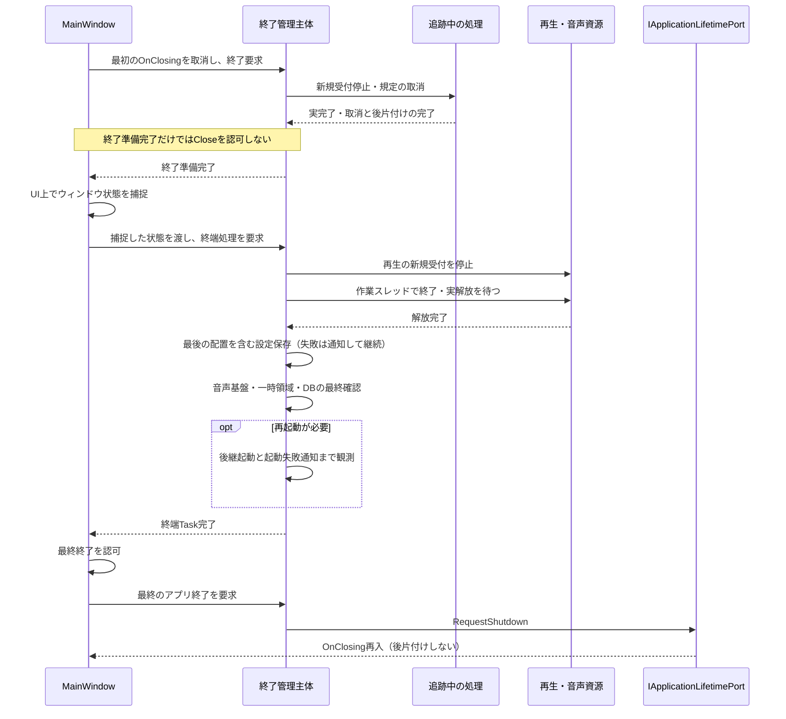

# 終了と再起動

## 目的と適用範囲

通常終了、更新、動作モードの変更を共通の終了処理へ接続し、追跡しているDB・ファイル処理と再生の実完了を待つ契約です。致命的例外やOSによる強制終了に同じ保証はありません。

## 用語

[共通用語集](../glossary.md)を参照します。コードの識別子は原表記を使います。

## 仕様

### 終了要求の受付

通常終了では `MainWindow.OnClosing` が最初の要求を取り消し、`ShellShutdownWorkflowOwner` の終了準備を開始します。準備が済んだだけではウィンドウを閉じず、終端処理のTaskを待ってから最終の終了を認可します。再入した `OnClosing` と `Closed` は後片付けを繰り返しません。

更新は先にパッケージと起動情報を準備し、待機状態の更新プログラムを起動します。その後に同じUI Dispatcherで終了を受け付けます。既知の処理が完了した後に `Proceed` を送り、更新プログラムはその通知と現プロセスの終了の両方を待って上書きします。終了やモード変更が先に受理されていた場合は `Abort` を送ります。

モード変更も同じDispatcherで先着順を確定します。モード変更が先なら、動作モードと履歴表示先の識別に必要な最小の設定だけを原子的に保存し、通常の `MainWindow.Close` へ接続します。他の編集値を保存しません。保存失敗では終了準備へ進まず設定画面へ返します。

終了準備は不可逆です。開始後に更新プログラム等の起動が失敗しても、半分停止したアプリとして継続せず、失敗を記録して共通の後片付けと終了へ進みます。

### 終了開始後の画面反映

最初の終了要求を受理した後に戻る表示専用の非同期処理や遅延Dispatcher処理は、結果を破棄して閉鎖中・閉鎖済みのメイン画面を変更しません。設定画面の表示要求も、UIキューでの実行直前に既存の終了状態を確認します。保留中の画面処理を所有側で取り消せる場合は取り消し、取り消せない場合も反映直前に終了状態を再確認します。メニュー、整列表示、選択・フォーカス、遅れて戻る成功・失敗通知などを終了開始後に新たに画面へ反映しません。

この破棄は表示結果だけに適用します。DB・ファイル・通信などの処理を未完了のまま切り離す理由にはせず、終了準備で待つ対象は引き続き実完了または規定の取消完了まで所有します。終端処理が明示的に行うウィンドウ状態の捕捉と設定保存は、後述の順序に従います。

### 終了準備で待つもの

`PrepareShutdownAsync` は実行中・完了後とも同じTaskを返します。最初に `BMSLibrary.RequestShutdown` と `BMSPlaylist.RequestShutdown` を呼び、新しい処理の受付を止めます。

| 対象 | 終了時の扱い |
| --- | --- |
| 起動時の処理 | 受付時に実行中フラグを立てる `lr2_song_db_sync`、`chart_info_hydration`、`maintenance_hydration`、`installable_maintenance` は依存待ちを緩めて終結させる。各処理は終了要求を確認し、DB・ファイル処理へ入らず状態を戻す |
| その他の未実行の起動処理 | 実行せず `discarded` として終える。終了要求後の新しい受付も行わない |
| プレイリスト・履歴 | 入力構築、絞込み、参照索引の事前計算を取り消し、履歴の条件・表示先更新、参照反映、外部同期、再読込みの後片付け、出力と読込みが終了するまで待つ |
| ライブラリ変更 | 登録済みの通常リネームとその更新、ドロップ導入、保留導入の推定を止めるか実完了まで待つ。リネームの失敗でも残りの待機を省かない |
| 後続のデータ読込み | 譜面情報、保守、スコア、順位などが終了要求を確認して処理を終えられるようにする |
| 同期と接続 | 起動・再読込みのセマフォ、各待機対象、LR2のDB用ロック、追跡済みSQLite接続が未使用になるまで待つ |

IRスコアの事前取得は順位更新の開始前から動くため、その通信Task自体を待機対象に含めます。HTTP本文の受信へ取消を伝え、終了要求後の結果をDBやスコアへ適用しません。利用側の待ちだけを解除して通信を切り離しません。

アプリ内の正常な終了に、時間超過で未完了処理を置き去りにする経路はありません。主処理は60秒、キューと事前計算は20秒を遅延警告の基準にし、超過時に `shutdown wait_slow` を一回記録して待機を続けます。強制終了は外部の責務です。

### 再生の受付停止と終端の順序

`CompleteTerminalShutdownAsync` も同じTaskを共有します。最初の非同期待機より前に再生パネルの新しい再生・操作・自動送りを停止します。UI上でプレイヤーのロックを待ちません。先行していた曲解決が戻っても新しい再生へ進めず、古い終了通知も次曲を開始しません。通常の停止・次曲・プレイヤー変更ではこの終端専用の受付を閉じません。

終端では次の順序を維持します。

1. UI上でウィンドウ状態を捕捉する。
2. プレイヤーの終了と実際の解放を作業スレッドで行い、UIを止めずに待つ。
3. 最後のプレイヤー配置を含む設定をUI上で保存し、失敗通知も処理する。
4. 通常譜面の停止、音声基盤、一時領域、DBの最終確認を完了する。
5. 必要なら後継プロセスを起動し、最終のアプリ終了を要求する。

設定保存の失敗は記録・通知したうえで後片付けを続けます。待機の打切り、プレイヤーの切離し、強制的なネイティブ解放は追加しません。

LR2試聴の終了はプレイヤーの終端かプロセスの終了通知へ合流します。最新XMLの他の値を保って試聴専用の五項目を戻し、復元と所有の解消後にだけ次を受け付けます。設定保存のロック内でUI、プロセス待機、ウィンドウ操作を行いません。詳細は外部起動の仕様に従います。

### 再起動と最終の終了

`IApplicationLifetimePort.RequestShutdown` は、通常の準備と後片付けを通過した後にWPFの終了へ接続する境界です。差し替え可能であっても前段を短絡しません。

モード変更の `RestartApplicationAsync` は、ミューテックスを解放して後継プロセスを起動するだけです。自身でWPFを終了しません。起動失敗の通知の完了・失敗・非表示も観測してから終端Taskを完了します。メイン画面だけがTaskの完了後に終了を認可します。後継の起動と旧プロセスの最終終了が短時間重なることは許容します。

#### 終了準備から真の終端まで

通常終了の制御順を示します。矢印は次へ進める条件、シーケンス内の待機はTaskの実完了を待つことを表し、UIスレッドの同期ブロックではありません。既知の失敗は記録し、規定された後片付けを継続します。`MainWindow` が所有するダイアログ等の終端と、その所有処理・後片付けの収束は、終了準備完了後からウィンドウ状態捕捉までの内部詳細として省略します。

遅延警告の時間を超えても実処理を置き去りにしません。更新の `Proceed` と親プロセス終了の条件は[更新合意](../integration/portable-update.md#終了前の合意)を参照します。

### SQLiteと失敗の観測

`SQLiteConnectionEx` は `ShutdownOperationTracker` で接続の寿命を追跡し、終了準備は接続数0まで待ちます。生の値を読む `GetRawValuesAsString` は例外時も準備済みの文を解放します。接続を閉じる失敗の件数は結果とログに保持します。

終端でのLR2楽曲・スコアDBのロック確認は取得後に必ず解除します。未取得なら遅延警告後も待ちます。これは通常の終了準備後の最終確認であり、先行処理の追跡を代替しません。

統制された終了中に限り、未解放の文・未完了バックアップを理由にしたSQLite接続終了エラーは非常用ダイアログを出さず記録します。通常動作中の同じエラーは抑止しません。

### 保証の範囲

追跡対象は現在把握している長時間のDB・ファイル・通信処理です。全ての `Task.Run` の意味的な安全性を証明する台帳ではありません。新しい長時間処理は終了要求で停止するか、実完了を待つ対象へ登録します。個別の進捗画面が持つ取消もその所有に従います。未処理の致命的例外からの `Environment.Exit(1)` は通常終了の整合性待ちを保証しません。

## 実装とテストの対応

| 仕様項目・主な条件 | 実装箇所 | テスト箇所・確認内容 |
| --- | --- | --- |
| 通常・更新時の終了、再入、UI応答、順序とTask共有 | [`ShellShutdownWorkflowOwner`](../../../BeMusicSeeker/ViewModels/MainWindow/ShellShutdownWorkflowOwner.cs)、[`MainWindow`](../../../BeMusicSeeker/Views/MainWindow/MainWindow.cs) | [`ShellShutdownWorkflowOwnerTests`](../../../BeMusicSeeker.Tests/MainWindow/ShellShutdownWorkflowOwnerTests.cs)、[`MainWindowViewHostTests`](../../../BeMusicSeeker.Tests/MainWindow/MainWindowViewHostTests.cs)、[`ApplicationCompositionTests`](../../../BeMusicSeeker.Tests/MainWindow/ApplicationCompositionTests.cs)。`MainWindowShutdownCapturePrecedesShellCompletion` は終了受付後の即時表示要求と、受付前に予約した遅延表示要求の抑止も確認する。 |
| 終端後の再生禁止、先行の曲解決、通常停止後の再開 | [`PlaybackPanelViewModel`](../../../BeMusicSeeker/ViewModels/Playback/PlaybackPanelViewModel.cs) | [`PlaybackPanelViewModelTests`](../../../BeMusicSeeker.Tests/Playback/PlaybackPanelViewModelTests.cs) |
| 起動処理とプレイリストの終了待ち | [`StartupBackgroundTaskSchedulerOwner`](../../../BeMusicSeeker/ViewModels/Startup/StartupBackgroundTaskSchedulerOwner.cs) | [`StartupBackgroundTaskSchedulerOwnerTests`](../../../BeMusicSeeker.Tests/Startup/StartupBackgroundTaskSchedulerOwnerTests.cs)、[`PlaylistShutdownCoordinatorTests`](../../../BeMusicSeeker.Tests/Playlist/PlaylistShutdownCoordinatorTests.cs) |
| 試聴の設定復元、開始前と開始後の失敗 | [`ExternalPlayerProcessGateway`](../../../BeMusicSeeker/Models/Utils/Processes/ExternalPlayerProcessGateway.cs) | [`ExternalPlayerProcessGatewayTests`](../../../BeMusicSeeker.Tests/Processes/ExternalPlayerProcessGatewayTests.cs) |
| 拡張データ削除の受付、保存失敗、LR2既存テーブルの保護 | [`ApplicationDataUninstallWorkflowOwner`](../../../BeMusicSeeker/ViewModels/Settings/ApplicationDataUninstallWorkflowOwner.cs)、[`LR2SongDB`](../../../BeMusicSeeker/Models/LR2/LR2SongDB.cs) | [`ApplicationDataUninstallWorkflowOwnerTests`](../../../BeMusicSeeker.Tests/Settings/ApplicationDataUninstallWorkflowOwnerTests.cs)、[`LR2SongDBExtendedUninstallTests`](../../../BeMusicSeeker.Tests/Lr2/LR2SongDBExtendedUninstallTests.cs) |
| 再起動の引数、実行パス、作業ディレクトリと引渡し順 | [`ApplicationRestartRequest`](../../../BeMusicSeeker/Models/Utils/Processes/ApplicationRestartGateway.cs)、[`ApplicationRestartArgumentsPolicy`](../../../BeMusicSeeker/Models/Utils/Processes/ApplicationRestartGateway.cs) | [`ApplicationRestartGatewayTests`](../../../BeMusicSeeker.Tests/Processes/ApplicationRestartGatewayTests.cs) |

## 関連資料

[起動](startup.md)、[設定](settings.md)、[音声基盤](audio.md)、[外部起動](../ui/external-launch.md)、[自動更新](../integration/portable-update.md)を参照します。
