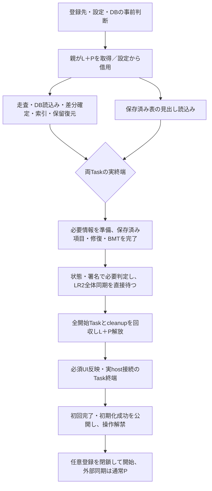
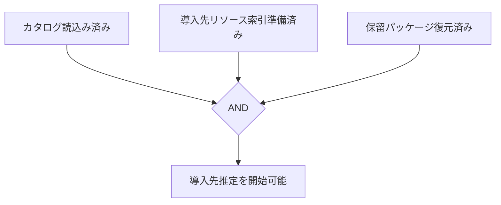

# 起動・初期化・再読込み

## 目的と適用範囲

ライブラリの構築、操作可能になる条件、必須処理と後続処理、各種再読込みの範囲を定めます。起動を単一の完了時刻で表さず、実際に利用できる機能と処理の所有者を区別します。

## 用語

[共通用語集](../glossary.md)を参照します。コードの識別子は原表記を使います。

## 仕様

### 起動の流れと完了境界

登録先・設定・DB構造・修復可否・終了の事前判断後、親が既存L＋Pを一度取得します。設定適用では呼出元の生存権限を借用します。独立したファイル走査・DB読込みと保存済みプレイリストの見出し読込みを並列に進め、正本変更は明示した依存順で確定します。並行読取りの合流後に出力ルートの登録修復を同じプレイリスト管理主体で確定します。必要な譜面情報・ハッシュ・保存済みスコアが利用可能になってから項目、カスタムフォルダ修復、BMTを直接待ち、必要なLR2全体同期の実終端へ進みます。

通常起動、初期設定、All再構築は同じ完了境界を使います。coreは構成・player置換・ローカル準備・必要LR2・cleanupの実Taskを待ち、その回の捕捉設定、既存操作token、元の実失敗を変更不能な局所結果として返します。coreでは初回完了・成功property・解禁・任意処理の登録完了を公開しません。設定からの借用では外側の実L/Pも解放してから、同じ非同期の終端処理を待ちます。共有の保留設定や別の完了flagは持ちません。

UI抑止解除は必ず行いますが、flushの予約だけを完了にしません。親解放後、既存UI schedulerの実Taskで必須表示と実player host接続を終え、それから初回完了・成功を公開して入力を解禁します。host接続の開始を成功property通知に依存させません。独立folder最終read・遅延表示の収束は待ちません。終了による取消、実UI/host失敗、通知の失敗は通常起動と設定の既存失敗処理に返し、finallyからの例外で通知を迂回しません。非OCEの実失敗は同時終了でも失敗として保持し、終了開始後の新しい失敗画面は開きません。受付外の警告から新しい明示操作が始まった場合、旧局所結果は既存tokenの確認で新操作の完了・解禁に使いません。

必須UI成功と解禁の後、停止中schedulerへ外部一覧・事前計算・必要な外部同期をそろえて登録し、登録を閉鎖してから開始します。既存SchedulingCompleteのGC依存は維持しますが、起動成功の根拠にはしません。ready記録、stopwatch、dirty maskやscheduler idleを機能の完了判定にしません。外部同期はその開始時に通常の新規Pを取得し、解禁通知から新操作が先着した場合は通信前に見送ります。P解放後の自動再投入は行いません。

全体同期が必要なら修復と同じ生成・検証経路で完全な面を一度だけ準備し、今回の結果を同期へ渡します。部分修復を完全な入力の証明へ読み替えません。全体同期不要・単独動作でも必要な修復とBMTを保ち、不要なLR2段階を待ちません。外部同期には保存済み表を使った必須起動の後で進み、ネットワーク待ちを操作解禁条件にしません。

| 記録名 | 成立する状態 |
| --- | --- |
| `startup_install_estimation_ready` / `startup_install_ready` | 所持目録、リソース索引、保留パッケージが揃い導入先推定を開始できる |
| `startup_ready_data` | 導入判定に必要なデータが揃う |
| `startup_ready_ui` | 必須の初期表示を適用済み |
| `startup_ready_install` | 導入先表示の適用を計測する |
| `startup_ready_operable` | 必須処理・親受付解放・必須UI/hostを終え、通常入力を解禁したことを計測する |
| `startup_initialization_complete` | ローカル準備・必要LR2の終端・操作解禁へ到達する。LR2単独失敗は独立結果に残す |
| `startup_post_initialization_maintenance_complete` | 登録済み後続と任意事前計算が収束する |

ローカル必須処理の失敗ではLR2へ進まず、既存の失敗・設定修復経路へ返します。一方が失敗しても開始済みの相手Taskを回収してから受付を解放します。ローカル成功後のLR2だけの失敗は、ローカル確定と永続失敗記録・通知を保持して通常操作を解禁します。結果の`Outcome=Succeeded`はローカルと必須UIの成立を示します。通常起動のboolは必須処理と通知が失敗なく終了したかを表し、操作可能性の判定には使いません。初回案内だけの失敗はfalseと元失敗を返しますが、公開済み成功・初回完了・解禁は維持します。LR2単独失敗は別結果に記録・通知し、ローカルと必須UIが成立すればtrueです。次回起動・設定画面の手動同期は新しい入力から始め、自動再試行・途中再開・巻戻しを行いません。

LR2失敗の保存・公開は既存のLR2管理主体で終結し、既に確定した`Failed`/`Incomplete`を上書き・重複通知しません。起動・再初期化の本番呼出元は型付き結果のLR2失敗を確認し、同主体の現在の状態を既存の進捗表示へ渡します。表示用の別状態保持層は作りません。終了による取消はこの非致命的な失敗へ変換せず、既存の`ShutdownRequested`へ伝播します。開始済みTaskとcleanupを待ち、親受付を解放しても、初回完了・通常操作解禁・外部同期投入には進みません。設定の借用権限による初期化と、受付解放後の完了コールバックにも同じ条件を適用します。

任意の譜面情報補完は、候補要約のDB読取りも既存の`chart_info_backfill`後続で行います。必須hydrationは必要な保存済み情報の反映を終え、同じ発生元を後続へ渡して終端します。後続は親受付の解放後にLを取得し、候補要約から既存補完の実終端まで処理します。停止中scheduler、保持された候補要約、後続の未完了を必須出力・LR2の開始条件にせず、追加の依存stageや共有保留台帳は持ちません。終了が先着した後続はDB要約・実補完を開始しません。

確定済み一覧の閲覧・検索と独立したフォルダ最終読取りは必須処理の終端を妨げません。変更操作はL/Pで拒否し、UIスレッド・DBトランザクション・モデルロックを持ったまま別主体の完了を同期的に待ちません。設定の閲覧・編集・取消と、Busy時のdraft保持を維持します。

初回の完了案内は必須ローカル準備と操作解禁後です。既存dialog serviceの実Taskとして終端を待ち、案内の失敗は成立済みのlocal/UI成功・初回完了を取り消さず、変更不能な結果の元例外と既存失敗通知で保持します。終了や旧tokenでなければ、案内の失敗後も任意登録を閉じてschedulerを開始し、未始動queueを残しません。案内から次の明示操作へ再入した場合も旧tokenから後続を投入しません。LR2単独失敗でもローカル準備成功の意味を維持し、外部同期や保守の完了を案内しません。後続の終了記録はschedulerで追跡する順位・XML取得の実終端を含み、独立readerの表示収束は含みません。

### 有限の入口と段階選択

| 入口 | 必須の範囲と既存との差分 |
| --- | --- |
| ContentRenderedの通常起動、初期設定OK | 事前判断、構築、保存データと必要差分、出力、必要LR2、実UIと必要host。初期設定はSave、実Close・modal cleanup、保存案内を先に終え、外側の生存権限を借用します。 |
| Settings All、ScoreとFolderの組合せ | 保存成功と適用配置公開、実Close・DataContext解除・modal cleanup後に、新設定の構築と同じ必須手順。必要な旧出力配置移行は一回行い、旧モデルのplayer・LR2・BMTを重複実行しません。 |
| ツリー全再初期化 | 既存組の目録・全走査・保存スコア・保留、必要出力とLR2、実UIを同じ終端へ合流。新組構築・player接続・初回案内・外部catalog取得を追加しません。 |
| Folder、検索root追加・解除、ツリー差分 | 再生停止、必要差分・LR2・参照・実表示。全目録・保存ヘッダー・全表出力を無条件に追加しません。 |
| ScoreOnly、履歴schema変更後 | 保存スコア・schema結果・スコア投影・必要表示。IR・順位は後続で、ファイル走査・全表出力を追加しません。 |
| 明示の表一覧再読込み | 保存見出し・entries、利用者が要求した外部同期・必要出力・参照・実表示を同じPの実Taskで待ちます。 |
| 再読込み不要の設定 | 保存成功・適用配置公開と実Close後に、分類されたruntime・出力反映だけ。起動成功公開を追加せず、URL補完等は受付外の後続へ渡します。 |
| 手動LR2、モード切替、更新確認 | 既存の独立寿命を維持。手動LR2は設定画面終了後の新規force要求、モード切替は通常shutdownによる回収後に新プロセスを起動します。 |

通常設定は保存自体の成功後に実Closeを終え、必要な移行・再読込み・実UIをメイン画面で追います。正常Closeは受理Taskを取り消さず、同じL/Pを必須処理とcleanupまで保ちます。保存失敗と未開始Busyでは閉じず、draft・部分保存事実を保持します。通常保存後のlocal/UI異常だけで設定を自動再提示せず、元原因を通知します。初期構成不足と前段検査に対する既存設定案内は維持します。

### モデルの組と任意処理の寿命

既存の構築ownerが設定・schema・standalone DB・profile・バックアップの判断と順序を持ち、画面は購読・一覧・ツリー・host接続を担当します。親L＋P内で必要な旧配置移行後に新LibraryとPlaylistの組を構築し、成功した組だけを接続します。新組構築失敗では旧組を停止しません。成功後は捕捉した旧組へモデル固有の停止を通知し、停止済み旧組への巻戻しはしません。親内でnetworkやscheduler全体のidleを待ちません。

モデル固有の停止・CTSと構成の共有L/P受付閉鎖を分離します。共有閉鎖はアプリshutdownだけで行います。L待ちの旧workerは取得後に自モデルの停止を再確認し、DB確定をせず既存cleanupへ終端します。現在モデルの受理済み背景入力はBusyで捨てず、既存Lを待って実行します。URL通信は既存のモデルtokenと通信後の停止確認を使います。

chart_info backfillと候補要約、保守、installable、IR・順位、URL補完、外部catalog、自動外部同期、GC、warmupは実UIと成功公開後に明示登録します。IRの通信・parse・cache読取りはLなしで行い、正本DB更新・cache Upsert・モデル確定だけL内で行います。取得後の停止・score context確認で旧結果の新組への保存を止め、通信から末尾の確定までschedulerの一つのworkに含めます。共有prefetch／consume状態を持ちません。

公開モデル初期化も同じ名前付き保存データ・走査投影手順へのadapterです。意味を持つcontinuation入力は全開始Taskを回収します。走査の正常・空・incomplete・例外では先行列挙・mtimeの全開始Taskとcleanupを回収してから返します。警告は今回の小さい局所結果として受付外へ持ち出し、元失敗を後発の通知取消で隠しません。

### 登録ディレクトリの検査

`InitializeAsync` は設定を捕捉した後、出力検索ルートの自動修復より前に、全ての登録BMSルートを作業スレッドで検査します。LR2連携では通常・追加・ルート形式の出力基点も含めます。起動時走査を無効にしていても省略しません。

LR2連携では、検査要求を作る前に `LR2Config.TryLoad` で設定XMLを読み込みます。パスの未設定・不正、ファイルの欠落・読取不能、XML不正、必要な `config/jukebox` 要素の欠落は通常の設定不備です。検査入力を構成できない状態を空の登録ルートや検査成功に置き換えず、設定案内へ戻します。初回かつ全項目が空の場合だけに限定した例外扱いはしません。

通常の起動入口 `InitializeAsync` で設定不備が見つかった場合は、排他とUI抑止を解放してから、初回なら言語選択、それ以外なら通常の設定確認の警告と設定画面へ案内し、`false` を返します。設定保存から開始した初期化では、初回フラグが真でも言語選択へ戻さず、設定確認の警告を表示して、`ISettingsDialogStatePort.InitializeLibraryAsync` から 型付き結果の`Outcome`に`StartupInitializationOutcome.SettingsRequired`を返します。出力検索ルートの修復・保存、DB処理、モデル構築、走査へ進みません。想定済みの入力不備だけをこの経路で扱い、それ以外の例外は予期しない失敗として通知・記録します。

初期化内部の設定準備・モデル構築・ファイル初期化からは設定画面を開きません。通常起動の失敗は外側の初期化入口が排他を解放してから案内します。設定から開始した場合は結果と後片付けを呼出元へ返し、初期構成不足だけを既存の再編集案内へ戻します。通常保存後の異常で自動再提示せず、元失敗を通知します。成功、設定修復が必要な失敗、既に要求した終了を区別し、終了要求を設定画面への復帰に読み替えません。初期化の排他や保存中状態を保持したまま新しいモーダル設定画面を待ちません。

LR2連携の通常起動の必須処理が正常に終端し、その初期化で捕捉した `LR2RootPath` が空なら、親受付とライブラリ表示更新の抑止を解放し、必須UI・成功公開・操作解禁の後に起動継続可能な警告を一回表示します。警告は、LR2のスコアDBの場所を解決できずLR2のスコアDBを利用できないこと、LR2バックアップやLR2標準カスタムフォルダの検出で予期しない動作になり得ること、設定画面でLR2ディレクトリを設定すべきことを伝えます。OKで閉じた後も初期化成功を維持し、設定画面を自動では開きません。

この警告は `LR2RootPath` が空の通常起動ごとに表示し、抑止する永続設定は持ちません。単独動作、ルート設定済み、設定画面から保存後に呼び出す `ISettingsDialogStatePort.InitializeLibraryAsync` では表示しません。必須設定不備を `SettingsRequired` として扱う経路とは区別し、空のルートを別パスから推測して補いません。

ディレクトリ検査と設定全体の検証が成功してから出力検索ルートを修復します。修復とライブラリのプロファイル構成には、ディレクトリ検査で読み込んだ同じLR2設定を渡します。これらの処理のためにXMLを再読込みせず、検証前の保存も行いません。

利用不能なら設定修復・保存、単独動作DBの作成、構造修復、モデル構築、バックアップ、最適化、走査、後続処理へ進みません。初期化の排他とUI抑制を解除してから一回だけ警告します。通常の起動入口は `false`、設定保存側の入口は 型付き結果の`Outcome`に`StartupInitializationOutcome.SettingsRequired`を返します。設定画面への案内は上記の呼出元の分担に従います。欠落登録を自動で外さず、修正・再接続後のOKで新しい入力を確認して再試行できます。

モデル初期化と差分反映前にも同じ検査を使います。内側の型付き停止は外へ伝え、外側で解放後に通知します。この段階ではDB構造等が既に変わっていることがあるため、「副作用が全くない」とは案内しません。停止後に成功記録や成功後の処理を公開しません。

### 動作モード

| モード | 楽曲DBとルート | 外部連携 |
| --- | --- | --- |
| LR2連携 | 保存済みのLR2楽曲DBと設定XMLの検索先を使う | LR2のカスタムフォルダ、バックアップ、IR・順位更新を許可する |
| 単独動作 | アプリ内の `data/song.db` と複数の登録ルートを使う | LR2の実出力・XML変更・バックアップ・IRは行わない。明示設定がある場合だけbeatorajaのスコアを使う |

単独動作DBはAppDataではなくポータブルなアプリデータです。ディレクトリ、DB、ライブラリ、プレイリスト、BMSONと譜面情報の構造を順に作ります。LR2互換の構造と出力設定値は保持できますが、実際のLR2出力は行いません。

単独動作のルートは複数登録でき、存在するパスの正規化と大小文字を無視した重複排除を行います。利用者が登録した親子や用途の単位を勝手にまとめません。旧 `BMSRootPath` はルート一覧が空で実在する場合だけ初回移行に使います。新規導入先は登録ルートのいずれかを必須とします。

有効な実行中モードの切替はプロセス再起動です。設定の変更意図に対する確認・先着受付・最小設定の保存と終了は、設定と終了の仕様に従います。同じプロセスの再初期化でDB所有や連携先を差し替えません。まだ有効なモードが一度も成立していない初回・検証失敗時は、編集値を選んで保存した後に同じプロセスで初期化できます。

初回の言語選択は `InitialSetupLanguageDialog` で行い、次にメイン画面を所有元とする設定画面を開きます。一般の設定不備は通常の確認画面で案内します。必須設定が揃うまで初回走査を開始しません。LR2bodyのプレイヤー選択はライブラリのモードとは別で、単独動作でも使用できます。

### DB構造の確認と修復

`AppSchemaPreflightService.Inspect` は読み取り専用です。既存 `playlist_entry` のSHA-256対応やアプリ構造の版更新が必要なら警告します。完全な初回DBへアプリ用の構造を追加するだけの場合は互換性警告を出しません。補助表・索引の欠落や非互換は修復しますが、ハッシュ対応行の充足率は構造確認に含めません。

`EnsureAppOwnedSchema` / `RepairAppOwnedSchema` はアプリ所有の表・索引を揃え、`app_schema=1` を記録します。既存のMD5・SHA-256対応を保持します。`BmsLibraryDbGateway` の一つの外側トランザクションが全変更を所有し、借りた接続を使う参加処理は確定・取消をしません。途中失敗では全体を戻し、最初の例外を伝えます。

修復後は必ず再確認し、未収束なら起動失敗です。後の譜面情報読込みを構造修復の代わりにしません。構造修復のために楽曲全件や実ファイルからSHA-256を計算せず、実際に譜面を読む差分・導入・補完へ任せます。

### LR2閏年日時修復の判断と終端通知

通常起動、設定の初期設定・All再構築、ツリーと公開APIの全再初期化は、既存の設定検証・未設定案内を終えてから共通の限定前段を使います。読取専用接続でfolderのtype=1、date未設定または負値、正常範囲のadddateを持つ保存行だけを読み、絶対pathで実在するフォルダのmtimeが閏年2月29日から3月2日未満か確認します。相対pathや異常adddateの行はその回のmtime確認に含めず、通常の日時・path補正へ残します。候補読取はsongや譜面情報をロードせず、DB・schemaを作成・修復しません。

候補の保存列・exact-path・mtimeを変更不能な要求に捕捉し、L＋Pを取得する前、設定適用では保存前にNo既定のYesNoを確認します。Yesだけを修復対象とし、No・取消・閉じた確認でも初期化を継続します。確認待ちの予約はなく、Busyでは保存・修復を始めません。取得後に既存の対象限定再検証を行い、保存行の差替え・列の変更・mtime変更は見送ります。別の対象を読み替えたり、自動で確認を再試行したりしません。修復と通常ロード・走査・必要出力・LR2・cleanupは一つの親操作内に保ちます。

実修復は部分成功を保持し、対象ごとの失敗は元のpathと原因を通知します。修復成功がある場合、または検出があり承認候補がない場合に既存の閏年警告を提示します。警告・失敗通知はL/P、writer保護とDBトランザクションの外で行い、通知から新しい明示要求を受け付けられます。後段の失敗・終了で捕捉済み通知を成功結果に読み替えず、終了時は既存の終了要求の扱いに従います。通知のAppClosingと既知の終了は取消へ伝え、同時のFailed・OwnerUnavailable・nullや元の初期化失敗を終了フラグで隠しません。

候補読取・確認待機の成功後から親受付までに終了が先着した場合は、受付閉鎖を他操作のBusyと区別し、起動では`ShutdownRequested`へ返します。設定適用では保存・修復・設定再表示を開始せず、ツリー再初期化も未開始で終端します。初回完了・通常操作解禁・外部同期投入へ進みません。実際のDB読取・画面障害を、事後の終了フラグだけで取り消しへ置換しません。

### 補助メタデータの取込み

配布された譜面情報は起動時のDB読込み前に取り込みます。取込み済みのファイルは `imported_metadata/` の同名の管理キャッシュへ移します。`chart-info-metadata.7z` または `.db` をルートへ戻せば再取込みできます。再初期化と差分再読込みでは再取込みしません。

配布情報の `chart_info_schema_version` は輸出入形式の版であり、アプリDB構造の版とは別です。取込みをDB構造の修復や所持判定の代わりにしません。

### 目録とファイルの読込み

楽曲・BMSON・ハッシュ対応をDBから読み、スコアの取得元を選びます。LR2のIR取得と順位更新は必須UIと操作解禁後に一つの任意処理として開始します。単独動作でbeatoraja無効ならスコア取得元はありません。

ファイル列挙は `EBridge_ScanChartAndResources` を使い、Everythingが利用できない場合だけ同じ契約のマネージド走査を使います。古いDLLやABIの不一致への互換代替は持ちません。ネイティブ橋渡しとC#は同じ成果物として配布します。

通常走査は音声・画像・動画の譜面相対キーと逆引き索引まで完成させます。未完成で導入可能とせず、保留バッチへ遅延構築を押し付けません。ネイティブ経路は復号済み配列から索引を作り、中間のリソース辞書を実体化しません。マネージド走査と検証用の結合経路だけが辞書を持ちます。

列挙した譜面時刻、テキスト、フォルダ時刻、LR2出力情報は[LR2同期仕様](../integration/lr2-song-db.md)の生産側契約へ従います。通常差分の意味とLR2派生行の修復を混ぜません。LR2の同期未完了だけを理由に通常差分を全件更新へ変えません。並行する読込み・探索は別の表示行へ投影し、確認対象・解析対象・実変更数の表示と診断は[進捗](progress.md)・[ログ](../core/logging.md#初期化探索同期の記録)に従います。

### 導入とプレイリストの準備完了

`StartupInstallReadinessState` は `CatalogLoaded && DestinationResourceIndexReady && PendingPackagesRestored` で導入先推定を許可します。スコア、順位、譜面情報、保守、プレイリストの読込みはこの条件に加えません。明示的に起動走査を省略してリソース索引がなければ、推定は `resource_index_unavailable` として利用不能になり得ます。

次の矢印は導入先推定を始めるための必要条件です。ANDの三条件だけを表し、通常入力の解禁や起動全体の完了とは同一視しません。

保留復元は復元だけを行い、自動推定を開始しません。復元した対象は[明示的な手動推定](../library/install-estimation.md#自動推定と並列処理)で扱います。保留復元は既存行のパスを正規化し、完全一致で先着を残します。大小文字だけの違いは別の保存識別で、ドットや末尾の表記差は正規化後の衝突として扱います。不正・欠落・譜面なしと重複の生行を既存トランザクションで削除し、残す正規行を書き込みます。パス以外の `delete_parent` 等は生存行から保ち、確定後に保留状態を公開します。

`StartupReadinessCoordinator` はプレイリストの必須読込みと外部・おすすめの取込みを管理します。準備中も取込み要求を順番に受け付けますが、通信、解析・保存、公開集合の変更は準備完了まで開始しません。呼出元を同期的に待たせず、準備後に一つの実行処理で順に扱います。

初期化失敗では準備待ちと受理済み要求を同じ失敗で終結させ、受付の再開や空の成功結果を公開しません。終了では未開始の受理結果を取消の通知より先に終結させ、実行中の要求は実行側の `finally` まで所有します。取消コールバックの失敗でも他のコールバックを試し、最初の失敗を保持します。遅れて戻る通信や初期化の継続からDB・公開状態を変更しません。

### 必須の処理と後続処理

必須手続きは`StartupLibraryInitializationWorkflowOwner`が直接Taskを待ち、完了を登録名、登録閉鎖、scheduler全体のidleから推測しません。親進捗は必要な実UIまで直接待った手続きの終端で完了し、scheduler全体のidleや任意段階を分母・完了条件へ加えません。操作解禁後に既存schedulerを開始し、URL補完、外部同期、表示cache、独立した導入可能保守、GCを固有の依存で扱います。

必須の譜面情報と保存済みスコアは停止中schedulerを待たず同じ親操作で準備します。後続の譜面情報補完は既存の要求識別・cache失効を使い、初期化の成功条件へ足しません。内部継続は親の生存権限を借り、Busyで省略しません。

フォルダツリーの最終読取りは独立し、遅くても操作解禁を止めません。任意の表示事前計算は成功公開後の明示した一括登録に含め、固有の先行依存とその実終端を後続完了へ含めます。ログから追加登録しません。

### 読込みと表示への反映

読み取り専用処理は接続を閉じてから所有状態・索引・画面へ反映し、内部で構造修復や暗黙の書込みをしません。SQLiteの結果判定、接続設定、保守の有効性は[データと索引](../core/data-and-indexes.md)に従います。

譜面情報は両モードで実際のDB行と現在の失敗記録を照合します。LR2同期の完了行は譜面情報の現存を証明しません。全対象が現在の値を持つと確認できた場合だけ補完を省きます。部分的な既存BMSの更新は譜面情報由来の9列に限定し、BMSONからLR2楽曲行を作りません。

情報追加後の表示は、現在の並べ替え・絞込み・列への依存で判断します。不要な全件再構築をせず、基本値の順序を捨てません。起動中に抑止した必要な一覧・保留・保存済み参照の表示は、親解放後の同じ要求の実UI Taskへ集約します。選択中詳細は実buildと適用の終端まで待ち、予約だけで完了にしません。途中で選択が変わった要求は既存の対象一致条件で誤適用せず終端し、無関係な最新build全体を待ちません。実処理失敗は後発のobsoleteで隠しません。通常の起動でリソース変更を全件再評価せず、明示再走査が選択譜面または所持全件を扱います。

### 再読込みの範囲

| 操作 | 行うこと | 行わないこと |
| --- | --- | --- |
| `FullReinitialize` | DBとファイルから目録を再構築し、必要な補完を行う | 実行中モードの切替、補助メタデータの再取込み |
| `ReloadFileDiff` | メモリ目録と新しい走査を比較し、追加・更新・削除、索引、参照を反映する | 楽曲DB全体の再読込み |
| `ReloadTables` | 見出し、項目、参照を読み直し、その後に外部同期を実行する | スコア・順位の読込み |
| `ScoreOnly` | 保存スコアの取得元、スナップショット、投影と必要表示。IR・順位は後続 | プレイリスト見出し・項目・外部同期の再読込み |

これらは同じセマフォで直列化します。新規dispatchは必須初期化中に停止し、実UI・成功公開・現行token確認後の登録閉鎖と開始へ揃えます。開始済み旧仕事は元の識別で終端まで追跡し、Resetで旧要求の世代・versionを付け替えません。検索ルートの追加・削除は保存後に実行中の検索先を同期して差分を再読込みします。外部のDB編集を取り込む場合は差分更新ではなく再初期化を使います。

差分0件なら差分由来のDB確定・譜面情報・保守計算を行いません。成功した走査が0件でも既存の保存譜面がある場合は削除の正本にせず、DB・LR2同期・メモリ置換を止めて設定と検索状態を確認する警告を出します。新規の空DBは空ライブラリとして許します。判定は `ScanSource` を使い、診断用のフラグから推測しません。

通常差分と手動差分は同じ[譜面読込み](../library/chart-file-reading.md)を使います。LR2フォルダの準備済み反映がある場合、保存成功後に差分完了を進め、表示排出の順序へ依存させません。反映失敗で成功完了を進めません。詳細は[進捗](progress.md)に従います。

テーブル再読込みは自動対象を外部同期ONかつ絶対URIのものに絞ります。単体・選択範囲の手動再読込みは外部同期設定によらず選択を対象とし、並列数を制限した共通処理を使います。失敗は個別画面を乱発せず、ログと一覧の状態へ集約します。項目の反映コールバックまで完了してから外部同期へ進みます。

### 利用者が起こす入力再読込みの受付

ライブラリツリーの差分再読込み・再初期化は、共通論理受付を待たずに取得します。推定・変更・受理済み背景入力更新中はBusyで拒否し、再生停止・モデル変更を始めません。受理後は既存の試聴停止gateで準備・受理済みNextの実終端を待ち、入力変更・必須反映・後片付けまで同じ受付を保持します。設定適用からの差分再読込みは、設定側が所有する受付の内部継続として実行します。再初期化も今回の型付き結果で必要出力・LR2の実終端を待ちます。差分再読込みは既存の変更範囲を保ち、今回の結果をLR2へ直接渡します。

受付の標準構成接続は [`ApplicationCompositionTests`](../../../BeMusicSeeker.Tests/MainWindow/ApplicationCompositionAdmissionTests.cs) の `StandardComposition_RejectsCatalogPlaybackAndSettingsBeforeSideEffectsWhileKeepingDraftAndSelection`、再読込み・設定適用の成否と終端は既存の再読込み・設定完了テストで確認します。

差分再読込みと全再初期化でディレクトリ検査が失敗した場合は、再生停止・UI更新抑制・進捗状態・実処理の後片付けを終え、共通論理受付を解放してから警告を表示します。警告からの明示再試行を受け付け、元の失敗は通知後も伝播します。Settingsからの差分再読込みは同じ受理操作の内部継続として受付を取り直さず、外側の保存・反映・後片付けが終端して受付を解放した後に一度通知します。

起動全体同期・条件付き差分同期・任意外部同期の開始判定と必須継続は[競合ポリシー](../core/operation-concurrency-policy.md)に従います。scheduler登録だけからCompletedを強制せず、実施済み差分と参照更新の事実を保持します。

設定からの全再構築では、標準構成が共有するライブラリ・プレイリスト受付の生存権限を、新しく構築する個別ライブラリ・storeへ明示転送します。LR2処理主体、DB、終了状態と再接続識別は個別に保ち、共有受付の一致だけで旧storeの対象を再び許可しません。初回構築と再構築のどちらも実モデル初期化・必要後処理を待ち、同じ受付を取り直したり自分の終端を待ったりしません。

## 実装とテストの対応

| 仕様項目・主な条件 | 実装箇所 | テスト箇所・確認内容 |
| --- | --- | --- |
| 必須実終端・親解放・必須UI/host・成功公開・任意開始の統合 | [`MainWindowViewModel`](../../../BeMusicSeeker/ViewModels/MainWindow/MainWindowViewModel.cs)、[`ISettingsDialogStatePort`](../../../BeMusicSeeker/ViewModels/Settings/ISettingsDialogPorts.cs)、[`MainWindow`](../../../BeMusicSeeker/Views/MainWindow/MainWindow.cs) | [`MainWindowViewModelStartupProgressTests`](../../../BeMusicSeeker.Tests/MainWindow/MainWindowViewModelStartupProgressTests.cs) の実起動UI gate、UI失敗と次受付、UI/置換中の終了、解禁後の初回案内失敗、閏年警告再入、解禁後外部同期Busy、任意work保持と独立folder read。旧private ready/失敗提示ケースを置換する。設定は`SettingDialogEditCompletionTests`のInitialLr2とDefaultAll、hostは`MainWindowViewHostTests.MainWindowRenderedInitializationAttachesCreatedPlaybackHost`が実接続を分担する。 |
| 必要表示の実applyと独立表示準備の分離 | [`MainWindowViewModel`](../../../BeMusicSeeker/ViewModels/MainWindow/MainWindowViewModel.cs)、[`PlaylistWorkspaceViewModel`](../../../BeMusicSeeker/ViewModels/Playlist/PlaylistWorkspaceViewModel.cs) | `SettingDialogEditCompletionTests`の実All代表は現行Library Aから新Library Bへの実一覧行の反映を必須UI終端後に確認します。[`PlaylistWorkspaceDetailRefreshTests`](../../../BeMusicSeeker.Tests/Playlist/PlaylistWorkspaceDetailRefreshTests.cs)は同じ実build/apply Task、選択変更後の非適用と元失敗保持を分担します。`MainWindowViewModelStartupProgressTests`は独立folder readerの保持を成功条件にしないことを確認し、必須UI前のBusyと成功公開後の余韻・任意workでの非Busyを実owner接続で確認します。 |
| 走査の早期returnと開始済み子Taskの回収 | [`LibraryFileScanPipelineOwner`](../../../BeMusicSeeker/Models/BmsLibraryInternal/Scanning/LibraryFileScanPipelineOwner.cs) | [`LibraryFileScanPipelineOwnerTests`](../../../BeMusicSeeker.Tests/Scanning/LibraryFileScanPipelineOwnerTests.cs)の実scan失敗代表は開始済みmtime Taskを保持し、失敗後も回収前に返らず元の失敗と確定済み目録を保持することを確認します。制御点のDB読取りを保持しても、失敗経路はDBを取得せず実子Taskのjoinに到達します。空・incompleteの既存データ保護、解析失敗、公開continuationの失敗時joinは既存モデル・初期化serviceケースへ分担します。一般idleからTask完了を推測しません。 |
| 閏年候補の限定読取、選択、対象再検証、部分成功と受付外通知 | [`BmsLibraryInitializationService`](../../../BeMusicSeeker/Models/BmsLibraryInternal/Startup/BmsLibraryInitializationService.cs)、[`BMSLibrary`](../../../BeMusicSeeker/Models/Library/BMSLibrary.cs)、[`StartupLibraryInitializationWorkflowOwner`](../../../BeMusicSeeker/ViewModels/Startup/StartupLibraryInitializationWorkflowOwner.cs) | [`BmsLibraryInitializationInstallTests`](../../../BeMusicSeeker.Tests/Startup/BmsLibraryInitializationInstallTests.cs)と[`BmsLibraryInitializationLoadTests`](../../../BeMusicSeeker.Tests/Startup/BmsLibraryInitializationLoadTests.cs): folderだけの小DB・未作成DB・非対象日時、実FS/保存列、Yes/No/取消、mtime・行差替え、部分失敗、公開初期化と通知再入を確認。[`SettingDialogEditCompletionTests`](../../../BeMusicSeeker.Tests/Settings/SettingDialogEditCompletionTests.cs)の`LeapYearRepair_ActualInitializationEntriesConfirmBeforeBothAdmissionsAndNotifyAfterTermination`: 実compositionの初期設定・All再構築・通常起動・ツリー再初期化で保存前/受付外確認、同じL/P内の実修復、解放後通知、Busy副作用なし・無予約・次の明示要求、確認Task保持中の終了による未開始・完了案内と再表示なしを確認。同クラスの非WPFケース`LeapYearPreparation_ShutdownDistinguishesClosingAndPreservesActualDialogFailure`で終了専用の画面結果と元の表示障害・原因を区別する。 |
| 必須hydrationと任意補完の候補要約の分離 | [`CatalogChartInfoOwner`](../../../BeMusicSeeker/Models/BmsLibraryInternal/Catalog/CatalogChartInfoOwner.cs) | [`ChartInfoInlineHydrationTests`](../../../BeMusicSeeker.Tests/ChartInfo/ChartInfoInlineHydrationTests.cs)の`RequiredHydration_DefersCandidateSummaryAndBackfillWithOriginalRequest`: 実DB・生産側ownerで候補要約を保持しても必須データの反映と終端を保ち、後続の実補完・同一発生元・開始/終端識別・終了が先着した場合の見送りを確認。[`StartupBackgroundTaskSchedulerOwnerTests`](../../../BeMusicSeeker.Tests/Startup/StartupBackgroundTaskSchedulerOwnerTests.cs)は補完を保持しても必須idleが成立する後続分類と、未開始補完の終了時破棄・必須処理のdrainを確認。 |
| 設定保存後の初期化失敗と画面への復帰 | [`MainWindowViewModel`](../../../BeMusicSeeker/ViewModels/MainWindow/MainWindowViewModel.cs)、[`SettingsDialogViewModel`](../../../BeMusicSeeker/ViewModels/Settings/SettingsDialogViewModel.cs) | [`SettingDialogEditCompletionTests`](../../../BeMusicSeeker.Tests/Settings/SettingDialogEditCompletionTests.cs) の `ApplySettingsAsync_InitialDirectoryFailureReopensOnceAfterCleanupAndCanRetry` と `InitializeAsync_ConstructionFailurePresentsAfterBothAdmissionsAndProgressCleanup`: 実際の初期化入口でL/P・UI抑止の解放、元の構成失敗・警告と再表示の一回性、次の保存の受付を確認する。 |
| 必須手続き、管理領域差分、両受付の実終端、ローカル／LR2単独失敗、設定借用と次入力 | [`StartupLibraryInitializationWorkflowOwner`](../../../BeMusicSeeker/ViewModels/Startup/StartupLibraryInitializationWorkflowOwner.cs) | [`StartupRequiredInitializationTests`](../../../BeMusicSeeker.Tests/Startup/StartupRequiredInitializationTests.cs)。小規模の実DB/FS・実モデル・制御可能ゲートで保存済み出力と両受付の寿命を確認。IRと順位は固有前提を持つ後続として扱い、停止中schedulerを必須終端の根拠にせず、全体同期省略後の修復・BMT、単独動作のSHA-256出力、ヘッダー失敗時の開始済みファイルTask回収、保存済みスコアの実取消・後段中止と全終端の要求識別を確認する。LR2実行前境界の失敗も元例外・実DBのFailed・通知一回を保ち、実LR2終了取消はIncompleteを一回残して例外伝播・全Task終端後の両受付解放を確認する。 |
| LR2失敗結果の本番表示と終了時の初回完了・解禁中止 | [`MainWindowViewModel`](../../../BeMusicSeeker/ViewModels/MainWindow/MainWindowViewModel.cs) | [`MainWindowViewModelStartupProgressTests`](../../../BeMusicSeeker.Tests/MainWindow/MainWindowViewModelStartupProgressTests.cs) の `StartupRequiredResult_ActualMainWindowConsumerProjectsLr2FailureWithoutAnotherSnapshotStore`: 実DBの失敗を本番の型付き結果消費から既存LR2行の診断へ表示する。[`SettingDialogEditCompletionTests`](../../../BeMusicSeeker.Tests/Settings/SettingDialogEditCompletionTests.cs) の `InitializeLibrary_ShutdownRetainsFirstStartupAndDoesNotUnlockOrQueueExternalWork`: 実終了要求で通常起動・設定借用の両方が初回完了を保持し、操作解禁と外部同期を始めず、終了Taskと受付の実終端を待つ。[`MainWindowViewHostTests`](../../../BeMusicSeeker.Tests/MainWindow/MainWindowViewHostTests.cs) の `MainWindowCloseDuringRequiredStartupBmtCancellationJoinsAndDoesNotPresentLateFailure`: 実WPF終了がBMT取消の終端を待ち、起動完了・通常失敗表示へ変換せず、遅い失敗画面を開かない。 |
| モード別の構築、検索先、作成・適用の失敗 | [`StartupLibraryInitializationWorkflowOwner`](../../../BeMusicSeeker/ViewModels/Startup/StartupLibraryInitializationWorkflowOwner.cs) | [`StartupLibraryProfileTests`](../../../BeMusicSeeker.Tests/Startup/StartupLibraryProfileTests.cs)、[`StartupLibraryFailureContractTests`](../../../BeMusicSeeker.Tests/Startup/StartupLibraryFailureContractTests.cs)、[`StartupLibraryInitializationWorkflowOwnerTests`](../../../BeMusicSeeker.Tests/Startup/StartupLibraryInitializationWorkflowOwnerTests.cs) |
| LR2設定の未設定・読取不能・構造不正、その他の必須設定不備 | [`MainWindowViewModel`](../../../BeMusicSeeker/ViewModels/MainWindow/MainWindowViewModel.cs)、[`LR2Config`](../../../BeMusicSeeker/Models/LR2/LR2Config.cs) | [`SettingDialogEditCompletionTests`](../../../BeMusicSeeker.Tests/Settings/SettingDialogEditCompletionTests.cs) の `InitializeAsync_InvalidLr2SettingsUseSettingsGuidanceAndPreserveFiles`、`InitializeLibrary_SettingsValidationFailureRoutesGuidanceByCaller`: 初回・通常起動と設定保存後での設定案内の分担、UI抑止解除、保存パス・XML・DBの保持、保存・初期化の中止。 |
| LR2ディレクトリ未設定時の通常起動警告 | [`MainWindowViewModel`](../../../BeMusicSeeker/ViewModels/MainWindow/MainWindowViewModel.cs) | [`SettingDialogEditCompletionTests`](../../../BeMusicSeeker.Tests/Settings/SettingDialogEditCompletionTests.cs) の `InitializeLibrary_Lr2RootPathWarningIsLimitedToEmptyRootOnNormalStartup`: 通常起動成功後だけ警告し、設定保存後の再初期化では追加表示しないこと、設定画面を自動で開かず成功結果を維持することを確認する。 |
| ディレクトリ不通、外側の警告、設定後の再試行 | [`MainWindowViewModel`](../../../BeMusicSeeker/ViewModels/MainWindow/MainWindowViewModel.cs) | [`SettingDialogEditCompletionTests`](../../../BeMusicSeeker.Tests/Settings/SettingDialogEditCompletionTests.cs)、[`FileDiffReloadWorkflowOwnerTests`](../../../BeMusicSeeker.Tests/Startup/FileDiffReloadWorkflowOwnerTests.cs)、[`LibraryDirectoryWarningFormatterTests`](../../../BeMusicSeeker.Tests/ChartList/LibraryDirectoryWarningFormatterTests.cs)、[`MainWindowTreePresentationWpfTests`](../../../BeMusicSeeker.Tests/MainWindow/MainWindowTreePresentationWpfTests.cs)  `MainWindowConsumer_DirectoryPreflightWarningRunsAfterCleanupAndRetrySucceeds` は警告中の明示操作、`ApplySettingsAsync_DirectoryWarningReturnsAfterCleanupAndNextExplicitPresentationCanRetry` は保存後Close・解放後警告・次の明示表示での再試行を分担する。 |
| 手動LR2と受理済み起動保守の非循環 | [`Lr2SongDbSyncRequestCoordinator`](../../../BeMusicSeeker/Models/BmsLibraryInternal/Lr2/Lr2SongDbSyncRequestCoordinator.cs)、[`BMSLibrary.InstallableMaintenance`](../../../BeMusicSeeker/Models/Library/BMSLibrary.InstallableMaintenance.cs) | [`InstallableMaintenanceAdmissionTests`](../../../BeMusicSeeker.Tests/Startup/InstallableMaintenanceAdmissionTests.cs) は実初期化の依存とpost枠1を保ち、準備中のLR2受付を実保守が待っても、実処理の実DB更新、保守更新、全Taskの終端と次の明示要求まで進むことを確認する。 |
| 必須・後続の依存、終結、導入可能条件 | [`StartupBackgroundTaskSchedulerOwner`](../../../BeMusicSeeker/ViewModels/Startup/StartupBackgroundTaskSchedulerOwner.cs)、[`StartupInstallReadinessState`](../../../BeMusicSeeker/Models/BmsLibraryInternal/Startup/StartupInstallReadinessState.cs) | [`StartupBackgroundTaskSchedulerOwnerTests`](../../../BeMusicSeeker.Tests/Startup/StartupBackgroundTaskSchedulerOwnerTests.cs)、[`StartupInstallReadinessStateTests`](../../../BeMusicSeeker.Tests/Startup/StartupInstallReadinessStateTests.cs)、[`StartupPostInitializationWarmupOwnerTests`](../../../BeMusicSeeker.Tests/Startup/StartupPostInitializationWarmupOwnerTests.cs) |
| 起動失敗と進捗の後片付け、表示の遅延 | [`StartupProgressWorkflowOwner`](../../../BeMusicSeeker/ViewModels/Startup/StartupProgressWorkflowOwner.cs) | [`MainWindowViewModelStartupProgressTests`](../../../BeMusicSeeker.Tests/MainWindow/MainWindowViewModelStartupProgressTests.cs) |
| アプリ所有DB構造のInspect、外側transaction、修復後の再確認 | [`AppSchemaPreflightService`](../../../BeMusicSeeker/Models/BmsLibraryInternal/Startup/AppSchemaPreflightService.cs)、[`BmsLibraryDbGateway`](../../../BeMusicSeeker/Models/BmsLibraryInternal/BmsLibraryDbGateway.cs) | [`AppSchemaPreflightServiceTests`](../../../BeMusicSeeker.Tests/Startup/AppSchemaPreflightServiceTests.cs) の `EnsureAppOwnedSchema_FreshLr2DatabaseConvergesPreflightWithoutDigestMigration`、`RepairAppOwnedSchema_MissingVersionRowConvergesPreflight`、`RepairAppOwnedSchema_CurrentVersionWithInvalidDigestMapStillRepairsSchema`、`RepairAppOwnedSchema_LateFailureRetryConvergesOnSameDatabase`。Inspectの無変更、既存digest行の保持、途中失敗時の旧状態、再試行後の収束を実DBで確認する。`Inspect_PathOverload_DoesNotWaitForLr2SongDbExtendedMonitorLock` は共有Monitorの保持中に検査が完了することを確認し、解放待ちに依存しない起動前検査を保証する。 |
| スコアとIRの要求条件、通信・確定の分離と退役 | [`BMSLibrary`](../../../BeMusicSeeker/Models/Library/BMSLibrary.cs) | [`BmsLibraryIrStartupTests`](../../../BeMusicSeeker.Tests/Startup/BmsLibraryIrStartupTests.cs)、[`StartupRankingRefreshPolicyTests`](../../../BeMusicSeeker.Tests/Startup/StartupRankingRefreshPolicyTests.cs)は有効XMLから実DB・metadata確定と、L待ち中の退役による非保存を確認します。`SettingDialogEditCompletionTests`の実All代表は旧IR通信を保持したまま新組の必須UIと成功公開を終え、通信解放後の旧DB非変更と新DB確定を確認します。 |
| アプリ所有権と構成順序、構成・画面表示の失敗 | [`ApplicationStartupCompositionOwner`](../../../BeMusicSeeker/ApplicationStartupCompositionOwner.cs) | [`ApplicationStartupCompositionOwnerTests`](../../../BeMusicSeeker.Tests/Startup/ApplicationStartupCompositionOwnerTests.cs) |
| スコア限定段階と外側親解放後の実UI | [`MainWindowViewModel`](../../../BeMusicSeeker/ViewModels/MainWindow/MainWindowViewModel.cs)、[`SettingsDialogViewModel`](../../../BeMusicSeeker/ViewModels/Settings/SettingsDialogViewModel.cs) | [`SettingDialogEditCompletionTests`](../../../BeMusicSeeker.Tests/Settings/SettingDialogEditCompletionTests.cs)の実Score設定適用と失敗・取消、実Allの新store接続を分担します。 |
| ディレクトリの事前検査、不通時の既存データ保持 | [`BMSLibrary`](../../../BeMusicSeeker/Models/Library/BMSLibrary.cs)、[`LibraryDirectoryPreflightService`](../../../BeMusicSeeker/Models/BmsLibraryInternal/Startup/LibraryDirectoryPreflightService.cs) | [`LibraryDirectoryPreflightTests`](../../../BeMusicSeeker.Tests/Library/LibraryDirectoryPreflightTests.cs)、[`BmsLibraryDirectoryAvailabilityTests`](../../../BeMusicSeeker.Tests/Library/BmsLibraryDirectoryAvailabilityTests.cs) |

## 関連資料

[進捗](progress.md)、[設定](settings.md)、[終了](shutdown.md)、[LR2同期](../integration/lr2-song-db.md)、[IRと順位](../integration/lr2-ranking.md)、[バックアップ](../integration/lr2-backup.md)、[プレイリストの保存と出力](../playlist/storage-and-export.md)を参照します。
