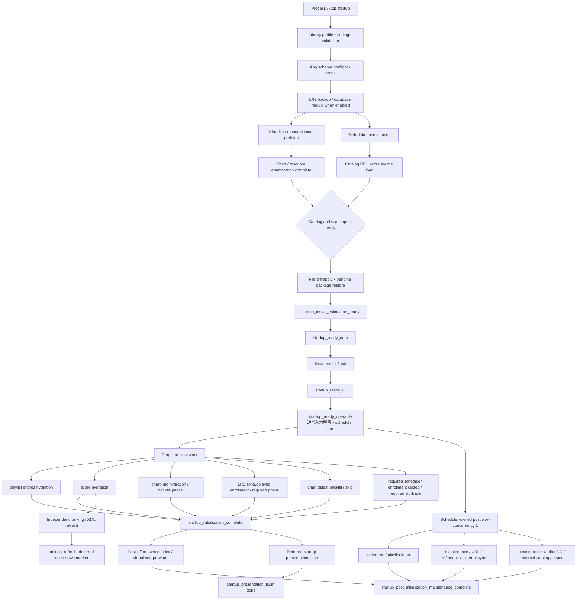

# 起動・初期化フロー 現行仕様

この資料は、BeMusicSeeker の起動、再初期化、リロードで現在正本として扱う初期化フローをまとめる。実装履歴ではなく、現行動作と守るべき境界だけを書く。

## 目的

起動時の状態は、単一の「初期化完了」ではなく次の境界で扱う。

| 境界 | 意味 | この時点で期待できること |
| --- | --- | --- |
| `startup_install_estimation_ready` | catalog、導入先 resource index、pending package state が揃った | 譜面導入先推定と導入処理を開始できる |
| `startup_ready_ui` | required な初期表示を適用した | 初期画面が表示されている |
| `startup_ready_operable` | 通常入力を解禁し startup scheduler を開始した | 譜面導入、基本一覧の閲覧・操作を開始できる |
| `startup_initialization_complete` | required local hydration と required progress phase が完了した | local playlist 編集、score/chart-info を含む通常の local 操作を行える |
| `startup_post_initialization_maintenance_complete` | startup scheduler が所有する post task と登録済み best-effort warmup が収束した | scheduler 管理下の自動外部同期・保守・cache が完了している。独立 worker の ranking/XML refresh と遅延 presentation flush の完了は含めない |

`startup_initialization_complete` は、すべての起動後処理が終わったという意味ではない。通常利用に必要な local state の完了を表す。自動 URL 補完、playlist reference apply、external table / playlist sync、custom-folder physical consistency audit、beatoraja export、仮想 sort prewarm などは post-initialization work として別に観測する。

この分離は計測値だけを短く見せるためのものではない。startup scheduler に登録された post-initialization task は `startup_ready_operable` 直後から required task と並行して開始でき、`startup_background_summary` と `startup_post_initialization_maintenance_complete` で完了を追跡する。`playlist_virtual_order_prewarm` のように required completion 後にのみ開始する best-effort warmup もある。scheduler 外で動く ranking/XML refresh と遅延 presentation flush は、それぞれの lifecycle marker / phase で追跡し、post marker から完了を推測しない。

2026-08-01 の約 21 万譜面環境では、`folder-r2r` / `bundle-r2r` の PC 起動後初回・2回目とも、導入可能および操作可能が約 22 秒、required initialization complete が約 31～33 秒であった。旧 cold-start の約 100 秒化は、optional library-folder refresh が operability を gate していたためであり、現行実装では依存を除去している。数値は環境依存であり、仕様上の合否値ではない。

## Startup



テキスト表現:

```text
profile / schema
  └─ app schema preflight / repair
       └─ LR2 backup / database rebuild (when enabled)
            ├─ file/resource scan prefetch → enumeration・resource index complete
            └─ metadata import → catalog・score load
                 └─ scan と catalog の join
  → file diff・pending restore
  → install estimation ready
  → required UI flush
  → ready operable + scheduler start
       ├─ required local hydration
       │    → startup_initialization_complete
       ├─ scheduler-owned optional maintenance / network / prewarm
       │    → startup_post_initialization_maintenance_complete
       ├─ independent ranking/XML refresh → own marker
       └─ deferred presentation flush → startup_presentation_flush
```

`Startup` の app schema repair は設定確認後に完了させ、LR2 backup が有効な場合はその承認後に `Backup.SaveBackupsWithResult` と必要な `Backup.RebuildDatabase` を await してから `InitializeStartup` に入る。`InitializeStartup` 内では file/resource scan が metadata import と並行して先行開始でき、file diff は catalog load と scan surface の両方が揃ってから適用する。`chart_info` hydration/backfill は app schema repair の代替ではない。

library folder tree は versioned post-initialization refresh として独立する。folder tree の worker、model reader、または UI apply が遅延しても、`startup_ready_operable`、required scheduler、`startup_initialization_complete` を止めない。

## Library Profile

起動時はまず library profile を決め、以後の DB path / root / LR2 固有機能はその profile に従う。

| Profile | `song.db` | Search roots | LR2 config / score | LR2 固有機能 |
| --- | --- | --- | --- | --- |
| LR2 linked | `LR2files\Database\song.db` | `config.xml` の BMS search directories | `config.xml` と LR2 player score DB を使う | custom folder 出力、LR2 backup、LR2IR/ranking を許可 |
| Standalone | アプリ配下 `data\song.db` | 設定画面の複数 BMS ディレクトリ | 使わない。beatoraja score.db は設定 ON の場合だけ使う | LR2 custom folder 実出力、LR2 backup、LR2IR/ranking を無効化 |

Standalone profile の `data\song.db` は portable app data であり、`%LOCALAPPDATA%` には保存しない。初期化順は `data` directory 作成、`song.db` 作成、library schema、playlist schema、bmson/chart_info schema の順に揃える。schema は LR2 `song.db` 互換を維持し、playlist / custom folder 出力用の設定値保存は DB 内に残せる。ただし standalone profile では `.lr2folder` 実出力と `config.xml` 書き換えを行わない。

設定画面の `スタンドアローン(LR2と連携しない)` は standalone profile を選ぶ。BMS ディレクトリは複数登録でき、保存時は存在する path だけを正規化する。重複は大小文字無視で排除するが、親子関係や用途の違う root はユーザーが追加した単位を保持する。旧 `BMSRootPath` は初回移行元として扱い、standalone root list が空で存在する場合だけ取り込む。standalone profile でも BMS インストール先は必須で、登録済み BMS root のいずれかを選ぶ。

LR2 linked / standalone の profile 切替は、同一プロセス内の `FullReinitialize` や hot reload では反映しない。起動済み profile が存在する通常運用時は、設定ダイアログで mode のトグルを切り替えた時点で再起動確認を出し、承認された場合だけ永続化済み設定を reload した上で動作モードのみ保存してアプリを再起動する。他の未保存設定は保存しない。キャンセル時は保存済み mode へ表示を戻し、実行中の library profile と startup progress は変更しない。切替後の設定不足は、再起動後の `Startup` validation と既存の設定ダイアログ表示で案内する。

初回起動や validation 失敗で有効な実行中 profile がまだ一度も成立していない場合は、mode トグルは再起動境界にしない。この状態ではトグルは設定ダイアログ内の draft 選択だけを変え、OK 時に通常 validation と保存を行った後、同一プロセスで awaitable な `InitializeAsync()` を開始する。初期設定保存では runtime post-save action を走らせず、search root、player、playlist などの実行時反映は直後の `InitializeAsync()` に任せる。ただし LR2 linked の `config.xml` など永続化対象の設定ファイルは保存する。validation に失敗した場合は既存の `Msg_invalid_setting` ダイアログで不足項目を表示し、設定ダイアログに留まる。

初回起動時に validation が未成立の場合は、OS 標準 MessageBox ではなくアプリ内 overlay の `InitialSetupLanguageDialog` を先に表示する。この dialog は言語選択と初回設定案内だけを担当し、`settingDialog.Languages` / `settingDialog.Language` をそのまま使って選択言語を即時適用する。`設定へ進む` を押すとoverlayを閉じ、`MainWindow` ownerのmodal `SettingsWindow`へ遷移する。動作モード、BMS ディレクトリ、LR2 ディレクトリ、インストール先などの必須項目は設定ウィンドウで入力する。通常起動時の設定不備は従来どおり `Msg_init_settings_check` の themed MessageBox で案内する。

設定値の getter は validation のために永続設定を消してはならない。特に `LR2CustomFolderOutputDir`、`LR2CustomFolderAsRootOutputDir`、`BMSInstallDir` は、mode 切替直後や設定ダイアログ表示中に一時的に現在 profile と合わないことがあるため、表示時は保存値を返し、無効理由は `CheckValidation()` のエラーとして扱う。

再生タブの LR2body 選択は library profile とは別のプレイヤー設定である。Standalone profile でも LR2body を BMS 再生用アプリとして選べるため、LR2 linked / standalone の切替で無効化しない。LR2body 再生では LR2 実行ファイルと player config を検証するが、ライブラリ用の LR2 `song.db` 連携とは扱いを分ける。

## Operation Modes

| Mode | 入口 | 目的 | 主な処理 |
| --- | --- | --- | --- |
| `Startup` | アプリ起動 | DB と file system から正本 catalog / resource index / UI を構築する | app schema repair、metadata import、catalog load、file diff、background hydration |
| `FullReinitialize` | ライブラリ右クリック `初期化再実行` | 外部 DB 編集や状態修復を想定して library 初期化を再実行する | catalog load、file enumeration、file diff、必要な background 補完 |
| `ReloadFileDiff` | ライブラリ右クリック `リロード` | DB は読み直さず、所持ファイルの追加・削除・更新だけを memory / DB に反映する | file enumeration、file diff、playlist reference apply |
| `ReloadTables` | playlist/table reload | playlist/table 系だけを再読込し、外部 playlist 同期を再スケジュールする | table header reload、playlist entries hydration、external playlist sync |
| `ScoreOnly` | score DB 設定変更 | score source / score.db の切り替えだけを反映する | score DB load、score snapshot rebuild、score hydration、必要なら LR2 ranking refresh |

起動中の `song.db` は原則 BeMusicSeeker が更新するため、`ReloadFileDiff` は in-memory catalog と file scan result の差分を正本にする。LR2 や手動編集で DB が変わった可能性まで拾う場合は `FullReinitialize` を使う。

mode 切替は上記 operation ではなく process restart として扱う。これは active `song.db`、LR2 config provider、score source、background scheduler、UI cache の境界が変わるためで、current process で `InitializeAsync()` を再実行して profile を差し替えない。

BMS search root の追加・削除は mode 切替ではないため、保存後に runtime の `BMSLibrary.SearchTargets` を現在 profile の root set へ同期してから `ReloadFileDiff` を実行する。これにより、standalone の BMS ディレクトリ追加や LR2 linked の search directory 変更は再起動待ちにならない。

起動時 UI ではプレイリスト root を常に展開する。これは root item の展開だけで、配下 playlist の再帰展開ではない。

## App Schema Repair

`AppSchemaPreflightService.Inspect()` は read-only 判定だけを行う。

| 判定 | 意味 | 起動時の扱い |
| --- | --- | --- |
| `NeedsPlaylistEntrySha256Repair` | 既存 `playlist_entry` schema が現行ではない | 警告対象。OK 後に app schema repair で修復 |
| `NeedsAppSchemaVersionRepair` | `app_schema_version(name='app_schema')` が無い、または version が `CurrentAppSchemaVersion` 未満 | app-owned schema が既に存在する場合は警告対象。完全な初回 LR2 DB では警告なし |
| `RepairRequired` | `chart_digest_map` / `bmson_song` / index の schema が欠損または互換外 | 警告なしで app schema repair により収束させる。`chart_digest_map` の row coverage は判定しない |

app schema repair 後は必ず final preflight を行い、上記の未収束が残る場合は起動失敗として扱う。

`playlist` / `playlist_entry` が存在しない LR2 `song.db` へ app 用 playlist schema を追加するだけの場合や、`chart_digest_map` / `bmson_song` / `app_schema_version` を初回連携用に追加して `app_schema = 1` を記録するだけの場合は、互換性に影響する警告を出さない。既存 `playlist_entry` に `sha256` を足す、既存 `playlist_entry_idx_uniq` を作り直す、既存 app-owned schema がある状態で `app_schema` version を記録または更新する場合は警告対象にする。

`BmsLibraryDbGateway.EnsureAppOwnedSchema()` は playlist / bmson / chart_info / IR / lookup index を現行 schema へ揃え、`app_schema = 1` を記録する。既存 `chart_digest_map` の `md5` / `sha256` row を保持しながら current schema へ正規化する場合は `RepairAppOwnedSchema()` を使う。

app schema repair は `song` table 全件を走査して実ファイルから SHA-256 を生成しない。missing digest は file diff / install / inline `chart_info` / chart info backfill など、譜面 bytes を読む後続 pipeline の責務とする。

初回設定後の `Msg_init_completed` は `files_initialize_done` 直後ではなく、required local initialization が完了して `startup_initialization_complete` を記録した後に表示する。自動外部同期、physical consistency audit、export、prewarm まで完了したことは意味しない。scheduler 管理下の post task は `startup_post_initialization_maintenance_complete` で別に観測し、scheduler 外の ranking/XML refresh と遅延 presentation flush は独立した lifecycle で観測する。

## Metadata Bundle Import

metadata bundle は所持譜面から生成した DB 由来情報ではなく、外部配布または同梱された `chart_info` 補助データである。

- import は `Startup` の DB load 前に行う。
- import 済み bundle は `imported_metadata/` へ退避する。退避先は最後に import した bundle のアプリ管理 cache として扱い、同じ file name の cache へ置き換える。
- `imported_metadata/chart-info-metadata.7z` または `imported_metadata/chart-info-metadata.db` は、root へ戻すことで再 import できる。
- `FullReinitialize` / `ReloadFileDiff` では再 import しない。
- bundle import は app schema repair の代替ではない。bundle manifest の `chart_info_schema_version` は import/export 互換値であり、DB 内 `app_schema` version とは別物である。

## Library Load

`Startup` / `FullReinitialize` の library load は、app schema repair と metadata import が終わった DB を前提にする。

| Phase | 正本の処理 | 備考 |
| --- | --- | --- |
| Catalog DB load | `song`, `bmson_song`, `chart_digest_map` などを読む | `maintenance` と `chart_info` 全件 hydration は background |
| Score DB load | active score source を読み、LR2 source の場合だけ `LR2ID` 確定後に `ir_score_prefetch` を開始する | standalone + beatoraja 無効なら score source は `None` |
| File enumeration | native bridge `EBridge_ScanChartAndResources` で root 配下を列挙し、native canonical resource index と LR2 song.db 同期用 metadata surface を作る | Everything API / service が使えない場合は managed scan に fallback する |
| File diff | in-memory catalog と scan result を比較し、新規・更新・削除を DB と memory に反映する | 新規・更新譜面の inline `chart_info` / maintenance はここで処理する |

native bridge と C# 側は同一ビルド成果物として扱う。Everything が使えない場合の managed scan fallback は残すが、古い native DLL / 旧 ABI / contract mismatch への互換 fallback は行わない。この policy は fixed scan と grouped metadata scan の両方に適用する。

Everything scan は install readiness に必要な destination resource index と reverse lookup surface を完成させる処理である。現行契約では、通常起動で全 audio / image / movie result を列挙し、resource-key -> candidate directory reverse lookup まで native scan 成果物に含める。これを未完成のまま `startup_install_estimation_ready` にしたり、pending package batch 側の lazy build へ持ち越したりしない。

LR2 `song.db` 同期が有効な場合、同じ file enumeration contract で LR2 用 metadata surface も作る。metadata surface は chart/resource scan と同じ native bridge / managed fallback 境界に揃え、chart file mtime、`.txt`、`folderinfo.txt`、`.lr2folder`、directory mtime を `RootFileEnumerationEntry` 形で保持する。通常 file diff の `song.date` / `bmson_song.updated_at` 判定も、この scan metadata を正本にする。LR2 generated row の `song.date` / `folder.date` / `.lr2folder.date` は、metadata が欠けた場合に受け取り側で live filesystem timestamp lookup して補完せず、scan surface / scoped producer 側の契約不足として扱う。現行実装では `.txt` / `folderinfo.txt` と root-wide directory query surface を startup scan surface から sync input へ保持する。normal folder directory mtime は、startup / file diff producer が `folder: path:"D:\BMS"` のような root-wide directory query surface を作り、sync input / normal folder sync は必要 target だけをその surface から読む。`.lr2folder` parent/category directory mtime は、LR2 song.db 同期 input producer または scoped sync producer が request `DirectoryEntries` として渡し、sync service は不足分を grouped scan / live lookup で補完しない。startup / file diff の `.lr2folder` scoped sync は、chart/resource scan root で捕捉済みの `folderinfo.txt` を再列挙せず、scan root 外の discovery root だけを scoped text metadata producer で補って request と scan capture surface に合成する。起動後に library state が変わり、手動song.db 再同期時点で scan surface を再利用できない場合は Everything / managed fallback の metadata grouped scan を producer 側で再実行する。playlist custom folder 出力は生成済み `.lr2folder` paths / entries と directory mtime を prepared surface として返す。built-in scoped sync は、それに加えて同じ built-in source から得た `folderinfo.txt` / `.txt` directory metadata も sync request と prepared surface の両方へ載せる。LR2 song.db 同期 input は prepared surface を既存 scan surface へ合成し、producer-owned output directory scope を後段で再 discovery しない。output base 直下など producer-owned scope 外の `.lr2folder` は外部 discovery の対象として残す。scan surface が無い場合の外部 `.lr2folder` discovery は Everything / managed fallback の列挙基盤を使い、prepared surface と合成する。`folderinfo.txt` の広域再列挙や、path だけを保持して後から全件 mtime を取り直す処理は増やさない。

LR2 linked mode の `<jukebox>` root set と、本アプリの chart/resource search roots と、`.lr2folder` discovery roots は意味が異なる。`<jukebox>` には通常の BMS directory、通常 custom folder 出力先、追加通常出力先、root custom folder 出力 playlist directory を登録する。chart/resource search roots は `<jukebox>` を入力にしつつ用途で絞り込み、従来版との互換性のため通常 custom folder 出力先は chart/resource search root から除外しない。一方、追加通常出力先と root custom folder 出力先が search root として登録されている場合は root set から外す。最終的な BMS search root 同士が同一・親子関係にある状態は通常運用としてサポートしないため、`D:\BMS\` のような親 root 配下の一部 directory だけを subtree filter で chart/resource scan から除外する処理は持たない。手動編集などで重なりが残っている場合は設定保存時の validation で是正を促す。`.lr2folder` discovery roots は BMS search directories に加え、通常 custom folder 出力先、追加通常出力先、root custom folder 出力先、LR2 built-in `LR2files\CustomFolder` を含める。アプリ管理 output か外部由来か、built-in source かは query ではなく列挙結果の source classifier で判定する。

通常の file diff と LR2 song.db sync は、入力 surface を共有しても差分の意味を混ぜない。file diff の「差分あり」は owned BMS / bmson 実ファイルの追加・削除・mtime / hash 変更を正本にし、LR2 `folder` table の incomplete / stale / expected row 欠落だけで通常 file diff を重くしない。LR2 normal folder の全件再同期、startup-scan diagnostic の残件処理、expected set 外 row pruning は LR2 song.db sync / cleanup stage の責務である。file diff 中に LR2 `folder` row を更新する必要がある場合も、変更 path と prune scope に基づく scoped sync を使い、既存 `folder` row も生成対象と prune scope だけを読む。差分 0 件やLR2 song.db 同期未完了 status だけで全件 normal folder sync を走らせない。

LR2 song.db sync の durable completed signature は schema / generator / parser contract を表す。LR2 BMS root、`.lr2folder` discovery root、LR2 setup の `<customfolder>` / `titleflash` / `newsong` 設定は実行時入力であり、変更されても signature mismatch だけで `song_rows` 全量再同期を開始しない。これらの変更は file diff、`.lr2folder` diff、built-in special folder scoped sync で `folder` row を収束させる。

アプリ管理 playlist の custom folder 出力は、playlist 正本から `.lr2folder` file と LR2 `folder` row を同じ操作で materialize する。起動時 file diff は外部 `.lr2folder` の追加・更新・削除検出を軽量に扱い、playlist header の `Output_dir` / `is_root_folder` から決まる管理 table directory 配下は列挙 API の除外 subtree として渡し、current 候補と prune 削除対象から外す。通常 custom folder 出力 base / root custom folder 出力 base そのものは外部 discovery scope として残すため、base 直下や非管理 directory 配下の `.lr2folder` は外部ファイルとして扱う。親 BMS root の subtree に出力先が自然に含まれても、アプリ管理出力 row は外部 discovery sync で検査・削除しない。初期 scan で使った app-managed 除外 scope は scan surface に保持し、LR2 folder diff preparation 時点の current scope と一致しない場合は、旧 scope で失われた候補を使わず current scope を除外条件にして `.lr2folder` 候補を再列挙する。

起動時の app-managed custom folder repair は、先に playlist header、`playlist_custom_folder_output_status`、output directory 単位の物理 `.lr2folder` mtime surface を使って no-op 判定する。status は最後に本アプリが materialize / LR2 `folder` row sync を完了した playlist の `output_directory`、出力 bit、root flag、entry type、folder sort、header/data hash、`last_update`、実出力 surface から作る物理 `.lr2folder` file / 出力 directory / 格納先 ancestor directory の mtime 署名だけを保存する。status と現在の入力 identity / mtime 署名が current の playlist は repair の playlist entry hydration / projection / DB row lookup / materialize 対象にしない。status が無い、入力が変わった、期待 file が scan surface 上で欠ける、物理 `.lr2folder` / 出力 directory / 格納先 ancestor directory の mtime が変わった、または pending 後の LR2 `folder` row 軽量構造検査で file row / directory row の欠落、`date` / `parent` 不一致、期待外 row がある場合だけ batch materialization と単発 LR2 `folder` row sync で修復する。status が current の場合、外部から LR2 `folder` row の値だけを書き換えたケースまでは監査しない。起動時 scan surface が利用できない場合は、対象出力 directory 群に対する grouped enumeration で `.lr2folder` mtime surface を作り直す。個別 file ごとの `File.Exists` を repair target selection の通常経路にはしない。table ごとに既存出力を削除して DB sync を繰り返さない。

既存 DB の playlist/custom folder 派生 row を明示的に直す場合は、設定画面の `LR2 song.db song.db データを再同期` 導線または LR2 song.db sync で行う。手動再同期では playlist materialization stage をログ付きで先に進め、完了後に LR2 generated data sync を queue する。この stage は全対象 playlist の projection を batch 化し、物理 `.lr2folder` は差分だけ書き換え、LR2 `folder` row は単発 sync にまとめる。この前処理は UI 操作として同期的に固めず、進捗が見える独立 stage として扱う。

resource index は chart-relative resource key を正本にする。`foo.wav` は `foo`、`sound/foo.wav` は `sound/foo` として扱い、旧 basename-only matching は使わない。native bridge / managed fallback scan は audio / image / movie のカテゴリ別 index とカテゴリ別 reverse lookup だけを作り、旧 all-resource surface は保持しない。folder-level hash が必要な箇所ではカテゴリ union をその場で派生する。

通常の native scan path では `LibraryResourceIndex` を native decoded arrays から直接構築し、`ChartScanResult` の resource dictionaries は materialize しない。`ChartScanResult` は file diff に必要な chart path / chart directory の carrier として使い、managed fallback scan とテスト用 merge path だけが resource dictionaries を持つ。

導入先推定は destination resource index を必須にする。`ScanBmsFilesOnStartup` を無効にするなど、起動時 file enumeration を明示的に省略した場合、resource index がないため導入先推定は `resource_index_unavailable` として推定不可になることがある。

## Install Readiness

導入先推定 / 導入開始に必要な情報は次の 3 つである。

- 所持 catalog: BMS / BMSON の path、hash、timestamp、installed membership、推定用 metadata。
- destination resource index: file enumeration 由来の audio / image / movie chart-relative resource key と reverse lookup。
- pending package state: pending package list と、source package resource surface を復元済みまたは推定開始時に構築可能であること。

`StartupInstallReadinessState` は `CatalogLoaded && DestinationResourceIndexReady && PendingPackagesRestored` を満たしたとき `InstallEstimationReady` に遷移する。`maintenance_hydration`、`chart_info_hydration`、playlist hydration、score/ranking refresh は install readiness の blocker にしない。

導入可能 readiness の支配項は起動状態で異なる。通常起動 / 差分なしに近い起動では Everything scan / native bridge が支配項である。`song_tbl_load` 由来の catalog load は 3 秒台まで短縮済みだが、file enumeration と並走しており、現状の導入可能 wall clock では Everything scan に隠れる。`song_tbl_load` の micro optimization は、通常起動の導入可能短縮の主対象にはしない。

空 DB 初回構築では、Everything scan そのものよりも file diff apply 内の全譜面 read、lightweight parse、inline maintenance、encoding detection、DB commit が支配的になる。この経路では追加/更新 chart の `ChartFileSnapshot` を起点に `song` 登録、inline `chart_info`、inline `maintenance`、encoding 補正をまとめて処理する。非 Shift_JIS が確定した BMS の metadata reload は snapshot bytes から raw `title` / `subtitle` / `artist` / `subartist` / `genre` を再適用し、旧 setter 合成に戻さない。

LR2 `song.db` 同期が有効な空 DB 初回構築では、file diff apply の同じ snapshot / parser result から LR2 generated song columns、`chart_info` 由来 numeric columns、LR2 compatibility facts、text group flag を作る。初期構築完了後に LR2 sync がもう一度全譜面を読み直す形にはしない。自動 follow-up では、同一 scan/input generation で file diff が全 current BMS owner path を durably commit した coverage を主判定にし、全 generated column を DB projection で再比較する処理は drift 診断に下げる。既存 DB のsong.db データ同期が必要な場合だけ、初期構築と同型の bounded streaming pipeline を使う。

`chart_info` は所持譜面への metadata 付与用に一括で準備される session index / DB-backed index である。起動時 hydration は LR2 linked / standalone の両 profile で同じ read-only actual-data loader を使い、実在する current `chart_info`、timeout-aware current `chart_info_parse_failure`、owned chart を照合する。`lr2_song_db_sync_status=Completed` は LR2 generated data sync の完了だけを表し、chart-info currentnessや行の現存を証明しない。全 owner が actual data 上 current の場合だけ、owner/storage/parser/timeout version付きの session snapshotにより後続 candidate summary/backfillを省略する。詳細は [chart-info-lifecycle.md](chart-info-lifecycle.md) を参照する。

LR2 song.db 同期が有効な run では、開始時点で current parser version の `chart_info` resolver と current `chart_info_parse_failure` MD5 set を memory snapshot として準備し、worker はその resolver / set だけを lookup する。missing / stale `chart_info` は、LR2 song.db 同期前の別 chart_info 補完処理ではなく `song_rows` worker が同じ `ChartFileSnapshot` から作る。currentness、parser、failure mapping は inline / full backfill と同じ route-neutral evaluator を使い、current row を current failure より優先する。current parse failure は再 parse せず skip する。`song_rows` chunk ごとに `chart_info` table へ SELECT することはしない。評価結果の staging と永続化は `song_rows` orchestration owner が行う。

LR2 sync の `song_rows` pipeline は reader / worker / writer の責務を明確に分ける。reader は bounded producer として譜面 bytes と列挙 metadata を bounded queue へ流す。通常 file diff と LR2 song.db sync は `ChartFileReadPipelinePolicy` に従い、十分な CPU と複数 target がある場合は reader を 2 本まで並列化できる。reader は bytes-only producer に寄せ、MD5 / SHA256 計算と snapshot 作成は worker 側で行う。worker は encoding detection、parse、`chart_info` apply、LR2 compatibility facts の作成までを同じ parse result から完了させる。writer は completed item の順序制御、bulk song write、bulk compatibility facts write、durable cursor update に専念する。writer chunk 内で `chart_info` apply や compatibility facts build のような CPU work を行わず、DB commit 前に pipeline を詰まらせない。

| Log | 意味 |
| --- | --- |
| `startup_install_estimation_ready` | pending estimate queue を開始できる |
| `startup_install_ready` | 現行では install estimation readiness と同じ境界 |
| `startup_ready_data` | 導入判定に必要な catalog / resource index が揃った |
| `startup_ready_ui` / `startup_ready_install` / `startup_ready_operable` | required UI を反映し、通常入力を解禁して scheduler を開始する境界。導入先推定は既に利用可能で、基本一覧を操作できる |
| `startup_initialization_complete` | required local hydration、required progress phase、required scheduler work が完了した。local playlist 編集と通常の local list 操作を期待できる |
| `startup_post_initialization_maintenance_complete` | scheduler 管理下の post scheduling が閉じ、post task と best-effort warmup が完了した。独立 worker と遅延 presentation flush は含めない |
| `startup_background_summary` | required / post task の queue/start/complete/failed/elapsed/lane/dependency summary。initialization complete 時点では post task が残り得る |
| `startup_presentation_flush` | 起動中に遅延した enrichment / playlist reference 依存 presentation の bounded apply |

## Startup Background Scheduler

startup background scheduler は `MainWindowViewModel` が `BMSLibrary.StartupBackgroundTaskScheduler` と `BMSPlaylist.StartupBackgroundTaskScheduler` へ delegate を注入し、`StartupBackgroundTaskSchedulerOwner.Queue()` に接続された task を、dependency、lane concurrency、required / post classification に従って実行する。

### Required initialization

`startup_initialization_complete` が待つ主な task / phase は次である。

| Lane | Task / phase | 並列数 | 意味 |
| --- | --- | ---: | --- |
| `read_hydration` | `playlist_entries_hydration`, `chart_info_hydration` | 2 | local playlist entries と current chart-info session state |
| `default` | `score_hydration_deferred`, LR2 song.db sync enrollment / required phase | 1 | score state と LR2 required completion |
| progress phase | chart digest / chart-info backfill phase | task に応じる | request が不要ならskip完了。必要ならchart-info factsと既存BMS songのnarrow chart-info projectionを同じtransactionでcommitし、receipt後session/publicationまでそのrequestの完了を待つ |

`StartupBackgroundTasksDone` は scheduler 全体の empty ではなく、`runningRequiredCount == 0` かつ required request が queue に無い状態を表す。required scheduling enrollment が閉じ、他の expected startup phase も完了したときだけ進捗上の完了になる。

### Post-initialization work

次は `startup_initialization_complete` を gate しない。

| Lane / task family | 主な task | 意味 |
| --- | --- | --- |
| post default | playlist library index prewarm、virtual sort prewarm、external table catalog、post-initialize GC、beatoraja export | best-effort cache、network、memory maintenance、export |
| post folder tree | `library_folder_tree_refresh` | versioned / coalesced navigation tree presentation |
| post playlist follow-up | `playlist_url_completion`, `playlist_ref_apply`, `external_playlist_sync` | automatic enrichment / external synchronization |
| post maintenance | `maintenance_hydration`, `installable_maintenance`, `playlist_custom_folder_output_repair` | persisted maintenance attach、補完、物理出力 audit |

startup scheduler 管理下の post-initialization task の concurrency は 1 で、required work と同時に一つまで進められる。`post_initialize_gc` は required scheduling が閉じ required work が idle になるまで開始しない。scheduler 管理下の post task は単に計測外へ隠すのではなく、summary と post-complete markerで追跡する。scheduler 外の ranking/XML refresh と遅延 presentation flush は、それぞれの完了 phase / lifecycle markerで追跡する。

`Startup` では scheduler は `startup_ready_operable` で開始する。`ScoreOnly` / `ReloadTables` / `ReloadFileDiff` / `FullReinitialize` は既に UI operable 後の operation なので、operation開始時のreset後もschedulerをrunnableに保つ。

### ユーザー操作との契約

- 譜面導入先推定に必要な destination resource index は scheduler 開始前に完成させ、post task へ移さない。
- local playlist 編集に必要な playlist entries hydration は required とする。
- 通常 library / playlist 一覧の基本表示は operable までに成立させる。
- library folder tree の最終 refresh、maintenance 固有表示、自動 URL / reference / external sync は eventual consistency を許容する。
- sort order prewarm は従来どおり optional で、未完なら on-demand build を使う。
- external sync 完了までを「初期化完了」に含める必要がある製品要件へ変更する場合は、network を core initialization へ戻さず、別の `online synchronization complete` milestone を設ける。

## DB Access Policy

startup hydration の主要 read phase は `OpenSongDbReadOnly()` / `OpenScoreDbReadOnly()` を使う。read-only connection は `SQLiteOpenFlags.ReadOnly | SQLiteOpenFlags.FullMutex` で開き、process-local static monitor を取得しない。

read-only hydration loader のルール:

- loader 内で `CreateTable`、schema ensure、app schema repair を行わない。
- DB read phase は row / DTO / dictionary を返すだけにし、DB connection を閉じてから session index 更新や owner runtime state 反映を行う。
- cleanup、backfill、metadata update、`ir_score` replace、`ir_data` upsert、file diff commit は短い write-capable transaction path として明示する。
- loader log は `readOnly=true` と `dbLockWaitMs` を出す。

読み取り専用化済みの主な処理:

- startup score table load
- playlist header load
- `playlist_entries_hydration`
- `chart_info_hydration`
- `maintenance_hydration`
- `ranking_refresh_deferred` の `ir_score` / `ir_data` read

`song.dbアクセス最適化PRAGMAを有効にする` が有効な場合、接続ローカルに `temp_store=MEMORY`、`cache_size=-262144`、`mmap_size=2147483648` を適用する。

## Background Hydration

| Task | 正本の責務 |
| --- | --- |
| `playlist_entries_hydration` | `playlist_id IS NOT NULL` の playlist entries を raw reader / bulk factory で materialize し、`BMSTable.entries` setter で table に attach する |
| `playlist_ref_apply` | playlist entries 完了後に library item と playlist reference を結び直す |
| `playlist_url_completion` / `external_playlist_sync` | playlist entries 完了後に URL 補完・外部 playlist 同期を行う |
| `chart_info_hydration` | profile に依存せずDBの current `chart_info` と current parse failure を owned chart と照合し、session index と candidate summaryを作る |
| `chart_info_backfill` | 不足がある場合だけ補完する。success/current-row reuse対象BMSは既存songのchart-info由来9列だけをupdate-onlyでfactsと同じtransactionへ保存し、receipt後にsession/index/eventをpublishする。基本列は再生成せず、missing songをINSERTしない。BMSONはLR2 `song` rowを作らない。全ownerがcurrentの場合は`reason=hydration_all_current`でskipし、完全current ownerの全件song drift監査は行わない |
| `maintenance_hydration` | DB の persisted maintenance snapshot を owner へ attach し、resource health index を valid snapshot から rebuild する |
| `installable_maintenance` | `chart_info_hydration` と `maintenance_hydration` 完了後に missing/stale maintenance を補完する |
| `score_hydration_deferred` | DB ではなく memory score snapshot を `BMSFile` へ attach する |
| `ranking_refresh_deferred` | `ir_score` 系の未送信検出と `ir_data` / cache XML 系の ranking 情報を更新する |

background hydration 完了時の通常ライブラリ一覧更新は、起動中と起動後で扱いを分ける。`Startup` 中でも basic presentation 済みの通常ライブラリは表示されたままにし、`Score` / `Ranking` / `ChartInfo` / `Maintenance` / `PlaylistEntries` の完了は現在の表示条件と sort/filter の依存関係に基づいて扱う。`Score` / `Ranking` のように現在の通常ライブラリ全体表示へ影響しない更新は、起動中でも全件 `main_view_build` を行わない。`ChartInfo` / `Maintenance` / playlist reference apply など、表示列や warning、playlist reference 表示へ影響しうる更新は `startup_initialization_complete` 後の `startup_presentation_flush` へ遅延できる。起動後の reload / score-only update でも、同じく現在の表示条件と sort/filter が依存するデータ種別に基づいて更新を判定する。`Score` / `Ranking` 完了は score 系列 (`Clear`、`Rank`、`Rate`、`Score`、`BP`、`Ranking` など) の値を更新するが、`Title`、`Folder`、`path` などの identity sort key には影響しない。このため、通常ライブラリ全体表示で keyword/filter が空、かつ現在の sort が score 系列に依存しない場合は、全件 `main_view_build` を行わず、既存 row の property change による表示更新に任せる。

`ChartInfo` hydration は `Level`、BPM、notes、TOTAL、density など chart info 系列に影響するが、`Title`、`Folder`、`path` には影響しない。通常ライブラリの sort cache は、所持譜面 membership 変更や identity sort key 変更で無効化し、chart info / score / maintenance の完了だけで identity sort cache を落とさない。ChartInfo hydrate/backfillはstorage ownerへruntime `ChartInfo`をsilent attachせず、session `ChartInfoIndex`とprojection providerを更新する。backfillのBMS narrow song projectionはこのruntime attach禁止とは別責務であり、既存DBの基本列を変更しない。起動後に表示中のchart info列を反映するmain view refreshは維持するが、そのrefreshでidentity sort cacheを破棄しない。

`playlist_url_completion` は、MD5-URL mapping TSV と Stella Uploader Full (`score_upload_full.json`) を process-local snapshot として保持する。同じ起動中の playlist reload / external sync / reset では再 download せず、保持済み snapshot を再適用する。設定画面で TSV URI または Stella Uploader Full 補完設定が変わった場合だけ、次回 schedule で必要な source を再取得してよい。候補適用時は TSV を優先し、TSV に同じ MD5 がない場合だけ Stella Full の `url` / `url_diff` を URL1/URL2 補完に使う。既存 URL が空欄、または `gnqg.rosx.net` / `absolute.pv.land.to` を含む既知のリンク切れ URL の場合は補完対象として扱い、補完候補がない場合は既存 URL を維持する。

`maintenance` は通常、譜面導入時または明示 rescan 時に計算された snapshot として扱う。`BMSFile.maintenanceInfo` の lazy default は `MaintenanceInfoOrigin.Placeholder` であり、resource health の valid snapshot ではない。valid snapshot は DB 由来 `DbHydrated`、file diff / 導入 / 手動 rescan 由来 `Calculated` に限定する。

不足 resource を後から追加した場合や、隣接 resource を削除した場合の再評価は通常起動では行わない。行右クリックの `ファイルスキャン > 再スキャン` は選択行、`ファイルスキャン > 全譜面を再スキャン` は owned BMS 全件 + installed bmson 全件を重い明示操作として再計算する。明示 rescan は file diff inline maintenance と同じ evaluator を使い、`ChartFileReadPipelinePolicy` に従う reader が `ReadBuffer(path)` を bounded queue へ流し、並列 evaluator が digest / snapshot / maintenance evaluation を処理し、single DB writer が changed row だけを chunk commit する。進捗は BMS / bmson を分けず、全 target の processed / total として報告する。

## Ranking Refresh

`ranking_refresh_deferred` は 2 系統に分かれる。

| 系統 | DB table | 用途 | 設定 |
| --- | --- | --- | --- |
| player score XML / `ir_score` | `ir_score`, `ir_score_refresh_metadata` | `SCORE_UNSENT` と LR2 custom folder `UNSENT SONGS` | `LR2IRのスコアをDLしIR未送信を検出する` |
| ranking cache / `ir_data` | `ir_data` | ranking 表示、offline score ranking estimation | `UpdateLr2IrRankingCacheOnStartup`, `EstimateOfflineScoreRanking` |

`LR2IRのスコアをDLしIR未送信を検出する` が false の場合、player score XML fetch、`ir_score` DB 更新、`ir_score` 由来の未送信検出を使わない。`起動時にLR2IRランキングキャッシュを更新する` が false の場合、起動時 deferred refresh では local ranking cache XML の scan / reload / `ir_data` upsert を行わない。両方 false の場合、起動時の `ranking_refresh_deferred` 自体を queue しない。

queue 条件は、現在の initialization が score update を要求し、active score source が LR2、LR2 score DB path が null ではなく、上記2系統の少なくとも一方が有効であることの論理積である。`OperationModeLR2DB`、`LR2ID`、`EstimateOfflineScoreRanking` は queue gate ではない。queue 判定ではその時点の options snapshot を使い、deferred worker の実行時に最新 snapshot から2系統の work plan を再評価する。したがって queue 後・実行前の設定変更は実行する branch に反映される。`LR2ID=0` は worker 実行時の no-op 条件として扱い、queue の有無は変えない。

`ir_score_prefetch` は LR2ID 確定直後に player score XML fetch、XML parse、normalized score digest 計算までを先行する。`ranking_refresh_deferred` は current な prefetch result を consume し、metadata read、既存 `ir_score` read、replace / metadata upsert、memory merge を行う。LR2IR player score XML の `lastupdate` は譜面 hash 側の LR2IR 更新時刻として変わる可能性があるため、normalized digest では無視する。

ranking cache / `ir_data` は、LR2IR の local cache XML を hash 単位で読み、対象 `LR2ID` 用の ranking summary を `ir_data` に保持する。

- XML reload 対象判定は `ir_data.lastcacheupdate` と XML 末尾 `lastupdate` を使う。
- reload は明示 degree の bounded worker pipeline で行う。既定 degree は `max(1, Environment.ProcessorCount - 1)`。
- ranking cache XML parser は startup refresh、manual download、`LR2IRCache` wrapper で共通化する。refresh 用には full ranking list を materialize せず、`<score>` block を 1 pass で読み、`players_num`、`average`、sample stddev、対象 player score、rank を集計する。
- `id`、`clear`、`notes`、`combo`、`pg`、`gr`、`minbp` は 0 以上の整数だけを valid score row として扱う。負数や parse 不能値を含む row は集計対象から外す。
- rank は `count(score > targetScore) + 1` として算出する。対象 `LR2ID` がない場合は従来同様 `NO_PLAY` / `rank=-1` の synthetic row を作る。
- `lastupdate` は XML 末尾の date parse を優先し、空 / 不正 / NUL tail の場合は cache file last write time に fallback する。
- parser が失敗した XML は skip する。旧 full parser fallback は使わず、`xmlFallbackLoads` は互換 metric として残る。
- `EstimateOfflineScoreRanking=true` で local score が IR row より高い場合だけ、offline ranking estimation 用に compact rank calculator を on-demand load する。startup refresh で reload 済みの hash は同じ lookup を使うため、同じ refresh 内では再読込しない。`UpdateLr2IrRankingCacheOnStartup=false` の場合は起動時 refresh が走らないため、起動後に自動で推定結果は更新されない。

初回構築では `ir_data` が対象 `LR2ID` で空の場合、dedupe 済み rows を 1 transaction の bulk insert で書き込む。既存 row がある場合や guard に失敗した場合は通常の hash 単位 upsert に fallback する。`ir_data` table schema は互換維持のため unique 制約を追加しないが、lookup / delete guard 用に非 unique 複合 index `ir_data_idx_lr2id_hash(lr2id, hash)` を持つ。

`ranking_cache_refresh done` は既存 `xmlReloadMs` / `upsertMs` に加え、`xmlReloadDegree`、`xmlScoresParsed`、`xmlParseFailed`、`xmlFallbackLoads`、`bulkInsertUsed`、`offlineEstimateXmlLoads` を出す。2026-05-09 の実測では、初回 `ir_data` 書き込みは `upsertMs` 約 50s から bulk insert 約 0.3s まで短縮し、全体は主に XML read / summary parse に寄った。

## ReloadFileDiff

```text
ReloadFileDiff
  -> file enumeration / resource index build
  -> in-memory catalog との差分検出
  -> added/updated charts の ReadBuffer
  -> parser workers による digest 計算 / snapshot 作成 / lightweight parse
  -> post-parse worker による inline chart_info / inline maintenance
  -> commit aggregator による transaction chunk 集約
  -> single DB writer による chunk commit
  -> deleted charts の unregister
  -> memory catalog / resource index swap
  -> playlist reference apply
```

差分が 0 件の場合、file diff 由来の DB commit、inline chart-info、inline maintenance は発生させない。Startup operation 全体としては、DB 由来 session hydration や post-initialization maintenance が独立に queue される場合がある。

Everything が正常に検索できた結果 chart 0 件を返した場合は、検索自体は成功として扱い、managed fallback scan には進まない。Everything が利用できないなど検索結果を取得できない場合だけ managed fallback scan に進む。Everything 由来または fallback 由来の成功扱いの scan result が chart 0 件で、既存の BMS / bmson storage row が 1 件以上あるなら、その scan result を削除差分の正本として扱わない。これは「ライブラリが空になった」という user intent ではなく、Everything / fallback 経路の空結果が絡む危険状態として扱い、file diff を開始せず、DB commit、LR2 folder/song sync、memory catalog replacement を行わない。UI には `song.db` 更新をスキップしたことと、BMS directory 設定および Everything index/search 状態の確認を促す警告を出す。既存 row がない新規空 DB では、空 scan result は通常の空ライブラリとして扱ってよい。

この判定は `ChartScanExecutionResult.ScanSource` を正本にする。`NativeBridgeUsed` / `FallbackUsed` は既存ログ・診断用の派生情報であり、scan source の組み合わせから仕様判断しない。通常の起動 / reload file diff 経路では `ScanSource` は `Everything` または `Fallback` のどちらかであり、低レベル部品の未分類 result だけ `ScanSource` 未設定として扱う。

差分がある場合、reader は `ChartFileReadPipelinePolicy` に従い 1 または 2 本、parser は CPU 数の半分程度、post-parse worker は parser の約 1.5 倍かつ CPU 数以下を既定とする。reader は `ReadBuffer()` で bytes と file metadata だけを読み、parser worker が digest 計算、snapshot 作成、lightweight parse を行う。`InlineChartInfoBatchSize` 2048 は current `chart_info` lookup / helper の内部粒度であり、post-parse barrier ではない。post-parse work item は parsed candidate 1 件で、独立した worker stage で処理し、worker は item-local result / commit staging chunk だけを作る。single collector が sequence 順に `SongTableFileCheckResult`、runtime apply list、commit input queue への反映を集約する。commit aggregator は input queue を消費して DB commit chunk size 既定 10000 件の transaction chunk へ集約し、別の bounded DB writer queue へ渡す。single DB writer は writer queue の chunk commit だけを担当するため、短い DB commit 中も collector / aggregator は入力を消費できる。

手動 `ReloadFileDiff` は、prefetch の有無、reason/progress/UI 更新、後段 playlist reference scheduling を除き、`Startup` の file diff と同じ `ApplyFileScanDiff()` 経路を使う。軽量 parse、inline `chart_info`、inline `maintenance`、snapshot 由来 encoding reload の意味論は起動時 file diff と揃える。

## ReloadTables

```text
ReloadTables
  -> table header reload
  -> playlist_entries_hydration を startup scheduler へ queue
  -> external_playlist_sync を playlist_entries_hydration dependency 付きで queue
```

`ReloadTables` は post-startup operation なので、scheduler reset 後も scheduler は runnable である。score DB load、score snapshot rebuild、score hydration、ranking refresh は行わない。`playlist_entries_hydration` は `UpdateBMSTables` callback まで終えてから completed version を publish し、その後 `external_playlist_sync` が進む。playlist reference replacement は reload 中の direct callback で適用され、必要に応じて `PlaylistReferenceApplied` phase として追跡される。

playlist reload の実行部分は bounded parallel の共通 batch を使う。`ReloadTables` は DB から table header を再読込した後、`is_external_sync` が有効で absolute URI を持つ playlist だけを batch 対象にする。プレイリスト単体リロードやサマリー選択範囲リロードは、選択された playlist を `is_external_sync` に関係なく batch 対象にする。手動範囲リロードの失敗は個別 dialog ではなく、ログと playlist summary の `STATUS` に集約する。

## ScoreOnly

```text
ScoreOnly
  -> score source を再選択
  -> score DB load
  -> score snapshot rebuild
  -> 現在の BMSFiles へ score を置換適用
  -> score_hydration_deferred を必要に応じて queue
  -> LR2 source の場合だけ ranking_refresh_deferred を必要に応じて queue
```

`ScoreOnly` は score DB 設定変更専用の post-startup operation である。playlist header reload、playlist entries hydration、playlist reference apply、external playlist sync は行わない。beatoraja score source が有効な場合は LR2 score DB rows を読み込まず、LR2IR / ranking refresh も行わない。LR2 source へ切り替えた場合だけ、LR2 score / ranking 系の後続更新を score 情報の一部として扱う。

## 守るべき境界

- app schema version を `chart_info` backfill の副作用として書かない。
- startup hydration worker 内で schema ensure、app schema repair、hidden write を行わない。
- read-only loader と write-capable transaction path を同じ phase に混ぜない。
- DB connection を保持したまま、大量の runtime state 反映、index publish、UI notification を行わない。
- 導入可能 readiness を、playlist hydration、score/ranking refresh、chart_info hydration、maintenance hydration の完了に依存させない。
- score DB 設定変更では `ScoreOnly` を使い、playlist/table reload や external playlist sync を起動しない。
- required local operation に必要な task を、計測値を短くする目的だけで post-initialization へ移さない。scheduler 管理下で post とした task は `startup_background_summary` と `startup_post_initialization_maintenance_complete` で追跡し、scheduler 外の task は独立した phase / markerを持たせる。

## 関連資料

- `devdocs/spec/startup-reload-progress.md`
- `devdocs/spec/chart-file-read-pipeline.md`
- `devdocs/plan/empty-db-first-startup-optimization-plan.md`
- `devdocs/plan/bmson/library-scan-fast-path-resource-index-plan.md`

## Verification map

Startup library construction coverage is split from the retired `StartupLibraryConstructionOwnerTests` class into three owner fixtures. Each fixture preserves the existing temporary song database, profile construction, typed factory/application ports, exception propagation, method-level completion, and deterministic cleanup. The fixtures run in the existing `library-chart-classwide` process with `ClassLevel` scope and six workers; no new process, DNP, fixed wait, timeout, or production seam is introduced.

| Behavior / failure contract | Owner fixture | Retired cases | Route |
| --- | --- | --- | --- |
| successful standalone profile construction and LR2 profile search-root behavior | `StartupLibraryProfileTests` | cases 1-2 | `library-chart-classwide`, 6 workers / `ClassLevel` |
| search-root, factory, and application failure propagation | `StartupLibraryFailureContractTests` | cases 3-5 | same route |
| MainWindow typed startup construction route and compiled caller contract | `StartupMainWindowTypedRouteTests` | case 6 | same route |

The old `StartupLibraryConstructionOwnerTests` selector is absent from `remaining` and all named launch routes except its three replacements above.
