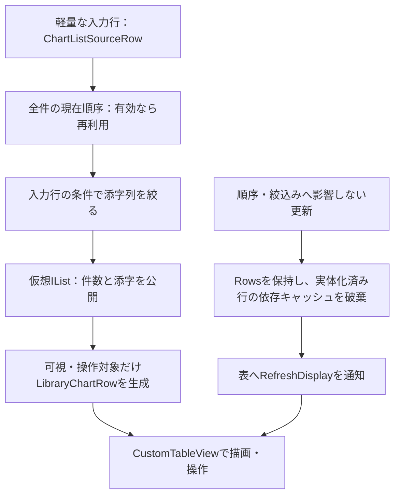
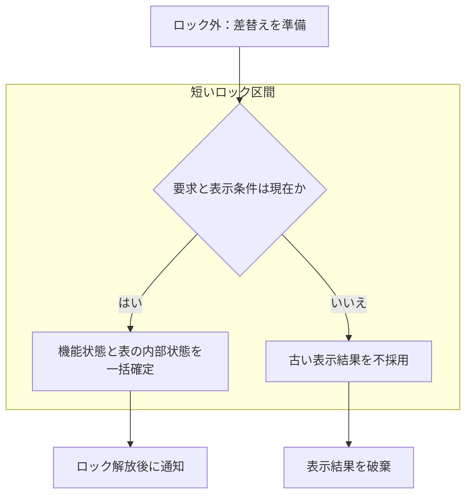

# 一覧の描画・操作・仮想化

## 目的と適用範囲

譜面、プレイリスト詳細、履歴、プレイリスト一覧で使う `CustomTableView` の責務を定めます。列の値は[列と既定値](table-columns.md)、データの正本と更新は[共通モデル](../library/chart-model.md)に集約します。

## 用語

[共通用語集](../glossary.md)を参照します。コードの識別子は原表記を使います。

## 仕様

### 表示の構成

`CustomTableView` は可視範囲をコードで描画する表です。メインの `customTableView` は `MainChartList.Rows` と `MainChartList.ColumnsSettings`、プレイリスト一覧の `customTablePlaylistSummary` は `PlaylistSummaryView` と専用の列設定を使います。表示先に応じて二つの表を切り替えます。

行の高さは19、見出しは22、文字サイズは11が既定です。外観設定は両方へ反映します。メイン一覧のスコア表示には `SovjetBox` を使います。クリア、DJ LEVEL、難易度、判定、履歴のクリアとBEST DJは `CustomTableTextStyle.Score`、現在の文字サイズ、縦補正 `1d` を共用します。

並べ替え状態は通常一覧の `SortParameters`、履歴の `PlayHistorySortParameters` を `MainTableSortParameters` へ切り替えて公開します。プレイリスト一覧は独立した `PlaylistSummarySortParameters` を使います。

### 可視行だけの実体化

`MainChartList.Rows` は `IChartListViewMetadata` を実装する仮想 `IList` を受け取れます。表は全行を列挙せず、件数を `Count`、描画・選択・説明・右クリックの対象を添字で取得します。旧表示の破棄もメタデータを優先し、処理のためだけに全行を作りません。

| 表示先 | 入力と並べ替え | 実体化 |
| --- | --- | --- |
| 通常ライブラリ・絞込み・全件確認 | `ChartListSourceRow` と `ChartListOrder` | `ChartListVirtualView` が対象の `LibraryChartRow` だけを作る |
| 保守・重複・導入済み・導入保留の対象集合 | 対象の `ChartListSourceRow` と共通の並べ替え | 可視行だけを作る |
| プレイリスト詳細 | `PlaylistDetailSourceRow` と専用の `PlaylistDetailSortEngine` | `PlaylistDetailVirtualView` が対象の行だけを作る |
| プレイ履歴 | 履歴専用の入力・並べ替え・表示 | 履歴仕様に従う |
| プレイリスト一覧 | 件数の小さい既存の行集合 | 通常の行集合を保持する。譜面全件の仮想化とは別扱い |

通常一覧とプレイリスト詳細の所持 BMS・bmson 行は、`status` getterだけで再生管理主体の現在値を読取り、元状態の `~PLAYALL` に再生bitを重ねます。種類と実pathの `OrdinalIgnoreCase` 一致時だけ対象となり、保存主体・`ChartFile`・一時投影へ再生状態を載せません。同対象の重複行と後から実体化する行も最新値を返します。再生状態と対象の変化を `MainChartList.RequestDisplayRefresh` へ渡し、Loaded表の表示値キャッシュを再評価します。行の登録・個別再生通知・全件走査・未訪問行の実体化は行わず、Rows・並び順・選択・score・未確定編集・`SCORE_UNSENT`・`SEARCHING` を維持します。時刻進行だけでは表を更新しません。

選択行のTSVコピーや明示的な全行操作は、その対象の実体化を許します。初回表示の代替として常時全件を作ることは許しません。

通常一覧の行キャッシュは所持tokenをキーとし、共通基本現在値の参照と詳細・スコア・パッケージの既存版から表示を再評価します。tokenは項目の識別、版は表示キャッシュの有効性であり、相互の代用品ではありません。基本値・path・hashの通知は変更した共通譜面と削除token、詳細通知は変更hash、スコア通知は変更キー、保守・警告通知は変更対象を渡します。局所更新のために全sourceをResetし、BMSON全行を同期し、未訪問行を実体化しません。

導入済み項目の変更は、現在値適用時に捕捉した旧新基本値とentry・packageの所属参照を通常通知へ渡します。同tokenの複数通知は先行変更も保持し、最後の現在値だけで依存を判定しません。`RegularChartListOwner` と既存の表示更新判断でbatchの全effectsを一度合成します。同じ所属のTitle不変の純移転を、keyword空・mode全て・Title順で表示している場合はpathだけを更新し、Rows・実体行・選択・編集中入力・順序を保持します。path順、依存する検索・モード・Title変更、Reset、所属変更、必要な旧新情報がない場合は正規の最終順序と集合を更新します。

パッケージpathだけの変更で所属集合通知を発行しません。pathと代表TitleのDisplayTitleは既存のObservableObjectから、受付権と排他の解放後に明示公開します。ツリーヘッダーと選択済みpackageは同じ参照の最新値を使います。加入・離脱・剪定・Resetの集合通知、未所属の保留項目の導入状態・警告通知は維持します。後続の警告・保守表示更新でも、現在の並べ替え・絞込みに依存しない導入済み表示を再構築しません。必要な健全性索引の準備は省略しません。

### 並べ替えとキャッシュの有効性

通常一覧の列定義は、正規化した列名、別名、キーの型と取得方法、比較方針、事前計算の優先度、表示データへの依存を持ちます。`STANDARD` の初期可視列で並べ替え可能なものは全て対応し、全列を可視にした場合も詳細専用の `EntryLevelSortKey` 以外は対応します。

文字列は `OrdinalIgnoreCase`、数値は型付きの未定義を許す比較を使います。降順は昇順配列の反転ではなく、対象キーの降順と題名の昇順を組み合わせます。`rank` は `rateDouble` の別名です。同じキーの別名から重複したキャッシュを作りません。

有効性は入力の世代、並べ替えキーの世代、依存データの世代、列、方向、行数で判定します。全件の内容指紋を再計算しません。

| 依存するデータ | 無効化の根拠 |
| --- | --- |
| 題名・パス等の基本値 | 入力と基本値の並べ替え世代。値が変わる経路だけが進める |
| スコア | `ScoreSnapshotVersion` |
| 譜面情報 | `ChartInfoIndexVersion` |
| 保守結果 | 読込み済み結果の版とViewModelの保守表示世代 |
| 警告 | 警告・保守・導入先の各世代 |
| 導入先・参照プレイリスト | 各表示専用の世代 |

スコア・譜面情報・保守結果・警告の更新だけで、基本値の入力や順序を捨てません。対象データに依存する順序だけを再構築します。対象集合ではツリーの種別、集合名と並びの識別情報も使います。プレイリスト詳細はプレイリスト識別、スコアと譜面情報の版を使う独立した経路です。

### 絞込みと画面更新

通常一覧とリソース状態を投影する新規・不足・無視一覧は、入力行・並べ替え・キャッシュ採用より前に `GetResourceHealthIndexSnapshotForView` で索引を準備します。入力行を再利用する場合も準備を省略しません。保留は導入前の一時警告を表示するため、この準備の対象に含めません。警告の状態と表示条件は[警告仕様](../library/warnings.md)を正本とします。

警告・保守の変更を全件通常一覧の再描画だけで反映する場合も、通知前に索引を準備します。並べ替えや絞込みへ影響しない更新では `Rows` を保持します。行の getter やログへ構築処理を移さず、構築済みで同じ入力の索引は再利用します。

通常一覧のフォルダ・文字列・モードの絞込みは、全件の現在の順序を取得した後、その添字列を入力行の条件で絞ります。同じ順序が有効なら部分集合を再び並べ替えません。全件確認はBMSONを含む通常ルートと同じ集合を使い、フォルダ条件を適用せず、列だけを `FULLSCAN` にします。

基本値、参照、スコア、譜面情報の通常検索と正規表現は入力行から直接評価します。絞込みのための全行実体化は持ちません。集計表示のキャッシュにもスコア・譜面情報の版を含めます。

保守、重複の全体・群・フォルダ・一覧、導入済み・保留の全体・パッケージは対象集合の仮想表示を使います。BMS専用機能はBMSだけ、重複・導入対象はBMSとBMSONを扱います。重複の更新はモデルが群全体を置き換えた後に表示を再構築します。

現在の全件通常表示の並べ替え・絞込みへ影響しないデータ更新では `Rows` を保ち、実体化済み行の依存キャッシュを無効化してから `RefreshMainTableDisplay` を送ります。表の `RefreshDisplay` はセル値のキャッシュだけを捨てて再描画します。並べ替え・絞込みへ影響する場合は表示集合を差し替えます。

導入先の操作結果は、変更状態の反映、実体化済み行のキャッシュ破棄、表の表示更新の順に適用します。パッケージ項目の変更通知の有無に依存して、この手順を省略しません。導入先と推定警告の変更が現在の並べ替え・絞込み・所属へ影響しない場合は、全件確認や対象集合でも `Rows` と選択を保ちます。更新のためだけに未訪問行を実体化せず、既存の入力行や全ライブラリを無条件に作り直しません。

非対応の通常一覧の並べ替え指定には `main_view_virtual_sort_reset` を記録して既定の題名順を使います。仮想表示の構築失敗は `main_view_virtual_required_failed` として扱い、全件実体化へ切り替えて失敗を隠しません。

#### 通常一覧の仮想表示

上段は通常一覧を構築する経路、下段は順序・絞込みへ影響しない既存表示を更新する経路です。二経路は別の契機から始まり、表への合流は両方の完了を待つAND条件ではありません。実線は次段階への入力であり、全行の詳細オブジェクトを生成する指示ではありません。プレイリスト詳細・履歴は上の表に示した専用経路を使います。

入力行の準備前に必要なリソース健全性索引を用意します。絞込みのために全行を実体化せず、有効な全件順序を絞った後の再ソートもしません。明示的な全行操作では、上記のとおり対象全体の実体化を許します。

### 画面状態の一括確定

`MainChartList.ApplyRows` は行、列設定、選択、集計文字列の内部状態を一括して確定した後に通知します。別の行集合へ差し替える前に `RowsReplacing` を子の所有者から直接受け、編集と表示キャッシュを準備します。

履歴の差替え準備は鮮度判定のロック外で行い、最後に要求・順序・検索条件・表示先を検証して、機能側の状態と表の状態を同じ区間で確定します。プレイリスト詳細も準備後に `PlaylistDetailBuildState` のロック内で要求版を確認し、入力・表示の識別と世代、表の内部状態を一緒に採用します。ロック内で公開通知を行いません。

集計表示の正本は `MainChartList.SummaryText` です。初回表示のためにフォルダ数を同期計算せず、まず曲数を表示し、後続の計算が現在の世代と一致した場合だけフォルダ数を追加します。

#### 古い表示結果を採用しない境界

履歴・プレイリスト詳細の非同期構築結果を採用する流れです。矢印は処理順、枠は同じ鮮度判定のロック区間を示します。各経路で検証する識別条件は上の本文に従います。

これは破棄可能な表示結果の契約であり、受理済みの保存・通知・必須処理を古い要求として捨てる規則ではありません。

### 事前計算と診断

並べ替えの事前計算は `startup_initialization_complete` と必要な `startup_presentation_flush done` の後で行う任意の処理です。優先度1は題名・フォルダ・パス・作者、2は主要なスコア・判定・ノート数・BPM・変速・TOTAL・長さ・密度、3は最大コンボを含む残りです。警告と保守の直接参照列は優先度0で起動時には計算しませんが、要求時は仮想並べ替えへ対応します。

可視範囲の描画では行・列・世代単位の値をキャッシュします。スクロールバーの厚みは15です。`custom_table_render` は初回、遅い描画などを間引いて記録し、全描画の回数ではありません。`table_first_visible` はメイン表の初回可視描画を示します。

`main_view_build` では通常の仮想表示が `sortEngine=virtual`、詳細の専用経路が `isPlaylistDetailView=True` / `sortEngine=fast` です。後者を仮想化の失敗と解釈しません。同じ集合・条件の再表示では入力と順序の再利用、`orderBuildMs=0` を確認できます。`columnMs` は差替え準備・列適用・表示設定の合計であり、列設定だけの時間ではありません。

### 選択とキー操作

通常クリックは単一選択、Ctrlは選択の切替、Shiftは範囲選択です。右クリックは対象行を選択へ含めてメニューを要求します。空白やスクロールバーの操作で選択と現在セルを変えません。`CustomTableSelectionModel` と双方向の `SelectedIndex` で画面状態を同期します。

上下キーで行を移り、Enterで現在行の操作、F2または文字入力で編集、Ctrl+Aで全選択、Ctrl+Cで現在セル、Ctrl+Shift+Cで選択行のTSVをコピーします。メニューキーでも行メニューを開けます。コピーは `GetEditText` を使い、URLやリンクのアイコン・表示用文字列ではなくURL自体を取得します。

見出しのクリックは `SortRequested` を送り、同じ列なら昇順と降順を切り替えます。`SortMemberPath` のない列と状態列は対象外です。対応する見出し上部中央に方向を描画します。見出しの境界で幅、見出しのドラッグで可視列の順序、右クリックで表示列を変更します。状態列は幅と位置を固定します。

### 行のドラッグと編集

選択行は `SelectedRowsDataFormat`、表示先は `RowDragKindDataFormat`、開始行は `PrimaryRowDataFormat` へ格納します。通常・詳細・履歴の表は `PlaylistDropCandidateRows`、プレイリスト一覧は `PlaylistSummaryRows` を使います。

プレイリストツリーは種類と全行を再検証します。履歴は `ResolvedChart` を持つ行だけを譜面へ変換でき、未解決や一覧の行が一つでも混じれば全体を拒否します。見かけの行型だけで受け付けません。

プレイリスト一覧内の並べ替えは `BMT SORT` 昇順時だけ許可します。画面は可視行と挿入位置を渡し、ViewModelが全プレイリストの保存順を使って非表示行も保持します。挿入位置を線で示し、更新後は添字でなくプレイリストIDで開始行を再選択します。

主な編集項目は `EntryLevel`、`Folder`、`Url1`、`Url2`、`Comment`、`Memo`、`InstallDst` です。URLの通常クリックは取得操作、再クリック・F2・文字入力はURL文字列の編集です。導入先候補は `ChartFile.InstallDestinationSuggestions` から取得し、保留中のBMSも `PackageChartEntry.Chart` を使います。古い保存用モデルの一時値へ代替しません。確定時は `CellEditEnded` から対象のモデル・DBの更新へ接続します。

`INSTL DST` の編集開始時は、候補が1件でも複数でも未選択です。上下キーで候補を選んでEnterを押すと、その候補の生パスを確定します。候補クリックもクリックした生パスを確定します。文字入力・削除は候補選択を解除し、Enterは入力文字列を確定します。Tabも入力文字列を確定し、既存のフォーカス移動を行います。Escapeは1回目で候補一覧を閉じ、2回目で編集を取り消します。候補一覧を閉じてもモデルの候補は消去しません。

空文字をEnterで確定するか、未設定・候補未選択の空の編集欄から外へ移ると、導入先と代表TITLE/ARTISTを空にし、候補・推定WARNINGを保持して「▼ 候補を選択…」へ戻します。設定済みの導入先を空へ編集する場合も同じです。設定済み文字列を変更せず外へ移れば現値を維持します。候補外の有効な手動入力は、候補なしの行と同じパス検証で受け付け、そのパスの代表TITLE/ARTISTへ更新し、候補・推定WARNINGを保持します。検証拒否時は元の状態を保持します。「インストール先をクリア」は導入先・代表情報・候補・推定WARNINGを消去し、他カテゴリのWARNINGを保持します。

操作セルは `CellActionRequested` を送ります。URL1/URL2の取得は各段階でHTTP(S)を検証し、不適切な形式なら通信、ファイル作成、ブラウザへの代替、導入へ進みません。詳細は[取得と導入](../playlist/downloads.md)に従います。プレイリストのヘッダー・データの外部同期は別契約です。

### 外観の更新

コード描画には `CustomTablePalette` がテーマのリソースを描画用の色と線へ変換します。テーマ変更時は描画色とキャッシュを更新します。内蔵スクロールバーも共通の `ScrollBar.*` リソースへ従います。

## 実装とテストの対応

| 仕様項目・主な条件 | 実装箇所 | テスト箇所・確認内容 |
| --- | --- | --- |
| 導入先候補の未選択開始、明示選択と入力変更、空入力・離脱・取消・Tab | [`CustomTableView`](../../../BeMusicSeeker/Views/CustomTable/CustomTableView.cs) の `HandleKeyDown`、`HandleEditSuggestionClick`、`HandleEditFocusDeparture` | [`CustomTableEditingTests`](../../../BeMusicSeeker.Tests/CustomTable/CustomTableEditingTests.cs): 候補1・2件の空Enter、非先頭選択・上下キー、選択後の入力・削除、候補クリック、空・無変更離脱、Escape2回とTabの `CellEditEnded` を明示入力で確認する。 |
| 保留行の導入先編集結果の投影と通知、次要求の現在値 | [`MainChartRowProjectionOwner`](../../../BeMusicSeeker/ViewModels/ChartList/MainChartRowProjectionOwner.cs)、[`LibraryChartRow`](../../../BeMusicSeeker/ViewModels/ChartList/LibraryChartRow.cs) | [`ChartListVirtualViewTests`](../../../BeMusicSeeker.Tests/ChartList/ChartListVirtualViewTests.cs) の `PackageChartSourceRows_InstallDestinationEditsNotifyCurrentProjectionAndPreserveEstimation`: 既に読み取ったadapterless BMSONの入力行・表示行について、候補Bの確定結果と空編集結果を同期通知で確認し、候補・推定WARNINGと次の保留検索要求への現在値を確認する。編集受付・受渡しは [`RegularChartNavigationTests`](../../../BeMusicSeeker.Tests/ChartList/RegularChartNavigationTests.cs) の `InstlDstCellEdit_UsesPendingOwnerWithExactChartTargetAndText` に分担する。 |
| 可視行、順序の再利用、依存世代、対象集合 | [`ChartListVirtualView`](../../../BeMusicSeeker/ViewModels/ChartList/ChartListVirtualView.cs)、[`ChartListOrder`](../../../BeMusicSeeker/ViewModels/ChartList/ChartListOrder.cs) | [`ChartListVirtualViewTests`](../../../BeMusicSeeker.Tests/ChartList/ChartListVirtualViewTests.cs)、[`ChartListFilterViewModelTests`](../../../BeMusicSeeker.Tests/ChartList/ChartListFilterViewModelTests.cs) |
| 所持 BMS・bmson のstatus読取りと表示キャッシュ再評価 | [`MainChartRowProjectionOwner`](../../../BeMusicSeeker/ViewModels/ChartList/MainChartRowProjectionOwner.cs)、[`LibraryChartRow`](../../../BeMusicSeeker/ViewModels/ChartList/LibraryChartRow.cs)、[`PlaylistDetailSourceRow`](../../../BeMusicSeeker/ViewModels/Playlist/PlaylistDetailSourceRow.cs)、[`PlaylistDetailRow`](../../../BeMusicSeeker/ViewModels/Playlist/PlaylistDetailRow.cs)、[`PlaylistDetailVirtualView`](../../../BeMusicSeeker/ViewModels/Playlist/PlaylistDetailVirtualView.cs) | [`PlaylistViewPipelineTests`](../../../BeMusicSeeker.Tests/Playlist/PlaylistViewPipelineTests.cs) の `PlaylistDetailOwnedRowsReadCurrentPlaybackStatusAndPreserveEdits` は両形式の重複行、状態遷移、スコア・編集値と未所持行を確認し、`PlaylistDetailVirtualView_UnrealizedRowUsesLatestPlaybackStatusWhenCreated` は未実体化中の状態変更後に現在値で行を作ることを確認する。[`PlaybackPanelViewModelTests`](../../../BeMusicSeeker.Tests/Playback/PlaybackPanelViewModelTests.cs) の `PlaybackPanelChartQueueKeepsIdentityStatusAndSingleAdvance` は共通Chartの準備・再生・一時停止・再開・停止、種類/pathの照合と再生以外の状態保持を代表入力で確認する。[`MainWindowPlaybackWpfTests`](../../../BeMusicSeeker.Tests/MainWindow/MainWindowPlaybackWpfTests.cs) の `PlaybackStateChangesRefreshLoadedTableWithoutReplacingRowsOrCommittingEditor` は実Loaded表のキャッシュ再評価、Rows・順序・選択・未確定編集の維持と時刻のみで更新しないことを確認する。 |
| リソース警告の初回表示・並べ替え・表示のみ更新 | [`RegularChartListOwner`](../../../BeMusicSeeker/ViewModels/ChartList/RegularChartListOwner.cs)、[`MainWindowViewModel`](../../../BeMusicSeeker/ViewModels/MainWindow/MainWindowViewModel.cs) | [`RegularChartViewBuildAndOrderingTests`](../../../BeMusicSeeker.Tests/ChartList/RegularChartViewBuildAndOrderingTests.cs) の `ApplyMainLibraryView_PreparesColdResourceHealthBeforeVirtualRows`、`ApplyMainLibraryView_PreparesResourceHealthBeforeWarningSortAndReusesRows`。[`MainWindowPackageMaintenanceWpfTests`](../../../BeMusicSeeker.Tests/MainWindow/MainWindowPackageMaintenanceWpfTests.cs) の `ResourceHealthMaintenanceNotificationRefreshesRealizedNormalRowBeforeDisplay` は実通知からRowsを維持して要約・詳細を更新する。 |
| 導入先変更時の現在値・行キャッシュと依存する並べ替え | [`LibraryChartRow`](../../../BeMusicSeeker/ViewModels/ChartList/LibraryChartRow.cs)、[`MainViewRefreshDecisionService`](../../../BeMusicSeeker/ViewModels/MainWindow/MainViewRefreshDecisionService.cs) | [`ChartListVirtualViewTests`](../../../BeMusicSeeker.Tests/ChartList/ChartListVirtualViewTests.cs) の `VirtualChartSubsetRow_RefreshesRealizedRowAfterTransientStateChanges` は実体化後の明示的クリア、`PackageChartSourceRows_ReadLiveEntryProjectionForPendingInstall` はパッケージ正本の後続変更を確認する。[`LibraryChartRowSortEngineTests`](../../../BeMusicSeeker.Tests/ChartList/LibraryChartRowSortEngineTests.cs) の `MainViewRefreshDecision_RefreshesWhenInstallDestinationUpdateCanAffectCurrentView` は全件確認でも導入先・警告順への依存を区別する。 |
| 一括確定、差替えと選択・集計の保持 | [`MainChartListViewModel`](../../../BeMusicSeeker/ViewModels/ChartList/MainChartListViewModel.cs)、[`PlaylistDetailVirtualView`](../../../BeMusicSeeker/ViewModels/Playlist/PlaylistDetailVirtualView.cs) | [`MainWindowChartPresentationWpfTests`](../../../BeMusicSeeker.Tests/MainWindow/MainWindowChartPresentationWpfTests.cs)、[`PlaylistWorkspacePresentationStateTests`](../../../BeMusicSeeker.Tests/Playlist/PlaylistWorkspacePresentationStateTests.cs)、[`PlaylistWorkspaceDetailRefreshTests`](../../../BeMusicSeeker.Tests/Playlist/PlaylistWorkspaceDetailRefreshTests.cs) |
| 選択、スクロール、セル値と文字列のキャッシュ | [`CustomTableView`](../../../BeMusicSeeker/Views/CustomTable/CustomTableView.cs)、[`CustomTableSelectionModel`](../../../BeMusicSeeker/Views/CustomTable/CustomTableSelectionModel.cs) | [`CustomTableSelectionModelTests`](../../../BeMusicSeeker.Tests/CustomTable/CustomTableSelectionModelTests.cs)、[`CustomTableViewportTests`](../../../BeMusicSeeker.Tests/CustomTable/CustomTableViewportTests.cs)、[`CustomTableRowChangeTrackerTests`](../../../BeMusicSeeker.Tests/CustomTable/CustomTableRowChangeTrackerTests.cs)、[`CustomTableTextLayoutCacheTests`](../../../BeMusicSeeker.Tests/CustomTable/CustomTableTextLayoutCacheTests.cs) |
| 行の受渡しと詳細・履歴の操作 | [`CustomTableDataTransfer`](../../../BeMusicSeeker/Views/CustomTable/CustomTableDataTransfer.cs) | [`MainWindowPlayHistoryWpfTests`](../../../BeMusicSeeker.Tests/MainWindow/MainWindowPlayHistoryWpfTests.cs)、[`MainWindowChartPresentationWpfTests`](../../../BeMusicSeeker.Tests/MainWindow/MainWindowChartPresentationWpfTests.cs) |
| 履歴表示モード別の列設定、見出し、ドラッグ種別 | [`ChartListRefreshCoordinator`](../../../BeMusicSeeker/ViewModels/ChartList/ChartListRefreshCoordinator.cs) | [`MainColumnSettingModeTests`](../../../BeMusicSeeker.Tests/ChartList/MainColumnSettingModeTests.cs) |

導入済み現在値の局所通知は [`PackageLifecycleOwner.CurrentCharts`](../../../BeMusicSeeker/Models/BmsLibraryInternal/Install/PackageLifecycleOwner.CurrentCharts.cs)、[`NormalLibraryRefreshPublisher`](../../../BeMusicSeeker/Models/BmsLibraryInternal/Catalog/NormalLibraryRefreshPublisher.cs)、`RegularChartListOwner` と `MainViewRefreshDecisionService` が担当します。[`OwnedChartCollectionRefreshTests`](../../../BeMusicSeeker.Tests/Catalog/OwnedChartCollectionRefreshTests.cs) は正式適用結果からの先行依存保持、[`RegularChartNormalLibraryRefreshTests`](../../../BeMusicSeeker.Tests/ChartList/RegularChartNormalLibraryRefreshTests.cs) は条件表・一表示要求・Title順の最終表示を確認します。[`MainWindowPackageMaintenanceWpfTests`](../../../BeMusicSeeker.Tests/MainWindow/MainWindowPackageMaintenanceWpfTests.cs) の混在純移転は実DB・current・索引・entryから行・選択・編集の保持まで、[`MainWindowTreePresentationWpfTests`](../../../BeMusicSeeker.Tests/MainWindow/MainWindowTreePresentationWpfTests.cs) はcompiled headerの解放後更新を確認します。

## 関連資料

[列と既定値](table-columns.md)、[検索支援](keyword-search.md)、[外観](appearance.md)、[プレイ履歴](../playlist/play-history.md)、[性能](../core/performance-and-scale.md)を参照します。
