# BeMusicSeeker Unofficial Fork ユーザーマニュアル v2.0

[](manual.ja.md)
[](manual.md)


この文書は BeMusicSeeker Unofficial Fork の日本語マニュアルです。  
従来版 BeMusicSeeker の基本的な使い方を引き継ぎつつ、この Fork 版で追加・変更された機能、処理の意味、注意点をまとめています。

## 目次

- [はじめに](#はじめに)
- [初期セットアップ](#初期セットアップ)
- [設定画面](#設定画面)
- [起動・リロード・進捗表示](#起動リロード進捗表示)
- [画面構成](#画面構成)
- [ライブラリ一覧](#ライブラリ一覧)
- [検索](#検索)
- [再生・録音](#再生録音)
- [プレイリスト](#プレイリスト)
- [インストール / 保留パッケージ](#インストール--保留パッケージ)
- [メンテナンス](#メンテナンス)
- [バックアップ・アンインストール](#バックアップアンインストール)
- [ログとトラブルシューティング](#ログとトラブルシューティング)
- [参考資料](#参考資料)

## はじめに

BeMusicSeeker は、BMS ファイルの管理、検索、再生、インストール、プレイリスト管理、メンテナンスを支援する統合管理ツールです。

この Fork 版では、従来版の基本機能に加えて、以下のような改善が入っています。

- 大規模ライブラリ向けの初期化・リロード・一覧表示高速化
- `Everything 1.5 Alpha x64` を利用した高速ファイル列挙とリソース索引作成
- 導入先推定、推定先インストール、重複フォルダマージの高速化
- bmson 管理対応(再生は未対応)
- LR2に依存しないスタンドアローンモード
- LR2連携の強化(song.dbの生成・同期)
- ポータブルアプリ化
- プレイリストサマリー、外部同期 STATUS、URL1/URL2 補完、単体 / 範囲リロード
- インストール保留画面の強化、スマート上書き、ゼロノート譜面整理
- LR2互換性警告、解析エラー、重複ファイルチェックなどのメンテナンス画面
- 構造化され情報が強化された WARNING 表示
- 多言語対応とダークテーマ対応
- beatoraja連携(スコア読み込み・難易度表更新)

### 注意

BeMusicSeeker は、設定によっては LR2 の `song.db`、`config.xml`、カスタムフォルダ出力先、BMS 実ファイルを移動/削除します。  
大きな整理、インストール、削除、重複マージ、アンインストールを行う前には、LR2 関連ファイルと BMS フォルダのバックアップを取ることをおすすめします。**song.db破損への対応であれば本アプリのバックアップ機能を使用していればゼロからの再構築は避けられるはずです。**

## 初期セットアップ

BeMusicSeeker Unofficial Fork はインストール不要のポータブルアプリです。リリースページから最新版をダウンロードし、任意のフォルダへ展開して起動します。ZIP のまま実行せず、必ず書き込み可能なフォルダへ展開してください。

アプリは実行ファイルの近くに `config/user.config` や `data/song.db` などを作成します。`Program Files`、読み取り専用フォルダ、同期中に競合しやすい場所へ置くと、設定保存やスタンドアローン DB 作成に失敗する場合があります。更新時は `config` と `data` を残したまま、本体ファイルを新しい版で上書きしてください。

### 非常に強く推奨、事実上必須: Everything 1.5 Alpha x64

可能であれば、先に `Everything 1.5 Alpha x64` を導入してください。

BeMusicSeeker は初期化時に BMS 譜面、音源、画像、動画などを大量に列挙します。Everything が利用可能な場合、ファイル列挙とリソース索引作成を高速化できます。未導入でも動作しますが、大規模なライブラリでは初回スキャンやリロードに時間がかかります。

Everything 側で BMS 関連フォルダのインデックス作成が完了し、検索できる状態になってから BeMusicSeeker を起動してください。

### 既存設定の引き継ぎ

従来版 BeMusicSeeker がインストール済みの環境では、初回起動時に既存の設定が自動コピーされます。コピー先はアプリ配置先の `config/user.config` です。元の BeMusicSeeker の設定ファイルは変更されません。

### 初回起動

初回起動時は、言語選択付きの初回設定ダイアログが表示されます。

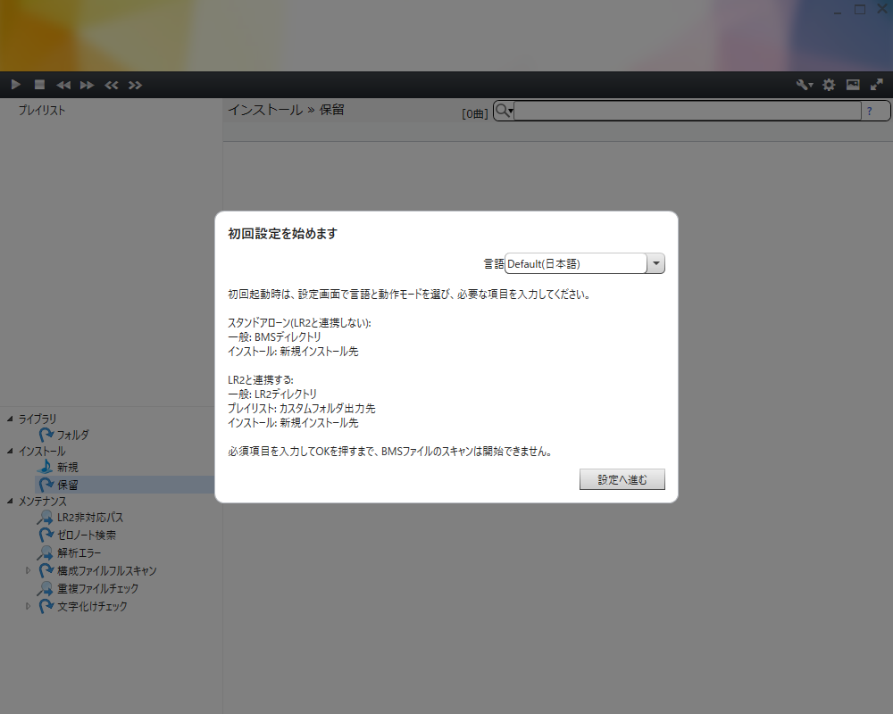

言語を選んで設定画面へ進み、動作モードと必須項目を設定します。必須項目を入力して `OK` を押すまで、BMS ファイルの初回スキャンは開始されません。

### 動作モード

BeMusicSeeker には大きく 2 つの動作モードがあります。

#### スタンドアローン(LR2と連携しない)

LR2 の `song.db` を使わず、アプリ配下の `data/song.db` でライブラリを管理します。

主に必要な設定:

- `一般` タブ: BMS ディレクトリ
- `インストール` タブ: 新規インストール先

LR2 のスコア、LR2 用カスタムフォルダ出力、LR2IR 関連の一部機能は使いません。BMS ファイルの整理、検索、インストール、メンテナンスを BeMusicSeeker 側だけで行いたい場合に使います。

#### LR2と連携する

LR2 の `config.xml` / `song.db` / `score.db` を使って、LR2 の所持譜面、スコア、カスタムフォルダ出力と連携します。

主に必要な設定:

- `一般` タブ: LR2 ディレクトリ、`song.db`、`config.xml`
- `プレイリスト` タブ: カスタムフォルダ通常出力先、ルートフォルダ出力先
- `インストール` タブ: 新規インストール先

LR2 と同じライブラリを BeMusicSeeker で管理したい場合はこちらを使います。

LR2 連携モードでは、初回準備や今後の更新で `song.db` に BeMusicSeeker 用のテーブルや index が追加される場合があります。設定画面で `OK` を押して初回スキャンを始める前に、`song.db`、`config.xml`、score DB など LR2 関連ファイルをバックアップしておくと安心です。

LR2 連携モードでは、BeMusicSeeker は所持 BMS の `song` / `folder` 情報を LR2 の `song.db` に書き込み、LR2 側の起動時再帰スキャンをできるだけ発生させない状態を維持します。初回や設定変更後は不足している既存 row を backfill します。進捗は起動時進捗またはステータスバーに表示され、完了後は通常のインストール、削除、マージ、拡張子変更などのライブラリ更新に合わせて差分更新されます。bmson は LR2 の `song` / `folder` には書き込まず、BeMusicSeeker 側の管理情報として扱います。

LR2 `song.db` の同期中は、所持譜面と LR2 `song.db` を同時に変更する操作が一時的に止まる場合があります。ステータスバーに失敗や未完了が表示された場合は、`再試行` を押してください。必要に応じて設定画面の `LR2 song.db データを再同期` から、所持譜面とプレイリストを正本として `song` / `folder` を再生成できます。

### 初回スキャン

設定完了後、初回スキャンが始まります。初回は全譜面ファイルを確認し、DB へ登録し、インストール推定やメンテナンス情報に必要な基礎データを作成します。  
ライブラリ規模、ディスク速度、Everything の利用状況によって、数分からそれ以上かかる場合があります。

初回構築が完了すると、次回以降は差分更新中心になります。BMS フォルダ全体を大きく移動した場合や、DB を空から作り直した場合は、再び重い処理になります。

> 参考までに私の環境では約21万譜面の規模で初回DB構築が11分程度でした。2回目以降の起動では、差分導入可能までが20秒程度、ライブラリ一覧の完全な表示が可能になるまでが40秒程度でした。SSD環境であればそれなりに古いPCでもこの程度の速度で構築可能です。

## 設定画面

設定画面は `OK` を押すと保存されます。設定内容によって、即時反映、スコアのみ再読み込み、ライブラリリロード、再初期化、再起動要求のいずれかになります。

### 一般

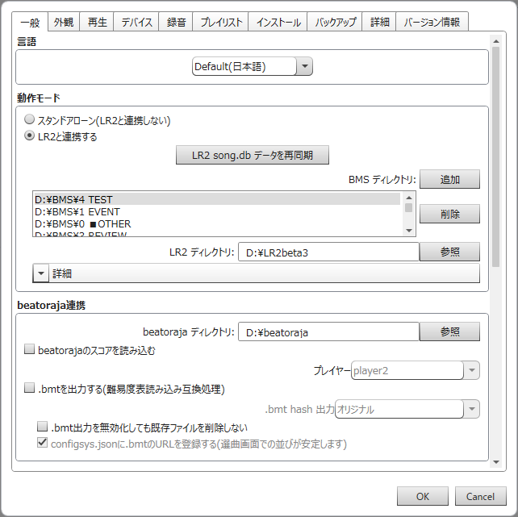

`一般` タブでは、言語、動作モード、BMS ディレクトリ、LR2 ディレクトリ、`song.db`、`config.xml`、`beatoraja ディレクトリ` などを設定します。

スタンドアローンモード、LR2 連携モードのどちらでも、BMS ディレクトリに譜面を探すルートフォルダを登録します。LR2 連携モードでは、あわせて LR2 ディレクトリと DB / XML パスも設定します。

#### スタンドアローン

LR2 本体を所持していない場合でも本アプリ単独で BMS の管理が行えるモードです。
BMS ディレクトリに設定した場所が譜面を探す対象となります。
`data\song.db` に所持 BMS 管理用の DB が作成されます。保存される内容は LR2 連携モード時とほとんど変わりませんが、カスタムフォルダの出力や LR2 での選曲時に必要な固有のデータの記録などは行われないため LR2 を使用していない場合は僅かに処理の負荷が下がります。

#### LR2と連携する

従来の BeMusicSeeker からある連携モードです。

LR2 連携モードでは、BeMusicSeeker が LR2 `song.db` に必要な `song` / `folder` 情報を生成・差分更新します。BMS ディレクトリの追加・削除は BeMusicSeeker の `一般` タブで行い、LR2 SETUP の `JUKEBOX` タブでは変更しない運用を推奨します。

初回設定保存時および LR2 連携モードでの起動時には、LR2 `config.xml` の `<autoreload>` を `0` に設定し、LR2 SETUP の「データベース自動更新」を「手動のみ」にします。これは BeMusicSeeker が `song.db` を管理する前提で、LR2 自身の自動更新による追加スキャンや、Shift_JIS で表現できないパスが崩れた DB 行の追加を避けるためです。

ただし、LR2 でのスキャン時や再生時にエラーとなる譜面でも、本アプリでの管理対象譜面とするために song テーブルに保存された状態となります。このような譜面は選曲画面に表示されていたとしても、再生を開始した場合に不具合が生じる可能性もあるのでご了承ください。既知の LR2 互換性リスクの一部は `LR2互換性警告` 画面で確認できます。

`LR2 song.db データを再同期` ボタンは folder, song テーブルを再生成するものです。何らかの理由で DB が不完全な状態になってしまった場合でも、所持譜面とプレイリストから再解析・再生成を行います。

#### beatoraja連携

beatoraja については、スコア DB の読み込みや難易度表キャッシュ出力など一部連携に対応していますが、beatoraja 全体を管理するためのツールではありません。**beatoraja のDB更新を高速に行いたい場合は [songdata-updater](https://github.com/Neeted/songdata-updater) をご利用ください。**

beatoraja 連携では beatoraja ディレクトリを指定します。直下の `config_sys.json` から `tablepath` と `playerpath` を読み取り、スコア読み込みでは選択したプレイヤーフォルダの `score.db` を使います。

`.bmtを出力する(難易度表読み込み互換処理)` を有効にすると、BeMusicSeeker の全プレイリストを beatoraja が読み込める `.bmt` キャッシュとして `config_sys.json` の `tablepath` 配下へ出力します。これは beatoraja 側の level 集約処理が重く、難易度表読み込みで遅延する環境向けの互換処理です。外部同期表は元の難易度表 URL、ローカルプレイリストは `bemusicseeker://playlist/{playlist_id}` を使って `.bmt` の保存名を決めます。出力先直下には BeMusicSeeker 管理用の `.bemusicseeker-bmt-manifest` が作られ、設定変更や再出力時の cleanup では、この manifest に記録された `.bmt` だけを削除対象にします。

`.bmt hash 出力` では、folder song の `md5` / `sha256` の出し方を選べます。`オリジナル` はプレイリストに保存されている hash だけをそのまま出力します。`md5/sha256をできるだけ補完` は、所持譜面や譜面メタデータから安全に解決できる場合に不足している hash を補完します。`できるだけsha256のみ` は、sha256 を出せる譜面では md5 を出さず sha256 のみに寄せますが、sha256 を解決できない譜面は md5 のまま残します。既定値は `オリジナル` です。段位コースの hash は元の難易度表データをそのまま使い、この補完対象にはなりません。

`config_sys.jsonに.bmtのURLを登録する(選曲画面での並びが安定します)` が有効な場合、BeMusicSeeker 管理の `.bmt` URL を `config_sys.json` の `tableURL` へ登録します。管理外の `tableURL` は既存順を維持し、BeMusicSeeker 管理分はプレイリスト名順で後ろに並びます。

### 外観

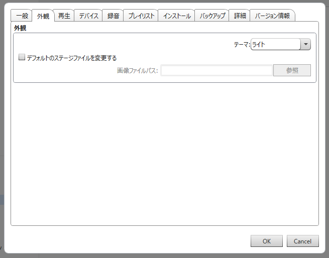

テーマや表示に関わる設定を変更します。外観変更は基本的にライブラリ再構築を必要としません。

### 再生

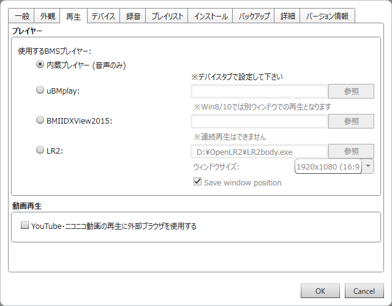

譜面を再生するプレイヤーを選択します。内蔵プレイヤーは音声のみの簡易再生用です。uBMplay、BMIIDXView2015、LR2 など外部プレイヤーを使う場合は、実行ファイルのパスを指定します。

スタンドアローンモードでも、再生用アプリとして LR2body を指定できます。これは LR2 の DB と連携するかどうかとは別の設定です。

### デバイス

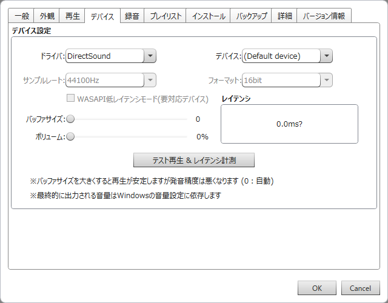

再生ドライバ、出力デバイス、サンプルレート、フォーマット、バッファサイズ、音量などを設定します。音が出ない、遅延が大きい、音切れする場合は、このタブの設定を確認してください。

### 録音

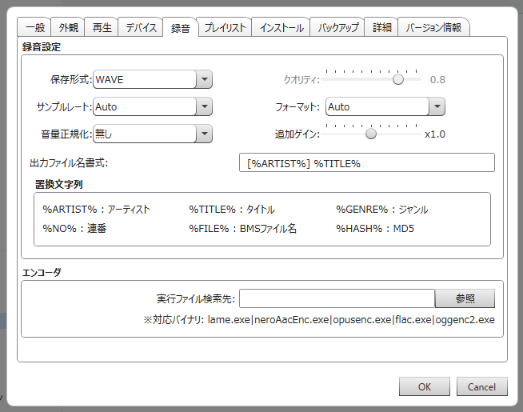

録音形式、品質、サンプルレート、出力ファイル名書式、エンコーダの場所などを設定します。外部エンコーダを使う場合は、`lame.exe`、`oggenc2.exe` など対応する実行ファイルを含むフォルダを指定します。

### プレイリスト設定

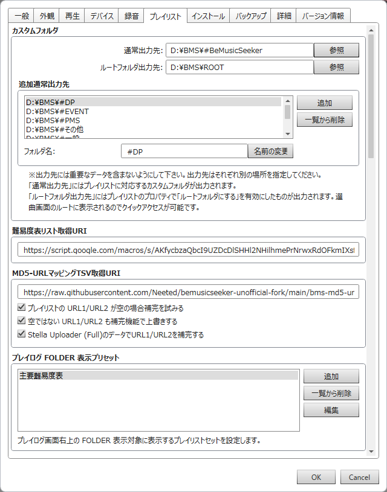

カスタムフォルダ出力先、難易度表リスト取得 URI、MD5-URL マッピング TSV 取得 URI、URL1/URL2 補完設定を変更します。

`通常出力先` には、プレイリストに対応する通常のカスタムフォルダが出力されます。  
`ルートフォルダ出力先` には、プレイリストのプロパティで `ルートフォルダにする` を有効にしたものが出力されます。選曲画面のルートに表示されるため、よく使う表へ素早くアクセスできます。

URL 補完については [URL1/URL2 補完](#url1url2-補完) を参照してください。

### インストール

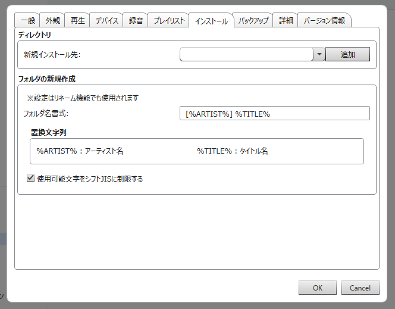

新規インストール先と、新規フォルダ作成時の命名形式を設定します。  
どちらの動作モードでも、登録済み BMS ディレクトリ内からインストール先を選ぶ必要があります。

### バックアップ

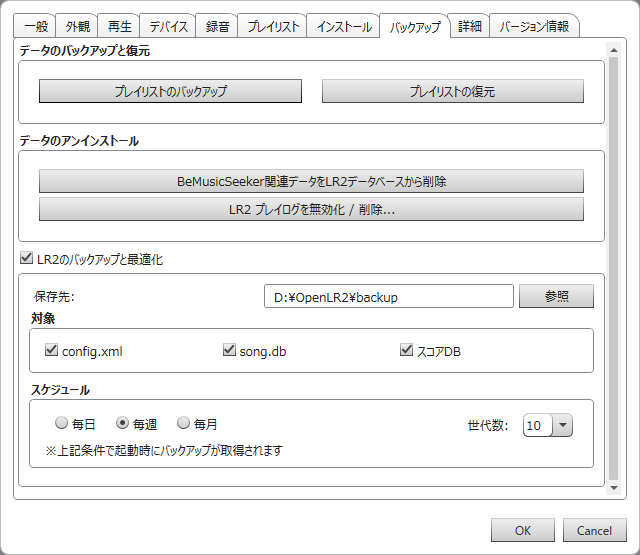

プレイリストのバックアップ / 復元、LR2 関連ファイルのバックアップ、世代数などを設定します。互換性に不安がある更新や大きな整理を行う前は、バックアップを取っておくことをおすすめします。

### 詳細

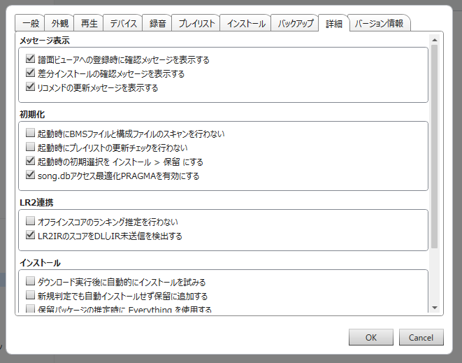

確認メッセージ、初期化、LR2 連携、インストール補助などの詳細設定を変更します。

起動時のファイルチェックを省略すると起動は軽くなりますが、BMS ルートの列挙と導入先推定に使うリソース索引を作りません。保留パッケージの導入先推定を行うには、手動でライブラリの `リロード` または `初期化再実行` を実行してください。  
インストール関連の設定には、元パッケージ削除やスマート上書きなど実ファイル操作に影響するものがあります。内容を確認してから変更してください。

#### 詳細タブの各設定

| グループ | 設定 | 既定値 | 内容 |
| --- | --- | --- | --- |
| メッセージ表示 | 譜面ビューアへの登録時に確認メッセージを表示する | ON | 譜面ビューア登録操作の前に確認を表示します。 |
| メッセージ表示 | 差分インストールの確認メッセージを表示する | ON | 推定先への差分インストールなど、既存フォルダへ入れる操作の前に確認を表示します。 |
| メッセージ表示 | リコメンドの更新メッセージを表示する | ON | リコメンド情報更新時の通知を表示します。 |
| 初期化 | 起動時にBMSファイルと構成ファイルのスキャンを行わない | OFF | 起動時のファイル差分確認とリソース索引構築を省略します。DB に保存済みのライブラリ一覧は読み込みますが、手動でライブラリの `リロード` または `初期化再実行` を行うまで、保留パッケージの導入先推定に必要な索引がないため推定できない場合があります。 |
| 初期化 | 起動時にプレイリストの更新チェックを行わない | OFF | 起動時の外部プレイリスト更新確認を省略します。必要な場合は手動でプレイリストをリロードしてください。 |
| 初期化 | 起動時の初期選択を インストール > 保留 にする | ON | 起動後の初期表示を保留パッケージ画面にします。新規導入や保留整理を優先したい場合向けです。 |
| 初期化 | song.dbアクセス最適化PRAGMAを有効にする | ON | DB 読み込み時に読み取り向けの SQLite PRAGMA を設定し、起動やリロードを高速化します。通常は ON のままにします。 |
| LR2連携 | オフラインスコアのランキング推定を行わない | OFF | LR2IR の ranking cache XML を使ったオフラインスコア順位推定を省略します。ON にすると処理は軽くなりますが、未送信スコアの順位推定は行われません。 |
| LR2連携 | LR2IRのスコアをDLしIR未送信を検出する | OFF | LR2IR のスコア情報を取得し、ローカルスコアとの差分から未送信状態を検出します。 |
| インストール | ダウンロード実行後に自動的にインストールを試みる | OFF | URL からダウンロードしたパッケージを、可能であればそのままインストール処理へ進めます。**ON にすると便利**ですが、多重圧縮などでそのままでは導入に進めない形式のファイルの場合は保留画面に追加されないといった留意事項があるので規定値は OFF にしています。 |
| インストール | 新規判定でも自動インストールせず保留に追加する | OFF | 新規作品として十分なリソースが揃っていても自動導入せず、必ず保留一覧で確認できるようにします。 |
| インストール | 保留パッケージの推定時に Everything を使用する | OFF | 保留パッケージの導入先推定で、source 側リソース列挙に Everything を使います。大きな保留フォルダでは高速化する場合があります。通常の差分導入時は OFF の方が高速に動作すると思われます。 |
| インストール | 複数候補でも高一致なら第1候補を導入先に設定する | OFF | 複数の導入先候補がある場合でも、十分に一致度が高いと判断できる場合は最上位候補を `INSTL DST` に設定します。OFF では曖昧な場合に WARNING と候補リストを残します。**難易度表パッケージの利用などで重複BMSが多い環境で ON にする想定**です。 |
| インストール | 通常インストール時、既所持譜面が残っていても元パッケージを削除する | OFF | 通常インストール後、source に既所持譜面などの残り物があっても元パッケージを削除します。取り消しにくい操作なので、通常は OFF を推奨します。既所持譜面交じりの差分パッケージを導入する際に source フォルダを迅速にクリーンアップするという用途を想定しています。 |
| インストール | 差分導入時に更新日時とサイズを比較して同梱ファイルの上書きを最適化する | ON | [スマート上書き](#スマート上書き) を有効にします。 |
| インストール | スマート上書き時、*.bmx/*.pmx/*.txt は上書きせず自動採番で保持する | OFF | [スマート上書き](#スマート上書き) で保護対象拡張子を上書きせず、連番名で残します。 |

#### スマート上書き

スマート上書きは、差分導入やマージで既存フォルダへファイルを移動するとき、譜面ファイル本体以外の同梱コンポーネント、つまり音源、BGA、動画、画像、readme などの衝突を調整する機能です。既定では有効です。

**端的に言えば調整前の古い音源やBGAで上書きすることを防ぐ目的の機能です。**

通常の上書きでは、同名ファイルが導入先にある場合、source 側ファイルで上書きします。スマート上書きが有効な場合は、source と導入先のファイルサイズ、更新日時を比較し、次のように処理します。更新日時の比較には、おおむね 2 秒までの差を同一時刻として扱う許容があります。

- 導入先に同名ファイルがない場合は、そのまま移動します。
- サイズと更新日時がほぼ同じ場合は同一ファイルとみなし、source 側を削除して導入先の既存ファイルを残します。
- source 側の方が新しい場合は、導入先を source 側で上書きします。
- 導入先の方が新しい、または同等以上と判断した場合は、導入先を残して source 側を削除します。

`スマート上書き時、*.bmx/*.pmx/*.txt は上書きせず自動採番で保持する` を有効にすると、`.bmx`、`.pmx`、`.txt` はスマート上書きで上書き対象になった場合でも、導入先の既存ファイルを残し、source 側を `name(1).txt` のような空き連番名で保存します。連番候補に同一内容のファイルが既にある場合は、同じファイルを増やさず source 側を削除します。内容が異なる場合、または hash 比較ができない場合は、空いている連番名へ移動します。

NOTE: BMS / PMS / bmson などの譜面ファイル本体は、同名衝突時に上書きせず、`chart_.bms` のように名前をずらして導入します。これはスマート上書き設定とは関係のない本アプリでの挙動です。

この設定は、推定先へのインストール、既所持譜面のみパッケージのリソース上書き、重複フォルダのマージなど、既存フォルダへ同梱ファイルを移動する処理で使われます。未所持の新規作品を新しいフォルダへ丸ごと導入する場合は、そもそも同名ファイル衝突が少ないため、スマート上書きの影響は限定的です。

## 起動・リロード・進捗表示

BeMusicSeeker の起動処理は段階的に進みます。

1. 設定と DB の確認
2. BMS ファイル列挙
3. DB との差分確認
4. 追加・削除・更新の反映
5. インストール推定やリソース索引の準備
6. 画面表示可能状態への移行
7. プレイリスト、スコア、譜面メタデータ、メンテナンス情報などのバックグラウンド処理

ステータスバーには、初期化、ファイル差分確認、プレイリスト同期、導入先推定などの進捗が表示されます。

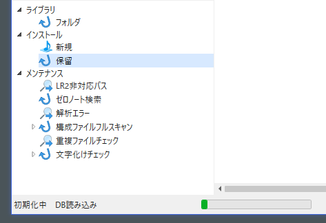

### ライブラリのリロード

ライブラリ右クリックの `リロード` は、所持ファイルの追加・削除・更新を反映する操作です。DB 全体の作り直しやスコア再読み込みではありません。

以下のような場合に使います。

- BMS フォルダへファイルを追加した
- BMS フォルダからファイルを削除した
- BMS ルートフォルダを増減させた
- 外部で BMS フォルダを移動・改名した

### 初期化再実行

`初期化再実行` は通常のリロードより重い操作です。外部ツールで DB を編集した場合や、状態を大きく作り直したい場合に使います。ここでの初期化とはアプリ起動毎の初期化処理のことでありライブラリの再構築を指す用語ではありません。

### プレイリストのリロード

プレイリストのリロードは、外部難易度表やプレイリスト定義を再取得する操作です。

プレイリストツリールートのリロードは、外部同期が有効なプレイリストを対象にします。  
プレイリスト単体やサマリー選択範囲からのリロードは、選択したプレイリストを外部同期フラグに関係なく対象にします。

リロード失敗は、プレイリストサマリーの `STATUS` とログに集約されます。

## 画面構成

主画面は、左サイドバーと右側の一覧で構成されています。

左サイドバーには、ライブラリ、プレイリスト、インストール、メンテナンスなどのツリーがあります。右側の一覧は、選択した画面に応じて譜面一覧、プレイリスト詳細、プレイリストサマリー、保留パッケージ、メンテナンス結果を表示します。

列幅、表示/非表示、表示順は画面ごとに保存されます。ヘッダー右クリックから列表示を変更できます。列順や列幅はマウスドラッグで調整できます。

## ライブラリ一覧

ライブラリ一覧では、登録済み譜面を検索・再生・整理できます。

**強力な検索構文を備えています。 [キーワード検索構文ガイド](keyword-search-syntax-guide.ja.md) を参照してください。**
`title:`、`artist:`、`playlist:`、`rate:` などの field 指定や、除外検索、OR、正規表現、数値範囲検索を使えます。`TOTAL`、`DIFFICULTY` などのカラムで背景色が付いているセルは未定義だったことを表しています。`total:undef` などで検索可能です。

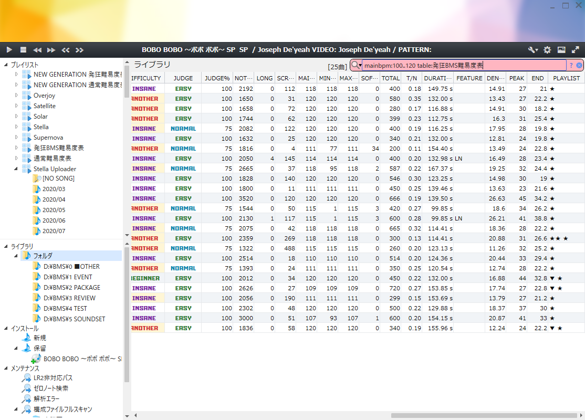

列ヘッダーをクリックするとソートできます。`TITLE`、`ARTIST`、`PATH`、`LEVEL`、`CLEAR` など、多くの列を表示できます。列の表示や順番はヘッダー右クリックメニューから変更できます。

### 一覧のコピー操作

ライブラリ、プレイリスト詳細、インストール / 保留などの一覧では、キーボードで表示内容をコピーできます。

- `Ctrl + C`: 現在フォーカスされているセルの表示値をコピーします。URL 列など一部の列では、画面上の短い表示ではなく実際に開く URL がコピーされます。
- `Ctrl + Shift + C`: 選択中の行を TSV 形式でコピーします。複数行を選択している場合は、選択行がまとめてタブ区切りテキストになります。表計算ソフトやテキストエディタへ貼り付けて確認するときに使えます。

### 一覧の右クリックメニュー

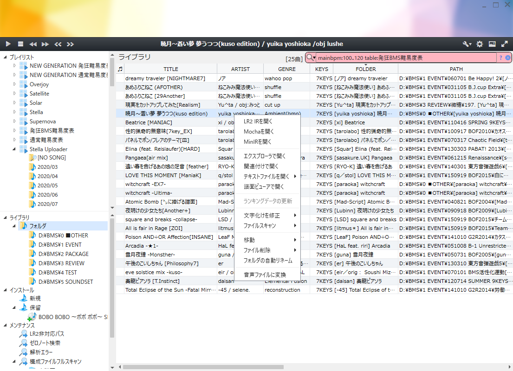

譜面行やプレイリスト行を右クリックすると、選択中の行に対する操作を呼び出せます。表示される項目は、通常ライブラリ、プレイリスト詳細、未所持譜面、保留、新規、メンテナンス画面など、現在の画面と選択行の種類によって変わります。

開く / 外部ページ:

- `BMS-IRを開く`: 対象譜面の BMS-IR ページを MD5 で開きます。MD5 がない行では表示されません。
- `Mochaを開く`: 対応する Mocha ページを開きます。
- `MinIRを開く`: 対応する MinIR ページを開きます。
- `本体URLを開く` / `差分URLを開く`: プレイリスト由来または URL 補完で得られた本体 URL / 差分 URL を開きます。
- `エクスプローラで開く`: 譜面ファイルのあるフォルダを Explorer で開きます。
- `インストール先を開く`: `INSTL DST` やインストール先として記録されているフォルダを開きます。
- `関連付けで開く`: 譜面ファイルを OS の関連付けで開きます。
- `テキストファイルを開く`: 同じフォルダ内の readme などの文書候補をサブメニューから開きます。
- `動画を開く`: YouTube / ニコニコ動画など、譜面に紐づく動画候補を開きます。ただし、この候補は `http://www.ribbit.xyz` の LR2IR キャッシュ情報に依存しています。現時点では同サイトが利用できないため、**この機能は実質的に動作しません。**
- `入手先を検索`: プレイリスト URL、補完 URL、コメント中の URL などからダウンロード元候補を開きます。一般的な Web 検索を行う機能ではなく、プレイリスト行に紐づく URL 候補を集める機能です。LR2IR キャッシュ情報や Ribbit 側の補助取得は `http://www.ribbit.xyz` に依存するため、同サイトが利用できない場合はその分の候補は取得できません。一方で、プレイリスト自体の URL1 / URL2、コメント内 URL、MD5-URL マッピング TSV、Stella Uploader (Full) 由来の URL 補完などは引き続き利用できます。
- `譜面ビューアで開く`: 譜面ビューアへ登録または表示します。

スコア / ranking:

- `ランキングデータの更新`: 対象譜面の ranking cache / IR データを更新します。ただし、この機能は `http://www.ribbit.xyz` の LR2IR キャッシュ情報に依存しています。現時点では同サイトが利用できないため、**この機能は実質的に動作しません。**

文字コード / ファイルスキャン:

- `文字化けを修正`: 日本語 Shift_JIS、UTF-8、韓国語 KS_C_5601、簡体字 GB2312、繁体字 Big5 などから文字コードを指定します。`修正済みにする` は、現在の推定結果を確認済みとして扱います。
- `ファイルスキャン`: 選択譜面を再スキャンし構成ファイルフルスキャン画面などで確認できる譜面の健康度を再設定します。`全譜面を再スキャン` はライブラリ内の譜面全体を対象にします。`無視リストに追加` / `無視リストから削除` は、構成ファイルフルスキャンなどの表示対象から外すための設定です。

インストール / 導入先:

- `インストール` → `インストール先を推定`: 保留譜面の導入先を推定します。
- `インストール` → `マージ先を推定`: 既所持譜面のみパッケージやリソース寄せ向けに、同梱リソースを評価へ足さない推定を行います。
- `インストール` → `推定先にインストール`: `INSTL DST` に導入します。
- `インストール` → `警告を無視してインストール`: 推定先を使わず通常の新規インストールとして扱います。
- `インストール` → `インストール先をクリア`: `INSTL DST`、推定先表示、推定 warning、候補を消します。
- `インストール先を修正`: 導入済み譜面の `instl_dst` を再推定し、`推定先に再インストール` で記録を更新します。`再インストール先をクリア` で候補を消します。

ファイル整理:

- `移動`: ライブラリ内のルートフォルダ候補へ譜面ファイルを移動します。
- `エントリー削除`: プレイリスト詳細で、選択行をプレイリストから外します。
- `ファイル削除`: `無効な拡張子に変更(*.bmx/pmx)` または `ごみ箱へ移動` を選べます。
- `フォルダの自動リネーム`: 選択譜面のフォルダ名を設定のフォルダ名書式に合わせて変更します。
- `音声ファイルに変換`: 設定画面の録音設定に従い、譜面再生結果を音声ファイルとして出力します。

通常ライブラリで `ファイル削除` → `ごみ箱へ移動` を実行すると、選択譜面を削除した結果として対象フォルダ内に譜面が残らない場合、フォルダごとごみ箱へ移動する確認が出ることがあります。この場合、譜面以外の同梱ファイルも一緒に移動対象になります。確認ダイアログの対象パスを見てから実行してください。

画面固有:

- `一覧から削除`: 新規 / 保留 / 導入済みパッケージ表示から対象を取り除きます。実ファイル削除を伴う操作とは区別してください。
- `メタデータ解析失敗記録を除去`: 解析エラー画面で表示され、保存済みの解析失敗記録を削除して再パース対象に戻します。

未所持譜面のプレイリスト詳細では、ファイル操作やインストール操作は表示されず、`BMS-IRを開く` / `Mochaを開く` / `MinIRを開く` / `本体URLを開く` / `差分URLを開く` / `動画を開く` / `入手先を検索` / `譜面ビューアで開く` / `ランキングデータの更新` / `エントリー削除` など、プレイリスト行に対する操作だけが表示されます。`BMS-IRを開く` は MD5 がある行でのみ表示されます。

実ファイルを変更する操作は、読み取り専用属性などで失敗しにくいよう Windows Explorer に近い挙動へ寄せています。ただし、削除や上書きは元に戻せない場合があるため、対象を確認してから実行してください。

#### 無効な拡張子に変更

`無効な拡張子に変更(*.bmx/pmx)` は、選択した BMS / PMS 系譜面の拡張子を LR2 などが通常譜面として読まない拡張子へ変更する機能です。BMS 系拡張子は `.bmx`、PMS 系拡張子は `.pmx` へ変更します。主に、0 notes 譜面、誤って譜面として登録されたファイルをライブラリから外したい場合に使います。

変更先のファイル名が空いている場合は、そのままリネームします。変更先が既に存在する場合は、次のように衝突を解決します。

- 変更先の `.bmx` / `.pmx`、または `名前(1).bmx` のような連番候補に同一内容のファイルが既にある場合は、同じファイルを増やさず、元の `.bms` / `.pms` 側を重複として削除します。
- **変更先や連番候補が存在しても内容が異なる場合は、空いている連番名へリネームします。**
- 変更先に同名ディレクトリがある場合も、その名前は避けて連番候補を探します。

同一内容の判定にはファイル内容の MD5 を使います。

通常ライブラリ上で実行した場合、リネームまたは重複削除された譜面は一覧から外れます。保留一覧上で実行した場合も、処理された譜面は保留パッケージから除外されます。

### ツリーの右クリックメニュー

左サイドバーのツリーにも、場所ごとに右クリックメニューがあります。

ライブラリ:

- ライブラリルート: `リロード`、`初期化再実行`、`ルートフォルダを追加` を実行できます。
- ライブラリフォルダ: `リロード`、`初期化再実行`、`エクスプローラで開く`、`ルートフォルダの登録解除`、`フォルダの一括リネーム` を実行できます。
  - `フォルダの一括リネーム` はルートフォルダの規模によってはかなり時間が掛かると思われるので**通常は検索で候補を絞り選択範囲に対しての右クリックメニューから実行することをおすすめします。**

プレイリスト:

- プレイリストルート: `新規作成`、`インポート`、`リロード` を実行できます。インポートには、URL 指定、難易度表リストからの読み込み、発狂 BMS 難度推定表、リコメンド表などがあります。
- プレイリスト本体: `リロード`、`ページを開く`、`クリアランプ (外部サイト)`、`レベルを上書き`、`フォルダの新規作成`、`エクスポート`、`プレイリストの削除`、`プロパティ` を実行できます。各項目の詳細は [プレイリスト詳細](#プレイリスト詳細) を参照してください。
- プレイリスト内フォルダ: `削除`、`名前の変更` を実行できます。
- プレイリストサマリー行: `リロード`、`ページを開く`、`プロパティ`、`プレイリストの削除` を実行できます。サマリーで複数行を選んだリロードは、選択したプレイリストを外部同期フラグに関係なく対象にします。

インストール:

- `新規` ルート: `全てクリア` で新規パッケージ表示を空にします。
- `保留` ルート: `全てクリア` と `高度な機能` を実行できます。高度な機能については [高度な機能](#高度な機能) を参照してください。
- 保留パッケージ: `エクスプローラで開く`、`インストール先を開く`、`インストール` サブメニュー、`一覧から削除` を実行できます。`インストール` サブメニューには、`インストール先を推定`、`マージ先を推定`、`推定先にインストール`、`警告を無視してインストール`、`インストール先をクリア` があります。
- 導入済みパッケージ: `エクスプローラで開く`、`一覧から削除` を実行できます。

メンテナンス:

- `ゼロノート検索`: `ゼロノート記述確認` を実行できます。
- `重複ファイルチェック` のフォルダ: `エクスプローラで開く`、`マージ先` を実行できます。重複フォルダマージについては [重複フォルダをマージする](#重複フォルダをマージする) を参照してください。

列ヘッダーの右クリックメニューでは、表示する列を切り替えたり、列設定を初期値へ戻したりできます。プレイリストサマリーにも専用の列表示メニューがあります。

### その他のポップアップメニュー

右クリックではありませんが、画面上部のボタンから開くメニューもあります。

- 再生コントロールのメニュー: ハイスピード変更、プレイヤー情報 / エフェクト画面表示、1P/2P 切り替え、音量、`REPEAT`、`FOLDER SKIP`、`SINGLE PLAY` を操作できます。利用できる項目は、設定している BMS プレイヤーによって変わります。
- モードフィルタ: `5KEYS`、`7KEYS`、`9KEYS`、`10KEYS`、`14KEYS` の表示対象を切り替えます。
- プレイリストサマリーの所持率フィルタ: `All`、`OWNED=100%`、`OWNED<100%` を切り替えます。

## 検索

右上の検索ボックスに文字を入力すると、一覧を絞り込めます。

通常検索では、大文字・小文字を区別せず、複数語は AND 検索になります。

```text
alpha artist
```

より細かく探す場合は、field 指定を使います。

```text
title:Satellite
artist:xi
level:12
rate:>=80
playlist:"Satellite Sub"
```

検索欄には field 補完、プレイリスト名補完、検索履歴があります。  
詳しい構文は [キーワード検索構文ガイド](keyword-search-syntax-guide.ja.md) を参照してください。

## 再生・録音

一覧で譜面をダブルクリック、または Enter を押すと再生できます。使用するプレイヤーは設定画面の `再生` タブで選択します。

内蔵プレイヤーは音声のみの簡易再生用です。外部プレイヤーを使う場合は、対応する実行ファイルを指定してください。

bmson はライブラリ上では譜面ファイルとして扱われますが、現時点では内蔵プレイヤーでの再生と `音声ファイルに変換` には対応していません。通常の再生操作で設定済み外部プレイヤーへ渡すこともできません。bmson を再生したい場合は、`関連付けで開く` などで、bmson に対応した外部アプリから開いてください。

録音は設定画面の `録音` タブで、保存形式、品質、サンプルレート、ファイル名書式、エンコーダの場所を設定します。録音の保存先やエンコード形式は、事前に短い譜面で確認しておくと安全です。

## プレイリスト

BeMusicSeeker では、導入済みの難易度表や独自プレイリストを `プレイリスト` として管理できます。プレイリストには、全体の所持状況を一覧するサマリー表示と、各譜面を確認する詳細表示があります。

### プレイリストサマリー

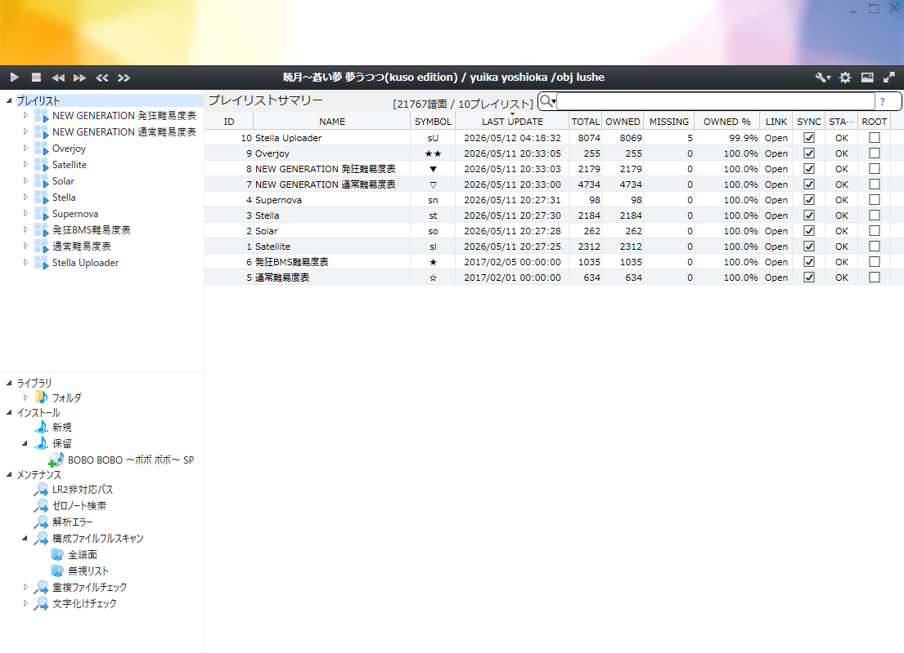

プレイリストサマリーでは、各プレイリストの譜面数、所持数、未所持数、所持率、外部同期の状態を一覧できます。

右上の検索欄から、所持率フィルタ: `All`、`OWNED=100%`、`OWNED<100%` を切り替えることができます。

未所持譜面が増えた表を見つけたら、**行をダブルクリックすると対象のプレイリスト詳細へ移動できます。**

`STATUS` 列には、起動後またはリロード時に行われた外部プレイリスト同期の結果が表示されます。リンク切れ、ヘッダ取得失敗、データ取得失敗などはここで確認できます。詳細はツールチップに表示されます。

### プレイリスト詳細

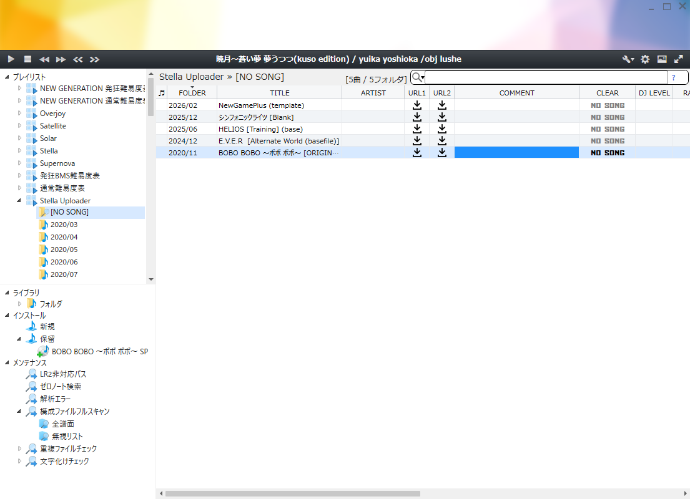

プレイリスト詳細では、選択したプレイリストに含まれる譜面を一覧できます。所持済み譜面と未所持譜面を確認でき、未所持譜面は `[NO SONG]` として表示されます。

`URL1` / `URL2` 列から本体 URL や差分 URL を開けます。URL がプレイリスト自体に含まれていない場合でも、URL 補完が有効であれば、外部マッピングから実行時に補完されることがあります。

プレイリストツリーでプレイリスト本体を右クリックすると、次の操作を実行できます。

- `リロード`: 対象プレイリストを再取得します。単体リロードでは、外部同期フラグに関係なく選択したプレイリストが対象になります。
- `ページを開く`: プレイリストのページ URI をブラウザで開きます。
- `クリアランプ (外部サイト)`: LR2ID とプレイリストのページ URI を外部 CLEAR LAMP サイトに渡して開きます。**ただし現時点では外部サイトが利用できない状態のため、内部ランプビューアを作成する方向で検討中です。**
- `レベルを上書き`: このプレイリストに登録されている譜面のレベルを使い、ローカルライブラリ側の同一譜面のレベルを上書きします。実行前に確認ダイアログが表示されます。リコメンド表など一部の特殊表では実行できません。実ファイルではなく song テーブルの保存値に対する操作です。**プレイスキンによっては使い道があるかも知れませんが個人的には使用をおすすめしません。**
- `フォルダの新規作成`: 外部同期ではないプレイリストに、手動管理用のフォルダを追加します。
- `エクスポート`: プレイリストを `header.json` と `data.json` の 2 ファイルとして保存します。保存先はそれぞれファイル選択ダイアログで指定します。
- `プレイリストの削除`: 対象プレイリストを BeMusicSeeker の管理対象から削除します。実行前に確認ダイアログが表示されます。
- `プロパティ`: プレイリスト名、表示記号、外部同期、URI、フォルダ出力などを編集します。

外部同期ではないプレイリストでは、一覧からプレイリスト本体またはフォルダへ譜面行をドラッグアンドドロップして追加できます。プレイリスト詳細内の行を別フォルダへドラッグすると、同じプレイリスト内でフォルダ間移動できます。フォルダ型のプレイリストにルートへドロップした場合は、既存フォルダの内容や同じ曲の MD5 情報を参考にしてフォルダが選ばれ、必要に応じて新しいフォルダが作成されます。

### 外部プレイリストのインポート

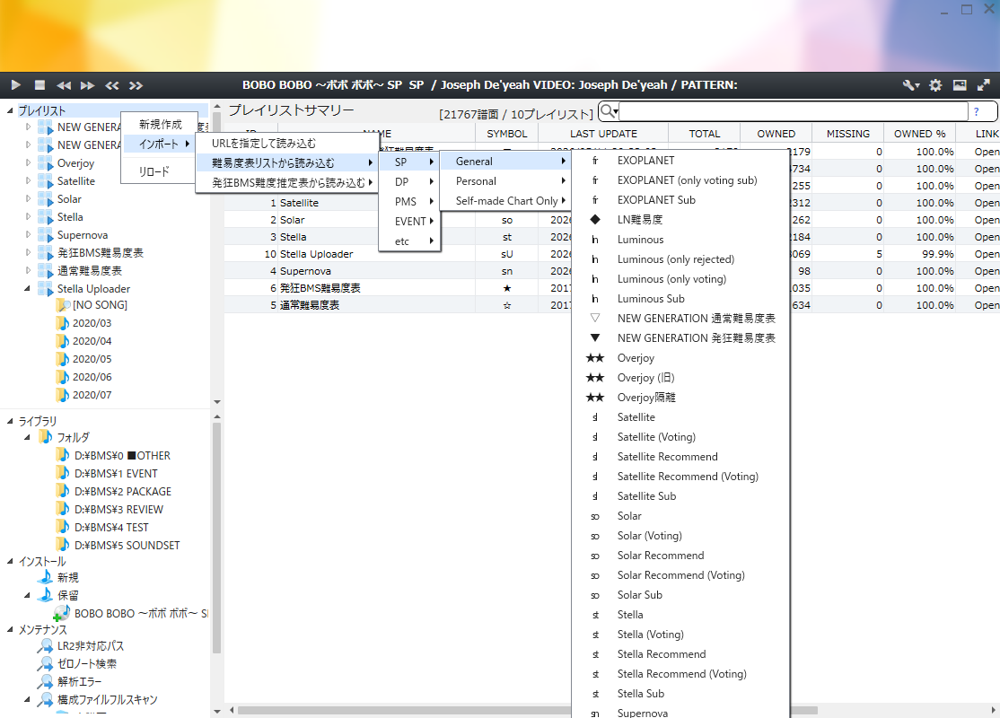

プレイリストツリーのルートを右クリックし、`インポート` から外部プレイリストを追加できます。登録済みの外部表リストから選ぶほか、URI を指定して読み込むこともできます。

既定の難易度表リスト取得URIは [DARKSABUN](https://darksabun.club/table/tablelist.html) が管理しているものです。

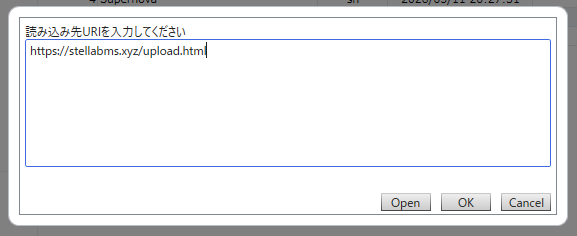

外部表リストやリコメンド表などのインポートメニューは、**項目を 1 つクリックしてもメニューが閉じないため、複数の表を続けて選択してインポートできます。**

`URLを指定して読み込む` では、読み込み先 URI を複数行で入力できます。複数の難易度表 URL をまとめて貼り付けると、行ごとに読み込み対象として扱われます。

外部同期プレイリストは、元の難易度表を再取得して更新できます。インポート後はプレイリストサマリーの `STATUS` 列で同期結果を確認してください。

### プレイリストのプロパティ

プレイリストを右クリックして `プロパティ` を開くと、プレイリスト名、表示記号、外部同期設定、ページ URI、ヘッダ URI、データ URI を確認・編集できます。

プレイリスト名やフォルダ設定などのプロパティは、スタンドアローンモードでもアプリ内 DB に保存されます。LR2 連携モードでのみ、保存後に LR2 用カスタムフォルダ出力も更新されます。

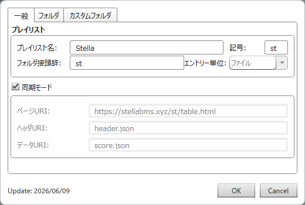

`フォルダ` タブでは、フォルダ内ソートのキーと昇順 / 降順、フォルダの並び順を設定できます。外部同期プレイリストでは、同期元と衝突する項目の編集が制限されます。

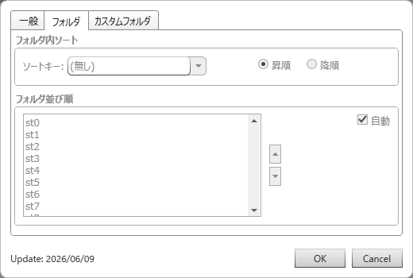

`カスタムフォルダ` タブでは、出力するフォルダ種別や出力名を設定できます。

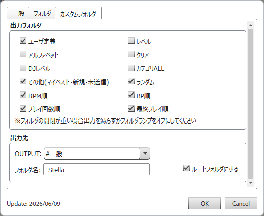

### カスタムフォルダ出力

LR2 連携モードでは、プレイリストを LR2 のカスタムフォルダとして出力できます。

設定画面の `プレイリスト` タブで通常出力先とルートフォルダ出力先を指定します。  
プレイリストの `プロパティ` から、出力名、`ルートフォルダにする`、出力するフォルダ種別を設定します。

出力先には重要なデータを置かず、通常出力先とルートフォルダ出力先は別の場所を指定してください。出力時は出力先配下の `.lr2folder` を書き直すため、手作業で管理している LR2 カスタムフォルダや他アプリのデータと同じ場所を指定すると、意図せず消える可能性があります。BeMusicSeeker 専用の空フォルダを用意することをおすすめします。

出力できる主なフォルダ種別:

- ユーザー定義
- レベル
- アルファベット
- クリア
- DJ レベル
- カテゴリ ALL
- その他

**個人的なおすすめは、ユーザ定義とその他だけチェックを入れた状態です。**

ルートフォルダにしたプレイリストは LR2 の選曲画面ルートに表示されます。よく使う表へ素早くアクセスしたい場合に便利です。

> 機能を充実させようという考えはあるものの [カスタムフォルダ出力ツール](https://github.com/Anyoji-bms/LR2FolderGenerator-v1.0.1) も存在しますし、今日では各種AIにこんなカスタムフォルダが欲しいという要望をDBのスキーマとともに伝えた方が各自の好みのものが生成できるのでは？という考えもあります。`chart_info` には各種メタデータ、`chart_digest_map` には BMS の MD5/SHA256 のマッピング、`playlist_entry` には SHA256 カラムを追加しているという状況なので工夫次第で色々なフォルダが作れると思います。

### URL1/URL2 補完

プレイリストの `URL1` / `URL2` が空の場合、MD5 をもとに外部 TSV や Stella Uploader 由来の情報から URL を補完できます。

補完結果はまず実行中の表示情報として扱われます。ローカルプレイリストで行編集を保存した場合のみ、補完値もプレイリストに保存されます。外部同期プレイリストの編集制限は維持されます。

設定画面の `プレイリスト` タブで、以下を設定できます。

- プレイリストの URL1/URL2 が空の場合補完を試みる
- 空ではない URL1/URL2 も補完機能で上書きする
- MD5-URL マッピング TSV 取得 URI
- Stella Uploader (Full) のデータで URL1/URL2 を補完する

TSV URI には HTTP/HTTPS のほか、ローカル TSV ファイルパスも指定できます。同じ MD5 に複数の補完元がある場合、TSV が優先されます。優先は MD5 単位で判定されるため、TSV に同じ MD5 の行がある場合は、TSV 側の URL1 または URL2 が空でも Stella Uploader (Full) 側の値では補いません。

## インストール / 保留パッケージ

BMS フォルダやアーカイブを BeMusicSeeker に追加すると、未導入の譜面や差分は `インストール` ツリーの `新規` / `保留` に表示されます。

**基本的な流れは次の通りです。**

1. BMS 作品、差分譜面、またはそれらを含むフォルダ / アーカイブを画面へドラッグアンドドロップします。
2. 未所持の新規作品としてリソースが十分に揃っているものは、設定画面の `新規インストール先` へ通常インストールされます。詳細設定で `新規判定でも自動インストールせず保留に追加する` を有効にしている場合は、新規判定でも保留に残ります。
3. リソースが少なく、既存作品に追加する差分譜面と判断されたものは `保留` に入り、導入先推定が行われます。
4. `WARNING`、`TITLE`、`ARTIST`、`INSTL DST TITLE`、`INSTL DST ARTIST` などを確認します。必要なら `INSTL DST` を手動入力、候補から選択します。
5. 問題ない行を選択し、右クリックメニューの `インストール` → `推定先にインストール` を実行します。

インストール処理は、元パッケージから導入先へファイルをコピーするだけではありません。フォルダパッケージでは、譜面や同梱ファイルを導入先へ移動し、処理後に元フォルダを削除する場合があります。元の配布物をそのまま残したい場合は、事前に別の場所へ控えを作ってください。

**`保留` や `新規` の一覧では複数行を選択できます。**

- 1 行クリックで単一選択
- `Ctrl + クリック` で個別に追加 / 解除
- `Shift + クリック` で範囲選択
- `Ctrl + A` で全選択
- キーボードでは `Shift + ↑ / ↓` で選択範囲を伸ばせます

**右クリックメニューのインストール、推定、削除などは、基本的に選択中の複数行を対象にします。数百譜面以上の一括導入を行うことも可能です。**

### 新規

`新規` には、導入直後のパッケージが表示されます。導入前の一時 WARNING は、導入後の状態に合わせて再評価されます。
例えば、差分単体なら `WAV 0%` という状態で `保留` に追加されますが、インストール後は `新規` で `WAV 100%` になるというのが典型的な導入成功例です。

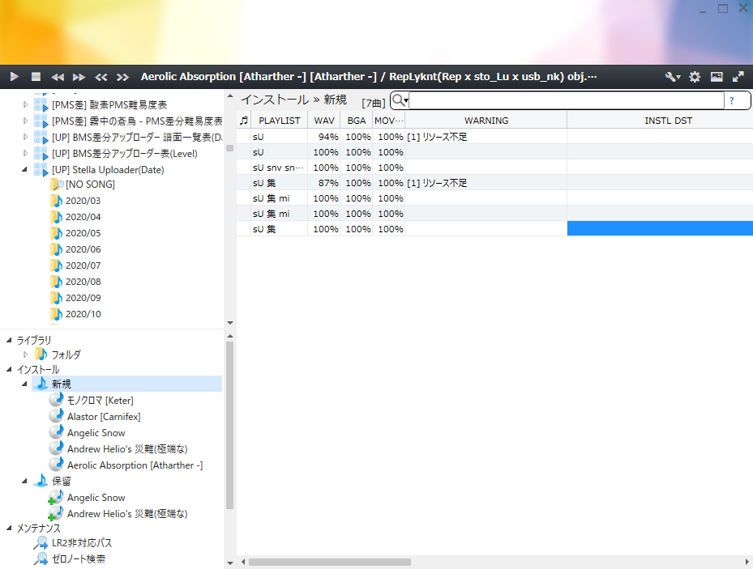

### 保留

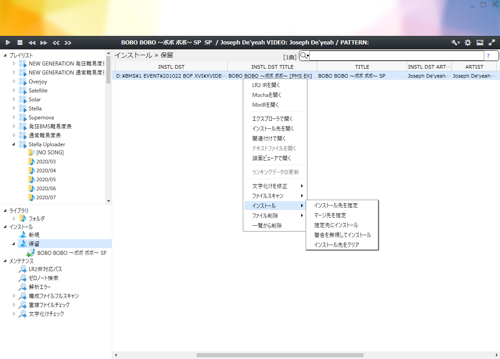

`保留` には、まだ導入前のパッケージが表示されます。推定された導入先の確認、手動導入先指定、インストール、一覧から削除、ごみ箱へ移動などを行います。

`一覧から削除` は表示上の保留行を取り除く操作です。実ファイルを消したい場合は右クリックメニューの `ファイル削除` → `ごみ箱へ移動` を使います。保留パッケージでは、フォルダごと削除するチェックが有効な場合でも、そのパッケージ内の譜面行がすべて選択対象に含まれているときだけ、パッケージフォルダ全体がごみ箱へ移動されます。複数行選択時は選択範囲すべてに同じ方針が適用され、対象フォルダごとの個別確認は出ないため、対象をよく確認してください。

保留に入った譜面は、既所持譜面の hash、フォルダ構成、譜面が参照している WAV / BGA / 動画 / 画像、同梱リソース、タイトル / アーティストなどを使って導入先を推定します。推定結果は主に次の列に表示されます。

- `INSTL DST`: 実際に導入する候補ディレクトリ。
- `INSTL DST TITLE`: 推定先ディレクトリを代表する既存譜面のタイトル。
- `INSTL DST ARTIST`: 推定先ディレクトリを代表する既存譜面のアーティスト。
- `WARNING`: 推定先が曖昧、低信頼、リソース不足などの注意。

推定は、「その差分譜面をどの既存ディレクトリに入れると参照リソースが最も揃うか」を見ます。特に音声リソースの一致を重く見て、画像や動画もカテゴリ別に照合します。`sound/foo.wav` と `foo.wav` のように相対パスが違うリソースは別物として扱います。

次のような場合は、自動で `INSTL DST` を確定せず、WARNING を出すことがあります。

- 有力な候補が複数あり、リソース一致度だけでは一意に決められない。
- パッケージ内の既所持譜面が複数の配置先に存在する。
- リソースはそこそこ一致するが、TITLE / ARTIST の一致度が低い。
- 起動時のファイル差分確認を省略しており、推定に必要なリソース index がない。

候補が複数ある場合は、`INSTL DST` セルをクリックして編集状態にすると、候補がサジェストとして表示されます。候補から選ぶと、そのディレクトリが `INSTL DST` に設定されます。候補を選んだ場合、曖昧さを示す WARNING は残ることがあります。これは別の候補を後で再選択する余地を残すためです。

`INSTL DST` は手動入力もできます。入力できるのは、所持譜面のフルパスそのもの、または所持譜面が配置されているディレクトリです。フルパスを入力した場合は、その譜面が入っているディレクトリに正規化されます。存在しないパスや、ライブラリ上の既存譜面ディレクトリとして認識されていない場所は指定できません。

### 導入先推定とマージ先推定

右クリックメニューの `インストール` には、似た名前の推定機能が複数あります。

`インストール先を推定` は、通常の差分導入向けです。保留パッケージに同梱されているリソースも「導入後に使えるもの」として数え、既存ディレクトリとの組み合わせで最も成立しやすい導入先を探します。通常はこの機能を使います。**つまり同梱の追加音源も考慮されるということです。**

`マージ先を推定` は、既所持譜面だけの保留パッケージや、リソースだけを既存フォルダへ寄せたいケース向けです。保留パッケージ内の同梱リソースを評価に足さず、既存ライブラリ側のリソースだけで成立する統合先を探します。推定済みの `INSTL DST` は上書きされます。実行前に確認ダイアログが出ます。

`推定先にインストール` は、`INSTL DST` が設定されている保留パッケージを、その推定先へ導入します。導入先ごとにまとめて処理し、ファイル移動、song.db への反映、メンテナンス情報、譜面メタデータ、リソース状態を更新します。同梱ファイルの同名衝突は、設定画面の [スマート上書き](#スマート上書き) に従って処理されます。

`警告を無視してインストール` は、推定先を使わず、通常の新規インストールとして扱います。**典型的には `WAV 97%` だが作品の配布状態が元々こうだったという場合に使うことが多いです。**

`インストール先をクリア` は、選択行の `INSTL DST`、推定先タイトル / アーティスト、導入先推定 WARNING、候補サジェストを消します。推定をやり直したい場合に使います。

### 高度な機能

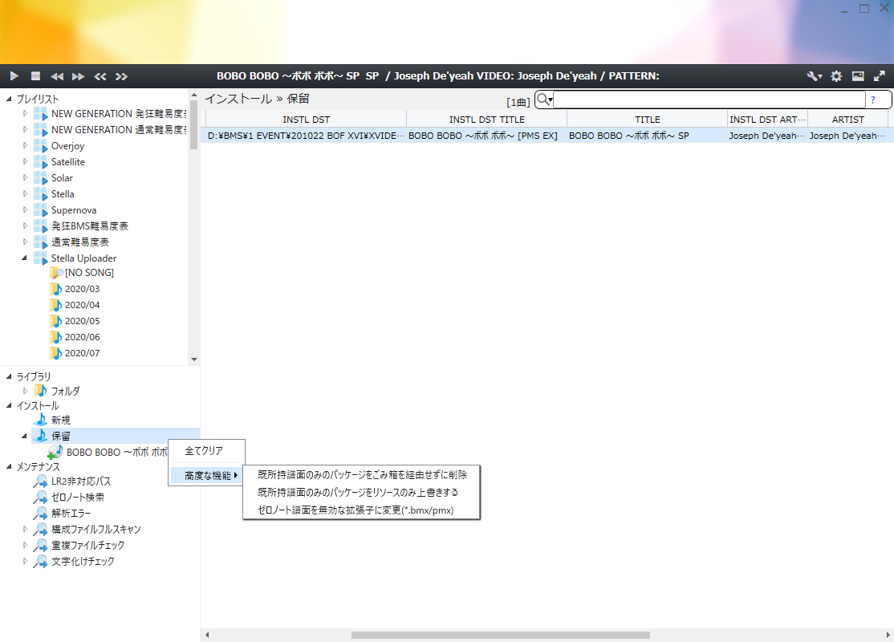

保留ツリーには、整理用の高度な機能があります。

`既所持譜面のみのパッケージをごみ箱を経由せずに削除` は、保留中のうち、含まれる譜面がすべて既所持と判断できるパッケージだけを対象にします。フォルダパッケージはフォルダごと、単体ファイルはファイルそのものを直接削除し、保留一覧からも取り除きます。ごみ箱を経由しないため、誤って実行すると戻せません。

`既所持譜面のみのパッケージをリソースのみ上書きする` は、譜面自体は既に持っているが、音源や BGA などの同梱リソースだけ更新したい場合の機能です。既所持譜面の hash から導入先を解決し、導入先が一意に決まるパッケージだけを処理します。導入先が複数に分かれる、導入先が分からない、上書き対象のリソースがない、などの場合はスキップされます。同名ファイル衝突時の扱いは [スマート上書き](#スマート上書き) の設定に従います。処理後に成功数、スキップ理由、失敗数のサマリーが表示されます。

`ゼロノート譜面を無効な拡張子に変更(*.bmx/pmx)` は、保留中の譜面を実ファイルで確認し、0 notes と判定される譜面だけをまとめて対象にする一括処理です。BMS 系拡張子は `.bmx`、PMS 系拡張子は `.pmx` へ変更し、保留一覧から除外します。`.bmx` / `.pmx` 自体や対象外拡張子、0 notes ではない譜面はスキップされます。変更先ファイル名が衝突した場合の重複削除や自動採番は、ライブラリ右クリックメニューの [無効な拡張子に変更](#無効な拡張子に変更) と同じです。

これらは破壊的な操作を含みます。特に完全削除やリソース上書きは、対象パッケージと導入先を確認してから実行してください。

## メンテナンス

`メンテナンス` には、ライブラリの状態確認に使う専用ビューがあります。

### LR2互換性警告

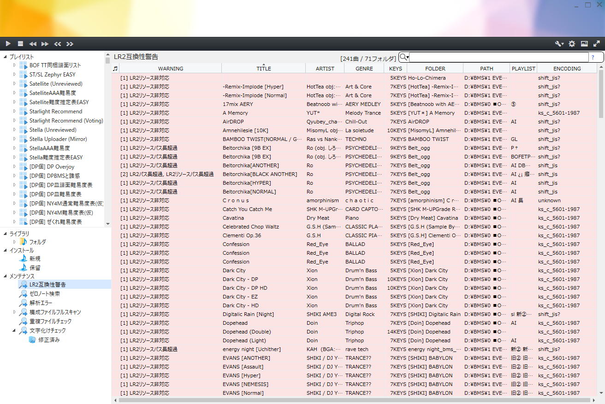

`LR2互換性警告` には、LR2 側で選曲や再生に支障が出る可能性がある譜面が表示されます。LR2 は多くの処理で CP932(Shift_JIS) のファイル名と古いパス長制限を前提にしているため、BeMusicSeeker では譜面ファイル本体のパスと、BMS 内で参照される音源・画像・動画などのリソース定義を確認しています。

- LR2パス非対応: 譜面ファイルのフルパスに CP932(Shift_JIS) で表現できない文字が含まれています。LR2 用の `folder` / `parent` 情報を安全に作れず、LR2 側で選曲できない可能性があります。
- LR2パス長超過: 譜面ファイルのフルパスが LR2 の古いパス長制限を超える可能性があります。フォルダ階層を浅くする、フォルダ名やファイル名を短くする、といった対応を検討してください。
- LR2リソース非対応: BMS 内のリソース定義(`#WAV`、`#BMP`、`#BGA` など)に、LR2 が CP932(Shift_JIS) のファイル名として扱えない文字列が含まれています。譜面自体を選曲できても、音源や BGA が正しく読み込まれない可能性があります。
- LR2リソースパス長超過: 譜面の配置フォルダとリソース定義を組み合わせた、LR2 が実際に参照するリソースパスが長すぎる可能性があります。譜面フォルダを短い場所へ移動する、リソースのフォルダ名やファイル名を短くする、といった対応を検討してください。

リソース定義に `..` を含む親ディレクトリ参照がある場合でも、それだけで LR2 非対応とは扱いません。ただし、配置先を含めた実際の参照パスが長くなる場合は `LR2リソースパス長超過` の対象になります。

BeMusicSeeker 上では該当譜面を削除せず warning として可視化しますが、LR2 側では選曲や再生に失敗する可能性があります。必要に応じて、譜面ファイル、リソースファイル、配置先フォルダを CP932(Shift_JIS) 互換の文字と短いパスへ変更してください。

### ゼロノート検索

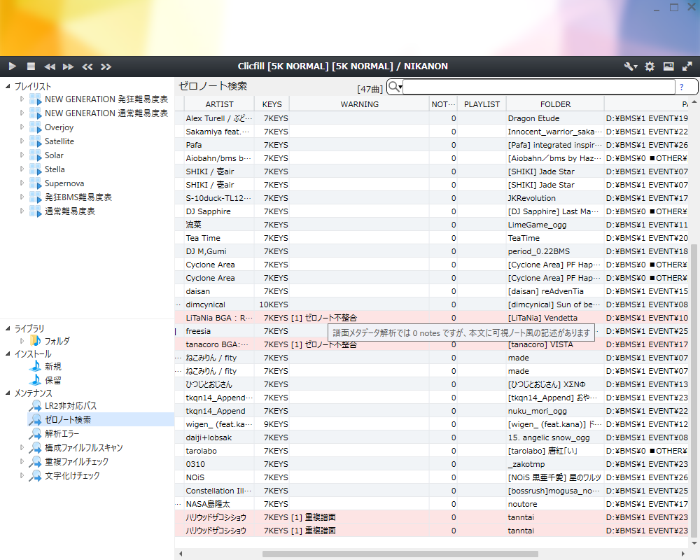

メタデータ上 `0 notes` と判定された譜面を確認します。

ここでいう `0 notes` は、譜面メタデータ解析で得られた `notes == 0` の譜面です。メタデータ解析は beatoraja / jbms-parser 準拠の解釈に寄せていますが、`#RANDOM` / `#IF` などによって分岐する全パターンを総当たりして照合しているわけではありません。そのため、条件分岐によって特定パターンだけノートが出る譜面などは、実際のプレイヤー上の挙動と完全には一致しない場合があります。

`ゼロノート記述確認` は、メタデータ上 `0 notes` の譜面ファイルを実ファイルから読み直し、本文に可視ノート風の記述があるかを正規表現ベースで確認します。対象になるのは、通常ノート系チャンネルや LN 系チャンネルに、`00` 以外のオブジェクトが書かれている行です。このチェックは軽量な保守用判定であり、譜面構文を完全に解釈するものではありません。不正な LN ペア、到達不能な `#RANDOM` 分岐内の記述、プレイヤー上では無効になる可能性がある記述でも、可視ノート風の行として見つかれば「メタデータは 0 notes だが本文にはノートらしき記述がある」として warning 表示します。

つまり、`ゼロノート検索` は「本当に空譜面か」を断定する画面ではなく、`0 notes` と解析された譜面のうち、念のため確認した方がよいものを見つけるための画面です。

LR2 ではパースエラーなどで再生できなくても、他プレイヤーや譜面ビューアでは再生できる譜面が該当する場合があります。

### 解析エラー

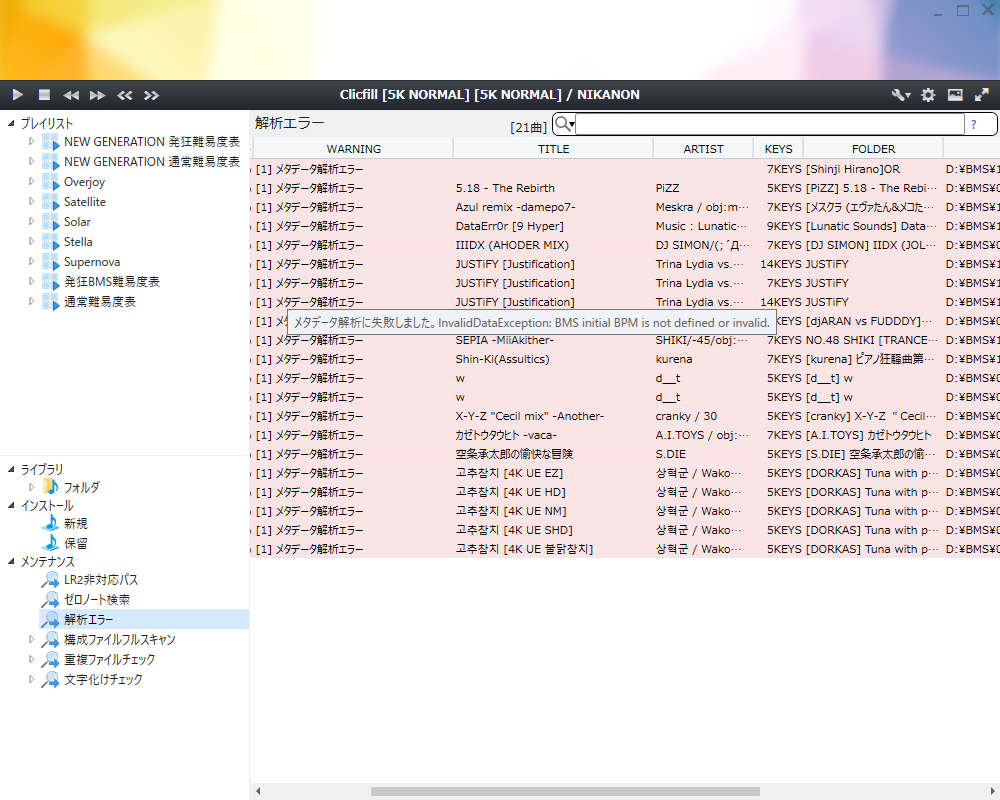

譜面メタデータ解析に失敗した譜面を確認します。  
解析失敗は WARNING として表示され、通常一覧の元行を直接変更するのではなく、解析エラー確認用の表示として扱われます。

解析エラー画面で譜面を右クリックすると、`メタデータ解析失敗記録を除去` を実行できます。これは解析失敗そのものを無視する操作ではなく、保存されている失敗記録を消して、次回の譜面メタデータ解析で再パース対象に戻すための操作です。

通常は使う必要はありません。ディスク負荷や CPU 負荷が高い状態でタイムアウトした、外部要因で一時的に読み込みに失敗した、など「譜面ファイル自体の問題ではなさそう」と判断できる場合に使用してください。除去後も再パースで同じエラーになる場合は、譜面内容や parser 側の制約による解析失敗として扱うのが自然です。

### 文字化けチェック

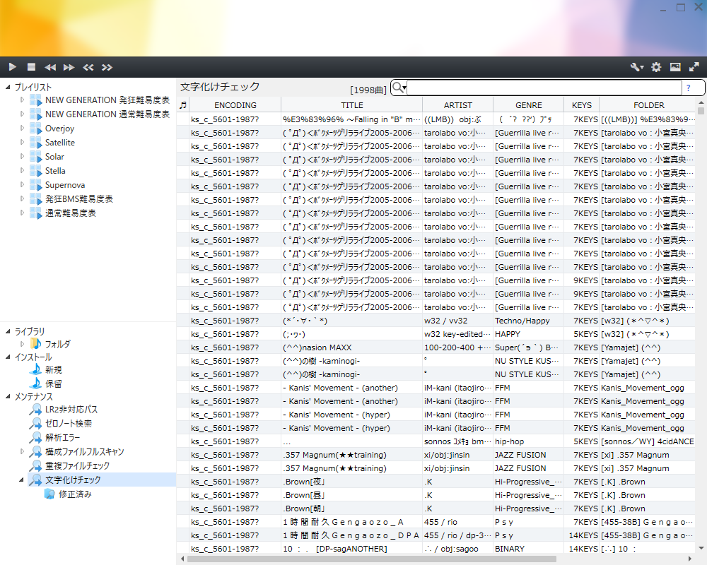

文字コード推定に問題がある譜面を確認します。手動修正では、日本語、韓国語、中国語などの候補から選べます。

### 重複ファイルチェック

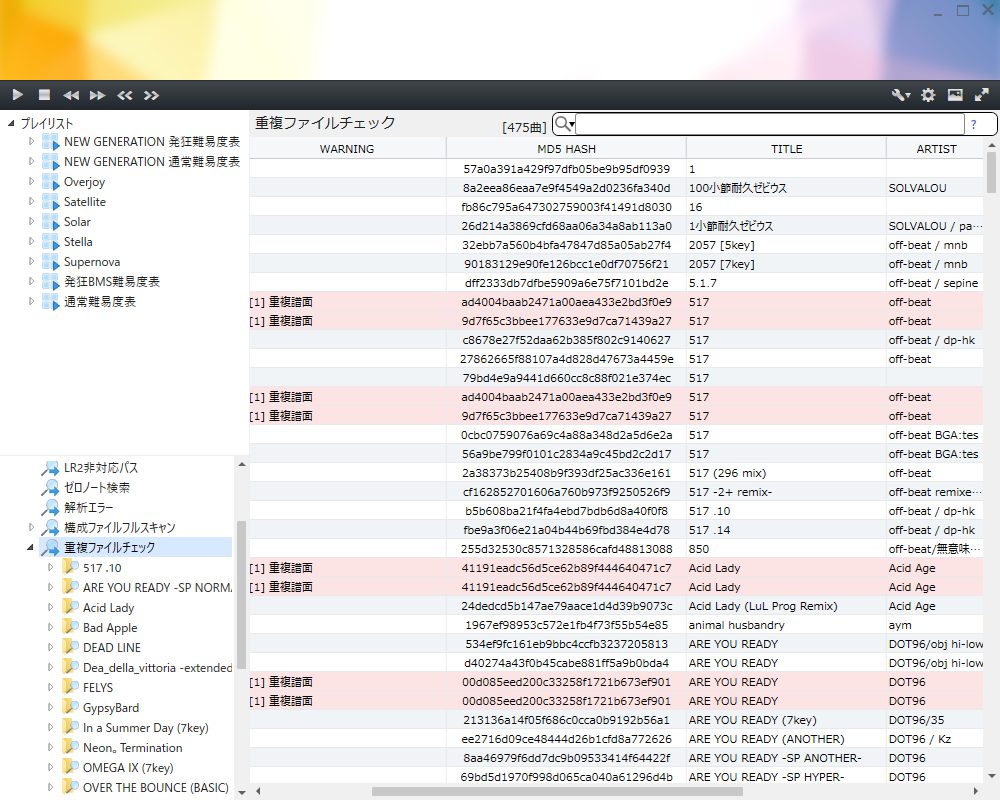

同一譜面と判断できるファイルを探し、重複している譜面をまとめて確認する画面です。BMS 系ファイルだけでなく bmson も譜面ファイルとして扱い、MD5 または SHA-256 などの譜面識別用 hash が一致するものを重複候補として表示します。

重複している譜面には `重複譜面` の WARNING が付き、一覧では行がハイライトされます。左ツリーの `重複ファイルチェック` を選ぶと重複候補全体、配下のグループを選ぶとそのグループ、さらにフォルダを選ぶとそのフォルダ内の該当譜面だけを一覧に表示できます。

重複グループは、同じ hash を持つ譜面が入っているフォルダ同士をつなげて作られます。たとえば `A` と `B` に同じ譜面があり、さらに `B` と `C` に別の同一譜面がある場合、`A / B / C` は一つの整理対象として扱われます。これにより、複数フォルダにまたがって少しずつ重複しているパッケージもまとめて確認できます。

#### 重複フォルダをマージする

重複ファイルチェックツリーで、統合したい側、つまり**消したい側のフォルダを選び**、右クリックメニューの `マージ先` から移動先フォルダを選ぶと、選択フォルダ内の譜面と同梱リソースを移動先へまとめます。フォルダの右クリックメニューからは、対象フォルダを Explorer で開くこともできます。実行前には、対象パスとマージ先パスを表示した確認ダイアログが出ます。

bmson も対象フォルダ配下にあれば譜面として扱われます。移動先に同じ hash の譜面がすでにある場合、その譜面ファイルは移動しないので重複が解消されます。譜面ファイル名だけが衝突する場合は、ファイル名をずらして移動するので hash の違う譜面が消失することはありません。

同梱リソース類は、移動先に同名ファイルがある場合、設定画面の [スマート上書き](#スマート上書き) に従って上書き、スキップ、自動採番されます。確認ダイアログにもある通り、`ogg` と `wav` のように音質や形式が違うリソースが混在している場合は、どちらを残したいかを確認してから実行してください。

移動元フォルダは、移動後に空になった場合、または残っているファイルがすべて「すでに所持済みと判断できる譜面ファイル」だけの場合に削除されます。何らかの想定外で、非譜面ファイル、読み込めない譜面、hash 不明の譜面、未所持 hash の譜面が残っている場合は、移動元フォルダの削除をスキップします。

#### `Ctrl + G` で連続整理する

フォルダ項目を選択した状態で `Ctrl + G` を押すと、重複整理用のショートカットとして動作します。

- 重複フォルダが 2 件だけの場合は、選択中フォルダをもう一方のフォルダへマージします。
- 重複フォルダが 3 件以上ある場合は、統合先を自動決定せず、右クリックメニューの `マージ先` を開いた状態にします。候補を確認して移動先を選んでください。
- 重複フォルダが 1 件だけの場合は、同じフォルダ内に同一 hash の譜面が複数ある状態として扱い、重複 hash の整理を行います。

同一フォルダ内の重複 hash 整理では、hash ごとに 1 件だけ残し、残りをごみ箱へ移動します。残すファイルは、更新日時が古いものを優先し、同じ日時ならファイル名が短いものを優先します。実行前には、ごみ箱へ移動する件数を表示した確認ダイアログが出ます。

マージや重複 hash 整理が終わると、ツリー内の次に確認すべき重複グループへ自動的にフォーカスを移します。上から順番に確認しながら `Ctrl + G` を使うと、大量の重複を比較的少ない操作で整理できます。

#### 注意点

- **`Ctrl + G` は、残したいフォルダではなく、統合したい、または削除したい側のフォルダに対して実行します。**
- 3 件以上の候補がある場合は、意図しない移動を避けるため自動マージせず、必ず候補選択を挟みます。
- ファイルが他アプリ、アンチウイルス、検索インデックスなどに一時的にロックされていると、移動や削除に失敗することがあります。失敗した場合は対象ファイルを閉じてから再実行してください。
- 重複表示はキャッシュされます。削除、移動、マージ、リロードなどでライブラリが変わると再計算されます。

### 構成ファイルフルスキャン

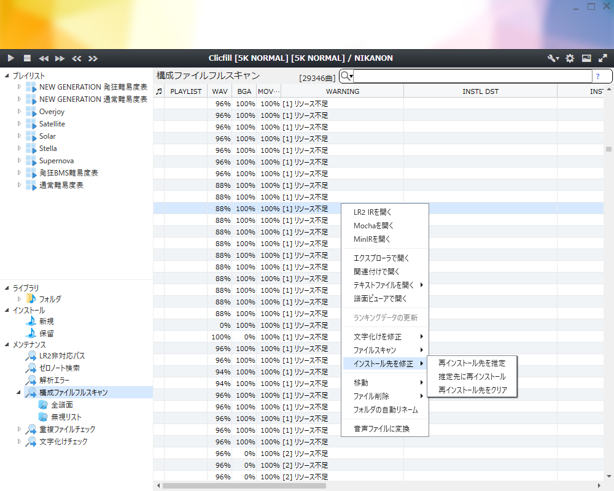

WAV、BGA、動画、画像などの不足を確認します。  
`全譜面を再スキャン` は重い明示操作です。通常起動では全譜面のリソース再検証は行いません。導入後に不足リソースを追加した場合は、該当行の再スキャンまたは全譜面再スキャンで状態を更新します。

## バックアップ・アンインストール

設定画面の `バックアップ` タブから、プレイリストのバックアップ / 復元を実行できます。`LR2のバックアップと最適化` は、保存先、対象、スケジュール、世代数を設定し、条件を満たした起動時に自動取得されます。バックアップ成功後には `song.db` やスコア DB の `VACUUM` / `REINDEX` による最適化も行われます。設定しただけでその場ですぐ LR2 関連ファイルがバックアップされるわけではないため、大きな更新やアンインストール前に必要な場合は、手動でも控えを作ってください。

LR2 連携モードでは、BeMusicSeeker が LR2 の `song.db` にアプリ用テーブルや索引を追加する場合があります。`BeMusicSeeker関連データをLR2データベースから削除` は、これらの BeMusicSeeker 管理データを削除するための機能です。実行後はアプリを終了する前提の操作です。

アンインストールや大きな更新を行う前は、以下をバックアップしておくと安全です。

- LR2 `song.db`
- LR2 `config.xml`
- LR2 スコア DB
- BeMusicSeeker `config/user.config`
- スタンドアローンモードの BeMusicSeeker `data/song.db`
- BMS ルートフォルダ

## ログとトラブルシューティング

通常より詳しいログを取りたい場合は、`LaunchWithInfoLog.bat` から起動してください。`application.log` と `install-performance.log` に初期化、DB 読み込み、ファイルスキャン、プレイリスト同期などの情報が出力されます。

ログの読み方は [BeMusicSeeker ログ（実行記録）の見方ガイド](log-level-info-guide.md) を参照してください。

> 申し訳ありませんが、実際のところガイドを見てもあまり参考にはならないかも知れません。開発中にログの出力方針は随時変わっているのでガイドの内容は最新の実装に対する説明としては不十分です。明らかに挙動がおかしい場合にINFOレベルのログを出すようにして、ログを私に送り付けて頂ければ不具合修正の役に立ちます。

### 起動や初期化が遅い

- Everything 1.5 Alpha x64 が導入されているか確認してください。
- Everything 側で BMS フォルダが検索できるか確認してください。
- 初回構築、DB 空状態、BMS ルートフォルダの大規模変更では、通常より時間がかかります。
- `install-performance.log` の `everything_scan`、`song_tbl_file_check`、`playlist_*` などを見ると、どこに時間がかかっているか分かります。
- Everything 連携に失敗しても、警告ダイアログが出ずに通常のファイル列挙へ fallback する場合があります。想定より遅い場合は、`install-performance.log` の `everything_scan`、`nativeBridgeUsed`、`fallback`、`managed` などの記録を確認してください。

### プレイリストの STATUS が失敗になる

外部難易度表の URL が 404、403、タイムアウトなどを返している場合があります。プレイリストサマリーの `STATUS` のツールチップ、または `application.log` の `playlist_reload_target_failed` を確認してください。

外部サイト側の一時的な問題であれば、時間を置いてリロードしてください。URL が変更されている場合は、プレイリストのプロパティで URI を修正する必要があります。

### LR2 で選曲できない譜面がある

`LR2互換性警告` に表示されていないか確認してください。CP932(Shift_JIS) で表現できない譜面パスやリソース定義、長すぎる譜面パスやリソース参照パスを含む譜面は、LR2 側で選曲または再生できない可能性があります。

LR2 連携モードでは、ステータスバーの `LR2 song.db 同期` 状態も確認してください。未完了や失敗が残っていると、LR2 側が古い `song.db` を読んでいる可能性があります。`再試行` で完了させてから LR2 を起動してください。

または、設定画面の `LR2 song.db データを再同期` を実行することも有効な手段です。

### 検索構文が分からない

[キーワード検索構文ガイド](keyword-search-syntax-guide.ja.md) を参照してください。`title:`、`artist:`、`playlist:`、`rate:` などの field 指定や、除外検索、OR、正規表現、数値範囲検索を使えます。

## 参考資料

- [キーワード検索構文ガイド](keyword-search-syntax-guide.ja.md)
- [BeMusicSeeker ログ（実行記録）の見方ガイド](log-level-info-guide.md)
- [従来版 BeMusicSeeker 公開記事](https://tumblr.ribbit.xyz/post/129562866015/bemusicseeker-%E6%AD%A3%E5%BC%8F%E7%89%88%E3%82%92%E5%85%AC%E9%96%8B%E3%81%97%E3%81%BE%E3%81%97%E3%81%9F-v034)
- [従来版 BeMusicSeeker マニュアル](https://tumblr.ribbit.xyz/post/129562878360/bemusicseeker-%E3%83%9E%E3%83%8B%E3%83%A5%E3%82%A2%E3%83%AB-v030-%E5%AF%BE%E5%BF%9C%E7%89%88)
