# BeMusicSeeker Unofficial Fork ユーザーマニュアル


この文書は BeMusicSeeker Unofficial Fork の日本語マニュアルです。  
従来版 BeMusicSeeker の基本的な使い方を引き継ぎつつ、この Fork 版で追加・変更された機能、処理の意味、注意点をまとめています。

## 目次

- [はじめに](#はじめに)
- [初期セットアップ](#初期セットアップ)
- [設定画面](#設定画面)
- [起動・リロード・進捗表示](#起動リロード進捗表示)
- [画面構成](#画面構成)
- [ライブラリ一覧](#ライブラリ一覧)
- [検索](#検索)
- [再生・録音](#再生録音)
- [プレイリスト](#プレイリスト)
- [インストール / 保留パッケージ](#インストール--保留パッケージ)
- [メンテナンス](#メンテナンス)
- [バックアップ・アンインストール](#バックアップアンインストール)
- [ログとトラブルシューティング](#ログとトラブルシューティング)
- [参考資料](#参考資料)

## はじめに

BeMusicSeeker は、BMS ファイルの管理、検索、再生、インストール、プレイリスト管理、メンテナンスを支援する統合管理ツールです。

この Fork 版では、従来版の基本機能に加えて、以下のような改善が入っています。

- 大規模ライブラリ向けの初期化・一覧表示高速化
- `Everything 1.5 Alpha x64` を利用した高速ファイル列挙
- スタンドアローンモード
- bmson を譜面ファイルとして扱う処理
- プレイリストサマリー、外部同期 STATUS、URL1/URL2 補完
- インストール保留画面の強化
- 構造化された WARNING 表示
- ポータブル設定ファイル
- 多言語対応とテーマ対応

### 注意

BeMusicSeeker は、設定によっては LR2 の `song.db`、`config.xml`、カスタムフォルダ出力先、BMS 実ファイルを更新します。  
大きな整理、インストール、削除、重複マージ、アンインストールを行う前には、LR2 関連ファイルと BMS フォルダのバックアップを取ることをおすすめします。

## 初期セットアップ

BeMusicSeeker Unofficial Fork はインストール不要のポータブルアプリです。リリースページから最新版をダウンロードし、任意のフォルダへ展開して起動します。

### 推奨: Everything 1.5 Alpha x64

可能であれば、先に `Everything 1.5 Alpha x64` を導入してください。

BeMusicSeeker は初期化時に BMS 譜面、音源、画像、動画などを大量に列挙します。Everything が利用可能な場合、ファイル列挙とリソース索引作成を高速化できます。未導入でも動作しますが、大規模なライブラリでは初回スキャンやリロードに時間がかかります。

Everything 側で BMS 関連フォルダのインデックス作成が完了し、検索できる状態になってから BeMusicSeeker を起動してください。

### 既存設定の引き継ぎ

従来版 BeMusicSeeker がインストール済みの環境では、初回起動時に既存の設定が自動コピーされます。コピー先はアプリ配置先の `config/user.config` です。元の BeMusicSeeker の設定ファイルは変更されません。

### 初回起動

初回起動時は、言語選択付きの初回設定ダイアログが表示されます。

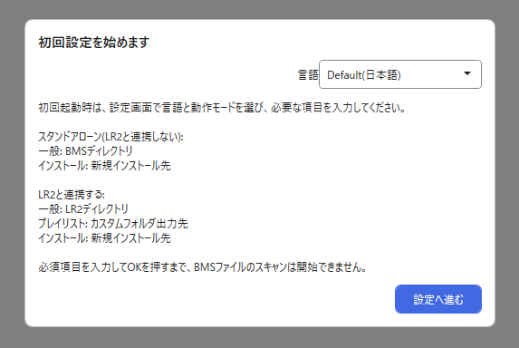

言語を選んで設定画面へ進み、動作モードと必須項目を設定します。必須項目を入力して `OK` を押すまで、BMS ファイルの初回スキャンは開始されません。

### 動作モード

BeMusicSeeker には大きく 2 つの動作モードがあります。

#### スタンドアローン(LR2と連携しない)

LR2 の `song.db` を使わず、アプリ配下の DB でライブラリを管理します。

主に必要な設定:

- `一般` タブ: BMS ディレクトリ
- `インストール` タブ: 新規インストール先

LR2 のスコア、カスタムフォルダ、LR2IR 関連の一部機能は使いません。BMS ファイルの整理、検索、インストール、メンテナンスを BeMusicSeeker 側だけで行いたい場合に使います。

#### LR2と連携する

LR2 の `config.xml` / `song.db` / `score.db` を使って、LR2 の所持譜面、スコア、カスタムフォルダ出力と連携します。

主に必要な設定:

- `一般` タブ: LR2 ディレクトリ、`song.db`、`config.xml`
- `プレイリスト` タブ: カスタムフォルダ通常出力先、ルートフォルダ出力先
- `インストール` タブ: 新規インストール先

LR2 と同じライブラリを BeMusicSeeker で管理したい場合はこちらを使います。

### 初回スキャン

設定完了後、初回スキャンが始まります。初回は全譜面ファイルを確認し、DB へ登録し、インストール推定やメンテナンス情報に必要な基礎データを作成します。  
ライブラリ規模、ディスク速度、Everything の利用状況によって、数分からそれ以上かかる場合があります。

初回構築が完了すると、次回以降は差分更新中心になります。BMS フォルダ全体を大きく移動した場合や、DB を空から作り直した場合は、再び重い処理になります。

## 設定画面

設定画面は `OK` を押すと保存されます。設定内容によって、即時反映、スコアのみ再読み込み、ライブラリリロード、再初期化、再起動要求のいずれかになります。

### 一般

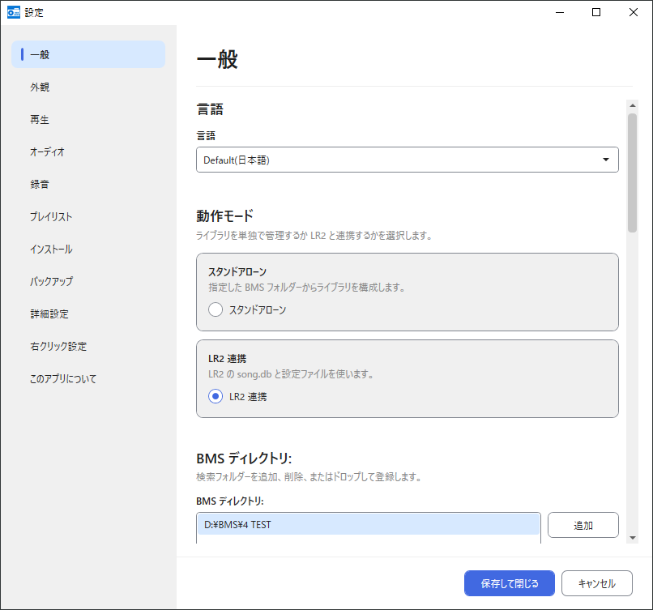

`一般` タブでは、言語、動作モード、BMS ディレクトリ、LR2 ディレクトリ、`song.db`、`config.xml`、beatoraja `score.db` などを設定します。

スタンドアローンモードでは BMS ディレクトリが重要です。LR2 連携モードでは LR2 ディレクトリと DB / XML パスが重要です。

### 外観

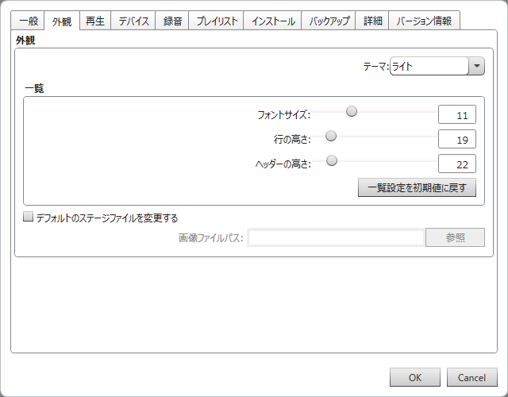

テーマや表示に関わる設定を変更します。外観変更は基本的にライブラリ再構築を必要としません。

### 再生

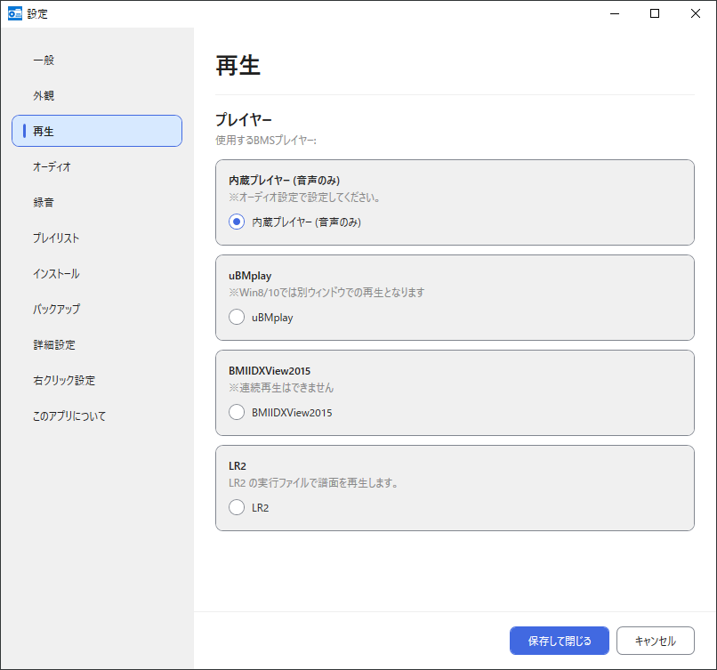

譜面を再生するプレイヤーを選択します。内蔵プレイヤーは音声のみの簡易再生用です。uBMplay、BMIIDXView2015、LR2 など外部プレイヤーを使う場合は、実行ファイルのパスを指定します。

スタンドアローンモードでも、再生用アプリとして LR2body を指定できます。これは LR2 の DB と連携するかどうかとは別の設定です。

### デバイス

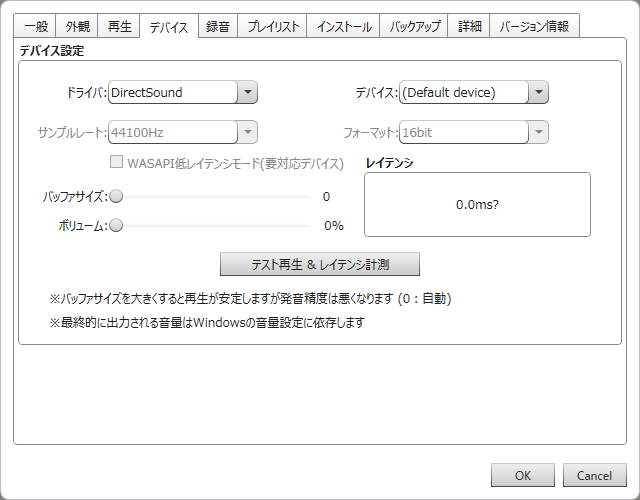

再生ドライバ、出力デバイス、サンプルレート、フォーマット、バッファサイズ、音量などを設定します。音が出ない、遅延が大きい、音切れする場合は、このタブの設定を確認してください。

### 録音

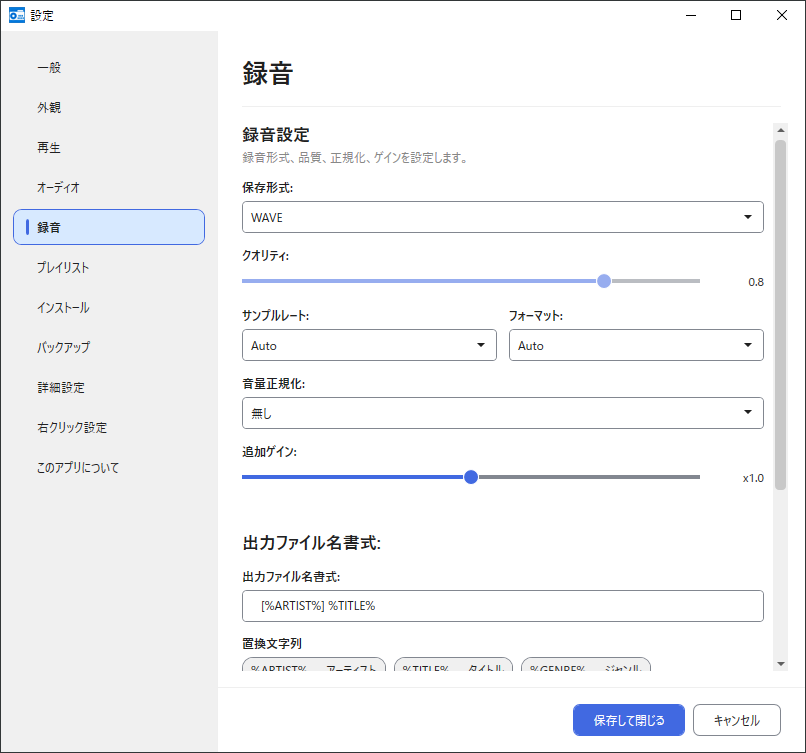

録音形式、品質、サンプルレート、出力ファイル名書式、エンコーダの場所などを設定します。外部エンコーダを使う場合は、`lame.exe`、`oggenc2.exe` など対応する実行ファイルを含むフォルダを指定します。

### プレイリスト

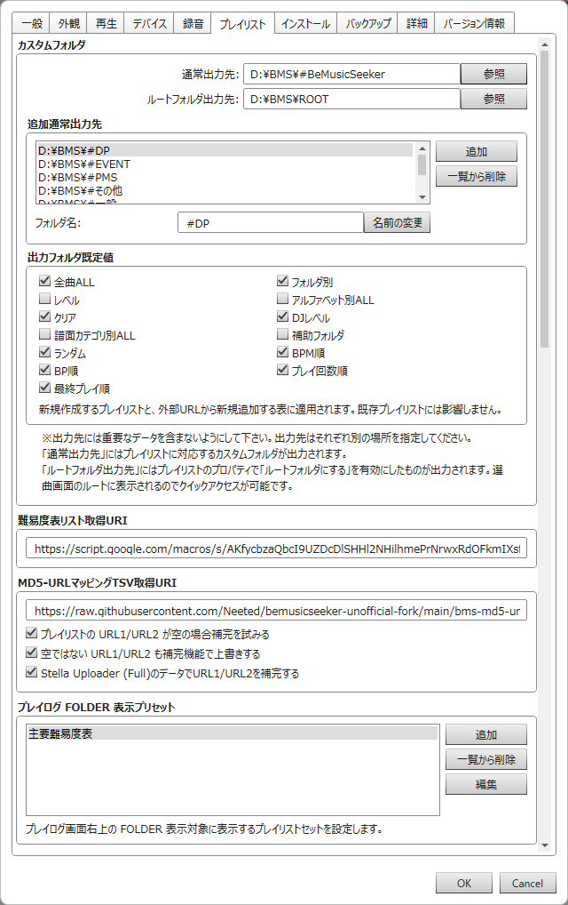

カスタムフォルダ出力先、難易度表リスト取得 URI、MD5-URL マッピング TSV 取得 URI、URL1/URL2 補完設定を変更します。

`通常出力先` には、プレイリストに対応する通常のカスタムフォルダが出力されます。  
`ルートフォルダ出力先` には、プレイリストのプロパティで `ルートフォルダにする` を有効にしたものが出力されます。選曲画面のルートに表示されるため、よく使う表へ素早くアクセスできます。

URL 補完については [URL1/URL2 補完](#url1url2-補完) を参照してください。

### インストール

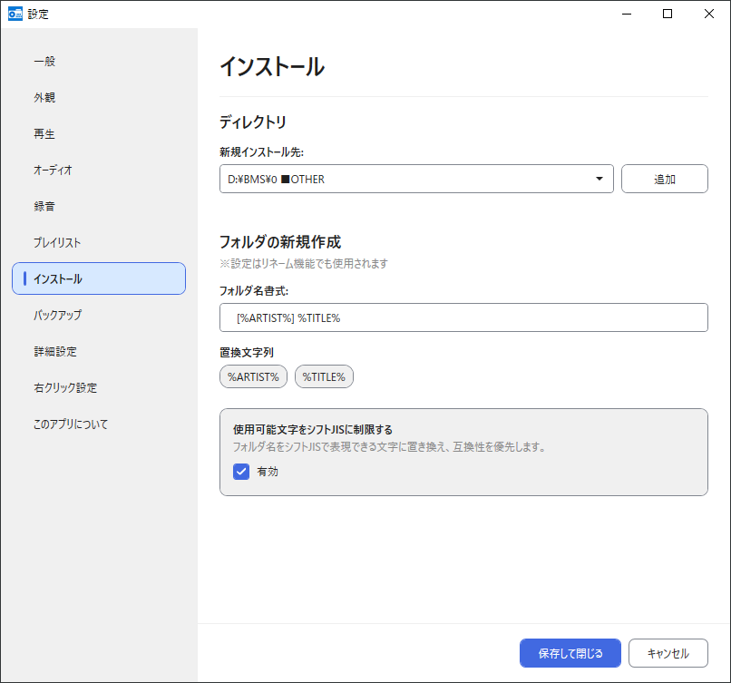

新規インストール先と、新規フォルダ作成時の命名形式を設定します。  
スタンドアローンモードでは、登録済み BMS ディレクトリ内からインストール先を選ぶ必要があります。

### バックアップ

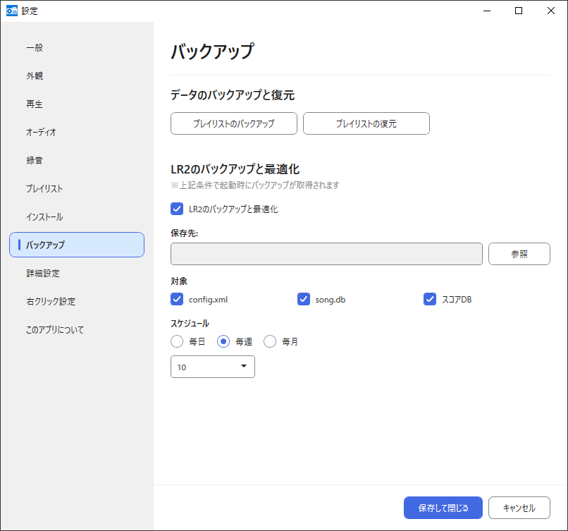

プレイリストのバックアップ / 復元、LR2 関連ファイルのバックアップ、世代数などを設定します。互換性に不安がある更新や大きな整理を行う前は、バックアップを取っておくことをおすすめします。

### 詳細

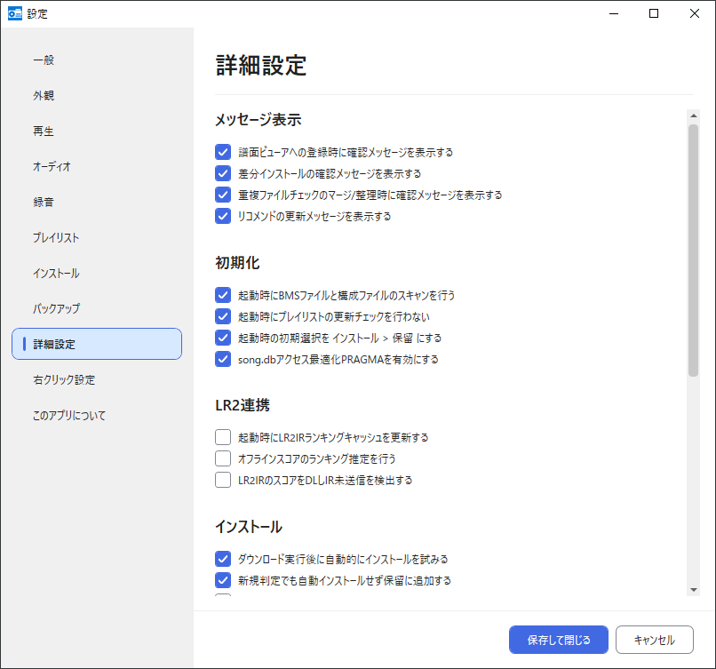

確認メッセージ、初期化、LR2 連携、インストール補助などの詳細設定を変更します。

起動時のファイルチェックを省略すると起動は軽くなりますが、BMS ルートの列挙と導入先推定に使うリソース索引を作りません。保留パッケージの導入先推定を行うには、手動でライブラリの `リロード` または `初期化再実行` を実行してください。  
インストール関連の設定には、元パッケージ削除やスマート上書きなど実ファイル操作に影響するものがあります。内容を確認してから変更してください。

#### 詳細タブの各設定

| グループ | 設定 | 既定値 | 内容 |
| --- | --- | --- | --- |
| メッセージ表示 | 譜面ビューアへの登録時に確認メッセージを表示する | ON | 譜面ビューア登録操作の前に確認を表示します。 |
| メッセージ表示 | 差分インストールの確認メッセージを表示する | ON | 推定先への差分インストールなど、既存フォルダへ入れる操作の前に確認を表示します。 |
| メッセージ表示 | リコメンドの更新メッセージを表示する | ON | リコメンド情報更新時の通知を表示します。 |
| 初期化 | 起動時にBMSファイルと構成ファイルのスキャンを行わない | OFF | 起動時のファイル差分確認とリソース索引構築を省略します。DB に保存済みのライブラリ一覧は読み込みますが、手動でライブラリの `リロード` または `初期化再実行` を行うまで、保留パッケージの導入先推定に必要な索引がないため推定できない場合があります。 |
| 初期化 | 起動時にプレイリストの更新チェックを行わない | OFF | 起動時の外部プレイリスト更新確認を省略します。必要な場合は手動でプレイリストをリロードしてください。 |
| 初期化 | 起動時の初期選択を インストール > 保留 にする | ON | 起動後の初期表示を保留パッケージ画面にします。新規導入や保留整理を優先したい場合向けです。 |
| 初期化 | song.dbアクセス最適化PRAGMAを有効にする | ON | DB 読み込み時に読み取り向けの SQLite PRAGMA を設定し、起動やリロードを高速化します。通常は ON のままにします。 |
| LR2連携 | オフラインスコアのランキング推定を行わない | OFF | LR2IR の ranking cache XML を使ったオフラインスコア順位推定を省略します。ON にすると処理は軽くなりますが、未送信スコアの順位推定は行われません。 |
| LR2連携 | LR2IRのスコアをDLしIR未送信を検出する | ON | LR2IR のスコア情報を取得し、ローカルスコアとの差分から未送信状態を検出します。 |
| インストール | ダウンロード実行後に自動的にインストールを試みる | OFF | URL からダウンロードしたパッケージを、可能であればそのままインストール処理へ進めます。 |
| インストール | 新規判定でも自動インストールせず保留に追加する | OFF | 新規作品として十分なリソースが揃っていても自動導入せず、必ず保留一覧で確認できるようにします。 |
| インストール | 保留パッケージの推定時に Everything を使用する | OFF | 保留パッケージの導入先推定で、source 側リソース列挙に Everything を使います。大きな保留フォルダでは高速化する場合があります。 |
| インストール | 複数候補でも高一致なら第1候補を導入先に設定する | OFF | 複数の導入先候補がある場合でも、十分に一致度が高いと判断できる場合は最上位候補を `INSTL DST` に設定します。OFF では曖昧な場合に WARNING と候補リストを残します。 |
| インストール | 通常インストール時、既所持譜面が残っていても元パッケージを削除する | OFF | 通常インストール後、source に既所持譜面などの残り物があっても元パッケージを削除します。取り消しにくい操作なので、通常は OFF を推奨します。 |
| インストール | 差分導入時に更新日時とサイズを比較して同梱ファイルの上書きを最適化する | ON | [スマート上書き](#スマート上書き) を有効にします。 |
| インストール | スマート上書き時、*.bmx/*.pmx/*.txt は上書きせず自動採番で保持する | OFF | [スマート上書き](#スマート上書き) で保護対象拡張子を上書きせず、連番名で残します。 |

#### スマート上書き

スマート上書きは、差分導入やマージで既存フォルダへファイルを移動するとき、譜面ファイル本体以外の同梱コンポーネント、つまり音源、BGA、動画、画像、readme などの衝突を調整する機能です。既定では有効です。

通常の上書きでは、同名ファイルが導入先にある場合、source 側ファイルで上書きします。スマート上書きが有効な場合は、source と導入先のファイルサイズ、更新日時を比較し、次のように処理します。更新日時の比較には、おおむね 2 秒までの差を同一時刻として扱う許容があります。

- 導入先に同名ファイルがない場合は、そのまま移動します。
- サイズと更新日時がほぼ同じ場合は同一ファイルとみなし、source 側を削除して導入先の既存ファイルを残します。
- source 側の方が新しい場合は、導入先を source 側で上書きします。
- 導入先の方が新しい、または同等以上と判断した場合は、導入先を残して source 側を削除します。

`スマート上書き時、*.bmx/*.pmx/*.txt は上書きせず自動採番で保持する` を有効にすると、`.bmx`、`.pmx`、`.txt` はスマート上書きで上書き対象になった場合でも、導入先の既存ファイルを残し、source 側を `name(1).txt` のような空き連番名で保存します。連番候補に同一内容のファイルが既にある場合は、同じファイルを増やさず source 側を削除します。内容が異なる場合、または hash 比較ができない場合は、空いている連番名へ移動します。

bmson は譜面ファイルとして扱うため、この保護対象には含めません。BMS / PMS / bmson などの譜面ファイル本体は、同名衝突時に上書きせず、`chart_.bms` のように名前をずらして導入します。

この設定は、推定先へのインストール、既所持譜面のみパッケージのリソース上書き、重複フォルダのマージなど、既存フォルダへ同梱ファイルを移動する処理で使われます。未所持の新規作品を新しいフォルダへ丸ごと導入する場合は、そもそも同名ファイル衝突が少ないため、スマート上書きの影響は限定的です。

## 起動・リロード・進捗表示

BeMusicSeeker の起動処理は段階的に進みます。

1. 設定と DB の確認
2. BMS ファイル列挙
3. DB との差分確認
4. 追加・削除・更新の反映
5. インストール推定やリソース索引の準備
6. 画面表示可能状態への移行
7. プレイリスト、スコア、譜面メタデータ、メンテナンス情報などのバックグラウンド処理

ステータスバーには、初期化、ファイル差分確認、プレイリスト同期、導入先推定などの進捗が表示されます。

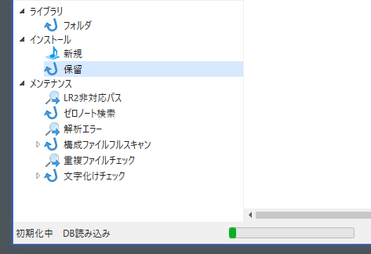

### ライブラリのリロード

ライブラリ右クリックの `リロード` は、所持ファイルの追加・削除・更新を反映する操作です。DB 全体の作り直しやスコア再読み込みではありません。

以下のような場合に使います。

- BMS フォルダへファイルを追加した
- BMS フォルダからファイルを削除した
- BMS ルートフォルダを増減させた
- 外部で BMS フォルダを移動・改名した

### 初期化再実行

`初期化再実行` は通常のリロードより重い操作です。外部ツールで DB を編集した場合や、状態を大きく作り直したい場合に使います。

### プレイリストのリロード

プレイリストのリロードは、外部難易度表やプレイリスト定義を再取得する操作です。

プレイリストツリールートのリロードは、外部同期が有効なプレイリストを対象にします。  
プレイリスト単体やサマリー選択範囲からのリロードは、選択したプレイリストを外部同期フラグに関係なく対象にします。

リロード失敗は、プレイリストサマリーの `STATUS` とログに集約されます。

## 画面構成

主画面は、左サイドバーと右側の一覧で構成されています。

左サイドバーには、ライブラリ、プレイリスト、インストール、メンテナンスなどのツリーがあります。右側の一覧は、選択した画面に応じて譜面一覧、プレイリスト詳細、プレイリストサマリー、保留パッケージ、メンテナンス結果を表示します。

一覧は独自描画の `CustomTableView` で表示されます。列幅、表示/非表示、表示順は画面ごとに保存されます。ヘッダー右クリックから列表示を変更できます。

## ライブラリ一覧

ライブラリ一覧では、登録済み譜面を検索・再生・整理できます。

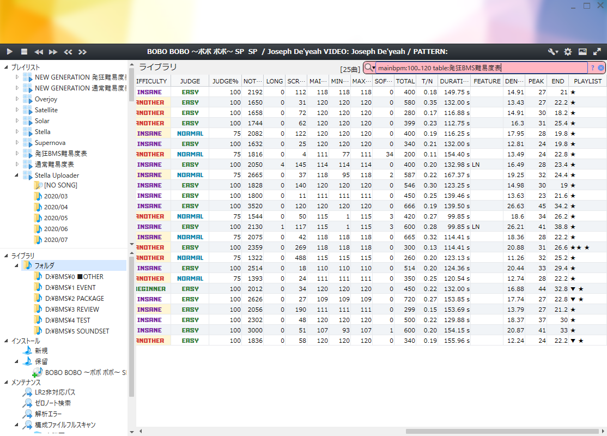

列ヘッダーをクリックするとソートできます。`TITLE`、`ARTIST`、`PATH`、`LEVEL`、`CLEAR` など、多くの列を表示できます。列の表示や順番はヘッダー右クリックメニューから変更できます。

### 一覧の右クリックメニュー

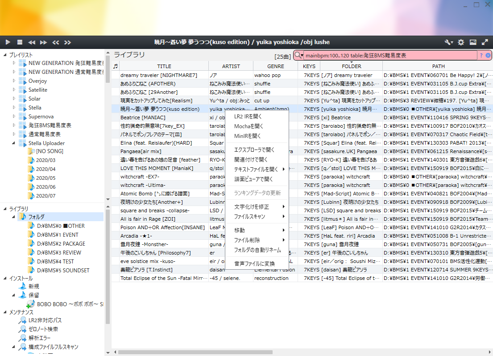

譜面行やプレイリスト行を右クリックすると、選択中の行に対する操作を呼び出せます。表示される項目は、通常ライブラリ、プレイリスト詳細、未所持譜面、保留、新規、メンテナンス画面など、現在の画面と選択行の種類によって変わります。

開く / 外部ページ:

- `LR2 IRを開く`: 対象譜面の LR2IR ページを開きます。
- `Mochaを開く`: 対応する Mocha ページを開きます。
- `MinIRを開く`: 対応する MinIR ページを開きます。
- `本体URLを開く` / `差分URLを開く`: プレイリスト由来または URL 補完で得られた本体 URL / 差分 URL を開きます。
- `エクスプローラで開く`: 譜面ファイルのあるフォルダを Explorer で開きます。
- `インストール先を開く`: `INSTL DST` やインストール先として記録されているフォルダを開きます。
- `関連付けで開く`: 譜面ファイルを OS の関連付けで開きます。
- `テキストファイルを開く`: 同じフォルダ内の readme などの文書候補をサブメニューから開きます。
- `動画を開く`: YouTube / ニコニコ動画など、譜面に紐づく動画候補を検索して開きます。ただし、この候補は `http://www.ribbit.xyz` の LR2IR キャッシュ情報に依存しています。現時点では同サイトが利用できないため、この機能は実質的に動作しません。
- `入手先を検索`: プレイリスト URL、補完 URL、検索候補などからダウンロード元候補を開きます。LR2IR キャッシュ情報や Ribbit 側の検索 API は `http://www.ribbit.xyz` に依存するため、同サイトが利用できない場合はその分の候補は取得できません。一方で、プレイリスト自体の URL1 / URL2、コメント内 URL、MD5-URL マッピング TSV、Stella Uploader (Full) 由来の URL 補完などは引き続き利用できます。
- `譜面ビューアで開く`: 譜面ビューアへ登録または表示します。

スコア / ranking:

- `ランキングデータを更新`: 対象譜面の ranking cache / IR データを更新します。

文字コード / ファイルスキャン:

- `文字コードを修正`: 日本語 Shift_JIS、UTF-8、韓国語 KS_C_5601、簡体字 GB2312、繁体字 Big5 などから文字コードを指定します。`修正済みにする` は、現在の推定結果を確認済みとして扱います。
- `ファイルスキャン`: 選択譜面を再スキャンします。`全譜面を再スキャン` はライブラリ内の譜面全体を対象にします。`無視に追加` / `無視を解除` は、構成ファイルフルスキャンなどの対象から外すための設定です。

インストール / 導入先:

- `インストール` → `インストール先を推定`: 保留譜面の導入先を推定します。
- `インストール` → `マージ先を推定`: 既所持譜面のみパッケージやリソース寄せ向けに、同梱リソースを評価へ足さない推定を行います。
- `インストール` → `推定先にインストール`: `INSTL DST` に導入します。
- `インストール` → `警告を無視してインストール`: 推定先を使わず通常の新規インストールとして扱います。
- `インストール` → `インストール先をクリア`: `INSTL DST`、推定先表示、推定 warning、候補を消します。
- `インストール先を修正`: 導入済み譜面の `instl_dst` を再推定し、`推定先に修正` で記録を更新します。`修正候補をクリア` で候補を消します。

ファイル整理:

- `移動`: ライブラリ内の親フォルダ候補へ譜面ファイルを移動します。
- `エントリー削除`: プレイリスト詳細で、選択行をプレイリストから外します。
- `譜面ファイルを削除`: `無効な拡張子に変更(*.bmx/pmx)` または `ごみ箱へ移動` を選べます。
- `フォルダ名の自動リネーム`: 選択譜面のフォルダ名を設定のフォルダ名書式に合わせて変更します。
- `音声ファイルへ変換`: 設定画面の録音設定に従い、譜面再生結果を音声ファイルとして出力します。

画面固有:

- `一覧から削除`: 新規 / 保留 / 導入済みパッケージ表示から対象を取り除きます。実ファイル削除を伴う操作とは区別してください。
- `メタデータ解析失敗記録を除去`: 解析エラー画面で表示され、保存済みの解析失敗記録を削除して再パース対象に戻します。

未所持譜面のプレイリスト詳細では、ファイル操作やインストール操作は表示されず、`LR2 IRを開く` / `Mochaを開く` / `MinIRを開く` / `本体URLを開く` / `差分URLを開く` / `動画を開く` / `入手先を検索` / `譜面ビューアで開く` / ranking 更新 / `エントリー削除` など、プレイリスト行に対する操作だけが表示されます。

実ファイルを変更する操作は、読み取り専用属性などで失敗しにくいよう Windows Explorer に近い挙動へ寄せています。ただし、削除や上書きは元に戻せない場合があるため、対象を確認してから実行してください。

#### 無効な拡張子に変更

`無効な拡張子に変更(*.bmx/pmx)` は、選択した BMS / PMS 系譜面の拡張子を LR2 などが通常譜面として読まない拡張子へ変更する機能です。BMS 系拡張子は `.bmx`、PMS 系拡張子は `.pmx` へ変更します。主に、0 notes 譜面、誤って譜面として登録されたファイルをライブラリから外したい場合に使います。

変更先のファイル名が空いている場合は、そのままリネームします。変更先が既に存在する場合は、次のように衝突を解決します。

- 変更先の `.bmx` / `.pmx`、または `名前(1).bmx` のような連番候補に同一内容のファイルが既にある場合は、同じファイルを増やさず、元の `.bms` / `.pms` 側を重複として削除します。
- 変更先や連番候補が存在しても内容が異なる場合は、空いている連番名へリネームします。
- 変更先に同名ディレクトリがある場合も、その名前は避けて連番候補を探します。

同一内容の判定にはファイル内容の MD5 を使います。これはライブラリ全体から同一 hash の譜面を探して削除する処理ではなく、あくまでリネーム先候補とのファイル名衝突を解決するための処理です。

通常ライブラリ上で実行した場合、リネームまたは重複削除された譜面は一覧から外れます。保留一覧上で実行した場合も、処理された譜面は保留パッケージから除外されます。

### ツリーの右クリックメニュー

左サイドバーのツリーにも、場所ごとに右クリックメニューがあります。

ライブラリ:

- ライブラリルート: `リロード`、`初期化再実行`、`ルートフォルダを追加` を実行できます。
- ライブラリフォルダ: `リロード`、`初期化再実行`、`フォルダを開く`、`ルートフォルダを解除`、`フォルダ名を一括リネーム` を実行できます。

プレイリスト:

- プレイリストルート: `新規作成`、`インポート`、`リロード` を実行できます。インポートには、URL 指定、難易度表リストからの読み込み、発狂 BMS 難度推定表、リコメンド表などがあります。
- プレイリスト本体: `リロード`、`ページを開く`、`CLEAR LAMPを開く`、`レベルを上書き`、`新規フォルダ作成`、`エクスポート`、`プレイリスト削除`、`プロパティ` を実行できます。各項目の詳細は [プレイリスト詳細](#プレイリスト詳細) を参照してください。
- プレイリスト内フォルダ: `フォルダ削除`、`フォルダ名変更` を実行できます。
- プレイリストサマリー行: `リロード`、`ページを開く`、`プロパティ`、`プレイリスト削除` を実行できます。サマリーで複数行を選んだリロードは、選択したプレイリストを外部同期フラグに関係なく対象にします。

インストール:

- `導入済み` ルート: `すべてクリア` で導入済みパッケージ表示を空にします。
- `保留` ルート: `すべてクリア` と `高度な機能` を実行できます。高度な機能については [高度な機能](#高度な機能) を参照してください。
- 保留パッケージ: `エクスプローラで開く`、`インストール先を開く`、`インストール` サブメニュー、`一覧から削除` を実行できます。`インストール` サブメニューには、`インストール先を推定`、`マージ先を推定`、`推定先にインストール`、`警告を無視してインストール`、`インストール先をクリア` があります。
- 導入済みパッケージ: `エクスプローラで開く`、`一覧から削除` を実行できます。

メンテナンス:

- `ゼロノート検索`: `ゼロノート再判定` を実行できます。
- `重複ファイルチェック` のフォルダ: `エクスプローラで開く`、`マージ先` を実行できます。重複フォルダマージについては [重複フォルダをマージする](#重複フォルダをマージする) を参照してください。

列ヘッダーの右クリックメニューでは、表示する列を切り替えたり、列設定を初期値へ戻したりできます。プレイリストサマリーにも専用の列表示メニューがあります。

### その他のポップアップメニュー

右クリックではありませんが、画面上部のボタンから開くメニューもあります。

- 再生コントロールのメニュー: ハイスピード変更、プレイヤー情報 / エフェクト画面表示、1P/2P 切り替え、音量、`REPEAT`、`FOLDER SKIP`、`SINGLE PLAY` を操作できます。利用できる項目は、設定している BMS プレイヤーによって変わります。
- モードフィルタ: `5KEYS`、`7KEYS`、`9KEYS`、`10KEYS`、`14KEYS` の表示対象を切り替えます。
- プレイリストサマリーの所持率フィルタ: `All`、`OWNED=100%`、`OWNED<100%` を切り替えます。

### LR2非対応パス

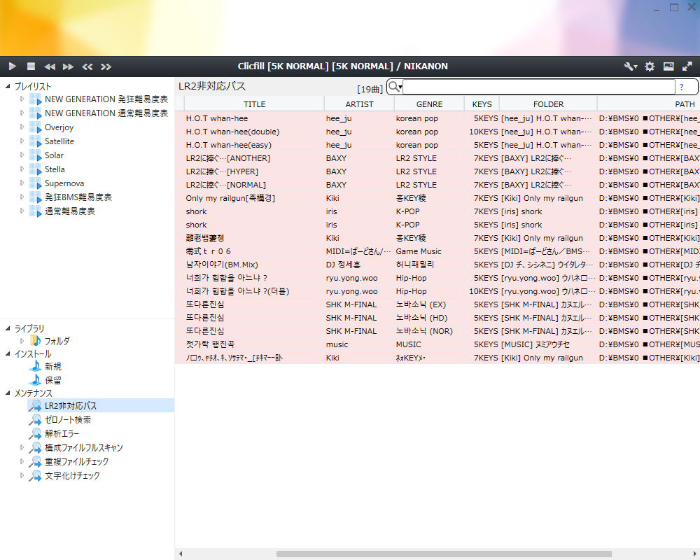

`LR2非対応パス` には、Shift_JIS で表現できない文字を含むなど、LR2 の `song.folder` / `song.parent` を計算できない可能性が高い譜面が表示されます。

BeMusicSeeker 上では削除せず warning として可視化しますが、LR2 側では選曲できない可能性があります。必要に応じて、ファイル名または配置先フォルダを Shift_JIS 互換のパスへ変更してください。

詳しくは [Shift_JIS 非対応パスによる LR2 parent 設定不可 warning](sjis-path-validation-note.md) を参照してください。

## 検索

右上の検索ボックスに文字を入力すると、一覧を絞り込めます。

通常検索では、大文字・小文字を区別せず、複数語は AND 検索になります。

```text
alpha artist
```

より細かく探す場合は、field 指定を使います。

```text
title:Satellite
artist:xi
level:12
rate:>=80
playlist:"Satellite Sub"
```

検索欄には field 補完、プレイリスト名補完、検索履歴があります。  
詳しい構文は [キーワード検索構文ガイド](keyword-search-syntax-guide.md) を参照してください。

## 再生・録音

一覧で譜面をダブルクリック、または Enter を押すと再生できます。使用するプレイヤーは設定画面の `再生` タブで選択します。

内蔵プレイヤーは音声のみの簡易再生用です。外部プレイヤーを使う場合は、対応する実行ファイルを指定してください。

bmson はライブラリ上では譜面ファイルとして扱われますが、現時点では内蔵プレイヤーでの再生と `音声ファイルへ変換` には対応していません。bmson を再生したい場合は、bmson に対応した外部プレイヤーで開いてください。

録音は設定画面の `録音` タブで、保存形式、品質、サンプルレート、ファイル名書式、エンコーダの場所を設定します。録音の保存先やエンコード形式は、事前に短い譜面で確認しておくと安全です。

## プレイリスト

BeMusicSeeker では、導入済みの難易度表や独自プレイリストを `プレイリスト` として管理できます。プレイリストには、全体の所持状況を一覧するサマリー表示と、各譜面を確認する詳細表示があります。

### プレイリストサマリー

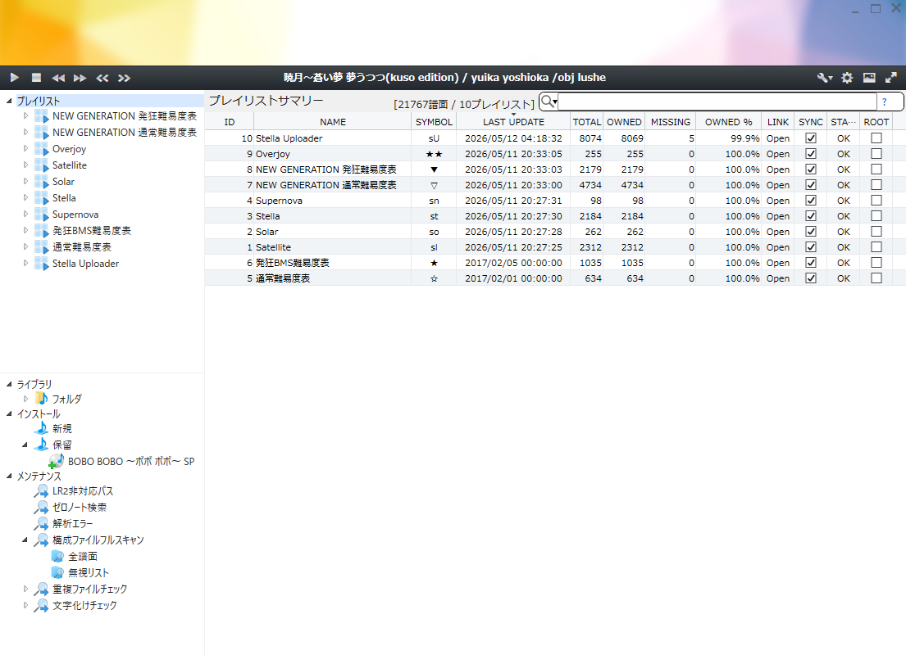

プレイリストサマリーでは、各プレイリストの譜面数、所持数、未所持数、所持率、外部同期の状態を一覧できます。

未所持譜面が増えた表を見つけたら、行をダブルクリックすると対象のプレイリスト詳細へ移動できます。

`STATUS` 列には、起動後またはリロード時に行われた外部プレイリスト同期の結果が表示されます。リンク切れ、ヘッダ取得失敗、データ取得失敗などはここで確認できます。詳細はツールチップに表示されます。

### プレイリスト詳細

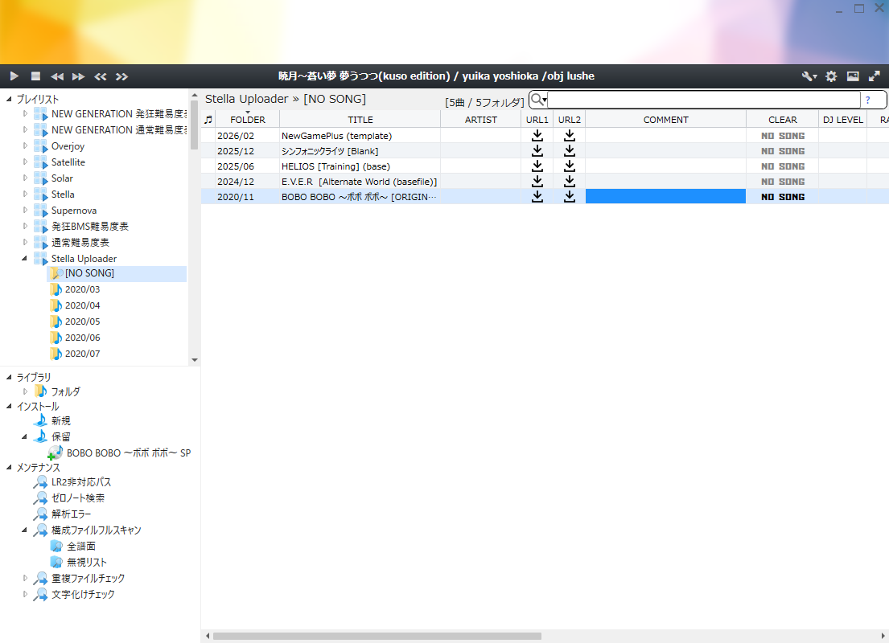

プレイリスト詳細では、選択したプレイリストに含まれる譜面を一覧できます。所持済み譜面と未所持譜面を確認でき、未所持譜面は `[NO SONG]` として表示されます。

`URL1` / `URL2` 列から本体 URL や差分 URL を開けます。URL がプレイリスト自体に含まれていない場合でも、URL 補完が有効であれば、外部マッピングから実行時に補完されることがあります。

プレイリストツリーでプレイリスト本体を右クリックすると、次の操作を実行できます。

- `リロード`: 対象プレイリストを再取得します。単体リロードでは、外部同期フラグに関係なく選択したプレイリストが対象になります。
- `ページを開く`: プレイリストのページ URI をブラウザで開きます。
- `CLEAR LAMPを開く`: LR2ID とプレイリストのページ URI を外部 CLEAR LAMP サイトに渡して開きます。ただし現時点では外部サイトが利用できない状態のため、内部ランプビューアを作成する方向で検討中です。
- `レベルを上書き`: このプレイリストに登録されている譜面のレベルを使い、ローカルライブラリ側の同一譜面のレベルを上書きします。実行前に確認ダイアログが表示されます。リコメンド表など一部の特殊表では実行できません。
- `新規フォルダ作成`: 外部同期ではないプレイリストに、手動管理用のフォルダを追加します。
- `エクスポート`: プレイリストを `header.json` と `data.json` の 2 ファイルとして保存します。保存先はそれぞれファイル選択ダイアログで指定します。
- `プレイリスト削除`: 対象プレイリストを BeMusicSeeker の管理対象から削除します。実行前に確認ダイアログが表示されます。
- `プロパティ`: プレイリスト名、表示記号、外部同期、URI、フォルダ出力などを編集します。

外部同期ではないプレイリストでは、一覧からプレイリスト本体またはフォルダへ譜面行をドラッグアンドドロップして追加できます。プレイリスト詳細内の行を別フォルダへドラッグすると、同じプレイリスト内でフォルダ間移動できます。フォルダ型のプレイリストにルートへドロップした場合は、既存フォルダの内容や同じ曲の MD5 情報を参考にしてフォルダが選ばれ、必要に応じて新しいフォルダが作成されます。

### 外部プレイリストのインポート

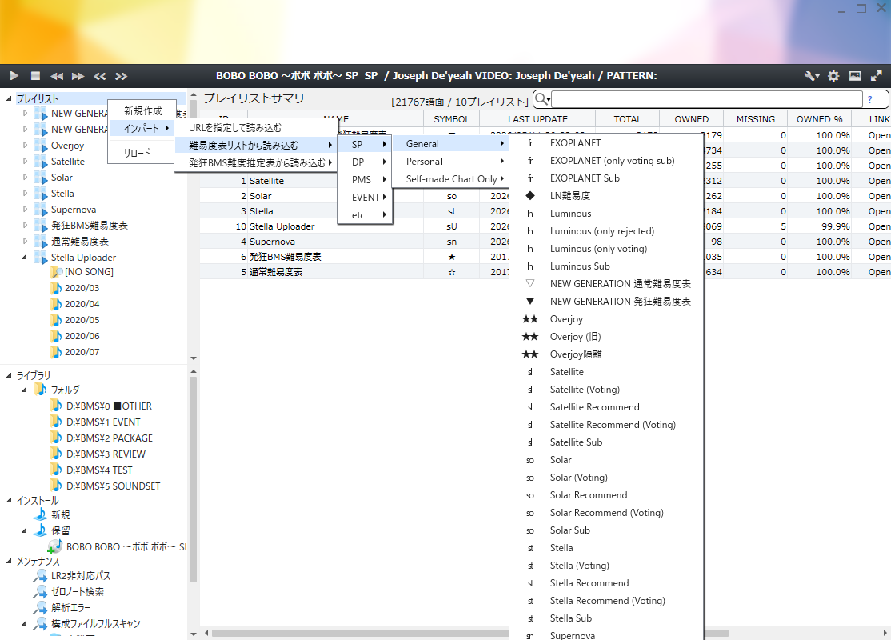

プレイリストツリーのルートを右クリックし、`インポート` から外部プレイリストを追加できます。登録済みの外部表リストから選ぶほか、URI を指定して読み込むこともできます。

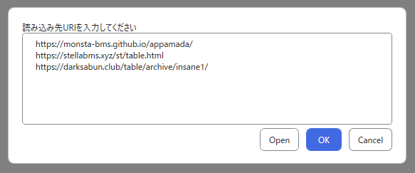

外部表リストやリコメンド表などのインポートメニューは、項目を 1 つクリックしてもメニューが閉じないため、複数の表を続けて選択してインポートできます。

`URLを指定して読み込む` では、読み込み先 URI を複数行で入力できます。複数の難易度表 URL をまとめて貼り付けると、行ごとに読み込み対象として扱われます。

外部同期プレイリストは、元の難易度表を再取得して更新できます。インポート後はプレイリストサマリーの `STATUS` 列で同期結果を確認してください。

### プレイリストのプロパティ

プレイリストを右クリックして `プロパティ` を開くと、プレイリスト名、表示記号、外部同期設定、ページ URI、ヘッダ URI、データ URI を確認・編集できます。

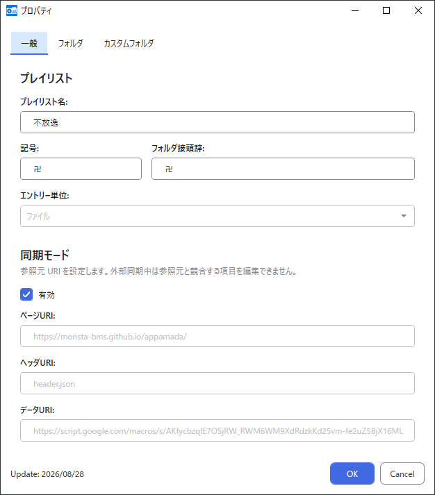

`フォルダ` タブでは、フォルダ内ソートのキーと昇順 / 降順、フォルダの並び順を設定できます。外部同期プレイリストでは、同期元と衝突する項目の編集が制限されます。

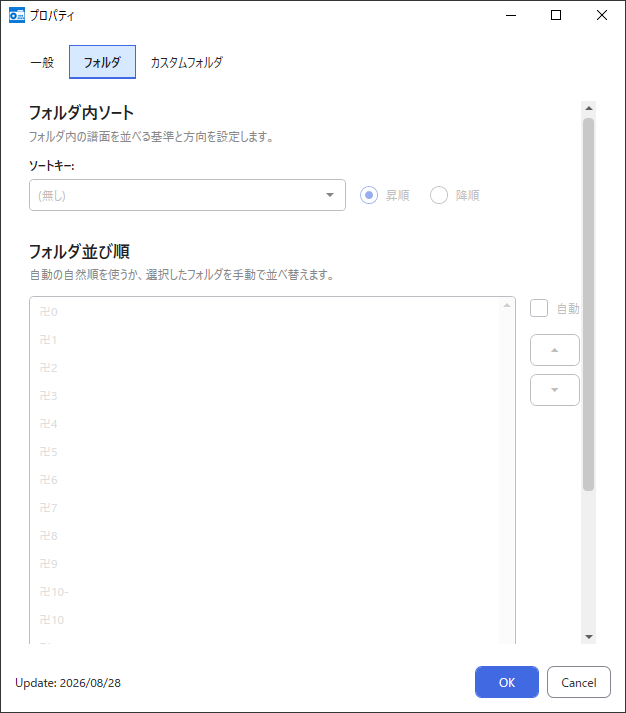

`カスタムフォルダ` タブでは、出力するフォルダ種別や出力名を設定できます。

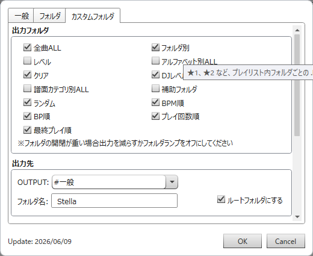

### カスタムフォルダ出力

LR2 連携モードでは、プレイリストを LR2 のカスタムフォルダとして出力できます。

設定画面の `プレイリスト` タブで通常出力先とルートフォルダ出力先を指定します。  
プレイリストの `プロパティ` から、出力名、`ルートフォルダにする`、出力するフォルダ種別を設定します。

出力できる主なフォルダ種別:

- ユーザー定義
- レベル
- アルファベット
- クリア
- DJ レベル
- カテゴリ ALL
- その他

ルートフォルダにしたプレイリストは LR2 の選曲画面ルートに表示されます。よく使う表へ素早くアクセスしたい場合に便利です。

### URL1/URL2 補完

プレイリストの `URL1` / `URL2` が空の場合、MD5 をもとに外部 TSV や Stella Uploader 由来の情報から URL を補完できます。

補完結果はまず実行中の表示情報として扱われます。ローカルプレイリストで行編集を保存した場合のみ、補完値もプレイリストに保存されます。外部同期プレイリストの編集制限は維持されます。

設定画面の `プレイリスト` タブで、以下を設定できます。

- プレイリストの URL1/URL2 が空の場合補完を試みる
- 空ではない URL1/URL2 も補完機能で上書きする
- MD5-URL マッピング TSV 取得 URI
- Stella Uploader (Full) のデータで URL1/URL2 を補完する

TSV URI には HTTP/HTTPS のほか、ローカル TSV ファイルパスも指定できます。同じ MD5 に複数の補完元がある場合、TSV が優先されます。

## インストール / 保留パッケージ

BMS フォルダやアーカイブを BeMusicSeeker に追加すると、未導入の譜面や差分は `インストール` ツリーの `新規` / `保留` に表示されます。

基本的な流れは次の通りです。

1. BMS 作品、差分譜面、またはそれらを含むフォルダ / アーカイブを画面へドラッグアンドドロップします。
2. 未所持の新規作品としてリソースが十分に揃っているものは、設定画面の `新規インストール先` へ通常インストールされます。詳細設定で `新規判定でも自動インストールせず保留に追加する` を有効にしている場合は、新規判定でも保留に残ります。
3. リソースが少なく、既存作品に追加する差分譜面と判断されたものは `保留` に入り、導入先推定が行われます。
4. `WARNING`、`TITLE`、`ARTIST`、`INSTL DST TITLE`、`INSTL DST ARTIST` などを確認します。
5. 問題ない行を選択し、右クリックメニューの `インストール` → `推定先にインストール` を実行します。

`保留` や `新規` の一覧では複数行を選択できます。1 行クリックで単一選択、`Ctrl + クリック` で個別に追加 / 解除、`Shift + クリック` で範囲選択、`Ctrl + A` で全選択できます。キーボードでは `Shift + ↑ / ↓` で選択範囲を伸ばせます。右クリックメニューのインストール、推定、削除などは、基本的に選択中の複数行を対象にします。

### 新規

`新規` には、導入直後のパッケージが表示されます。導入前の一時 WARNING は、導入後の状態に合わせて再評価されます。

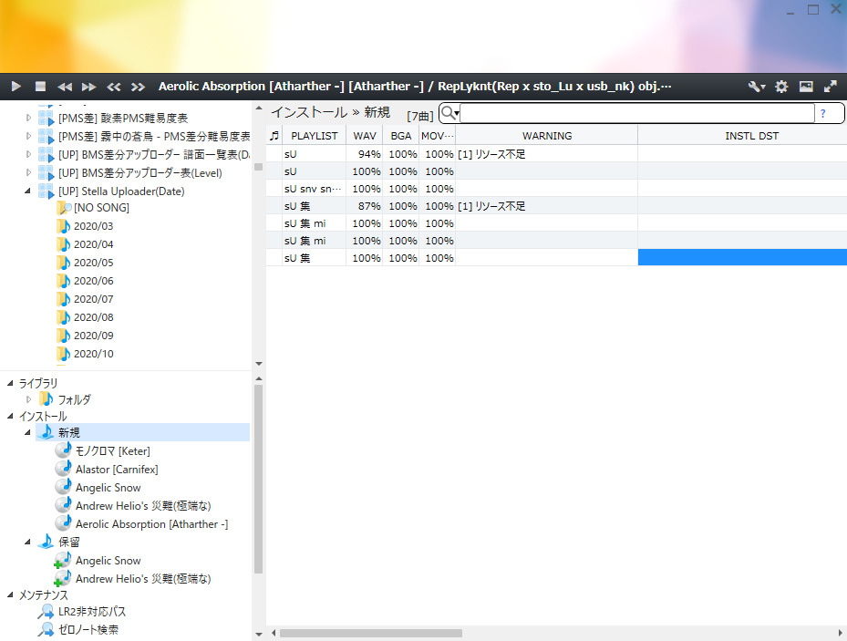

### 保留

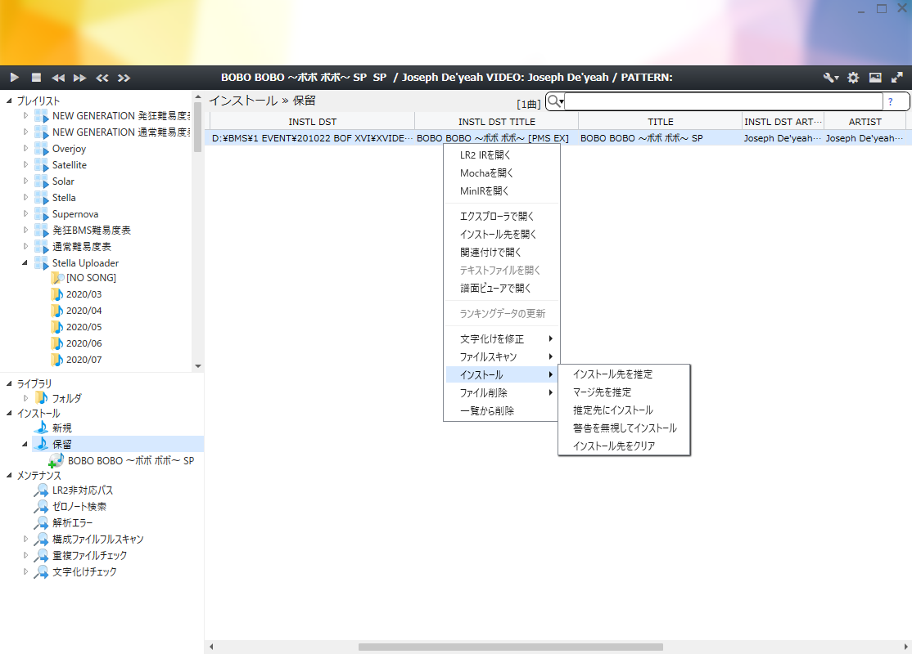

`保留` には、まだ導入前のパッケージが表示されます。推定された導入先の確認、手動導入先指定、インストール、一覧から削除、ごみ箱へ移動などを行います。

保留に入った譜面は、既所持譜面の hash、フォルダ構成、譜面が参照している WAV / BGA / 動画 / 画像、同梱リソース、タイトル / アーティストなどを使って導入先を推定します。推定結果は主に次の列に表示されます。

- `INSTL DST`: 実際に導入する候補ディレクトリ。
- `INSTL DST TITLE`: 推定先ディレクトリを代表する既存譜面のタイトル。
- `INSTL DST ARTIST`: 推定先ディレクトリを代表する既存譜面のアーティスト。
- `WARNING`: 推定先が曖昧、低信頼、リソース不足などの注意。

推定は、「その差分譜面をどの既存ディレクトリに入れると参照リソースが最も揃うか」を見ます。特に音声リソースの一致を重く見て、画像や動画もカテゴリ別に照合します。`sound/foo.wav` と `foo.wav` のように相対パスが違うリソースは別物として扱います。

次のような場合は、自動で `INSTL DST` を確定せず、WARNING を出すことがあります。

- 候補が複数あり、リソース一致度だけでは一意に決められない。
- 既所持譜面から複数の配置先が見つかった。
- リソースはそこそこ一致するが、TITLE / ARTIST の一致度が低い。
- 既存配置より良い導入先とは言い切れない。
- 起動時のファイル差分確認を省略しており、推定に必要なリソース index がない。

候補が複数ある場合は、`INSTL DST` セルをクリックして編集状態にすると、候補がサジェストとして表示されます。候補から選ぶと、そのディレクトリが `INSTL DST` に設定されます。候補を選んだ場合、曖昧さを示す WARNING は残ることがあります。これは「候補群の中からユーザーが選んだ」ことを保つためです。

`INSTL DST` は手動入力もできます。入力できるのは、所持譜面のフルパスそのもの、または所持譜面が配置されているディレクトリです。フルパスを入力した場合は、その譜面が入っているディレクトリに正規化されます。存在しないパスや、ライブラリ上の既存譜面ディレクトリとして認識されていない場所は指定できません。

### 導入先推定とマージ先推定

右クリックメニューの `インストール` には、似た名前の推定機能が複数あります。

`インストール先を推定` は、通常の差分導入向けです。保留パッケージに同梱されているリソースも「導入後に使えるもの」として数え、既存ディレクトリとの組み合わせで最も成立しやすい導入先を探します。通常はこの機能を使います。

`マージ先を推定` は、既所持譜面だけの保留パッケージや、リソースだけを既存フォルダへ寄せたいケース向けです。保留パッケージ内の同梱リソースを評価に足さず、既存ライブラリ側のリソースだけで成立する統合先を探します。推定済みの `INSTL DST` は上書きされます。実行前に確認ダイアログが出ます。

`推定先にインストール` は、`INSTL DST` が設定されている保留パッケージを、その推定先へ導入します。導入先ごとにまとめて処理し、ファイル移動、song.db への反映、メンテナンス情報、譜面メタデータ、リソース状態を更新します。同梱ファイルの同名衝突は、設定画面の [スマート上書き](#スマート上書き) に従って処理されます。

`警告を無視してインストール` は、推定先を使わず、通常の新規インストールとして扱います。差分譜面を既存フォルダへ入れるのではなく、独立したフォルダへ導入したい場合に使います。

`インストール先をクリア` は、選択行の `INSTL DST`、推定先タイトル / アーティスト、導入先推定 WARNING、候補サジェストを消します。推定をやり直したい場合に使います。

### 高度な機能

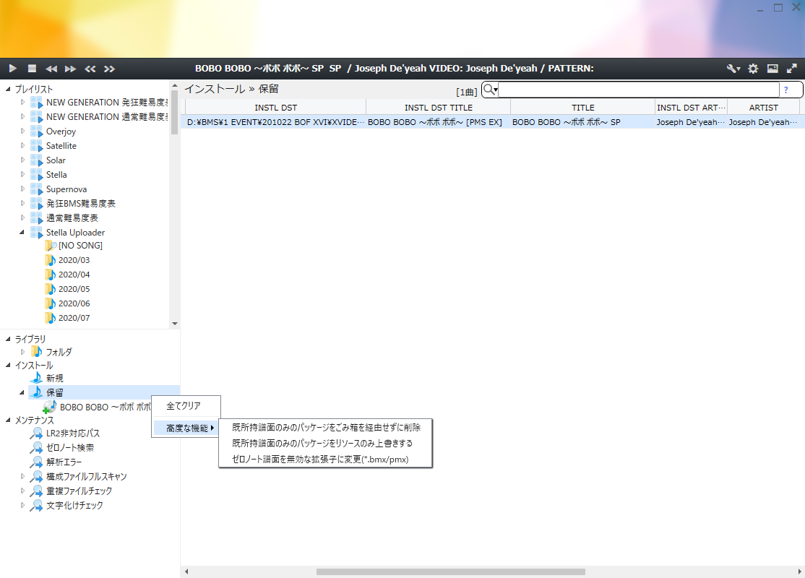

保留ツリーには、整理用の高度な機能があります。

`既所持譜面のみのパッケージをごみ箱を経由せずに削除` は、保留中のうち、含まれる譜面がすべて既所持と判断できるパッケージだけを対象にします。フォルダパッケージはフォルダごと、単体ファイルはファイルそのものを直接削除し、保留一覧からも取り除きます。ごみ箱を経由しないため、誤って実行すると戻せません。

`既所持譜面のみのパッケージをリソースのみ上書きする` は、譜面自体は既に持っているが、音源や BGA などの同梱リソースだけ更新したい場合の機能です。既所持譜面の hash から導入先を解決し、導入先が一意に決まるパッケージだけを処理します。導入先が複数に分かれる、導入先が分からない、上書き対象のリソースがない、などの場合はスキップされます。同名ファイル衝突時の扱いは [スマート上書き](#スマート上書き) の設定に従います。処理後に成功数、スキップ理由、失敗数のサマリーが表示されます。

`ゼロノート譜面を無効な拡張子に変更(*.bmx/pmx)` は、保留中の譜面を実ファイルで確認し、0 notes と判定される譜面だけをまとめて対象にする一括処理です。BMS 系拡張子は `.bmx`、PMS 系拡張子は `.pmx` へ変更し、保留一覧から除外します。`.bmx` / `.pmx` 自体や対象外拡張子、0 notes ではない譜面はスキップされます。変更先ファイル名が衝突した場合の重複削除や自動採番は、ライブラリ右クリックメニューの [無効な拡張子に変更](#無効な拡張子に変更) と同じです。

これらは破壊的な操作を含みます。特に完全削除やリソース上書きは、対象パッケージと導入先を確認してから実行してください。

## メンテナンス

`メンテナンス` には、ライブラリの状態確認に使う専用ビューがあります。

### ゼロノート検索

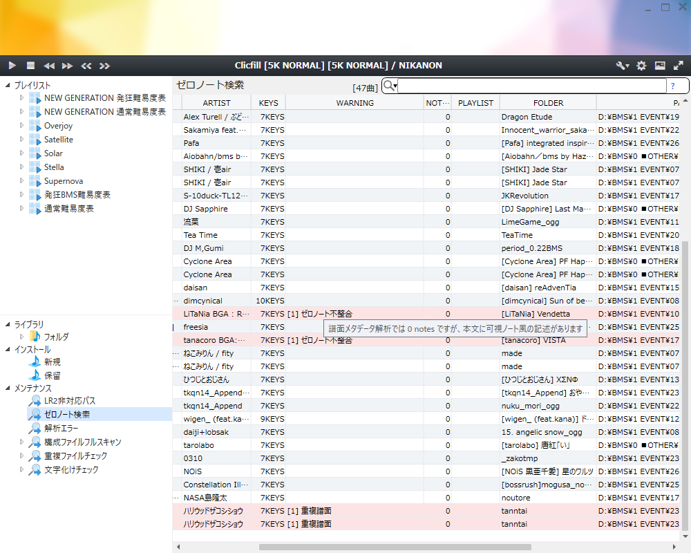

メタデータ上 `0 notes` と判定された譜面を確認します。

ここでいう `0 notes` は、譜面メタデータ解析で得られた `notes == 0` の譜面です。メタデータ解析は beatoraja / jbms パーサー準拠の解釈に寄せていますが、`#RANDOM` / `#IF` などによって分岐する全パターンを総当たりして照合しているわけではありません。そのため、条件分岐によって特定パターンだけノートが出る譜面などは、実際のプレイヤー上の挙動と完全には一致しない場合があります。

`ゼロノート再判定` は、メタデータ上 `0 notes` の譜面ファイルを実ファイルから読み直し、本文に可視ノート風の記述があるかを正規表現ベースで確認します。対象になるのは、通常ノート系チャンネルや LN 系チャンネルに、`00` 以外のオブジェクトが書かれている行です。このチェックは軽量な保守用判定であり、譜面構文を完全に解釈するものではありません。不正な LN ペア、到達不能な `#RANDOM` 分岐内の記述、プレイヤー上では無効になる可能性がある記述でも、可視ノート風の行として見つかれば「メタデータは 0 notes だが本文にはノートらしき記述がある」として warning 表示します。

つまり、`ゼロノート検索` は「本当に空譜面か」を断定する画面ではなく、`0 notes` と解析された譜面のうち、念のため確認した方がよいものを見つけるための画面です。

LR2 ではパースエラーなどで再生できなくても、他プレイヤーや譜面ビューワーでは再生できる譜面が該当する場合があります。

### 解析エラー

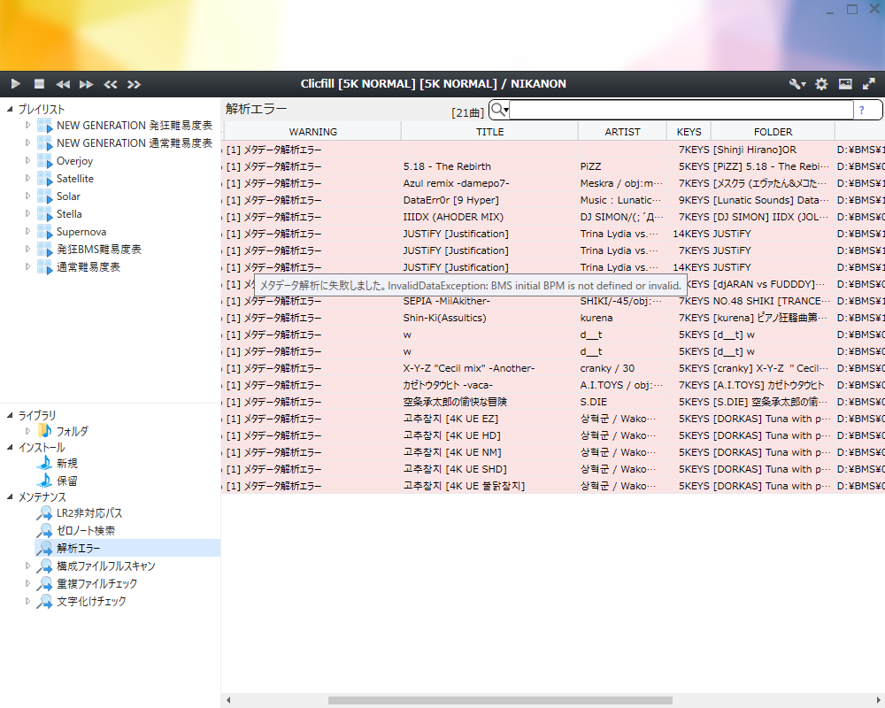

譜面メタデータ解析に失敗した譜面を確認します。  
解析失敗は WARNING として表示され、通常一覧の元行を直接変更するのではなく、解析エラー確認用の表示として扱われます。

解析エラー画面で譜面を右クリックすると、`メタデータ解析失敗記録を除去` を実行できます。これは解析失敗そのものを無視する操作ではなく、保存されている失敗記録を消して、次回の譜面メタデータ解析で再パース対象に戻すための操作です。

通常は使う必要はありません。ディスク負荷や CPU 負荷が高い状態でタイムアウトした、外部要因で一時的に読み込みに失敗した、など「譜面ファイル自体の問題ではなさそう」と判断できる場合に使用してください。除去後も再パースで同じエラーになる場合は、譜面内容や parser 側の制約による解析失敗として扱うのが自然です。

### 文字化けチェック

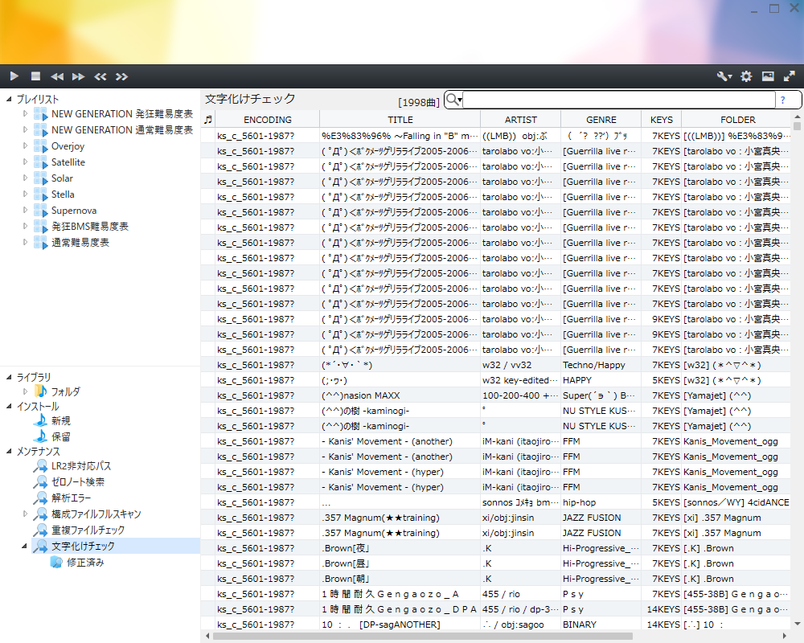

文字コード推定に問題がある譜面を確認します。手動修正では、日本語、韓国語、中国語などの候補から選べます。

### 重複ファイルチェック

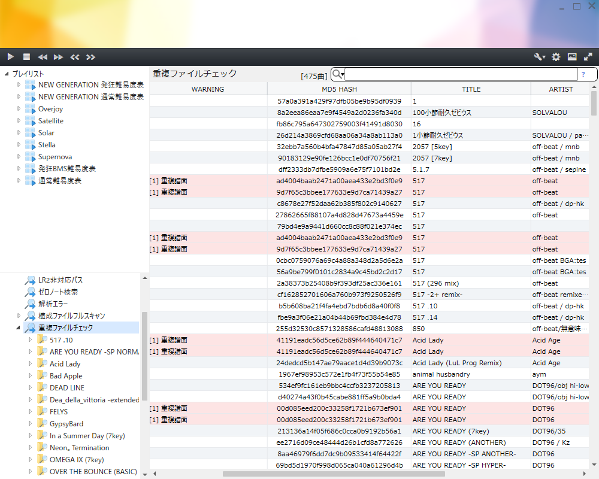

同一譜面と判断できるファイルを探し、重複している譜面をまとめて確認する画面です。BMS 系ファイルだけでなく bmson も譜面ファイルとして扱い、MD5 または SHA-256 などの譜面識別用 hash が一致するものを重複候補として表示します。

重複している譜面には `重複譜面` の WARNING が付き、一覧では行がハイライトされます。左ツリーの `重複ファイルチェック` を選ぶと重複候補全体、配下のグループを選ぶとそのグループ、さらにフォルダを選ぶとそのフォルダ内の該当譜面だけを一覧に表示できます。

重複グループは、同じ hash を持つ譜面が入っているフォルダ同士をつなげて作られます。たとえば `A` と `B` に同じ譜面があり、さらに `B` と `C` に別の同一譜面がある場合、`A / B / C` は一つの整理対象として扱われます。これにより、複数フォルダにまたがって少しずつ重複しているパッケージもまとめて確認できます。

#### 重複フォルダをマージする

重複ファイルチェックツリーで、統合したい側、つまり消したい側のフォルダを選び、右クリックメニューの `マージ先` から移動先フォルダを選ぶと、選択フォルダ内の譜面と同梱リソースを移動先へまとめます。フォルダの右クリックメニューからは、対象フォルダを Explorer で開くこともできます。実行前には、対象パスとマージ先パスを表示した確認ダイアログが出ます。

マージでは、移動元フォルダ配下の譜面をいったんライブラリから外し、ファイルを移動先へ移動したうえで、移動後の譜面情報、メンテナンス情報、リソース参照、インストール先参照を更新します。bmson も対象フォルダ配下にあれば譜面として扱われます。移動先に同じ hash の譜面がすでにある場合、その譜面ファイルは重複導入しません。譜面ファイル名だけが衝突する場合は、ファイル名をずらして移動します。

同梱リソース類は、移動先に同名ファイルがある場合、設定画面の [スマート上書き](#スマート上書き) に従って上書き、スキップ、自動採番されます。確認ダイアログにもある通り、`ogg` と `wav` のように音質や形式が違うリソースが混在している場合は、どちらを残したいかを確認してから実行してください。大きな整理の前には BMS フォルダのバックアップをおすすめします。

移動元フォルダは、移動後に空になった場合、または残っているファイルがすべて「すでに所持済みと判断できる譜面ファイル」だけの場合に削除されます。非譜面ファイル、読み込めない譜面、hash 不明の譜面、未所持 hash の譜面が残っている場合は、移動元フォルダの削除をスキップします。

#### `Ctrl + G` で連続整理する

フォルダ項目を選択した状態で `Ctrl + G` を押すと、重複整理用のショートカットとして動作します。

- 重複フォルダが 2 件だけの場合は、選択中フォルダをもう一方のフォルダへマージします。
- 重複フォルダが 3 件以上ある場合は、統合先を自動決定せず、右クリックメニューの `マージ先` を開いた状態にします。候補を確認して移動先を選んでください。
- 重複フォルダが 1 件だけの場合は、同じフォルダ内に同一 hash の譜面が複数ある状態として扱い、重複 hash の整理を行います。

同一フォルダ内の重複 hash 整理では、hash ごとに 1 件だけ残し、残りをごみ箱へ移動します。残すファイルは、更新日時が古いものを優先し、同じ日時ならファイル名が短いものを優先します。実行前には、ごみ箱へ移動する件数を表示した確認ダイアログが出ます。

マージや重複 hash 整理が終わると、ツリー内の次に確認すべき重複グループへ自動的にフォーカスを移します。上から順番に確認しながら `Ctrl + G` を使うと、大量の重複を比較的少ない操作で整理できます。

#### 注意点

- `Ctrl + G` は、残したいフォルダではなく、統合したい、または削除したい側のフォルダに対して実行します。
- 3 件以上の候補がある場合は、意図しない移動を避けるため自動マージせず、必ず候補選択を挟みます。
- ファイルが他アプリ、アンチウイルス、検索インデックスなどに一時的にロックされていると、移動や削除に失敗することがあります。失敗した場合は対象ファイルを閉じてから再実行してください。
- 重複表示はキャッシュされます。削除、移動、マージ、リロードなどでライブラリが変わると再計算されます。

### 構成ファイルフルスキャン

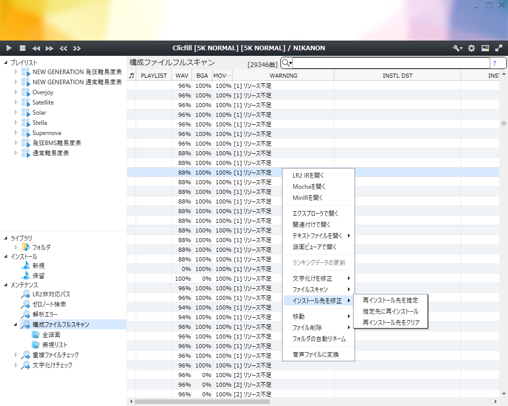

WAV、BGA、動画、画像などの不足を確認します。  
`全譜面を再スキャン` は重い明示操作です。通常起動では全譜面のリソース再検証は行いません。導入後に不足リソースを追加した場合は、該当行の再スキャンまたは全譜面再スキャンで状態を更新します。

## バックアップ・アンインストール

設定画面の `バックアップ` タブから、プレイリストのバックアップ / 復元、LR2 関連ファイルのバックアップを実行できます。

LR2 連携モードでは、BeMusicSeeker が LR2 の `song.db` にアプリ用テーブルや索引を追加する場合があります。`BeMusicSeeker関連データをLR2データベースから削除` は、これらの BeMusicSeeker 管理データを削除するための機能です。実行後はアプリを終了する前提の操作です。

アンインストールや大きな更新を行う前は、以下をバックアップしておくと安全です。

- LR2 `song.db`
- LR2 `config.xml`
- LR2 スコア DB
- BeMusicSeeker `config/user.config`
- BMS ルートフォルダ

## ログとトラブルシューティング

通常より詳しいログを取りたい場合は、`LaunchWithInfoLog.bat` から起動してください。`application.log` と `install-performance.log` に初期化、DB 読み込み、ファイルスキャン、プレイリスト同期などの情報が出力されます。

ログの読み方は [BeMusicSeeker ログ（実行記録）の見方ガイド](log-level-info-guide.md) を参照してください。

### 起動や初期化が遅い

- Everything 1.5 Alpha x64 が導入されているか確認してください。
- Everything 側で BMS フォルダが検索できるか確認してください。
- 初回構築、DB 空状態、BMS ルートフォルダの大規模変更では、通常より時間がかかります。
- `install-performance.log` の `everything_scan`、`song_tbl_file_check`、`playlist_*` などを見ると、どこに時間がかかっているか分かります。

### プレイリストの STATUS が失敗になる

外部難易度表の URL が 404、403、タイムアウトなどを返している場合があります。プレイリストサマリーの `STATUS` のツールチップ、または `application.log` の `playlist_reload_target_failed` を確認してください。

外部サイト側の一時的な問題であれば、時間を置いてリロードしてください。URL が変更されている場合は、プレイリストのプロパティで URI を修正する必要があります。

### LR2 で選曲できない譜面がある

`LR2非対応パス` に表示されていないか確認してください。Shift_JIS で表現できない文字を含むパスは、LR2 側で選曲できない可能性があります。

### 検索構文が分からない

[キーワード検索構文ガイド](keyword-search-syntax-guide.md) を参照してください。`title:`、`artist:`、`playlist:`、`rate:` などの field 指定や、除外検索、OR、正規表現、数値範囲検索を使えます。

## 参考資料

- [キーワード検索構文ガイド](keyword-search-syntax-guide.md)
- [Shift_JIS 非対応パスによる LR2 parent 設定不可 warning](sjis-path-validation-note.md)
- [BeMusicSeeker ログ（実行記録）の見方ガイド](log-level-info-guide.md)
- [従来版 BeMusicSeeker 公開記事](https://tumblr.ribbit.xyz/post/129562866015/bemusicseeker-%E6%AD%A3%E5%BC%8F%E7%89%88%E3%82%92%E5%85%AC%E9%96%8B%E3%81%97%E3%81%BE%E3%81%97%E3%81%9F-v034)
- [従来版 BeMusicSeeker マニュアル](https://tumblr.ribbit.xyz/post/129562878360/bemusicseeker-%E3%83%9E%E3%83%8B%E3%83%A5%E3%82%A2%E3%83%AB-v030-%E5%AF%BE%E5%BF%9C%E7%89%88)
