# BeMusicSeeker Unofficial Fork ユーザーマニュアル

[](manual.ja.md)
[](manual.md)


この文書は BeMusicSeeker Unofficial Fork の日本語マニュアルです。  
ライブラリの登録から検索・再生、譜面の導入と整理、プレイリストやプレイ履歴の利用までを説明します。

## 目次

- [はじめに](#はじめに)
- [初期セットアップ](#初期セットアップ)
    - [Everything 1.5 (x64) の準備](#everything-15-x64-の準備)
    - [既存設定の引き継ぎ](#既存設定の引き継ぎ)
    - [初回起動](#初回起動)
    - [動作モード](#動作モード)
    - [初回スキャン](#初回スキャン)
- [設定画面](#設定画面)
    - [一般](#一般)
        - [LR2プレイログ](#lr2プレイログ)
    - [外観](#外観)
    - [再生](#再生)
    - [オーディオ](#オーディオ)
    - [録音](#録音)
    - [プレイリスト設定](#プレイリスト設定)
    - [インストール](#インストール)
    - [バックアップ](#バックアップ)
    - [詳細](#詳細)
    - [右クリック設定](#右クリック設定)
- [起動・リロード・進捗表示](#起動リロード進捗表示)
    - [自動アップデート](#自動アップデート)
    - [進捗表示](#進捗表示)
    - [ライブラリのリロード](#ライブラリのリロード)
    - [初期化再実行](#初期化再実行)
    - [プレイリストのリロード](#プレイリストのリロード)
- [画面構成](#画面構成)
- [ライブラリ一覧](#ライブラリ一覧)
    - [行の選択と編集](#行の選択と編集)
    - [一覧のコピー操作](#一覧のコピー操作)
    - [一覧の右クリックメニュー](#一覧の右クリックメニュー)
    - [ツリーの右クリックメニュー](#ツリーの右クリックメニュー)
    - [その他のポップアップメニュー](#その他のポップアップメニュー)
- [検索](#検索)
    - [キーワードと検索条件](#キーワードと検索条件)
    - [補完・履歴・お気に入り](#補完履歴お気に入り)
- [再生・録音](#再生録音)
    - [譜面を再生する](#譜面を再生する)
    - [再生パネルの操作](#再生パネルの操作)
    - [音声ファイルに変換する](#音声ファイルに変換する)
- [プレイリスト](#プレイリスト)
    - [プレイリストサマリー](#プレイリストサマリー)
    - [プレイリスト詳細](#プレイリスト詳細)
    - [本体・差分のダウンロード](#本体差分のダウンロード)
    - [プレイリスト・ランプビューア](#プレイリストランプビューア)
    - [beatoraja の難易度表管理](#beatoraja-の難易度表管理)
    - [外部プレイリストのインポート](#外部プレイリストのインポート)
    - [プレイリストのプロパティ](#プレイリストのプロパティ)
    - [カスタムフォルダ出力](#カスタムフォルダ出力)
    - [URL1/URL2 補完](#url1url2-補完)
- [インストール / 保留パッケージ](#インストール--保留パッケージ)
    - [導入の手順](#導入の手順)
    - [新規](#新規)
    - [保留](#保留)
    - [導入先推定とマージ先推定](#導入先推定とマージ先推定)
    - [スマート上書き](#スマート上書き)
    - [高度な機能](#高度な機能)
- [メンテナンス](#メンテナンス)
    - [LR2互換性警告](#lr2互換性警告)
    - [ゼロノート検索](#ゼロノート検索)
    - [解析エラー](#解析エラー)
    - [文字化けチェック](#文字化けチェック)
    - [重複ファイルチェック](#重複ファイルチェック)
    - [構成ファイルフルスキャン](#構成ファイルフルスキャン)
- [プレイログ](#プレイログ)
    - [表示される履歴](#表示される履歴)
    - [期間と未確定 / 診断](#期間と未確定--診断)
    - [サマリー](#サマリー)
    - [行の見方](#行の見方)
    - [表示対象と FOLDER](#表示対象と-folder)
    - [プレイログの右クリックメニュー](#プレイログの右クリックメニュー)
    - [beatoraja 利用時の注意](#beatoraja-利用時の注意)
- [バックアップ・アンインストール](#バックアップアンインストール)
    - [プレイリストのバックアップと復元](#プレイリストのバックアップと復元)
    - [LR2 関連ファイルの自動バックアップ](#lr2-関連ファイルの自動バックアップ)
    - [アプリ設定と BMS ライブラリの保護](#アプリ設定と-bms-ライブラリの保護)
    - [データのアンインストール](#データのアンインストール)
- [FAQ / トラブルシューティング](#faq--トラブルシューティング)
    - [ログ・不具合報告](#ログ不具合報告)
    - [起動・初期化](#起動初期化)
    - [ダウンロード・インストール](#ダウンロードインストール)
    - [プレイリスト・外部サイト](#プレイリスト外部サイト)
    - [LR2 連携](#lr2-連携)
    - [プレイログの問題](#プレイログの問題)
    - [音声の再生・変換](#音声の再生変換)
    - [メンテナンスの問題](#メンテナンスの問題)
    - [検索の問題](#検索の問題)
- [参考資料](#参考資料)

## はじめに

BeMusicSeeker は、BMS / bmson の管理、検索、音声再生、インストール、プレイリスト管理、メンテナンスをまとめて行えるツールです。LR2 を使わずに管理するスタンドアローンモードと、LR2 のライブラリやスコアに連携するモードを選べます。beatoraja のスコア読み込みと難易度表出力にも対応しています。

最初に [初期セットアップ](#初期セットアップ) でライブラリを登録してください。登録後は [検索](#検索) で譜面を探し、[再生・録音](#再生録音) で試聴・変換できます。新しい作品や差分を追加する手順は [インストール / 保留パッケージ](#インストール--保留パッケージ) を参照してください。

> [!CAUTION]
> 譜面の導入・整理では実ファイルの移動、削除、上書きを行います。LR2 連携では DB と設定ファイルも更新します。大きな整理の前に [バックアップ](#バックアップアンインストール) を取り、BMS ライブラリ自体も別の場所へ定期的に控えてください。

## 初期セットアップ

BeMusicSeeker Unofficial Fork はインストール不要のポータブルアプリです。[リリースページ](https://github.com/Neeted/bemusicseeker-unofficial-fork/releases)から最新版をダウンロードし、任意のフォルダへ展開して起動します。ZIP のまま実行せず、必ず書き込み可能なフォルダへ展開してください。

展開する前に、ダウンロードした ZIP を右クリックして `プロパティ` を開き、下部に `セキュリティ` の `許可する` チェックボックスが表示されている場合は、チェックを入れて `適用` してください。これは Windows がインターネットから取得したファイルに付ける確認情報を、展開前に解除するための手順です。先に ZIP 側で許可しておくと、展開後の `BeMusicSeeker.exe` や DLL が Windows によって余分に制限されることを避けやすくなります。

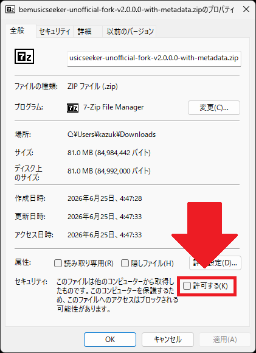

アプリは実行ファイルの近くに `config/user.config` や `data/song.db` などを作成します。`Program Files`、読み取り専用フォルダ、同期中に競合しやすい場所へ置くと、設定保存やスタンドアローン DB 作成に失敗する場合があります。更新時は `config` と `data` を残したまま、本体ファイルを新しい版で上書きしてください。

### Everything 1.5 (x64) の準備

可能であれば、先に [Everything 1.5 (x64)](https://www.voidtools.com/everything-1.5/) を導入してください。

BeMusicSeeker は初期化時に BMS 譜面、音源、画像、動画などを大量に列挙します。Everything が利用可能な場合、譜面や構成ファイルの検索を高速化できます。未導入でも動作しますが、大規模なライブラリでは初回スキャンやリロードに時間がかかります。

Everything 側で BMS 関連フォルダのインデックス作成が完了し、検索できる状態になってから BeMusicSeeker を起動してください。

### 既存設定の引き継ぎ

従来版 BeMusicSeeker がインストール済みの環境では、初回起動時に既存の設定が自動コピーされます。コピー先はアプリ配置先の `config/user.config` です。元の BeMusicSeeker の設定ファイルは変更されません。

### 初回起動

初回起動時は、言語選択付きの初回設定ダイアログが表示されます。

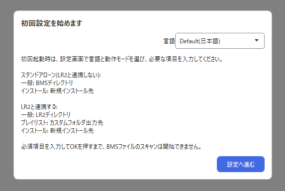

言語を選んで設定画面へ進み、動作モードと必須項目を設定します。必須項目を入力して `保存して閉じる` を押すまで、BMS ファイルの初回スキャンは開始されません。

### 動作モード

設定画面の `一般` で動作モードを選びます。

| モード | 用途 | 必須の準備 |
| --- | --- | --- |
| スタンドアローン(LR2と連携しない) | アプリ配下の `data/song.db` で BMS / bmson を管理します。 | `一般` で BMS ディレクトリ、`インストール` で新規インストール先を登録します。 |
| LR2と連携する | LR2 のライブラリ、スコア、カスタムフォルダに連携します。 | 上記に加え LR2 ディレクトリとカスタムフォルダ出力先を設定します。 |

スタンドアローンでは LR2 のスコア・カスタムフォルダ・IR 連携は使いません。beatoraja 連携や、再生用アプリとしての LR2body は別に設定できます。

> [!CAUTION]
> LR2 連携の初回設定を保存する前に、LR2 の `song.db`、利用中の LR2 設定ファイル（`config.xml` または `config.xmh`）、各プレイヤーの `score.db` をバックアップしてください。BeMusicSeeker が LR2 のライブラリと設定を更新します。

LR2 連携では、インストールや整理に合わせて `song.db` が更新されます。bmson は BeMusicSeeker 内で管理します。設定の手順は [一般](#一般)、出力先は [カスタムフォルダ出力](#カスタムフォルダ出力) を参照してください。動作モードを変更した場合はアプリを再起動します。

### 初回スキャン

設定完了後、初回スキャンが始まります。初回は全譜面ファイルを確認し、DB へ登録し、インストール推定やメンテナンス情報に必要な基礎データを作成します。  
ライブラリ規模、ディスク速度、Everything の利用状況によって、数分からそれ以上かかる場合があります。

初回構築が完了すると、次回以降は差分更新中心になります。BMS フォルダ全体を大きく移動した場合や、DB を空から作り直した場合は、再び重い処理になります。

## 設定画面

設定画面は `保存して閉じる` を押すと保存されます。設定内容によって、即時反映、次回利用時の反映、スコアのみ再読み込み、ライブラリリロード、再初期化、再起動要求のいずれかになります。`右クリック設定` カテゴリの設定は次にコンテキストメニューを開いたときから使われます。

### 一般

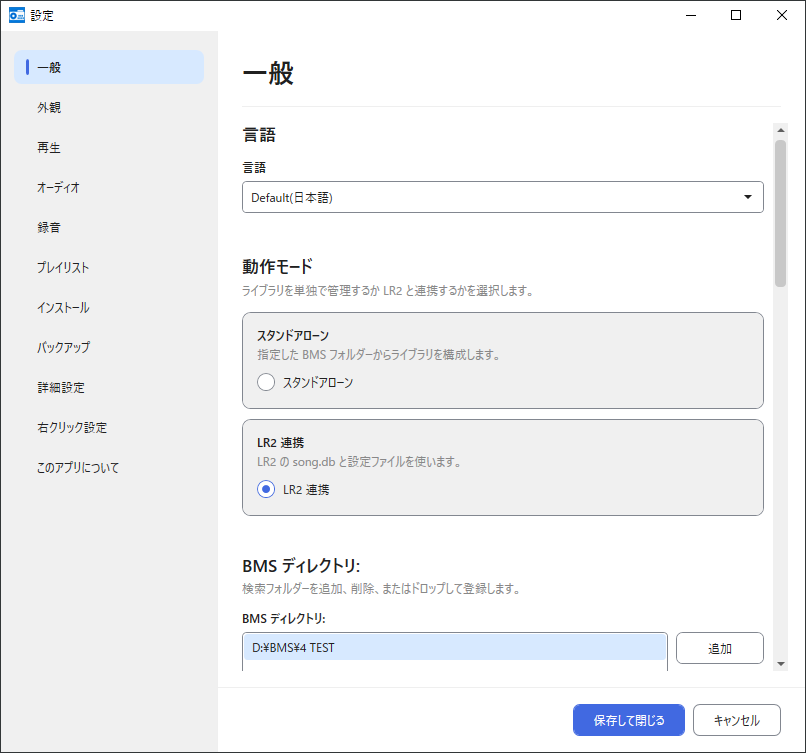

言語、動作モード、BMS ディレクトリ、LR2 ディレクトリ、beatoraja ディレクトリと使用するプレイヤーを設定します。

#### BMS ディレクトリの登録

両モードとも、譜面を探すルートフォルダを BMS ディレクトリへ登録します。`追加` ボタン、またはフォルダをリストへドラッグアンドドロップして登録できます。同じ場所や親子関係のフォルダを重複登録しないようにしてください。新規インストール先は登録した BMS ディレクトリから選びます。

#### LR2と連携する

通常は `LR2 ディレクトリ` を指定すると、標準配置の `song.db` と `config.xml` / `config.xmh` が自動設定されます。標準配置を使えない場合だけ、各ファイルの `参照` で個別指定してください。状態表示で標準配置か個別設定かを確認できます。

BMS ディレクトリの追加・削除は BeMusicSeeker の `一般` で行ってください。LR2 のデータベース自動更新は、初回設定保存時と起動時に「手動のみ」へ設定されます。

> [!CAUTION]
> LR2 で読み込めない譜面も BeMusicSeeker の管理対象に含まれます。[LR2互換性警告](#lr2互換性警告) を確認し、LR2 での選曲・再生に支障がある譜面は対応してください。

`LR2 song.db データを再同期` は、所持譜面とプレイリストから LR2 のライブラリ情報を作り直します。復旧手順は [LR2 で選曲できない譜面がある](#lr2-で選曲できない譜面がある) を参照してください。

#### LR2プレイログ

LR2 連携モードで、導入後のプレイ履歴を記録できます。導入前の過去プレイは復元できません。

> [!CAUTION]
> 導入・修復は選択中プレイヤーの `score.db` を変更します。対象プレイヤーを確認し、`score.db` をバックアップしてから実行してください。

`LR2 プレイログ` の状態を確認し、横のボタンで導入または修復します。記録した履歴は [プレイログ](#プレイログ) で確認できます。記録の停止と履歴の削除は [データのアンインストール](#データのアンインストール) を参照してください。

#### beatoraja連携

beatoraja ディレクトリを指定すると、直下の `config_sys.json` から表とプレイヤーの保存先を読み取ります。スコア読み込みには選択したプレイヤーフォルダの `score.db` を使います。

難易度表の取り込みと出力は [beatoraja の難易度表管理](#beatoraja-の難易度表管理) を参照してください。beatoraja の楽曲 DB 更新を行う場合は、別途 [songdata-updater](https://github.com/Neeted/songdata-updater) を利用できます。

### 外観

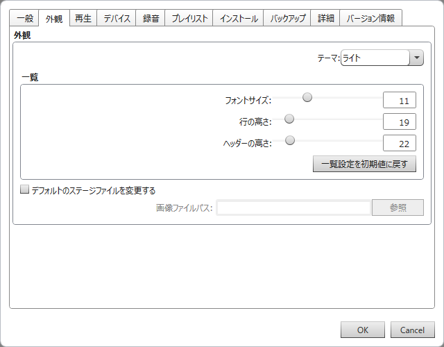

テーマや表示に関わる設定を変更します。外観変更は基本的にライブラリ再構築を必要としません。

一覧の外観設定では、ライブラリ一覧、プレイリスト詳細、プレイログ、プレイリストサマリーで共通して使う一覧表示を調整できます。フォントサイズ、行の高さ、ヘッダーの高さを変更できます。既定値はフォントサイズ `11`、行の高さ `19`、ヘッダーの高さ `22` です。

### 再生

譜面を再生するプレイヤーを選択します。内蔵プレイヤーは音声のみの簡易再生用です。uBMplay、BMIIDXView2015、LR2 など外部プレイヤーを使う場合は、実行ファイルのパスを指定します。

スタンドアローンモードでも、再生用アプリとして LR2body を指定できます。これは LR2 の DB と連携するかどうかとは別の設定です。

### オーディオ

内蔵プレイヤーの出力方式、デバイス、サンプルレート、フォーマット、音量を設定します。出力方式は `WASAPI (共有)`（既定）、`WASAPI (排他)`、`ASIO` から選べます。方式とデバイスを選ぶと対応情報が表示されます。ドライバまたはデバイスを変更すると、サンプルレートとフォーマットは「自動」に戻ります。サンプルレートを変更するとフォーマットだけが「自動」に戻ります。

`再生を停止してテスト` を押すと、現在の再生を停止し、編集中の出力設定をテストできます。終了まで設定画面の操作はできません。結果を確認し、使いたい設定を `保存して閉じる` で保存してください。音が出ない場合は [音声の再生・変換に失敗する](#音声の再生変換に失敗する) を参照してください。

詳細な音声設定では、方式に応じた低遅延設定とバッファサイズを調整できます。バッファを小さくすると遅延が減る一方、音切れしやすくなります。

| 設定 | 選択肢・既定値 | 選び方 |
| --- | --- | --- |
| サンプルレート変換品質 | `2`～`6`、既定 `2` | 高い値ほど変換誤差が減り、CPU 負荷が増えます。再生・テスト・音声変換で共通です。 |
| 再生時SRC並列度 | `1`～`4`、既定 `1` | `2`～`4` で処理が速くなる場合があります。音声ファイル変換は常に `1` を使います。 |

これらの変更は次回再生または変換開始から適用されます。

> [!CAUTION]
> 再生の並列度 `2`～`4` では、サンプルレート変換を行う音源の末尾がごく短く欠ける既知の問題があります。末尾を保持したい場合は `1` を選んでください。

再生音量はパネルからも調整できます。録音時の音量は [録音](#録音) の正規化と追加ゲインで決まり、再生音量やミュートには影響されません。

### 録音

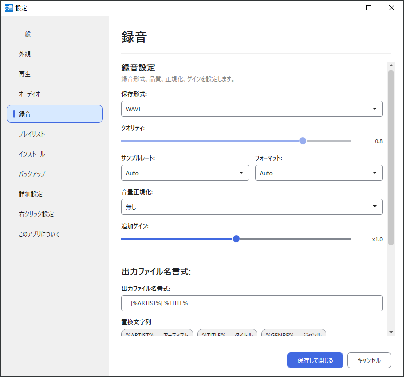

`音声ファイルに変換` の出力形式、品質、サンプルレート、フォーマット、音量、ファイル名を設定します。変換操作は [音声ファイルに変換する](#音声ファイルに変換する) を参照してください。

#### 保存形式とエンコーダ

| 保存形式 | 必要な外部実行ファイル |
| --- | --- |
| WAVE | 不要 |
| MP3 LAME | `lame.exe` |
| AAC Nero | `neroAacEnc.exe` |
| Opus | `opusenc.exe` |
| FLAC | `flac.exe` |
| Ogg Vorbis | `oggenc2.exe` |

外部形式を使う場合は、エンコーダの `実行ファイル検索先` で対応する実行ファイルを含むフォルダを選びます。AAC Nero の出力は `.m4a` です。保存形式の既定は WAVE、品質の既定は `0.8` です。品質は `0.0`～`1.0` で調整でき、WAVE では使いません。サンプルレートは `Auto`（既定）、`11025`、`22050`、`32000`、`44100`、`48000`、`88200`、`96000`、`176400`、`192000` Hz から選べます。サンプル形式は `Auto`（既定）、`8bit`、`16bit`、`24bit`、`32bit`、`32bit (IEEE Float)` から選びます。実際の出力形式はエンコーダによって異なります。

#### 音量正規化と追加ゲイン

| 音量正規化 | 結果 |
| --- | --- |
| 無し | 正規化せずに出力します。 |
| ピークレベル | 最大振幅を基準に音量を揃えます。 |
| RMS（実効値） | 曲全体の実効値を基準に音量を揃えます。 |

音量正規化の既定は `無し`、追加ゲインの既定は `1.0` です。`追加ゲイン` は正規化後の音量を `0.5`～`1.5` 倍（`0.1` 刻み）に調整します。再生パネルの音量とミュートは変換結果に影響しません。

> [!CAUTION]
> RMS 正規化や追加ゲインで整数音声の出力範囲を超えると、変換は失敗します。追加ゲインを下げるか、`ピークレベル` と `1.0` 倍を選んでください。`32bit (IEEE Float)` の WAVE は範囲を超える振幅も保存できます。

#### 出力ファイル名

既定の書式は `[%ARTIST%] %TITLE%` です。次の置換記号を組み合わせられます。

| 記号 | 内容 |
| --- | --- |
| `%ARTIST%` | アーティスト |
| `%TITLE%` | タイトル |
| `%GENRE%` | ジャンル |
| `%NO%` | 連番 |
| `%FILE%` | 元の譜面ファイル名 |
| `%HASH%` | 元の譜面の MD5 |

既存の出力ファイルと同名になった場合は、空いている連番名で保存します。

### プレイリスト設定

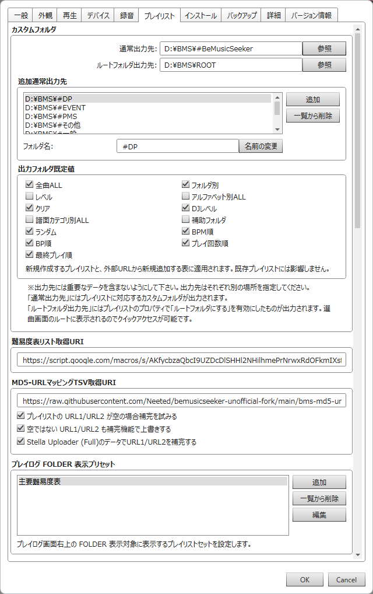

カスタムフォルダの出力先・既定の出力種別、外部表リスト取得 URI、URL 補完、プレイログの表示プリセットを設定します。

- LR2 向けの出力先と種別は [カスタムフォルダ出力](#カスタムフォルダ出力) を参照してください。
- 本体・差分 URL の補完は [URL1/URL2 補完](#url1url2-補完) を参照してください。
- 外部表リストの利用は [外部プレイリストのインポート](#外部プレイリストのインポート) を参照してください。

#### プレイログ FOLDER 表示プリセット

`追加` または `編集` を押し、プリセット名と対象プレイリストを複数選択します。作成したプリセットは、[プレイログの表示対象と FOLDER](#表示対象と-folder) のドロップダウンで使えます。

### インストール

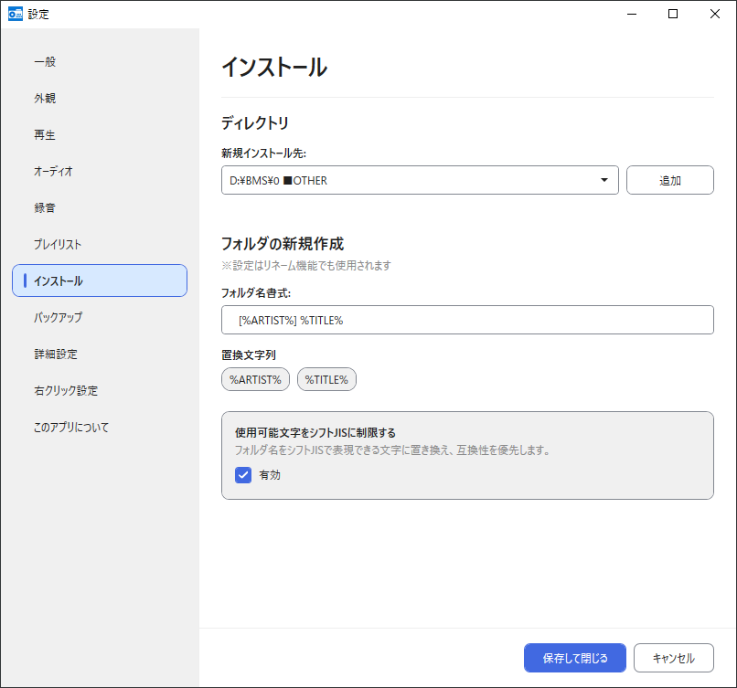

登録済み BMS ディレクトリから新規インストール先を選び、新規フォルダの命名形式を設定します。カスタムフォルダの出力先は候補に表示されません。譜面の導入手順は [インストール / 保留パッケージ](#インストール--保留パッケージ) を参照してください。

`フォルダ名書式` では `%ARTIST%`（アーティスト）と `%TITLE%`（タイトル）を使え、少なくとも一方を含めます。既定は `[%ARTIST%] %TITLE%` です。例えばアーティストが `Artist`、タイトルが `Song` の場合、既定書式で `[Artist] Song` になります。この書式は導入時のフォルダ作成と `フォルダの自動リネーム` に共通で使います。

`使用可能文字をShift_JISに制限する` は既定で ON です。フォルダ名を Shift_JIS で表現できる文字へ置き換え、互換性を優先します。導入時のフォルダ作成と自動リネームの両方に適用されます。

### バックアップ

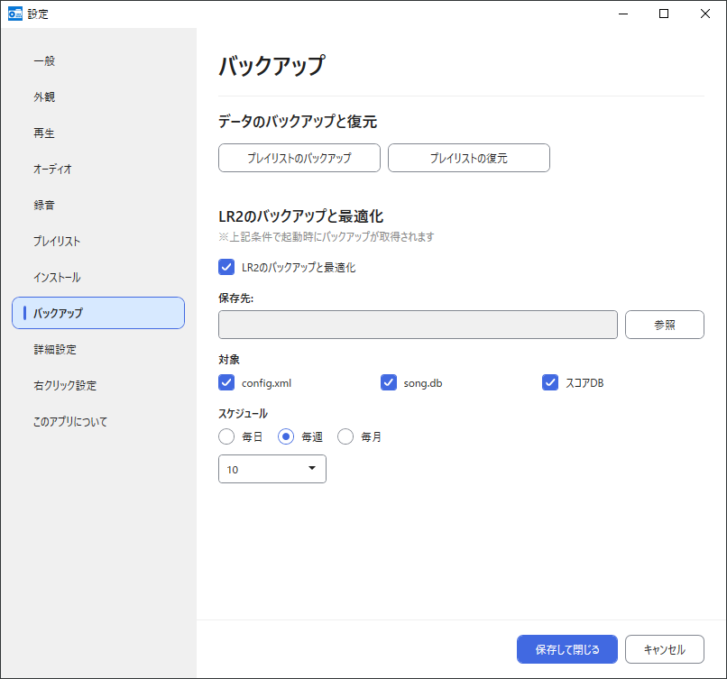

プレイリストのバックアップ / 復元と、LR2 関連ファイルの自動バックアップを設定します。操作、保存先、復元は [バックアップ・アンインストール](#バックアップアンインストール) を参照してください。

### 詳細

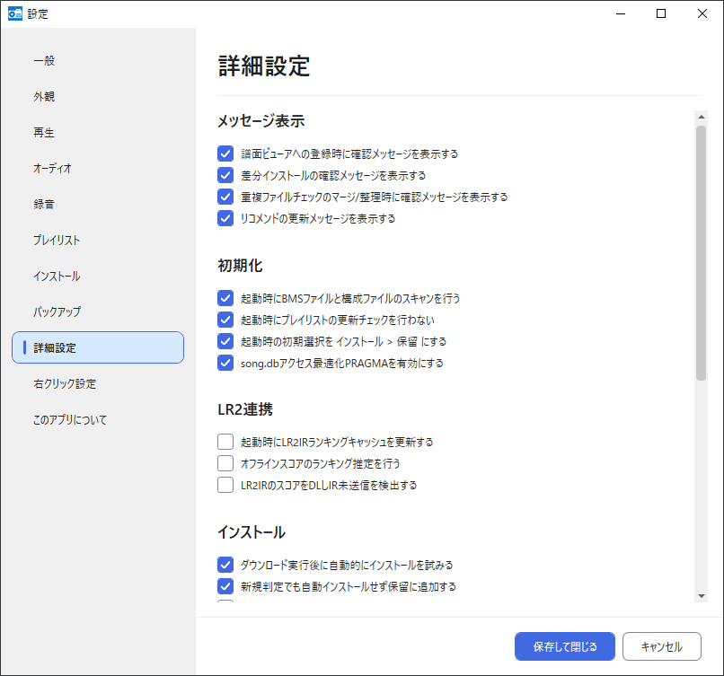

確認メッセージ、初期化、LR2 連携、インストール補助などの詳細設定を変更します。

起動時のスキャンを OFF にした場合は、導入先推定を使う前にライブラリを [リロード](#ライブラリのリロード) してください。

#### 詳細設定の参照表

> [!CAUTION]
> 元パッケージ削除や上書き関連の設定は実ファイルを変更します。移動する元ファイルは OFF でも残らないため、配布物を保持したい場合は事前に控えを作ってください。

| グループ | 設定 | 既定値 | 内容 |
| --- | --- | --- | --- |
| メッセージ表示 | 譜面ビューアへの登録時に確認メッセージを表示する | ON | 譜面ビューア登録操作の前に確認を表示します。 |
| メッセージ表示 | 差分インストールの確認メッセージを表示する | ON | 推定先への差分インストールなど、既存フォルダへ入れる操作の前に確認を表示します。 |
| メッセージ表示 | 新規としてインストールの確認メッセージを表示する | ON | 導入先未設定の保留パッケージを新規として導入する前に確認します。OFFでも、導入先が設定済みの場合の確認は表示します。 |
| メッセージ表示 | 重複ファイルチェックのマージ/整理時に確認メッセージを表示する | ON | 重複ファイルチェックでフォルダをマージする操作と、同一フォルダ内の重複 hash 譜面を整理する操作の前に確認を表示します。 |
| メッセージ表示 | リコメンドの更新メッセージを表示する | ON | リコメンド情報更新時の通知を表示します。 |
| 初期化 | 起動時にBMSファイルと構成ファイルのスキャンを行う | ON | 起動時に所持ファイルの変更を確認します。OFF の場合、導入先推定を使う前にライブラリを手動でリロードしてください。 |
| 初期化 | 起動時にプレイリストの更新チェックを行わない | OFF | 起動時の外部プレイリスト更新確認を省略します。必要な場合は手動でプレイリストをリロードしてください。 |
| 初期化 | 起動時の初期選択を インストール > 保留 にする | ON | 起動後の初期表示を保留パッケージ画面にします。新規導入や保留整理を優先したい場合向けです。 |
| 初期化 | song.dbアクセス最適化PRAGMAを有効にする | ON | DB 読み込みを最適化します。通常は ON のまま使います。 |
| LR2連携 | 起動時にLR2IRランキングキャッシュを更新する | OFF | 起動後に LR2IR ランキング情報を読み込み、`RANKING`、`RANK UPDATE`、`T-SCORE`、`ΔMAX` などの表示用データを更新します。初回構築や LR2ID 変更後は重くなる場合があるため、必要な場合だけ ON にしてください。 |
| LR2連携 | オフラインスコアのランキング推定を行う | OFF | LR2IR ranking cache の適用時に、ローカルスコアが LR2IR 上のスコアより高い譜面の順位を推定します。起動時に反映したい場合は `起動時にLR2IRランキングキャッシュを更新する` も ON にしてください。 |
| LR2連携 | LR2IRのスコアをDLしIR未送信を検出する | OFF | LR2IR のスコア情報を取得し、ローカルスコアとの差分から未送信状態を検出します。 |
| インストール | ダウンロード実行後に自動的にインストールを試みる | OFF | 単体 URL の列クリックで自動取得・導入を試みます。起動時の BMS ファイルスキャンも ON にしてください。多重圧縮などは手動展開が必要です。複数行の URL 取り込みは、この設定に関わらず自動導入を試みます。 |
| インストール | 新規判定でも自動インストールせず保留に追加する | OFF | 新規作品として十分なリソースが揃っていても自動導入せず、必ず保留一覧で確認できるようにします。 |
| インストール | 複数候補が残っても、第1候補のタイトル・アーティストの一致度が高い場合は、その候補をインストール先に設定する | OFF | TITLE / ARTIST が十分に一致する場合は第1候補を自動設定します。複数候補を示す WARNING は残る場合があります。 |
| インストール | 通常インストール時、既所持譜面が残っていても元パッケージを削除する | OFF | 導入後に残った既所持譜面と空の元フォルダを整理します。未所持・判定不能の残存物は削除しません。OFF でも移動済みの元ファイルは残りません。 |
| インストール | 差分インストール時に更新日時とサイズを比較して同梱ファイルの上書きを最適化する | ON | [スマート上書き](#スマート上書き) を有効にします。 |
| インストール | スマート上書き時、*.bmx/*.pmx/*.txt は上書きせず自動採番で保持する | OFF | [スマート上書き](#スマート上書き) で保護対象拡張子を上書きせず、連番名で残します。 |

差分導入や重複マージの同名ファイルの扱いは、[スマート上書き](#スマート上書き) を参照してください。

### 右クリック設定

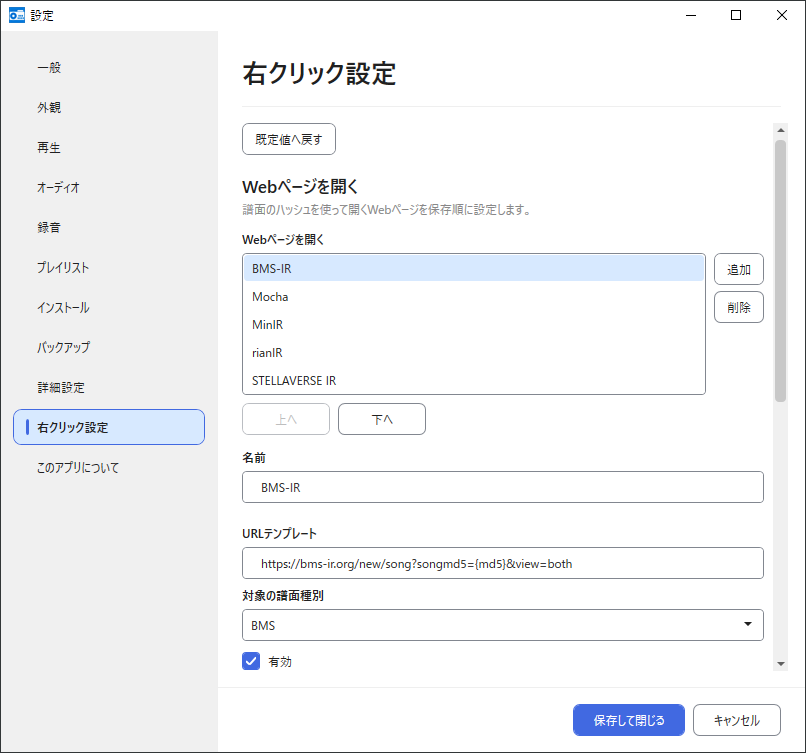

通常一覧、プレイリスト、プレイログで使う `Webページを開く` と `プログラムから開く` を編集します。各一覧で項目を追加・削除し、名前、有効状態、順序を変更できます。

#### Web ページの登録

HTTP/HTTPS の絶対 URL テンプレートと対象形式（BMS、bmson、両方）を指定します。テンプレートには `{md5}` または `{sha256}` を少なくとも1つ含めます。置換記号は大文字・小文字を区別します。必要なハッシュがない行では項目を表示しません。既定は次の6項目で、すべて ON です。

| 順序 | 項目名 | URL テンプレート | 対象 |
| --- | --- | --- | --- |
| 1 | BMS-IR | `https://bms-ir.org/new/song?songmd5={md5}&view=both` | BMS のみ |
| 2 | Mocha | `https://mocha-repository.info/song.php?sha256={sha256}` | BMS / bmson |
| 3 | MinIR | `https://www.gaftalk.com/minir/#/viewer/song/{sha256}/0` | BMS / bmson |
| 4 | rianIR | `https://rianir.link/ranking?sha256={sha256}` | BMS / bmson |
| 5 | STELLAVERSE IR | `https://ir.stellabms.xyz/charts/{md5}` | BMS / bmson |
| 6 | Kaleid IR | `https://kaleidir.com/charts/{sha256}` | BMS / bmson |

#### プログラムの登録

項目名と実行ファイルを指定し、引数に `{filePath}` を含めます。引数の既定は `{filePath}` です。空欄の項目名は実行ファイル選択時にファイル名から補われます。

二重引用符で引数をまとめられます。例: `--file="{filePath}"`。空白のある譜面パスも1引数で渡せます。単一引用符は通常文字で、置換記号は `{filePath}` だけに対応します。作業フォルダは実行ファイルのあるフォルダです。ローカル譜面がある行で使用でき、ハッシュだけの行は Web ページのみ利用できます。

入力欄のエラーを修正してから `保存して閉じる` を押します。無効にした項目も有効な内容が必要です。`キャンセル` または閉じる操作で編集を破棄できます。`既定値へ戻す` は保存後に反映されます。

## 起動・リロード・進捗表示

### 自動アップデート

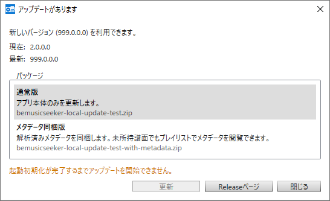

起動時に新しいバージョンが見つかった場合、自動アップデート用のダイアログが表示されます。`更新` を押すと、選択した更新パッケージをダウンロードし、検証後にアプリを終了して updater がファイルを置き換えます。更新が完了するとアプリは自動的に再起動します。

更新パッケージは、通常版と解析済みメタデータ同梱版が表示される場合があります。通常版はアプリ本体のみを更新します。解析済みメタデータ同梱版は、最新版の解析済みメタデータも同梱するため、未所持譜面でもプレイリスト上でメタデータを参照しやすくなります。

初期化やファイル操作の完了を待ってから更新が始まる場合があります。更新が終わるまでアプリを強制終了しないでください。

自動更新に失敗した場合や、手動で内容を確認してから更新したい場合は、`Release Page` を押して GitHub のリリースページを開き、従来どおり zip をダウンロードして上書きできます。

### 進捗表示

起動中はステータスバーで設定・ファイル確認、譜面読み込み、導入先推定の準備などの進捗を確認できます。操作可能になった後も、プレイリスト、スコア、メンテナンス情報などの読み込みが続くことがあります。

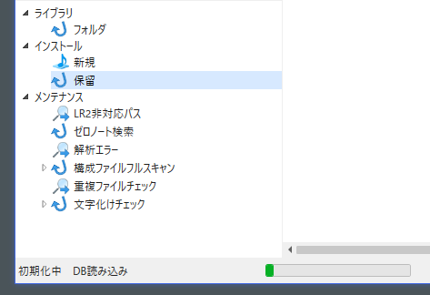

### ライブラリのリロード

ライブラリ右クリックの `リロード` は、所持ファイルの追加・削除・更新を反映する操作です。DB 全体の作り直しやスコア再読み込みではありません。

以下のような場合に使います。

- BMS フォルダへファイルを追加した
- BMS フォルダからファイルを削除した
- BMS ルートフォルダを増減させた
- 外部で BMS フォルダを移動・改名した

登録フォルダを確認できない場合はリロードを中断します。[登録フォルダを利用できない](#登録フォルダを利用できない) を参照してください。

### 初期化再実行

`初期化再実行` は、DB とファイルからライブラリの状態を読み直します。外部ツールで DB を編集した場合などに使います。通常のファイル追加・削除は [ライブラリのリロード](#ライブラリのリロード) で反映してください。

### プレイリストのリロード

プレイリストのリロードは、外部難易度表やプレイリスト定義を再取得する操作です。

プレイリストツリールートのリロードは、外部同期が有効なプレイリストを対象にします。  
プレイリスト単体やサマリー選択範囲からのリロードは、選択したプレイリストを外部同期フラグに関係なく対象にします。

リロード失敗は、プレイリストサマリーの `STATUS` とログに集約されます。

## 画面構成

主画面は、左サイドバーと右側の一覧で構成されています。

左サイドバーには、ライブラリ、プレイリスト、インストール、メンテナンスなどのツリーがあります。右側の一覧は、選択した画面に応じて譜面一覧、プレイリスト詳細、プレイリストサマリー、保留パッケージ、メンテナンス結果を表示します。

列幅、表示/非表示、表示順は画面ごとに保存されます。ヘッダー右クリックから列表示を変更できます。列順や列幅はマウスドラッグで調整できます。

## ライブラリ一覧

ライブラリ一覧では、登録済み譜面を検索・再生・整理できます。

**強力な検索構文を備えています。 [キーワード検索構文ガイド](keyword-search-syntax-guide.ja.md) を参照してください。**
`title:`、`artist:`、`playlist:`、`rate:` などの field 指定や、除外検索、OR、正規表現、数値範囲検索を使えます。`TOTAL`、`DIFFICULTY` などのカラムで背景色が付いているセルは未定義だったことを表しています。`total:undef` などで検索可能です。

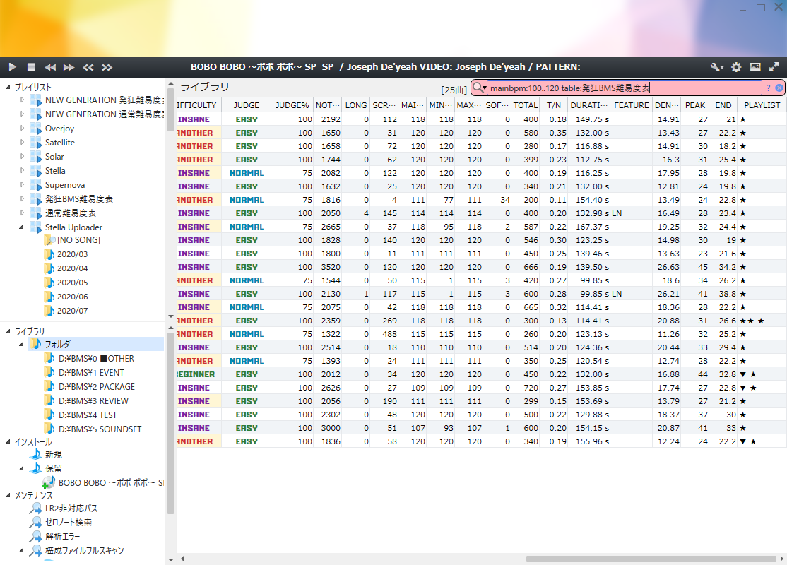

列ヘッダーをクリックするとソートできます。`TITLE`、`ARTIST`、`PATH`、`LEVEL`、`CLEAR` など、多くの列を表示できます。列の表示や順番はヘッダー右クリックメニューから変更できます。

### 行の選択と編集

クリックで1行、`Ctrl + クリック` で個別選択、`Shift + クリック` で範囲選択、`Ctrl + A` で全選択できます。上下キーで移動し、`Shift + ↑ / ↓` で範囲を伸ばせます。編集できるセルでは F2 または文字入力で編集を始めます。URL セルは通常クリックで開き、再クリック・F2・文字入力で URL を編集できます。

### 一覧のコピー操作

ライブラリ、プレイリスト詳細、インストール / 保留などの一覧では、キーボードで表示内容をコピーできます。

- `Ctrl + C`: 現在フォーカスされているセルの表示値をコピーします。URL 列など一部の列では、画面上の短い表示ではなく実際に開く URL がコピーされます。
- `Ctrl + Shift + C`: 選択中の行を TSV 形式でコピーします。複数行を選択している場合は、選択行がまとめてタブ区切りテキストになります。表計算ソフトやテキストエディタへ貼り付けて確認するときに使えます。

### 一覧の右クリックメニュー

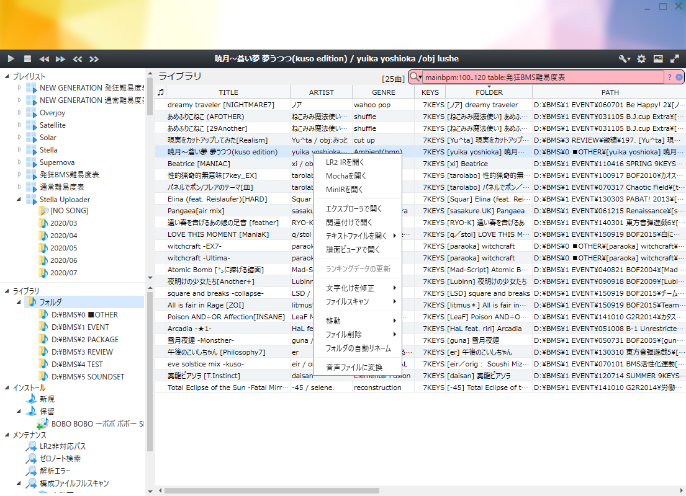

譜面行やプレイリスト行を右クリックすると、選択中の行に対する操作を呼び出せます。表示される項目は、通常ライブラリ、プレイリスト詳細、未所持譜面、保留、新規、メンテナンス画面など、現在の画面と選択行の種類によって変わります。

#### 外部ページ・プログラムで開く

- `Webページを開く`: `設定画面 > 右クリック設定` で設定した有効な項目を、設定した順序で表示します。既定では BMS-IR、Mocha、MinIR、rianIR、STELLAVERSE IR、Kaleid IR が登録され、BMS-IR は BMS のみに対応します。各 URL のテンプレートが必要とする MD5 / SHA-256 がない行では、その項目は表示されません。
- `本体URLを開く` / `差分URLを開く`: プレイリスト由来または URL 補完で得られた本体 URL / 差分 URL を開きます。複数行を選択している場合は `選択中の本体URLを取り込む` / `選択中の差分URLを取り込む` と表示され、確認後に対応ファイルとしてダウンロードできる URL だけを導入処理へ渡します。この一括取り込みではブラウザで開く必要がある URL は開かずにスキップし、進捗はステータスバーに表示されます。
- `外部APIから入手先を探す`: プレイリスト詳細で、選択行の MD5 を外部 API に問い合わせ、本体パッケージの入手先候補を探します。`URL1` / `URL2` を使わないため、URL が空の行でも MD5 があれば対象になります。
- `エクスプローラで開く`: 譜面ファイルのあるフォルダを Explorer で開きます。
- `インストール先を開く`: `INSTL DST` やインストール先として記録されているフォルダを開きます。
- `関連付けで開く`: 譜面ファイルを OS の関連付けで開きます。
- `プログラムから開く`: `設定画面 > 右クリック設定` で登録したプログラムを、ローカルに解決できた譜面へ実行します。hash だけの行や未所持譜面には表示されません。
- `テキストファイルを開く`: 同じフォルダ内の readme などの文書候補をサブメニューから開きます。
- `譜面ビューアで開く`: 譜面ビューアへ登録または表示します。

#### ランキングの更新

- `ランキングデータの更新`: 選択譜面のランキング情報を更新します。起動時の自動更新が OFF でも手動で実行できます。外部キャッシュサービスに依存するため、取得できない場合は [外部サービスから取得できない](#外部サービスから取得できない) を参照してください。

#### 文字コードとファイル状態の確認

- `文字化けを修正`: 日本語 Shift_JIS、UTF-8、韓国語 KS_C_5601、簡体字 GB2312、繁体字 Big5 などから文字コードを指定します。`修正済み` は、現在の推定結果を確認済みとして扱います。
- `ファイルスキャン`: 選択譜面を再スキャンし構成ファイルフルスキャン画面などで確認できる譜面の健康度を再設定します。`全譜面を再スキャン` はライブラリ内の譜面全体を対象にします。`無視リストに追加` / `無視リストから削除` は、構成ファイルフルスキャンなどの表示対象から外すための設定です。

#### インストールと導入先の修正

- `インストール` → `インストール先を推定`: 保留譜面の導入先を推定します。
- `インストール` → `マージ先を推定`: 既所持譜面のみパッケージやリソース寄せ向けに、同梱リソースを評価へ足さない推定を行います。
- `インストール` → `推定先にインストール`: `INSTL DST` に導入します。
- `インストール` → `新規としてインストール`: 推定先を使わず通常の新規インストールとして扱います。
- `インストール` → `インストール先をクリア`: `INSTL DST`、推定先表示、推定 warning、候補を消します。

> [!CAUTION]
> 再インストールでは対象譜面ファイルだけを移動し、同梱リソースや兄弟ファイルは移動しません。必要な音源などが移動先にないと再生できないため、実行前に移動先のリソースを確認してください。

- `インストール先を修正` → `再インストール先を推定` を実行し、推定先を確認してから `推定先に再インストール` で対象譜面をその場所へ移動します。`再インストール先をクリア` で候補を消します。

#### ファイルの移動・削除・変換

> [!CAUTION]
> 実ファイルを移動・削除・改名する操作です。`移動` は未選択の兄弟譜面・音源・画像も含むフォルダ全体を移動します。対象パスを確認し、残したいファイルを控えてから実行してください。最後の譜面を削除すると、確認により同梱ファイルを含むフォルダ全体をごみ箱へ移動する場合があります。

- `移動`: 選択譜面があるフォルダ全体を、指定した別のライブラリルートフォルダへ移動します。
- `エントリー削除`: プレイリスト詳細で、選択行をプレイリストから外します。
- `ファイル削除`: `無効な拡張子に変更(*.bmx/*.pmx)` または `ごみ箱へ移動` を選べます。
- `フォルダの自動リネーム`: 選択譜面のフォルダ名を設定のフォルダ名書式に合わせて変更します。
- `音声ファイルに変換`: 設定画面の録音設定に従い、BMS / bmson の譜面再生結果を音声ファイルとして出力します。

#### 一覧からの除外と解析記録の操作

- `一覧から削除`: 新規 / 保留 / 導入済みパッケージ表示から対象を取り除きます。実ファイル削除を伴う操作とは区別してください。
- `メタデータ解析失敗記録を除去`: 解析エラー画面で表示され、保存済みの解析失敗記録を削除して再パース対象に戻します。

未所持譜面のプレイリスト詳細では、設定した `Webページを開く`、`本体URLを開く`、`差分URLを開く`、`外部APIから入手先を探す`、`譜面ビューアで開く`、`ランキングデータの更新`、`エントリー削除` など、プレイリスト行に対する操作を利用できます。Web ページや外部 API など、ハッシュを使う項目には対応する MD5 / SHA-256 が必要です。本体・差分 URL は有効な URL があれば利用でき、`エントリー削除` にハッシュは不要です。

#### 無効な拡張子に変更

BMS 系譜面を `.bmx`、PMS 系譜面を `.pmx` に変更し、通常譜面として読み込まれないようにします。ゼロノート譜面や誤登録ファイルを除外したい場合に使います。

> [!CAUTION]
> 改名先または連番候補に同一内容のファイルがあれば、元の譜面を重複として削除します。元ファイルを保持したい場合は事前に控えてください。

`ファイル削除` → `無効な拡張子に変更(*.bmx/*.pmx)` を選びます。同名でも内容が異なる場合や同名フォルダがある場合は、`名前(1).bmx` のような空き連番名を使います。処理された譜面はライブラリ一覧または保留パッケージから外れます。

### ツリーの右クリックメニュー

左サイドバーのツリーにも、場所ごとに右クリックメニューがあります。

ライブラリ:

- ライブラリルート: `リロード`、`初期化再実行`、`ルートフォルダを追加` を実行できます。
- ライブラリフォルダ: `リロード`、`初期化再実行`、`エクスプローラで開く`、`ルートフォルダの登録解除`、`フォルダの一括リネーム` を実行できます。
  - `フォルダの一括リネーム` はルートフォルダの規模によってはかなり時間が掛かると思われるので**通常は検索で候補を絞り選択範囲に対しての右クリックメニューから実行することをおすすめします。**

プレイリスト:

- プレイリストルート: `新規作成`、`インポート`、`リロード` を実行できます。インポートには、URL 指定、難易度表リストからの読み込み、発狂 BMS 難度推定表、リコメンド表などがあります。
- プレイリスト本体: `リロード`、`ページを開く`、`レベルを上書き`、`フォルダの新規作成`、`エクスポート`、`プレイリストの削除`、`プロパティ` を実行できます。各項目の詳細は [プレイリスト詳細](#プレイリスト詳細) を参照してください。
- プレイリスト内フォルダ: `削除`、`名前の変更` を実行できます。
- プレイリストサマリー行: `リロード`、`ページを開く`、`現在の並びをBMT SORTに反映`、`BMT SORTの先頭へ`、`BMT SORTの末尾へ`、`一括変更...`、`プロパティ`、`プレイリストの削除` を実行できます。サマリーで複数行を選んだリロードは、選択したプレイリストを外部同期フラグに関係なく対象にします。

インストール:

- `新規` ルート: `全てクリア` で新規パッケージ表示を空にします。
- `保留` ルート: `全てクリア` と `高度な機能` を実行できます。高度な機能については [高度な機能](#高度な機能) を参照してください。
- 保留パッケージ: `エクスプローラで開く`、`インストール先を開く`、`インストール` サブメニュー、`一覧から削除` を実行できます。`インストール` サブメニューには、`インストール先を推定`、`マージ先を推定`、`推定先にインストール`、`新規としてインストール`、`インストール先をクリア` があります。
- 導入済みパッケージ: `エクスプローラで開く`、`一覧から削除` を実行できます。

メンテナンス:

- `ゼロノート検索`: `ゼロノート記述確認` を実行できます。
- `重複ファイルチェック` のフォルダ: `エクスプローラで開く`、`マージ先` を実行できます。重複フォルダマージについては [重複フォルダをマージする](#重複フォルダをマージする) を参照してください。

列ヘッダーの右クリックメニューでは、表示する列を切り替えたり、列設定を初期値へ戻したりできます。プレイリストサマリーにも専用の列表示メニューと列設定初期化があります。

### その他のポップアップメニュー

右クリックではありませんが、画面上部のボタンから開くメニューもあります。

- 再生コントロールのメニュー: [再生パネルの操作](#再生パネルの操作) を参照してください。
- モードフィルタ: `5KEYS`、`7KEYS`、`9KEYS`、`10KEYS`、`14KEYS` の表示対象を切り替えます。
- プレイリストサマリーの所持率フィルタ: `All`、`OWNED=100%`、`OWNED<100%` を切り替えます。

## 検索

### キーワードと検索条件

右上の検索ボックスに文字を入力すると、一覧を絞り込めます。

通常検索では、大文字・小文字を区別せず、複数語は AND 検索になります。

```text
alpha artist
```

より細かく探す場合は、field 指定を使います。

```text
title:Satellite
artist:xi
level:12
rate:>=80
playlist:"Satellite Sub"
```

### 補完・履歴・お気に入り

検索欄の候補から検索項目、プレイリスト名、値を選べます。上下キーで候補を選び、Enter または Tab で適用します。検索履歴は最近20件を保存します。履歴行のボタンでお気に入りへ追加または削除でき、お気に入りは件数制限なく保存できます。

詳しい構文は [キーワード検索構文ガイド](keyword-search-syntax-guide.ja.md) を参照してください。

## 再生・録音

### 譜面を再生する

一覧で譜面をダブルクリック、または Enter を押すと再生します。使用するプレイヤーは [再生設定](#再生) で選びます。内蔵プレイヤーは BMS / bmson の音声プレビュー用です。bmson は `1.0.0` と旧 `0.21` に対応します。BGA、空打ち音、地雷音はプレビュー対象外です。ノート進行表示はプレビュー用で、ゲームの採点値と一致するとは限りません。

外部プレイヤーを使う場合は対応する実行ファイルを指定してください。bmson を外部アプリで開く場合は、`関連付けで開く` などから対応アプリを使います。

### 再生パネルの操作

再生パネルのボタンで、再生 / 一時停止、停止、前曲 / 次曲、押している間の巻き戻し / 早送りを操作できます。位置スライダーをクリックまたはドラッグするとシークします。パネル右側のボタンで大きさや画像 / プレイヤー表示を切り替えられます。利用できる操作は選択したプレイヤーによって異なります。

パネルのメニューには音量、`HS UP` / `HS DOWN`、`Info`、`Effect`、`1P/2P` があります。対応プレイヤーでハイスピード、情報表示、エフェクト、プレイサイドを変更できます。

| 再生モード | 動作 |
| --- | --- |
| REPEAT | 一覧の末尾から先頭へ戻って再生します。SINGLE PLAY と併用すると同じ譜面を繰り返します。 |
| FOLDER SKIP | 曲送りの際、同じ実フォルダ内で隣接して並んだ譜面を飛ばします。同じ作品の別譜面を続けて聴かずに進めたい場合に使います。 |
| SINGLE PLAY | 譜面の再生終了で停止します。手動の前曲 / 次曲送りは利用できます。 |

通常は一覧の順番で次の再生可能な譜面へ進みます。検索とソートで聴きたい対象・順番を調整できます。

### 音声ファイルに変換する

選択した所持譜面の音声を、再生を待たずにファイルへ出力できます。BMS / bmson と、その譜面が参照する音源が必要です。

1. [録音](#録音) で保存形式、品質、音量、出力ファイル名を設定し、`保存して閉じる` で保存します。
2. 一覧で変換する譜面を選択します。複数行をまとめて選択できます。
3. 右クリックして `音声ファイルに変換` を選び、出力フォルダを指定します。
4. 通常再生が停止し、選択順に変換が始まります。進捗表示からキャンセルできます。
5. 完了時の成功・失敗・未処理件数を確認し、出力先でファイルを確認します。

音源を省略した場合は完了通知に警告が表示されます。失敗時は [音声の再生・変換に失敗する](#音声の再生変換に失敗する) を参照してください。

## プレイリスト

BeMusicSeeker では、導入済みの難易度表や独自プレイリストを `プレイリスト` として管理できます。プレイリストには、全体の所持状況を一覧するサマリー表示と、各譜面を確認する詳細表示があります。

### プレイリストサマリー

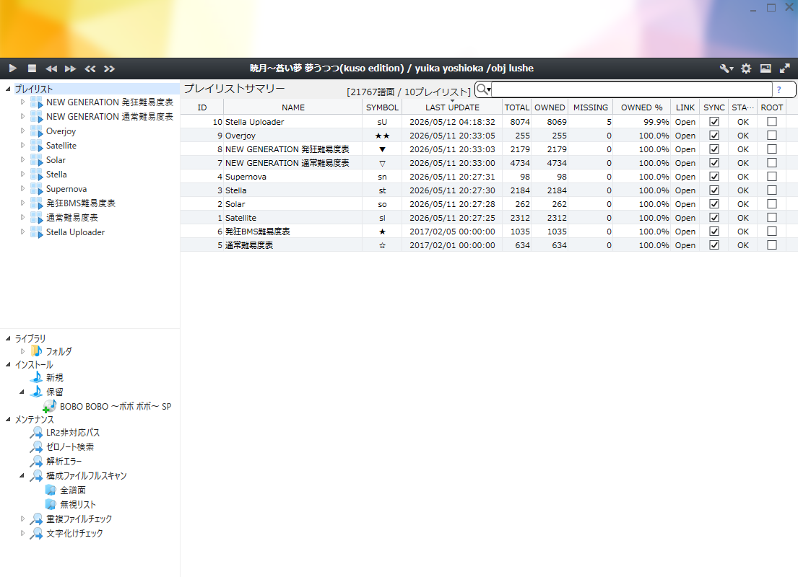

プレイリストサマリーでは、各プレイリストの譜面数、所持数、未所持数、所持率、外部同期の状態、beatoraja `.bmt` 出力設定を一覧できます。`NAME`、`PREFIX`、`SYMBOL` はセルをクリックして編集でき、既定では非表示の `FOLDER NAME` 列を表示すると、プレイリストプロパティの「フォルダ名」を一覧から編集できます。フォルダ名が未設定の場合はプレイリスト名由来のフォルダ名を表示し、未定義メタデータと同じ背景色で示します。既定では非表示の `HEADER`、`DATA` 列を表示すると、相対 URI も解決したヘッダ URI とデータ URI を開けます。

右上の検索欄から、所持率フィルタ: `All`、`OWNED=100%`、`OWNED<100%` を切り替えることができます。

未所持譜面が増えた表を見つけたら、**行をダブルクリックすると対象のプレイリスト詳細へ移動できます。**

`STATUS` 列には、起動後またはリロード時に行われた外部プレイリスト同期の結果が表示されます。リンク切れ、ヘッダ取得失敗、データ取得失敗などはここで確認できます。詳細はツールチップに表示されます。

#### BMT SORT

`BMT SORT` は、BeMusicSeeker 管理 `.bmt` URL を `config_sys.json` の `tableURL` に登録する順番です。行のドラッグアンドドロップによる順番入れ替えは、**プレイリストサマリーを `BMT SORT` 昇順で表示している場合のみ**行えます。フィルター中に入れ替えた場合、画面に表示されていない行は元の相対位置を保持します。降順表示や他の列でソートしている場合はドラッグによる `BMT SORT` 入れ替えはできません。右クリックメニューの `現在の並びをBMT SORTに反映`、`BMT SORTの先頭へ`、`BMT SORTの末尾へ` でも順番を調整できます。

`BMT OUTPUT` は、そのプレイリストを `.bmt` 出力対象にするかどうかを表します。出力を止める前に [ハッシュ出力と出力の停止](#ハッシュ出力と出力の停止) の注意を確認してください。

#### 一括変更...

複数行を選択して右クリックメニューの `一括変更...` を開くと、選択行に対してカスタムフォルダ出力種別、`OUTPUT`、ルートフォルダ、外部同期、`.bmt` 出力、外部データでの初期化をまとめて操作できます。ダイアログ全体の OK はなく、各セクションの適用ボタンを押した項目だけが変更されます。

`OUTPUT` は通常出力先または追加通常出力先の選択です。`ルートフォルダにする` が ON のプレイリストでも保存値は更新されますが、実際の出力先はルートフォルダ出力先が優先されます。

カスタムフォルダ出力種別は、チェックありが出力、チェックなしが非出力、中間状態が変更なしです。カスタムフォルダ出力種別の一括適用中はステータスバーに進捗が表示され、`.bmt` は再生成されません。

外部同期を ON にした場合、有効な URL 情報が不足しているプレイリストは適用対象から除外され、結果が通知されます。

外部データでの初期化では、外部同期フラグに関係なく外部 URL を読み込み、チェックした項目だけを初期値へ戻します。外部 URL が読めないプレイリストはスキップされます。適用中は外部データ取得、保存、カスタムフォルダ出力の進捗がステータスバーに表示されます。

- プレイリスト名: 外部データの表名で初期化します。
- 記号: 外部データの symbol で初期化します。
- フォルダ接頭辞: 外部データから推定したフォルダ接頭辞で初期化します。
- フォルダ名: 保存したフォルダ名を空にし、プレイリスト名からファイル名に使えない文字を正規化して生成されます。

### プレイリスト詳細

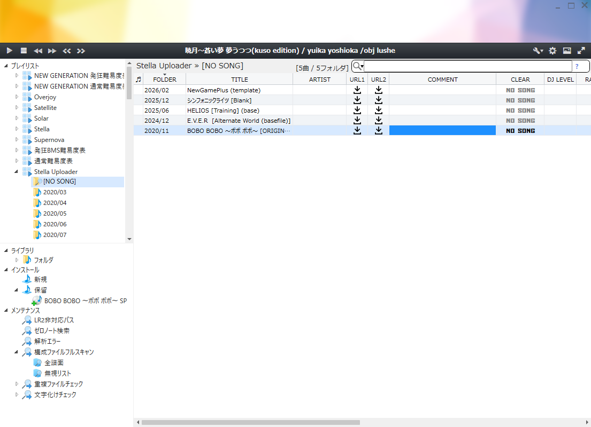

プレイリストに含まれる所持済み・未所持の譜面を確認できます。未所持譜面は `[NO SONG]` と表示されます。譜面の再生や外部ページを開く操作は [一覧の右クリックメニュー](#一覧の右クリックメニュー)、入手は [本体・差分のダウンロード](#本体差分のダウンロード) を参照してください。

#### プレイリストの操作とエクスポート

> [!CAUTION]
> `レベルを上書き` はライブラリの保存値を変更します。プレイリストの削除は関連するカスタムフォルダ出力も削除します。必要なデータを [バックアップ](#プレイリストのバックアップと復元) してから実行してください。

プレイリスト本体を右クリックすると、次の操作を使えます。

- `リロード`: 選択したプレイリストを、外部同期設定に関わらず再取得します。
- `ページを開く`: ページ URI をブラウザで開きます。
- `レベルを上書き`: 表のレベルをローカルライブラリの同一譜面へ反映します。譜面実ファイルは変更しません。リコメンド表など一部の表では使えません。
- `フォルダの新規作成`: 外部同期ではないプレイリストに手動管理用のフォルダを追加します。
- `エクスポート`: `header.json` と `data.json` の2ファイルを、それぞれ指定した保存先へ出力します。
- `プレイリストの削除`: 管理対象から削除します。
- `プロパティ`: [名前、URI、フォルダ出力など](#プレイリストのプロパティ) を編集します。

#### ローカルプレイリストの作成と編集

プレイリストツリーのルートを右クリックして `新規作成` を選びます。外部同期が OFF のプレイリストには、一覧の譜面行をプレイリスト本体またはフォルダへドラッグして追加できます。プレイログからも所持譜面に対応する行を追加できます。

詳細一覧ではレベル、フォルダ、URL1 / URL2、コメントなどを編集できます。譜面を別フォルダへドラッグすると同じプレイリスト内で移動します。フォルダ型プレイリストのルートへ追加すると適切なフォルダが選ばれ、必要なら新しいフォルダが作られます。行の `エントリー削除` はプレイリストから外す操作です。

### 本体・差分のダウンロード

`URL1` / `URL2` 列から本体・差分 URL を開けます。空の URL は [URL 補完](#url1url2-補完) で補える場合があります。単体 URL の列クリックで自動取得・導入を使うには、`詳細設定` の `ダウンロード実行後に自動的にインストールを試みる` と `起動時にBMSファイルと構成ファイルのスキャンを行う` を両方 ON にします。どちらかが OFF の場合はブラウザで開きます。単体行の右クリックメニュー `本体URLを開く` / `差分URLを開く` はブラウザで開きます。

#### 複数 URL の取り込み

複数行を選択し、右クリックの `選択中の本体URLを取り込む` / `選択中の差分URLを取り込む` を選びます。確認後、同一 URL を除いて順にダウンロードし、自動導入を試みます。この操作は単体ダウンロードの自動導入設定に関わらず実行します。進捗表示からキャンセルでき、キャンセルまでに取得したファイルは導入対象になります。完了時に取得、スキップ、サイズ上限超過、失敗、未処理の件数を確認できます。

対応譜面は `.bme`、`.bms`、`.bml`、`.pms`、`.bmson`、アーカイブは `.zip`、`.7z`、`.rar`、`.lzh` です。自動ダウンロードは1ファイル `512 MiB` までです。直リンクのほか、Google Drive、Dropbox、OneDrive、MediaFire、manbow、`venue.bmssearch.net`、`bmssearch.net/bmses` の一部配布ページに対応します。Google Drive のフォルダ共有、MEGA、AXFC、ログイン・CAPTCHA・JavaScript 操作が必要なページなどは一括取り込みではスキップします。これらはブラウザで取得し、[ドラッグアンドドロップで導入](#導入の手順) してください。

ダウンロードと解凍に使う保存場所は [ダウンロード用の一時領域](#ダウンロード済みファイルや解凍用一時ファイルはどこに置かれますか) を参照してください。

#### 外部 API から入手先を探す

> [!CAUTION]
> 外部 API への問い合わせでは選択譜面の MD5 を送信します。候補は正規配布元とは限らず、再配布が許諾されていない可能性があります。できるだけ作者の正規配布元を探し、毎回表示される確認を読んでから実行してください。

`外部APIから入手先を探す` は、MD5 がある所持・未所持譜面の本体パッケージ候補を取得します。URL1 / URL2 が空でも使えます。ダウンロード可能な候補を取得して導入を試み、既所持譜面を含む場合は必要に応じて保留画面からマージします。

### プレイリスト・ランプビューア

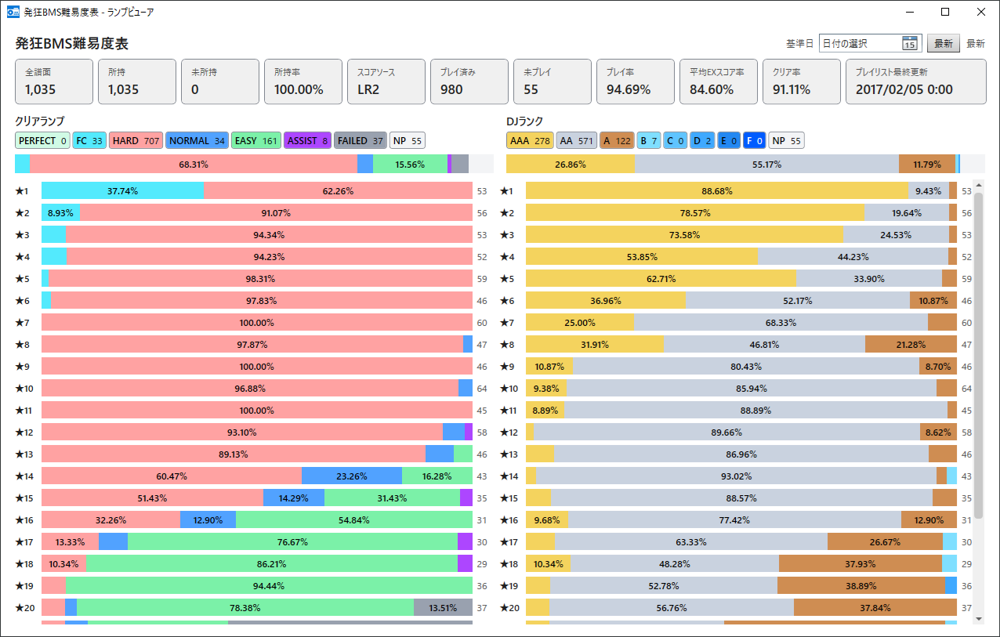

#### 開き方

プレイリストツリーの項目またはプレイリストサマリーの 1 行を右クリックし `ランプビューアを開く` を選びます。同じプレイリストでも選ぶたびに新しいウィンドウが作られるため、複数のビューアを独立して開いておけます。メインウィンドウを閉じるとビューアもすべて閉じます。

#### 画面構成

上部には全譜面、所持、未所持、所持率、使用中のスコアソース、プレイリスト最終更新のカードを表示します。プレイ済み、未プレイ、プレイ率、平均 EX スコア率、全体クリア率のカードも表示します。

グラフは左半分がクリアランプ、右半分が DJレベルです。各通常フォルダはプレイリストの順番に 1 行ずつ並び、左右それぞれを `フォルダ名 | 100% 積み上げバー | 譜面数` の順で表示します。フォルダが多い場合も 1 つのスクロール領域で確認できます。空の通常フォルダも譜面数 0 の行として表示されます。

クリアの順序は `MAX`、`PERFECT`、`FC`、`EXHARD`、`HARD`、`NORMAL`、`EASY`、`ASSIST`、`FAILED`、`NP` です。LR2 のスコアソースではビューア全体から `MAX` と `EXHARD` を省略します。DJレベルの順序は `AAA`、`AA`、`A`、`B`、`C`、`D`、`E`、`F`、`NP` で、値 `MAX` は `AAA` にまとめます。`ASSIST` には `INVALID` と `L_ASSIST` を含めます。未所持の譜面は `所持` と `未所持` のカードで確認でき、未プレイの譜面は `NP` として数えます。

> [!NOTE]
> LR2 でスコアを保存しないオプションを使ってプレイすると、EASY のクリアランプが残っていても、EASY ゲージでのクリア履歴が残らないことがあります。この場合、BeMusicSeeker はその記録をビューア上で `ASSIST` として扱います。

平均 EX スコア率はプレイ済み譜面の算術平均です。全体クリア率は `ASSIST` 以上の譜面数 ÷ 全譜面数です。空の分母は `0%` ではなく翻訳済みの「利用不可」と表示します。

スコアを利用できない場合は所持状況などだけを表示します。[ランプビューアのスコアが利用できない](#ランプビューアのスコアが利用できない) を参照してください。

譜面数が 1 以上の区分にはラベルと件数が表示されます。区分はマウスでクリックでき、フォーカスがあるときは Enter または Space でも選べます。ツールチップにはラベル、件数、割合が表示され、非常に小さい割合は 0% ではなく下限を示す表記になります。選択中の区分は色に加えて枠線や文字でも確認できます。フォルダの区分を選ぶと、メイン画面で対象プレイリストの同じ通常フォルダを開き、その区分のフィルターで一覧を絞り込みます。上部の全体区分を選ぶと、プレイリストのルートを開き、通常フォルダ全体を対象にフィルターします。現在のキーワード検索は選んだ区分の条件に置き換わります。

#### 過去のクリア状況の再現

ヘッダーの `基準日` で日付を選ぶと、その日の終わりまでのクリア状況をカードとグラフで確認できます。現在のスコアへ戻す場合は `最新` を選びます。

使用中のスコアソースに履歴がある場合、最古の履歴日から今日まで選べます。日付の区切りはシステムのローカル時刻です。プレイリストの所属、所持状況、フォルダ、最終更新は現在の情報を使います。基準日はビューアごとに選択し、次回には保存されません。

履歴スコアを利用できない場合は [ランプビューアのスコアが利用できない](#ランプビューアのスコアが利用できない) を参照してください。

### beatoraja の難易度表管理

BeMusicSeeker で難易度表を更新し、beatoraja に `.bmt` キャッシュを出力できます。設定画面の `一般` で beatoraja ディレクトリを指定します。直下の `config_sys.json` と `beatoraja.jar` または `beatoraja.exe` が必要です。出力先は `config_sys.json` の `tablepath` です。

#### Table URL の取り込みと出力

1. `beatoraja の Table URL をインポートする` を押し、beatoraja に登録済みの難易度表を取り込みます。同一 URL の既存表はそのまま使い、取得できない新規表は beatoraja の `.bmt` キャッシュからの復元を試みます。
2. `.bmtを出力する(難易度表読み込み互換処理)` を ON にします。
3. 出力したいプレイリストの `BMT OUTPUT` を ON にし、[BMT SORT](#bmt-sort) で順番を調整します。Table URL のインポート時は beatoraja の並びを先頭へ反映し、BeMusicSeeker にのみある表は末尾に並びます。
4. `config_sys.jsonに.bmtのURLを登録する(選曲画面での並びが安定します)` を ON にすると、管理対象の URL が BMT SORT 順で登録されます。管理外の URL は現在の順番を保ちます。

beatoraja 側で同じ表を別途ダウンロード・更新する必要を減らせます。

#### ハッシュ出力と出力の停止

| .bmt hash 出力 | 内容 |
| --- | --- |
| オリジナル（既定） | プレイリストにある MD5 / SHA-256 を使います。 |
| md5/sha256をできるだけ補完 | 所持譜面などから分かる不足ハッシュを補います。 |
| できるだけsha256のみ | 解決できる譜面は SHA-256 のみにし、解決できない譜面は MD5 を残します。 |

段位コースのハッシュは元データを使います。この設定は次回の対象表の再出力で反映されます。

> [!CAUTION]
> `BMT OUTPUT` を OFF にした表の管理対象 `.bmt` と登録 URL は、次回出力時に削除されます。全体の出力を OFF にする際、既存出力を残したい場合は先に `.bmt出力を無効化しても既存ファイルを削除しない` を ON にしてください。

既存ファイルを残す設定で全体出力を OFF にすると、自動再出力だけを止め、既存 `.bmt` と登録 URL を引き続き使えます。

### 外部プレイリストのインポート

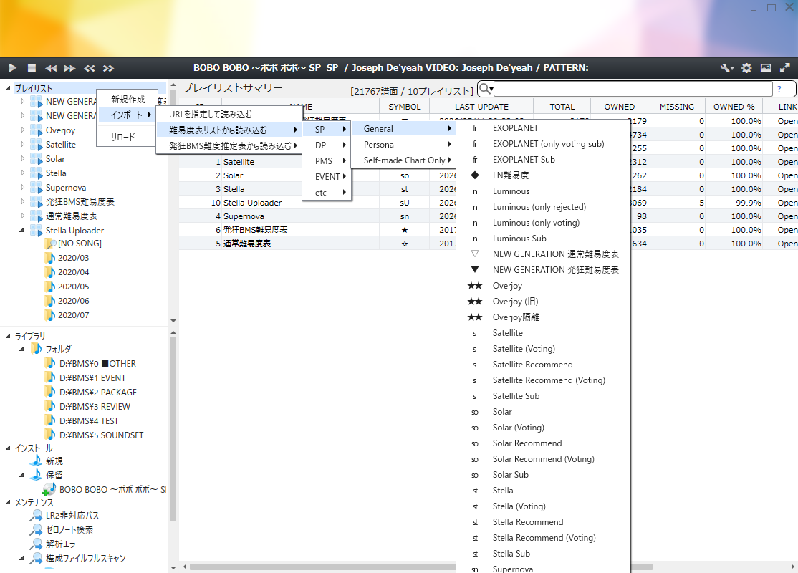

プレイリストツリーのルートを右クリックし、`インポート` から外部プレイリストを追加できます。登録済みの外部表リストから選ぶほか、URI を指定して読み込むこともできます。

既定の難易度表リスト取得URIは [DARKSABUN](https://darksabun.club/table/tablelist.html) が管理しているものです。

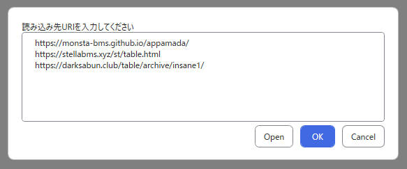

外部表リストやリコメンド表などのインポートメニューは、**項目を 1 つクリックしてもメニューが閉じないため、複数の表を続けて選択してインポートできます。**

`URLを指定して読み込む` では、読み込み先 URI を複数行で入力できます。複数の難易度表 URL をまとめて貼り付けると、行ごとに読み込み対象として扱われ、外部取得と登録後処理はまとめて実行されます。同じ名前のプレイリストが既に存在する場合はその URL の登録をスキップし、処理完了後の結果ダイアログで件数と対象名を確認できます。

外部同期プレイリストは、元の難易度表を再取得して更新できます。インポート後はプレイリストサマリーの `STATUS` 列で同期結果を確認してください。

### プレイリストのプロパティ

プレイリストを右クリックして `プロパティ` を開くと、プレイリスト名、表示記号、外部同期設定、ページ URI、ヘッダ URI、データ URI を確認・編集できます。

プレイリスト名やフォルダ設定などのプロパティは、スタンドアローンモードでもアプリ内 DB に保存されます。LR2 連携モードでのみ、保存後に LR2 用カスタムフォルダ出力も更新されます。

> [!NOTE]
> フォルダ接頭辞はローカル設定として保存されます。外部同期プレイリストでも、プロパティやプレイリストサマリーで変更したフォルダ接頭辞は、通常のリロードでは外部データの値に戻りません。外部データの初期値へ戻したい場合は、プレイリストサマリーの `一括変更...` から `外部データで初期化` を実行してください。

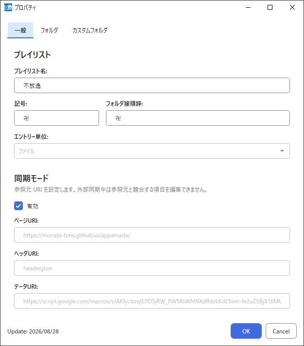

`フォルダ` カテゴリでは、フォルダ内ソートのキーと昇順 / 降順、フォルダの並び順を設定できます。外部同期プレイリストでは、同期元と衝突する項目の編集が制限されます。

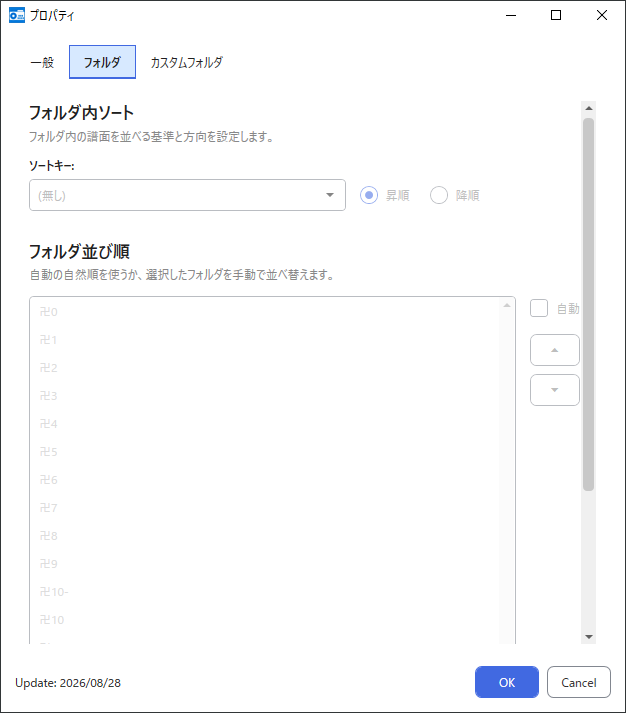

`カスタムフォルダ` カテゴリでは、出力するフォルダ種別、`OUTPUT`、出力名を設定できます。変更は `OK` で保存します。

エントリー単位をフォルダにすると、レベル別出力と、レベル・追加日時によるソートは使えません。

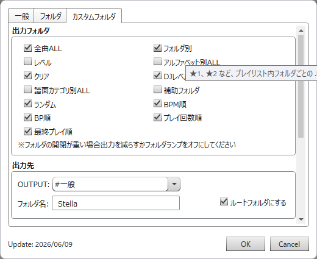

### カスタムフォルダ出力

LR2 連携モードでは、プレイリストを LR2 のカスタムフォルダとして出力できます。LR2 のカスタムフォルダは、SQL 条件で曲の集合を作り、実ファイルを移動せずに仮想的なフォルダとして選曲画面へ表示する機能です。

BeMusicSeeker では、難易度表やローカルプレイリストをこの形式で出力します。難易度表の `★1`、`★2` のようなフォルダを LR2 上で選ぶ、未プレイだけを探す、よく使う表を選曲画面のルートに置く、といった使い方を想定しています。

> [!CAUTION]
> カスタムフォルダ出力には専用のフォルダを用意し、重要なデータを入れないでください。出力更新で不要なファイルを削除し、出力先の変更やプレイリスト削除では古いプレイリスト出力フォルダを丸ごと削除します。手作業のカスタムフォルダなどを同居させないでください。

#### 設定の流れ

1. 設定画面の `プレイリスト` カテゴリで、`通常出力先`、必要に応じて `追加通常出力先` と `ルートフォルダ出力先` を指定します。新規プレイリストや外部 URL から追加する表の初期状態を変えたい場合は、`出力フォルダ既定値` も設定します。
2. プレイリストの `プロパティ` から、`OUTPUT`、出力名、`ルートフォルダにする`、出力するフォルダ種別を設定します。
3. 複数プレイリストをまとめて変更する場合は、プレイリストサマリーの `一括変更...` から `OUTPUT`、出力種別、`ルートフォルダにする` を選択行へ一括適用します。

`OUTPUT` は設定画面の `通常出力先` または `追加通常出力先` から選びます。`ルートフォルダにする` が ON の間も `OUTPUT` の保存値は保持されますが、実際の出力先は `ルートフォルダ出力先` です。ルートフォルダ設定を OFF にすると、保存されていた `OUTPUT` の出力先へ戻ります。

> [!IMPORTANT]
> LR2 用カスタムフォルダの出力は LR2 連携モードの機能です。スタンドアローンモードでもプレイリスト名やフォルダ設定はアプリ内 DB に保存されますが、LR2 用の `.lr2folder` 出力は更新されません。

#### 出力先の使い分け

設定画面の `プレイリスト` カテゴリで次の場所を指定します。

| 出力先 | 用途 | 登録上の条件 |
| --- | --- | --- |
| 通常出力先 | 既定の置き場です。 | 既存 BMS ルートと同じ場所は確認後に採用できますが、親・子フォルダは指定できません。 |
| 追加通常出力先 | 主要表、差分作家表、個人表などを分けて置けます。フォルダ名で OUTPUT に表示します。 | 既存 BMS ルートと同じ場所は確認後に採用できますが、親・子フォルダは指定できません。 |
| ルートフォルダ出力先 | `ルートフォルダにする` が ON の表を LR2 選曲画面のルートへ表示します。 | 既存 BMS ルートと同じ場所、または既存登録を含む親フォルダは確認後に採用できます。子フォルダは指定できません。 |

出力先同士を同一・親子関係にはできません。以前の出力先が LR2 に登録されたままでも、上記条件で再設定できます。採用時には楽曲検索対象から外れる場所も確認に表示します。

通常出力先は楽曲検索にも含まれますが、追加・ルート出力先は含まれません。いずれも BMS ディレクトリ一覧、新規インストール先候補、ライブラリのフォルダツリーには表示されません。通常出力先を変更すると古い場所は楽曲検索対象から外れ、別の出力先として使わなければ LR2 の登録からも外れます。追加出力先を削除すると、そこで出力していた表は通常出力先に戻ります。

`出力フォルダ既定値` は、これから新規作成・インポートするプレイリストの出力種別を決めます。既存の表はプロパティまたは [一括変更](#一括変更) で変更します。

#### 出力するフォルダ種別

`カスタムフォルダ` カテゴリのチェックボックスで、プレイリストごとにどのフォルダを出力するかを選びます。

| 項目 | 出力内容と使い方 |
|---|---|
| `全曲ALL` | プレイリスト全体の譜面を集めた `ALL` フォルダを出力します。表全体をまとめて開きたい場合や、クリア状態・DJレベル・各種並び順をプレイリスト全体で見たい場合に使います。 |
| `フォルダ別` | プレイリスト内フォルダ別の `.lr2folder` を出力します。`★1`、`★2` のように難易度表の記号 + 数値で分かれたフォルダを、表の構成どおりに選びたい場合の基本設定です。フォルダ内の並び順はプレイリストプロパティの `フォルダ` カテゴリで設定します。 |
| `レベル` | `LEVEL 1`、`LEVEL 2` のように、数値レベル別のフォルダを出力します。表の記号に関係なく、数値レベルでまとめて探したい場合に使います。レベルがない譜面が含まれる場合は `LEVEL ???` も出力されます。 |
| `アルファベット別ALL` | 曲名の先頭文字を `A.B.C.D.` などの範囲に分け、プレイリスト全体を対象にした ALL フォルダを出力します。曲名から探したい場合に使います。英字範囲に入らない曲は `OTHERS` に入ります。 |
| `クリア` | クリア状態別のフォルダを出力します。`0 NO PLAY` から `7 P.A` までの番号付きフォルダ名にしているため、LR2 の TITLE 順表示でも状態順に並びます。出力範囲は `全曲ALL` と `フォルダ別` の選択に従います。 |
| `DJレベル` | `AAA`、`AA`、`A`、`UNDER A` に分けたフォルダを出力します。スコア詰めの対象を探すときに使います。出力範囲は `全曲ALL` と `フォルダ別` の選択に従います。 |
| `譜面カテゴリ別ALL` | `ALL LONG NOTES`、`ALL VERY HARD JUDGES`、`ALL HARD JUDGES`、`ALL NORMAL JUDGES`、`ALL EASY JUDGES` など、カテゴリ条件に一致する譜面を集めた ALL フォルダを出力します。LN や判定難易度の観点でまとめて探したい場合に使います。 |
| `補助フォルダ` | `MY BEST`、`NEW SONGS`、`REMOVED SONGS` などの補助的なフォルダを出力します。LR2IR スコア取得と未送信検出が有効な場合は `UNSENT SONGS` も出力されます。 |
| `ランダム` | 単独のフォルダ種別ではなく、`全曲ALL`、`フォルダ別`、`レベル`、`クリア`、`DJレベル` に `#MAXTRACKS 1` の RANDOM 版を追加します。同じ場所に出る通常版と RANDOM 版は、通常版が先、RANDOM 版が後ろにまとまる順番で出力されます。 |
| `BPM順` | BPM 昇順で並べたフォルダを出力します。BPM から練習対象を選びたい場合に使います。出力範囲は `全曲ALL` と `フォルダ別` の選択に従います。 |
| `BP順` | BP が少ない順に並べたフォルダを出力します。BP 詰めの優先順を見たい場合に使います。出力範囲は `全曲ALL` と `フォルダ別` の選択に従います。 |
| `プレイ回数順` | プレイ回数が多い順に並べたフォルダを出力します。よく触っている譜面を確認したい場合に使います。出力範囲は `全曲ALL` と `フォルダ別` の選択に従います。 |
| `最終プレイ順` | プレイログを使い、最後にプレイした日時の新しい順に並べたフォルダを出力します。最近触った譜面へ戻りたい場合に使います。出力範囲は `全曲ALL` と `フォルダ別` の選択に従います。 |

`全曲ALL` はプレイリスト全体の出力範囲、`フォルダ別` はプレイリスト内フォルダごとの出力範囲を追加します。`クリア`、`DJレベル`、`BPM順`、`BP順`、`プレイ回数順`、`最終プレイ順` は、この 2 つの範囲設定に従って `.lr2folder` を出力します。

> [!NOTE]
> `クリア` の `2 ASSIST` は、アシスト系オプションを使って EASY クリアランプが付いた譜面を分けるためのフォルダです。この状態では LR2 上のクリアランプは EASY 相当になりますが、EASY ゲージでクリアした履歴は残らないため、`3 EASY` とは別に検出しています。

> [!NOTE]
> LR2 / OpenLR2 はカスタムフォルダを開くときに DB を参照します。クリア状態、DJレベル、BP、プレイ回数などは、曲をプレイした後に `.lr2folder` を再出力しなくても、DB が更新されていれば反映されます。

> [!IMPORTANT]
> `最終プレイ順` を LR2 / OpenLR2 で使うには、先に [LR2プレイログ](#lr2プレイログ) を導入してください。

> [!TIP]
> 出力する `.lr2folder` の数が増えると LR2 側の表示や DB 参照が重くなる場合があります。最初は `全曲ALL`、`フォルダ別` と必要な数種類だけを有効にし、使わない分類は OFF にしておくと管理しやすくなります。

### URL1/URL2 補完

プレイリストの `URL1` / `URL2` が空の場合、または既知のリンク切れサイトを指している場合、MD5 をもとに外部 TSV や Stella Uploader 由来の情報から URL を補完できます。

既知のリンク切れサイトは、`gnqg.rosx.net` または `absolute.pv.land.to` を含む URL として判定します。HTTP/HTTPS の表記ゆれや web.archive.org 経由の URL も同じく補完対象として扱います。補完データがない場合、元の URL はそのまま残ります。

補完結果はまず実行中の表示情報として扱われます。ローカルプレイリストで行編集を保存した場合のみ、補完値もプレイリストに保存されます。外部同期プレイリストの編集制限は維持されます。

設定画面の `プレイリスト` カテゴリで、以下を設定できます。

- プレイリストの URL1/URL2 が空または既知のリンク切れサイトの場合補完を試みる
- 空ではない URL1/URL2 も補完機能で上書きする
- MD5-URL マッピング TSV 取得 URI
- Stella Uploader (Full) のデータで URL1/URL2 を補完する

TSV URI には HTTP/HTTPS のほか、ローカル TSV ファイルパスも指定できます。同じ MD5 に複数の補完元がある場合、TSV が優先されます。優先は MD5 単位で判定されるため、TSV に同じ MD5 の行がある場合は、TSV 側の URL1 または URL2 が空でも Stella Uploader (Full) 側の値では補いません。

## インストール / 保留パッケージ

対応入力は BMS / bmson の譜面、作品フォルダ、`.zip`、`.7z`、`.rar`、`.lzh` のアーカイブです。新規作品は新規インストール先へ、既存作品へ追加する差分は保留画面から導入できます。

> [!CAUTION]
> 導入では元パッケージの譜面や同梱ファイルを移動し、元ファイルや元フォルダを削除する場合があります。元の配布物を残したい場合は、ドラッグアンドドロップする前に別の場所へ控えてください。

### 導入の手順

1. BMS 作品、差分譜面、またはそれらを含むフォルダ / アーカイブを画面へドラッグアンドドロップします。
2. 未所持の新規作品としてリソースが十分に揃っているものは、設定画面の `新規インストール先` へ通常インストールされます。詳細設定で `新規判定でも自動インストールせず保留に追加する` を有効にしている場合は、新規判定でも保留に残ります。
3. リソースが少なく、既存作品に追加する差分譜面と判断されたものは `保留` に入り、導入先推定が行われます。
4. `WARNING`、`TITLE`、`ARTIST`、`INSTL DST TITLE`、`INSTL DST ARTIST` などを確認します。必要なら `INSTL DST` を手動入力、候補から選択します。
5. 問題ない行を選択し、右クリックメニューの `インストール` → `推定先にインストール` を実行します。

一覧の [複数行選択](#行の選択と編集) で、推定・インストールをまとめて実行できます。

### 新規

`新規` には、導入直後のパッケージが表示されます。導入前の一時 WARNING は、導入後の状態に合わせて再評価されます。
例えば、差分単体なら `WAV 0%` という状態で `保留` に追加されますが、インストール後は `新規` で `WAV 100%` になるというのが典型的な導入成功例です。

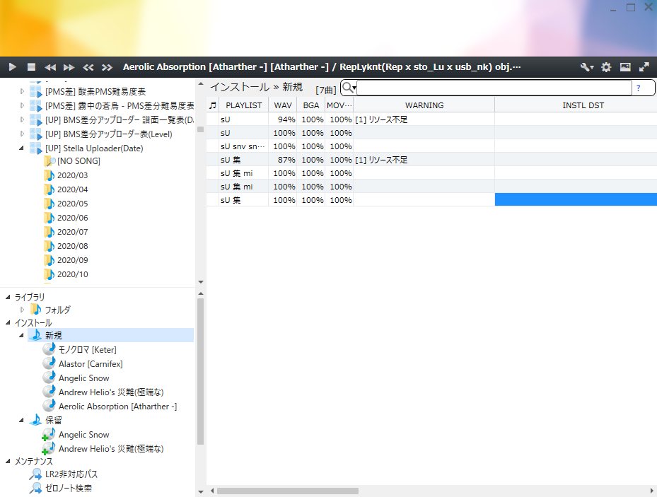

### 保留

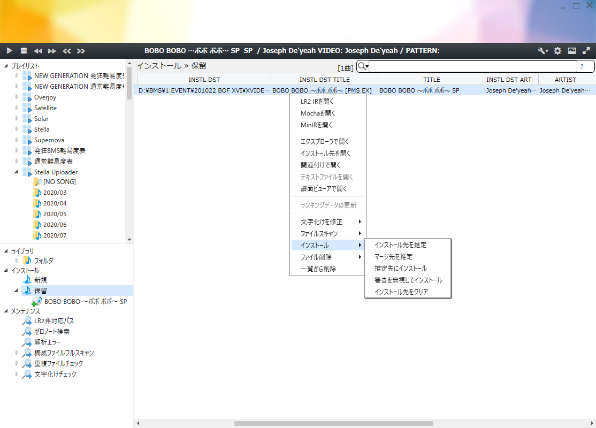

`保留` はまだ導入前のパッケージです。導入先を確認・修正してからインストールします。[導入先推定とマージ先推定](#導入先推定とマージ先推定) を使って再推定もできます。

#### 導入先と WARNING の確認

| 列 | 確認する内容 |
| --- | --- |
| INSTL DST | 実際の導入先ディレクトリ |
| INSTL DST TITLE / ARTIST | 導入先を代表する既存譜面のタイトル・作者 |
| WARNING | リソース不足、候補の曖昧さ、タイトル・作者の不一致など |

`WARNING` は `[種類数] ラベル` の要約で、詳細はツールチップに表示します。同じ要約でも複数の不足がある場合があります。導入先を設定すると要約からリソース不足が消える場合もあるため、詳細も確認してください。

| 主な WARNING | 判断の目安 |
| --- | --- |
| 推定先複数 / 導入先複数 | 複数候補があるため、場所とタイトル・作者を比較します。 |
| TITLE/ARTIST不一致 / 導入先推定 | リソースが一致しても低信頼の場合があります。正しい作品か確認します。 |
| リソース不足 | WAV、BGA、動画などの不足率を確認します。差分単体では導入前の不足が通常です。 |
| 導入先不明 / リソースパス非対応 / 探索上限 | 詳細を読み、手動指定または再推定を行います。 |
| 既に導入済み | 所持済み譜面を含みます。リソース更新が目的ならマージや [高度な機能](#高度な機能) を検討します。 |

推定では参照する音源・画像・動画、既所持譜面、TITLE / ARTIST などを照合します。`sound/foo.wav` と `foo.wav` のように相対パスが違う参照は別物です。起動時のスキャンを省略した場合は、先に [ライブラリをリロード](#ライブラリのリロード) してください。

#### 導入先の選択と手動入力

候補のあるセルは `候補を選択…` またはパスの前に `▼` を表示します。編集すると上位最大 `3` 件の候補が出るので、場所を確認して選びます。複数候補から選んだ後も WARNING が残る場合があります。

所持譜面のフルパス、またはその譜面が入っているディレクトリを手動入力できます。フルパスはディレクトリに変換されます。未登録の場所や存在しない場所は指定できません。

#### 保留からの除外・削除

> [!CAUTION]
> `ファイル削除` → `ごみ箱へ移動` は実ファイルを削除します。フォルダごとの削除を選ぶと、パッケージ内の全譜面を選択している場合に同梱ファイルも移動します。複数行では対象フォルダごとの確認は出ないため、選択範囲を確認してください。

`一覧から削除` は通常のユーザーフォルダや手動指定した元アーカイブを削除せず、保留から外します。URL 取り込みなどのアプリ管理一時パッケージは一時ファイルも削除される場合があります。

### 導入先推定とマージ先推定

右クリックメニューの `インストール` には、似た名前の推定機能が複数あります。

`インストール先を推定` は、通常の差分導入向けです。保留パッケージに同梱されているリソースも「導入後に使えるもの」として数え、既存ディレクトリとの組み合わせで最も成立しやすい導入先を探します。通常はこの機能を使います。**つまり同梱の追加音源も考慮されるということです。**

`マージ先を推定` は、既所持譜面だけの保留パッケージや、リソースだけを既存フォルダへ寄せたいケース向けです。保留パッケージ内の同梱リソースを評価に足さず、既存ライブラリ側のリソースだけで成立する統合先を探します。推定済みの `INSTL DST` は上書きされます。実行前に確認ダイアログが出ます。

`推定先にインストール` は、`INSTL DST` が設定されている保留パッケージを、一覧の順番に一件ずつ推定先へ導入します。導入後は新規一覧で結果を確認できます。全譜面の `INSTL DST` が空のパッケージはそのまま保留に残ります。同梱ファイルの同名衝突は、設定画面の [スマート上書き](#スマート上書き) に従って処理されます。

`新規としてインストール` は、推定先を使わず、通常の新規インストールとして扱います。導入先が設定済みの場合は、その導入先を使わないことを必ず確認します。導入先が未設定の場合も、既定では保留中のパッケージを意図的に新規扱いし、リソース不足などの WARNING が残っていても導入することを確認します。後者の確認だけは、詳細設定の `新規としてインストールの確認メッセージを表示する` を OFF にすると省略できます。拒否したパッケージは保留に残ります。**典型的には `WAV 97%` だが作品の配布状態が元々こうだったという場合に使うことが多いです。**

`インストール先をクリア` は、選択行の `INSTL DST`、推定先タイトル / アーティスト、導入先推定 WARNING、候補サジェストを消します。推定をやり直したい場合に使います。

### スマート上書き

差分導入、既所持パッケージのリソース上書き、重複フォルダマージで、同名の音源、BGA、画像、readme などをどう扱うかを決めます。設定画面の `詳細設定` で変更でき、既定は ON です。

> [!CAUTION]
> 同梱ファイルの上書きや元ファイルの削除を行います。残したい音源・画像がある場合は、導入先と元パッケージを控えてから操作してください。比較基準はサイズと更新日時であり、音質を判定するものではありません。

| 同名ファイルの状態 | ON の場合 |
| --- | --- |
| 導入先にない | そのまま移動します。 |
| サイズが同じで、更新日時の差が2秒以内 | 導入先を残し、元ファイルを削除します。 |
| 元ファイルの方が新しい | 導入先を上書きします。 |
| 導入先の方が新しい、または同時刻 | 導入先を残し、元ファイルを削除します。 |

同じサイズでも更新日時の差が `2` 秒を超える場合は、新しい方を残します。サイズが違う場合も更新日時で判断します。OFF の場合は、導入元の同名ファイルで上書きします。

`スマート上書き時、*.bmx/*.pmx/*.txt は上書きせず自動採番で保持する` を ON にすると、上書き対象の `.bmx`、`.pmx`、`.txt` は `name(1).txt` のような空き連番名で残します。同一内容の連番ファイルがあれば元ファイルを削除します。

BMS / PMS / bmson の譜面本体は、この設定に関わらず同名衝突時に `chart_.bms` のような別名で導入します。ファイルとフォルダの種類が衝突して処理できない場合は [ファイルの移動・統合に失敗する](#ファイルの移動統合に失敗する) を参照してください。

### 高度な機能

> [!CAUTION]
> 元パッケージの直接削除はごみ箱を経由せず、リソース上書きは既存ファイルを置き換えます。対象と導入先を確認し、必要なファイルを控えてから実行してください。

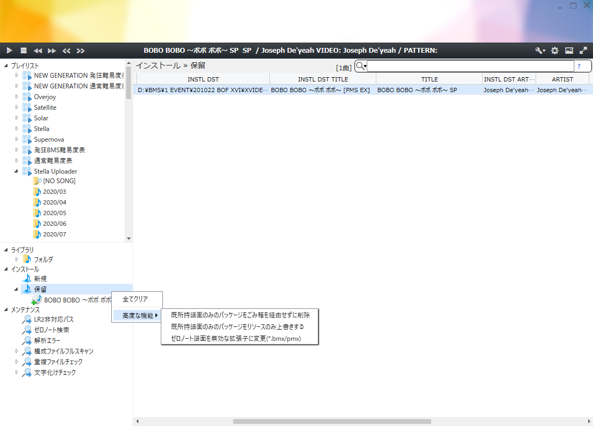

保留ツリーには、整理用の高度な機能があります。

`既所持譜面のみのパッケージをごみ箱を経由せずに削除` は、保留中のうち、含まれる譜面がすべて既所持と判断できるパッケージだけを対象にします。フォルダパッケージはフォルダごと、単体ファイルはファイルそのものを直接削除し、保留一覧からも取り除きます。ごみ箱を経由しないため、誤って実行すると戻せません。

`既所持譜面のみのパッケージをリソースのみ上書きする` は、譜面自体は既に持っているが、音源や BGA などの同梱リソースだけ更新したい場合の機能です。既所持譜面の hash から導入先を解決し、導入先が一意に決まるパッケージだけを処理します。導入先が複数に分かれる、導入先が分からない、上書き対象のリソースがない、などの場合はスキップされます。同名ファイル衝突時の扱いは [スマート上書き](#スマート上書き) の設定に従います。処理後に成功数、スキップ理由、失敗数のサマリーが表示されます。

`ゼロノート譜面を無効な拡張子に変更(*.bmx/pmx)` は、保留中の譜面を実ファイルで確認し、0 notes と判定される譜面だけをまとめて対象にする一括処理です。BMS 系拡張子は `.bmx`、PMS 系拡張子は `.pmx` へ変更し、保留一覧から除外します。`.bmx` / `.pmx` 自体や対象外拡張子、0 notes ではない譜面はスキップされます。変更先ファイル名が衝突した場合の重複削除や自動採番は、ライブラリ右クリックメニューの [無効な拡張子に変更](#無効な拡張子に変更) と同じです。

## メンテナンス

`メンテナンス` には、ライブラリの状態確認に使う専用ビューがあります。

### LR2互換性警告

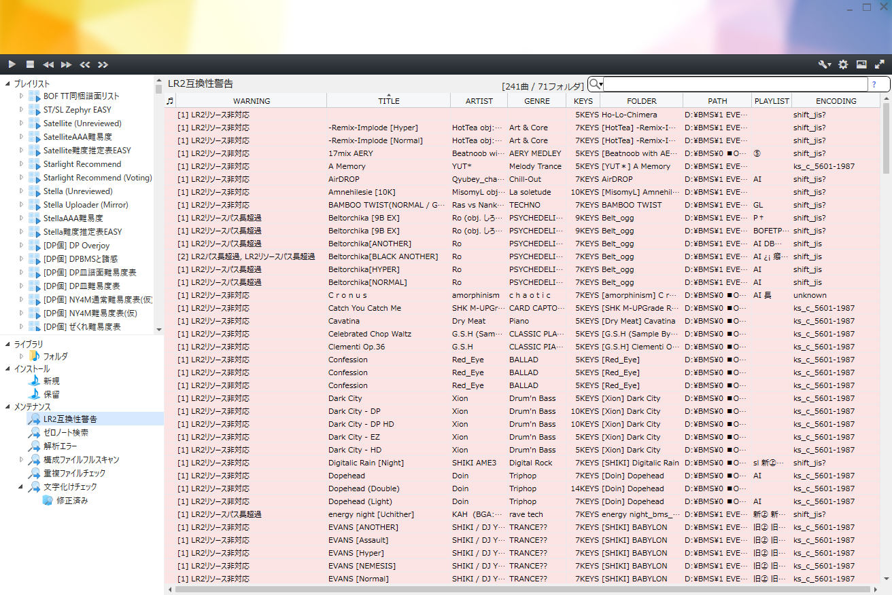

`LR2互換性警告` には、LR2 側で選曲や再生に支障が出る可能性がある譜面が表示されます。LR2 は多くの処理で CP932(Shift_JIS) のファイル名と古いパス長制限を前提にしているため、BeMusicSeeker では譜面ファイル本体のパスと、BMS 内で参照される音源・画像・動画などのリソース定義を確認しています。

- LR2パス非対応: 譜面ファイルのフルパスに CP932(Shift_JIS) で表現できない文字が含まれています。LR2 側で選曲できない可能性があります。
- LR2パス長超過: 譜面ファイルのフルパスが LR2 の古いパス長制限を超える可能性があります。フォルダ階層を浅くする、フォルダ名やファイル名を短くする、といった対応を検討してください。
- LR2リソース非対応: BMS 内のリソース定義(`#WAV`、`#BMP`、`#BGA` など)に、LR2 が CP932(Shift_JIS) のファイル名として扱えない文字列が含まれています。譜面自体を選曲できても、音源や BGA が正しく読み込まれない可能性があります。
- LR2リソースパス長超過: 譜面の配置フォルダとリソース定義を組み合わせた、LR2 が実際に参照するリソースパスが長すぎる可能性があります。譜面フォルダを短い場所へ移動する、リソースのフォルダ名やファイル名を短くする、といった対応を検討してください。

リソース定義に `..` を含む親ディレクトリ参照がある場合でも、それだけで LR2 非対応とは扱いません。ただし、配置先を含めた実際の参照パスが長くなる場合は `LR2リソースパス長超過` の対象になります。

BeMusicSeeker 上では該当譜面を削除せず warning として可視化しますが、LR2 側では選曲や再生に失敗する可能性があります。必要に応じて、譜面ファイル、リソースファイル、配置先フォルダを CP932(Shift_JIS) 互換の文字と短いパスへ変更してください。

### ゼロノート検索

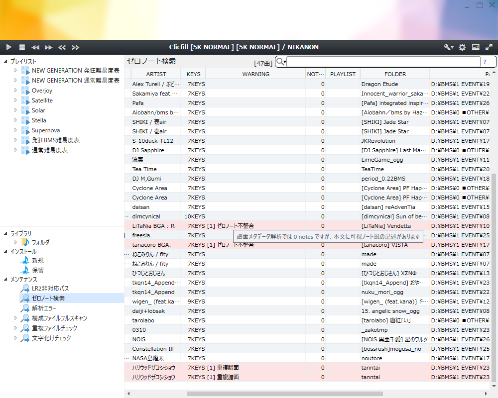

解析結果が `0 notes` の譜面を確認します。右クリックの `ゼロノート記述確認` で、実ファイルに通常ノートやロングノートらしき記述があるかを確認できます。解析結果と本文が食い違う場合は WARNING が表示されます。

この表示だけでは空譜面とは断定できません。`#RANDOM` / `#IF` の分岐やプレイヤーの解釈で結果が異なる場合があるため、除外する前にプレイヤーや譜面ビューアで確認してください。

### 解析エラー

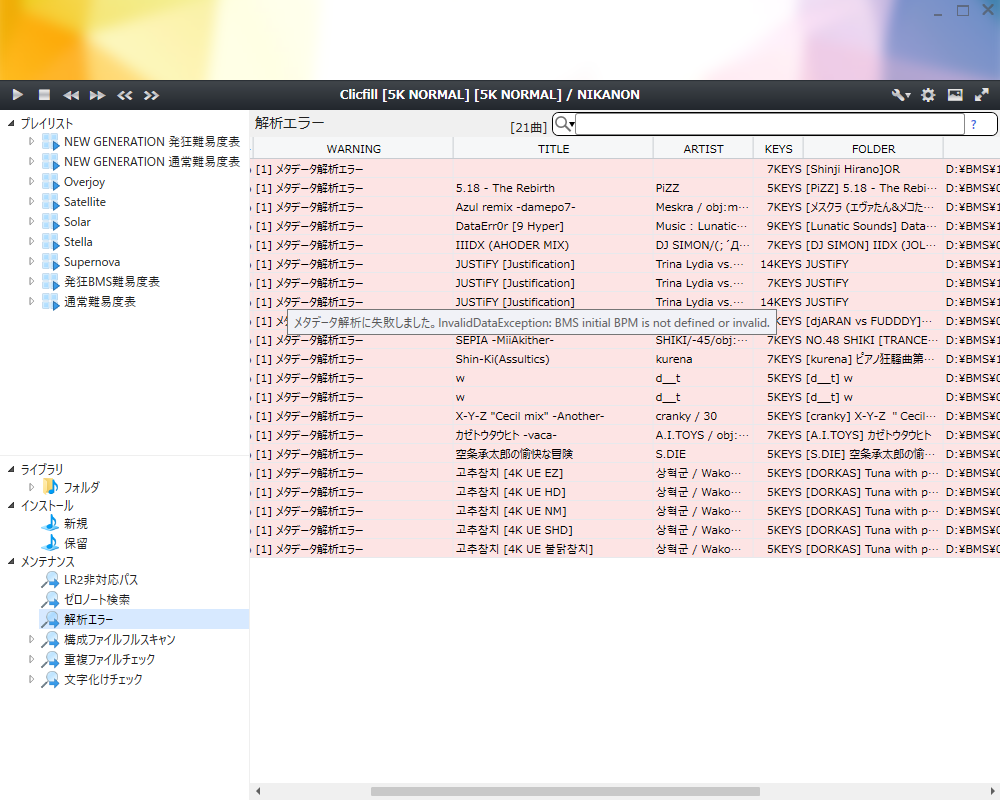

メタデータ解析に失敗した譜面を一覧し、WARNING の詳細で原因を確認できます。一時的な負荷などで失敗した場合の再解析は [解析エラーを再確認したい](#解析エラーを再確認したい) を参照してください。

### 文字化けチェック

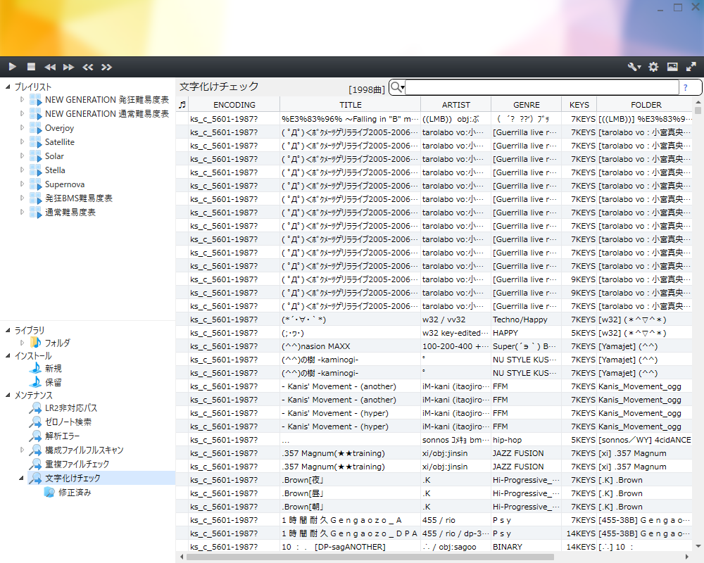

文字コード推定に問題がある譜面を確認します。手動修正では、日本語、韓国語、中国語などの候補から選べます。

### 重複ファイルチェック

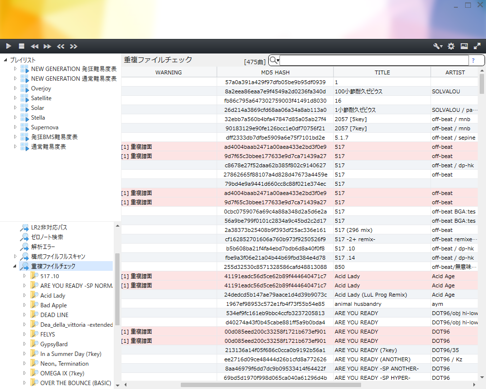

同一譜面と判断できるファイルを探し、重複している譜面をまとめて確認する画面です。BMS 系ファイルと bmson の MD5 が一致するものを重複候補として表示します。

重複している譜面には `重複譜面` の WARNING が付き、一覧では行がハイライトされます。左ツリーの `重複ファイルチェック` を選ぶと重複候補全体、配下のグループを選ぶとそのグループ、さらにフォルダを選ぶとそのフォルダ内の譜面を一覧に表示できます。グループやフォルダの表示には、同梱内容を確認できるよう重複していない兄弟譜面も含まれます。

重複グループは、同じ hash を持つ譜面が入っているフォルダ同士をつなげて作られます。たとえば `A` と `B` に同じ譜面があり、さらに `B` と `C` に別の同一譜面がある場合、`A / B / C` は一つの整理対象として扱われます。これにより、複数フォルダにまたがって少しずつ重複しているパッケージもまとめて確認できます。

#### 重複フォルダをマージする

> [!CAUTION]
> 統合する側のファイルを移動し、既所持の重複譜面や元フォルダを削除する場合があります。音源・BGA などの同名衝突は [スマート上書き](#スマート上書き) に従います。残したい品質・形式を確認し、必要な元ファイルを控えてください。

重複ファイルチェックツリーで **統合して消したい側のフォルダ** を選び、右クリックの `マージ先` で残すフォルダを選びます。既定では、移動元と移動先を確認してから実行します。`詳細設定` の `重複ファイルチェックのマージ/整理時に確認メッセージを表示する` が OFF の場合は確認を省略します。

BMS / bmson と同梱リソースが統合されます。同じハッシュの譜面は重複を解消し、同名でも異なる譜面は別名で保持します。移動元が空、または既所持の譜面だけになった場合は元フォルダを削除します。判定できないファイルなどが残る場合は元フォルダが残ります。

#### `Ctrl + G` で連続整理する

> [!CAUTION]
> `Ctrl + G` は統合して消したい側のフォルダで実行してください。同一フォルダ内の重複整理は1件を残して他の譜面をごみ箱へ移動します。

フォルダ項目を選択した状態で `Ctrl + G` を押すと、重複整理用のショートカットとして動作します。

- 重複フォルダが 2 件だけの場合は、選択中フォルダをもう一方のフォルダへマージします。
- 重複フォルダが 3 件以上ある場合は、統合先を自動決定せず、右クリックメニューの `マージ先` を開いた状態にします。候補を確認して移動先を選んでください。
- 重複フォルダが 1 件だけの場合は、同じフォルダ内に同一 hash の譜面が複数ある状態として扱い、重複 hash の整理を行います。

同一フォルダ内の重複 hash 整理では、hash ごとに 1 件だけ残し、残りをごみ箱へ移動します。残すファイルは、更新日時が古いものを優先し、同じ日時ならファイル名が短いものを優先します。既定では、実行前にごみ箱へ移動する件数を表示した確認ダイアログが出ます。設定画面の `詳細設定` カテゴリで `重複ファイルチェックのマージ/整理時に確認メッセージを表示する` を OFF にすると、この確認を省略します。

2フォルダのマージと同一フォルダ内の整理が終わると、次の重複グループがあれば自動的に選択します。3フォルダ以上のマージ後は、同じグループの見出しへ戻ります。上から順番に確認しながら `Ctrl + G` を使うと、大量の重複を比較的少ない操作で整理できます。

移動・統合に失敗した場合は [ファイルの移動・統合に失敗する](#ファイルの移動統合に失敗する) を参照してください。

### 構成ファイルフルスキャン

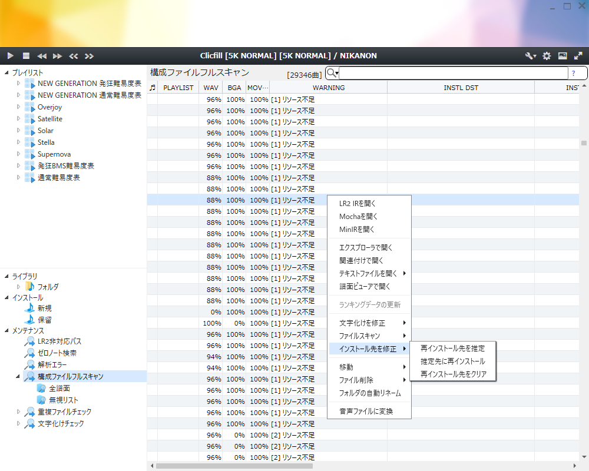

WAV、BGA、動画、画像などの不足を確認します。  
`全譜面を再スキャン` は重い明示操作です。通常起動では全譜面のリソース再検証は行いません。導入後に不足リソースを追加した場合は、該当行の再スキャンまたは全譜面再スキャンで状態を更新します。

## プレイログ

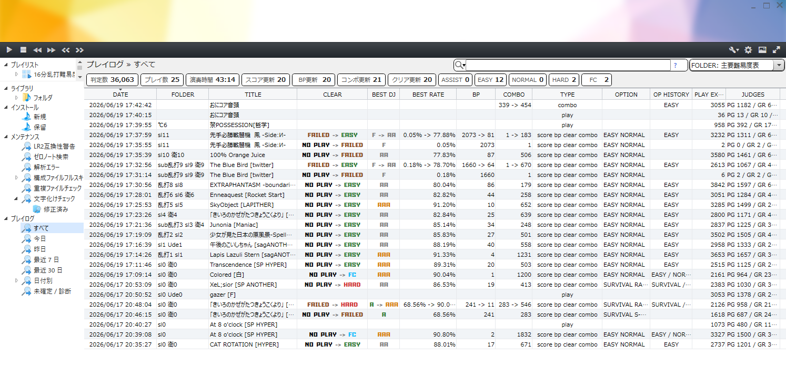

下段ツリーの `プレイログ` から、LR2 または beatoraja のプレイ履歴を一覧に表示できます。

### 表示される履歴

LR2 連携モードでは、LR2 のスコア DB に記録されたプレイログを表示します。LR2 のプレイログを使うには、先に [設定画面の LR2プレイログ](#lr2プレイログ) から導入してください。**LR2 では導入後にプレイした履歴だけが表示対象です。導入前の過去プレイはプレイログとして復元できません。**

beatoraja 連携でスコアを読み込んでいる場合は、スコア読み込みに使っている beatoraja プレイヤーデータの更新履歴を表示します。LR2 と beatoraja の履歴を同じ一覧で合算することはありません。

### 期間と未確定 / 診断

期間は `すべて`、`今日`、`昨日`、`最近 7 日`、`最近 30 日`、`日付別`、`未確定 / 診断` です。`日付別` で年・月・日を選べます。期間はローカル日付の 0:00 区切りで、最近 7/30 日には今日を含みます。

`未確定 / 診断` は LR2 の履歴に不整合の可能性がある行を確認する専用表示です。詳細は [未確定 / 診断とは](#未確定--診断-とは何ですか) を参照してください。

### サマリー

一覧ラベル・検索欄の下にある専用サマリー行には、判定数、プレイ数、演奏時間、SCORE / BP / COMBO / CLEAR 更新、ASSIST / EASY / NORMAL / HARD / FC などのクリア内訳が表示されます。EXH は beatoraja の履歴を表示しているときだけ表示されます。更新種別やクリア内訳のカードをクリックすると、その条件で一覧を絞り込めます。

複数カードを選んだ場合、カード同士は OR、検索欄の条件とは AND で扱われます。選択中のカードは見た目が変わり、もう一度クリックすると解除できます。

beatoraja の判定数、プレイ数、演奏時間は、画面で選んでいる期間に対する値です。検索欄、カード、右上ドロップダウンで一覧行数を絞り込んでも、これらの値はその絞り込みには追従しません。beatoraja で期間集計用のデータが読めない場合は `-` と表示されます。読み込みの問題はサマリーの診断と [ログ](#ログ不具合報告) で確認できます。

### 行の見方

プレイログ行では、SCORE、BEST DJ、BEST RATE、BP、COMBO、CLEAR の best 更新を `old -> new` の遷移で表示します。CLEAR は `NP`、`EASY`、`NORMAL`、`HARD`、`EXH`、`FC` などの短縮形で表示し、CLEAR と BEST DJ は未選択行では更新元、矢印、更新先をそれぞれ別色で表示します。初回 BP は値だけを表示します。`TYPE` は `score bp clear` のように複数の更新種別を持つことがあり、`play` は他の更新種別が無い場合だけ表示されます。LR2 の `OP HISTORY` は新しく達成されたオプション履歴を名前で表示します。

beatoraja では best が更新された行だけが表示されます。更新が無かったプレイや途中終了したプレイは一覧行にはなりません。

### 表示対象と FOLDER

プレイログ右上のドロップダウンメニューでは、表示対象と FOLDER 列の投影方法を切り替えられます。`すべて` は期間ツリーで選んだ範囲の履歴を全件表示します。`プリセット: <名前>` は、設定画面の `プレイログ FOLDER 表示プリセット` で選んだプレイリストに含まれる譜面だけへ絞り込み、FOLDER 列には各プレイリストの表示記号とレベルを表示します。`FOLDER: <名前>` は行の絞り込みは行わず、期間ツリーと検索欄で選ばれた履歴を残したまま、FOLDER 列だけをそのプリセット基準で表示します。プリセット外の譜面は FOLDER が空欄になります。プレイリスト単体を選んだ場合は、そのプレイリストに含まれる譜面だけへ絞り込み、FOLDER 列にはプレイリスト内フォルダ名を表示します。最後に選んだ表示対象は保存され、次回起動時も同じ項目が利用可能であれば自動的に選択されます。

### プレイログの右クリックメニュー

プレイログの右クリックメニューでは、`設定画面 > 右クリック設定` の `Webページを開く` を同じ順序と対象形式で使えます。hash だけの行では `Webページを開く` を、所持譜面では `プログラムから開く` を利用できます。MD5 と SHA256 のコピー、Explorer や譜面ビューアで開く操作も利用できます。

所持譜面へ解決できるプレイログ行は、外部同期ではないプレイリスト本体またはフォルダへドラッグアンドドロップして追加できます。未解決行が選択に含まれる場合、そのドラッグはプレイリスト追加としては受け付けられません。

### beatoraja 利用時の注意

スコア読み込みで選んだプレイヤーフォルダの `scorelog.db` が必要です。履歴は読み取り専用で、best が更新された SCORE / CLEAR / BP / COMBO を表示します。BEST DJ / BEST RATE はノーツ数を利用できる場合に表示します。

判定数、プレイ数、演奏時間は `score.db` の日別集計から選択期間分を表示します。検索やカードで絞った行数とは一致しない場合があります。`未確定 / 診断` ではこれらの値は `-` です。

## バックアップ・アンインストール

### プレイリストのバックアップと復元

設定画面の `バックアップ` で `プレイリストのバックアップ` を押し、SQL ファイルの保存先を選びます。既定のファイル名は `BeMusicSeeker_backup.sql` です。このバックアップはプレイリスト用で、譜面や音源の実ファイルは含みません。

> [!CAUTION]
> 復元すると現在のプレイリストをバックアップの内容で置き換えます。残したいプレイリストは復元前に別のファイルへバックアップしてください。

`プレイリストの復元` を押し、確認後に保存した SQL ファイルを選びます。復元後はアプリが終了するため、再起動してください。

### LR2 関連ファイルの自動バックアップ

LR2 連携モードで、`バックアップ` の `LR2のバックアップと最適化` を ON にします。既存の保存先フォルダを指定し、対象の `config.xml`、`song.db`、スコア DB を選びます。保存間隔は毎日・毎週・毎月、保持する世代数は `1`～`10` です。

条件を満たす起動時に、指定先の `yyyy-MM-dd` フォルダへ保存します。同日には再保存せず、保持数を超えた古い世代は削除します。バックアップ成功後に DB の最適化も行います。設定保存直後には実行しないため、作業直前に必要な控えは手動で作ってください。

復元する場合は、BeMusicSeeker と LR2 を終了し、必要な日付フォルダのファイルを元の場所へ戻します。

### アプリ設定と BMS ライブラリの保護

アプリを終了した状態で、`config/user.config` と、スタンドアローンモードの `data/song.db` を控えてください。復元はアプリを終了してから元の場所へ戻します。LR2 連携では `song.db`、利用中の LR2 設定ファイル（`config.xml` または `config.xmh`）、各プレイヤーの `score.db` も保護します。

BMS ライブラリ自体は、別ディスクなどへ定期的にバックアップしてください。世代付きや差分バックアップを使えば、誤削除後の復元や容量の節約に役立ちます。

### データのアンインストール

> [!CAUTION]
> LR2 の DB からデータを削除する操作は取り消せません。LR2 を終了し、必要な `song.db` と各プレイヤーの `score.db` を控えてから実行してください。

設定画面の `詳細設定` → `危険な操作` で次を選びます。

| 操作 | 結果 |
| --- | --- |
| LR2 プレイログを無効化 / 削除… → トリガーのみ削除 | 今後の記録を止め、既存履歴を保持します。 |
| LR2 プレイログを無効化 / 削除… → テーブルとトリガーを削除 | 今後の記録を止め、既存プレイログ履歴も削除します。 |
| BeMusicSeeker 関連データを削除… | LR2 の楽曲 DB から BeMusicSeeker 管理データを削除します。操作後はアプリを終了します。 |

ポータブルアプリ本体の削除は、必要な設定・DB・バックアップを別の場所へ保存し、アプリを終了してから配置フォルダを削除します。

## FAQ / トラブルシューティング

### ログ・不具合報告

ログは通常起動で `log/application.log` と `log/install-performance.log` に出力されます。初期化、DB 読み込み、ファイルスキャン、プレイリスト同期などの情報も既定で記録されます。

ログの読み方は [BeMusicSeeker ログ（実行記録）の見方ガイド](log-level-info-guide.md) を参照してください。

ログファイルが大きくなった場合は `log/archive/` にローテーションされます。不具合報告時は、直近の `log/application.log` と `log/install-performance.log` を確認してください。

### 起動・初期化

#### 登録フォルダを利用できない

起動時は「起動時に BMS ファイルをスキャン」の設定にかかわらず、登録したすべての BMS ディレクトリを確認します。LR2 連携モードでは、カスタムフォルダの通常・追加・ルート型の出力先も確認します。一つでも存在を確認できない、またはアクセスできない場合は、対象を表示して初期化を中断します。利用できない登録は自動では削除しません。

外付けドライブやネットワークドライブが一時的に切断されている場合は、接続を復旧してください。登録先が誤っている場合は設定の `一般` で BMS ディレクトリを修正し、カスタムフォルダ出力先は `プレイリスト` で修正してください。意図した場所にフォルダをまだ作っていない場合は作成し、アクセス拒否の場合は権限を確認してください。空フォルダを作成しても、以前の譜面が復元されるわけではありません。

修正後は設定画面の `保存して閉じる` で初期化を再試行できます。接続を復旧してアプリを再起動することもできます。BMS ディレクトリは読取り可能であればよく、LR2 カスタム出力先にはファイルの作成・書込み・削除が可能であることも必要です。

#### 起動や初期化が遅い

- Everything 1.5 (x64) を導入し、BMS フォルダを検索できるか確認してください。
- 初回構築、空の DB、大規模な BMS フォルダ変更では、通常より時間がかかります。
- Everything を利用できず通常のファイル検索へ切り替わった場合は、警告が表示されます。検索先と接続を確認してください。
- 譜面が0件なのに既存 DB に楽曲が残る場合は、更新を見送り警告を表示します。BMS ディレクトリが楽曲のある場所を指しているか確認してください。

解決しない場合は [ログ・不具合報告](#ログ不具合報告) のログを確認してください。

### ダウンロード・インストール

#### ダウンロード済みファイルや解凍用一時ファイルはどこに置かれますか？

プレイリスト URL の一括取り込みや外部 API からの本体パッケージ取得では、ダウンロードしたファイルとアーカイブの解凍用一時ファイルを Windows の一時領域に作成します。通常は C ドライブ上の `%TEMP%` 配下で、BeMusicSeeker 管理の一時領域として扱われます。大量の URL や本体パッケージを取り込む場合は、C ドライブの空き容量に注意してください。

#### 一時ファイルはいつ削除されますか？

URL 取り込みで取得したアーカイブは解凍成功後に削除します。解凍先は導入や保留確認で必要な間だけ保持し、不要になったものは処理中や終了時に整理します。強制終了で残った古い一時ファイルは次回起動時に整理します。

#### 保留一覧から削除すると実ファイルも消えますか？

通常のユーザーフォルダや手動で指定した元アーカイブは、`一覧から削除` だけでは削除されません。実ファイルを消す場合は、右クリックメニューの `ファイル削除` → `ごみ箱へ移動` を使います。一方、URL 取り込みなどで作られた BeMusicSeeker 管理の一時パッケージは、保留一覧から削除すると一時ファイルも削除される場合があります。

### プレイリスト・外部サイト

#### 外部サービスから取得できない

ランキングキャッシュ、IR、リコメンド、難度推定表、配布先検索などは外部サービスに依存します。接続先が利用可能か確認し、一時的な不調なら時間を置いて再実行してください。サービスの停止やデータ形式の変更でも取得できなくなることがあります。ログに表示された接続先と原因を確認してください。

#### プレイリストの STATUS が失敗になる

外部難易度表の URL が 404、403、タイムアウトなどを返している場合があります。プレイリストサマリーの `STATUS` のツールチップ、または `log/application.log` の `playlist_reload_target_failed` を確認してください。

beatoraja の Table URL インポートでキャッシュから復元できた場合も、`STATUS` は元 URL の取得結果を示すため、取り込み成功と外部同期失敗が同時に表示されることがあります。

外部サイト側の一時的な問題であれば、時間を置いてリロードしてください。URL が変更されている場合は、プレイリストのプロパティで URI を修正する必要があります。

### LR2 連携

#### LR2 で選曲できない譜面がある

`LR2互換性警告` に表示されていないか確認してください。CP932(Shift_JIS) で表現できない譜面パスやリソース定義、長すぎる譜面パスやリソース参照パスを含む譜面は、LR2 側で選曲または再生できない可能性があります。

LR2 連携モードでは、ステータスバーの `LR2 song.db 同期` 状態も確認してください。未完了や失敗が残っていると、LR2 側が古い `song.db` を読んでいる可能性があります。`再試行` で完了させてから LR2 を起動してください。

または、設定画面の `LR2 song.db データを再同期` を実行することも有効な手段です。

### プレイログの問題

#### LR2 の過去プレイが表示されません

LR2 プレイログは、プレイログ機能を導入した後に LR2 でプレイした履歴だけを記録します。導入前の過去プレイはプレイログ画面には復元できません。

#### beatoraja のプレイログ件数やサマリーが一覧と一致しません

beatoraja の一覧行は best が更新されたプレイだけを表示します。一方、判定数、プレイ数、演奏時間などのサマリーは、選択中の期間に対する player 日別累計から計算します。そのため、一覧の行数や検索結果件数とは一致しないことがあります。

#### `未確定 / 診断` とは何ですか？

LR2 専用の診断用期間です。LR2 がスコア更新後、プレイヤー情報の更新まで進む前に終了した場合など、1 回のプレイ履歴として一貫しない可能性がある行を表示します。beatoraja の履歴には関係ありません。

### 音声の再生・変換

#### 音声の再生・変換に失敗する

内蔵再生は `オーディオ` で出力方式とデバイスを確認し、`再生を停止してテスト` を試してください。音切れはバッファを大きくして再確認します。再生パネルの音量とミュート、WASAPI 共有時は Windows の音量も確認してください。

変換は元譜面と参照音源、出力フォルダ、外部エンコーダの実行ファイルを確認します。整数音声の範囲超過は完了通知の案内に従って追加ゲインを下げるか、ピーク正規化・1.0倍で再実行してください。対象と理由の詳細はログで確認できます。

### メンテナンスの問題

#### ファイルの移動・統合に失敗する

他のアプリで対象ファイルを開いている場合は閉じ、権限と空き容量を確認してください。ファイルとフォルダの同名衝突では、対象パッケージの変更前に操作を中断して衝突パスを表示します。移動元と移動先を確認し、衝突を解消して再実行してください。

#### 解析エラーを再確認したい

一時的な読取り失敗や高負荷によるタイムアウトと判断できる場合は、解析エラー一覧の右クリックで `メタデータ解析失敗記録を除去` を実行します。次回解析で再確認できます。同じエラーが続く場合は譜面内容や解析対応範囲を確認してください。

#### ランプビューアのスコアが利用できない

一般設定のスコア取得元とプレイヤー、スコア DB の場所を確認してください。履歴スコアを利用できない場合は `最新` または別の有効な基準日を選びます。集計失敗で閉じた場合はログを確認してから開き直してください。

### 検索の問題

#### 検索構文が分からない

[キーワード検索構文ガイド](keyword-search-syntax-guide.ja.md) を参照してください。`title:`、`artist:`、`playlist:`、`rate:` などの field 指定や、除外検索、OR、正規表現、数値範囲検索を使えます。

## 参考資料

- [キーワード検索構文ガイド](keyword-search-syntax-guide.ja.md)
- [BeMusicSeeker ログ（実行記録）の見方ガイド](log-level-info-guide.md)
- [従来版 BeMusicSeeker 公開記事](https://tumblr.ribbit.xyz/post/129562866015/bemusicseeker-%E6%AD%A3%E5%BC%8F%E7%89%88%E3%82%92%E5%85%AC%E9%96%8B%E3%81%97%E3%81%BE%E3%81%97%E3%81%9F-v034)
- [従来版 BeMusicSeeker マニュアル](https://tumblr.ribbit.xyz/post/129562878360/bemusicseeker-%E3%83%9E%E3%83%8B%E3%83%A5%E3%82%A2%E3%83%AB-v030-%E5%AF%BE%E5%BF%9C%E7%89%88)
