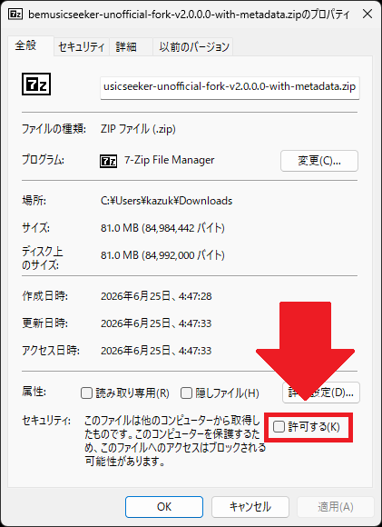
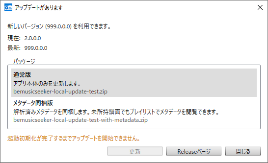
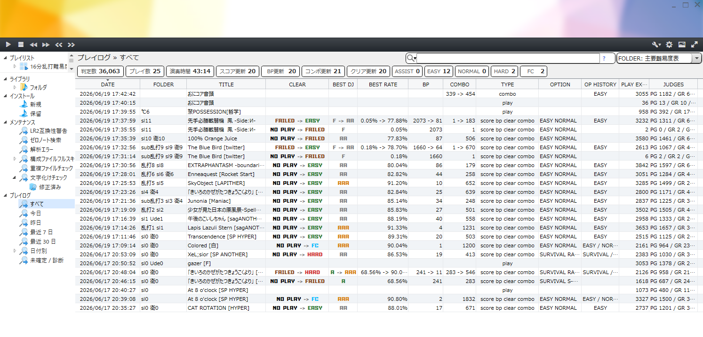

# BeMusicSeeker Unofficial Fork User Manual v2.0

[](manual.ja.md)
[](manual.md)


This document is the English user manual for BeMusicSeeker Unofficial Fork.
It summarizes the features, behavior, and cautions added or changed in this fork while inheriting the basic usage of the traditional BeMusicSeeker.

## Table of Contents

- [Introduction](#introduction)
- [Initial Setup](#initial-setup)
- [Settings Dialog](#settings-dialog)
- [Startup / Reload / Progress Display](#startup--reload--progress-display)
- [Screen Layout](#screen-layout)
- [Library List](#library-list)
- [Search](#search)
- [Playback / Recording](#playback--recording)
- [Playlists](#playlists)
- [Install / Pending Packages](#install--pending-packages)
- [Maintenance](#maintenance)
- [Play Log](#play-log)
- [Backup / Uninstall](#backup--uninstall)
- [Logs and Troubleshooting](#logs-and-troubleshooting)
- [References](#references)

## Introduction

BeMusicSeeker is an integrated management tool that helps manage, search, play, install, maintain, and organize playlists for BMS files.

In addition to the basic features of the traditional version, this fork includes improvements such as the following.

- Faster initialization, reload, and list display for large libraries
- Fast file enumeration and resource index creation using `Everything 1.5 (x64)`
- Faster install-destination estimation, estimated-destination install, and duplicate folder merging
- bmson management support, though playback is not supported
- Standalone mode that does not depend on LR2
- Enhanced LR2 integration, including `song.db` generation and synchronization
- Portable application packaging
- Playlist summary, external sync `STATUS`, URL1/URL2 completion, single/range reload
- Enhanced pending install screen, smart overwrite, and zero-note chart cleanup
- Maintenance screens such as LR2 compatibility warnings, parse errors, and duplicate file check
- Structured and more informative `WARNING` display
- Multilingual support and dark theme support
- beatoraja integration, including score loading and difficulty table updates
- Play Log, including incremental LR2 recording through score DB integration

### Caution

Depending on the settings, BeMusicSeeker may move or delete LR2 `song.db`, `config.xml`, custom folder output destinations, and actual BMS files.
Before performing large cleanup operations, installs, deletions, duplicate merges, or uninstall operations, backing up LR2-related files and BMS folders is recommended. **If you are dealing with `song.db` corruption, using this application's backup feature should help avoid rebuilding everything from scratch.**

## Initial Setup

BeMusicSeeker Unofficial Fork is a portable application that does not require installation. Download the latest version from the release page, extract it to any folder, and start it. Do not run it directly from the ZIP file; always extract it to a writable folder first.

Before extracting the ZIP, right-click the downloaded file, open `Properties`, and if an `Unblock` checkbox appears near the bottom of the window, check it and press `Apply`. This clears the safety mark Windows adds to files downloaded from the internet before the package is extracted. Applying it to the ZIP first helps avoid Windows applying extra restrictions to `BeMusicSeeker.exe` or bundled DLL files after extraction.



The application creates files such as `config/user.config` and `data/song.db` near the executable. If you place it under `Program Files`, in a read-only folder, or in a location where sync conflicts are likely, saving settings or creating the standalone DB may fail. When updating, keep `config` and `data` and overwrite the main application files with the new version.

### Very Strongly Recommended, Effectively Required: Everything 1.5 (x64)

If possible, install [Everything 1.5 (x64)](https://www.voidtools.com/everything-1.5/) first.

During initialization, BeMusicSeeker enumerates a large number of BMS chart files, audio files, images, videos, and related resources. When Everything is available, file enumeration and resource index creation can be accelerated. The application can run without it, but first scans and reloads may take a long time for large libraries.

Start BeMusicSeeker after Everything has finished indexing your BMS-related folders and can search them.

### Migrating Existing Settings

In an environment where the traditional BeMusicSeeker is already installed, existing settings are copied automatically on first launch. The destination is `config/user.config` under the folder where this application is placed. The original BeMusicSeeker settings file is not modified.

### First Launch

On first launch, an initial setup dialog with language selection is shown.


Choose a language, proceed to the settings dialog, and configure the operating mode and required items. The first scan of BMS files does not start until the required items are filled in and `OK` is pressed.

### Operating Mode

BeMusicSeeker has two major operating modes.

#### Standalone, Not Linked with LR2

This mode does not use LR2 `song.db`; it manages the library with `data/song.db` under the application directory.

Main required settings:

- `General` tab: BMS directory
- `Install` tab: new install destination

LR2 scores, LR2 custom folder output, and some LR2IR-related features are not used. Use this mode when you want BeMusicSeeker alone to organize, search, install, and maintain BMS files.

#### Linked with LR2

This mode uses LR2 `config.xml`, `song.db`, and `score.db` to integrate with LR2 owned charts, scores, and custom folder output.

Main required settings:

- `General` tab: LR2 directory, `song.db`, `config.xml`
- `Playlist` tab: normal custom folder output destination, additional normal outputs, root folder output destination
- `Install` tab: new install destination

Use this mode when you want to manage the same library as LR2 in BeMusicSeeker.

In LR2 linked mode, tables and indexes for BeMusicSeeker may be added to `song.db` during initial setup or future updates. Before pressing `OK` in the settings dialog to start the first scan, it is safer to back up LR2-related files such as `song.db`, `config.xml`, and score DBs.

In LR2 linked mode, BeMusicSeeker writes owned BMS `song` / `folder` information to LR2 `song.db` and keeps LR2's own recursive scan at startup from occurring as much as possible. On first setup or after settings changes, missing existing rows are backfilled. Progress is shown in the startup progress display or status bar. After completion, differential updates are applied along with normal library updates such as install, delete, merge, and extension changes. bmson files are not written to LR2 `song` / `folder`; they are handled as BeMusicSeeker-side management information.

While LR2 `song.db` synchronization is running, operations that simultaneously change owned charts and LR2 `song.db` may temporarily stop. If the status bar shows a failure or incomplete state, press `Retry`. If necessary, use `Resynchronize LR2 song.db Data` in the settings dialog to regenerate `song` / `folder` using owned charts and playlists as the source of truth.

### First Scan

After settings are complete, the first scan starts. The first scan checks all chart files, registers them in the DB, and creates the basic data required for install estimation and maintenance information.
Depending on library size, disk speed, and Everything availability, this may take several minutes or longer.

Once the first build is complete, later launches mainly use differential updates. If you move the entire BMS folder tree significantly, or rebuild the DB from an empty state, the heavy processing will run again.

> As a reference, in my environment with about 210,000 charts, the first DB build took about 11 minutes. On later launches, it took about 20 seconds until differential installation became available and about 40 seconds until the full library list could be displayed. With an SSD environment, even a reasonably old PC should be able to build at around this speed.

## Settings Dialog

The settings dialog is saved when `OK` is pressed. Depending on the changed settings, the result may be immediate application, score-only reload, library reload, reinitialization, or a restart request.

### General


In the `General` tab, configure language, operating mode, BMS directory, LR2 directory, `song.db`, `config.xml`, `beatoraja directory`, and related settings.

In both standalone mode and LR2 linked mode, register the root folders where charts should be searched as BMS directories. In LR2 linked mode, also configure the LR2 directory and DB / XML paths.
BMS directories can be added with the `Add` button, or by dragging folders onto the list.

#### Standalone

This mode allows the application alone to manage BMS even if you do not have LR2 itself.
The locations configured as BMS directories become the targets for chart search.
A DB for managing owned BMS is created at `data\song.db`. The saved contents are almost the same as in LR2 linked mode, but custom folder output and LR2-specific data required for song selection in LR2 are not recorded. Because of this, when LR2 is not being used, the processing load is slightly reduced.

#### Linked with LR2

This is the integration mode that has existed since the traditional BeMusicSeeker.

In LR2 linked mode, BeMusicSeeker generates and differentially updates the `song` / `folder` information required in LR2 `song.db`. It is recommended to add and remove BMS directories from BeMusicSeeker's `General` tab and not from the `JUKEBOX` tab in LR2 SETUP.

When the initial settings are saved and when starting in LR2 linked mode, BeMusicSeeker sets `<autoreload>` in LR2 `config.xml` to `0`, changing LR2 SETUP's "database auto update" to "manual only". This assumes that BeMusicSeeker manages `song.db`, and avoids extra scans caused by LR2's own automatic update and avoids adding corrupted DB rows for paths that cannot be represented in Shift_JIS.

However, even charts that cause errors during LR2 scanning or playback are still saved in the `song` table so they can be managed by this application. Please understand that even if such charts appear on the song selection screen, problems may occur when playback starts. Some known LR2 compatibility risks can be checked in the `LR2 Compatibility Warnings` screen.

The `Resynchronize LR2 song.db Data` button regenerates the `folder` and `song` tables. Even if the DB becomes incomplete for some reason, this re-parses and regenerates it from owned charts and playlists.

#### LR2 Play Log

The LR2 play log adds BeMusicSeeker tables, indexes, and triggers to each player's LR2 `score.db`, and incrementally records plays made in LR2 after installation. It is available in LR2 linked mode.

The LR2 play log records only plays made in LR2 after it has been installed. Plays made before installation cannot be shown in the Play Log view.

The `LR2 Play Log` status shows the result of checking the selected player's `score.db`. When it is not installed, or when some tables, indexes, or triggers are missing or mismatched, the button beside the status installs or repairs it. Before running it, confirm that the target player is correct and back up `score.db` if needed.

To disable or delete the LR2 play log, use `Disable / delete LR2 play log...` under `Backup > Uninstall data` in the settings dialog. Removing only triggers stops future recording while keeping existing history. Removing the history tables as well deletes existing play-log history.

#### beatoraja Integration

For beatoraja, this application supports some integration such as score DB loading and difficulty table cache output, but it is not a tool for managing beatoraja as a whole. **If you want to update the beatoraja DB quickly, please use [songdata-updater](https://github.com/Neeted/songdata-updater).**

In beatoraja integration, specify the beatoraja directory. The application reads `tablepath` and `playerpath` from `config_sys.json` directly under that directory, and score loading uses the selected player's `score.db`.

When `.bmt output (difficulty table loading compatibility process)` is enabled, playlists whose `BMT OUTPUT` column is enabled in the playlist summary are output under the `tablepath` in `config_sys.json` as `.bmt` caches that beatoraja can load. This is a compatibility process for environments where beatoraja's level aggregation processing is heavy and difficulty table loading is delayed. External sync tables use the original difficulty table URL, and local playlists use `bemusicseeker://playlist/{playlist_id}` to determine the `.bmt` save name. A `.bemusicseeker-bmt-manifest` for BeMusicSeeker management is created directly under the output destination. During cleanup after settings changes or re-output, only the `.bmt` files recorded in this manifest are deletion targets. During full checks such as startup, `.bmt` files whose manifest metadata, actual file timestamp/size, and playlist hashes/update time match are not regenerated. A playlist whose `BMT OUTPUT` is disabled has its managed `.bmt` removed.

When `Keep existing .bmt files when output is disabled` is enabled and `.bmt` output is turned off, BeMusicSeeker leaves previously output `.bmt` files and the registered beatoraja URLs in place, and only stops automatic re-output from then on. Use this when you want beatoraja to keep loading the existing `.bmt` files, or when you want to pause regeneration temporarily. If this setting is disabled and `.bmt` output is turned off, the `.bmt` files managed by the manifest and the BeMusicSeeker-managed `tableURL` entries become cleanup targets.

`.bmt hash output` lets you choose how `md5` / `sha256` are output for folder songs. `Original` outputs only the hashes saved in the playlist as-is. `Complete md5/sha256 as much as possible` fills in missing hashes when they can be resolved safely from owned charts or chart metadata. `Prefer sha256 only as much as possible` outputs only sha256 without md5 for charts where sha256 can be output, but leaves md5 for charts where sha256 cannot be resolved. The default is `Original`. Hashes for dan course entries use the original difficulty table data as-is and are not targets for this completion. Changing only this setting does not immediately regenerate unchanged `.bmt` files; it is applied the next time the target playlist is re-output.

When `Register .bmt URLs in config_sys.json (stabilizes ordering on the song selection screen)` is enabled, BeMusicSeeker-managed `.bmt` URLs are registered in `tableURL` in `config_sys.json`. Non-managed `tableURL` entries keep their existing order, and BeMusicSeeker-managed entries are appended after them in the playlist summary `BMT SORT` order.

### Appearance


Change settings related to themes and display. Appearance changes generally do not require rebuilding the library.

### Playback


Select the player used to play charts. The built-in player is for simple audio-only preview playback. When using external players such as uBMplay, BMIIDXView2015, or LR2, specify the executable path.

Even in standalone mode, you can specify LR2body as the playback application. This is separate from whether the application integrates with the LR2 DB.

### Device


Configure playback driver, output device, sample rate, format, buffer size, volume, and related settings. If there is no sound, latency is large, or audio cuts out, check the settings in this tab.

### Recording


Configure recording format, quality, sample rate, output filename format, encoder location, and related settings. When using external encoders, specify the folder containing the corresponding executable files such as `lame.exe` or `oggenc2.exe`.

### Playlist Settings


Change custom folder output destinations, difficulty table list acquisition URI, MD5-URL mapping TSV acquisition URI, and URL1/URL2 completion settings.

`Normal output destination` is where ordinary custom folders corresponding to playlists are output. In LR2-linked mode, it is treated as a BeMusicSeeker-managed output destination, and required LR2 BMS root entries are synchronized on save and repaired at startup.
`Additional normal outputs` registers extra normal destinations that can be selected per playlist. The output folder name itself is used as the display name, and that name appears in the Playlist Summary `OUTPUT` column and playlist properties. In LR2-linked mode, each additional normal output is also synchronized as an LR2 BMS root and is automatically removed from the BMS roots when the output is removed. It cannot be the same as, a parent of, or a child of another custom-folder output destination. When an additional output is removed, playlists using it return to the normal output destination.
`Root folder output destination` is where playlists whose properties have `Make root folder` enabled are output. These appear at the root of the song selection screen, so frequently used tables can be accessed quickly.

When an output destination is the same as, a parent of, or a child of an LR2 BMS root that is already registered, a confirmation is shown when saving. If you continue, that location is treated as a BeMusicSeeker-managed custom folder output area rather than a normal chart search location. Existing files may be deleted during output updates or cleanup, so do not place important data there. This confirmation can be accepted when re-registering an output destination that was previously managed by BeMusicSeeker after setting up a newly downloaded copy of the app.

`Play Log FOLDER Display Presets` lets you create playlist sets shown in the drop-down menu at the top-right of the Play Log view. Press `Add` or `Edit` to open a separate window where you can enter a preset name and select multiple target playlists. These presets are used for Play Log filtering and for adjusting the FOLDER column display.

For URL completion, see [URL1/URL2 Completion](#url1url2-completion).

### Install


Configure the new install destination and the naming format used when creating new folders.
In either operating mode, the install destination must be selected from inside a registered BMS directory. In LR2-linked mode, BeMusicSeeker-managed custom-folder output destinations are hidden from the BMS directory list and new install destination choices.

### Backup


Configure playlist backup / restore, LR2-related file backup, generation count, and related settings. Before updates with compatibility concerns or large cleanup operations, taking a backup is recommended.

### Advanced


Change advanced settings such as confirmation messages, initialization, LR2 integration, and install assistance.

Skipping the startup file check makes startup lighter, but it does not enumerate BMS roots or build the resource index used for install-destination estimation. To estimate destinations for pending packages, manually run library `Reload` or `Re-run Initialization`.
Some install-related settings affect real file operations, such as deleting source packages or smart overwrite. Check their contents before changing them.

#### Advanced Tab Options

| Group | Setting | Default | Description |
| --- | --- | --- | --- |
| Message Display | Show confirmation message when registering with chart viewer | ON | Shows a confirmation before chart viewer registration operations. |
| Message Display | Show confirmation message for differential install | ON | Shows a confirmation before operations that insert files into existing folders, such as differential install to an estimated destination. |
| Message Display | Show confirmation message on duplicate file check merge/cleanup | ON | Shows a confirmation before duplicate-file-check operations that merge folders or clean up same-folder duplicate-hash charts. |
| Message Display | Show recommend update message | ON | Shows a notification when recommendation information is updated. |
| Initialization | Scan BMS files and configuration files on startup | ON | Checks file differences and builds the resource index on startup. Turning this OFF speeds up initialization, but the library list saved in the DB is loaded without refreshing the index, so destination estimation for pending packages may not be possible until library `Reload` or `Re-run Initialization` is run manually. |
| Initialization | Do not check playlist updates on startup | OFF | Skips external playlist update checks on startup. Reload playlists manually if needed. |
| Initialization | Set initial startup selection to Install > Pending | ON | Opens the pending package screen as the initial view after startup. Intended for users who want to prioritize new installs and pending cleanup. |
| Initialization | Enable song.db access optimization PRAGMA | ON | Sets read-oriented SQLite PRAGMA when reading the DB to speed up startup and reload. Normally leave this ON. |
| LR2 Integration | Update LR2IR ranking cache on startup | OFF | Reads LR2IR ranking cache XML after startup and updates display data such as `RANKING`, `RANK UPDATE`, `T-SCORE`, and `ΔMAX`. This may be heavy during the first build or after changing LR2ID, so enable it only when needed. |
| LR2 Integration | Estimate offline score rankings | OFF | Estimates ranks for charts whose local score is higher than the LR2IR score when LR2IR ranking cache data is applied. To apply this during startup, also enable `Update LR2IR ranking cache on startup`. |
| LR2 Integration | Download LR2IR scores and detect unsent IR scores | OFF | Retrieves LR2IR score information and detects unsent state from differences with local scores. |
| Install | Automatically try to install after download execution | OFF | If possible, proceeds directly to install processing for packages downloaded from URLs. **Turning this ON is convenient**, but for files that cannot proceed directly to install, such as multi-layer archives, there are caveats such as the package not being added to the pending screen. For that reason, the default is OFF. When importing URLs from multiple selected playlist-detail rows, supported downloadable files are passed to install processing regardless of this setting. |
| Install | Add to pending even when judged new, without automatic install | OFF | Even if enough resources are present for a new work, do not install automatically; always make it possible to confirm it in the pending list. |
| Install | Set the first candidate as install destination when highly matched even with multiple candidates | OFF | Even when multiple install-destination candidates remain, sets the top candidate as `INSTL DST` if TITLE / ARTIST can be judged to match sufficiently well. For packages mixed with already-owned charts, this is used as the final auto-apply step after hash majority, resource / metadata evaluation, and candidate-folder chart counts cannot decide the destination. Even when ON, a caution WARNING and candidate list may remain. **This is intended to be turned ON in environments with many duplicate BMS folders, such as when using difficulty table packages.** |
| Install | During normal install, delete the source package even if already-owned charts remain | OFF | After normal install, deletes the source package even if leftovers such as already-owned charts remain in the source. This is hard to undo, so OFF is usually recommended. It is intended for quickly cleaning up source folders when installing differential packages mixed with already-owned charts. |
| Install | During differential install, compare update time and size to optimize overwriting bundled files | ON | Enables [Smart Overwrite](#smart-overwrite). |
| Install | During smart overwrite, keep *.bmx/*.pmx/*.txt without overwriting by auto-numbering | OFF | In [Smart Overwrite](#smart-overwrite), protected extensions are not overwritten and are kept with sequentially numbered names. |

#### Smart Overwrite

Smart overwrite is a feature that adjusts collisions for bundled components other than the chart files themselves, such as audio, BGA, videos, images, and readme files, when moving files into an existing folder during differential install or merge. It is enabled by default.

**In short, this feature is intended to prevent adjusted files from being overwritten by older audio or BGA files from before the adjustment.**

With normal overwrite behavior, if a same-name file exists at the destination, it is overwritten by the source-side file. When smart overwrite is enabled, BeMusicSeeker compares the source and destination file size and update time, then processes them as follows. For update time comparison, differences of roughly up to 2 seconds are treated as the same time.

- If there is no same-name file at the destination, the file is moved as-is.
- If size and update time are almost the same, the files are treated as identical; the source-side file is deleted and the existing destination file is kept.
- If the source-side file is newer, the destination is overwritten by the source-side file.
- If the destination is newer, or judged equivalent or better, the destination is kept and the source-side file is deleted.

When `During smart overwrite, keep *.bmx/*.pmx/*.txt without overwriting by auto-numbering` is enabled, even if `.bmx`, `.pmx`, or `.txt` would be overwritten by smart overwrite, the existing destination file is kept and the source-side file is saved using an available sequential name such as `name(1).txt`. If a file with identical contents already exists among the sequential-name candidates, the duplicate is not increased and the source-side file is deleted. If the contents differ, or hash comparison is not possible, the file is moved to an available sequential name.

NOTE: Chart files themselves, such as BMS / PMS / bmson files, are not overwritten on same-name collision; they are installed with adjusted names such as `chart_.bms`. This is BeMusicSeeker behavior unrelated to the smart overwrite setting.

This setting is used by processes that move bundled files into existing folders, such as install to an estimated destination, resource overwrite for packages that contain only already-owned charts, and duplicate folder merge. When installing an unowned new work into a new folder as a whole, same-name file collisions are rare in the first place, so smart overwrite has limited effect.

## Startup / Reload / Progress Display

### Automatic Updates



When a newer version is found at startup, the automatic update dialog is shown. Pressing `Update` downloads the selected update package, verifies it, closes the app, and lets the updater replace the files. After the update completes, the app restarts automatically.

The dialog may offer both an app-only package and a package bundled with analyzed metadata. The app-only package updates only the application files. The metadata bundle also includes the latest analyzed metadata, making it easier to show metadata in playlists even for charts you do not currently have.

When updating from a version earlier than v2.1.0.0 to v2.1.0.0, automatic update support is not available yet. Download the release zip from the Release page, extract it, and overwrite the existing files manually as before. Once you are running v2.1.0.0 or later, future releases such as v2.2.0.0 can be applied from this dialog.

During startup initialization, an update package may not be applicable immediately even after you select it. In that case, wait until initialization reaches a state where it can be safely interrupted or completed. Because applying an update closes the running app, BeMusicSeeker waits as needed before shutdown so installs, DB updates, file output, and similar work are not interrupted unsafely.

If automatic update fails, or if you prefer to inspect the release manually, press `Release Page` to open the GitHub release page and update by downloading and overwriting the zip manually.

### Progress Display

BeMusicSeeker startup proceeds in stages.

1. Check settings and the DB
2. Enumerate BMS files
3. Check differences against the DB
4. Apply additions, removals, and updates
5. Prepare install-destination estimation and resource indexes
6. Move into a state where the screen can be displayed
7. Run background processing for playlists, scores, chart metadata, maintenance information, and so on

The status bar shows progress for initialization, file-difference checks, playlist sync, install-destination estimation, and related work.


### Library Reload

`Reload` from the library context menu reflects additions, removals, and updates in your owned files. It does not rebuild the entire DB or reload scores.

Use it in cases such as these:

- You added files to a BMS folder
- You deleted files from a BMS folder
- You added or removed BMS root folders
- You moved or renamed a BMS folder outside the app

### Re-run Initialization

`Re-run Initialization` is heavier than an ordinary reload. Use it when you edited the DB with an external tool, or when you want to rebuild a large part of the app state. "Initialization" here means the initialization process performed each time the app starts; it is not a term meaning library reconstruction.

### Playlist Reload

Reloading playlists re-fetches external difficulty tables and playlist definitions.

Reloading the playlist tree root targets playlists for which external sync is enabled.
Reloading an individual playlist, or reloading from a selection in the summary, targets the selected playlists regardless of their external sync flag.

Reload failures are summarized in the playlist summary `STATUS` column and in the log.

## Screen Layout

The main screen consists of the left sidebar and the list area on the right.

The left sidebar contains trees for the library, playlists, install, maintenance, and so on. The list on the right displays the chart list, playlist detail, playlist summary, pending packages, or maintenance results depending on the selected screen.

Column widths, shown/hidden state, and display order are saved per screen. You can change visible columns from the header context menu. Column order and width can be adjusted by dragging with the mouse.

## Library List

In the library list, you can search, play, and organize registered charts.

**It has a powerful search syntax. See the [Keyword Search Syntax Guide](keyword-search-syntax-guide.md).**
You can use field specifiers such as `title:`, `artist:`, `playlist:`, and `rate:`, as well as exclusion search, OR, regular expressions, and numeric range searches. Cells with background colors in columns such as `TOTAL` and `DIFFICULTY` indicate that the value was undefined. They can be searched with terms such as `total:undef`.


Click a column header to sort. Many columns can be displayed, including `TITLE`, `ARTIST`, `PATH`, `LEVEL`, and `CLEAR`. Column visibility and order can be changed from the header context menu.

### Copy Operations

In lists such as the library, playlist detail, and install / pending views, you can copy displayed content from the keyboard.

- `Ctrl + C`: Copies the display value of the currently focused cell. For some columns, such as URL columns, the actual URL that will be opened is copied instead of the shortened on-screen display.
- `Ctrl + Shift + C`: Copies the selected rows in TSV format. When multiple rows are selected, the selected rows are copied together as tab-delimited text. This is useful when pasting into a spreadsheet or text editor for inspection.

### Context Menu


Right-clicking a chart row or playlist row opens operations for the selected row. The items shown vary depending on the current screen and selected row type, such as the normal library, playlist detail, unowned charts, pending, new, or maintenance screens.

Open / external pages:

- `Open BMS-IR`: Opens the BMS-IR page for the target chart by MD5. This is not shown for rows without an MD5.
- `Open Mocha`: Opens the corresponding Mocha page.
- `Open MinIR`: Opens the corresponding MinIR page.
- `Open main URL` / `Open diff URL`: Opens the main URL / diff URL obtained from a playlist or URL completion. When multiple rows are selected, these actions are shown as `Import selected main URLs` / `Import selected diff URLs`; after confirmation, only URLs that can be downloaded as supported files are passed to install processing. URLs that need to open in a browser are skipped without opening them, and progress is shown in the status bar.
- `Open in Explorer`: Opens the folder containing the chart file in Explorer.
- `Open install destination`: Opens the folder recorded as `INSTL DST` or as the install destination.
- `Open with association`: Opens the chart file using the OS file association.
- `Open text file`: Opens document candidates such as readme files in the same folder from a submenu.
- `Open video`: Opens video candidates associated with the chart, such as YouTube / Niconico. However, these candidates depend on LR2IR cache information from `http://www.ribbit.xyz`. Since that site is currently unavailable, **this feature effectively does not work.**
- `Search downloads`: Opens download-source candidates gathered from playlist URLs, completed URLs, URLs in comments, and similar sources. This is not a general web search feature; it gathers URL candidates associated with playlist rows. LR2IR cache information and auxiliary retrieval from Ribbit depend on `http://www.ribbit.xyz`, so those candidates cannot be obtained when the site is unavailable. On the other hand, playlist URL1 / URL2, URLs in comments, MD5-URL mapping TSV data, and URL completion derived from Stella Uploader (Full) remain usable.
- `Open in chart viewer`: Registers or displays the chart in the chart viewer.

Score / ranking:

- `Update ranking data`: Updates the ranking cache / IR data for the target chart. Even when `Update LR2IR ranking cache on startup` is OFF, this manual action still attempts to update ranking data for the selected chart. However, this feature depends on LR2IR cache information from `http://www.ribbit.xyz`. Since that site is currently unavailable, **this feature effectively does not work.**

Character encoding / file scan:

- `Fix character encoding`: Specifies the character encoding from options such as Japanese Shift_JIS, UTF-8, Korean KS_C_5601, Simplified Chinese GB2312, and Traditional Chinese Big5. `Mark as fixed` treats the current estimated result as confirmed.
- `File scan`: Re-scans the selected chart and resets chart health information that can be checked in places such as the full resource scan screen. `Re-scan all charts` targets all charts in the library. `Add to ignore list` / `Remove from ignore list` are settings used to exclude or include charts in displays such as the full resource scan.

Install / install destination:

- `Install` -> `Estimate install destination`: Estimates the install destination for pending charts.
- `Install` -> `Estimate merge destination`: Performs estimation for packages that contain only already-owned charts, or for resource-focused merging, without adding bundled resources to the evaluation.
- `Install` -> `Install to estimated destination`: Installs to `INSTL DST`.
- `Install` -> `Install ignoring warnings`: Treats the package as an ordinary new install without using the estimated destination.
- `Install` -> `Clear install destination`: Clears `INSTL DST`, estimated-destination display, estimation warnings, and candidates.
- `Fix installed location`: Re-estimates the `instl_dst` of an installed chart, then updates the record with `Reinstall to estimated destination`. `Clear reinstall destination` clears the candidates.

File organization:

- `Move`: Moves chart files to candidate root folders in the library.
- `Remove entry`: In playlist detail, removes the selected row from the playlist.
- `Delete file`: Lets you choose `Rename to invalid extension (*.bmx/pmx)` or `Move to Recycle Bin`.
- `Auto rename folder`: Renames the selected chart's folder according to the folder-name format in settings.
- `Convert to audio file`: Outputs the chart playback result as an audio file according to the recording settings in the settings dialog.

When you run `Delete file` -> `Move to Recycle Bin` in the normal library, if deleting the selected chart would leave no charts in the target folder, you may be asked to confirm moving the entire folder to the Recycle Bin. In that case, bundled files other than charts will also be moved. Check the target path in the confirmation dialog before executing.

Screen-specific:

- `Remove from list`: Removes the target from the new / pending / installed package display. Distinguish this from operations that delete actual files.
- `Remove metadata parse failure record`: Shown on the parse errors screen. Deletes the saved parse failure record and returns the item to the set of files to be parsed again.

In playlist detail for unowned charts, file operations and install operations are not shown. Only operations for playlist rows are shown, such as `Open BMS-IR`, `Open Mocha`, `Open MinIR`, `Open main URL`, `Open diff URL`, `Open video`, `Search downloads`, `Open in chart viewer`, `Update ranking data`, and `Remove entry`. `Open BMS-IR` is shown only for rows that have an MD5.

Operations that modify actual files are implemented with behavior close to Windows Explorer so that they are less likely to fail because of read-only attributes and similar conditions. However, deletion and overwrite operations may not be reversible, so check the target before executing them.

#### Rename to Invalid Extension

`Rename to invalid extension (*.bmx/pmx)` changes the extension of selected BMS / PMS-family charts to an extension that LR2 and similar players normally do not read as a chart. BMS-family extensions are changed to `.bmx`, and PMS-family extensions are changed to `.pmx`. This is mainly used when you want to remove 0-note charts or files mistakenly registered as charts from the library.

If the destination filename is available, the file is renamed as-is. If the destination already exists, conflicts are resolved as follows:

- If a file with identical content already exists at the destination `.bmx` / `.pmx`, or at a numbered candidate such as `name(1).bmx`, the same file is not duplicated; instead, the original `.bms` / `.pms` side is deleted as a duplicate.
- **If the destination or numbered candidates exist but their contents differ, the file is renamed to an available numbered name.**
- If a directory with the same name exists at the destination, that name is also avoided and numbered candidates are searched.

File-content MD5 is used to determine whether contents are identical.

When run from the normal library, charts that were renamed or deleted as duplicates are removed from the list. When run from the pending list, processed charts are also excluded from the pending package.

### Tree Context Menu

The left sidebar tree also has context menus depending on location.

Library:

- Library root: You can run `Reload`, `Re-run Initialization`, and `Add root folder`.
- Library folder: You can run `Reload`, `Re-run Initialization`, `Open in Explorer`, `Unregister root folder`, and `Bulk rename folders`.
  - `Bulk rename folders` may take quite a long time depending on the size of the root folder, so **normally it is recommended to narrow candidates with search and then run it from the context menu for the selected range.**

Playlists:

- Playlist root: You can run `Create new`, `Import`, and `Reload`. Import options include specifying a URL, loading from a difficulty table list, importing the Overjoy BMS difficulty estimation table, recommend tables, and so on.
- Playlist body: You can run `Reload`, `Open page`, `Clear lamp (external site)`, `Overwrite levels`, `Create folder`, `Export`, `Delete playlist`, and `Properties`. For details on each item, see [Playlist Detail](#playlist-detail).
- Folder in playlist: You can run `Delete` and `Rename`.
- Playlist summary row: You can run `Reload`, `Open page`, `Apply current order to BMT SORT`, `Move to top of BMT SORT`, `Move to bottom of BMT SORT`, `Bulk edit...`, `Properties`, and `Delete playlist`. Reloading multiple selected rows in the summary targets the selected playlists regardless of their external sync flag.

Install:

- `New` root: `Clear all` empties the new package display.
- `Pending` root: You can run `Clear all` and `Advanced features`. For advanced features, see [Advanced Features](#advanced-features).
- Pending package: You can run `Open in Explorer`, `Open install destination`, the `Install` submenu, and `Remove from list`. The `Install` submenu contains `Estimate install destination`, `Estimate merge destination`, `Install to estimated destination`, `Install ignoring warnings`, and `Clear install destination`.
- Installed package: You can run `Open in Explorer` and `Remove from list`.

Maintenance:

- `Zero-note search`: You can run `Check zero-note notation`.
- Folder under `Duplicate file check`: You can run `Open in Explorer` and `Merge destination`. For duplicate folder merge, see [Merge Duplicate Folders](#merge-duplicate-folders).

From the column-header context menu, you can toggle visible columns or reset column settings to their defaults. The playlist summary also has its own column display menu.

### Other Popup Menus

Some menus are opened from buttons at the top of the screen rather than by right-clicking.

- Playback control menu: Controls high-speed changes, player information / effect screen display, 1P/2P switching, volume, `REPEAT`, `FOLDER SKIP`, and `SINGLE PLAY`. Available items vary depending on the configured BMS player.
- Mode filter: Switches display targets for `5KEYS`, `7KEYS`, `9KEYS`, `10KEYS`, and `14KEYS`.
- Playlist summary ownership filter: Switches between `All`, `OWNED=100%`, and `OWNED<100%`.

## Search

Enter text in the search box at the upper right to filter the list.

Normal search is case-insensitive, and multiple words are treated as an AND search.

```text
alpha artist
```

For more precise searching, use field specifiers.

```text
title:Satellite
artist:xi
level:12
rate:>=80
playlist:"Satellite Sub"
```

The search field provides field completion, playlist-name completion, and search history.
For detailed syntax, see the [Keyword Search Syntax Guide](keyword-search-syntax-guide.md).

## Playback / Recording

You can play a chart by double-clicking it in a list or pressing Enter. Select the player to use on the `Playback` tab in the settings dialog.

The built-in player is for simple audio-only preview playback. When using an external player, specify the corresponding executable file.

bmson is treated as a chart file in the library, but it is currently not supported for playback in the built-in player or for `Convert to audio file`. It also cannot be passed to a configured external player by the normal playback operation. If you want to play bmson, open it from an external app that supports bmson, for example by using `Open with association`.

Recording is configured on the `Recording` tab in the settings dialog, where you set the save format, quality, sample rate, filename format, and encoder location. It is safer to confirm the recording destination and encoding format in advance using a short chart.

## Playlists

In BeMusicSeeker, installed difficulty tables and custom playlists can be managed as `playlists`. Playlists have a summary view for listing overall ownership status and a detail view for checking individual charts.

### Playlist Summary


The playlist summary lists each playlist's chart count, owned count, unowned count, ownership rate, external sync status, and beatoraja `.bmt` output settings.

From the search field at the upper right, you can switch the ownership filter between `All`, `OWNED=100%`, and `OWNED<100%`.

When you find a table whose number of unowned charts has increased, **double-click the row to move to that playlist's detail view.**

The `STATUS` column shows the result of external playlist sync performed after startup or during reload. Broken links, header retrieval failures, data retrieval failures, and similar issues can be checked here. Details are shown in the tooltip.

#### BMT SORT

`BMT SORT` controls the order of BeMusicSeeker-managed `.bmt` URLs registered in `config_sys.json` `tableURL`. Drag-and-drop reordering is available **only when the playlist summary is displayed in `BMT SORT` ascending order**. If filters are active, hidden rows keep their relative positions. Drag reorder is disabled for descending `BMT SORT` and for other sort columns. The row context menu also provides `Apply current order to BMT SORT`, `Move to top of BMT SORT`, and `Move to bottom of BMT SORT`.

`BMT OUTPUT` controls whether that playlist is included in `.bmt` output. Disabling it removes that playlist's managed `.bmt` and BeMusicSeeker-managed `tableURL` entry on the next output.

#### Bulk edit...

Select multiple rows and open `Bulk edit...` from the context menu to apply custom folder output types, `OUTPUT`, root folder, external sync, `.bmt` output, or initialization from external data to the selected rows. The dialog has no global OK; only the apply button in each section changes that section.

`OUTPUT` selects the normal output destination or an additional normal output. The saved `OUTPUT` value is updated even for playlists with `Make root folder` enabled, but the actual output destination remains the root folder output destination.

For custom folder output types, checked means output, unchecked means no output, and indeterminate means no change. Bulk custom folder output changes show progress in the status bar and do not regenerate `.bmt` files.

When external sync is turned on, playlists with insufficient URL information remain off without a warning dialog.

The external-data initialization section reloads the external playlist URL regardless of the external sync flag and resets only the checked fields. Playlists whose external URL cannot be read are skipped.

- Playlist name: Resets the name from the external data.
- Symbol: Resets the symbol from the external data.
- Folder prefix: Resets the folder prefix inferred from the external data.
- Folder name: Clears the saved `output_dir`. The effective folder name is then generated from the playlist name with invalid filename characters normalized away.

### Playlist Detail


Playlist detail lists the charts included in the selected playlist. You can check owned and unowned charts; unowned charts are displayed as `[NO SONG]`.

The `URL1` / `URL2` columns can open main URLs and diff URLs. Even when URLs are not included in the playlist itself, if URL completion is enabled, they may be completed at runtime from external mappings.
When clicking a `URL1` / `URL2` column attempts automatic install, progress is shown in the status bar even for a single URL.

For a single row, running `Open main URL` / `Open diff URL` from the context menu always opens the URL in the browser regardless of the setting value.

When multiple rows are selected, right-click and run `Import selected main URLs` / `Import selected diff URLs`. After confirmation, BeMusicSeeker takes `URL1` or `URL2` from the selected rows, removes exact duplicate URLs, downloads them in order, and passes only successfully retrieved supported files to the install queue. This bulk import tries automatic install regardless of the setting value; URLs that need to open in a browser are skipped without opening them. Progress is shown in the status bar, and the result dialog summarizes downloaded, skipped, size-blocked, and failed counts.

Automatic install paths such as bulk import support direct links and some distribution/share pages where the download URL can be extracted, such as Google Drive, Dropbox, MediaFire, manbow `DownLoadAddress`, `venue.bmssearch.net`, and `bmssearch.net/bmses`. Google Drive folder shares, MEGA, AXFC, pages requiring login or CAPTCHA, and pages that require JavaScript interaction are not automatically resolved. The single-row context menu opens them in the browser; bulk import skips them.

Right-clicking the playlist body in the playlist tree lets you run the following operations:

- `Reload`: Re-fetches the target playlist. A single-playlist reload targets the selected playlist regardless of its external sync flag.
- `Open page`: Opens the playlist page URI in a browser.
- `Clear lamp (external site)`: Passes the LR2ID and playlist page URI to an external CLEAR LAMP site and opens it. **However, because the external site is currently unavailable, an internal lamp viewer is being considered instead.**
- `Overwrite levels`: Uses the levels registered in this playlist to overwrite the levels of the same charts in the local library. A confirmation dialog is shown before execution. This cannot be run for some special tables, such as recommend tables. This operation affects saved values in the song table, not actual files. **Depending on your play skin it may have a use, but personally I do not recommend using it.**
- `Create folder`: Adds a manually managed folder to a playlist that is not externally synced.
- `Export`: Saves the playlist as two files, `header.json` and `data.json`. The save location for each file is specified with a file selection dialog.
- `Delete playlist`: Removes the target playlist from BeMusicSeeker management. A confirmation dialog is shown before execution.
- `Properties`: Edits the playlist name, display symbol, external sync, URI, folder output, and related settings.

In playlists that are not externally synced, chart rows can be added by dragging and dropping them from a list onto the playlist body or a folder. Dragging rows within playlist detail to another folder moves them between folders inside the same playlist. When dropping onto the root of a folder-type playlist, the folder is selected based on the contents of existing folders and MD5 information for the same songs, and a new folder is created if necessary.

### Import External Playlist


Right-click the playlist tree root and use `Import` to add external playlists. You can choose from registered external table lists or specify a URI to load.

The default difficulty table list retrieval URI is managed by [DARKSABUN](https://darksabun.club/table/tablelist.html).


Import menus such as external table lists and recommend tables **do not close when you click a single item, so you can select and import multiple tables in sequence.**

In `Load by specifying URL`, you can enter destination URIs across multiple lines. If you paste multiple difficulty table URLs at once, each line is treated as a load target.

Externally synced playlists can be updated by re-fetching the original difficulty table. After importing, check the sync result in the playlist summary `STATUS` column.

### Playlist Properties

Right-click a playlist and open `Properties` to view and edit the playlist name, display symbol, external sync settings, page URI, header URI, and data URI.

Properties such as the playlist name and folder settings are saved in the in-app DB even in standalone mode. Only in LR2 linked mode is LR2 custom folder output also updated after saving.


On the `Folder` tab, you can set the sort key and ascending / descending order for items inside folders, as well as the order of folders. For externally synced playlists, editing items that conflict with the sync source is restricted.


On the `Custom Folder` tab, you can set the output folder types, `OUTPUT`, and output names.


### Custom Folder Output

In LR2 linked mode, playlists can be output as LR2 custom folders.

Specify the normal output destination, additional normal outputs, and root folder output destination on the `Playlist` tab in the settings dialog.
From playlist `Properties`, configure `OUTPUT`, the output name, `Make root folder`, and the folder types to output. `OUTPUT` selects the normal output destination or an additional normal output from settings. While `Make root folder` is enabled, the saved `OUTPUT` value is kept, but the actual output destination is the root folder output destination. To apply `OUTPUT`, folder output types, or `Make root folder` to multiple playlists, use `Bulk edit...` from the playlist summary.

Do not place important data in the output destinations, and specify different locations for the normal output destination, additional normal outputs, and root folder output destination. During output, `.lr2folder` files under each playlist output folder are treated as BeMusicSeeker-managed files and stale ones are deleted. When `OUTPUT` or the root folder setting is changed, the previous playlist output folder is treated as a managed area and deleted as a whole. Other folders directly under the normal/root output destination are not touched, but manually managed LR2 custom folders or other files placed inside a playlist output folder will be deleted. It is recommended to prepare an empty folder dedicated to BeMusicSeeker.

Main folder types that can be output:

- User-defined
- Level
- Alphabet
- Clear
- DJ level
- Category ALL
- Other
- Random
- BPM sort
- BP sort
- Play count sort
- Last play sort

User-defined output creates an `ALL` `.lr2folder` for the whole playlist plus `.lr2folder` files for each playlist folder. Clear and DJ level output create subfolders by status, each containing `ALL` and per-folder `.lr2folder` files. Enabling Random adds `#MAXTRACKS 1` RANDOM variants for User-defined, Level, Clear, and DJ level output. In each output location, normal folders are written first and RANDOM folders are grouped after them. Clear status folders are named from `0 NO PLAY` through `7 P.A` so LR2's TITLE sort keeps the intended status order. BPM sort uses `chart_info.mainbpm`, BP sort uses `score.minbp`, and Play count sort uses `score.playcount`. Last play sort uses the `bms_lr2_last_play` table that the play log feature creates in LR2 `score.db`, and sorts charts by newest last-play time first. LR2 / OpenLR2 reads the DB when opening the custom folder, so the order updates after playing a chart without regenerating `.lr2folder` files. Last play sort custom folders are still output without the play log schema, but they require the schema-provided `bms_lr2_last_play` table to work in LR2 / OpenLR2.

Playlists made into root folders are displayed at the root of LR2's song selection screen. This is useful when you want quick access to frequently used tables.

> Many other custom folder formats are possible, but adding more built-in types in this application would increase the number of generated `.lr2folder` files and may hurt performance. [A custom folder output tool](https://github.com/Anyoji-bms/LR2FolderGenerator-v1.0.1) also exists, and these days I also think that if you tell various AI tools what kind of custom folder you want together with the DB schema, you may be able to generate something better suited to each person's preferences. Since `chart_info` contains various metadata, `chart_digest_map` contains BMS MD5/SHA256 mappings, and `playlist_entry` has an added SHA256 column, many kinds of folders can be made with some ingenuity.

### URL1/URL2 Completion

When playlist `URL1` / `URL2` are empty, URLs can be completed from external TSV files or Stella Uploader-derived information based on MD5.

Completed results are first treated as runtime display information. Only when row edits are saved in a local playlist are the completed values also saved to the playlist. Editing restrictions for externally synced playlists are preserved.

On the `Playlist` tab in the settings dialog, you can configure the following:

- Try completion when playlist URL1/URL2 are empty
- Also overwrite non-empty URL1/URL2 using the completion feature
- MD5-URL mapping TSV retrieval URI
- Complete URL1/URL2 using Stella Uploader (Full) data

The TSV URI can specify either HTTP/HTTPS or a local TSV file path. If the same MD5 has multiple completion sources, the TSV takes priority. Priority is judged per MD5, so if the TSV has a row for the same MD5, values from Stella Uploader (Full) are not used to fill in missing values even if URL1 or URL2 is empty on the TSV side.

## Install / Pending Packages

When you add BMS folders or archives to BeMusicSeeker, uninstalled songs and differential charts appear under `New` / `Pending` in the `Install` tree.

**The basic workflow is as follows.**

1. Drag and drop a BMS work, differential chart, or a folder / archive containing them onto the window.
2. Items that appear to be new unowned works and have enough bundled resources are normally installed to the `New install destination` configured in the settings dialog. If `Always add new packages to pending even when judged as new` is enabled in Advanced settings, they remain in Pending even when judged as new.
3. Items with few resources that appear to be differential charts for existing works are added to `Pending`, and install-destination estimation is performed.
4. Check `WARNING`, `TITLE`, `ARTIST`, `INSTL DST TITLE`, `INSTL DST ARTIST`, and related columns. If necessary, manually enter `INSTL DST` or choose it from the suggested candidates.
5. Select rows that look correct, then run `Install` -> `Install to estimated destination` from the context menu.

Installation does more than simply copy files from the source package to the destination. For folder packages, charts and bundled files may be moved into the destination, and the original folder may be deleted after processing. If you want to keep the original distributed package unchanged, make a separate copy beforehand.

**You can select multiple rows in the `Pending` and `New` lists.**

- Click one row to select it.
- `Ctrl + Click` adds or removes individual rows.
- `Shift + Click` selects a range.
- `Ctrl + A` selects all rows.
- With the keyboard, `Shift + ↑ / ↓` extends the selection range.

**Context-menu operations such as install, estimation, and deletion generally apply to all selected rows. Batch installation of hundreds or more charts is supported.**

### New

`New` shows packages immediately after installation. Temporary warnings shown before installation are re-evaluated according to the post-installation state.
For example, a differential chart by itself is typically added to `Pending` with `WAV 0%`, but after successful installation it appears under `New` with `WAV 100%`.


### Pending


`Pending` shows packages that have not yet been installed. Use this view to confirm estimated destinations, manually specify install destinations, install packages, remove rows from the list, or move files to the Recycle Bin.

`Remove from list` only removes the pending row from the display. To delete the actual files, use `Delete file` -> `Move to Recycle Bin` from the context menu. For pending packages, even when the option to delete the whole folder is enabled, the whole package folder is moved to the Recycle Bin only when every chart row in that package is included in the current selection. When multiple rows are selected, the same policy is applied to the whole selection, and no per-folder confirmation is shown. Check the target carefully before running the operation.

For charts added to Pending, BeMusicSeeker estimates the install destination using owned-chart hashes, folder structure, WAV / BGA / video / image resources referenced by the chart, bundled resources, title / artist, and similar information. The main result columns are:

- `INSTL DST`: Candidate directory where the package will actually be installed.
- `INSTL DST TITLE`: Title of an existing representative chart in the estimated destination directory.
- `INSTL DST ARTIST`: Artist of an existing representative chart in the estimated destination directory.
- `WARNING`: Cautions such as ambiguous destination, low confidence, or missing resources.

Estimation asks: "Which existing directory would satisfy this differential chart's referenced resources best if the chart were placed there?" Audio-resource matches are weighted especially heavily, and images / videos are also compared by category. Resources with different relative paths, such as `sound/foo.wav` and `foo.wav`, are treated as different resources.

For packages mixed with already-owned charts, BeMusicSeeker first checks the hash-matched locations of the already-owned charts. If the destination is split across multiple locations, it resolves the destination roughly in this order:

1. If one hash-matched location has the single highest count, that folder is set as `INSTL DST`.
2. If candidate-only resource / metadata re-evaluation has a clear winner, that candidate is set.
3. If resource / metadata evaluation is equal, the candidate folder with more unique chart hashes is preferred.
4. If the candidates are still equal, the setting `Set the first candidate as install destination when highly matched even with multiple candidates` is ON, and TITLE / ARTIST similarity is high, the first candidate is set as `INSTL DST`. In this case, BeMusicSeeker keeps a WARNING and candidate list to show that multiple candidates existed.
5. If the setting is OFF, or TITLE / ARTIST similarity is weak, `INSTL DST` is left empty and BeMusicSeeker keeps a WARNING and candidate list.

In cases such as the following, BeMusicSeeker may avoid automatically fixing `INSTL DST` and instead show a warning:

- Multiple strong candidates exist, and resource match score alone cannot decide one destination.
- Already-owned charts inside the package exist in multiple installed locations.
- Resources match reasonably well, but TITLE / ARTIST similarity is low.
- Startup file-difference checking was skipped, so the resource index required for estimation is unavailable.

When multiple candidates exist, click the `INSTL DST` cell and enter edit mode to show candidates as suggestions. Suggestions show up to the top 3 candidates. Choosing a candidate sets that directory as `INSTL DST`. Even after choosing a candidate, or when the setting above automatically applies the first candidate, ambiguity warnings may remain. This preserves the ability to reselect another candidate later.

`INSTL DST` can also be entered manually. You can enter either the full path of an owned chart file, or the directory containing owned chart files. If you enter a full chart-file path, it is normalized to the directory containing that chart. Nonexistent paths, and directories not recognized as existing chart directories in the library, cannot be specified.

### Install-Destination and Merge-Destination Estimation

The `Install` context menu contains several similarly named estimation operations.

`Estimate install destination` is for ordinary differential-chart installation. Resources bundled in the pending package are counted as resources that will become available after installation, and BeMusicSeeker looks for the destination that works best when combined with the existing directory. Usually, use this operation. **In other words, bundled additional audio files are also considered.**

`Estimate merge destination` is for pending packages that contain only already-owned charts, or for cases where you want to move only resources into an existing folder. It does not add bundled resources inside the pending package to the evaluation; it searches for a merge destination using only resources already present in the existing library. Existing `INSTL DST` values are overwritten. A confirmation dialog is shown before execution.

`Install to estimated destination` installs pending packages whose `INSTL DST` is set into that estimated destination. Processing is grouped by destination, and file moves, `song.db` updates, maintenance information, chart metadata, and resource state are updated. Same-name collisions among bundled files are handled according to [Smart Overwrite](#smart-overwrite) in the settings dialog.

`Install ignoring warnings` ignores the estimated destination and treats the package as an ordinary new installation. **A typical use case is when the package shows something like `WAV 97%`, but that is known to be the original distribution state of the work.**

`Clear install destination` clears `INSTL DST`, estimated-destination title / artist, install-destination-estimation warnings, and candidate suggestions for the selected rows. Use it when you want to redo estimation.

### Advanced Features


The pending tree provides advanced cleanup features.

`Delete packages that contain only already-owned charts without using the Recycle Bin` targets pending packages where every contained chart can be identified as already owned. Folder packages are deleted as folders, single-file packages are deleted as files, and the rows are removed from the pending list. Because this bypasses the Recycle Bin, mistakes cannot be undone.

`Overwrite only resources for packages that contain only already-owned charts` is for cases where you already own the charts themselves, but want to update bundled resources such as audio files or BGA files. BeMusicSeeker resolves the destination from the hashes of already-owned charts, and processes only packages whose destination can be determined uniquely. Packages are skipped when destinations are split across multiple folders, the destination cannot be determined, there are no resources to overwrite, or similar conditions occur. Same-name file collisions follow the [Smart Overwrite](#smart-overwrite) setting. After processing, a summary shows success counts, skip reasons, and failure counts.

`Rename zero-note charts to invalid extensions (*.bmx/pmx)` reads pending chart files from disk and batch-processes only charts judged to have 0 notes. BMS-family extensions are renamed to `.bmx`, and PMS-family extensions are renamed to `.pmx`, then removed from the pending list. Files already ending in `.bmx` / `.pmx`, unsupported extensions, and charts that are not 0-note charts are skipped. Duplicate deletion or automatic numbering when the destination filename collides follows the same behavior as [Rename to invalid extension](#rename-to-invalid-extension) in the library context menu.

These operations include destructive actions. Especially for permanent deletion and resource overwrite, check the target package and destination before executing.

## Maintenance

`Maintenance` contains dedicated views for checking library state.

### LR2 Compatibility Warnings


`LR2 Compatibility Warnings` lists charts that may cause problems during song selection or playback in LR2. LR2 assumes CP932 / Shift_JIS filenames and old path-length limits in many parts of its processing, so BeMusicSeeker checks both the chart-file path itself and resource definitions inside BMS files, such as audio, image, and video references.

- LR2 path incompatible: The full chart-file path contains characters that cannot be represented in CP932 / Shift_JIS. LR2 `folder` / `parent` information cannot be created safely, and LR2 may be unable to select the chart.
- LR2 path too long: The full chart-file path may exceed LR2's old path-length limits. Consider using shallower folder nesting or shorter folder / file names.
- LR2 resource incompatible: Resource definitions inside the BMS file, such as `#WAV`, `#BMP`, and `#BGA`, contain strings that LR2 cannot handle as CP932 / Shift_JIS filenames. Even if the chart itself can be selected, audio or BGA resources may fail to load correctly.
- LR2 resource path too long: The actual resource path LR2 would reference, formed by combining the chart folder and resource definition, may be too long. Consider moving the chart folder to a shorter location or shortening resource folder / file names.

A resource definition containing a parent-directory reference such as `..` is not treated as LR2-incompatible by itself. However, if the actual referenced path including the placement location becomes too long, it is subject to `LR2 resource path too long`.

BeMusicSeeker does not delete these charts; it only visualizes them as warnings. LR2 may still fail to select or play them. If necessary, rename chart files, resource files, or parent folders to CP932 / Shift_JIS-compatible names and shorter paths.

### Zero-Note Search


This view checks charts whose metadata says `0 notes`.

Here, `0 notes` means charts where chart-metadata parsing produced `notes == 0`. Metadata parsing is aligned with beatoraja / jbms-parser-style interpretation, but it does not brute-force and compare every possible branch produced by `#RANDOM` / `#IF` and similar constructs. Therefore, charts whose notes appear only under certain conditional branches may not perfectly match actual player behavior.

`Check zero-note notation` reloads chart files whose metadata says `0 notes` and checks, using regular expressions, whether the body contains visible-note-like notation. It targets lines for normal-note channels and LN-related channels where an object other than `00` is written. This is a lightweight maintenance check, not a full chart-syntax interpreter. Invalid LN pairs, notation inside unreachable `#RANDOM` branches, or notation that may be invalid in an actual player can still be reported as "metadata says 0 notes, but the body appears to contain notes" if they look like visible-note lines.

In other words, `Zero-Note Search` does not prove that a chart is truly empty. It is a view for finding charts parsed as `0 notes` that may deserve manual confirmation.

Charts that cannot be played in LR2 due to parse errors or similar issues may still be playable in other players or chart viewers.

### Parse Errors


This view checks charts whose metadata parsing failed.
Parse failures are shown as WARNINGs and are treated as a parse-error inspection view, rather than directly rewriting the original rows in the normal list.

When you right-click a chart in the parse-error view, you can run `Remove chart-info parse failure record`. This does not ignore the parse failure itself. It deletes the saved failure record so that the chart becomes a target for metadata parsing again next time.

Normally, you do not need to use this. Use it only when you can reasonably judge that the chart file itself is probably not the problem, such as when parsing timed out under high disk or CPU load, or when an external factor caused a temporary read failure. If reparsing produces the same error again after removal, it is natural to treat it as a parse failure caused by the chart contents or parser limitations.

### Garbled Text Check


This view checks charts with character-encoding estimation issues. Manual correction lets you choose from candidates such as Japanese, Korean, and Chinese encodings.

### Duplicate File Check


This view finds files that can be judged as the same chart and lets you inspect duplicate charts together. Both BMS-family files and bmson are treated as chart files, and files whose chart-identification hashes such as MD5 or SHA-256 match are displayed as duplicate candidates.

Duplicate charts receive the `Duplicate chart` WARNING, and rows are highlighted in the list. Selecting `Duplicate File Check` in the left tree shows all duplicate candidates; selecting a group under it shows that group; selecting a folder below that shows only matching charts inside that folder.

Duplicate groups are built by connecting folders that contain charts with the same hash. For example, if `A` and `B` contain the same chart, and `B` and `C` contain another identical chart, `A / B / C` are treated as one cleanup target. This lets you inspect packages that are partially duplicated across multiple folders.

#### Merge Duplicate Folders

In the duplicate-file-check tree, select the folder you want to merge away, in other words **the folder you want to remove**, then choose the destination folder from `Merge destination` in the context menu. Charts and bundled resources in the selected folder are moved into the destination. From the folder context menu, you can also open the target folder in Explorer. By default, a confirmation dialog shows the source path and merge-destination path before execution. Turn off `Show confirmation message on duplicate file check merge/cleanup` on the `Advanced` tab to skip this confirmation.

If bmson files exist under the target folder, they are also treated as charts. If the destination already contains a chart with the same hash, that chart file is not moved, so the duplication is resolved. If only the chart filename collides, the file is moved with a changed filename, so charts with different hashes are not lost.

For bundled resources, when the destination already contains a same-name file, overwrite, skip, or automatic numbering is performed according to [Smart Overwrite](#smart-overwrite) in the settings dialog. As the confirmation dialog also notes, when resources with different quality or formats such as `ogg` and `wav` are mixed, check which one you want to keep before running the merge.

The source folder is deleted after moving if it becomes empty, or if all remaining files are "chart files that can already be judged as owned." If something unexpected remains, such as non-chart files, unreadable charts, charts with unknown hashes, or charts with unowned hashes, deleting the source folder is skipped.

#### Continuous Cleanup with `Ctrl + G`

When a folder item is selected, pressing `Ctrl + G` works as a duplicate-cleanup shortcut.

- If there are exactly two duplicate folders, the selected folder is merged into the other folder.
- If there are three or more duplicate folders, the destination is not chosen automatically; instead, the `Merge destination` context menu is opened. Check the candidates and choose the destination.
- If there is only one duplicate folder, BeMusicSeeker treats it as a case where multiple charts with the same hash exist inside the same folder, and performs duplicate-hash cleanup.

For duplicate-hash cleanup inside the same folder, one file is kept for each hash and the rest are moved to the Recycle Bin. The file to keep is chosen by preferring older modified timestamps, and if timestamps are equal, shorter filenames. By default, a confirmation dialog shows the number of files to be moved to the Recycle Bin before execution. Turn off `Show confirmation message on duplicate file check merge/cleanup` on the `Advanced` tab to skip this confirmation.

After a merge or duplicate-hash cleanup finishes, focus automatically moves to the next duplicate group that should be checked in the tree. Using `Ctrl + G` while checking from top to bottom lets you organize many duplicates with relatively few operations.

#### Cautions

- **Run `Ctrl + G` on the folder you want to merge or delete, not on the folder you want to keep.**
- When there are three or more candidates, BeMusicSeeker does not auto-merge in order to avoid unintended moves; you must choose a candidate.
- If files are temporarily locked by another application, antivirus software, a search indexer, or similar, moving or deleting can fail. If it fails, close the target file and run the operation again.
- Duplicate display is cached. It is recalculated when the library changes through deletion, moving, merging, reload, and similar operations.

### Full Resource Scan


This view checks missing WAV, BGA, video, image, and similar resources.
`Rescan all charts` is an explicit heavy operation. Ordinary startup does not revalidate resources for all charts. If you add missing resources after installation, update the state by rescanning the relevant row or rescanning all charts.

## Play Log



The `Play Log` tree shows LR2 or beatoraja play history in the main list.

### Displayed History

In LR2 linked mode, the view shows play logs recorded in LR2's score DB. To use LR2 play logs, install them first from [LR2 Play Log in the settings dialog](#lr2-play-log). **For LR2, only plays made after installation are shown. Past plays made before installation cannot be restored as play-log rows.**

When beatoraja integration is loading scores, the view shows update history from the beatoraja player data used for score loading. LR2 and beatoraja history are not merged into one list.

### Periods and Unfinalized / Diagnostics

The available periods are `All`, `Today`, `Yesterday`, `Recent 7 Days`, `Recent 30 Days`, `By Date`, and `Unfinalized / Diagnostics`. `By Date` builds year / month / day nodes from recorded history. Date ranges use local day boundaries, and the recent 7/30 day views include today.

`Unfinalized / Diagnostics` is LR2-only. In LR2, a play-log row becomes consistent after the score update is followed by the player-data update. If LR2 is force-closed after the score update but before the player-data update, the row is shown under this diagnostic node. This diagnostic does not apply to beatoraja history.

### Summary

The dedicated summary row below the list header shows judge count, play count, playtime, SCORE / BP / COMBO / CLEAR updates, and a compact clear breakdown such as ASSIST, EASY, NORMAL, HARD, and FC. EXH is shown only when displaying beatoraja history. Clicking an update-type or clear-breakdown card filters the list by that condition. Multiple selected cards are combined with OR, and the card filter is combined with the search box by AND. Selected cards are visually highlighted; click them again to clear the card filter. For beatoraja, judge count, play count, and playtime are values for the period selected on the screen. They do not change when the search box, summary cards, or the top-right drop-down reduces the visible row count. If beatoraja period-summary data cannot be read, the value is shown as `-`. When LR2 play logs are not installed, the score DB is missing, or reading fails, diagnostic details are shown in the summary text and written to the log.

### Reading Rows

Play-log rows show best-update transitions such as `old -> new` for SCORE, BEST DJ, BEST RATE, BP, COMBO, and CLEAR. CLEAR uses compact labels such as `NP`, `EASY`, `NORMAL`, `HARD`, `EXH`, and `FC`; CLEAR and BEST DJ color the source, arrow, and destination separately when the row is not selected. Initial BP values are shown as the value only. `TYPE` can contain multiple update kinds, such as `score bp clear`; `play` is used only when no more specific update kind applies. LR2 `OP HISTORY` shows newly achieved option history by name.

For beatoraja, only rows where a best value was updated are shown. Plays without an update, including interrupted plays, do not become list rows.

### Display Target and FOLDER

The drop-down menu at the top-right of the Play Log view switches the display target and how the FOLDER column is projected. `All` shows all history rows in the range selected in the period tree. `Preset: <name>` filters the rows to charts included in the playlists selected in `Play Log FOLDER Display Presets`, and the FOLDER column shows each playlist symbol plus level. `FOLDER: <name>` does not filter rows; it keeps the rows selected by the period tree and search box, and only projects the FOLDER column using that preset. Charts outside the preset have an empty FOLDER value. Selecting a single playlist filters to charts in that playlist and shows the playlist folder name in the FOLDER column.

### Context Menu

The play-log context menu can open BMS-IR for rows with a resolved MD5, open Mocha / MinIR for rows with a resolved SHA-256, open locally resolved charts in Explorer or the chart viewer, and copy MD5 or SHA256.

### Notes for beatoraja

beatoraja play-log reading is read-only update history. It reads `scorelog.db` from the player folder selected for score loading, and shows SCORE / CLEAR / BP / COMBO deltas when best values were updated. BEST DJ / BEST RATE are shown when the note count already loaded for score display is available. If `scorelog.db` is missing, beatoraja update history cannot be shown. beatoraja `scoredatalog.db` stores the latest play details and is not used as per-play history.

beatoraja judge count, play count, and playtime are not calculated from individual rows; they are shown only in the top summary. They are calculated for the selected period from the player daily totals in beatoraja `score.db`. Because of this, they may differ from the beatoraja row count or search result count. `Unfinalized / Diagnostics` is LR2-only, so these beatoraja period-summary values are shown as `-` there as well.

## Backup / Uninstall

From the `Backup` tab in the settings dialog, you can back up / restore playlists. `LR2 backup and optimization` configures the destination, targets, schedule, and generation count, and automatically creates backups on startup when conditions are met. After a successful backup, `song.db` and score DBs are also optimized using `VACUUM` / `REINDEX`. Simply configuring the setting does not immediately back up LR2-related files on the spot, so if you need a backup before a large update or uninstall, also make a manual copy.

Before installing or repairing the play-log feature, first-time LR2 linked setup, or major updates, include each player's `score.db` as well as LR2 `song.db` in your backup target. If you choose the option to remove tables from `Disable / delete LR2 play log...`, existing play-log history is deleted too, so back up `score.db` first if you need that history.

In LR2 linked mode, BeMusicSeeker may add application tables and indexes to LR2's `song.db`. `Remove BeMusicSeeker-related data from LR2 database` deletes these BeMusicSeeker-managed data. This operation assumes you will exit the application afterward.

Before uninstalling or making a large update, it is safer to back up the following:

- LR2 `song.db`
- LR2 `config.xml`
- LR2 score DB
- BeMusicSeeker `config/user.config`
- BeMusicSeeker `data/song.db` in standalone mode
- BMS root folders

## Logs and Troubleshooting

Logs are written by default to `log/application.log` and `log/install-performance.log`. Initialization, DB loading, file scanning, playlist synchronization, and similar information are recorded without a special launcher.

For how to read logs, see [BeMusicSeeker INFO Log Guide](log-level-info-guide.md).

When log files grow, older files are rotated under `log/archive/`. For bug reports, start by checking the latest `log/application.log` and `log/install-performance.log`.

### Startup or Initialization Is Slow

- Check whether Everything 1.5 (x64) is installed.
- Check whether your BMS folders are searchable from Everything.
- First-time construction, an empty DB, or large changes to BMS root folders take longer than usual.
- Looking at `everything_scan`, `song_tbl_file_check`, `playlist_*`, and similar entries in `log/install-performance.log` can show where time is being spent.
- If Everything integration fails and BeMusicSeeker switches to ordinary file enumeration, a warning dialog is shown. If it is slower than expected, check `everything_scan`, `nativeBridgeUsed`, `fallback`, `managed`, and similar records in `log/install-performance.log`.

### Playlist `STATUS` Fails

The external difficulty-table URL may be returning 404, 403, timeout, or similar errors. Check the tooltip for `STATUS` in the playlist summary, or `playlist_reload_target_failed` in `log/application.log`.

If the external site is temporarily failing, wait and reload later. If the URL has changed, you need to update the URI in playlist properties.

### LR2 Cannot Select a Chart

Check whether the chart appears in `LR2 Compatibility Warnings`. Charts containing chart paths or resource definitions that cannot be represented in CP932 / Shift_JIS, or overly long chart paths / resource reference paths, may fail selection or playback in LR2.

In LR2 linked mode, also check the `LR2 song.db sync` state in the status bar. If incomplete or failed work remains, LR2 may be reading an old `song.db`. Press `Retry` and let synchronization finish before starting LR2.

Running `Resynchronize LR2 song.db data` from the settings dialog is also an effective option.

### Search Syntax Is Unclear

See the [Keyword Search Syntax Guide](keyword-search-syntax-guide.md). It explains field-qualified searches such as `title:`, `artist:`, `playlist:`, and `rate:`, as well as exclusion search, OR, regular expressions, and numeric range search.

## References

- [Keyword Search Syntax Guide](keyword-search-syntax-guide.md)
- [BeMusicSeeker INFO Log Guide](log-level-info-guide.md)
- [Original BeMusicSeeker Release Article](https://tumblr.ribbit.xyz/post/129562866015/bemusicseeker-%E6%AD%A3%E5%BC%8F%E7%89%88%E3%82%92%E5%85%AC%E9%96%8B%E3%81%97%E3%81%BE%E3%81%97%E3%81%9F-v034)
- [Original BeMusicSeeker Manual](https://tumblr.ribbit.xyz/post/129562878360/bemusicseeker-%E3%83%9E%E3%83%8B%E3%83%A5%E3%82%A2%E3%83%AB-v030-%E5%AF%BE%E5%BF%9C%E7%89%88)
