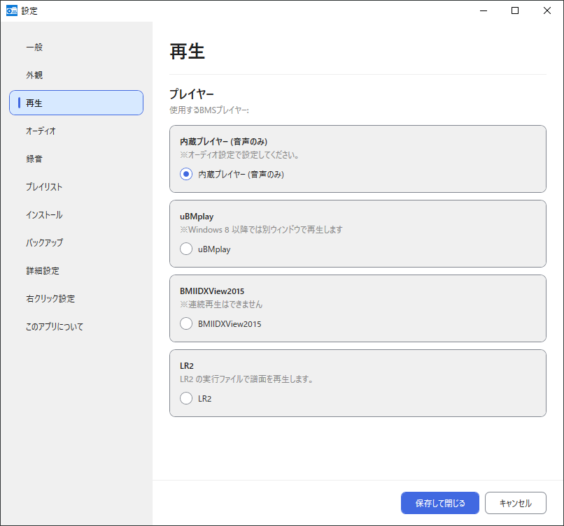
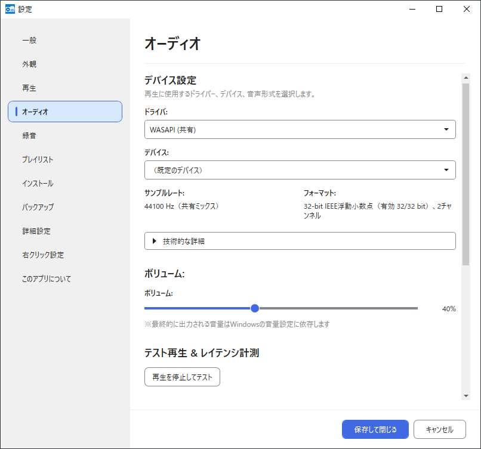

# BeMusicSeeker Unofficial Fork User Manual

[](manual.ja.md)
[](manual.md)


This manual explains BeMusicSeeker Unofficial Fork, from registering your library and searching or playing charts to installing packages, organizing files, and using playlists and play history.

## Table of Contents

- [Introduction](#introduction)
- [Initial Setup](#initial-setup)
    - [Preparing Everything 1.5 (x64)](#preparing-everything-15-x64)
    - [Migrating Existing Settings](#migrating-existing-settings)
    - [First Launch](#first-launch)
    - [Operating Mode](#operating-mode)
    - [First Scan](#first-scan)
- [Settings Dialog](#settings-dialog)
    - [General](#general)
        - [LR2 Play Log](#lr2-play-log)
    - [Appearance](#appearance)
    - [Playback](#playback)
    - [Audio](#audio)
    - [Recording](#recording)
    - [Playlist Settings](#playlist-settings)
    - [Install](#install)
    - [Backup](#backup)
    - [Advanced](#advanced)
    - [Right-click settings](#right-click-settings)
- [Startup / Reload / Progress Display](#startup--reload--progress-display)
    - [Automatic Updates](#automatic-updates)
    - [Progress Display](#progress-display)
    - [Library Reload](#library-reload)
    - [Re-run Initialization](#re-run-initialization)
    - [Playlist Reload](#playlist-reload)
- [Screen Layout](#screen-layout)
- [Library List](#library-list)
    - [Selecting and Editing Rows](#selecting-and-editing-rows)
    - [Copy Operations](#copy-operations)
    - [Context Menu](#context-menu)
    - [Tree Context Menu](#tree-context-menu)
    - [Other Popup Menus](#other-popup-menus)
- [Search](#search)
    - [Keywords and Search Conditions](#keywords-and-search-conditions)
    - [Completion, History, and Favorites](#completion-history-and-favorites)
- [Playback / Recording](#playback--recording)
    - [Playing Charts](#playing-charts)
    - [Playback Panel Controls](#playback-panel-controls)
    - [Converting to Audio Files](#converting-to-audio-files)
- [Playlists](#playlists)
    - [Playlist Summary](#playlist-summary)
    - [Playlist Detail](#playlist-detail)
    - [Downloading Main Packages and Additional Charts](#downloading-main-packages-and-additional-charts)
    - [Playlist Lamp Viewer](#playlist-lamp-viewer)
    - [Managing beatoraja Difficulty Tables](#managing-beatoraja-difficulty-tables)
    - [Import External Playlist](#import-external-playlist)
    - [Built-in Difficulty Estimates and Recommendations](#built-in-difficulty-estimates-and-recommendations)
    - [Playlist Properties](#playlist-properties)
    - [Custom Folder Output](#custom-folder-output)
    - [URL1/URL2 Completion](#url1url2-completion)
- [Install / Pending Packages](#install--pending-packages)
    - [Installation Steps](#installation-steps)
    - [New](#new)
    - [Pending](#pending)
    - [Install-Destination and Merge-Destination Estimation](#install-destination-and-merge-destination-estimation)
    - [Smart Overwrite](#smart-overwrite)
    - [Advanced Features](#advanced-features)
- [Maintenance](#maintenance)
    - [LR2 Compatibility Warnings](#lr2-compatibility-warnings)
    - [Zero-Note Search](#zero-note-search)
    - [Parse Errors](#parse-errors)
    - [Garbled Text Check](#garbled-text-check)
    - [Duplicate File Check](#duplicate-file-check)
    - [Full Resource Scan](#full-resource-scan)
- [Play Log](#play-log)
    - [Displayed History](#displayed-history)
    - [Periods and Unfinalized / Diagnostics](#periods-and-unfinalized--diagnostics)
    - [Summary](#summary)
    - [Reading Rows](#reading-rows)
    - [Display Target and FOLDER](#display-target-and-folder)
    - [Play Log Context Menu](#play-log-context-menu)
    - [Notes for beatoraja](#notes-for-beatoraja)
- [Backup / Uninstall](#backup--uninstall)
    - [Playlist Backup and Restore](#playlist-backup-and-restore)
    - [Automatic LR2 File Backups](#automatic-lr2-file-backups)
    - [Protecting Application Settings and the BMS Library](#protecting-application-settings-and-the-bms-library)
    - [Uninstalling Application Data](#uninstalling-application-data)
- [FAQ / Troubleshooting](#faq--troubleshooting)
    - [Logs / Bug Reports](#logs--bug-reports)
    - [Startup / Initialization](#startup--initialization)
    - [Download / Install](#download--install)
    - [Playlists / External Sites](#playlists--external-sites)
    - [LR2 Integration](#lr2-integration)
    - [Play Log Troubleshooting](#play-log-troubleshooting)
    - [Audio Playback and Conversion](#audio-playback-and-conversion)
    - [Maintenance Troubleshooting](#maintenance-troubleshooting)
    - [Search Troubleshooting](#search-troubleshooting)
- [References](#references)

Playlist saving, synchronization and import run one at a time through downloading and required output. Additional changes are not queued; repeat the operation after it finishes. Routine library organization and playlist changes with separate output paths can run together. Settings saving and applying are rejected while either change is running. Your edits are kept, so you can save explicitly after it finishes. A chart download can succeed while installation is busy. Download and installation results are reported separately, and unused temporary inputs owned by the app are reclaimed.

## Introduction

BeMusicSeeker combines BMS / bmson library management, search, audio playback, installation, playlists, and maintenance. Choose standalone mode or link your library and scores with LR2. You can also read beatoraja scores and export difficulty tables for beatoraja.

Start by registering your library in [Initial Setup](#initial-setup). Then use [Search](#search) to find charts and [Playback / Recording](#playback--recording) to preview or convert them. To add new works or additional charts, see [Install / Pending Packages](#install--pending-packages).

> [!CAUTION]
> Installing and organizing charts can move, delete, or overwrite actual files. LR2 integration also updates databases and configuration files. Make a [backup](#backup--uninstall) before major cleanup, and regularly keep a separate copy of your BMS library.

## Initial Setup

BeMusicSeeker Unofficial Fork is a portable application that does not require installation. Download the latest version from the [release page](https://github.com/Neeted/bemusicseeker-unofficial-fork/releases), extract it to any folder, and start it. Do not run it directly from the ZIP file; always extract it to a writable folder first.

Before extracting the ZIP, right-click the downloaded file, open `Properties`, and if an `Unblock` checkbox appears near the bottom of the window, check it and press `Apply`. This clears the safety mark Windows adds to files downloaded from the internet before the package is extracted. Applying it to the ZIP first helps avoid Windows applying extra restrictions to `BeMusicSeeker.exe` or bundled DLL files after extraction.


The application creates files such as `config/user.config` and `data/song.db` near the executable. If you place it under `Program Files`, in a read-only folder, or in a location where sync conflicts are likely, saving settings or creating the standalone DB may fail. When updating, keep `config` and `data` and overwrite the main application files with the new version.

### Preparing Everything 1.5 (x64)

If possible, install [Everything 1.5 (x64)](https://www.voidtools.com/everything-1.5/) first.

During initialization, BeMusicSeeker enumerates a large number of BMS chart files, audio files, images, videos, and related resources. When Everything is available, chart and resource-file searches can be accelerated. The application can run without it, but first scans and reloads may take a long time for large libraries.

Start BeMusicSeeker after Everything has finished indexing your BMS-related folders and can search them.

### Migrating Existing Settings

In an environment where the traditional BeMusicSeeker is already installed, existing settings are copied automatically on first launch. The destination is `config/user.config` under the folder where this application is placed. The original BeMusicSeeker settings file is not modified.

### First Launch

On first launch, an initial setup dialog with language selection is shown.


Choose a language, proceed to the settings dialog, and configure the operating mode and required items. The first scan of BMS files does not start until the required items are filled in and `Save and close` is pressed.

### Operating Mode

Choose the operating mode in the `General` settings category.

| Mode | Purpose | Required setup |
| --- | --- | --- |
| Standalone, not linked with LR2 | Manage BMS / bmson using `data/song.db` under the application folder. | Register BMS directories in `General` and a new-install destination in `Install`. |
| Linked with LR2 | Link the library, scores, and custom folders with LR2. | In addition to the above, configure the LR2 directory and custom folder output destinations. |

Standalone mode does not use LR2 scores, custom folders, or IR integration. beatoraja integration and LR2body as a playback application can be configured separately.

> [!CAUTION]
> Before saving your first LR2 linked setup, back up LR2's `song.db`, the selected LR2 configuration file (`config.xml` or `config.xmh`), and each player's `score.db`. BeMusicSeeker updates the LR2 library and configuration.

In LR2 linked mode, `song.db` is updated when charts are installed or organized. bmson is managed within BeMusicSeeker. See [General](#general) for setup and [Custom Folder Output](#custom-folder-output) for destinations. Restart the application after changing the operating mode.

### First Scan

After settings are complete, the first scan starts. The first scan checks all chart files, registers them in the DB, and creates the basic data required for install estimation and maintenance information.
Depending on library size, disk speed, and Everything availability, this may take several minutes or longer.

Once the first build is complete, later launches mainly use differential updates. If you move the entire BMS folder tree significantly, or rebuild the DB from an empty state, the heavy processing will run again.

## Settings Dialog

The settings dialog is saved when `Save and close` is pressed. Depending on the changed settings, the result may be immediate application, next-use application, score-only reload, library reload, reinitialization, or a restart request. The `Right-click settings` category is read the next time a context menu is opened.

### General


Configure the language, operating mode, BMS directories, LR2 directory, beatoraja directory, and player to use.

#### Registering BMS Directories

In either mode, register the root folders to search for charts. Use `Add` or drag folders onto the list. Avoid registering the same location twice or registering both a parent and its child. Select the new-install destination from these registered BMS directories.

#### Linked with LR2

Normally, specifying the `LR2 directory` automatically sets the standard locations for `song.db` and `config.xml` / `config.xmh`. Use each file's `Browse` button only when the standard location cannot be used. The status display identifies standard and individually configured paths.

Add or remove BMS directories through BeMusicSeeker's `General` category. LR2 database auto-update is set to manual-only when saving the initial setup and on startup.

> [!CAUTION]
> BeMusicSeeker also manages charts that LR2 cannot read. Check [LR2 Compatibility Warnings](#lr2-compatibility-warnings) and address charts that may cause problems during LR2 selection or playback.

`Resync LR2 song.db data` is unnecessary during normal use. If you encounter problems with LR2 integration, see [LR2 Cannot Select a Chart](#lr2-cannot-select-a-chart).

#### LR2 Play Log

In LR2 linked mode, you can record plays made after installing this feature. Plays made before installation cannot be restored.

> [!CAUTION]
> Installation or repair changes the selected player's `score.db`. Check the player and back up `score.db` before proceeding.

Check the `LR2 Play Log` status and use the button beside it to install or repair the feature. View recorded history in [Play Log](#play-log). For stopping recording or deleting history, see [Uninstalling Application Data](#uninstalling-application-data).

#### beatoraja Integration

Specify the beatoraja directory. BeMusicSeeker reads table and player locations from `config_sys.json` in that directory and reads scores from the selected player folder's `score.db`.

See [Managing beatoraja Difficulty Tables](#managing-beatoraja-difficulty-tables) for table import and export. For updating beatoraja's song database, you can use the separate [songdata-updater](https://github.com/Neeted/songdata-updater) tool.

### Appearance


Change settings related to themes and display. Appearance changes generally do not require rebuilding the library.

The list appearance settings adjust the shared table display used by the library list, playlist detail, play log, and playlist summary. You can change the list font size, row height, and header height. The defaults are font size `11`, row height `19`, and header height `22`.

### Playback



Select the player used to play charts. The built-in player is for simple audio-only preview playback. When using external players such as uBMplay, BMIIDXView2015, or LR2, specify the executable path.

Even in standalone mode, you can specify LR2body as the playback application. This is separate from whether the application integrates with the LR2 DB.

### Audio



Configure the internal player's output driver, device, sample rate, format, and volume. Choose `WASAPI (Shared)` (default), `WASAPI (Exclusive)`, or `ASIO`. Selecting a driver and device displays their capabilities. Changing the driver or device resets sample rate and format to Auto; changing the sample rate resets only the format to Auto.

Click `Stop playback and test` to stop current playback and test the output settings being edited. Settings controls are unavailable until the test finishes. Review the result and save the settings you want with `Save and close`. For problems, see [Audio Playback or Conversion Fails](#audio-playback-or-conversion-fails).

Advanced audio settings let you adjust low latency and buffer size for the selected driver. Smaller buffers reduce latency but may cause audio dropouts.

| Setting | Choices and default | How to choose |
| --- | --- | --- |
| Sample-rate conversion quality | `2`–`6`, default `2` | Higher values reduce conversion error and increase CPU load. Shared by playback, tests, and audio conversion. |
| Playback SRC parallelism | `1`–`4`, default `1` | `2`–`4` may improve processing speed. Audio file conversion always uses `1`. |

Changes apply from the next playback or conversion start.

> [!CAUTION]
> Playback parallelism `2`–`4` has a known issue that can omit a very short tail from resampled audio sources. Select `1` when preserving the tail matters.

Playback volume can also be adjusted from the panel. Conversion volume uses [Recording](#recording) normalization and gain, independently of playback volume and mute.

### Recording


Configure the format, quality, sample rate, sample format, volume, and filename used by `Convert to audio file`. See [Converting to Audio Files](#converting-to-audio-files) for the operation.

#### File Types and Encoders

| File type | Required external executable |
| --- | --- |
| WAVE | None |
| MP3 LAME | `lame.exe` |
| AAC Nero | `neroAacEnc.exe` |
| Opus | `opusenc.exe` |
| FLAC | `flac.exe` |
| Ogg Vorbis | `oggenc2.exe` |

For external formats, select the folder containing the required executable in `Executable search folder`. AAC Nero produces `.m4a` files. The default file type is WAVE and default quality is `0.8`. Quality is adjustable from `0.0` to `1.0` and is unused for WAVE. Sample rates are `Auto` (default), `11025`, `22050`, `32000`, `44100`, `48000`, `88200`, `96000`, `176400`, and `192000` Hz. Sample format choices are `Auto` (default), `8bit`, `16bit`, `24bit`, `32bit`, and `32bit (IEEE Float)`. The actual output format depends on the encoder.

#### Volume Normalization and Gain

| Volume normalization | Result |
| --- | --- |
| None | Output without normalization. |
| Peak level | Match volume using the maximum amplitude. |
| RMS level | Match volume using the RMS level of the entire track. |

Normalization defaults to `None` and gain to `1.0`. `Gain` adjusts the normalized volume from `0.5` to `1.5` times in `0.1` steps. Playback-panel volume and mute do not affect converted files.

> [!CAUTION]
> Conversion fails when RMS normalization or gain exceeds the range of integer audio output. Reduce gain, or choose `Peak level` with gain `1.0`. `32bit (IEEE Float)` WAVE can preserve amplitudes beyond that range.

#### Output Filenames

The default format is `[%ARTIST%] %TITLE%`. Combine the following placeholders.

| Placeholder | Content |
| --- | --- |
| `%ARTIST%` | Artist |
| `%TITLE%` | Title |
| `%GENRE%` | Genre |
| `%NO%` | Sequence number |
| `%FILE%` | Original chart filename |
| `%HASH%` | Original chart MD5 |

If an output filename already exists, an available numbered filename is used.

### Playlist Settings


Configure custom folder destinations and default folder types, the external table-list URI, URL completion, and play-log display presets.

- See [Custom Folder Output](#custom-folder-output) for LR2 destinations and folder types.
- See [URL1/URL2 Completion](#url1url2-completion) for main-package and additional-chart URLs.
- See [Import External Playlist](#import-external-playlist) for using external table lists.

#### Play Log FOLDER Display Presets

Click `Add` or `Edit`, enter a preset name, and select several playlists. Use these presets in the [Play Log Display Target and FOLDER](#display-target-and-folder) drop-down.

### Install


Select a new-install destination from the registered BMS directories and configure new-folder naming. Custom folder output destinations are excluded from the choices. See [Install / Pending Packages](#install--pending-packages) for installation steps.

`Folder name format` supports `%ARTIST%` (artist) and `%TITLE%` (title); include at least one of them. The default is `[%ARTIST%] %TITLE%`. For example, artist `Artist` and title `Song` produce `[Artist] Song` with the default format. This format is used both when creating folders during installation and by `Automatic folder renaming`.

`Restrict usable characters to Shift_JIS set` is ON by default. It replaces unsupported folder-name characters with characters representable in Shift_JIS to prioritize compatibility. It applies both to folder creation during installation and to automatic folder renaming.

### Backup


Back up or restore playlists and configure automatic backups of LR2 files. See [Backup / Uninstall](#backup--uninstall) for operations, destinations, and restoration.

### Advanced


Change advanced settings such as confirmation messages, initialization, LR2 integration, and install assistance.

If startup scanning is OFF, [reload the library](#library-reload) before estimating install destinations.

#### Advanced Settings Reference

> [!CAUTION]
> Source-package deletion and overwrite settings affect actual files. Moved source files are removed even when deletion is OFF; make a separate copy first if you want to keep the original package.

| Group | Setting | Default | Description |
| --- | --- | --- | --- |
| Message Display | Show confirmation message on registering to the chart viewer | ON | Shows a confirmation before chart viewer registration operations. |
| Message Display | Show confirmation message on diff install | ON | Shows a confirmation before operations that insert files into existing folders, such as differential install to an estimated destination. |
| Message Display | Show confirmation before installing as new | ON | Confirms before installing a pending package with no destination as new. A configured destination always requires confirmation, even when this is OFF. |
| Message Display | Show a confirmation message when merging or cleaning up in “Duplicate file check” | ON | Shows a confirmation before duplicate-file-check operations that merge folders or clean up same-folder duplicate-hash charts. |
| Message Display | Show Recommend update messages | ON | Shows a notification when a recommendation update is applied and the estimated skill changes. |
| Initialization | Scan BMS files and component files at startup | ON | Check owned-file changes on startup. When OFF, reload the library manually before using install-destination estimation. |
| Initialization | Do not check playlist updates at startup | OFF | Skips external playlist update checks on startup. Reload playlists manually if needed. |
| Initialization | Set initial selection to Install > Pending at startup | ON | Opens the pending package screen as the initial view after startup. Intended for users who want to prioritize new installs and pending cleanup. |
| Initialization | Enable song.db access optimization PRAGMAs | ON | Optimize database reading. Normally leave this ON. |
| LR2 Integration | Update LR2IR ranking cache on startup | OFF | Reads LR2IR ranking data after startup and updates display data such as `RANKING`, `RANK UPDATE`, `T-SCORE`, and `ΔMAX`. This may be heavy during the first build or after changing LR2ID, so enable it only when needed. |
| LR2 Integration | Estimate offline score rankings | OFF | Estimates ranks for charts whose local score is higher than the LR2IR score when LR2IR ranking cache data is applied. To apply this during startup, also enable `Update LR2IR ranking cache on startup`. |
| LR2 Integration | Download LR2IR scores and detect unsent IR scores | OFF | Retrieves LR2IR score information and detects unsent state from differences with local scores. |
| Install | Try to run installation automatically after download | OFF | Try automatic retrieval and installation from a single URL-cell click. Also enable startup BMS file scanning. Nested archives may require manual extraction. Multi-row URL import attempts installation regardless of this setting. |
| Install | Add to pending instead of auto-installing even for new entries | OFF | Even if enough resources are present for a new work, do not install automatically; always make it possible to confirm it in the pending list. |
| Install | Even if multiple candidates remain, use the first candidate as the install destination when its title and artist match strongly | OFF | Automatically set the first candidate when TITLE / ARTIST match strongly. Multiple-candidate warnings may remain. |
| Install | Delete the source package after a normal installation even if it still contains already-owned charts | OFF | Clean up remaining already-owned charts and empty source folders after installation. Unowned or unidentifiable remnants are retained. Moved source files are removed even when OFF. |
| Install | Optimize bundled file overwrite by comparing modified date and size on diff install | ON | Enables [Smart Overwrite](#smart-overwrite). |
| Install | During smart overwrite, keep *.bmx/*.pmx/*.txt by automatically adding numbers to their names instead of overwriting them | OFF | In [Smart Overwrite](#smart-overwrite), protected extensions are not overwritten and are kept with sequentially numbered names. |

See [Smart Overwrite](#smart-overwrite) for same-name files during additional-chart installation and duplicate-folder merging.

### Right-click settings


Edit `Open web pages` and `Open with a program` entries shared by normal lists, playlists, and Play Log. Add or delete entries and change names, enabled states, and order.

#### Registering Web Pages

Specify an absolute HTTP/HTTPS URL template and target chart type: BMS, bmson, or both. Include at least one `{md5}` or `{sha256}` placeholder; placeholders are case-sensitive. Entries are hidden for rows without a required hash. The six default entries below are all ON.

| Order | Name | URL template | Target |
| --- | --- | --- | --- |
| 1 | BMS-IR | `https://bms-ir.org/new/song?songmd5={md5}&view=both` | BMS only |
| 2 | Mocha | `https://mocha-repository.info/song.php?sha256={sha256}` | BMS / bmson |
| 3 | MinIR | `https://www.gaftalk.com/minir/#/viewer/song/{sha256}/0` | BMS / bmson |
| 4 | rianIR | `https://rianir.link/ranking?sha256={sha256}` | BMS / bmson |
| 5 | STELLAVERSE IR | `https://ir.stellabms.xyz/charts/{md5}` | BMS / bmson |
| 6 | Kaleid IR | `https://kaleidir.com/charts/{sha256}` | BMS / bmson |

#### Registering Programs

Specify a name and executable, and include `{filePath}` in the arguments. The default argument is `{filePath}`. Choosing an executable fills a blank name from its filename.

Group arguments with double quotes, for example `--file="{filePath}"`. Chart paths containing spaces are passed as one argument. Single quotes are literal characters; `{filePath}` is the only supported placeholder. The working directory is the executable's folder. Program entries require a local chart; hash-only rows use web pages only.

Correct field errors before pressing `Save and close`. Disabled entries also need valid contents. `Cancel` or closing the window discards edits. `Restore defaults` takes effect after saving.

## Startup / Reload / Progress Display

### Automatic Updates


When a newer version is found at startup, the automatic update dialog is shown. Pressing `Update` downloads the selected update package, verifies it, closes the app, and lets the updater replace the files. After the update completes, the app restarts automatically.

The dialog may offer both an app-only package and a package bundled with analyzed metadata. The app-only package updates only the application files. The metadata bundle also includes the latest analyzed metadata, making it easier to show metadata in playlists even for charts you do not currently have.

The update may wait for initialization or file operations to finish. Do not force-close the app while the update is running.

If automatic update fails, or if you prefer to inspect the release manually, press `Release Page` to open the GitHub release page and update by downloading and overwriting the zip manually.

### Progress Display

The status bar shows startup progress such as settings and file checks, chart loading, and preparation for install-destination estimation. Playlist, score, and maintenance loading may continue after the application becomes usable.


### Library Reload

`Reload` from the library context menu reflects additions, removals, and updates in your owned files. It does not rebuild the entire DB or reload scores.

Use it in cases such as these:

- You added files to a BMS folder
- You deleted files from a BMS folder
- You added or removed BMS root folders
- You moved or renamed a BMS folder outside the app

If a registered folder is unavailable, see [A Registered Folder Is Unavailable](#a-registered-folder-is-unavailable).

### Re-run Initialization

`Reinitialize` reloads library state from the database and files. Use it after editing the database with an external tool, for example. Use [Library Reload](#library-reload) for ordinary file additions and removals.

### Playlist Reload

Reloading playlists re-fetches external difficulty tables and playlist definitions.

Reloading the playlist tree root targets playlists for which external sync is enabled.
Reloading an individual playlist, or reloading from a selection in the summary, targets the selected playlists regardless of their external sync flag.

Reload failures are summarized in the playlist summary `STATUS` column and in the log.

## Screen Layout

The main screen consists of the left sidebar and the list area on the right.

The left sidebar contains trees for the library, playlists, install, maintenance, and so on. The list on the right displays the chart list, playlist detail, playlist summary, pending packages, or maintenance results depending on the selected screen.

Column widths, shown/hidden state, and display order are saved per screen. You can change visible columns from the header context menu. Column order and width can be adjusted by dragging with the mouse.

## Library List

In the library list, you can search, play, and organize registered charts.

**It has a powerful search syntax. See the [Keyword Search Syntax Guide](keyword-search-syntax-guide.md).**
You can use field specifiers such as `title:`, `artist:`, `playlist:`, and `rate:`, as well as exclusion search, OR, regular expressions, and numeric range searches. Cells with background colors in columns such as `TOTAL` and `DIFFICULTY` indicate that the value was undefined. They can be searched with terms such as `total:undef`.


Click a column header to sort. Many columns can be displayed, including `TITLE`, `ARTIST`, `PATH`, `LEVEL`, and `CLEAR`. Column visibility and order can be changed from the header context menu.

### Selecting and Editing Rows

Click for one row, `Ctrl + click` to toggle individual rows, `Shift + click` for a range, and `Ctrl + A` for all rows. Use arrow keys to move and `Shift + Up / Down` to extend the range. Press F2 or type to edit an editable cell. A normal click opens a URL cell; another click, F2, or typing edits its URL.

### Copy Operations

In lists such as the library, playlist detail, and install / pending views, you can copy displayed content from the keyboard.

- `Ctrl + C`: Copies the display value of the currently focused cell. For some columns, such as URL columns, the actual URL that will be opened is copied instead of the shortened on-screen display.
- `Ctrl + Shift + C`: Copies the selected rows in TSV format. When multiple rows are selected, the selected rows are copied together as tab-delimited text. This is useful when pasting into a spreadsheet or text editor for inspection.

### Context Menu


Right-clicking a chart row or playlist row opens operations for the selected row. The items shown vary depending on the current screen and selected row type, such as the normal library, playlist detail, unowned charts, pending, new, or maintenance screens.

#### Opening External Pages and Programs

- `Open web pages`: Enabled items from `Settings > Right-click settings` are shown in their configured order. The defaults are BMS-IR, Mocha, MinIR, rianIR, STELLAVERSE IR, and Kaleid IR; BMS-IR is BMS-only. Each entry is hidden when its URL template requires a missing MD5 or SHA-256.
- `Open main URL` / `Open diff URL`: Opens the main URL / diff URL obtained from a playlist or URL completion. When multiple rows are selected, these actions are shown as `Import selected main URLs` / `Import selected diff URLs`; after confirmation, only URLs that can be downloaded as supported files are passed to install processing. URLs that need to open in a browser are skipped without opening them, and progress is shown in the status bar.
- `Find source via external API`: In playlist detail, sends the selected rows' MD5 values to external APIs and looks for main-package source candidates. It does not use `URL1` / `URL2`, so rows with empty URLs can still be targets when an MD5 is available.
- `Open in Explorer`: Opens the folder containing the chart file in Explorer.
- `Open install destination`: Opens the folder recorded as `INSTL DST` or as the install destination.
- `Open with default app`: Opens the chart file using the OS file association.
- `Open with a program`: Runs a program configured in `Settings > Right-click settings` for a locally resolved chart.
- `Open text file`: Opens document candidates such as readme files in the same folder from a submenu.
- `Open in chart viewer`: Registers or displays the chart in the chart viewer.

#### Updating Rankings

- `Update ranking data`: Update ranking information for selected charts, even when automatic startup refresh is OFF. It depends on an external cache service; see [Cannot Retrieve Data from External Services](#cannot-retrieve-data-from-external-services) if retrieval fails.

#### Checking Encoding and File State

- `Fix character encoding`: Specifies the character encoding from options such as Japanese Shift_JIS, UTF-8, Korean KS_C_5601, Simplified Chinese GB2312, and Traditional Chinese Big5. `Mark as fixed` treats the current estimated result as confirmed.
- `File scan`: Re-scans the selected chart and resets chart health information that can be checked in places such as the full resource scan screen. `Rescan all charts` targets all charts in the library. `Add to ignore list` / `Remove from ignore list` are settings used to exclude or include charts in displays such as the full resource scan.

#### Installation and Destination Correction

- `Install` -> `Estimate install destination`: Estimates the install destination for pending charts.
- `Install` -> `Estimate merge destination`: Performs estimation for packages that contain only already-owned charts, or for resource-focused merging, without adding bundled resources to the evaluation.
- `Install` -> `Install to estimated install destination`: Installs to `INSTL DST`.
- `Install` -> `Install as new`: Treats the package as an ordinary new install without using the estimated destination.
- `Install` -> `Clear install destination`: Clears `INSTL DST`, estimated-destination display, estimation warnings, and candidates.

> [!CAUTION]
> Reinstallation moves only the target chart files, leaving bundled resources and sibling files in place. Playback requires the necessary audio and other resources at the destination, so check those resources before proceeding.

- Run `Correct install destination` → `Estimate reinstall destination`, check the estimated destination, then use `Reinstall to estimated install destination` to move the target charts there. `Clear reinstall destination` clears the candidates.

#### Moving, Deleting, and Converting Files

> [!CAUTION]
> Moving, deleting, and renaming affect actual files. `Move to` moves the entire folder, including unselected sibling charts, audio, and images. Check the target paths and keep copies of files you want to preserve. Deleting the last chart can prompt you to move the entire folder, including bundled resources, to the Recycle Bin.

- `Move to`: Moves the entire folder containing the selected charts to another library root folder selected from the menu.
- `Remove entry`: In playlist detail, removes the selected row from the playlist.
- `Delete file`: Lets you choose `Rename to invalid extension (*.bmx/*.pmx)` or `Move to Recycle bin`.
- `Automatic folder renaming`: Renames the selected chart's folder according to the folder-name format in settings.
- `Convert to audio file`: Outputs BMS / bmson chart playback as an audio file according to the recording settings in the settings dialog.

#### Removing List Items and Parse Records

- `Remove from list`: Removes the target from the new / pending / installed package display. Distinguish this from operations that delete actual files.
- `Remove metadata parse failure record`: Shown on the parse errors screen. Deletes the saved parse failure record and returns the item to the set of files to be parsed again.

In playlist detail for unowned charts, configured `Open web pages` entries, `Open main URL`, `Open diff URL`, `Find source via external API`, `Open in chart viewer`, `Update ranking data`, and `Remove entry` remain available where their row capabilities allow them. Hash-based actions, such as web pages and external APIs, require the corresponding MD5 or SHA-256. Main and additional-chart URL actions require a valid URL; `Remove entry` requires no hash.

#### Rename to Invalid Extension

Rename BMS-family charts to `.bmx` and PMS-family charts to `.pmx` so they are no longer loaded as normal charts. Use this to exclude zero-note charts or mistakenly registered files.

> [!CAUTION]
> If an identical file already exists at the destination or a numbered candidate name, the original chart is deleted as a duplicate. Keep a copy first if you need the original.

Choose `Delete file` → `Rename to invalid extension (*.bmx/*.pmx)`. If a same-name file has different contents, or a same-name folder exists, an available numbered name such as `name(1).bmx` is used. Processed charts are removed from the library list or pending package.

### Tree Context Menu

The left sidebar tree also has context menus depending on location.

Library:

- Library root: You can run `Reload`, `Reinitialize`, and `Add root folder`.
- Library folder: You can run `Reload`, `Reinitialize`, `Open in Explorer`, `Unregister root folder`, and `Batch rename folders`.
  - `Batch rename folders` may take quite a long time depending on the size of the root folder, so **normally it is recommended to narrow candidates with search and then run it from the context menu for the selected range.**

Playlists:

- Playlist root: You can run `Create new`, `Import`, and `Reload`. Import options include specifying a URL, loading from a difficulty table list, importing the Overjoy BMS difficulty estimation table, recommend tables, and so on.
- Playlist body: You can run `Reload`, `Open page`, `Override Level`, `Create new folder`, `Export`, `Remove playlist`, and `Properties`. For details on each item, see [Playlist Detail](#playlist-detail).
- Folder in playlist: You can run `Remove folder` and `Rename folder`.
- Playlist summary row: You can run `Reload`, `Open page`, `Apply current order to BMT SORT`, `Move to top of BMT SORT`, `Move to bottom of BMT SORT`, `Bulk edit...`, `Properties`, and `Remove playlist`. Reloading multiple selected rows in the summary targets the selected playlists regardless of their external sync flag.

Install:

- `New` root: `Clear all` empties the new package display.
- `Pending` root: You can run `Clear all` and `Advanced features`. For advanced features, see [Advanced Features](#advanced-features).
- Pending package: You can run `Open in Explorer`, `Open install destination`, the `Install` submenu, and `Remove from list`. The `Install` submenu contains `Estimate install destination`, `Estimate merge destination`, `Install to estimated install destination`, `Install as new`, and `Clear install destination`.
- Installed package: You can run `Open in Explorer` and `Remove from list`.

Maintenance:

- `Search zero-note charts`: You can run `Check zero-note notation`.
- Folder under `Duplicate file check`: You can run `Open in Explorer` and `Merge to`. For duplicate folder merge, see [Merge Duplicate Folders](#merge-duplicate-folders).

From the column-header context menu, you can toggle visible columns or reset column settings to their defaults. The playlist summary also has its own column display menu and column reset command.

### Other Popup Menus

Some menus are opened from buttons at the top of the screen rather than by right-clicking.

- Playback control menu: See [Playback Panel Controls](#playback-panel-controls).
- Mode filter: Switches display targets for `5KEYS`, `7KEYS`, `9KEYS`, `10KEYS`, and `14KEYS`.
- Playlist summary ownership filter: Switches between `All`, `OWNED=100%`, and `OWNED<100%`.

## Search

### Keywords and Search Conditions

Enter text in the search box at the upper right to filter the list.

Normal search is case-insensitive, and multiple words are treated as an AND search.

```text
alpha artist
```

For more precise searching, use field specifiers.

```text
title:Satellite
artist:xi
level:12
rate:>=80
playlist:"Satellite Sub"
```

### Completion, History, and Favorites

Choose search fields, playlist names, and values from the search-box suggestions. Select with Up / Down and apply with Enter or Tab. The 20 most recent searches are saved. Buttons in history rows add a search to favorites or delete it; favorites have no count limit.
For detailed syntax, see the [Keyword Search Syntax Guide](keyword-search-syntax-guide.md).

## Playback / Recording

### Playing Charts

Double-click a chart or press Enter to play it. Select the player in [Playback settings](#playback). The internal player provides BMS / bmson audio previews and supports bmson `1.0.0` and legacy `0.21`. BGA, empty-hit sounds, and mine sounds are excluded from the preview. Note-progress statistics are for preview use and may differ from game scoring.

For external playback, specify the appropriate executable. To open bmson in an external application, use an application that supports it through `Open with default app` or a similar operation.

### Playback Panel Controls

Panel buttons provide play / pause, stop, previous / next track, and rewind / fast-forward while held. Click or drag the position slider to seek. Buttons on the right change panel size and switch between artwork and player display. Available operations depend on the selected player.

The panel menu provides volume, `HS UP` / `HS DOWN`, `Info`, `Effect`, and `1P/2P`. Supported players let you change high speed, information display, effects, and play side.

| Playback mode | Behavior |
| --- | --- |
| REPEAT | Wrap from the end of the list to the beginning. Combined with SINGLE PLAY, repeat the same chart. |
| FOLDER SKIP | When moving between tracks, skip adjacent charts in the same actual folder. Use it to avoid playing another chart of the same work immediately afterward. |
| SINGLE PLAY | Stop when the chart finishes. Manual previous / next controls remain available. |

Normally, playback advances to the next playable chart in list order. Use search and sorting to choose the charts and order you want to hear.

### Converting to Audio Files

Export selected owned charts to audio files without waiting for real-time playback. Both BMS / bmson and their referenced audio resources are required.

1. Configure file type, quality, volume, and filename in [Recording](#recording), and save with `Save and close`.
2. Select charts in the list. You can select several rows at once.
3. Right-click and choose `Convert to audio file`, then select an output folder.
4. Normal playback stops and conversion begins in selection order. You can cancel from the progress display.
5. Review the success, failure, and unprocessed counts at completion, and check the files in the output folder.

Omitted audio resources are reported as warnings at completion. For failures, see [Audio Playback or Conversion Fails](#audio-playback-or-conversion-fails).

## Playlists

In BeMusicSeeker, installed difficulty tables and custom playlists can be managed as `playlists`. Playlists have a summary view for listing overall ownership status and a detail view for checking individual charts.

### Playlist Summary


The playlist summary lists each playlist's chart count, owned count, unowned count, ownership rate, external sync status, and beatoraja `.bmt` output settings. You can click `NAME`, `PREFIX`, or `SYMBOL` cells to edit them inline; If you show the hidden-by-default `FOLDER NAME` column, you can edit the playlist properties folder name from the list. When the folder name is unset, the playlist-name-derived folder name is shown with the same background color used for undefined metadata. If you show the hidden-by-default `HEADER` and `DATA` columns, you can open the resolved header and data URIs, including relative URIs resolved from the page/header URI.

From the search field at the upper right, you can switch the ownership filter between `All`, `OWNED=100%`, and `OWNED<100%`.

When you find a table whose number of unowned charts has increased, **double-click the row to move to that playlist's detail view.**

The `STATUS` column shows the result of external playlist sync performed after startup or during reload. Broken links, header retrieval failures, data retrieval failures, and similar issues can be checked here. Details are shown in the tooltip.

#### BMT SORT

`BMT SORT` controls the order of BeMusicSeeker-managed `.bmt` URLs registered in `config_sys.json` `tableURL`. Drag-and-drop reordering is available **only when the playlist summary is displayed in `BMT SORT` ascending order**. If filters are active, hidden rows keep their relative positions. Drag reorder is disabled for descending `BMT SORT` and for other sort columns. The row context menu also provides `Apply current order to BMT SORT`, `Move to top of BMT SORT`, and `Move to bottom of BMT SORT`.

`BMT OUTPUT` controls whether that playlist is included in `.bmt` output. Before stopping output, read the caution in [Hash Output and Stopping Output](#hash-output-and-stopping-output).

#### Bulk edit...

Select multiple rows and open `Bulk edit...` from the context menu to apply custom folder output types, `OUTPUT`, root folder, external sync, `.bmt` output, or initialization from external data to the selected rows. The dialog has no global OK; only the apply button in each section changes that section.

`OUTPUT` selects the normal output destination or an additional normal output. The saved `OUTPUT` value is updated even for playlists with `Make root folder` enabled, but the actual output destination remains the root folder output destination.

For custom folder output types, checked means output, unchecked means no output, and indeterminate means no change. Bulk custom folder output changes show progress in the status bar and do not regenerate `.bmt` files.

When external sync is turned on, playlists without valid URL information are skipped and reported in the result.

The external-data initialization section reloads the external playlist URL regardless of the external sync flag and resets only the checked fields. Playlists whose external URL cannot be read are skipped. While applying changes, the status bar shows progress for external data loading, saving, and custom folder output.

- Playlist name: Resets the name from the external data.
- Symbol: Resets the symbol from the external data.
- Folder prefix: Resets the folder prefix inferred from the external data.
- Folder name: Clears the saved folder name and generates it from the playlist name with invalid filename characters normalized away.

### Playlist Detail


Inspect owned and unowned charts in the playlist. Unowned charts appear as `[NO SONG]`. See [Context Menu](#context-menu) for playback and external pages, and [Downloading Main Packages and Additional Charts](#downloading-main-packages-and-additional-charts) for obtaining files.

#### Playlist Operations and Export

> [!CAUTION]
> `Override Level` changes saved library values. Deleting a playlist also deletes related custom folder output. [Back up](#playlist-backup-and-restore) any data you need before proceeding.

Right-click the playlist itself to use these operations.

- `Reload`: Re-fetch the selected playlist regardless of its external sync setting.
- `Open page`: Open its page URI in a browser.
- `Override Level`: Apply the table's levels to matching local library charts. Actual chart files are unchanged. Some tables, such as recommend tables, do not support this.
- `Create new folder`: Add a manually managed folder to a playlist without external sync.
- `Export`: Save `header.json` and `data.json`, choosing a destination for each file.
- `Remove playlist`: Remove the playlist from management.
- `Properties`: Edit [names, URIs, and folder output](#playlist-properties).

#### Creating and Editing Local Playlists

Right-click the playlist tree root and select `Create new`. With external sync OFF, drag chart rows onto the playlist itself or a folder to add them. Play-log rows corresponding to owned charts can also be added.

Edit levels, folders, URL1 / URL2, comments, and similar fields in the detail list. Drag charts to another folder to move them within the same playlist. Adding to the root of a folder-based playlist selects a suitable folder and creates one if necessary. `Remove entry` removes a row from the playlist.

### Downloading Main Packages and Additional Charts

Open main-package and additional-chart URLs from the `URL1` / `URL2` columns. [URL completion](#url1url2-completion) may fill empty URLs. To automatically retrieve and install files by clicking a single URL cell, turn ON both `Try to run installation automatically after download` and `Scan BMS files and component files at startup` in `Advanced settings`. If either is OFF, clicking opens the URL in a browser. The single-row `Open main URL` / `Open diff URL` context-menu commands open a browser.

#### Importing Multiple URLs

Select several rows and choose `Import selected main URLs` / `Import selected diff URLs` from the context menu. After confirmation, duplicate URLs are removed, downloads run in order, and automatic installation is attempted regardless of the single-download setting. Cancel through the progress display; files downloaded before cancellation still proceed to installation. Completion reports retrieved, skipped, size-limit, failed, and unprocessed counts.

Supported charts are `.bme`, `.bms`, `.bml`, `.pms`, and `.bmson`; archives are `.zip`, `.7z`, `.rar`, and `.lzh`. Automatic downloads are limited to `512 MiB` per file. Supported sources include direct links and some distribution pages on Google Drive, Dropbox, OneDrive, MediaFire, manbow, `venue.bmssearch.net`, and `bmssearch.net/bmses`. Bulk import skips Google Drive shared folders, MEGA, AXFC, and pages requiring login, CAPTCHA, or JavaScript interaction. Download those in a browser and [install by drag and drop](#installation-steps).

See [Temporary Download Storage](#where-are-downloaded-files-and-temporary-extraction-files-stored) for download and extraction locations.

#### Finding Sources through External APIs

> [!CAUTION]
> Queries send the selected chart's MD5 to external APIs. Candidates may not be official sources, and redistribution may not be authorized. Prefer the author's official distribution and read the confirmation shown each time before proceeding.

`Find source via external API` retrieves main-package candidates for owned or unowned charts with an MD5, even when URL1 / URL2 are empty. Downloadable candidates proceed to installation. If packages contain already-owned charts, merge them from Pending as needed.

### Playlist Lamp Viewer


#### How to Open

From a playlist tree item or a single playlist-summary row, choose `Open lamp viewer`. Every activation creates a fresh window, so multiple viewers for the same playlist can remain open independently. Closing the main window closes all viewers.

#### Screen Layout

The top cards show total charts, owned, missing, ownership rate, active score source, and playlist last update. A second card group shows played, unplayed, play rate, average EX score rate, and whole-playlist clear rate.

The graph area has clear lamps on the left and DJ levels on the right. Each normal folder appears in playlist order in one shared scrollable area. Both halves of a row use `folder name | stacked bar | chart count`. Empty ordinary folders remain visible with a count of zero.

Use `Percentage` / `Song count` at the top right to switch the graph display. New windows start in `Percentage`: each folder fills the bar width and segments show percentages. In `Song count`, the largest normal folder fills the width and all other folders use the same scale, making their counts comparable. Segments show counts. Song count here means playlist chart entries. The overall bars fill the width in both modes; only their segment labels change.

A segment label appears only when it fits. Hover over a segment to see its count and percentage; the percentage always refers to that folder's own chart count. Each window keeps its own display mode through date changes and data updates. Newly opened windows start in `Percentage`.

The clear order is `MAX`, `PERFECT`, `FC`, `EXHARD`, `HARD`, `NORMAL`, `EASY`, `ASSIST`, `FAILED`, `NP`. With an LR2 score source, `MAX` and `EXHARD` are omitted from every viewer surface. The DJ level order is `AAA`, `AA`, `A`, `B`, `C`, `D`, `E`, `F`, `NP`; value `MAX` is included in `AAA`. `ASSIST` includes the `INVALID` and `L_ASSIST` clear states. Check missing charts with the `Owned` and `Missing` cards; unplayed charts are counted as `NP`.

> [!NOTE]
> When LR2 is played with an option that disables score saving, the EASY clear lamp may remain even when an EASY-gauge clear history is not recorded. BeMusicSeeker treats that record as `ASSIST` in the viewer.

Average EX score rate is the arithmetic mean over played charts. Whole-playlist clear rate is `(ASSIST or better) / total`. An empty denominator is shown as localized `Unavailable`, not `0%`.

When scores are unavailable, only ownership and similar information is shown. See [Lamp Viewer Scores Are Unavailable](#lamp-viewer-scores-are-unavailable).

Segments with at least one chart show their label and count. Click a segment with the mouse, or focus it and press Enter or Space. Its tooltip shows the label, count, and percentage; very small positive percentages use a lower-bound label instead of appearing as 0%. The selected segment is visibly marked by color, border, and text. Choosing a folder segment opens the same normal folder in the main window and filters the list by that segment. Choosing a top overall segment opens the playlist root and filters across its normal folders. The current keyword search is replaced by the selected segment's condition.

#### Reproducing Past Clear Status

Select an `As of` date in the header to show clear status through the end of that day in the cards and graphs. Choose `Latest` to return to current scores.

When the active score source has history, dates range from the oldest recorded day through today. Day boundaries use system local time. Playlist membership, ownership, folders, and last update remain current. Each viewer has its own date selection; it is not saved for the next session.

If historical scores are unavailable, see [Lamp Viewer Scores Are Unavailable](#lamp-viewer-scores-are-unavailable).

### Managing beatoraja Difficulty Tables

Update difficulty tables in BeMusicSeeker and export `.bmt` caches for beatoraja. Specify the beatoraja directory in `General`. It must contain `config_sys.json` and either `beatoraja.jar` or `beatoraja.exe`. Output uses `tablepath` in `config_sys.json`.

#### Importing Table URLs and Exporting

1. Click `Import beatoraja Table URLs` to import tables registered in beatoraja. Existing tables with the same URL are retained; if a new table cannot be retrieved, restoration from beatoraja's `.bmt` cache is attempted.
2. Enable `Output .bmt files (compatibility processing for difficulty table loading)`.
3. Enable `BMT OUTPUT` for the playlists you want and arrange [BMT SORT](#bmt-sort). Table URL import places beatoraja's tables first in their existing order and moves BeMusicSeeker-only tables to the end.
4. Enable `Register .bmt URLs in config_sys.json (stabilizes song-select order)` to register managed URLs in BMT SORT order. Unmanaged URLs keep their current order.

This reduces the need to download and update the same tables separately in beatoraja.

#### Hash Output and Stopping Output

| .bmt hash output | Content |
| --- | --- |
| Original (default) | Use MD5 / SHA-256 stored in the playlist. |
| Fill missing MD5 / SHA-256 where possible | Fill missing hashes that can be resolved from owned charts or metadata. |
| Prefer SHA-256 only where possible | Use only SHA-256 when resolved; retain MD5 for other charts. |

Course hashes use the original data. This setting applies when the target table is next exported.

> [!CAUTION]
> Turning a playlist's `BMT OUTPUT` OFF removes its managed `.bmt` and registered URL at the next output. Before disabling output globally, enable `Keep existing .bmt files when output is disabled` if you want to preserve them.

With the keep-existing-files option enabled, disabling global output stops automatic re-export while retaining the existing `.bmt` files and registered URLs.

### Import External Playlist


Right-click the playlist tree root and use `Import` to add external playlists. You can choose from registered external table lists or specify a URI to load.

The default difficulty table list retrieval URI is managed by [DARKSABUN](https://darksabun.club/table/tablelist.html).


Import menus such as external table lists and recommend tables **do not close when you click a single item, so you can select and import multiple tables in sequence.**

In `Load from URL`, you can enter destination URIs across multiple lines. If you paste multiple difficulty table URLs at once, each line is treated as a load target, and external loading plus post-registration work are processed in batches. If a playlist with the same name already exists, that URL is skipped and the result dialog shows the skipped count and names after processing finishes.

Externally synced playlists can be updated by re-fetching the original difficulty table. After importing, check the sync result in the playlist summary `STATUS` column.

### Built-in Difficulty Estimates and Recommendations

The built-in difficulty estimates and recommendations integrate [Walkure Offline](https://github.com/naktazdim/walkure-offline/), the offline version of [Walkure's Insane BMS difficulty estimates and recommendations](http://walkure.net/hakkyou/index.html). No internet connection, LR2 player ID, or score upload is required.

Right-click the playlist tree root and choose `Import` → `Load built-in difficulty estimates and recommendations`.

Difficulty estimates have four types: EASY, NORMAL, HARD, and FC. To view each difficulty's star rating, right-click the chart list's column header and enable the `ENTRY LEVEL` column.

Recommendations use the LR2 or beatoraja player and score database selected in `General` settings. Targets above the current lamp with at least a 20% clear probability appear under EASY, NORMAL, HARD, or FC, sorted by probability within each group. A chart can have multiple targets. The star rating in the table name is estimated player skill; the clear probability (%) is shown in the same `ENTRY LEVEL` column.

| Recommendation type | Records used for estimation |
| --- | --- |
| Standard | Actual play records; unplayed charts are excluded. |
| Treat unplayed as FAILED | Fills unplayed model charts with FAILED, including charts outside your library. |
| Treat FAILED as unplayed | Excludes FAILED records and uses EASY or better records. |

All three types can be registered together. Reload the relevant tables after playing. Recommendation names are generated from the type and estimated skill on every reload, replacing any manual name. Display symbols, output settings, and memos are retained.

Turn on `Show Recommend update messages` to see the new skill and signed change when estimated skill changes after a reload.

### Playlist Properties

Right-click a playlist and open `Properties` to view and edit the playlist name, display symbol, external sync settings, page URI, header URI, and data URI.

Properties such as the playlist name and folder settings are saved in the in-app DB even in standalone mode. Only in LR2 linked mode is LR2 custom folder output also updated after saving.

> [!NOTE]
> The folder prefix is saved as a local setting. Even for externally synced playlists, a folder prefix changed from Properties or the playlist summary is not reset from external data during normal reloads. To restore the external-data default, use `Bulk edit...` in the playlist summary and run `Initialize from external data`.


In the `Folder` category, you can set the sort key and ascending / descending order for items inside folders, as well as the order of folders. For externally synced playlists, editing items that conflict with the sync source is restricted. If synchronization replaces a row while you are editing it, saving the old row is rejected. Select the latest row and make the edit again.


In the `Custom folder` category, you can set the output folder types, `OUTPUT`, and output names. Save changes with `OK`.

When the entry unit is folder, level-folder output and sorting by level or added date are unavailable.


### Custom Folder Output

In LR2 linked mode, playlists can be output as LR2 custom folders. LR2 custom folders are a feature that uses SQL conditions to create chart sets and show them as virtual folders on the song selection screen without moving the actual files.

BeMusicSeeker outputs difficulty tables and local playlists in this format. It is intended for uses such as selecting `★1`, `★2`, and similar folders from difficulty tables in LR2, finding only unplayed charts, or placing frequently used tables at the root of the song selection screen.

> [!CAUTION]
> Use dedicated folders for custom output and keep important data elsewhere. Output updates remove obsolete files; changing destinations or deleting playlists removes the old playlist output folder entirely. Do not place manually managed custom folders or other files inside it.

#### Setup Flow

1. In the `Playlist` category in the settings dialog, specify the `Normal output destination`, and if needed, `Additional normal output destinations` and the `Root folder output destination`. To change the initial state for new playlists and tables added from external URLs, also configure `Output folder defaults`.
2. From playlist `Properties`, configure `OUTPUT`, the output name, `Make root folder`, and the folder types to output.
3. To change multiple playlists at once, use `Bulk edit...` from the playlist summary and apply `OUTPUT`, folder output types, or `Make root folder` to the selected rows.

`OUTPUT` selects the `Normal output destination` or one of the `Additional normal output destinations` from settings. While `Make root folder` is enabled, the saved `OUTPUT` value is kept, but the actual output destination is the `Root folder output destination`. When root folder output is turned off, the playlist returns to the saved `OUTPUT` destination.

> [!IMPORTANT]
> LR2 custom folder output is an LR2 linked mode feature. Even in standalone mode, playlist names and folder settings are saved in the in-app DB, but LR2 `.lr2folder` output is not updated.

#### Output Destination Usage

Choose these locations in the `Playlist` settings category.

| Destination | Purpose | Registration conditions |
| --- | --- | --- |
| Normal output | Default location. | An existing BMS root can be adopted after confirmation; its parent or child cannot be used. |
| Additional normal output | Separate major tables, chart-author tables, personal tables, and similar groups. OUTPUT displays the folder name. | An existing BMS root can be adopted after confirmation; its parent or child cannot be used. |
| Root-folder output | Display playlists with the root-folder option ON at the root of LR2 song selection. | An existing BMS root or a parent containing existing registrations can be adopted after confirmation. A child cannot be used. |

Output destinations cannot be identical or nested. Previously used output folders can be configured again while still registered in LR2, subject to these conditions. Confirmation also identifies locations removed from song search.

Normal output remains part of song search; additional and root output do not. None appears in BMS directory settings, new-install destination choices, or the library folder tree. Changing normal output removes the old location from search and from LR2 registration unless it remains another output destination. Removing an additional destination returns its playlists to normal output.

`Output folder defaults` applies to newly created or imported playlists. Use properties or [Bulk edit](#bulk-edit) for existing tables.

#### Folder Types To Output

In the `Custom folder` category, use the checkboxes to choose which folders to output for each playlist.

| Item | Output and Usage |
|---|---|
| `All charts ALL` | Outputs the `ALL` folder that gathers every chart in the playlist. Use this when you want to open the whole table at once, or when you want clear status, DJ level, and sort folders for the whole playlist. |
| `By folder` | Outputs `.lr2folder` files for each playlist folder. This is the basic setting when you want to select folders that match the table structure, such as `★1`, `★2`, and other symbol + numeric difficulty levels. Folder sort order is configured in the `Folder` category in playlist properties. |
| `Level` | Outputs numeric level folders such as `LEVEL 1` and `LEVEL 2`. Use this when you want to gather charts by numeric level regardless of the table symbol. If the playlist contains charts without levels, `LEVEL ???` is also output. |
| `Alphabet ALL` | Outputs whole-playlist ALL folders grouped by the first letter of the title, such as `A.B.C.D.`. Use this when you want to find charts by title. Titles outside the alphabet ranges are placed in `OTHERS`. |
| `Clear` | Outputs folders by clear status. Folder names are numbered from `0 NO PLAY` through `7 P.A` so LR2's TITLE sort keeps them in status order. The output scope follows the `All charts ALL` and `By folder` selections. |
| `DJ Level` | Outputs folders split into `AAA`, `AA`, `A`, and `UNDER A`. Use this when looking for score-improvement targets. The output scope follows the `All charts ALL` and `By folder` selections. |
| `Chart category ALL` | Outputs ALL folders that gather charts matching category conditions, such as `ALL LONG NOTES`, `ALL VERY HARD JUDGES`, `ALL HARD JUDGES`, `ALL NORMAL JUDGES`, and `ALL EASY JUDGES`. Use this when you want to search from perspectives such as LN or judge difficulty. |
| `Auxiliary folders` | Outputs auxiliary folders such as `MY BEST`, `NEW SONGS`, and `REMOVED SONGS`. When LR2IR score acquisition and unsent detection are enabled, `UNSENT SONGS` is also output. |
| `Random` | This is not an independent folder type. It adds `#MAXTRACKS 1` RANDOM variants to `All charts ALL`, `By folder`, `Level`, `Clear`, and `DJ Level`. In each output location, normal folders are written first and RANDOM folders are grouped after them. |
| `BPM sort` | Outputs folders sorted by BPM ascending. Use this when choosing practice targets by BPM. The output scope follows the `All charts ALL` and `By folder` selections. |
| `BP sort` | Outputs folders sorted by lower BP first. Use this when you want to see priorities for BP improvement. The output scope follows the `All charts ALL` and `By folder` selections. |
| `Play count sort` | Outputs folders sorted by higher play count first. Use this to review charts you often play. The output scope follows the `All charts ALL` and `By folder` selections. |
| `Last play sort` | Uses play history and outputs folders sorted by newest last-play time first. Use this when you want to return to charts you played recently. The output scope follows the `All charts ALL` and `By folder` selections. |

`All charts ALL` adds the whole-playlist output scope, and `By folder` adds the per-playlist-folder output scope. `Clear`, `DJ Level`, `BPM sort`, `BP sort`, `Play count sort`, and `Last play sort` output `.lr2folder` files according to those two scope settings.

> [!NOTE]
> `2 ASSIST` under `Clear` is a folder for separating charts that received an EASY clear lamp while using assist-type options. In this state, LR2's clear lamp is equivalent to EASY, but no history remains showing that the chart was cleared with the EASY gauge, so BeMusicSeeker detects it separately from `3 EASY`.

> [!NOTE]
> LR2 / OpenLR2 reads the DB when opening a custom folder. Clear status, DJ level, BP, play count, and similar values are reflected as long as the DB has been updated, even without regenerating `.lr2folder` files after playing a chart.

> [!IMPORTANT]
> To use `Last play sort` in LR2 / OpenLR2, install [LR2 Play Log](#lr2-play-log) first.

> [!TIP]
> Increasing the number of output `.lr2folder` files may make LR2 display or DB access slower. It is easier to manage if you start with `All charts ALL`, `By folder`, and only the few types you need, then keep unused classifications turned off.

### URL1/URL2 Completion

When playlist `URL1` / `URL2` are empty, or when they point to a known dead site, URLs can be completed from external TSV files or Stella Uploader-derived information based on MD5.

Known dead sites are detected by checking whether the URL contains `gnqg.rosx.net` or `absolute.pv.land.to`. HTTP/HTTPS notation variants and URLs routed through web.archive.org are also treated as completion targets. If no completion data is available, the original URL is kept.

Completed results are first treated as runtime display information. Only when row edits are saved in a local playlist are the completed values also saved to the playlist. Editing restrictions for externally synced playlists are preserved.

In the `Playlist` category in the settings dialog, you can configure the following:

- Try completion when playlist URL1/URL2 are empty or point to a known dead site
- Also overwrite non-empty URL1/URL2 using the completion feature
- MD5-URL mapping TSV retrieval URI
- Complete URL1/URL2 using Stella Uploader (Full) data

The TSV URI can specify either HTTP/HTTPS or a local TSV file path. If the same MD5 has multiple completion sources, the TSV takes priority. Priority is judged per MD5, so if the TSV has a row for the same MD5, values from Stella Uploader (Full) are not used to fill in missing values even if URL1 or URL2 is empty on the TSV side.

## Install / Pending Packages

Supported inputs are BMS / bmson charts, work folders, and `.zip`, `.7z`, `.rar`, or `.lzh` archives. New works go to the new-install destination; additional charts for existing works can be installed from Pending.

> [!CAUTION]
> Installation moves charts and bundled resources from the source package and may delete source files or folders. Make a separate copy before drag and drop if you want to keep the original distribution.

### Installation Steps

1. Drag and drop a BMS work, differential chart, or a folder / archive containing them onto the window.
2. Items that appear to be new unowned works and have enough bundled resources are normally installed to the `New install destination` configured in the settings dialog. If `Add to pending instead of auto-installing even for new entries` is enabled in Advanced settings, they remain in Pending even when judged as new.
3. Items with few resources that appear to be differential charts for existing works are added to `Pending`, and install-destination estimation is performed.
4. Check `WARNING`, `TITLE`, `ARTIST`, `INSTL DST TITLE`, `INSTL DST ARTIST`, and related columns. If necessary, manually enter `INSTL DST` or choose it from the suggested candidates.
5. Select rows that look correct, then run `Install` -> `Install to estimated install destination` from the context menu.

You can drop multiple files or folders at once. To add more inputs during installation, wait for the current operation to finish and drop them again.

Until install-destination estimation after import finishes, additional imports, pending-package changes, new playback starts, and saving or applying settings are unavailable. Repeat the operation after processing finishes. You can still browse, search, sort, select rows, and view, edit, or cancel settings. Cancelling estimation preserves registered packages and already applied results; you can manually estimate the remaining pending packages.

During full LR2 synchronization, new playback starts and saving or applying settings are also unavailable. Your settings draft remains intact; save it explicitly after synchronization finishes. You can still browse, search, select rows, edit settings, and cancel. DB synchronization alone does not stop existing playback. Routine playlist editing and output can run alongside library operations that do not intersect managed output directories. Custom folder destinations change after settings are saved and applied; unsaved destination edits are not used.

Use [multiple-row selection](#selecting-and-editing-rows) to estimate and install several packages together.

### New

`New` shows packages immediately after installation. Temporary warnings shown before installation are re-evaluated according to the post-installation state.
For example, a differential chart by itself is typically added to `Pending` with `WAV 0%`, but after successful installation it appears under `New` with `WAV 100%`.


### Pending


`Pending` contains packages not yet installed. Check or correct their destination before installation. For pending packages restored at startup, select them and run `Install` → `Estimate install destination` from the context menu. You can also re-estimate using [Install-Destination and Merge-Destination Estimation](#install-destination-and-merge-destination-estimation).

#### Checking Destinations and WARNING

| Column | What to check |
| --- | --- |
| INSTL DST | Actual destination directory |
| INSTL DST TITLE / ARTIST | Title and artist of a representative chart at the destination |
| WARNING | Missing resources, ambiguous candidates, title or artist mismatches, and similar issues |

`WARNING` shows a `[type count] label` summary; hover for details. Several missing-resource types can share one label. Resource shortages may disappear from the summary when a destination is set, so check the details too.

| Main warning | How to decide |
| --- | --- |
| Multiple estimated / install destinations | Compare candidate locations, titles, and artists. |
| TITLE/ARTIST mismatch / Install estimation | Matching resources may still give a low-confidence result. Check that it is the correct work. |
| Missing resources | Check missing WAV, BGA, or video percentages. A standalone additional chart normally lacks resources before installation. |
| Install destination unknown / Unsupported resource path / Search limit | Read the details and specify a destination manually or re-estimate. |
| Already installed | The package contains owned charts. For resource updates, consider merging or [Advanced Features](#advanced-features). |

Estimation compares referenced audio, images, videos, owned charts, TITLE / ARTIST, and similar information. References with different relative paths, such as `sound/foo.wav` and `foo.wav`, are treated separately. If startup scanning was skipped, [reload the library](#library-reload) first.

#### Selecting or Entering a Destination

Cells with candidates show `Select a candidate…` or `▼` before the current path. Edit the cell to show up to `3` candidates, check their locations, and choose one. Multiple-candidate warnings may remain after selection.

You can enter an owned chart's full path or its containing directory. Full paths are converted to directories. Unregistered or nonexistent locations cannot be selected.

#### Removing or Deleting Pending Packages

> [!CAUTION]
> `Delete file` → `Move to Recycle bin` deletes actual files. When whole-folder deletion is selected and all charts in the package are selected, bundled resources are moved too. Multi-row operations do not confirm each folder separately; check your selection.

`Remove from list` removes ordinary user folders or manually selected archives from Pending without deleting their source files. Application-managed temporary packages created by URL import may also have their temporary files deleted.

### Install-Destination and Merge-Destination Estimation

The `Install` context menu contains several similarly named estimation operations.

`Estimate install destination` is for ordinary differential-chart installation. Resources bundled in the pending package are counted as resources that will become available after installation, and BeMusicSeeker looks for the destination that works best when combined with the existing directory. Usually, use this operation. **In other words, bundled additional audio files are also considered.**

`Estimate merge destination` is for pending packages that contain only already-owned charts, or for cases where you want to move only resources into an existing folder. It does not add bundled resources inside the pending package to the evaluation; it searches for a merge destination using only resources already present in the existing library. Existing `INSTL DST` values are overwritten. A confirmation dialog is shown before execution.

`Install to estimated install destination` installs pending packages whose `INSTL DST` is set into their estimated destinations, one package at a time in list order. Check results in New after installation. Packages whose charts all have an empty `INSTL DST` remain in Pending. Same-name collisions among bundled files are handled according to [Smart Overwrite](#smart-overwrite) in the settings dialog.

`Install as new` ignores the estimated destination and treats the package as an ordinary new installation. If a destination is configured, confirmation that it will not be used is always required. If no destination is configured, confirmation is shown by default to explain that the pending package is intentionally being installed as new, even if WARNINGs such as missing resources remain. Only the latter confirmation can be skipped by turning OFF `Show confirmation before installing as new` in Advanced settings. Rejected packages remain pending. **A typical use case is when the package shows something like `WAV 97%`, but that is known to be the original distribution state of the work.**

`Clear install destination` clears `INSTL DST`, estimated-destination title / artist, install-destination-estimation warnings, and candidate suggestions for the selected rows. Use it when you want to redo estimation.

### Smart Overwrite

Control same-name audio, BGA, images, readme files, and other resources during additional-chart installation, resource overwrite for owned packages, and duplicate-folder merging. Configure it in `Advanced settings`; the default is ON.

> [!CAUTION]
> These operations can overwrite destination files and delete source files. Make copies of the destination and source package if you need to preserve particular audio or images. Comparisons use size and modification time, not audio quality.

| Same-name file state | When ON |
| --- | --- |
| No destination file | Move the file as-is. |
| Equal size and modification times within 2 seconds | Keep the destination and delete the source. |
| Source is newer | Overwrite the destination. |
| Destination is newer or has the same modification time | Keep the destination and delete the source. |

If equal-size files differ by more than `2` seconds, the newer file is kept. Different-size files are also compared by modification time. When OFF, same-name destination files are overwritten by the source.

Enable `During smart overwrite, keep *.bmx/*.pmx/*.txt by automatically adding numbers to their names instead of overwriting them` to retain overwrite candidates ending in `.bmx`, `.pmx`, or `.txt` under available names such as `name(1).txt`. If an identical numbered file already exists, the source is deleted.

BMS / PMS / bmson chart files use adjusted names such as `chart_.bms` on same-name collisions regardless of this setting. For file/folder type conflicts, see [File Moving or Merging Fails](#file-moving-or-merging-fails).

### Advanced Features

> [!CAUTION]
> Permanent package deletion bypasses the Recycle Bin, and resource overwrite can replace existing files. Check the package and destination and keep any files you need before proceeding.


The pending tree provides advanced cleanup features.

`Delete packages containing only owned charts without using the Recycle Bin` targets pending packages where every contained chart can be identified as already owned. Folder packages are deleted as folders, single-file packages are deleted as files, and the rows are removed from the pending list. Because this bypasses the Recycle Bin, mistakes cannot be undone.

`Overwrite resources for packages containing only owned charts` is for cases where you already own the charts themselves, but want to update bundled resources such as audio files or BGA files. BeMusicSeeker resolves the destination from the hashes of already-owned charts, and processes only packages whose destination can be determined uniquely. Packages are skipped when destinations are split across multiple folders, the destination cannot be determined, there are no resources to overwrite, or similar conditions occur. Same-name file collisions follow the [Smart Overwrite](#smart-overwrite) setting. After processing, a summary shows success counts, skip reasons, and failure counts.

`Rename zero-note charts to invalid extensions (*.bmx/pmx)` reads pending chart files from disk and batch-processes only charts judged to have 0 notes. BMS-family extensions are renamed to `.bmx`, and PMS-family extensions are renamed to `.pmx`, then removed from the pending list. Files already ending in `.bmx` / `.pmx`, unsupported extensions, and charts that are not 0-note charts are skipped. Duplicate deletion or automatic numbering when the destination filename collides follows the same behavior as [Rename to invalid extension](#rename-to-invalid-extension) in the library context menu.

## Maintenance

`Maintenance` contains dedicated views for checking library state.

### LR2 Compatibility Warnings


`LR2 compatibility warnings` lists charts that may cause problems during song selection or playback in LR2. LR2 assumes CP932 / Shift_JIS filenames and old path-length limits in many parts of its processing, so BeMusicSeeker checks both the chart-file path itself and resource definitions inside BMS files, such as audio, image, and video references.

- LR2 path incompatible: The full chart-file path contains characters that cannot be represented in CP932 / Shift_JIS. LR2 may be unable to select the chart.
- LR2 path too long: The full chart-file path may exceed LR2's old path-length limits. Consider using shallower folder nesting or shorter folder / file names.
- LR2 resource incompatible: Resource definitions inside the BMS file, such as `#WAV`, `#BMP`, and `#BGA`, contain strings that LR2 cannot handle as CP932 / Shift_JIS filenames. Even if the chart itself can be selected, audio or BGA resources may fail to load correctly.
- LR2 resource path too long: The actual resource path LR2 would reference, formed by combining the chart folder and resource definition, may be too long. Consider moving the chart folder to a shorter location or shortening resource folder / file names.

A resource definition containing a parent-directory reference such as `..` is not treated as LR2-incompatible by itself. However, if the actual referenced path including the placement location becomes too long, it is subject to `LR2 resource path too long`.

BeMusicSeeker does not delete these charts; it only visualizes them as warnings. LR2 may still fail to select or play them. If necessary, rename chart files, resource files, or parent folders to CP932 / Shift_JIS-compatible names and shorter paths.

### Zero-Note Search


Inspect charts parsed as `0 notes`. Run `Check zero-note notation` from the context menu to check the actual file for notation resembling normal or long notes. A WARNING appears when the metadata and file contents disagree.

This display alone does not prove a chart is empty. `#RANDOM` / `#IF` branches and player interpretation can produce different results. Check in a player or chart viewer before excluding a chart.

### Parse Errors


Inspect charts whose metadata parsing failed and read the WARNING details for the cause. To retry after temporary load or similar problems, see [Retrying Metadata Parsing](#retrying-metadata-parsing).

### Garbled Text Check


This view checks charts with character-encoding estimation issues. Manual correction lets you choose from candidates such as Japanese, Korean, and Chinese encodings.

### Duplicate File Check


This view finds files that can be judged as the same chart and lets you inspect duplicate charts together. Both BMS-family files and bmson are compared by MD5 to find duplicate candidates.

Duplicate charts receive the `Duplicate chart` WARNING, and rows are highlighted in the list. Selecting `Duplicate file check` in the left tree shows all duplicate candidates; selecting a group under it shows that group; selecting a folder below that shows the charts inside that folder. Group and folder views include sibling charts that are not duplicates, so you can inspect the bundled contents.

Duplicate groups are built by connecting folders that contain charts with the same hash. For example, if `A` and `B` contain the same chart, and `B` and `C` contain another identical chart, `A / B / C` are treated as one cleanup target. This lets you inspect packages that are partially duplicated across multiple folders.

#### Merge Duplicate Folders

> [!CAUTION]
> Merging moves source files and may delete already-owned duplicate charts or the source folder. Same-name audio and BGA resources follow [Smart Overwrite](#smart-overwrite). Check the quality and formats you want to keep, and make copies of source files you need.

Select **the folder you want to merge away** in the duplicate-file-check tree and choose the folder to keep from `Merge to`. By default, confirm source and destination before proceeding. Turning OFF `Show a confirmation message when merging or cleaning up in “Duplicate file check”` in `Advanced settings` skips confirmation.

BMS / bmson and bundled resources are merged. Same-hash charts are deduplicated; different charts with the same filename are retained under adjusted names. The source folder is deleted when empty or containing only already-owned charts. It remains when unidentifiable files or similar items are left.

#### Continuous Cleanup with `Ctrl + G`

> [!CAUTION]
> Use `Ctrl + G` on the folder you want to merge away. Cleanup within one folder keeps one chart and moves the others to the Recycle Bin.

When a folder item is selected, pressing `Ctrl + G` works as a duplicate-cleanup shortcut.

- If there are exactly two duplicate folders, the selected folder is merged into the other folder.
- If there are three or more duplicate folders, the destination is not chosen automatically; instead, the `Merge to` context menu is opened. Check the candidates and choose the destination.
- If there is only one duplicate folder, BeMusicSeeker treats it as a case where multiple charts with the same hash exist inside the same folder, and performs duplicate-hash cleanup.

For duplicate-hash cleanup inside the same folder, one file is kept for each hash and the rest are moved to the Recycle Bin. The file to keep is chosen by preferring older modified timestamps, and if timestamps are equal, shorter filenames. By default, a confirmation dialog shows the number of files to be moved to the Recycle Bin before execution. Turn off `Show a confirmation message when merging or cleaning up in “Duplicate file check”` on the `Advanced settings` category to skip this confirmation.

After a two-folder merge or cleanup within one folder, the next duplicate group is selected if one remains. After a merge involving three or more folders, selection returns to the same group heading. Using `Ctrl + G` while checking from top to bottom lets you organize many duplicates with relatively few operations.

For failed moves or merges, see [File Moving or Merging Fails](#file-moving-or-merging-fails).

### Full Resource Scan


This view checks missing WAV, BGA, video, image, and similar resources.
`Rescan all charts` is an explicit heavy operation. Ordinary startup does not revalidate resources for all charts. If you add missing resources after installation, update the state by rescanning the relevant row or rescanning all charts.

## Play Log


The `Play Log` tree shows LR2 or beatoraja play history in the main list.

### Displayed History

In LR2 linked mode, the view shows play logs recorded in LR2's score DB. To use LR2 play logs, install them first from [LR2 Play Log in the settings dialog](#lr2-play-log). **For LR2, only plays made after installation are shown. Past plays made before installation cannot be restored as play-log rows.**

When beatoraja integration is loading scores, the view shows update history from the beatoraja player data used for score loading. LR2 and beatoraja history are not merged into one list.

### Periods and Unfinalized / Diagnostics

Choose `All`, `Today`, `Yesterday`, `Recent 7 Days`, `Recent 30 Days`, `By Date`, or `Unfinalized / Diagnostics`. `By Date` lets you choose a year, month, or day. Periods use local midnight boundaries, and recent 7/30-day ranges include today.

`Unfinalized / Diagnostics` is an LR2-only view of rows with potentially inconsistent history. See [What Is Unfinalized / Diagnostics?](#what-is-unfinalized--diagnostics).

### Summary

The dedicated summary row below the list header shows judge count, play count, playtime, SCORE / BP / COMBO / CLEAR updates, and a compact clear breakdown such as ASSIST, EASY, NORMAL, HARD, and FC. EXH is shown only when displaying beatoraja history. Clicking an update-type or clear-breakdown card filters the list by that condition.

Multiple selected cards are combined with OR, and the card filter is combined with the search box by AND. Selected cards are visually highlighted; click them again to clear the card filter.

For beatoraja, judge count, play count, and playtime are values for the period selected on the screen. They do not change when the search box, summary cards, or the top-right drop-down reduces the visible row count. If beatoraja period-summary data cannot be read, the value is shown as `-`. For loading problems, check the summary diagnostic and [logs](#logs--bug-reports).

### Reading Rows

Play-log rows show best-update transitions such as `old -> new` for SCORE, BEST DJ, BEST RATE, BP, COMBO, and CLEAR. CLEAR uses compact labels such as `NP`, `EASY`, `NORMAL`, `HARD`, `EXH`, and `FC`; CLEAR and BEST DJ color the source, arrow, and destination separately when the row is not selected. Initial BP values are shown as the value only. `TYPE` can contain multiple update kinds, such as `score bp clear`; `play` is used only when no more specific update kind applies. LR2 `OP HISTORY` shows newly achieved option history by name.

For beatoraja, only rows where a best value was updated are shown. Plays without an update, including interrupted plays, do not become list rows.

### Display Target and FOLDER

The drop-down menu at the top-right of the Play Log view switches the display target and how the FOLDER column is projected. `All` shows all history rows in the range selected in the period tree. `Preset: <name>` filters the rows to charts included in the playlists selected in `Play Log FOLDER Display Presets`, and the FOLDER column shows each playlist symbol plus level. `FOLDER: <name>` does not filter rows; it keeps the rows selected by the period tree and search box, and only projects the FOLDER column using that preset. Charts outside the preset have an empty FOLDER value. Selecting a single playlist filters to charts in that playlist and shows the playlist folder name in the FOLDER column. The last selected display target is saved and automatically selected again on the next startup when the same item is available.

### Play Log Context Menu

The play-log context menu uses the same configured `Open web pages` entries, order, and chart-kind rules as the normal list. Hash-only rows expose those entries; rows resolved to a local chart can use `Open with a program`. Explorer, chart viewer, and MD5 / SHA256 copy operations remain available.

Play-log rows that resolve to owned charts can be dragged onto a non-externally-synced playlist body or folder to add them. If the selection includes unresolved rows, that drag is not accepted as a playlist add operation.

### Notes for beatoraja

The selected score player's folder must contain `scorelog.db`. History is read-only and shows best updates for SCORE / CLEAR / BP / COMBO. BEST DJ / BEST RATE are shown when note counts are available.

Judge count, play count, and playtime come from daily totals in `score.db` for the selected period. They may differ from the row count after searching or card filtering. These values are `-` under `Unfinalized / Diagnostics`.

## Backup / Uninstall

### Playlist Backup and Restore

In the `Backup` settings category, click `Backup playlists` and choose where to save the SQL file. The default filename is `BeMusicSeeker_backup.sql`. This backup contains playlists, not actual chart or audio files.

> [!CAUTION]
> Restoring replaces current playlists with the backup contents. Back up playlists you want to retain to another file before restoring.

Click `Restore playlists`, confirm, and select the saved SQL file. The application exits after restoration; start it again afterward.

### Automatic LR2 File Backups

In LR2 linked mode, enable `Backup and optimize LR2 data` in `Backup`. Choose an existing destination folder and select `config.xml`, `song.db`, and score databases as needed. Schedule choices are daily, weekly, and monthly; retention is `1`–`10` generations.

When the schedule is due at startup, files are saved in a `yyyy-MM-dd` folder under the destination. A date is saved only once; older generations exceeding retention are removed. Successful backup also optimizes the databases. Saving the setting does not run a backup immediately, so make manual copies when you need protection just before an operation.

To restore, close BeMusicSeeker and LR2, then copy the required date folder's files back to their original locations.

### Protecting Application Settings and the BMS Library

With the application closed, copy `config/user.config` and, in standalone mode, `data/song.db`. Restore by copying them back while the application is closed. In LR2 linked mode, also protect `song.db`, the selected LR2 configuration file (`config.xml` or `config.xmh`), and each player's `score.db`.

Back up the BMS library itself regularly to another drive or location. Versioned or differential backups can help recover accidental deletion while reducing storage cost.

### Uninstalling Application Data

> [!CAUTION]
> Removing data from LR2 databases cannot be undone. Close LR2 and copy any `song.db` and player `score.db` files you need before proceeding.

Use `Advanced settings` → `Danger zone` in settings.

| Operation | Result |
| --- | --- |
| Disable / delete LR2 play log… → Remove triggers only | Stop future recording and retain existing history. |
| Disable / delete LR2 play log… → Delete tables and triggers | Stop future recording and delete existing play-log history. |
| Remove BeMusicSeeker data… | Remove BeMusicSeeker-managed data from the LR2 song database. Exit the application afterward. |

To remove the portable application itself, save needed settings, databases, and backups elsewhere, close the application, and delete its installation folder.

## FAQ / Troubleshooting

### Logs / Bug Reports

Logs are written by default to `log/application.log` and `log/install-performance.log`. Initialization, DB loading, file scanning, playlist synchronization, and similar information are recorded without a special launcher.

For how to read logs, see [BeMusicSeeker INFO Log Guide](log-level-info-guide.md).

When log files grow, older files are rotated under `log/archive/`. For bug reports, start by checking the latest `log/application.log` and `log/install-performance.log`.

### Startup / Initialization

#### A Registered Folder Is Unavailable

At startup, BeMusicSeeker checks every registered BMS directory regardless of the `Scan BMS files and component files at startup` setting. In LR2-linked mode, it also checks the normal, additional, and root folder custom output destinations. If any location cannot be found or accessed, initialization stops and a warning identifies the location. Unavailable registrations are not removed automatically.

If an external or network drive is temporarily disconnected, reconnect it. If a registered location is incorrect, correct BMS directories under `General` and custom folder output destinations under `Playlist` in Settings. If you have not yet created a folder at the intended location, create it; if access is denied, check its permissions. Creating an empty folder does not restore the charts that were previously stored there.

After correcting the problem, press `Save and close` in Settings to retry initialization. You can also reconnect the drive and restart the application. BMS directories only need to be readable; LR2 custom output destinations must also allow files to be created, written, and deleted.

#### Startup or Initialization Is Slow

- Install Everything 1.5 (x64) and check that it can search your BMS folders.
- A first build, empty DB, or large changes to BMS folders take longer than usual.
- A warning appears when Everything is unavailable and ordinary file searching is used. Check the search locations and connections.
- If no charts are found while songs remain in the existing DB, the update is skipped with a warning. Check that the BMS directories point to your song folders.

If the problem remains, check the logs described in [Logs / Bug Reports](#logs--bug-reports).

### Download / Install

#### Where Are Downloaded Files and Temporary Extraction Files Stored?

When importing playlist URLs in bulk or searching for main packages through external APIs, BeMusicSeeker creates downloaded files and temporary extraction files in the Windows temporary area. This is usually under `%TEMP%` on the C drive, in a BeMusicSeeker-managed temporary area. When importing many URLs or large main packages, make sure the C drive has enough free space.

#### When Are Temporary Files Deleted?

Archives downloaded by URL import are deleted after successful extraction. Extracted folders remain while needed for installation or Pending, and are cleaned up when no longer needed during processing or shutdown. Old temporary files left by forced termination are cleaned up on the next startup.

#### Does Removing an Item from Pending Delete the Actual Files?

Ordinary user folders and manually selected source archives are not deleted by `Remove from list` alone. To delete actual files, use `Delete file` -> `Move to Recycle bin` from the context menu. However, if the package was created in BeMusicSeeker-managed temporary storage by URL import or a similar flow, removing it from Pending may also delete the temporary source files.

### Playlists / External Sites

#### Cannot Retrieve Data from External Services

Ranking caches, IR, and source searches depend on external services. Check whether the destination is available and try again later for temporary problems. Service shutdowns or data-format changes can also prevent retrieval. Check the destination and cause recorded in the log.

#### Cannot Generate Recommendations

Check that the player and score database selected in `General` settings are correct and that the score database is accessible, then reload the relevant table.

#### Playlist `STATUS` Fails

The external difficulty-table URL may be returning 404, 403, timeout, or similar errors. Check the tooltip for `STATUS` in the playlist summary, or `playlist_reload_target_failed` in `log/application.log`.

When beatoraja Table URL import restores a table from cache, `STATUS` still shows the retrieval result for the original URL. Import success and external-sync failure can therefore appear together.

If the external site is temporarily failing, wait and reload later. If the URL has changed, you need to update the URI in playlist properties.

### LR2 Integration

#### LR2 Cannot Select a Chart

Check whether the chart appears in `LR2 compatibility warnings`. Charts containing chart paths or resource definitions that cannot be represented in CP932 / Shift_JIS, or overly long chart paths / resource reference paths, may fail selection or playback in LR2.

In LR2 linked mode, also check the `Syncing LR2 song.db` state in the status bar. If incomplete or failed work remains, LR2 may be reading an old `song.db`. Press `Retry` and let synchronization finish before starting LR2.

Even after synchronization is complete, you can use `Resync LR2 song.db data` in the settings dialog if another tool has changed the `song` / `folder` information in `song.db` and you suspect inconsistencies in the data generated for LR2.

### Play Log Troubleshooting

#### Past LR2 Plays Are Not Shown

The LR2 play log records only plays made in LR2 after the play-log feature has been installed. Plays made before installation cannot be restored in the Play Log view.

#### beatoraja Play-Log Counts or Summary Values Do Not Match the List

The beatoraja list shows only plays where a best value was updated. Judge count, play count, playtime, and similar summary values are calculated from player daily totals for the selected period. Because of this, they may not match the visible row count or search-result count.

#### What Is `Unfinalized / Diagnostics`?

This is an LR2-only diagnostic period. It shows rows that may not be consistent as a single play history item, such as when LR2 exits after updating the score but before updating player data. It does not apply to beatoraja history.

### Audio Playback and Conversion

#### Audio Playback or Conversion Fails

For internal playback, check the driver and device in `Audio`, then use `Stop playback and test`. Increase the buffer and test again for dropouts. Check panel volume and mute, and Windows volume when using WASAPI Shared.

For conversion, check the source chart, referenced audio, output folder, and external encoder executable. For integer-range overflow, follow the completion message to reduce gain, or retry with peak normalization and gain 1.0. Logs provide target and cause details.

### Maintenance Troubleshooting

#### File Moving or Merging Fails

Close other applications holding the files, and check permissions and free space. A same-name file/folder conflict stops the affected package before changes and reports the conflicting path. Check both source and destination, resolve the conflict, and retry.

#### Retrying Metadata Parsing

If the cause appears to be a temporary read failure or a timeout under high load, right-click the Parse Errors list and choose `Remove metadata parse failure record`. The next parsing run checks it again. If the same error persists, check the chart contents and supported parsing behavior.

#### Lamp Viewer Scores Are Unavailable

Check the score source, player, and database location in General settings. When historical scores are unavailable, choose `Latest` or another valid reference date. If an aggregation failure closed the viewer, check the log before reopening it.

### Search Troubleshooting

#### Search Syntax Is Unclear

See the [Keyword Search Syntax Guide](keyword-search-syntax-guide.md). It explains field-qualified searches such as `title:`, `artist:`, `playlist:`, and `rate:`, as well as exclusion search, OR, regular expressions, and numeric range search.

## References

- [Keyword Search Syntax Guide](keyword-search-syntax-guide.md)
- [BeMusicSeeker INFO Log Guide](log-level-info-guide.md)
- [Original BeMusicSeeker Release Article](https://tumblr.ribbit.xyz/post/129562866015/bemusicseeker-%E6%AD%A3%E5%BC%8F%E7%89%88%E3%82%92%E5%85%AC%E9%96%8B%E3%81%97%E3%81%BE%E3%81%97%E3%81%9F-v034)
- [Original BeMusicSeeker Manual](https://tumblr.ribbit.xyz/post/129562878360/bemusicseeker-%E3%83%9E%E3%83%8B%E3%83%A5%E3%82%A2%E3%83%AB-v030-%E5%AF%BE%E5%BF%9C%E7%89%88)
